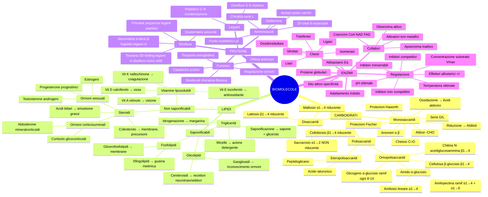
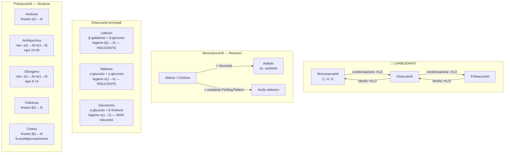
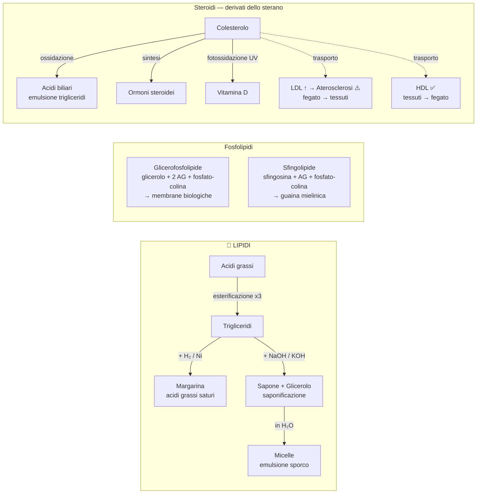
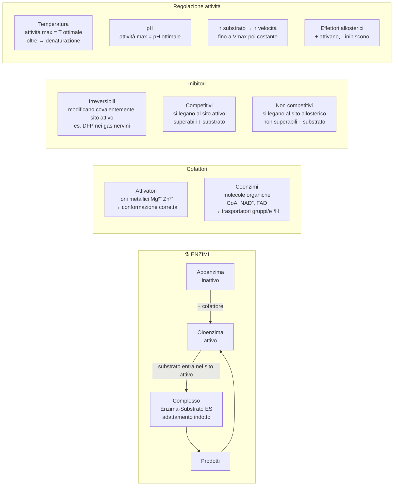

```mermaid
flowchart TD
    subgraph PROT["🧬 PROTEINE"]
        AA[Amminoacidi\n20 totali, 8 essenziali] -->|legame peptidico -H₂O| PEP[Peptide]
        PEP --> P1[Struttura Primaria\nsequenza AA — legami peptidici]
        P1 --> P2["Struttura Secondaria\nα-elica o β-foglietto\nlegami H tra C=O e N-H"]
        P2 --> P3["Struttura Terziaria\nforma 3D — legami H,\ndisolfuro, ionici, vdW"]
        P3 --> P4["Struttura Quaternaria\npiù subunità\nes. emoglobina"]
    end

    subgraph ZW["Amminoacidi — comportamento anfotero"]
        AC["pH basso\nNH₃⁺-Cα-COOH\ncatione +1"]
        ZWI["pH = pI\nNH₃⁺-Cα-COO⁻\nzwitterione 0"]
        BA["pH alto\nNH₂-Cα-COO⁻\nanione -1"]
        AC -->|"↑ pH"| ZWI
        ZWI -->|"↑ pH"| BA
    end
```

# B1 — Ripasso Biomolecole

---

## Mappa Concettuale Generale

---

## Schema Relazioni Strutturali

---

---

---

---

## Tabelle Flash — Ripasso Rapido

### Polisaccaridi a confronto

| Polisaccaride | Monomero | Legame | Struttura | Funzione | Organismo |
|---|---|---|---|---|---|
| Amilosio | α-glucosio | α(1→4) | Lineare | Riserva energetica | Vegetali |
| Amilopectina | α-glucosio | α(1→4) + α(1→6) | Ramificata ogni 24–30 | Riserva energetica | Vegetali |
| Glicogeno | α-glucosio | α(1→4) + α(1→6) | Ramificata ogni 8–14 | Riserva energetica | Animali (fegato, muscoli) |
| Cellulosa | β-glucosio | β(1→4) | Lineare + legami H tra catene | Strutturale (parete cellulare) | Vegetali |
| Chitina | N-acetilglucosammina | β(1→4) | Lineare + legami H tra catene | Strutturale (esoscheletro, parete funghi) | Insetti, crostacei, funghi |

> **Chiave**: amido e glicogeno hanno legami **α** (digeribili da noi); cellulosa e chitina hanno legami **β** (non digeribili da noi, mancano le β-glicosidasi).

---

### Disaccaridi a confronto

| Disaccaride | Monomeri | Legame | Riducente? | Origine |
|---|---|---|---|---|
| Lattosio | β-gal + β-glc | β(1→4) | ✅ Sì | Latte |
| Maltosio | α-glc + α-glc | α(1→4) | ✅ Sì | Amido in germinazione |
| Saccarosio | α-glc + β-fru | α(1→2) | ❌ No (entrambi C anomerici legati) | Canna da zucchero, barbabietola |
| Cellobiosio | β-glc + β-glc | β(1→4) | ✅ Sì | Cellulosa (idrolisi) |

---

### Vitamine liposolubili — flash card

| Vitamina | Nome | Funzione principale | Carenza |
|---|---|---|---|
| **A** | Retinolo | Rodopsina → **visione** | Cecità notturna |
| **D** | Calciferolo | Assorbimento Ca²⁺ → **ossa** | Rachitismo / Osteoporosi |
| **E** | Tocoferolo | **Antiossidante** (protegge acidi grassi insaturi) | Danno ossidativo membrane |
| **K** | Naftochinone | Sintesi protrombina → **coagulazione** | Emorragie |

---

### Strutture proteiche — flash card

| Livello | Cosa definisce | Forze |
|---|---|---|
| **1° Primaria** | Sequenza amminoacidi | Legami **peptidici** (covalenti) |
| **2° Secondaria** | α-elica / β-foglietto | Legami **a idrogeno** (C=O ··· H-N) |
| **3° Terziaria** | Forma 3D globale (folding) | Legami H, **disolfuro** (S-S), ionici, van der Waals |
| **4° Quaternaria** | Associazione subunità | Legami H, interazioni apolari, disolfuro |

---

### Enzimi — inibitori a confronto

| Inibitore | Sito di legame | Superabile? | Effetto su Vmax | Meccanismo |
|---|---|---|---|---|
| **Irreversibile** | Sito attivo (covalente) | ❌ No | $\downarrow\downarrow$ | Modifica permanente sito attivo |
| **Competitivo** | Sito attivo | ✅ Sì (↑ [S]) | Invariato (Vmax raggiungibile) | Compete con substrato |
| **Non competitivo** | Sito allosterico | ❌ No (↑ [S] non aiuta) | $\downarrow$ | Cambia conformazione enzima |

---

## Concetti da Non Confondere

| ❌ Confusione comune | ✅ Differenza corretta |
|---|---|
| Aldoso vs Chetosi | Aldoso ha **-CHO** (aldeidico); Chetosi ha **>C=O** (chetonico) interno |
| Anomero α vs β | α: -OH anomerico **sotto** (serie D, Haworth); β: -OH **sopra** |
| Epimeri vs Enantiomeri | Epimeri: differiscono per **1 solo** stereocentro; Enantiomeri: immagini speculari totali |
| Amilosio vs Amilopectina | Amilosio: lineare, solubile; Amilopectina: ramificata, insolubile |
| Grasso vs Olio | Grasso: acidi grassi **saturi**, solido; Olio: acidi grassi **insaturi**, liquido |
| LDL vs HDL | LDL → fegato ai tessuti (**"L"ettivo**); HDL → tessuti al fegato (**"H"ealthy**) |
| Apoenzima vs Oloenzima | Apo = senza cofattore (**inattivo**); Olo = con cofattore (**attivo**) |
| Inibitore competitivo vs non comp. | Competitivo: sito **attivo**, superabile; Non competitivo: sito **allosterico**, non superabile |
| Denaturazione vs Idrolisi | Denaturazione: perde **struttura** (non sequenza); Idrolisi: rompe **legami peptidici** |
| Saccarosio non riducente | Perché **entrambi** i C anomerici sono impegnati nel legame glicosidico |

---

## Reazioni Chiave — Schema Rapido

$$\boxed{\text{Condensazione:}\quad n\;\text{monosaccaridi} \xrightarrow{-nH_2O} \text{polisaccaride}}$$

$$\boxed{\text{Riduzione monosaccaride:}\quad \text{aldoso} + H_2 \rightarrow \text{alditolo (sorbitolo)}}$$

$$\boxed{\text{Ossidazione monosaccaride:}\quad \text{aldoso} + \text{Fehling/Tollens} \rightarrow \text{acido aldonico}}$$

$$\boxed{\text{Esterificazione:}\quad \text{glicerolo} + 3\;\text{acidi grassi} \xrightarrow{-3H_2O} \text{trigliceride}}$$

$$\boxed{\text{Saponificazione:}\quad \text{trigliceride} + 3\;NaOH \xrightarrow{\Delta} \text{glicerolo} + 3\;\text{sapone}}$$

$$\boxed{\text{Idrogenazione:}\quad \text{olio (insaturo)} + nH_2 \xrightarrow{Ni,\;\Delta} \text{grasso (saturo)}}$$

$$\boxed{\text{Legame peptidico:}\quad \text{amm}_1\text{-}COOH + H_2N\text{-}\text{amm}_2 \xrightarrow{-H_2O} \text{amm}_1\text{-CO-NH-}\text{amm}_2}$$

$$\boxed{NAD^+ + H^+ + 2e^- \rightleftharpoons NADH}$$

$$\boxed{FAD + 2H^+ + 2e^- \rightleftharpoons FADH_2}$$
