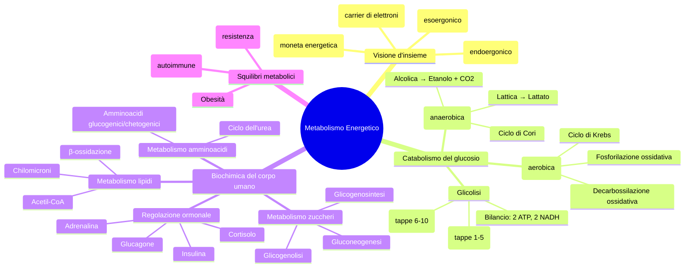
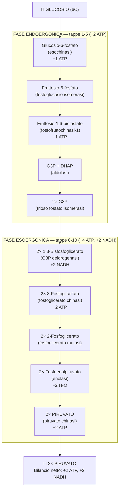
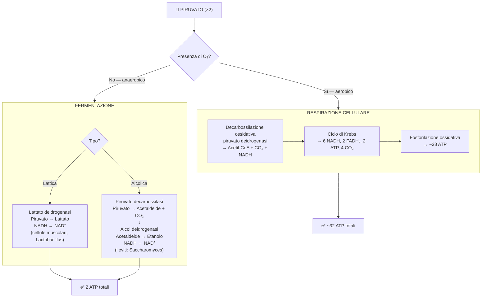
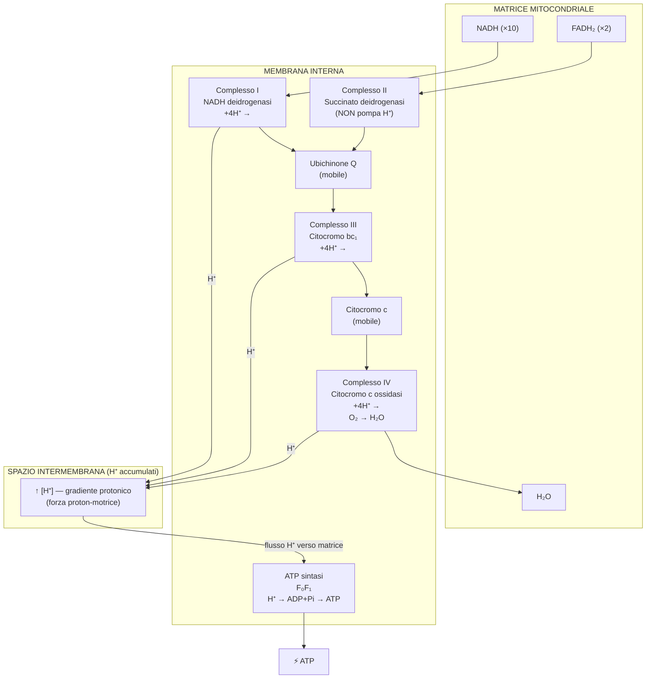
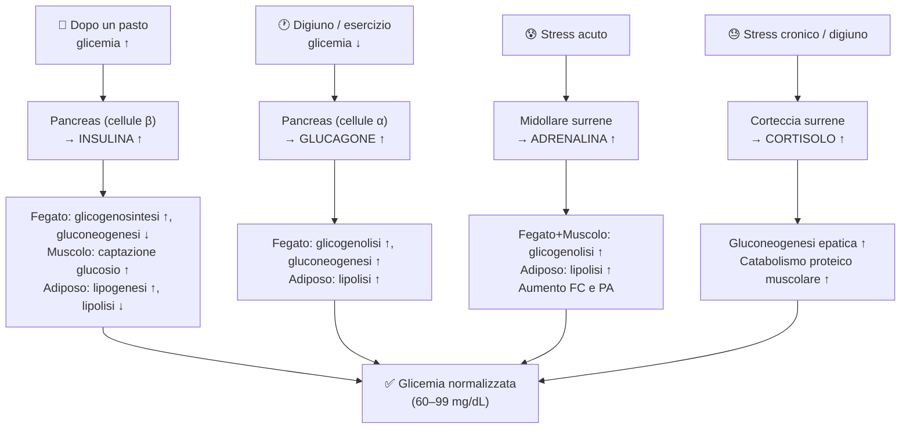

# B2 — Il Metabolismo Energetico · Ripasso Rapido

---

## Mappa mentale generale



---

## Flowchart 1 — Glicolisi



---

## Flowchart 2 — Destini del piruvato



---

## Flowchart 3 — Ciclo di Krebs

```mermaid
flowchart LR
    AC["Acetil-CoA (2C)\n+\nOssalacetato (4C)"]
    AC -->|"citrato sintasi"| CIT["Citrato (6C)"]
    CIT -->|"aconitasi"| ISO["Isocitrato (6C)"]
    ISO -->|"isocitrato deidrogenasi\n→ NADH + CO₂"| AKG["α-Chetoglutarato (5C)"]
    AKG -->|"α-chetoglutarato deidrogenasi\n→ NADH + CO₂"| SCA["Succinil-CoA (4C)"]
    SCA -->|"succinil-CoA sintetasi\n→ GTP/ATP"| SUC["Succinato (4C)"]
    SUC -->|"succinato deidrogenasi\n→ FADH₂"| FUM["Fumarato (4C)"]
    FUM -->|"fumarasi"| MAL["Malato (4C)"]
    MAL -->|"malato deidrogenasi\n→ NADH"| OAA["Ossalacetato (4C)"]
    OAA --> AC
```



> Per ogni ciclo (1 Acetil-CoA): **3 NADH + 1 FADH₂ + 1 GTP + 2 CO₂**
> Per 1 glucosio (2 giri): **6 NADH + 2 FADH₂ + 2 ATP + 4 CO₂**

---

## Flowchart 4 — Catena respiratoria + ATP sintasi



---

## Flowchart 5 — Regolazione glicemica



---

## Tabelle flash

### Bilancio energetico: glicolisi vs respirazione

| Fase | ATP diretto | NADH prodotti | FADH₂ prodotti | ATP da carrier | ATP totale fase |
|---|---|---|---|---|---|
| **Glicolisi** | +2 | +2 | — | +5 | **7** |
| **Decarbossilazione ossidativa** | — | +2 | — | +5 | **5** |
| **Ciclo di Krebs** | +2 | +6 | +2 | +18 | **20** |
| **TOTALE respirazione** | **4** | **10** | **2** | **28** | **≈ 32** |
| **Fermentazione** | **2** | 0 (riossidato) | — | — | **2** |

### Confronto fermentazione lattica vs alcolica

| | **Fermentazione lattica** | **Fermentazione alcolica** |
|---|---|---|
| Prodotto finale | Lattato ($CH_3CHOHCOO^-$) | Etanolo + $CO_2$ |
| N° tappe | 1 | 2 |
| Enzimi | Lattato deidrogenasi | Piruvato decarbossilasi → Alcol deidrogenasi |
| $CO_2$ prodotta | ❌ No | ✅ Sì |
| NAD⁺ rigenerato | ✅ Sì | ✅ Sì |
| Organismi | Muscolo, *Lactobacillus* | *Saccharomyces* (lieviti) |
| Usi industriali | Yogurt, formaggi | Birra, vino, pane |

### Tappe del ciclo di Krebs con prodotti

| # | Da | A | Enzima | Prodotti |
|---|---|---|---|---|
| 1 | Acetil-CoA + Ossalacetato | Citrato | Citrato sintasi | — |
| 2 | Citrato | Isocitrato (via *cis*-aconitato) | Aconitasi | — |
| 3 | Isocitrato | α-Chetoglutarato | Isocitrato deidrogenasi | NADH + CO₂ |
| 4 | α-Chetoglutarato | Succinil-CoA | α-Chetoglutarato deidrogenasi | NADH + CO₂ |
| 5 | Succinil-CoA | Succinato | Succinil-CoA sintetasi | GTP/ATP |
| 6 | Succinato | Fumarato | Succinato deidrogenasi | FADH₂ |
| 7 | Fumarato | Malato | Fumarasi | — |
| 8 | Malato | Ossalacetato | Malato deidrogenasi | NADH |

### Ormoni e loro effetti metabolici

| Ormone | Origine | Stimolo | Glicemia | Fegato | Muscolo | Adiposo |
|---|---|---|---|---|---|---|
| **Insulina** | Pancreas β | Glicemia ↑ | **↓** | Glicogenosintesi ↑, gluconeogenesi ↓ | Captazione glucosio ↑ | Lipogenesi ↑, lipolisi ↓ |
| **Glucagone** | Pancreas α | Glicemia ↓ | **↑** | Glicogenolisi ↑, gluconeogenesi ↑ | — | Lipolisi ↑ |
| **Adrenalina** | Midollare surrene | Stress acuto | **↑** | Glicogenolisi ↑ | Glicogenolisi ↑ | Lipolisi ↑ |
| **Cortisolo** | Corteccia surrene | Stress cronico | **↑** | Gluconeogenesi ↑ | Catabolismo proteine ↑ | — |

---

## Equazioni chiave in LaTeX

**Glicolisi (netto):**

$$C_6H_{12}O_6 + 2\,\text{NAD}^+ + 2\,\text{ADP} + 2\,P_i \rightarrow 2\,\text{Piruvato} + 2\,\text{NADH} + 2H^+ + 2\,\text{ATP} + 2\,H_2O$$

**Fermentazione lattica:**

$$C_6H_{12}O_6 + 2\,\text{ADP} + 2\,P_i \rightarrow 2\,\text{Lattato} + 2\,\text{ATP} + 2\,H_2O$$

**Fermentazione alcolica:**

$$C_6H_{12}O_6 + 2\,\text{ADP} + 2\,P_i \rightarrow 2\,\text{Etanolo} + 2\,CO_2 + 2\,\text{ATP} + 2\,H_2O$$

**Decarbossilazione ossidativa:**

$$\text{Piruvato} + CoA + \text{NAD}^+ \xrightarrow{\text{piruvato deidrogenasi}} \text{Acetil-CoA} + CO_2 + \text{NADH}$$

**Respirazione cellulare completa:**

$$C_6H_{12}O_6 + 6\,O_2 \rightarrow 6\,CO_2 + 6\,H_2O + 32\,\text{ATP}$$

**Reazione finale della catena respiratoria (Complesso IV):**

$$O_2 + 4e^- + 4H^+ \rightarrow 2\,H_2O$$

**Sintesi ATP da ATP sintasi:**

$$\text{ADP} + P_i \xrightarrow{F_0F_1\text{-ATP sintasi}} \text{ATP} + H_2O$$

---

## Concetti da non confondere

| ⚠️ Concetto A | ⚠️ Concetto B | Come distinguerli |
|---|---|---|
| **Glicolisi** | **Gluconeogenesi** | Glicolisi = degradazione glucosio (↓); Gluconeogenesi = sintesi glucosio (↑) da piruvato/lattato/amminoacidi |
| **Glicogenosintesi** | **Gluconeogenesi** | Glicogenosintesi = glucosio → glicogeno (deposito); Gluconeogenesi = precursori non glucidici → glucosio libero |
| **Glicogenolisi** | **Gluconeogenesi** | Glicogenolisi = rompe il glicogeno già presente; Gluconeogenesi = costruisce glucosio da zero |
| **Fermentazione lattica** | **Respirazione aerobica** | Fermentazione = anaerobica, 2 ATP, prodotto = lattato; Respirazione = aerobica, 32 ATP, prodotti = H₂O + CO₂ |
| **NAD⁺** (ossidato) | **NADH** (ridotto) | NAD⁺ = accetta elettroni (si riduce a NADH); NADH = dona elettroni alla catena respiratoria (si ossida) |
| **Fosforilazione a livello del substrato** | **Fosforilazione ossidativa** | A livello del substrato = ATP fatto direttamente (glicolisi, Krebs); Ossidativa = ATP fatto grazie al gradiente protonico |
| **Complesso I** | **Complesso II** | Complesso I: usa NADH, pompa 4H⁺; Complesso II: usa FADH₂, **NON** pompa H⁺ → FADH₂ produce meno ATP |
| **Insulina** | **Glucagone** | Insulina abbassa glicemia (post-pasto); Glucagone alza glicemia (digiuno) — antagonisti pancreas |
| **Diabete tipo 1** | **Diabete tipo 2** | Tipo 1 = autoimmune, no insulina prodotta, sempre terapia insulinica; Tipo 2 = resistenza/carenza parziale, correlato a obesità |
| **β-ossidazione** | **Biosintesi acidi grassi** | β-ossidazione = catabolismo nel **mitocondrio** (produce Acetil-CoA); Biosintesi = anabolismo nel **citoplasma** |

---

## Scheda riassuntiva ultra-rapida

```
GLUCOSIO
   │
   ▼ GLICOLISI (citosol) → 2 ATP + 2 NADH
   │
   ▼ PIRUVATO
   ├── [anaer.] FERMENTAZIONE → 2 ATP totali
   │           lattica: → lattato
   │           alcolica: → etanolo + CO₂
   │
   └── [aer.] DECARBOSSILAZIONE OSSIDATIVA → Acetil-CoA + CO₂ + NADH
                │
                ▼ CICLO DI KREBS (matrice) → 2 ATP + 6 NADH + 2 FADH₂ + 4 CO₂
                │
                ▼ FOSFORILAZIONE OSSIDATIVA (membrana interna)
                  Catena: Complesso I → Q → III → cit.c → IV → O₂ → H₂O
                  Gradiente H⁺ → ATP sintasi (F₀F₁) → ~28 ATP
                  TOTALE: ~32 ATP
```

---

*Fine B2-ripasso.md*
