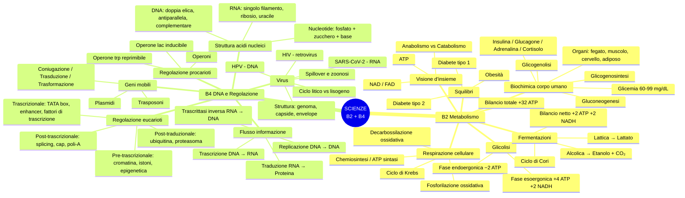
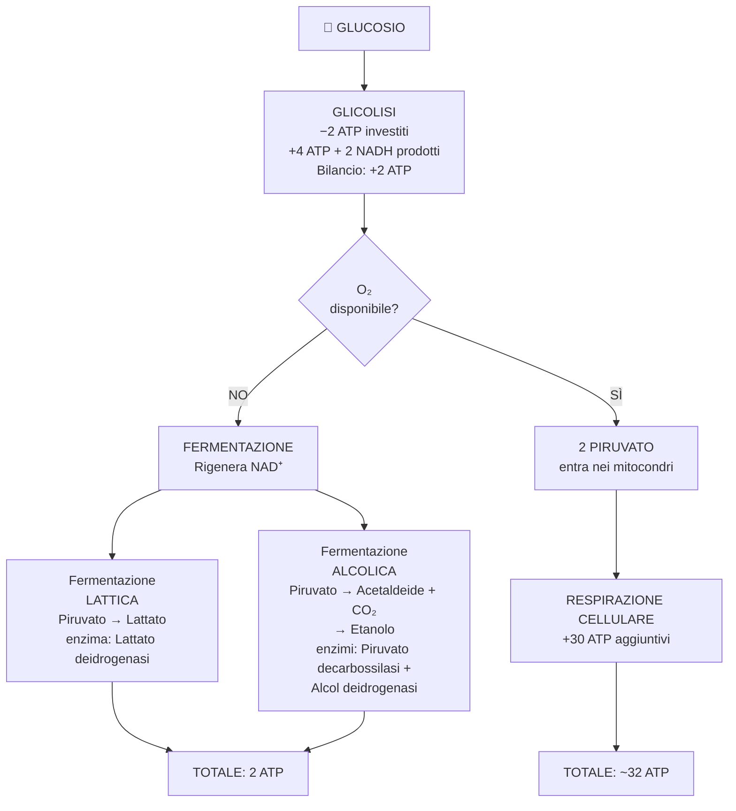
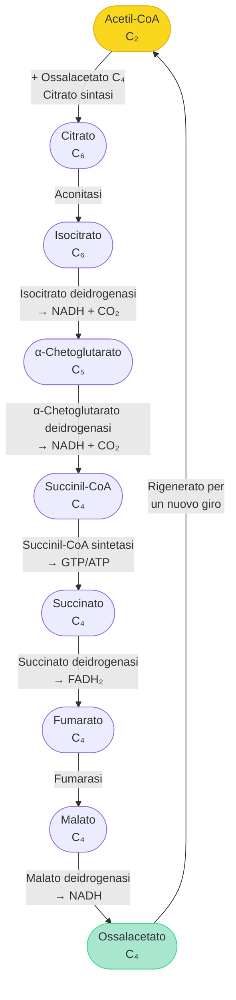
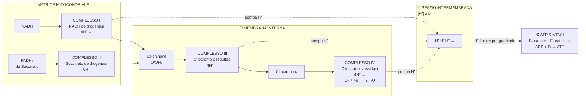
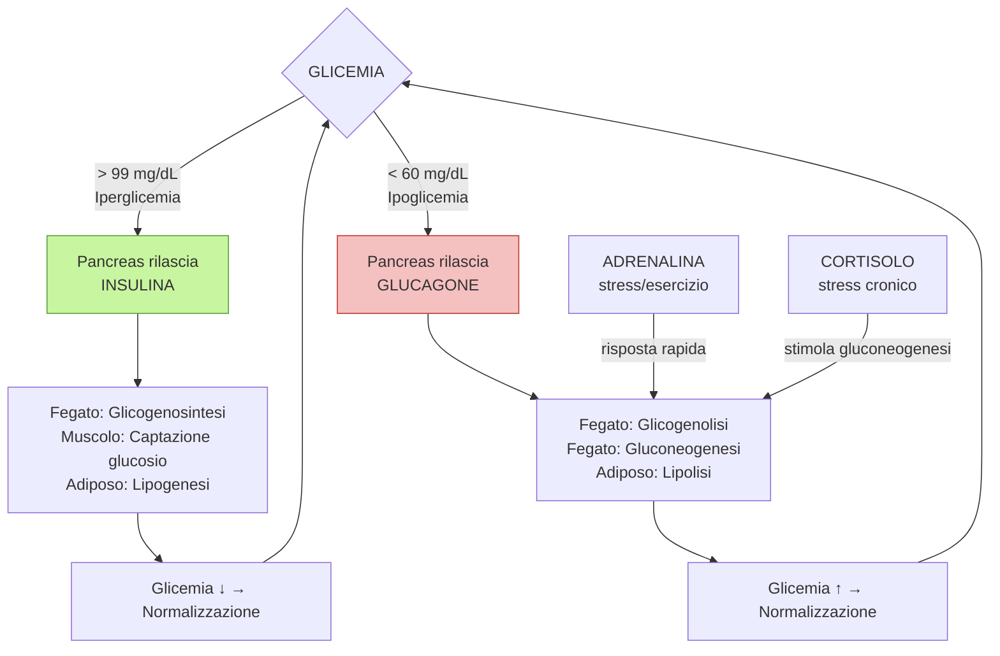
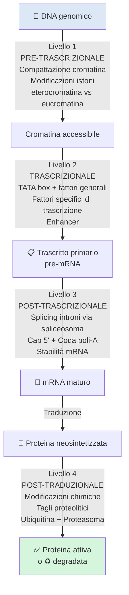
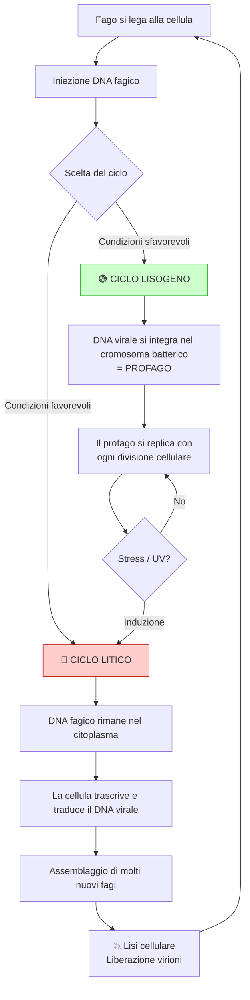

# B2 + B4 — Ripasso Rapido
## Metabolismo Energetico & DNA e Regolazione Genica

---

## Mappa Mentale Globale (B2 + B4)



---

## Flowchart 1 — Destini del Glucosio



---

## Flowchart 2 — Ciclo di Krebs



---

## Flowchart 3 — Catena Respiratoria + ATP Sintasi



---

## Flowchart 4 — Regolazione Glicemica



---

## Flowchart 5 — Flusso dell'Informazione Genetica

```mermaid
flowchart LR
    A([🧬 DNA]) -->|Replicazione\nElicasi + Primasi\n+ DNA polimerasi| A
    A -->|Trascrizione\nRNA polimerasi\npromotore → terminatore| B([📋 pre-mRNA])
    B -->|Processing:\nSplicing spliceosoma\nCap 5' + Poli-A 3'| C([📄 mRNA maturo])
    C -->|Esportazione dal nucleo| D([🏭 Ribosoma])
    D -->|Traduzione\ntRNA + ribosoma\nAUG → Stop| E([🔩 Polipeptide])
    E -->|Folding + modificazioni\npost-traduzionali| F([✅ Proteina funzionale])
    A2([🔴 RNA] ) -->|Trascrittasi inversa\nRetrovirus: HIV| A3([DNA])
    style A2 fill:#ff9999
    style A3 fill:#99ccff
```

---

## Flowchart 6 — Operone *lac* (Sistema Inducibile)

```mermaid
flowchart TD
    subgraph OFF["❌ LATTOSIO ASSENTE — Operone SPENTO"]
        R1[Repressore attivo] -->|si lega all'operatore| OP1[Operatore bloccato]
        OP1 -->|RNA polimerasi\nnon può procedere| G1["Geni lac NON trascritti\nbeta-galattosidasi, permeasi..."]
    end
    subgraph ON["✅ LATTOSIO PRESENTE — Operone ACCESO"]
        L[Lattosio → Allolattosio\ninduttore] -->|si lega al repressore| R2[Repressore inattivo\nnon lega l'operatore]
        R2 --> OP2[Operatore libero]
        OP2 -->|RNA polimerasi\npuò procedere| G2["Geni lac TRASCRITTI\nbeta-galattosidasi, permeasi..."]
        G2 --> MET["Metabolismo del lattosio ✓"]
    end
```



---

## Flowchart 7 — Operone *trp* (Sistema Reprimibile)

```mermaid
flowchart TD
    subgraph ON["✅ TRIPTOFANO ASSENTE — Operone ACCESO"]
        R1[Repressore inattivo\nnon lega l'operatore] --> OP1[Operatore libero]
        OP1 -->|RNA polimerasi\nprocede| G1["Geni trp TRASCRITTI\nenzimi biosintesi Trp"]
        G1 --> SIN["Sintesi triptofano ✓"]
    end
    subgraph OFF["❌ TRIPTOFANO IN ECCESSO — Operone SPENTO"]
        TRP[Triptofano\ncorepressore] -->|si lega al repressore| R2[Repressore attivo]
        R2 -->|si lega all'operatore| OP2[Operatore bloccato]
        OP2 -->|RNA polimerasi\nbloccata| G2["Geni trp NON trascritti\nfeedback negativo"]
    end
```



---

## Flowchart 8 — 4 Livelli di Regolazione Eucariotica



---

## Flowchart 9 — Ciclo Litico vs Lisogeno



---

## Tabelle Flash

### Bilancio energetico: Fermentazione vs Respirazione

| | **Fermentazione** | **Respirazione cellulare** |
|---|---|---|
| Condizioni | Anaerobiche | Aerobiche |
| ATP prodotto | **2 ATP** | **~32 ATP** |
| Prodotti finali | Lattato o Etanolo + $CO_2$ | $CO_2$ + $H_2O$ |
| Ossidazione glucosio | Incompleta | Completa |
| NAD⁺ rigenerato | Sì (tramite fermentazione) | Sì (tramite catena respiratoria) |

---

### Fermentazione lattica vs alcolica

| | **Fermentazione lattica** | **Fermentazione alcolica** |
|---|---|---|
| Organismo | Muscolo, *Lactobacillus* | Lieviti (*Saccharomyces*) |
| Prodotto finale | **Lattato** | **Etanolo + $CO_2$** |
| N° reazioni | 1 | 2 |
| Enzima(i) | Lattato deidrogenasi | Piruvato decarbossilasi + Alcol deidrogenasi |
| Applicazioni | Yogurt, formaggi | Birra, vino, pane |

---

### Tappe del Ciclo di Krebs con prodotti

| Tappa | Da → A | Prodotti energetici |
|---|---|---|
| 1 | Acetil-CoA + Ossalacetato → Citrato | — |
| 2 | Citrato → Isocitrato | — |
| 3 | Isocitrato → α-Chetoglutarato | NADH + $CO_2$ |
| 4 | α-Chetoglutarato → Succinil-CoA | NADH + $CO_2$ |
| 5 | Succinil-CoA → Succinato | GTP/ATP |
| 6 | Succinato → Fumarato | $\text{FADH}_2$ |
| 7 | Fumarato → Malato | — |
| 8 | Malato → Ossalacetato | NADH |
| **Totale/giro** | | **3 NADH + 1 FADH₂ + 1 GTP** |

---

### Ormoni e effetti metabolici

| Ormone | Prodotto da | Effetto glicemia | Glicogenosintesi | Glicogenolisi | Gluconeogenesi | Lipogenesi |
|---|---|---|---|---|---|---|
| **Insulina** | Cellule β pancreas | ↓ | ↑ | ↓ | ↓ | ↑ |
| **Glucagone** | Cellule α pancreas | ↑ | ↓ | ↑ | ↑ | ↓ |
| **Adrenalina** | Midollare surrene | ↑ | ↓ | ↑ | ↑ | ↓ |
| **Cortisolo** | Corticale surrene | ↑ | ↓ | — | ↑ | — |

---

### DNA vs RNA

| Caratteristica | **DNA** | **RNA** |
|---|---|---|
| Zucchero | 2-Desossiribosio | Ribosio |
| Basi | A, G, C, **T** | A, G, C, **U** |
| Struttura | Doppia elica | Singolo filamento |
| Stabilità | Alta | Bassa |
| Localizzazione | Nucleo, mitocondri | Nucleo → citoplasma |
| Funzione | Archivio informazione genetica | Trasmissione + traduzione |

---

### Operone *lac* vs operone *trp*

| Caratteristica | **Operone *lac*** | **Operone *trp*** |
|---|---|---|
| Via metabolica | Catabolica (demolizione lattosio) | Anabolica (sintesi triptofano) |
| Tipo di sistema | **Inducibile** | **Reprimibile** |
| Stato di default | *Spento* (OFF) | *Acceso* (ON) |
| Molecola chiave | *Allolattosio* (induttore) | *Triptofano* (corepressore) |
| Meccanismo ON | Induttore distacca repressore dall'operatore | Assenza di corepressore → repressore inattivo |
| Meccanismo OFF | Repressore libero blocca operatore | Corepressore attiva repressore → blocca operatore |
| Logica biologica | Si accende quando il substrato è disponibile | Si spegne quando il prodotto è in eccesso |

---

### 4 Livelli di regolazione eucariotica

| Livello | Fase | Meccanismo principale | Attori chiave |
|---|---|---|---|
| **1** | Pre-trascrizionale | Compattazione della cromatina | Istoni, metilazione, acetilazione, codice istonico |
| **2** | Trascrizionale | Controllo dell'RNA polimerasi | TATA box, fattori generali e specifici di trascrizione, enhancer |
| **3** | Post-trascrizionale | Maturazione e stabilità dell'mRNA | Spliceosoma, cap 5', coda poli-A, miRNA |
| **4** | Post-traduzionale | Attività e degradazione delle proteine | Modificazioni chimiche, tagli proteolitici, ubiquitina, proteasoma |

---

## Concetti da non confondere

### Da B2 — Metabolismo Energetico

1. **Anabolismo ≠ Catabolismo**
   - *Anabolismo:* sintesi di molecole complesse, endoergonico, consuma ATP
   - *Catabolismo:* degradazione di molecole, esoergonico, produce ATP

2. **Glicolisi ≠ Gluconeogenesi**
   - *Glicolisi:* glucosio → piruvato (catabolismo, produce 2 ATP)
   - *Gluconeogenesi:* precursori non glucidici → glucosio (anabolismo, consuma ATP); le tappe sono simili ma inverse e usano enzimi diversi nelle 3 reazioni irreversibili

3. **Fermentazione ≠ Respirazione cellulare**
   - *Fermentazione:* rigenera NAD⁺ senza consumare O₂, produce solo 2 ATP totali
   - *Respirazione:* ossidazione completa con O₂, produce ~32 ATP

4. **Glicogenolisi ≠ Gluconeogenesi**
   - *Glicogenolisi:* mobilizzazione del glicogeno già immagazzinato → glucosio
   - *Gluconeogenesi:* sintesi di nuovo glucosio da precursori non glucidici (lattato, piruvato, amminoacidi)

5. **Fosforilazione a livello del substrato ≠ Fosforilazione ossidativa**
   - *A livello del substrato:* il fosfato è ceduto direttamente da un metabolita all'ADP (es. nella glicolisi, tappe 7 e 10)
   - *Ossidativa:* ATP è prodotto dall'ATP sintasi usando il gradiente protonico (mitocondrio)

### Da B4 — DNA e Regolazione Genica

6. **Nucleoside ≠ Nucleotide**
   - *Nucleoside:* base azotata + zucchero (legame N-glicosidico)
   - *Nucleotide:* nucleoside + gruppo fosfato (legame estereo)

7. **Trascrizione ≠ Traduzione**
   - *Trascrizione:* DNA → RNA (nel nucleo, RNA polimerasi)
   - *Traduzione:* mRNA → Proteina (nel citoplasma, ribosomi + tRNA)

8. **Operone *lac* (inducibile) ≠ Operone *trp* (reprimibile)**
   - *lac:* spento di default, si accende in presenza del substrato (lattosio/allolattosio)
   - *trp:* acceso di default, si spegne in presenza del prodotto finale (triptofano)

9. **Eterocromatina ≠ Eucromatina**
   - *Eterocromatina:* condensata, DNA inaccessibile, trascrizione *inibita*
   - *Eucromatina:* rilassata, DNA accessibile, trascrizione *attiva*

10. **Ciclo litico ≠ Ciclo lisogeno**
    - *Litico:* il virus si replica rapidamente, uccide la cellula ospite per lisi
    - *Lisogeno:* il DNA virale si integra (profago) e rimane silente; si trasmette alle cellule figlie

11. **Codone ≠ Anticodone**
    - *Codone:* tripletta di basi sull'mRNA che specifica un amminoacido
    - *Anticodone:* tripletta complementare sul tRNA che riconosce il codone

12. **Introni ≠ Esoni**
    - *Introni:* sequenze non codificanti rimosse dallo spliceosoma
    - *Esoni:* sequenze codificanti unite nell'mRNA maturo

---

## Equazioni chiave in LaTeX

**Glicolisi (bilancio netto):**
$$\text{Glucosio} + 2\,\text{NAD}^+ + 2\,\text{ADP} + 2\,P_i \rightarrow 2\,\text{Piruvato} + 2\,\text{NADH} + 2\,H^+ + 2\,\text{ATP} + 2\,H_2O$$

**Fermentazione lattica:**
$$\text{Glucosio} + 2\,\text{ADP} + 2\,P_i \rightarrow 2\,\text{Lattato} + 2\,\text{ATP} + 2\,H_2O$$

**Fermentazione alcolica:**
$$\text{Glucosio} + 2\,\text{ADP} + 2\,P_i \rightarrow 2\,\text{Etanolo} + 2\,CO_2 + 2\,\text{ATP} + 2\,H_2O$$

**Decarbossilazione ossidativa:**
$$\text{Piruvato} + \text{CoA-SH} + \text{NAD}^+ \xrightarrow{\text{Piruvato deidrogenasi}} \text{Acetil-CoA} + CO_2 + \text{NADH} + H^+$$

**Bilancio ciclo di Krebs (per giro):**
$$\text{Acetil-CoA} + 3\,\text{NAD}^+ + \text{FAD} + \text{ADP} + P_i + 2\,H_2O \rightarrow 2\,CO_2 + 3\,\text{NADH} + \text{FADH}_2 + \text{ATP} + \text{CoA-SH}$$

**Riduzione dell'ossigeno (Complesso IV):**
$$O_2 + 4\,e^- + 4\,H^+ \rightarrow 2\,H_2O$$

**Respirazione cellulare completa:**
$$C_6H_{12}O_6 + 6\,O_2 \rightarrow 6\,CO_2 + 6\,H_2O + 32\,\text{ATP}$$

**Sintesi ATP dall'ATP sintasi:**
$$\text{ADP} + P_i \xrightarrow{\text{ATP sintasi} + \Delta\mu_{H^+}} \text{ATP} + H_2O$$

---

*Ripasso elaborato da B2-raw.md e B4-raw.md — Scienze Naturali Chimiche e Biologiche*
