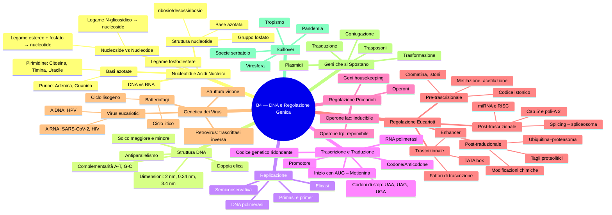
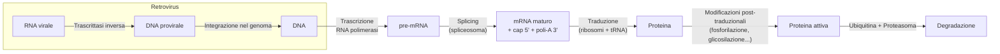
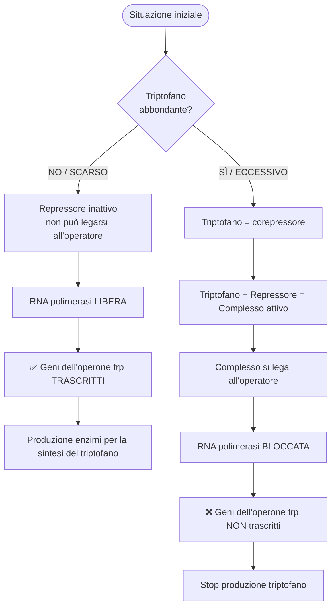
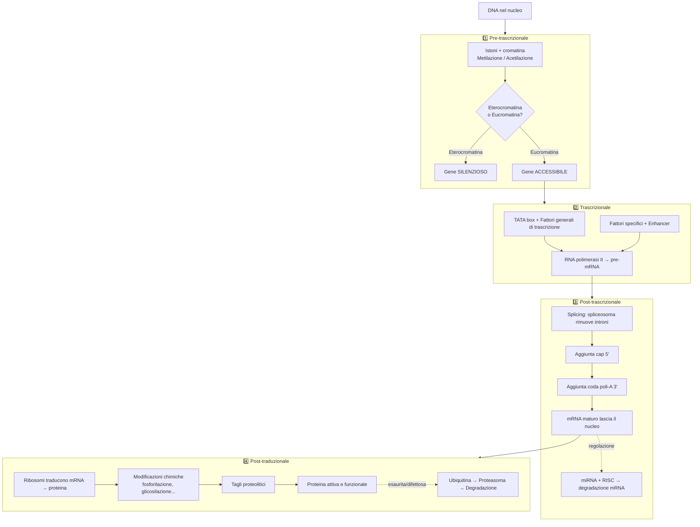
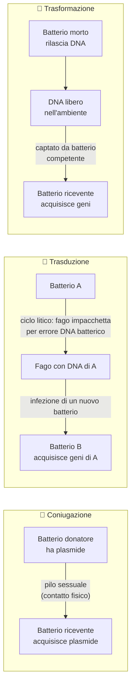

# B4 — Ripasso Rapido: Il DNA e la Regolazione Genica

> Schede flash, mappe e flowchart per il ripasso veloce

---

## Mappa mentale generale



---

## Flowchart 1 — Dal nucleotide alla doppia elica

```mermaid
flowchart TD
    A["Zucchero pentoso\n(ribosio o 2-desossiribosio)"] --> |"legame N-glicosidico\ncon base azotata"| B[Nucleoside]
    B --> |"legame estereo\ncon gruppo fosfato (C-5')"| C[Nucleotide]
    C --> |"legame fosfodiestere\ntra C-5' e C-3'"| D[Polinucleotide\n(singolo filamento)]
    D --> |"appaiamento di basi\nA≡T e G≡C\ntra filamenti antiparalleli"| E[Doppia elica del DNA]
    E --> |"avvolgimento attorno agli istoni"| F[Cromatina]
```

---

## Flowchart 2 — Flusso dell'informazione genetica (Dogma centrale)



---

## Flowchart 3 — Operone lac (assenza / presenza di lattosio)

```mermaid
flowchart TD
    START([Situazione iniziale]) --> Q{Lattosio\npresente?}

    Q -- NO --> A[Il repressore è attivo]
    A --> B[Il repressore si lega all'operatore]
    B --> C[RNA polimerasi BLOCCATA]
    C --> D[❌ Geni dell'operone lac NON trascritti]
    D --> E[Nessun enzima per il lattosio]

    Q -- SÌ --> F[Lattosio → Allolattosio\n(induttore)]
    F --> G[Allolattosio si lega al repressore]
    G --> H[Repressore inattivato\nsi stacca dall'operatore]
    H --> I[RNA polimerasi LIBERA]
    I --> J[✅ Geni dell'operone lac TRASCRITTI]
    J --> K[Produzione enzimi per metabolizzare il lattosio]
```

---

## Flowchart 4 — Operone trp (assenza / eccesso di triptofano)



---

## Flowchart 5 — 4 livelli di regolazione eucariotica



---

## Flowchart 6 — Ciclo litico vs ciclo lisogeno del batteriofago

```mermaid
flowchart TD
    A[Batteriofago si lega al batterio] --> B[Iniezione del DNA fagico nel citoplasma]
    B --> C{Quale ciclo?}

    C --> |CICLO LITICO| D[Il DNA fagico replica indipendentemente]
    D --> E[Trascrizione e traduzione del DNA fagico]
    E --> F[Assemblaggio di nuovi virioni]
    F --> G[💥 LISI della cellula batterica]
    G --> H[Rilascio di centinaia di nuovi fagi]

    C --> |CICLO LISOGENO| I[Il DNA fagico si integra nel\ncromosoma batterico → PROFAGO]
    I --> J[Il profago viene replicato\ncon ogni divisione cellulare]
    J --> K{Stimolo\n(es. UV)?}
    K -- NO --> J
    K -- SÌ --> L[Escissione del profago]
    L --> D
```

---

## Flowchart 7 — Trasferimento genico batterico



---

## Tabelle Flash

### Tabella 1 — DNA vs RNA

| Caratteristica | DNA | RNA |
|---|---|---|
| Nome completo | Acido desossiribonucleico | Acido ribonucleico |
| Zucchero | **2-desossiribosio** | **Ribosio** |
| Basi azotate | A, G, C, **T** (Timina) | A, G, C, **U** (Uracile) |
| Struttura | **Doppia elica** | **Singolo filamento** (varie forme) |
| Stabilità | Alta | Bassa |
| Localizzazione | Nucleo (principalmente) | Nucleo + citoplasma |
| Funzione | Conservare info genetica | Trasmettere / esprimere info genetica |

---

### Tabella 2 — Basi azotate: purine vs pirimidine

| Base | Famiglia | Anelli | Presente in | Si appaia con | Legami H |
|---|---|---|---|---|---|
| **Adenina (A)** | Purina | 2 | DNA e RNA | T (DNA) / U (RNA) | 2 |
| **Guanina (G)** | Purina | 2 | DNA e RNA | Citosina (C) | 3 |
| **Citosina (C)** | Pirimidina | 1 | DNA e RNA | Guanina (G) | 3 |
| **Timina (T)** | Pirimidina | 1 | solo DNA | Adenina (A) | 2 |
| **Uracile (U)** | Pirimidina | 1 | solo RNA | Adenina (A) | 2 |

> **Regola Chargaff**: `%A = %T` e `%G = %C` in ogni molecola di DNA (filamento doppio).

---

### Tabella 3 — Operone lac vs operone trp

| Caratteristica | **Operone lac** | **Operone trp** |
|---|---|---|
| Tipo di sistema | **Inducibile** | **Reprimibile** |
| Metabolismo | Catabolismo (degrada lattosio) | Anabolismo (sintetizza triptofano) |
| Stato di default | **OFF** (spento) | **ON** (acceso) |
| Molecola segnale | Allolattosio (*induttore*) | Triptofano (*corepressore*) |
| Azione del segnale | Inattiva il repressore → geni ON | Attiva il repressore → geni OFF |
| Logica | Accendi se c'è substrato da usare | Spegni se il prodotto è in eccesso |

---

### Tabella 4 — 4 livelli di regolazione eucariotica

| # | Livello | Meccanismi principali | Strutture chiave |
|---|---|---|---|
| 1 | **Pre-trascrizionale** | Compattazione/decompattazione cromatina, modifiche epigenetiche | Istoni, eterocromatina/eucromatina, metilazione, acetilazione |
| 2 | **Trascrizionale** | Controllo dell'RNA polimerasi II | TATA box, fattori generali di trascrizione, fattori specifici, enhancer |
| 3 | **Post-trascrizionale** | Maturazione e stabilità dell'mRNA | Spliceosoma (introni/esoni), cap 5', poli-A 3', miRNA/RISC |
| 4 | **Post-traduzionale** | Attivazione e degradazione proteine | Modificazioni chimiche, tagli proteolitici, ubiquitina, proteasoma |

---

### Tabella 5 — Ciclo litico vs ciclo lisogeno

| Caratteristica | **Ciclo litico** | **Ciclo lisogeno** |
|---|---|---|
| Destino della cellula | **Morte** (lisi) | **Sopravvivenza** |
| DNA virale | Replica autonomamente | Integrato come **profago** |
| Produzione virioni | Immediata e abbondante | Solo dopo escissione del profago |
| Trasmissione | Infezione di nuove cellule | Replicazione con la cellula ospite |
| Durata | Breve (30-60 min) | Potenzialmente lunga (generazioni) |
| Innesco per il ciclo litico | Infezione diretta | Stimoli ambientali (es. radiazioni UV) |

---

### Tabella 6 — Tipi di virus: a DNA vs a RNA

| Tipo | Genoma | Esempi | Particolarità |
|---|---|---|---|
| **Virus a DNA (dsDNA)** | DNA doppio filamento | **HPV** (papillomavirus umano) | Replica nel nucleo usando DNA pol dell'ospite |
| **Virus a RNA (ssRNA+)** | RNA singolo filamento, senso + | **SARS-CoV-2** | RNA usato direttamente come mRNA |
| **Retrovirus (ssRNA)** | RNA singolo filamento | **HIV** | Trascrittasi inversa: RNA → DNA → integrazione |

---

## Concetti da non confondere

> Attenzione a questi **8 paia di concetti simili ma distinti**!

---

**1. Nucleoside vs Nucleotide**

| | Nucleoside | Nucleotide |
|---|---|---|
| Componenti | Zucchero + Base azotata | Zucchero + Base azotata + **Fosfato** |
| Legame | N-glicosidico | N-glicosidico + **legame estereo** |
| Esempio | Adenosina | Adenosina monofosfato (AMP) |

---

**2. Introne vs Esone**

- **Esone**: sequenza codificante del gene, *inclusa* nell'mRNA maturo → `es-one` = **es**prime
- **Introne**: sequenza **non** codificante, *rimossa* dallo spliceosoma → `in-trone` = **in**terna/inutile

---

**3. Codone vs Anticodone**

- **Codone**: tripletta di nucleotidi sull'**mRNA** (es. `AUG`, `UAA`)
- **Anticodone**: tripletta di nucleotidi sul **tRNA**, complementare al codone (es. `UAC` per il codone `AUG`)

---

**4. Induttore vs Corepressore**

- **Induttore**: molecola che *inattiva* il repressore → *accende* i geni (es. allolattosio nell'operone lac)
- **Corepressore**: molecola che *attiva* il repressore → *spegne* i geni (es. triptofano nell'operone trp)

---

**5. Eterocromatina vs Eucromatina**

- **Eterocromatina**: cromatina *compatta* → DNA *inaccessibile* → trascrizione *silenziata*
- **Eucromatina**: cromatina *rilassata* → DNA *accessibile* → trascrizione *attiva*

> Regola mnemonica: **eu**cromatina = **eu**fonica (si legge/trascrive bene); **etero**cromatina = *diversa*, inattiva.

---

**6. Promotore vs Operatore (nei procarioti)**

- **Promotore**: sito di legame per l'**RNA polimerasi** → necessario per *avviare* la trascrizione
- **Operatore**: sito di legame per il **repressore** → quando occupato, *blocca* la trascrizione

---

**7. Ciclo litico vs Ciclo lisogeno**

- **Ciclo litico**: il virus uccide la cellula → produce tanti virioni → lisi
- **Ciclo lisogeno**: il virus *dorme* nel genoma come profago → trasmesso con la divisione cellulare

---

**8. Trascrizione vs Traduzione**

| | Trascrizione | Traduzione |
|---|---|---|
| Processo | DNA → RNA | mRNA → Proteina |
| Enzima chiave | RNA polimerasi | Ribosomi (con tRNA) |
| Avviene in | Nucleo | Citoplasma (ribosomi) |
| Prodotto | mRNA (e altri RNA) | Catena polipeptidica |

---

**Bonus — 9. Plasmide vs Cromosoma batterico**

- **Cromosoma batterico**: unico, circolare, contiene tutti i geni essenziali
- **Plasmide**: molecola circolare di DNA *aggiuntiva*, più piccola, spesso con geni di resistenza; *non essenziale* ma vantaggiosa; trasferibile per coniugazione

---

## Formule e relazioni chiave

**Dimensioni della doppia elica:**

$$\text{Diametro} = 2 \text{ nm}$$
$$\text{Distanza basi adiacenti} = 0{,}34 \text{ nm}$$
$$\text{Passo elica (giro completo)} = 3{,}4 \text{ nm} = 10 \times 0{,}34 \text{ nm}$$

**Regola di Chargaff (DNA doppio filamento):**

$$[A] = [T] \qquad [G] = [C] \qquad [A] + [G] = [T] + [C] = 50\%$$

**Codice genetico — numero di combinazioni:**

$$4^3 = 64 \text{ codoni possibili} \quad \text{(4 basi, triplette)}$$
$$64 \text{ codoni} \to 20 \text{ amminoacidi} + 3 \text{ codoni di stop} \Rightarrow \text{ridondanza}$$

**Dogma centrale esteso:**

$$\text{DNA} \underset{\text{replicazione}}{\longrightarrow} \text{DNA} \qquad \text{DNA} \xrightarrow{\text{trascrizione}} \text{RNA} \xrightarrow{\text{traduzione}} \text{Proteina}$$
$$\text{RNA} \xrightarrow{\text{trascrittasi inversa}} \text{DNA} \quad \text{(retrovirus)}$$
