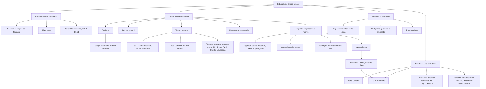

# Educazione civica Italiano — Emancipazione femminile, donne nella Resistenza, memoria e anni Settanta

---

## Fonti locali usate

Questa scheda nasce dai materiali del corso e li riordina in forma studiabile per l’orale.

- Programma ufficiale: [`programma/italiano.md`](<../../../programma/italiano.md>), sezione **Educazione civica** e sezione **Dal Verismo al Neorealismo**.
- Correzione/verifica su donne nella Resistenza ed emancipazione: [`lezioni/09-02-26/transcription.txt`](<../lezioni/09-02-26/transcription.txt>).
- Neorealismo cinematografico, *Paisà*, Rossellini, ponte verso Viganò: [`lezioni/12-01-26/schema.md`](<../lezioni/12-01-26/schema.md>) e [`neorealismo-cinematografico/mega-schema.md`](<../neorealismo-cinematografico/mega-schema.md>).
- Testimonianza sulla Resistenza romagnola, *L’Agnese va a morire*, Montaldo, letteratura neorealista: [`lezioni/22-01-26/transcription.txt`](<../lezioni/22-01-26/transcription.txt>).
- Quadro sul Neorealismo letterario e sezione su Renata Viganò: [`neorealismo-letterario/mega-schema.md`](<../neorealismo-letterario/mega-schema.md>).
- Collegamenti con Pasolini, Sessantotto, anni Settanta, mutazione antropologica, *Il PCI ai giovani!*: [`pasolini/mega-schema.md`](<../pasolini/mega-schema.md>).

> **Nota di metodo**  
> Le fonti locali documentano con chiarezza il percorso generale, i nodi da trattare e alcune testimonianze. Dove non riportano il dettaglio preciso di un documento visto in laboratorio all’Archivio di Stato di Ravenna, questa scheda non inventa titoli o contenuti specifici: indica invece i **nuclei di studio** da ricordare e il modo corretto di presentarli all’orale.

---

## Come studiare questa scheda

1. **Impara la cronologia.** È l’errore più segnalato nella lezione del 9 febbraio: non confondere immediato dopoguerra, anni Sessanta e anni Settanta.
2. **Costruisci un discorso ordinato.** Fascismo → Resistenza → dopoguerra e Costituzione → rimozione → rivalutazione anni Sessanta/Settanta → studi recenti e laboratorio d’archivio.
3. **Non limitarti a citare.** Ogni esempio va commentato: perché Agnese è importante? Perché “staffetta” è riduttivo? Perché la rivalutazione arriva tardi?
4. **Collega sempre Italiano e cittadinanza.** Qui le opere letterarie e cinematografiche non sono solo “testi”: sono strumenti di memoria civile.
5. **Prepara un’apertura forte.** Una buona apertura: “Il percorso mostra come l’emancipazione femminile non sia lineare: la Resistenza apre uno spazio di autonomia, ma il dopoguerra tenta subito di riportare le donne nei ruoli tradizionali”.

---

## Quadro generale del percorso

Il tema di Educazione civica affrontato in Italiano riguarda l’**emancipazione femminile** osservata attraverso un caso storico decisivo: il ruolo delle **donne nella Resistenza**. Il percorso non si limita a dire che le donne “aiutarono” i partigiani: mostra che parteciparono alla lotta antifascista in modi molteplici, rischiosi e spesso decisivi, ma che nel dopoguerra il loro contributo fu a lungo **rimosso**, ridimensionato o giudicato con sospetto.

La questione centrale è questa:

> la Resistenza dà a molte donne una possibilità concreta di uscire dal modello fascista dell’“angelo del focolare”, ma la società del dopoguerra non è subito pronta a riconoscere davvero quella trasformazione.

Per questo il percorso tiene insieme tre piani:

| Piano | Domanda guida | Materiali principali |
|---|---|---|
| **Storico-civico** | Che cosa cambia per le donne tra fascismo, Resistenza, dopoguerra e Costituzione? | Diritto di voto, articoli 3, 37, 51 della Costituzione, UDI, CIF, testimonianze partigiane |
| **Letterario** | Come la letteratura racconta la Resistenza femminile? | Renata Viganò, *L’Agnese va a morire*; Benedetta Tobagi, *La Resistenza delle donne* |
| **Memoriale e politico** | Perché il ruolo delle donne viene rimosso e poi rivalutato? | Documentario di Liliana Cavani, film di Giuliano Montaldo, anni Sessanta/Settanta, movimento studentesco del ’68, Archivio di Stato di Ravenna |

---

# 1. Prima della Resistenza: il modello femminile durante il fascismo

## 1.1 La donna come “angelo del focolare”

Durante il fascismo la donna viene collocata soprattutto nello spazio domestico. La propaganda insiste sulla maternità, sulla cura della famiglia, sull’obbedienza e sulla funzione riproduttiva. La donna ideale è moglie e madre: non una cittadina pienamente autonoma, ma una figura subordinata al progetto demografico e sociale del regime.

Nella lezione del 9 febbraio viene ricordato che, in un buon elaborato, era corretto partire proprio da qui: prima della Resistenza, molte donne erano pensate come **“angeli del focolare”**, cioè figure destinate alla casa e alla famiglia.

### Cosa significa per l’orale

Non basta dire “le donne erano discriminate”. Bisogna spiegare **in che modo**:

- erano spinte verso il matrimonio e la maternità;
- avevano minore accesso a ruoli pubblici e professionali;
- erano rappresentate come naturalmente dipendenti dall’uomo;
- la loro presenza nella sfera politica era limitata;
- il fascismo presentava la famiglia patriarcale come cellula dell’ordine sociale.

> **Frase pronta**  
> Il punto di partenza del percorso è il modello fascista della donna come “angelo del focolare”: la Resistenza rompe questo schema perché costringe molte donne a uscire dallo spazio domestico e ad assumere responsabilità politiche, organizzative e operative.

---

# 2. Le donne nella Resistenza: non solo “aiuto”, ma partecipazione attiva

## 2.1 Dopo l’8 settembre 1943: una frattura storica

Dopo l’armistizio dell’**8 settembre 1943** e l’occupazione nazifascista, nasce e si organizza la Resistenza italiana. Nelle fonti locali la data del **9 settembre 1943** viene ricordata come avvio della Resistenza all’occupazione nazifascista della penisola.

Per molte donne questo momento produce una frattura: non sono più solo madri, mogli, figlie o sorelle di uomini combattenti, ma diventano soggetti attivi della lotta. Entrano nella Resistenza per ragioni diverse:

- antifascismo politico;
- legami familiari con partigiani;
- rabbia per violenze, deportazioni, uccisioni;
- desiderio di libertà;
- solidarietà verso chi combatte;
- bisogno di reagire alla guerra e all’occupazione.

## 2.2 I numeri da ricordare

Dalla correzione del 9 febbraio emergono due dati importanti:

| Forma di partecipazione | Numero ricordato in lezione | Significato |
|---|---:|---|
| **Resistenza civile** | circa **70.000 donne** | donne impegnate in compiti di supporto, comunicazione, assistenza, organizzazione, trasporto, protezione |
| **Donne in armi** | circa **35.000 donne** | donne che partecipano anche direttamente ad azioni armate, missioni di attacco e difesa |

Questi dati servono a correggere una visione riduttiva: le donne non furono presenze marginali. Il loro contributo fu numericamente consistente e qualitativamente essenziale.

## 2.3 Che cosa facevano concretamente

Le donne svolgevano ruoli molto diversi:

- trasporto di **messaggi**, ordini, indicazioni militari;
- trasporto di **armi**, munizioni, viveri, medicinali;
- collegamento tra gruppi partigiani;
- organizzazione di incontri segreti;
- assistenza a feriti e partigiani nascosti;
- raccolta e diffusione di informazioni;
- scioperi e proteste, come quelli per il pane e la pace;
- partecipazione diretta ad azioni armate, in alcuni casi.

La parola **staffetta** è importante, ma può essere riduttiva. La lezione insiste proprio su questo punto attraverso Benedetta Tobagi: chiamare una donna “staffetta” rischia di far sembrare il suo compito secondario, quasi tecnico, mentre in realtà richiedeva sangue freddo, memoria, capacità di improvvisare, coraggio e rischio quotidiano.

> **Citazione da ricordare**  
> Ida D’Este, citata nella lezione del 9 febbraio attraverso il saggio di Tobagi, sintetizza così il ruolo della staffetta: **«una staffetta doveva inventare, tacere e ricordare»**.

### Commento della citazione

Queste tre parole sono perfette per l’orale:

| Verbo | Significato concreto | Valore civile |
|---|---|---|
| **Inventare** | trovare scuse credibili ai posti di blocco, reagire agli imprevisti | intelligenza pratica e coraggio |
| **Tacere** | non rivelare nomi, luoghi, messaggi, reti clandestine | responsabilità e disciplina |
| **Ricordare** | memorizzare percorsi, istruzioni, informazioni, perché spesso non si poteva portare nulla di scritto | affidabilità e lucidità |

---

# 3. La Resistenza come fenomeno trasversale

## 3.1 Non una sola parte politica

Un nodo decisivo, già presente anche nello studio del Neorealismo cinematografico, è il carattere **trasversale** della Resistenza. In *Roma città aperta* Rossellini rappresenta questa trasversalità attraverso l’unione ideale tra il comunista Francesco e il sacerdote Don Pietro: comunisti, cattolici, repubblicani e altre componenti politiche collaborano contro il nazifascismo.

Lo stesso vale per le donne. La lezione del 9 febbraio cita, attraverso una raccolta ANPI legata a Mezzano-Savarna, due figure femminili diverse:

| Figura | Orientamento / contesto | Significato |
|---|---|---|
| **Ida Camanzi** | comunista, contadina, famiglia in contesto di mezzadria | mostra il coinvolgimento del mondo contadino e della sinistra antifascista |
| **Anna Berardi** | cattolica/democristiana, aiutata dal parroco | mostra che anche il mondo cattolico partecipa alla lotta antifascista |

Il punto non è memorizzare solo i nomi: è capire che la Resistenza femminile attraversa classi sociali, orientamenti politici, ambienti religiosi e territori.

> **Frase pronta**  
> Le testimonianze di Ida Camanzi e Anna Berardi mostrano che la Resistenza femminile non appartiene a un unico schieramento: è un fenomeno trasversale, in cui donne comuniste e cattoliche condividono lo stesso rifiuto del nazifascismo.

---

# 4. Renata Viganò e *L’Agnese va a morire*

## 4.1 Autrice e collocazione

**Renata Viganò** partecipa alla Resistenza ed è una delle voci fondamentali della narrativa resistenziale. Il suo romanzo ***L’Agnese va a morire*** esce nel **1949**, quindi nell’**immediato dopoguerra**. Questo è un punto da non sbagliare: nella lezione del 9 febbraio viene segnalato come errore frequente collocare il romanzo direttamente dentro la rivalutazione degli anni Sessanta e Settanta.

La collocazione corretta è:

> Resistenza e dopoguerra immediato → pubblicazione del romanzo nel 1949 → successiva rimozione/oblio → rivalutazione negli anni Sessanta e Settanta, anche attraverso documentari, studi, testimonianze e film.

## 4.2 Trama essenziale

La protagonista, **Agnese**, è una contadina romagnola di mezza età, analfabeta, legata al marito **Palita**. Quando Palita viene deportato dai tedeschi e destinato a non tornare, Agnese resta sola. Dopo l’uccisione del suo gatto da parte di un soldato tedesco, decide di aiutare i compagni partigiani del marito e diventa una staffetta.

Progressivamente Agnese diventa per i partigiani **“mamma Agnese”**: una figura materna, concreta, silenziosa, resistente.

## 4.3 Perché Agnese è una figura importante

Agnese è importante proprio perché non è costruita come un’eroina eccezionale o ideologica. Non entra nella Resistenza perché possiede una teoria politica già formata: è spinta da sentimenti, rabbia, dolore, vendetta, fedeltà agli affetti e senso concreto della giustizia.

Questo la rende una figura neorealista: una donna comune, appartenente al mondo popolare e contadino, che dentro la Storia assume una grandezza morale.

### Attenzione: Agnese non è una figura femminile “di rottura” in senso semplice

La lezione del 9 febbraio sottolinea un punto delicato: Agnese non va presentata banalmente come una donna moderna che rompe tutti gli schemi. È una figura più complessa.

| Aspetto | Interpretazione corretta |
|---|---|
| **È una donna attiva nella Resistenza** | rompe il confinamento domestico imposto dal fascismo e dalla tradizione patriarcale |
| **È chiamata “mamma Agnese”** | resta legata a un immaginario materno, prudente, protettivo |
| **Non agisce per ideologia astratta** | agisce per dolore, fedeltà, rabbia, giustizia concreta |
| **È popolare e analfabeta** | porta nella Resistenza il punto di vista degli umili |

> **Frase pronta**  
> Agnese non è una figura femminile di rottura totale: resta dentro un immaginario materno e popolare, ma proprio da quella posizione tradizionale entra nella storia e diventa protagonista della Resistenza.

## 4.4 Stile neorealista

*L’Agnese va a morire* appartiene al **Neorealismo letterario**. La scheda sul Neorealismo letterario lo definisce come un romanzo dal realismo **documentaristico**, radicato nel paesaggio romagnolo e nella lotta partigiana dal basso.

Elementi neorealisti:

- attenzione a personaggi umili e popolari;
- ambientazione nella Romagna della Resistenza;
- lingua vicina al parlato;
- presenza di tratti locali, come l’articolo davanti al nome femminile: **l’Agnese**;
- racconto della guerra senza abbellimenti;
- centralità di fame, paura, freddo, spostamenti, soprusi, violenza quotidiana;
- rapporto tra esperienza personale e storia collettiva.

## 4.5 Montaldo e il film degli anni Settanta

Il romanzo viene adattato cinematograficamente da **Giuliano Montaldo** nel **1976**, con **Ingrid Thulin** nel ruolo di Agnese. Questo adattamento è importante perché appartiene alla fase di rivalutazione del ruolo delle donne nella Resistenza.

Il collegamento locale è forte:

- nel percorso sul Neorealismo cinematografico, l’episodio **“Inverno 1944”** di *Paisà* di Rossellini è indicato come modello visivo per Montaldo;
- nella lezione del 22 gennaio viene ascoltata una testimonianza di una ex staffetta romagnola che aveva partecipato anche alle riprese del film;
- la testimone racconta dettagli concreti: biciclette, argini, Taglio Corelli, Lavezzola, Reno, miseria contadina, bombardamenti, paura, fame, luoghi e cognomi locali.

> **Cosa dire all’orale**  
> Il film di Montaldo non è solo una trasposizione letteraria: negli anni Settanta contribuisce a riportare al centro una memoria femminile e romagnola della Resistenza che nel dopoguerra era stata in parte rimossa.

---

# 5. Benedetta Tobagi, *La Resistenza delle donne*

## 5.1 Perché il saggio conta

**Benedetta Tobagi**, nel saggio ***La Resistenza delle donne***, offre una rilettura storica del ruolo femminile nella lotta antifascista. La lezione del 9 febbraio insiste su due aspetti del metodo di Tobagi:

1. non si limita a dire che cosa facevano le donne, ma interpreta il significato storico del loro contributo;
2. restituisce identità precisa alle protagoniste, usando fonti, immagini, nomi, cognomi e nomi di battaglia.

Questo è fondamentale perché contrasta la rimozione: le donne non restano una massa anonima di “aiutanti”, ma diventano soggetti storici riconoscibili.

## 5.2 Il termine “staffetta” è riduttivo

Uno dei punti più importanti del saggio, ripreso nella lezione, è la critica alla riduzione delle donne al ruolo di “staffette”. Il termine è utile, ma può nascondere la complessità del lavoro svolto.

Le staffette:

- si muovevano spesso da sole;
- attraversavano posti di blocco;
- trasportavano informazioni che non potevano essere scritte;
- rischiavano arresto, tortura, deportazione, morte;
- dovevano sembrare “innocue” agli occhi dei soldati e sfruttare proprio gli stereotipi di genere contro il nemico;
- erano spesso giovanissime.

La loro forza stava anche nell’ambiguità sociale del ruolo femminile: poiché il nemico tendeva a sottovalutarle, potevano muoversi con una libertà apparente, ma questa libertà era sempre pericolosissima.

## 5.3 Tobagi e la memoria civile

Il valore civico del saggio è chiaro: Tobagi non scrive soltanto una storia delle donne nella Resistenza, ma compie un atto di **riparazione della memoria**. Riportare nomi, fotografie, racconti e testimonianze significa restituire cittadinanza storica a chi era stato ridotto al silenzio.

> **Frase pronta**  
> Tobagi mostra che la memoria è una forma di giustizia: nominare le donne della Resistenza significa sottrarle all’anonimato e correggere una narrazione pubblica costruita troppo a lungo al maschile.

---

# 6. Testimonianze: perché sono decisive

## 6.1 La testimonianza diretta come documento storico

Nel percorso è centrale il rapporto con le testimonianze. La lezione del 22 gennaio si apre con l’ascolto di una ex staffetta partigiana romagnola. La testimone racconta:

- il trasporto di notizie e materiali in bicicletta;
- i percorsi tra **Taglio Corelli** e **Lavezzola**;
- l’incontro con un uomo travestito da donna sull’argine del **Reno**;
- la paura delle SS e dei tedeschi;
- la fame e la miseria contadina;
- i bombardamenti su case civili;
- la memoria dei luoghi, dei soprannomi, dei cognomi;
- la partecipazione alle riprese del film di Montaldo.

Questa testimonianza è preziosa perché collega tre livelli:

1. la grande storia della Resistenza;
2. la microstoria romagnola;
3. la memoria familiare e territoriale.

## 6.2 Perché i dettagli contano

La professoressa sottolinea la precisione dei ricordi a distanza di decenni: luoghi, nomi, argini, ponti, case, stagioni, paura, miseria. Questo è un punto importante per Educazione civica: la cittadinanza non si costruisce solo su grandi principi astratti, ma anche sulla cura delle memorie locali.

> **Frase pronta**  
> La testimonianza della staffetta romagnola mostra che la Resistenza non è solo una pagina nazionale: è fatta di strade, argini, famiglie, soprannomi, paure e gesti quotidiani radicati nel territorio.

## 6.3 Marisa Musu e il ritorno all’ordine domestico

Nella lezione del 9 febbraio viene citata anche **Marisa Musu**, partigiana romana. La sua testimonianza è usata per mostrare la delusione del dopoguerra: il giorno stesso della liberazione viene invitata da un comandante a tornare a casa a occuparsi della famiglia.

Il significato è chiarissimo: anche quando le donne hanno combattuto, rischiato e assunto ruoli pubblici, la società tende subito a ricollocarle nello spazio privato.

> **Commento utile**  
> La liberazione nazionale non coincide automaticamente con la liberazione femminile. La fine del fascismo apre possibilità nuove, ma la mentalità patriarcale sopravvive.

---

# 7. Dopoguerra, Costituzione ed emancipazione giuridica

## 7.1 Il voto alle donne

Nel **1946** le donne italiane votano per la prima volta in una consultazione politica nazionale. Questo è un passaggio fondamentale e va collocato correttamente: non negli anni Sessanta o Settanta, ma nell’immediato dopoguerra.

Il voto femminile rappresenta:

- riconoscimento della donna come cittadina;
- accesso formale alla sovranità democratica;
- rottura con l’esclusione politica precedente;
- premessa della partecipazione femminile alla Repubblica.

## 7.2 Le donne nella Costituente

La lezione ricorda che la presenza femminile nelle istituzioni resta comunque limitata: le donne sono una minoranza nel primo Parlamento repubblicano e nell’Assemblea Costituente. Il dato da ricordare è la contraddizione:

> le donne entrano finalmente nella cittadinanza politica, ma restano numericamente marginali nei luoghi del potere.

## 7.3 Gli articoli della Costituzione da collegare

| Articolo | Contenuto | Collegamento al percorso |
|---|---|---|
| **Art. 3** | Uguaglianza formale e sostanziale; pari dignità sociale; compito della Repubblica di rimuovere gli ostacoli | base generale dell’emancipazione e della parità |
| **Art. 37** | Diritti della donna lavoratrice; parità di retribuzione a parità di lavoro; tutela della maternità | collega emancipazione, lavoro e persistenza del ruolo materno |
| **Art. 51** | Accesso agli uffici pubblici e alle cariche elettive in condizioni di uguaglianza | collega cittadinanza, rappresentanza politica e accesso al potere |

### Articolo 3: il più importante per aprire il discorso

L’articolo 3 è il centro del discorso civico perché distingue tra:

- **uguaglianza formale**: tutti sono uguali davanti alla legge;
- **uguaglianza sostanziale**: la Repubblica deve rimuovere gli ostacoli economici e sociali che impediscono la piena partecipazione.

Nel caso delle donne, la parità scritta nella legge non basta: bisogna combattere mentalità, stereotipi, esclusione dal lavoro, marginalizzazione politica, rimozione della memoria.

> **Frase pronta**  
> Il percorso sulle donne nella Resistenza mostra bene la differenza tra uguaglianza formale e sostanziale: la Costituzione riconosce la parità, ma la società del dopoguerra continua spesso a chiedere alle donne di tornare al silenzio e alla casa.

---

# 8. Rimozione del dopoguerra e rivalutazione negli anni Sessanta-Settanta

## 8.1 La rimozione: che cosa significa

Per **rimozione** si intende il processo per cui un’esperienza storica non viene pienamente riconosciuta, raccontata o valorizzata. Non significa che nessuno sappia nulla, ma che quella memoria resta marginale, disturbante, poco adatta alla narrazione dominante.

Nel caso delle donne partigiane, la rimozione dipende da diversi fattori:

- ritorno al modello familiare tradizionale;
- sospetto verso donne che avevano vissuto fuori casa e accanto agli uomini;
- giudizi morali sulle partigiane, talvolta definite con disprezzo “donne pubbliche”;
- difficoltà delle donne a raccontare esperienze traumatiche;
- bisogno collettivo di “normalità” dopo la guerra;
- narrazione pubblica della Resistenza centrata soprattutto sugli uomini armati.

## 8.2 Il paradosso del dopoguerra

Il dopoguerra è paradossale:

| Apertura | Chiusura |
|---|---|
| diritto di voto nel 1946 | ritorno al ruolo domestico |
| Costituzione del 1948 | bassa presenza femminile nelle istituzioni |
| riconoscimento giuridico della parità | mentalità patriarcale ancora forte |
| romanzo di Viganò nel 1949 | contributo femminile spesso dimenticato |

Questa contraddizione è il cuore del percorso di Educazione civica.

## 8.3 Le tappe della rivalutazione

Tra anni Sessanta e Settanta cambia il clima culturale. Una nuova generazione, che non ha vissuto direttamente la guerra, comincia a interrogare la memoria della Resistenza e il ruolo delle donne. Il contesto è quello della contestazione, dei movimenti studenteschi, delle trasformazioni sociali e del femminismo.

Dalle fonti locali emergono alcune tappe da ricordare:

| Anno | Opera / evento | Significato |
|---:|---|---|
| **1949** | Renata Viganò, *L’Agnese va a morire* | prima importante narrazione letteraria della Resistenza femminile, nell’immediato dopoguerra |
| **1956** | Anna Garofalo, *L’italiana in Italia* | raccoglie testimonianze e voci femminili anche a partire dal programma radiofonico *Parole di una donna* |
| **1965** | Liliana Cavani, documentario RAI *La donna nella Resistenza* | contributo decisivo alla visibilità pubblica delle partigiane |
| **1970** | pubblicazione di memorie rimaste a lungo bloccate, come *Ragazza partigiana* di una donna che aveva preso le armi, citata nella lezione del 9 febbraio con nome trascritto in modo incerto | segnale del clima nuovo, più disposto ad ascoltare le donne combattenti |
| **1976** | Montaldo, film *L’Agnese va a morire* | rilancio cinematografico del romanzo di Viganò nel clima degli anni Settanta |
| **1976** | Anna Maria Bruzzone e Rachele Farina, *La Resistenza taciuta* | recupero esplicito di testimonianze femminili taciute o marginalizzate |
| **Anni recenti** | Benedetta Tobagi, *La Resistenza delle donne* | nuova sintesi storica e civile, attenta a fonti, immagini e nomi |

> **Cosa non sbagliare**  
> *L’Agnese va a morire* non nasce negli anni Settanta: è del 1949. Negli anni Settanta viene però rilanciato anche attraverso il film di Montaldo e dentro un nuovo clima di rivalutazione.

---

# 9. Il laboratorio all’Archivio di Stato di Ravenna: Movimento studentesco del ’68 a Lugo e Ravenna

## 9.1 Che cosa va ricordato

Il programma ufficiale indica un’attività di laboratorio presso l’**Archivio di Stato di Ravenna** sul **Movimento studentesco del ’68 nelle zone di Lugo e Ravenna**.

Le fonti locali disponibili non riportano l’elenco preciso dei documenti archivistici consultati. Per l’orale, quindi, è corretto presentare l’attività così:

> laboratorio sulle fonti storiche locali, dedicato al modo in cui il movimento studentesco del 1968 si manifesta anche nel territorio ravennate e lughese, non solo nei grandi centri nazionali.

## 9.2 Perché l’Archivio è importante in Educazione civica

Un archivio non è un luogo “neutro” o polveroso: è uno spazio di cittadinanza. Conserva documenti che permettono di ricostruire la storia pubblica, controllare le narrazioni, distinguere memoria e invenzione.

Nel percorso di Educazione civica, l’Archivio serve a capire che:

- la storia nazionale ha sempre una dimensione locale;
- le trasformazioni politiche arrivano anche nelle province;
- volantini, comunicati, manifesti, verbali, lettere, fotografie e giornali locali possono diventare fonti storiche;
- studiare il Sessantotto a Lugo e Ravenna significa vedere come un movimento globale/nazionale si traduce in conflitti e linguaggi territoriali;
- la cittadinanza democratica richiede accesso alle fonti e capacità critica.

## 9.3 Collegamento con il percorso sulle donne

Il laboratorio sul ’68 si collega al percorso sulle donne perché gli anni Sessanta e Settanta sono il momento in cui molte memorie rimosse vengono rilette:

- la generazione nata dopo la guerra interroga i racconti ufficiali;
- la contestazione studentesca critica autorità, scuola, famiglia, istituzioni;
- i movimenti delle donne mettono in discussione ruoli patriarcali e subordinazione;
- vengono recuperate testimonianze di partigiane e donne resistenti;
- la Resistenza viene riletta non solo come lotta militare, ma anche come esperienza di emancipazione sociale.

> **Frase pronta**  
> L’attività all’Archivio di Stato di Ravenna permette di collegare memoria locale e cittadinanza: il Sessantotto non è solo Valle Giulia o le università delle grandi città, ma anche documenti, iniziative e conflitti nei territori di Lugo e Ravenna.

---

# 10. Collegamento con Pasolini: Sessantotto, anni Settanta, giovani e potere

## 10.1 Pasolini e il 1968

Nel programma di Italiano il Sessantotto si collega anche a **Pier Paolo Pasolini**, soprattutto attraverso ***Il PCI ai giovani!***. Nel testo, Pasolini commenta gli scontri di **Valle Giulia** del 1 marzo 1968 tra studenti e polizia.

La posizione di Pasolini è paradossale e scandalosa: invece di schierarsi automaticamente con gli studenti, dice di simpatizzare per i poliziotti, perché li considera **figli di poveri**, mentre molti studenti sono per lui **figli di papà**, cioè giovani borghesi che possono permettersi di “giocare alla rivoluzione”.

Questa posizione non va letta come difesa della repressione poliziesca. Va letta come critica di classe e come esempio dell’anticonformismo pasoliniano.

## 10.2 Perché Pasolini serve in questa scheda

Pasolini aiuta a rendere più complesso il discorso sugli anni Sessanta e Settanta:

- mostra che la contestazione non va idealizzata automaticamente;
- mette in guardia dal rischio che la ribellione diventi moda borghese;
- collega i giovani alla trasformazione consumistica della società;
- denuncia la distanza tra il “Palazzo” e la realtà concreta;
- interpreta gli anni Settanta come epoca di **mutazione antropologica** e **omologazione**.

## 10.3 Collegamento con Educazione civica

Il collegamento migliore è questo:

> mentre il percorso sulle donne mostra una memoria rimossa che viene rivalutata negli anni Sessanta e Settanta, Pasolini mostra che quegli stessi anni non sono semplicemente liberatori: sono anche anni di consumismo, omologazione, crisi della politica, trasformazione dei giovani e distanza tra potere e realtà.

---

# 11. Collegamento con Neorealismo cinematografico

## 11.1 Rossellini e la Resistenza

Il Neorealismo cinematografico nasce dalla necessità di raccontare guerra, Resistenza, miseria e dopoguerra senza filtri. In *Roma città aperta*, Rossellini mostra l’antifascismo trasversale: comunisti e cattolici, uomini e donne, popolo e clero si trovano uniti contro l’occupazione nazifascista.

La figura di **Pina**, interpretata da Anna Magnani, è utile per collegare donne e Resistenza: non è una partigiana nel senso organizzativo del termine, ma incarna il coraggio civile popolare contro la violenza nazifascista.

## 11.2 *Paisà*, “Inverno 1944” e la Resistenza in pianura

L’episodio **“Inverno 1944”** di *Paisà* è ambientato nelle valli del Po / Comacchio. Mostra una Resistenza diversa da quella più nota delle montagne:

- paesaggio piatto;
- assenza di ripari naturali;
- paludi, argini, acqua;
- partigiani e alleati poveri di mezzi;
- rischio costante di rappresaglie;
- territorio vicino alla Romagna studiata con Viganò.

Questo episodio è fondamentale perché diventa modello visivo per il film di Montaldo tratto da *L’Agnese va a morire*.

> **Frase pronta**  
> Il collegamento *Paisà* → Montaldo → Viganò permette di unire cinema e letteratura: Rossellini offre un modello visivo della Resistenza nelle valli, Viganò la racconta dal punto di vista popolare e femminile, Montaldo la rilancia negli anni Settanta.

---

# 12. Collegamento con Neorealismo letterario

## 12.1 La Resistenza come imperativo narrativo

Nel Neorealismo letterario, raccontare la Resistenza è un problema e insieme un obbligo morale. Calvino, nella Prefazione del 1964 al *Sentiero dei nidi di ragno*, parla del bisogno collettivo di raccontare dopo la guerra, ma anche della difficoltà di evitare retorica e celebrazione.

Il punto comune è la volontà di dare voce a esperienze vissute:

- Calvino sceglie lo sguardo di un bambino per evitare l’agiografia;
- Fenoglio intreccia guerra e questione privata;
- Pavese racconta il senso di colpa dell’intellettuale che non combatte;
- Viganò racconta la Resistenza dal basso, attraverso una donna popolare.

## 12.2 Viganò nel quadro degli autori neorealisti

| Autore | Opera | Tipo di sguardo sulla Resistenza |
|---|---|---|
| **Calvino** | *Il sentiero dei nidi di ragno* | Resistenza vista da un bambino, antiretorica |
| **Fenoglio** | *Una questione privata* | intreccio tra guerra e ossessione amorosa |
| **Pavese** | *La casa in collina* | colpa dell’intellettuale che non partecipa |
| **Viganò** | *L’Agnese va a morire* | Resistenza romagnola dal punto di vista di una staffetta popolare |

> **Cosa dire all’orale**  
> Viganò è importante perché inserisce nel Neorealismo una prospettiva femminile, popolare e romagnola: la Resistenza non è raccontata dall’alto, ma attraverso il corpo, la fatica e la paura di una donna comune.

---

# 13. Cronologia essenziale

| Anno | Evento | Perché conta |
|---:|---|---|
| **1922-1943** | Ventennio fascista | modello patriarcale e domestico della donna, “angelo del focolare” |
| **8 settembre 1943** | Armistizio | frattura storica: occupazione nazifascista e organizzazione della Resistenza |
| **9 settembre 1943** | avvio della Resistenza all’occupazione nazifascista, secondo la formulazione ricordata in lezione | ingresso di uomini e donne nella lotta clandestina |
| **1943-1945** | Resistenza | circa 70.000 donne nella Resistenza civile e 35.000 in armi, secondo i dati ricordati in lezione |
| **25 aprile 1945** | Liberazione | fine della guerra in Italia, ma non fine automatica della subordinazione femminile |
| **1945** | Rossellini, *Roma città aperta* | cinema neorealista e antifascismo trasversale |
| **1946** | voto alle donne; Rossellini, *Paisà* | cittadinanza politica femminile; rappresentazione della Resistenza nelle valli |
| **1948** | Costituzione italiana | articoli 3, 37, 51: parità, lavoro, accesso alle cariche pubbliche |
| **1949** | Renata Viganò, *L’Agnese va a morire* | romanzo neorealista sulla Resistenza femminile romagnola |
| **1956** | Anna Garofalo, *L’italiana in Italia* | raccolta di testimonianze femminili |
| **1964** | Prefazione di Calvino al *Sentiero dei nidi di ragno* | riflessione sulla Resistenza e sul Neorealismo |
| **1965** | Liliana Cavani, *La donna nella Resistenza* | documentario fondamentale per la rivalutazione pubblica delle partigiane |
| **1968** | Movimento studentesco; Valle Giulia; contestazioni anche nei territori locali | contesto della nuova generazione che rilegge memoria, autorità, scuola e politica |
| **Anni Sessanta-Settanta** | rivalutazione del ruolo delle donne nella Resistenza | recupero di testimonianze, diari, libri, documentari |
| **1975-1976** | Pasolini, *Scritti corsari* e *Lettere luterane*; Montaldo, *L’Agnese va a morire*; *La Resistenza taciuta* | anni Settanta come momento di critica del potere, memoria, femminismo e rilettura della Resistenza |
| **Anni recenti** | Benedetta Tobagi, *La Resistenza delle donne* | sintesi storica recente e recupero di nomi, immagini, testimonianze |

---

# 14. Mappa concettuale

---

# 15. Cosa dire all’orale: discorso pronto

## Versione completa

> Il percorso di Educazione civica in Italiano riguarda l’emancipazione femminile a partire dal ruolo delle donne nella Resistenza. Durante il fascismo la donna era rappresentata soprattutto come “angelo del focolare”, quindi come moglie e madre destinata allo spazio domestico. Con l’8 settembre 1943 e la nascita della Resistenza, molte donne escono da questo ruolo e assumono compiti decisivi: trasportano messaggi, armi, viveri, organizzano collegamenti, assistono i partigiani, partecipano anche ad azioni armate. In lezione sono stati ricordati i dati di circa 70.000 donne nella Resistenza civile e 35.000 in armi.
>
> Un punto importante, ripreso da Benedetta Tobagi in *La Resistenza delle donne*, è che il termine “staffetta” può essere riduttivo. Le staffette non erano semplici aiutanti: dovevano attraversare posti di blocco, inventare scuse, tacere informazioni, ricordare ordini e percorsi. La citazione di Ida D’Este — “una staffetta doveva inventare, tacere e ricordare” — sintetizza benissimo intelligenza, coraggio e disciplina richiesti da quel ruolo.
>
> Il percorso si collega poi a Renata Viganò e al romanzo *L’Agnese va a morire*, pubblicato nel 1949, quindi nell’immediato dopoguerra. Agnese è una contadina romagnola analfabeta, di mezza età, che dopo la deportazione del marito Palita e l’uccisione del gatto da parte di un soldato tedesco decide di aiutare i partigiani. È una figura complessa: non è un’eroina ideologica, ma una donna comune, mossa da dolore, rabbia, affetto e senso concreto della giustizia. Per questo è profondamente neorealista.
>
> Il dopoguerra, però, è contraddittorio. Nel 1946 le donne ottengono il diritto di voto e nel 1948 la Costituzione riconosce l’uguaglianza, con articoli fondamentali come il 3, il 37 e il 51. Tuttavia la società tenta spesso di riportare le donne ai ruoli domestici. La testimonianza di Marisa Musu, invitata dopo la liberazione a tornare a casa a occuparsi della famiglia, mostra che la liberazione nazionale non coincide subito con la liberazione femminile.
>
> Proprio per questo si parla di rimozione: il contributo delle partigiane viene spesso minimizzato, giudicato o dimenticato. La rivalutazione arriva soprattutto tra anni Sessanta e Settanta, con il documentario di Liliana Cavani *La donna nella Resistenza*, con il film di Montaldo tratto da *L’Agnese va a morire*, con raccolte di testimonianze come *La Resistenza taciuta*, e oggi con il saggio di Tobagi.
>
> Il percorso si collega al Neorealismo cinematografico attraverso Rossellini: *Roma città aperta* mostra l’antifascismo trasversale, mentre l’episodio “Inverno 1944” di *Paisà*, ambientato nelle valli, diventa modello visivo per il film di Montaldo. Si collega anche a Pasolini e agli anni Settanta: il Sessantotto e i movimenti giovanili aprono nuove domande sulla memoria, ma Pasolini invita a non idealizzare la contestazione, perché vede anche il rischio di omologazione e di falsa rivoluzione borghese.
>
> Infine, l’attività all’Archivio di Stato di Ravenna sul Movimento studentesco del ’68 nelle zone di Lugo e Ravenna mostra che la cittadinanza si studia anche attraverso le fonti locali: documenti, territori e memorie concrete permettono di collegare la grande storia nazionale alla storia vicina.

## Versione breve

> Il percorso mostra che l’emancipazione femminile non è lineare. La Resistenza permette a molte donne di uscire dal ruolo fascista di “angelo del focolare” e di diventare soggetti attivi della lotta antifascista. Tuttavia, nel dopoguerra, nonostante voto e Costituzione, il loro contributo viene spesso rimosso. Viganò con *L’Agnese va a morire* racconta questa esperienza dal basso, attraverso una donna popolare e materna; Tobagi, oggi, restituisce nomi e volti alle protagoniste dimenticate. La rivalutazione arriva soprattutto negli anni Sessanta e Settanta, nel clima della contestazione, dei movimenti delle donne e del recupero delle memorie taciute.

---

# 16. Domande possibili e risposte guida

## 16.1 Qual è il tema centrale del percorso di Educazione civica?

Il tema centrale è l’emancipazione femminile letta attraverso il ruolo delle donne nella Resistenza e attraverso la successiva rimozione/rivalutazione della loro memoria.

## 16.2 Perché la parola “staffetta” può essere riduttiva?

Perché rischia di presentare le donne come semplici messaggere. In realtà le staffette svolgevano compiti rischiosi: trasportavano informazioni, armi, viveri, attraversavano posti di blocco, memorizzavano ordini, improvvisavano coperture e rischiavano la vita.

## 16.3 Che cosa significa la frase “inventare, tacere e ricordare”?

Significa che una staffetta doveva saper improvvisare, mantenere il segreto e memorizzare informazioni senza lasciarne traccia scritta. È una sintesi perfetta del coraggio e della lucidità richiesti alle donne nella Resistenza.

## 16.4 Perché Agnese è una figura neorealista?

Perché è una donna comune, popolare, analfabeta, legata al territorio romagnolo. La sua storia non viene raccontata in modo eroico o idealizzato, ma attraverso gesti concreti, paura, fatica, dolore e partecipazione alla lotta partigiana.

## 16.5 Agnese è una figura femminile di rottura?

Sì e no. È di rottura perché entra nella Resistenza e assume un ruolo pubblico e rischioso. Ma non è una figura moderna in senso astratto: resta legata all’immagine materna, tanto da diventare “mamma Agnese”. La sua forza nasce proprio dalla trasformazione di un ruolo tradizionale in responsabilità politica.

## 16.6 Che cosa succede alle donne nel dopoguerra?

Ottengono conquiste giuridiche decisive, come il voto nel 1946 e la parità costituzionale nel 1948. Però sul piano sociale molte vengono spinte a tornare alla casa e alla famiglia. Il loro ruolo nella Resistenza viene spesso minimizzato o giudicato.

## 16.7 Quali articoli della Costituzione colleghi?

L’articolo 3 sull’uguaglianza e la rimozione degli ostacoli, l’articolo 37 sulla donna lavoratrice e la parità di retribuzione, l’articolo 51 sull’accesso alle cariche pubbliche in condizioni di uguaglianza.

## 16.8 Che cos’è la rimozione?

È il processo per cui una memoria storica viene accantonata, non valorizzata o giudicata scomoda. Nel caso delle partigiane, il loro contributo viene ridotto, taciuto o letto con pregiudizio morale.

## 16.9 Perché gli anni Sessanta e Settanta sono importanti?

Perché una nuova generazione rilegge criticamente la memoria della Resistenza. Il clima della contestazione, del femminismo e dei movimenti sociali favorisce il recupero di testimonianze, documentari e opere sulle partigiane.

## 16.10 Come colleghi l’Archivio di Stato di Ravenna?

Lo collego come esperienza di cittadinanza e metodo storico: studiare documenti sul Movimento studentesco del ’68 a Lugo e Ravenna mostra che la storia nazionale si comprende anche dalle fonti locali e dai territori.

## 16.11 Come colleghi Pasolini?

Pasolini permette di problematizzare il Sessantotto e gli anni Settanta. In *Il PCI ai giovani!* critica gli studenti borghesi di Valle Giulia e difende provocatoriamente i poliziotti come figli del popolo. Più in generale, negli anni Settanta denuncia omologazione, consumismo e mutazione antropologica.

## 16.12 Come colleghi il Neorealismo?

Il Neorealismo racconta guerra, Resistenza e popolo. Rossellini con *Paisà* offre il modello della Resistenza nelle valli; Viganò con *L’Agnese va a morire* racconta la Resistenza romagnola dal punto di vista di una donna popolare.

---

# 17. Errori da evitare

| Errore | Correzione |
|---|---|
| Collocare *L’Agnese va a morire* negli anni Settanta | Il romanzo è del **1949**; negli anni Settanta c’è il film di Montaldo e la rivalutazione |
| Dire che il voto alle donne arriva negli anni Sessanta | Il voto femminile è del **1946** |
| Dire solo “le donne aiutavano i partigiani” | Spiegare ruoli, rischi, numeri, staffette, donne in armi, organizzazione |
| Citare Tobagi senza commentarla | Spiegare il metodo: nomi, immagini, fonti, critica del termine “staffetta” |
| Presentare Agnese come eroina ideologica | Agnese è mossa soprattutto da dolore, rabbia, affetti, giustizia concreta |
| Dire che la Costituzione risolve subito la parità | Distinguere parità giuridica e mentalità sociale |
| Idealizzare gli anni Settanta | Collegare rivalutazione e movimenti, ma anche le critiche di Pasolini a consumismo e omologazione |
| Inventare dettagli sull’Archivio | Dire che il laboratorio riguardava il Movimento studentesco del ’68 a Lugo/Ravenna e il lavoro sulle fonti locali |

---

# 18. Collegamenti rapidi per l’esame

| Collegamento | Come usarlo |
|---|---|
| **Storia: Resistenza** | ruolo delle donne, 8 settembre, 25 aprile, antifascismo trasversale |
| **Storia: Costituzione** | voto alle donne, Assemblea Costituente, articoli 3, 37, 51 |
| **Italiano: Neorealismo letterario** | Viganò, Calvino, Fenoglio, Pavese: modi diversi di raccontare la Resistenza |
| **Italiano: Neorealismo cinematografico** | Rossellini, *Roma città aperta*, *Paisà*, visione documentaria |
| **Pasolini** | Sessantotto, *Il PCI ai giovani!*, critica dei giovani borghesi, omologazione, anni Settanta |
| **Educazione civica** | uguaglianza formale/sostanziale, memoria pubblica, cittadinanza, fonti d’archivio |
| **Territorio** | Romagna, Ravenna, Lugo, valli, Reno, Taglio Corelli, Lavezzola, Archivio di Stato |
| **Cinema-letteratura** | *Paisà* → Viganò → Montaldo |
| **Questione femminile** | emancipazione, rimozione, rivalutazione, femminismo, testimonianze |

---

# 19. Mini-lessico

| Termine | Definizione |
|---|---|
| **Emancipazione** | processo attraverso cui un soggetto o gruppo conquista autonomia, diritti e riconoscimento |
| **Staffetta** | persona che nella Resistenza trasporta messaggi, ordini, armi o viveri; nel caso femminile il termine va problematizzato perché può ridurre la complessità del ruolo |
| **Resistenza civile** | insieme di azioni non necessariamente armate che sostengono la lotta antifascista: informazioni, scioperi, nascondigli, assistenza, collegamenti |
| **Antifascismo trasversale** | collaborazione di forze politiche e sociali diverse contro nazismo e fascismo |
| **Rimozione** | cancellazione o marginalizzazione di una memoria scomoda dalla narrazione pubblica |
| **Rivalutazione** | recupero critico di un’esperienza storica precedentemente sottovalutata |
| **Neorealismo** | corrente o clima culturale del dopoguerra che racconta realtà, guerra, miseria, popolo e Resistenza con attenzione civile |
| **Uguaglianza formale** | parità riconosciuta dalla legge |
| **Uguaglianza sostanziale** | parità resa effettiva attraverso la rimozione degli ostacoli sociali ed economici |
| **Mutazione antropologica** | in Pasolini, trasformazione profonda di corpi, linguaggi, desideri e valori degli italiani causata da consumismo e televisione |

---

# 20. Chiusura forte possibile

> Il percorso sulle donne nella Resistenza mostra che la cittadinanza non coincide solo con il riconoscimento giuridico dei diritti. Le donne conquistano visibilità durante la lotta antifascista, ottengono il voto e la parità costituzionale, ma devono ancora combattere contro rimozione, giudizi morali e ritorno ai ruoli domestici. Per questo letteratura, cinema, testimonianze e archivi sono strumenti civili: servono a dare nome e voce a chi ha partecipato alla storia, ma è stato troppo a lungo raccontato come presenza secondaria.
