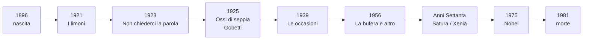
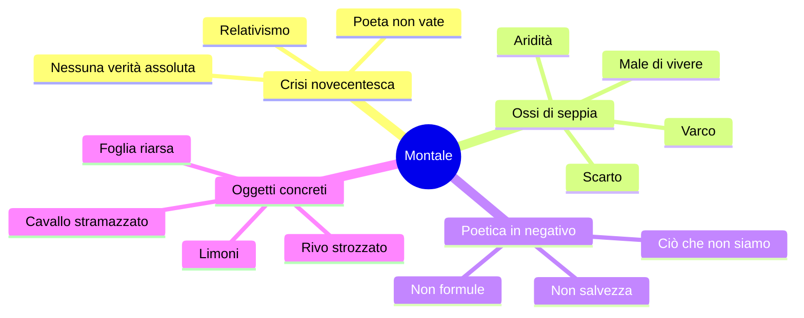
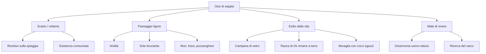
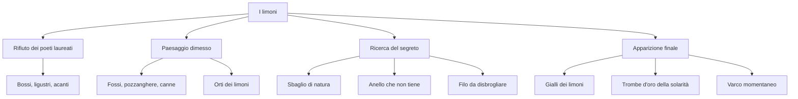
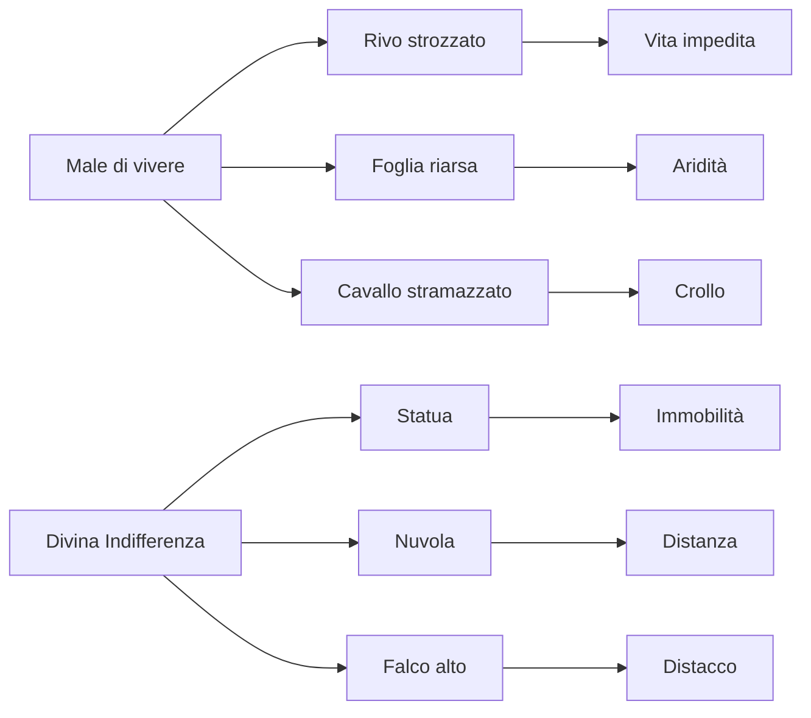

# Eugenio Montale — Riassunto

---

## Coordinate essenziali

| Elemento | Dettaglio |
|----------|-----------|
| **Nascita e morte** | **1896-1981**; autore ligure, legato alle estati a **Monterosso** nelle Cinque Terre |
| **Profilo** | **Poeta**, ma anche **giornalista** e **saggista**: può uscire anche un testo in prosa |
| **Nobel** | **1975**, stesso anno della morte di Pasolini |
| **Formazione** | Simbolismo, Decadentismo francese, **D'Annunzio** da attraversare e superare |
| **Raccolte** | ***Ossi di seppia*** (1925), ***Le occasioni*** (1939), ***La bufera e altro*** (1956), ***Satura*** con ***Xenia*** |
| **Poetica** | **Poetica in negativo**: niente certezze, niente formule salvifiche; la poesia resiste al **male di vivere** |
| **Paesaggio** | Liguria scabra, essenziale, arida; sole bruciante; disarmonia uomo-natura |
| **Immagini chiave** | Ossi/rottami, campana di vetro, esilio dalla vita, muraglia, varco, correlativo oggettivo, divina Indifferenza |

Montale è un autore centrale del Novecento perché porta fino in fondo la crisi delle certezze: il poeta non è più vate, non possiede verità da consegnare e non può promettere salvezza. Può però riconoscere il negativo, registrare il **male di vivere** e cercare, dentro oggetti poveri e concreti, un possibile **varco**.

---

## Date fondamentali

| Anno | Evento / opera |
|------|----------------|
| **1896** | Nasce Eugenio Montale; la sua immaginazione poetica resta legata alla **Liguria** e a **Monterosso** |
| **1921** | ***I limoni***: dichiarazione di poetica antiaulica e antidannunziana |
| **1923** | ***Non chiederci la parola***: formula della poetica in negativo |
| **1925** | Esce ***Ossi di seppia*** presso **Piero Gobetti**; il titolo originario era ***Rottami*** |
| **1939** | ***Le occasioni***, raccolta collocata alla vigilia della Seconda guerra mondiale |
| **1956** | ***La bufera e altro***, il cui titolo rimanda anche alla bufera storica della guerra |
| **Anni Settanta** | ***Satura***, più ironica e sarcastica; contiene ***Xenia*** per **Drusilla Tanzi**, la Mosca |
| **1975** | Premio Nobel per la letteratura |
| **1981** | Muore Montale |

---

## 1. Raccolte e posizione nel Novecento

### 1.1 Le raccolte principali

Le raccolte da ricordare sono soprattutto quattro. La più importante per le lezioni è ***Ossi di seppia***, pubblicata nel **1925**, in pieno ventennio fascista. ***Le occasioni*** esce nel **1939**, alla vigilia della Seconda guerra mondiale. ***La bufera e altro*** esce nel **1956**: già il titolo rimanda anche alla bufera storica della guerra. Negli anni Settanta esce ***Satura***, più ironica e talvolta sarcastica verso l'Italia contemporanea.

Dentro *Satura* c'è ***Xenia***, sezione dedicata alla moglie **Drusilla Tanzi**, detta **la Mosca** per le lenti spesse. *Xenia* significa "doni votivi": sono versi offerti alla moglie morta.

| Raccolta | Da sapere |
|----------|-----------|
| ***Ossi di seppia*** | 1925; Gobetti; paesaggio ligure; aridità; scarto; male di vivere; poetica in negativo |
| ***Le occasioni*** | 1939; in lezione è stata soprattutto collocata cronologicamente |
| ***La bufera e altro*** | 1956; titolo collegabile alla Seconda guerra mondiale |
| ***Satura / Xenia*** | Anni Settanta; tono ironico/sarcastico; *Xenia* per Drusilla/la Mosca |

### 1.2 Perché Montale è novecentesco

Montale vive dentro il **relativismo novecentesco**: non c'è più una verità stabile, compatta, comunicabile in modo sicuro. Per questo il poeta non può dire come stanno definitivamente le cose. La poesia non è una formula magica e non apre mondi risolti: resta uno strumento di conoscenza parziale, negativa, faticosa.

Da qui nasce il collegamento con **Pirandello**: entrambi mostrano la crisi della verità e dell'identità. Pirandello la rappresenta attraverso maschere, forme e punti di vista; Montale attraverso paesaggi aridi, oggetti scabri e formule negative.

---

## 2. D'Annunzio: attraversamento e rifiuto

Montale si forma dentro una linea che passa per **Simbolismo**, **Decadentismo francese** e **D'Annunzio**. D'Annunzio è per lui un autore **imprescindibile**, da "attraversare": bisogna conoscerne la forza e poi prenderne le distanze.

La distanza è netta sul piano della poetica. Montale rifiuta:

- il **gigantismo dell'io**;
- l'estetismo e il sublime;
- la poesia aulica e accademica;
- il poeta-vate che consegna verità alle masse;
- il panismo e la fusione gioiosa con la natura;
- le piante nobili e letterarie della tradizione alta.

Al posto di questo mondo mette **oggetti dimessi**: fossi, pozzanghere mezzo seccate, limoni, muri, rottami, ossi di seppia. La sua poesia non cerca lo splendore, ma la verità scabra dello scarto.

La distanza non cancella però l'eredità. Da D'Annunzio resta soprattutto una lezione **stilistica**: attenzione al **fonosimbolismo**, al valore sonoro delle parole, a un lessico anche colto. In ***I limoni*** la polemica antidannunziana convive con calchi da ***La pioggia nel pineto***: **"Ascoltami"** e **"Vedi"** richiamano **"Taci"** e **"Ascolta"**. Ma dove D'Annunzio conduce al panismo, Montale porta in un paesaggio dimesso, arido, interrogato per cercare un segreto che sfugge.

| D'Annunzio | Montale |
|------------|---------|
| Poeta-vate | Poeta senza formule |
| Sublime e piante nobili | Oggetti poveri: fossi, limoni, rottami |
| Panismo | Disarmonia uomo-natura |
| Fusione vitale | Esilio dalla vita |
| Linguaggio aulico | Stile aspro, conciso, scabro |
| "Taci", "Ascolta" | "Ascoltami", "Vedi" in chiave antipanica |

---

## 3. *Ossi di seppia*: titolo, paesaggio, condizione dell'uomo

### 3.1 Pubblicazione e titolo

***Ossi di seppia*** esce nel **1925** presso **Piero Gobetti**, giovane editore antifascista poi eliminato dal regime. La scelta editoriale è significativa: la raccolta diventa per molti giovani una specie di **bandiera antifascista**, perché si oppone alla retorica celebrativa, sicura e rumorosa del fascismo.

Il titolo originario era ***Rottami***. Anche il titolo definitivo rimanda alla stessa area: **detrito**, **residuo**, **scarto**, ciò che resta sulla spiaggia dopo il passaggio del mare. Gli ossi di seppia sono resti marini, consumati, lasciati sulla battigia. Il titolo concentra quindi **consumazione dell'esistenza**, residualità, esclusione dalla pienezza della vita.

Montale si colloca idealmente su una linea alta, da **Dante** a **Leopardi**, ma abbassa il tono rispetto a D'Annunzio: la grande poesia non nasce dal sublime, ma da ciò che è rimasto ai margini.

### 3.2 Esilio dalla vita e campana di vetro

Uno dei temi centrali degli *Ossi* è l'**esilio del poeta dalla vita**. Montale dichiara in prosa di essersi sempre sentito sotto una **campana di vetro**: vede la vita, la desidera, ne intuisce la pienezza, ma non riesce ad aderirvi in modo immediato.

In ***Falsetto*** compare **Esterina**, ragazza ventenne che si tuffa in mare. Per lei il mare è **"divino amico"**, simbolo di pienezza vitale e sicurezza. Il poeta invece appartiene alla **razza di chi rimane a terra**: non partecipa alla vita piena.

L'io montaliano è quindi un **io prigioniero**, chiuso in una negatività senza scampo. Il limite è espresso dalla **muraglia con cocci aguzzi di bottiglia** di ***Meriggiare pallido e assorto***: oltre il muro potrebbe esserci il disvelamento del mistero dell'esistenza, ma non si passa. La [lezione del 26-05-26](../lezioni/26-05-26/transcription.txt) insiste proprio sul muro come **limite invalicabile**; la [lezione del 28-05-26](../lezioni/28-05-26/transcription.txt) ricorda che il testo è fra i più antichi degli *Ossi*, composto nel **1916**, e riprende il tema del **meriggio**.

### 3.3 Paesaggio ligure

Il paesaggio degli *Ossi* è la **Liguria** di Monterosso, ma non come cartolina armoniosa. È un luogo **scabro**, **essenziale**, **arido**, dominato dall'estate e da un sole bruciante che acceca e tortura. Fossi, canne, pozzanghere mezzo seccate, muri scalcinati e foglie riarse traducono fisicamente solitudine, esilio e disarmonia.

Il mare è ambivalente: da un lato rappresenta pienezza vitale e comunione con l'**Essere**; dall'altro questa pienezza è negata al poeta, che resta a terra. Qui sta l'opposizione al panismo dannunziano: la natura non accoglie, non fonde, non consola.

---

## 4. Poetica e stile

### 4.1 Poetica in negativo

La formula centrale è **poetica in negativo**. Montale non possiede una verità da comunicare e non consegna formule salvifiche. In ***Non chiederci la parola*** rifiuta una parola capace di squadrare l'animo, illuminarlo e dichiararlo a lettere di fuoco.

La poesia non apre mondi risolti: può offrire solo **"qualche storta sillaba e secca come un ramo"**. La conclusione è: **"ciò che non siamo, ciò che non vogliamo"**. La conoscenza si dà quindi per sottrazione: non sappiamo dire positivamente che cosa siamo, ma possiamo riconoscere il falso, l'illusione, ciò che non vogliamo essere.

Questo non rende la poesia inutile. Proprio perché non risolve, diventa **resistenza** al dolore e al male di vivere. Il senso sembra talvolta affiorare, ma non viene mai posseduto stabilmente.

### 4.2 Varco e correlativo oggettivo

Il **varco** è lo spiraglio in cui sembra aprirsi un senso nascosto dell'esistenza. Non è salvezza definitiva: è apparizione momentanea, intuizione, crepa dell'ordine reale. In *I limoni* il varco è cercato nello **sbaglio di natura**, nel **punto morto del mondo**, nell'**anello che non tiene**, nel **filo da disbrogliare**.

Il **correlativo oggettivo** è il meccanismo per cui un oggetto concreto esprime una condizione interiore o una verità esistenziale. Montale non spiega astrattamente il male di vivere: lo fa vedere in un rivo strozzato, in una foglia riarsa, in un cavallo stramazzato. Anche i limoni diventano correlativo di una possibile apertura positiva.

### 4.3 Lingua e fonosimbolismo

Lo stile è **aspro**, **conciso**, difficile, con musicalità secca. Il **fonosimbolismo** fa coincidere suono e significato: parole come **pozzanghere**, **mezzo seccate**, **strozzato**, **gorgoglia**, **incartocciarsi**, **riarsa** producono suoni duri, gutturali o secchi che evocano aridità, fatica e mancanza di linfa.

Ci sono **allitterazioni aspre**, **tecnicismi** e lessico botanico. Il collegamento con **Pascoli** riguarda proprio la precisione delle cose e dei nomi; però in Montale non c'è il nido consolatorio pascoliano. Frequente anche il **tu colloquiale**: "Ascoltami", "Vedi", "Non chiederci".

| Aspetto | Significato |
|---------|-------------|
| **Poetica in negativo** | La poesia non dà formule; dice ciò che non siamo e non vogliamo |
| **Varco** | Spiraglio momentaneo di senso, mai salvezza stabile |
| **Correlativo oggettivo** | Oggetto concreto che traduce una condizione interiore |
| **Fonosimbolismo** | Suoni duri/secchi coerenti con aridità e male di vivere |
| **Lessico botanico** | Precisione concreta, collegabile a Pascoli ma senza consolazione |

---

## 5. *I limoni*

***I limoni***, testo del **1921**, è una dichiarazione di poetica. Montale rifiuta poesia **aulica**, **accademica**, sublime. Il primo bersaglio è **D'Annunzio**.

I **poeti laureati** sono i poeti consacrati dall'alloro (**lauro**), simbolo della gloria poetica. Si muovono tra piante nobili e letterarie: **bossi**, **ligustri**, **acanti**. Montale oppone a loro **"Io, per me"**: scelta isolata di strade che sboccano negli **erbosi fossi**, pozzanghere mezzo seccate, viuzze, ciglioni, canne, orti con limoni. Il paesaggio è dimesso e quotidiano, ma non idillico: le pozzanghere mezzo seccate evocano afa e aridità.

| Poeti laureati | Montale |
|----------------|---------|
| Alloro, gloria poetica | "Io, per me" |
| Bossi, ligustri, acanti | Fossi, pozzanghere, canne, limoni |
| Poesia alta e accademica | Poesia dimessa e concreta |
| D'Annunzio e sublime | Antidannunzianesimo |

Nella seconda strofa ai dati visivi si aggiungono sensazioni **uditive** e **olfattive**: quando le gazzarre degli uccelli tacciono e l'aria quasi non si muove, si percepiscono il sussurro dei rami e l'odore dei limoni. Allora sembra placarsi l'inquietudine: anche ai "poveri", cioè ai poeti lontani dalla gloria dei laureati, tocca una piccola ricchezza, **l'odore dei limoni**.

Nei silenzi le cose sembrano vicine a **tradire il loro ultimo segreto**. Il poeta cerca uno **sbaglio di natura**, il **punto morto del mondo**, l'**anello che non tiene**, il **filo da disbrogliare** che lo metta nel mezzo di **una** verità, non della verità assoluta. Sono immagini del **varco**: il senso è sfiorato, non conquistato.

L'ultima strofa si apre con un **"Ma"**: l'illusione manca, l'uomo torna nelle città rumorose, l'azzurro si vede solo a pezzi tra le **cimase** dei palazzi, la pioggia stanca la terra, il tedio dell'inverno si addensa, la luce si fa avara e l'anima amara. Poi, da un **malchiuso portone**, appaiono i **gialli dei limoni**: il gelo del cuore si scioglie e i limoni diventano **"trombe d'oro della solarità"**.

I limoni sono **correlativo oggettivo**: oggetti concreti che incarnano tensione alla verità, richiesta di senso e possibilità momentanea del varco. Non danno salvezza definitiva, ma un'apparizione improvvisa di luce.

---

## 6. *Non chiederci la parola*

***Non chiederci la parola***, del **1923**, è una dichiarazione di poetica degli *Ossi*. Il titolo coincide con il primo verso e contiene già il rifiuto: non chiedere ai poeti una parola capace di spiegare tutto.

La prima strofa nega la parola ordinatrice. Nessuna parola può **squadrare da ogni lato** l'animo informe, cioè rendere regolare e comprensibile il caos interiore, né dichiararlo a **lettere di fuoco**. Il **croco** che risplende in un **polveroso prato** crea un contrasto cromatico: fiore luminoso dentro aridità e polvere.

La seconda strofa presenta l'uomo **sicuro**. "Sicuro" deriva da *sine cura*, cioè **senza preoccupazione**. È il **conformista**, in pace con sé e con gli altri perché non si pone domande e non cura la propria **ombra**, cioè la parte inquieta e conflittuale dell'io. La prof collega questa figura a **Pirandello**: chi procede con paraocchi può sembrare felice perché evita la crisi del guardare davvero la realtà.

La terza strofa riprende la negazione: **"Non domandarci la formula che mondi possa aprirti"**. La poesia non è formula magica e non rivela mondi come il poeta-vate; offre solo **"qualche storta sillaba e secca come un ramo"**, quasi un balbettìo arido. La conclusione è il nucleo della poetica montaliana: **"ciò che non siamo, ciò che non vogliamo"**.

| Immagine / formula | Significato |
|--------------------|-------------|
| **Parola che squadri** | Verità ordinatrice impossibile |
| **Lettere di fuoco** | Chiarezza assoluta negata |
| **Croco nel prato polveroso** | Bagliore dentro aridità |
| **Uomo sicuro** | Conformista senza dubbi, vicino ai personaggi pirandelliani inconsapevoli |
| **Storta sillaba e secca** | Poesia povera, arida, non salvifica |
| **Ciò che non siamo** | Conoscenza solo negativa |

---

## 7. *Spesso il male di vivere ho incontrato*

***Spesso il male di vivere ho incontrato*** è testo cardine della poetica. L'incipit contiene un'**anastrofe**: l'ordine normale sarebbe "ho incontrato spesso il male di vivere". Il male non è spiegato astrattamente, ma incontrato nelle cose attraverso **correlativi oggettivi**.

Nella prima parte il male di vivere appare in tre immagini:

| Correlativo | Significato |
|-------------|-------------|
| **Rivo strozzato che gorgoglia** | Flusso impedito, sofferenza sonora, vita che non scorre liberamente |
| **Foglia riarsa che si incartoccia** | Aridità, mancanza di linfa, consumazione |
| **Cavallo stramazzato** | Crollo, vita spezzata, dolore animale |

I tre regni coinvolti — acqua/natura fisica, vegetale e animale — mostrano che il dolore attraversa tutta la vita. Il collegamento principale è con **Leopardi**, soprattutto il giardino dello ***Zibaldone***; possibile anche il richiamo alla ***Ginestra***.

Il fonosimbolismo è decisivo: **strozzato/gorgoglia** ha suoni gutturali e cupi; **incartocciarsi/riarsa** ha suoni secchi, coerenti con scabrezza e aridità.

La seconda parte introduce l'unico bene: **"Bene non seppi, fuori del prodigio / che schiude la divina Indifferenza"**. La **divina Indifferenza** non implica Dio: in Montale non c'è prospettiva religiosa, ma laica e immanente. È una forma di **atarassia**, distacco dal male del mondo, non felicità positiva.

I correlativi della divina Indifferenza sono:

| Correlativo | Significato |
|-------------|-------------|
| **Statua nella sonnolenza del meriggio** | Immobilità, freddezza marmorea, insensibilità al dolore |
| **Nuvola** | Altezza, distanza, separazione dalle miserie umane |
| **Falco alto levato** | Sguardo dall'alto, distacco, non coinvolgimento |

Il **meriggio** oppone Montale a D'Annunzio: in *Alcyone* è estasi panica; in Montale è immobilità e indifferenza. Il collegamento leopardiano ritorna nella divinità lontana e non consolante, simile alla **luna** del ***Canto notturno di un pastore errante dell'Asia***.

---

## 8. *Meriggiare pallido e assorto*

***Meriggiare pallido e assorto*** è un testo fondamentale degli ***Ossi di seppia*** perché trasforma il paesaggio ligure del meriggio in immagine della condizione umana. Non c'è una trama: il componimento procede per percezioni e azioni all'infinito — stare, ascoltare, spiare, osservare, sentire — fino alla rivelazione finale della **muraglia**.

### 8.1 Contenuto e parafrasi per nuclei

| Nucleo | Parafrasi | Significato |
|--------|-----------|-------------|
| **Muro d'orto rovente** | Il poeta sta nel meriggio, pallido e assorto, vicino a un muro arroventato. | Isolamento, arsura, chiusura. |
| **Pruni, sterpi, merli, serpi** | Ascolta suoni secchi e fruscii tra piante spinose e presenze animali. | Natura aspra, non armoniosa. |
| **Crepe e formiche rosse** | Osserva formiche che si spezzano e si intrecciano nelle crepe del terreno. | Vita minuta, faticosa, meccanica, senza liberazione. |
| **Scaglie di mare e cicale** | Vede da lontano il mare a frammenti e sente le cicale sui colli brulli. | La pienezza vitale del mare resta lontana e spezzata. |
| **Muraglia con cocci aguzzi** | Nel sole che abbaglia capisce che la vita è seguire una muraglia insuperabile. | Il varco non si apre: resta il limite. |

### 8.2 Meriggio e paesaggio arido

Il **meriggio** in Montale non è quello panico di D'Annunzio. In ***Alcyone*** il mezzogiorno può diventare estasi e fusione con la natura; in Montale è invece immobilità, arsura, sonnolenza, luce che **abbaglia** e fa percepire più duramente la prigione dell'esistenza.

Il paesaggio è anti-idillico: **muro rovente**, **pruni**, **sterpi**, **crepe del suolo**, **calvi picchi**, **cicale**, **cocci aguzzi**. Anche il mare, che in altri punti può indicare pienezza vitale, qui è lontano e ridotto a **scaglie**: non accoglie il poeta, non gli permette una fusione.

### 8.3 Muro, muraglia, cocci aguzzi

Il testo inizia con un **muro d'orto** e finisce con una **muraglia**. Il muro concreto diventa simbolo generale della vita: l'uomo cammina lungo un confine che non riesce a superare. I **cocci aguzzi di bottiglia** rendono fisicamente dolorosa l'impossibilità di scavalcare: non c'è solo separazione, c'è anche minaccia.

Questa immagine va collegata al tema del **varco**. In ***I limoni*** Montale cerca lo sbaglio di natura, l'anello che non tiene, il punto in cui il reale potrebbe aprirsi. In ***Meriggiare*** invece il varco è **negato**: la verità forse esiste oltre il muro, ma resta irraggiungibile.

### 8.4 Correlativo oggettivo e poetica negativa

***Meriggiare*** funziona come **correlativo oggettivo**: gli oggetti del paesaggio non sono decorazione, ma traducono una condizione interiore ed esistenziale.

| Oggetto | Valore astratto |
|---------|-----------------|
| **Muro / muraglia** | Limite invalicabile |
| **Cocci aguzzi** | Dolore e impossibilità del passaggio |
| **Crepe del suolo** | Frattura, aridità, mancanza di unità |
| **Formiche** | Fatica della vita minuta |
| **Scaglie di mare** | Pienezza lontana e frammentata |
| **Sole che abbaglia** | Conoscenza non consolante |

Il collegamento con ***Spesso il male di vivere ho incontrato*** è diretto: anche lì il male è visto nelle cose concrete, non spiegato in teoria. Il collegamento con ***Non chiederci la parola*** riguarda invece la **poetica negativa**: la poesia non dà formule salvifiche, ma mostra il limite, il dolore, ciò che non possiamo conoscere o oltrepassare.

**Cosa dire all'orale:** *Meriggiare pallido e assorto* rappresenta un paesaggio ligure arido e assolato che diventa immagine della vita come prigionia. Il meriggio non è fusione panica dannunziana, ma immobilità e abbaglio. La muraglia con cocci aguzzi è il correlativo oggettivo del limite invalicabile: il varco è cercato, ma non raggiunto. Per questo il testo è centrale per male di vivere e poetica in negativo.

---

## 9. Collegamenti e parole chiave

| Collegamento | Nucleo |
|--------------|--------|
| **D'Annunzio** | Autore da attraversare; rifiuto di sublime, panismo, poeta-vate; eredità fonosimbolica e calchi in *I limoni*; meriggio panico rovesciato in immobilità in *Meriggiare* |
| **Leopardi** | Male diffuso nella natura, pessimismo, separazione uomo-natura; *Zibaldone*, *Ginestra*, luna del *Canto notturno* |
| **Pirandello** | Relativismo, crisi della verità, uomo conformista che procede senza interrogarsi |
| **Pascoli** | Lessico botanico e precisione delle cose, ma senza nido consolatorio |
| **Fascismo** | *Ossi* pubblicati nel 1925 da Gobetti; valore antifascista contro la retorica celebrativa |

Parole chiave: **poetica in negativo**, **male di vivere**, **correlativo oggettivo**, **varco**, **varco negato**, **aridità**, **scarto**, **residualità**, **campana di vetro**, **muraglia**, **cocci aguzzi**, **meriggio**, **divina Indifferenza**, **fonosimbolismo**.
