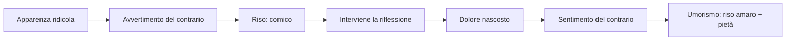
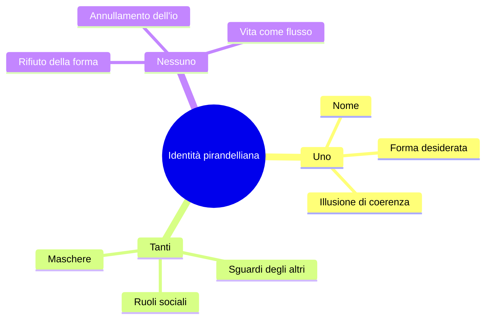
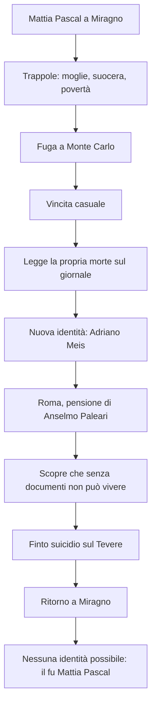
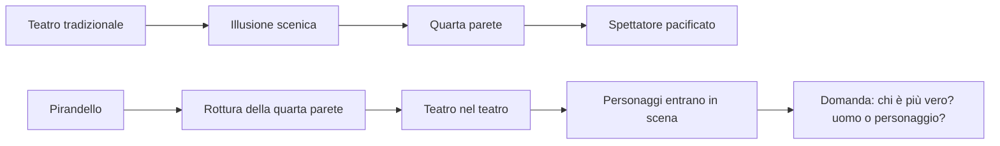
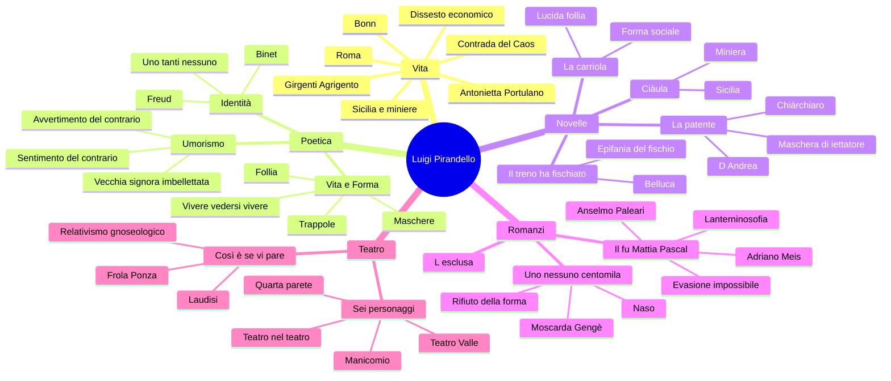

# Luigi Pirandello

---

## Coordinate essenziali

| Elemento | Dettaglio |
|----------|-----------|
| **Nome** | Luigi Pirandello |
| **Nascita** | 1867, **Girgenti** (oggi Agrigento), in Sicilia, nella **contrada del Caos** |
| **Morte** | 1936, Roma |
| **Luoghi decisivi** | Sicilia · Bonn · Roma |
| **Professione** | Scrittore e professore alla Facoltà di Magistero di Roma |
| **Famiglia** | Sposa **Antonietta Portulano**, colpita da gravi crisi nervose e poi ricoverata |
| **Crisi economica** | Dissesto legato all'allagamento delle **miniere di zolfo** del padre e alla perdita della dote della moglie |
| **Produzione** | Novelle, romanzi, saggistica, teatro |
| **Opere chiave** | *L'umorismo* (1908) · *Novelle per un anno* · *Il fu Mattia Pascal* · *Uno, nessuno e centomila* · *Così è (se vi pare)* · *Sei personaggi in cerca d'autore* |

---

## 1. Vita, luoghi e produzione

### 1.1 Girgenti, Sicilia, contrada del Caos

Pirandello nasce a **Girgenti**, nome antico di Agrigento, in Sicilia, nella **contrada del Caos**. Il dato biografico ha anche valore simbolico: il "Caos" richiama bene un autore che smonta le certezze dell'identità, della verità e della realtà.

La Sicilia resta un legame profondo: è il luogo dell'infanzia e della giovinezza, ma anche uno spazio narrativo che ritorna in molte novelle. Un richiamo utile è ***Ciàula scopre la luna***: Ciàula è un caruso, un giovane minatore, vicino per ambiente a *Rosso Malpelo*, abituato alla cava chiusa, faticosa e pericolosa.

> [!note] Dalla lezione
> La docente insiste su Girgenti/Agrigento e sulla contrada del Caos come luoghi non solo biografici, ma quasi simbolici. Ricorda anche *Ciàula scopre la luna* per il legame tra Sicilia, miniere e immaginario pirandelliano.

### 1.2 Bonn, Roma, Antonietta Portulano

Pirandello studia anche a **Bonn**, in Germania, dove discute una tesi filologica sul dialetto agrigentino. Poi vive a **Roma**, dove scrive e insegna alla Facoltà di Magistero.

Sposa **Antonietta Portulano**, donna affetta da gravi disturbi nervosi. La sua gelosia patologica, fino ad accuse gravissime e irrazionali, conduce infine al ricovero. Questo dato non è solo privato: la **follia** diventa uno dei grandi temi dell'opera pirandelliana.

### 1.3 Il dissesto economico e la scrittura

Il dissesto economico arriva quando le **miniere di zolfo** del padre, in Sicilia, si allagano: va perduta anche la dote della moglie. Pirandello deve aumentare le entrate e scrive anche per necessità materiale. *Il fu Mattia Pascal* nasce in questa fase, scritto a puntate mentre assiste la moglie malata.

La sua produzione è vastissima:

| Ambito | Opere / caratteristiche |
|--------|-------------------------|
| **Saggistica** | *L'umorismo* (1908), testo teorico fondamentale |
| **Novelle** | Raccolte nel corpus delle *Novelle per un anno* |
| **Romanzi** | *L'esclusa*, *Il fu Mattia Pascal*, *Uno, nessuno e centomila* |
| **Teatro** | Drammaturgia rivoluzionaria: da *Così è (se vi pare)* a *Sei personaggi in cerca d'autore* |

### 1.4 Cronologia essenziale

| Anno | Evento / opera |
|------|----------------|
| **1867** | Nasce a Girgenti, nella contrada del Caos |
| **Bonn** | Discute la tesi sul dialetto agrigentino |
| **Roma** | Scrive e insegna alla Facoltà di Magistero |
| **1903-1904** | *Il fu Mattia Pascal*: pubblicazione a puntate e poi in volume |
| **1908** | Pubblica il saggio *L'umorismo* |
| **1917** | *Così è (se vi pare)* |
| **1921** | *Sei personaggi in cerca d'autore*, prima al Teatro Valle di Roma |
| **1926** | *Uno, nessuno e centomila* |
| **1936** | Muore a Roma |

---

## 2. *L'umorismo*: scomporre il reale

### 2.1 Il saggio del 1908

Nel 1908 Pirandello pubblica ***L'umorismo***, testo teorico decisivo perché illumina gran parte della sua produzione. L'arte, per Pirandello, non deve fermarsi alla superficie: deve **scomporre il reale**, cioè smontare le apparenze, le convenzioni, le false certezze e le ipocrisie del vivere sociale.

Questo atteggiamento si inserisce nel clima del **Decadentismo**, perché rifiuta l'idea positivistica di una realtà semplice, oggettiva, conoscibile con sicurezza. Però Pirandello va oltre: non dice soltanto che la realtà è misteriosa, ma che la realtà stabile e unitaria **non esiste** davvero, perché ogni individuo la vede da una prospettiva diversa.

### 2.2 Vecchia signora imbellettata

L'esempio classico è quello della **vecchia signora imbellettata**, truccata e vestita in modo vistoso, quasi giovanile. A prima vista fa ridere, perché appare il contrario di ciò che ci si aspetterebbe da una rispettabile signora anziana.

Ma se interviene la riflessione, il riso cambia: forse quella donna non si veste così per piacere, ma perché soffre e tenta disperatamente di trattenere l'amore di un marito più giovane. Allora il riso si fa pietà, comprensione, amarezza.

| Fase | Definizione | Effetto |
|------|-------------|---------|
| **Avvertimento del contrario** | Si nota qualcosa che contraddice le attese | Comico, riso |
| **Sentimento del contrario** | La riflessione scopre il dolore nascosto | Umorismo, riso amaro |

> [!note] Dalla lezione
> Nelle novelle pirandelliane bisogna aspettarsi situazioni apparentemente comiche che rivelano un fondo tragico. L'umorismo "fa ridere e pensare insieme".

---

## 3. Vita e Forma

### 3.1 La Vita come flusso

Alla base della poetica pirandelliana c'è la contrapposizione tra **Vita** e **Forma**.

La **Vita** è:

- perpetuo movimento vitale
- eterno divenire
- flusso continuo, incandescente, indistinto
- qualcosa di simile a un magma vulcanico

La **Forma**, invece, è ogni identità stabile: nome, cognome, ruolo sociale, professione, immagine di sé. Appena la vita prende forma, si irrigidisce. E ciò che si irrigidisce, per Pirandello, comincia a morire.

> [!note] Dalla lezione
> Formula chiave: **"ogni forma è una morte"**. L'identità è una cristallizzazione della vita; quindi è il contrario del flusso vitale.

### 3.2 Maschere, trappole, ruoli

Per vivere in società siamo costretti a indossare **maschere**. Non possiamo mostrarci come puro flusso vitale: dobbiamo essere studenti, insegnanti, figli, genitori, professionisti, mariti, mogli. Ogni ruolo ci rende riconoscibili, ma ci ingabbia.

Pirandello chiama **trappole** queste forme sociali:

| Trappola | Perché imprigiona |
|----------|-------------------|
| **Famiglia** | Impone ruoli affettivi e doveri, ma nasconde rancori, segreti, sofferenze |
| **Lavoro** | Riduce l'individuo a una funzione |
| **Società** | Pretende normalità, coerenza, rispettabilità |
| **Nome** | Chiude l'identità in una definizione fissa |

Chi rifiuta la maschera appare **pazzo**. Ma per Pirandello il pazzo può essere più vicino alla vita, perché non accetta più la forma imposta dalla società.

### 3.3 Vivere e vedersi vivere

Un'altra opposizione centrale è tra **vivere** e **vedersi vivere**.

Chi vive davvero aderisce spontaneamente alla vita, senza guardarsi dall'esterno. Chi invece si vede vivere si analizza, si osserva da fuori, scopre la distanza tra la forma che porta e la vita autentica. Da quel momento non può più tornare alla spontaneità.

> [!note] Dalla lezione
> Nella lettura de *La carriola* emerge la frase decisiva: **"Chi vive, quando vive, non si vede vivere"**. Se uno vede la propria vita, significa che non la vive più: la subisce.

Da qui derivano due formule decisive:

- **ogni forma è una morte**
- **conoscersi è morire**

Conoscere se stessi significa vedere la forma in cui ci si è irrigiditi: dunque vedere ciò che di noi è già morto.

---

## 4. Identità: uno, tanti, nessuno

### 4.1 Binet, Freud e le personalità molteplici

Pirandello risente del clima culturale del primo Novecento: la nascita della psicoanalisi di **Freud** e soprattutto gli studi di **Alfred Binet** sulle alterazioni della personalità. Binet sosteneva che nell'individuo convivano più persone ignote a lui stesso, capaci di emergere all'improvviso.

Pirandello traduce questa intuizione in letteratura: noi crediamo di essere **uno**, coerenti e riconoscibili, ma in realtà siamo **tanti**, perché cambiamo a seconda dello sguardo degli altri.

| Illusione | Scoperta pirandelliana |
|-----------|------------------------|
| Sono uno per me stesso | Mi costruisco una forma in cui voglio riconoscermi |
| Gli altri mi vedono come sono | Gli altri mi danno forme diverse e parziali |
| Posso conoscermi davvero | Conoscersi significa scoprire la propria prigione |
| Esiste una verità oggettiva sull'io | Esistono tante immagini quanti sono gli sguardi |

### 4.2 Collegamento con il romanzo del Novecento

Pirandello è pienamente dentro il **romanzo del Novecento**, perché mette al centro:

- la crisi dell'identità
- l'inattendibilità del punto di vista
- l'interiorità problematica
- il crollo delle certezze positivistiche
- l'uomo non eroico, dissonante, inadatto

Il collegamento con **Svevo** è forte: Zeno e Mattia Pascal sono personaggi che riflettono su se stessi, si raccontano a distanza di tempo, mescolano verità e menzogne, vivono in rapporto problematico con la società borghese. Ma Pirandello porta la crisi dell'io fino alla frantumazione e alla dissoluzione della forma.

---

## 5. Le novelle

### 5.1 *Il treno ha fischiato*: Belluca

Belluca è un contabile, un **impiegato** modello, puntuale e obbediente: va evitato l'errore di chiamarlo operaio. Un giorno arriva in ufficio in ritardo, farneticando: dice di aver sentito **il treno fischiare**. Il fischio è realmente sentito, non inventato né allucinato; ciò che cambia è il valore che assume per lui. I colleghi lo giudicano pazzo, perché il suo comportamento contraddice la forma in cui lo avevano sempre rinchiuso.

Poi si scopre la sua vita: è schiacciato dal lavoro, dalla famiglia, dai doveri, da donne malate da mantenere. Il fischio del treno diventa un'**epifania**: gli rivela che oltre il suo mondo soffocante esistono viaggi, terre lontane, possibilità, immaginazione.

| Aspetto | Significato |
|---------|-------------|
| **Forma di Belluca** | Bravo impiegato, diligente, responsabile |
| **Epifania** | Il fischio del treno |
| **Vita** | Immaginazione, evasione mentale, possibilità |
| **Umorismo** | Prima sembra pazzo e ridicolo; poi si comprende la tragedia |

### 5.2 *La carriola*

Il protagonista è un uomo rispettabile: marito, padre, professore di diritto, avvocato. Ha una forma sociale solida e ammirata. Ma tornando da Perugia, in treno, ha un momento di sospensione: percepisce il "brulichio" di una vita diversa, autentica, mai nata.

Davanti alla porta di casa, leggendo sulla targa il proprio nome e i propri titoli, si vede da fuori e non si riconosce. Capisce che quell'uomo stimato non è la sua vera vita, ma una forma imposta dalla società, dalla famiglia, dal lavoro e dalle aspettative.

Il suo gesto segreto di liberazione è assurdo e comico: prende la vecchia cagnetta per le zampe posteriori e le fa fare **la carriola**. È una "lucida follia", un atto minimo che per un attimo lo fa uscire dalla prigione della forma.

> [!note] Dalla lezione
> La famiglia è definita una **trappola**, una "stanza della tortura": luogo in cui ognuno è costretto a un ruolo che non gli corrisponde.

### 5.3 *La patente*: Chiàrchiaro e D'Andrea

***La patente*** è una novella umoristica e grottesca. Il protagonista, **Rosario Chiàrchiaro**, è considerato da tutti uno **iettatore**, cioè un portatore di sfortuna. Questa superstizione lo ha rovinato economicamente e socialmente.

La novella parte **in medias res**: il giudice **D'Andrea** sta esaminando la querela che Chiàrchiaro ha intentato contro due uomini che facevano scongiuri al suo passaggio. D'Andrea vorrebbe convincerlo a ritirarla, perché la causa sembra assurda. Ma Chiàrchiaro vuole paradossalmente **perdere**: desidera ottenere un riconoscimento ufficiale, una vera **patente di iettatore**, per trasformare la maschera impostagli dagli altri in una professione.

| Livello | Contenuto |
|---------|-----------|
| **Comico** | Chiàrchiaro si veste e si atteggia da iettatore, chiedendo una patente assurda |
| **Tragico** | Non crede alla superstizione, ma è stato rovinato da essa |
| **Umoristico** | Il riso si trasforma in pietà: lo fa per mantenere moglie paralitica e figlie |
| **Tema pirandelliano** | La maschera sociale diventa gabbia; l'unica via è sfruttarla |

### 5.4 Ciàula come richiamo

*Ciàula scopre la luna* va ricordata come richiamo alla Sicilia e al mondo delle miniere: il protagonista è un caruso che vive nella cava, in un ambiente chiuso e faticoso. Serve anche a collegare Pirandello alla tradizione verista di Verga, ma il suo sguardo non è più positivistico: è simbolico, umoristico, psicologico.

---

## 6. I romanzi

### 6.1 *L'esclusa*

***L'esclusa*** è il primo romanzo di Pirandello e conserva ancora residui naturalistici. Va ricordato soprattutto come punto di partenza: l'interesse per la società, per il giudizio collettivo e per l'esclusione dell'individuo è già presente, ma la piena rivoluzione pirandelliana maturerà con *Il fu Mattia Pascal*.

### 6.2 *Il fu Mattia Pascal*

***Il fu Mattia Pascal*** viene pubblicato a puntate nel 1903 e in volume nel 1904. È un romanzo centrale sul tema dell'**identità** e dello **sdoppiamento**.

Mattia Pascal vive a **Miragno**, paese immaginario della Liguria. Ha una moglie a cui non è legato, una suocera invadente e problemi economici. Si allontana, va a Monte Carlo e al casinò vince una fortuna per caso. Poco dopo legge sul giornale che nel suo paese un cadavere suicida è stato identificato come Mattia Pascal.

Approfitta dell'equivoco e decide di fuggire dalla propria vita. Assume una nuova identità: **Adriano Meis**. Viaggia, poi si stabilisce a Roma nella pensione di **Anselmo Paleari**, appassionato di teosofia e spiritismo. Per cancellare un segno della vecchia identità si opera anche all'**occhio strabico**.

Ma la fuga fallisce: Adriano Meis non ha documenti, non può sposare la donna amata, non può denunciare un furto, non può vivere davvero nella società. Allora inscena un suicidio lasciando cappello e bastone sul Tevere e torna a Miragno. Ma la moglie si è risposata e la vita è andata avanti. Non può più essere Mattia Pascal, ma non può essere Adriano Meis: resta solo **il fu Mattia Pascal**, un morto-vivo che visita la propria tomba.

#### La Lanterninosofia (cap. XIII)

**Etichetta del programma:** ***Il fu Mattia Pascal*, "La lanterninosofia" (cap. XIII)**.

Durante la convalescenza di Adriano Meis, nel **capitolo XIII**, Anselmo Paleari espone la **Lanterninosofia**:

- ogni individuo porta con sé un **lanternino**, che illumina una piccola zona della realtà
- quel lanternino mostra soprattutto il buio che lo circonda
- le masse seguono grandi **lanternoni**: fede religiosa, fede nella scienza, ideologie politiche
- nei periodi di crisi i lanternoni si spengono e resta il caos

La Lanterninosofia esprime il **relativismo gnoseologico** pirandelliano: ogni uomo vede la realtà attraverso il proprio piccolo lume. Una realtà oggettiva, unica e stabile non è garantita; quando i lanternoni collettivi si spengono, l'individuo resta senza orientamento.

#### Brano: **Pascal porta i fiori alla propria tomba** (cap. XVIII)

**Etichetta del programma:** ***Il fu Mattia Pascal*, "Pascal porta i fiori alla propria tomba" (cap. XVIII)**.  
Fonti locali: [programma di Italiano](../../../programma/italiano.md), [lezione del 28/04/2026](../lezioni/28-04-26/transcription.txt).

Il brano appartiene al **capitolo XVIII**, cioè al finale del romanzo. Dopo il fallimento dell'identità di **Adriano Meis**, Mattia inscena un secondo suicidio lasciando cappello e bastone sul Tevere e torna a **Miragno**. Ma la fuga non gli restituisce la vita precedente: la moglie si è risposata, il paese è cambiato, i rapporti sociali non lo riaccolgono.

Il gesto di portare i fiori alla propria tomba è il simbolo più chiaro della sua condizione:

| Elemento | Significato |
|----------|-------------|
| **La tomba di Mattia Pascal** | La società lo considera morto; la vecchia identità è finita |
| **I fiori** | Gesto funebre paradossale: Mattia compie il rito per se stesso |
| **Il ritorno a Miragno** | Non è ritorno alla vita, ma constatazione dell'esclusione |
| **Il "fu"** | Mattia è definito da ciò che non è più: un'identità postuma |
| **La biblioteca polverosa** | Luogo di sospensione, immobilità, vita separata dal flusso |

Qui Pirandello mostra che l'evasione dalle forme sociali è impossibile. Mattia voleva liberarsi da moglie, suocera, povertà e ruolo sociale; diventando Adriano Meis, però, scopre che senza documenti non si può vivere. Quando torna a essere Mattia, scopre che la Vita è andata avanti senza di lui. Il risultato non è libertà, ma esclusione.

#### Cosa dire all'orale

> In "Pascal porta i fiori alla propria tomba", capitolo XVIII del *Fu Mattia Pascal*, il protagonista torna a Miragno dopo il fallimento dell'identità di Adriano Meis. Scopre però che la sua vecchia vita non esiste più: la moglie si è risposata, i legami sono spezzati, la società lo considera morto. Portare i fiori alla propria tomba significa riconoscere di essere vivo biologicamente ma morto socialmente. Mattia non può più essere se stesso e non può essere un altro: resta "il fu Mattia Pascal". Il brano dimostra la tesi pirandelliana secondo cui evadere dalle forme è impossibile.

#### Tecniche e significato

| Elemento | Significato |
|----------|-------------|
| **Narratore-personaggio** | Mattia racconta la propria storia a distanza di tempo |
| **Narratore inattendibile** | Il racconto mescola verità, menzogne, autoinganni |
| **Coscienza ipertrofica** | Il protagonista pensa troppo, si osserva, non riesce a vivere spontaneamente |
| **Occhio strabico** | Segno fisico della visione obliqua, laterale, non pacificata |
| **Caso** | La vicenda procede per eventi casuali e bizzarri |
| **Evasione impossibile** | Fuori dalle forme sociali non si vive; dentro le forme si soffoca |

> [!note] Dalla lezione
> Formula conclusiva: **evadere è impossibile**. Vivere fuori dai rapporti sociali non si può, ma vivere dentro quei rapporti significa restare in forme false.

### 6.3 *Uno, nessuno e centomila*

In ***Uno, nessuno e centomila*** il tema dell'identità viene radicalizzato. Se in *Il fu Mattia Pascal* c'era lo sdoppiamento Mattia/Adriano, qui si arriva alla **frammentazione totale** dell'io.

Il protagonista è **Vitangelo Moscarda**, detto **Gengè**. Tutto nasce da un episodio minimo: la moglie gli fa notare che il suo naso pende da una parte. Moscarda non se n'era mai accorto. Quel dettaglio diventa un'epifania: capisce di non coincidere con l'immagine che gli altri hanno di lui.

Da lì inizia il rifiuto di ogni forma: beni, ruolo sociale, nome, identità. Moscarda vuole liberarsi dalle definizioni e aderire alla vita come flusso.

| Formula | Significato |
|---------|-------------|
| **Uno** | L'io che crediamo di essere |
| **Centomila** | Le immagini che gli altri hanno di noi |
| **Nessuno** | L'io che si dissolve rifiutando ogni forma |

Il finale richiama il **panismo**, ma in modo rovesciato rispetto a **D'Annunzio**. Nel panismo dannunziano l'io si fonde con la natura in senso eroico e superomistico; in Pirandello, invece, il fondersi con albero, sasso, foglia significa **annullamento dell'io**, rifiuto del nome e della forma. Non è trionfo dell'io, ma dissoluzione.

#### Brano: **Nessun nome**

**Etichetta del programma:** ***Uno, nessuno, centomila*, "Nessun nome"**.  
Fonti locali: [programma di Italiano](../../../programma/italiano.md), [lezione del 28/04/2026](../lezioni/28-04-26/transcription.txt).

"**Nessun nome**" è il brano conclusivo di *Uno, nessuno e centomila* e va studiato come punto estremo della riflessione pirandelliana sull'identità. Dopo avere scoperto di non coincidere con l'immagine che gli altri hanno di lui, **Vitangelo Moscarda** arriva a rifiutare non solo il ruolo sociale, ma anche il nome.

Per Pirandello il nome è una **forma**: sembra dirci chi siamo, ma in realtà ci fissa, ci irrigidisce, ci separa dal movimento della Vita. Dire "Vitangelo Moscarda" significa chiudere il flusso vitale dentro un'etichetta stabile; ma la vita, per Pirandello, non è mai stabile.

| Formula | Nel romanzo | Nel brano "Nessun nome" |
|---------|-------------|--------------------------|
| **Uno** | L'identità che Moscarda credeva di possedere | Viene distrutta dalla scoperta del naso e dagli sguardi altrui |
| **Centomila** | Le immagini diverse che gli altri hanno di lui | Ogni sguardo produce un Moscarda diverso |
| **Nessuno** | Il rifiuto di ogni forma fissa | Moscarda rinuncia al nome e si dissolve nel flusso della Vita |

Il finale ha un andamento quasi liberatorio, ma non va confuso con una vittoria eroica. Moscarda non conquista un'identità più forte: rinuncia all'identità. Vuole vivere senza concludersi in un nome, senza riconoscersi in un ruolo, aderendo di momento in momento alla natura, alle cose, al fluire dell'esistenza.

#### Panismo rovesciato

Il confronto con **D'Annunzio** è utilissimo all'orale:

| D'Annunzio | Pirandello |
|-----------|------------|
| Fusione con la natura come potenziamento dell'io | Fusione con la natura come annullamento dell'io |
| Panismo vitalistico e superomistico | Panismo rovesciato, dissoluzione della persona |
| L'io si espande | L'io scompare |
| La natura esalta il soggetto | La natura cancella il nome e la forma |

#### Cosa dire all'orale

> "Nessun nome" è il finale di *Uno, nessuno e centomila*. Moscarda porta alle estreme conseguenze la scoperta iniziale: non esiste un io unico, perché ciascuno di noi vive nelle immagini che gli altri si fanno di noi. Per liberarsi dalle forme, Moscarda rifiuta beni, ruolo sociale e soprattutto il nome. Il nome, in Pirandello, conclude e irrigidisce; la Vita invece è flusso continuo. Perciò Moscarda sceglie di essere "nessuno", dissolvendosi nella natura. È un panismo rovesciato rispetto a D'Annunzio: non trionfo dell'io, ma annullamento dell'identità.

---

## 7. Il teatro

### 7.1 Un teatro che mette in crisi

Pirandello arriva al teatro in età matura. Dopo i romanzi, soprattutto dopo *Uno, nessuno e centomila*, si dedica quasi esclusivamente alla novellistica e al teatro. Molte opere teatrali riprendono situazioni e personaggi delle novelle.

Il teatro pirandelliano non vuole pacificare lo spettatore: vuole **mettere in crisi**, costringere a pensare, distruggere l'illusione teatrale tradizionale.

### 7.2 *Così è (se vi pare)* (Atto III) e **La signora Frola e il signor Ponza, suo genero**

**Etichette del programma:**

- ***Novelle per un anno*, "La signora Frola e il signor Ponza, suo genero" (cenni)**
- ***Maschere nude*, *Così è (se vi pare)* (Atto III)**

Fonti locali: [programma di Italiano](../../../programma/italiano.md), [lezione del 04/05/2026](../lezioni/04-05-26/transcription.txt).

***Così è (se vi pare)***, del 1917, nasce dalla novella ***La signora Frola e il signor Ponza, suo genero***. In un paese arrivano il signor Ponza, sua moglie e la signora Frola. La comunità vuole sapere chi sia davvero la donna: figlia della signora Frola o seconda moglie del signor Ponza?

Le due versioni sono inconciliabili:

| Personaggio | Verità sostenuta |
|-------------|------------------|
| **Signora Frola** | La donna è sua figlia; Ponza è pazzo perché crede sia una seconda moglie |
| **Signor Ponza** | La figlia della signora Frola è morta; la donna è la sua seconda moglie; Frola è pazza |

Gli abitanti del paese vogliono una verità oggettiva e infieriscono sui personaggi, senza capire la loro tragedia e la pietà reciproca che li lega. Nel dramma compare **Laudisi**, assente nella novella, alter ego di Pirandello: con ironia smonta le certezze di chi pretende la verità.

La conclusione è la formula perfetta del **relativismo gnoseologico**, cioè l'idea che esistano tante verità quanti sono i punti di vista e che non sia raggiungibile una verità oggettiva unica:

> "Io sono colei che mi si crede."

La verità non è unica, assoluta, oggettiva: esistono tante verità quanti sono i punti di vista.

#### La novella: "La signora Frola e il signor Ponza, suo genero" (cenni)

Nella novella il centro non è la soluzione dell'enigma, ma l'atteggiamento della comunità. Gli abitanti vogliono sapere chi sia pazzo e chi dica il vero; però la loro curiosità diventa una forma di violenza. Pirandello mette in scena la crudeltà sociale di chi pretende una verità semplice e non vede il dolore altrui.

Il rapporto tra Frola e Ponza è fondato su una possibile **pietà reciproca**: ciascuno sembra assecondare la verità dell'altro per permettergli di sopravvivere a un lutto. La follia, allora, non è soltanto patologia individuale; è anche il nome che la società assegna a ciò che non riesce a comprendere.

#### L'Atto III di *Così è (se vi pare)*

Nell'**Atto III** del dramma viene chiamata in scena la donna che dovrebbe sciogliere il mistero: è la figlia della signora Frola o la seconda moglie del signor Ponza? La risposta è volutamente paradossale:

> "Io sono, sì, la figlia della signora Frola, e la seconda moglie del signor Ponza. [...] Per me, io sono colei che mi si crede."

La donna non restituisce una verità oggettiva; mostra che l'identità dipende dallo sguardo degli altri. Per la signora Frola è figlia; per il signor Ponza è moglie; per se stessa è "nessuna", cioè non riducibile a una definizione stabile.

#### Cosa dire all'orale

> La novella "La signora Frola e il signor Ponza, suo genero" e l'Atto III di *Così è (se vi pare)* mostrano il relativismo gnoseologico di Pirandello. La signora Frola sostiene che la donna sia sua figlia e che Ponza sia pazzo; Ponza sostiene invece che la figlia di Frola sia morta e che la donna sia la sua seconda moglie. La comunità vuole una verità unica e infierisce sui personaggi, senza cogliere la pietà e il dolore che li legano. Nell'Atto III la donna dice: "Io sono colei che mi si crede". La verità non viene risolta: Pirandello mostra che esistono tante verità quanti sono i punti di vista.

### 7.3 *Sei personaggi in cerca d'autore*

***Sei personaggi in cerca d'autore*** va in scena nel 1921 al **Teatro Valle** di Roma. La prima reazione del pubblico è violentissima: molti gridano **"manicomio!"**, Pirandello deve uscire dall'ingresso secondario, ma pochi mesi dopo l'opera diventa un successo europeo.

L'opera è rivoluzionaria perché rompe le convenzioni del teatro tradizionale:

- cade la **quarta parete**
- il teatro mostra se stesso
- la scena inizia in un teatro apparentemente vuoto, con attrezzisti e attori
- gli attori stanno provando *Il giuoco delle parti*
- irrompono sei personaggi, chiedendo di vivere sulla scena
- nasce il **teatro nel teatro**

I personaggi sostengono di essere più veri degli uomini: l'uomo muore, mentre il personaggio, se trova una forma artistica, può vivere per sempre. Da qui la frase-idea decisiva: i personaggi sono "meno reali forse, ma più veri".

> [!note] Dalla lezione
> La docente sottolinea l'ironia metateatrale: Pirandello arriva a far inveire gli attori contro le commedie di Pirandello stesso. Il pubblico è costretto a interrogarsi su che cosa sia vero, che cosa sia finzione, che cosa sia teatro.

---

## 8. Collegamenti

| Collegamento | Come usarlo |
|--------------|-------------|
| **Svevo** | Romanzo del Novecento, narratore inattendibile, crisi dell'io, personaggi che si osservano e si raccontano |
| **Romanzo del Novecento** | Fine dell'eroe ottocentesco, centralità dell'interiorità, tempo non lineare, soggettività |
| **Decadentismo** | Crisi del Positivismo, realtà non riducibile alla ragione; Pirandello però supera anche il Decadentismo perché nega una realtà unitaria |
| **Positivismo** | Pirandello lo supera: la realtà non è conoscibile oggettivamente e razionalmente |
| **D'Annunzio** | Panismo rovesciato in *Uno, nessuno e centomila*: non esaltazione superomistica dell'io, ma annullamento dell'io |
| **Freud** | Pulsioni represse, inconscio, crisi dell'io; influenza presente ma non principale |
| **Binet** | Influenza più diretta: personalità molteplici, coesistenza di più io nello stesso individuo |

---

## 9. Quadro finale

---

## 10. Dossier denso dalle lezioni: formule, passaggi, sfumature

Questa sezione raccoglie in modo più fitto i passaggi delle lezioni che servono per un'interrogazione completa. Non va letta come un'aggiunta separata, ma come un rinforzo dei nodi già spiegati: biografia, umorismo, identità, novelle, romanzi e teatro.

### 10.1 Biografia come origine concreta dei temi

La biografia di Pirandello non è un semplice elenco di fatti. Molti elementi diventano subito materia letteraria:

| Dato biografico | Valore dentro l'opera |
|-----------------|-----------------------|
| **Girgenti/Agrigento** | Radice siciliana, mondo periferico, rapporto con una realtà arcaica e dura |
| **Contrada del Caos** | Nome simbolico: il caos richiama la crisi di ordine, identità e verità |
| **Sicilia e miniere di zolfo** | Ambiente chiuso, faticoso, pericoloso; richiamo a *Ciàula scopre la luna* e al mondo dei carusi |
| **Bonn** | Formazione filologica e scientifica sul dialetto agrigentino, apertura europea |
| **Roma** | Luogo dell'insegnamento alla Facoltà di Magistero e della maturazione letteraria |
| **Antonietta Portulano** | La malattia nervosa e la gelosia patologica portano Pirandello a conoscere da vicino il tema della follia |
| **Accusa di incesto verso la figlia** | Segno della violenza della patologia: la famiglia non è un rifugio idilliaco, ma può diventare luogo di sospetto e tortura |
| **Ricovero della moglie** | La follia diventa esperienza familiare concreta, non solo categoria astratta |
| **Dissesto economico** | L'allagamento delle miniere del padre e la perdita della dote costringono Pirandello a scrivere anche per necessità |
| **Scrittura del *Fu Mattia Pascal*** | Romanzo scritto a puntate, anche per guadagnare, durante l'assistenza alla moglie malata |
| **Nobel** | Riconoscimento internazionale della portata rivoluzionaria della sua opera |

La docente insiste sul fatto che la follia è un tema vissuto prima che teorizzato. Pirandello non parte da un gusto astratto per il personaggio strano: conosce nella propria casa la frattura tra normalità apparente e disordine psichico. Da qui nasce una sensibilità fortissima per chi viene giudicato "pazzo" dalla società, ma in realtà mostra soltanto l'inconsistenza delle regole comuni.

### 10.2 *L'umorismo*: dall'incidente comico alla pietà

La spiegazione del saggio del 1908 parte da esempi semplicissimi. Se una persona cammina in corridoio, inciampa e cade, si ride perché accade il contrario di ciò che ci si aspetta: dovrebbe camminare normalmente, invece cade. Lo stesso avviene nelle comiche di **Charlie Chaplin**, quando il personaggio scivola sulla buccia di banana. L'evento è comico perché ribalta l'attesa e disillude la normalità.

Pirandello però non si ferma qui. Il comico è solo il primo livello, quello dell'**avvertimento del contrario**: vedo qualcosa che contraddice una norma, una convenzione, un'attesa. L'umorismo nasce quando interviene la riflessione e mi obbliga a chiedermi che dolore, che costrizione, che tragedia si nascondano dietro ciò che fa ridere.

L'esempio della vecchia signora è decisivo perché contiene tutto il meccanismo:

1. Vedo una **vecchia signora** con capelli tinti, unti di un'**orribile manteca**, cioè una specie di pomata/gel, e tutta goffamente imbellettata.
2. La vedo parata con abiti giovanili, come un pappagallo, e mi metto a ridere.
3. Avverto che è il contrario di ciò che una "vecchia rispettabile signora" dovrebbe essere.
4. Se mi fermo qui, sono nel comico.
5. Se però penso che forse non prova piacere a conciarsi così, ma lo fa per trattenere l'amore di un marito molto più giovane, il riso cambia.
6. Le rughe, le **canizie** e il trucco non sono più solo ridicoli: diventano il segno di una sofferenza.
7. Il riso diventa pietà, compassione, amarezza: questo è il **sentimento del contrario**.

| Livello | Domanda guida | Reazione | Categoria |
|---------|---------------|----------|-----------|
| Prima impressione | Che cosa vedo? | Rido perché qualcosa è fuori posto | Avvertimento del contrario |
| Riflessione | Perché quella persona è così? | Non posso più ridere come prima | Sentimento del contrario |
| Esito artistico | Che cosa si nasconde dietro il ridicolo? | Riso amaro, pietà, pensiero | Umorismo |

Per questo nelle novelle pirandelliane bisogna stare attenti: spesso l'inizio sembra comico, grottesco o assurdo, ma la riflessione rivela una tragedia. Belluca che farnetica, Chiàrchiaro vestito da iettatore, il professore che fa fare la carriola alla cagnetta: tutti fanno ridere solo finché non si capisce la prigione da cui provengono.

### 10.3 Binet, Freud e identità fallace

La crisi dell'identità in Pirandello nasce dentro il clima culturale del primo Novecento. Freud è presente come sfondo, soprattutto per l'idea di pulsioni represse e inconscio, ma l'influenza più diretta nelle lezioni è **Alfred Binet**, studioso delle alterazioni della personalità. Binet sostiene che nell'individuo possano coesistere più persone ignote a lui stesso, capaci di emergere inaspettatamente.

Pirandello traduce questa intuizione in una teoria letteraria dell'io:

- l'identità che assumiamo davanti agli altri è **fallace** e **ingannevole**;
- non rispecchia l'essenza individuale, perché l'essenza non è fissa;
- nome, cognome, professione e ruolo sembrano stabili, ma l'interiorità è **mutevole**;
- dentro la società reprimiamo pulsioni, desideri, verità non dicibili;
- a volte un'epifania fa emergere la verità repressa;
- chi rifiuta le norme sociali viene chiamato pazzo.

Gli esempi della lezione rendono chiaro il punto: se la professoressa entrasse a scuola in costume da bagno, o se dicesse "sono un lupino", la società la considererebbe fuori norma, probabilmente da ricoverare. Il punto non è il costume in sé: è la violazione della forma sociale. A scuola una persona deve indossare la maschera dell'insegnante, comportarsi da insegnante, parlare da insegnante. Se rompe quella forma, viene espulsa dalla normalità.

La società è fondata su norme necessarie alla convivenza, ma quelle stesse norme producono maschere. Il pazzo pirandelliano è colui che rifiuta di indossarle. Proprio per questo è scandaloso e insieme più vicino alla vita: non accetta la parte assegnata.

### 10.4 Vita e Forma: il nucleo della poetica

La formula della lezione è da sapere quasi a memoria. Alla base della visione pirandelliana c'è una **concezione vitalistica**: la realtà è **Vita**, cioè "perpetuo movimento vitale", "eterno divenire", "flusso continuo incandescente indistinto", simile allo scorrere di un **magma vulcanico**.

La Vita non è ordinata, ferma, classificabile. È movimento prima di ogni nome. Appena però l'uomo vive in società deve fissarsi in una forma: deve avere un nome, un cognome, una professione, una funzione familiare, un ruolo pubblico. Questa fissazione è necessaria, ma è anche una morte, perché blocca il flusso.

| Vita | Forma |
|------|-------|
| Movimento continuo | Fissazione |
| Eterno divenire | Identità stabile |
| Magma indistinto | Figura riconoscibile |
| Possibilità | Ruolo |
| Autenticità non definita | Maschera sociale |
| Flusso | Cristallizzazione |

La forma non viene solo da noi. Ognuno si costruisce una forma nella quale desidera riconoscersi, ma anche gli altri ce ne assegnano continuamente. Per la professoressa gli alunni sono anzitutto studenti; per gli alunni lei è anzitutto insegnante; per i genitori ciascuno è figlio; per gli amici è amico. Nessuna di queste forme coincide con la vita intera di una persona. Sono prospettive parziali, utili ma false se pretendono di essere totali.

Da qui deriva la struttura "uno, tanti, nessuno":

- **uno**: l'identità coerente e unitaria che vorremmo essere;
- **tanti**: le forme diverse che gli altri ci attribuiscono;
- **nessuno**: la dissoluzione dell'identità quando si rifiuta ogni forma.

La conseguenza più radicale è che **conoscersi è morire**. Finché si vive spontaneamente, non ci si vede. Quando invece ci si guarda da fuori, si vede la forma, e se la si vede significa che la vita non coincide più con essa. Si può conoscere solo ciò che di noi è già morto, cioè la forma fissata.

### 10.5 *Il treno ha fischiato*: Belluca e l'epifania dell'udito

Belluca è un contabile, un impiegato modello, sempre puntuale, obbediente, diligente. La sua forma sociale è quella del bravo lavoratore, affidabile e silenzioso. Un giorno però arriva in ufficio in ritardo e farnetica: dice di aver sentito il treno fischiare. I colleghi lo giudicano pazzo perché il comportamento è contrario alla forma consueta.

La novella diventa umoristica quando si scopre la sua vita:

- è schiacciato dal lavoro;
- ha una famiglia pesantissima da mantenere;
- vive tra donne malate e obblighi continui;
- non ha spazi di respiro;
- per troppo tempo è stato metaforicamente sordo alla vita fuori dalla propria prigione.

Il fischio del treno è un'**epifania**. Belluca improvvisamente ha "le orecchie aperte": sente che oltre il piccolo mondo di doveri esistono viaggi, terre lontane, paradisi, alternative, immaginazione. Non fugge materialmente dalle responsabilità, ma non può più rientrare davvero nella forma precedente. Chiede almeno la possibilità di allontanarsi con l'immaginazione dal pallore della sua esistenza.

L'umorismo è perfetto: prima rido del contabile che sembra impazzito, poi capisco che la sua vita è tragica. Il comico diventa pietà.

### 10.6 *La carriola*: struttura, epifania, trappole, gesto

*La carriola* è il punto più denso delle lezioni. La novella parte **in medias res**, con un narratore-protagonista in prima persona che parla di un atto segreto. Non sappiamo subito chi sia la "lei" che lo guarda, né quale sia il gesto terribile che non deve essere scoperto. Sappiamo solo che, se fosse scoperto, il danno sarebbe incalcolabile e lui sarebbe un uomo finito, forse trascinato in un ospizio di matti.

Il protagonista è un uomo rispettabile, gravato da ruoli pubblici e privati:

- marito;
- padre;
- cittadino;
- professore di diritto;
- avvocato;
- uomo a cui sono affidati vita, onore, libertà e averi di molte persone.

Questa enumerazione non serve a celebrarlo, ma a mostrare quanto sia imprigionato. La sua identità è tutta fatta di titoli, doveri, autorità, rispetto. La forma è solida, ma soffocante.

#### Il flashback del treno da Perugia

Dopo l'inizio in medias res, il narratore dice "ci proverò" e parte il **flashback**. Quindici giorni prima tornava da **Perugia** per affari professionali. In treno aveva con sé una **busta/cartella di cuoio** con carte da studiare. A una difficoltà incontrata nella lettura alza gli occhi verso il finestrino: gli occhi vedono la campagna umbra, ma lui non guarda davvero. È talmente immerso nei doveri da muoversi come un automa, alienato da sé.

Poi la concentrazione si allenta. Il protagonista entra in una sospensione vaga, strana, placida, ariosa. Avverte il **brulichio di una vita diversa**, una vita non sua ma che avrebbe potuto essere sua, lontana, piena, autentica. Non è solo piacere: sarebbe stata anche sofferenza, ma sofferenza veramente sua. È la percezione di tutto ciò che non è nato, di una possibilità vitale rimasta inespressa.

Al risveglio, però, arriva il rovescio: sente un'**atroce afa della vita**. La metafora è potentissima: come l'afa estiva toglie il respiro, così la sua esistenza di doveri e ruoli è soffocante.

#### La targa e il vedersi vivere

La vera epifania avviene davanti alla porta di casa. Sul pianerottolo vede la porta scura, la targa ovale d'ottone con il nome, i titoli, gli attributi scientifici e professionali. In quel momento vede **da fuori** se stesso e la propria vita, ma non li riconosce come suoi.

Capisce che quell'uomo con la busta di cuoio sotto il braccio non è lui, non è mai stato lui. È una figura imposta e combinata da altri, una forma mossa dentro una vita non sua. La domanda martellante è: chi ha fatto così quell'uomo? La risposta della lezione è: la società, le aspettative degli altri, le aspettative della famiglia, dei genitori, dei datori di lavoro, e anche quelle che ciascuno ha interiorizzato su se stesso.

Qui nasce il contrasto **vivere / vedersi vivere**. Chi vive non si vede. Se uno vede la propria vita, significa che non la vive più: la subisce, la trascina come cosa morta. I più si affannano per raggiungere una forma, uno stato, un riconoscimento, e credono così di conquistare la vita; invece cominciano a morire nella forma raggiunta.

#### Famiglia, lavoro e società come trappole

Dietro la porta ci sono la moglie e i quattro figli. Anche la famiglia è una **trappola**, addirittura una "stanza della tortura": non perché Pirandello neghi i legami affettivi, ma perché nella famiglia si annidano ruoli imposti, rancori, segreti non detti, doveri che soffocano. Il lavoro è trappola perché riduce l'uomo a funzione. La società è trappola perché pretende rispettabilità, coerenza, riconoscibilità.

Il protagonista prova nausea, orrore e odio verso la forma morta che non sente sua. La sua anima grida dentro quella forma, ma non può liberarsi davvero: i fatti compiuti restano, le responsabilità e le conseguenze delle azioni avvolgono come spire e tentacoli.

Le vie d'uscita radicali in Pirandello sono spesso **follia** e **suicidio**. Qui però non c'è suicidio: c'è un atto minuscolo, segreto, ridicolo e liberatorio.

#### La cagnetta lupetta e la carriola

La "vittima" è una vecchia **cagnetta lupetta**, bianca e nera, grassa, bassa e pelosa, con gli occhi appannati dalla vecchiaia. Si rifugia nello studio perché lì, tra carte e libri, è protetta dai ragazzi. Il protagonista coglie il momento in cui nessuno può vederlo: si alza piano dal seggiolone, controlla il corridoio, chiude l'uscio a chiave. Gli occhi gli sfavillano di gioia perché sta per concedersi di essere pazzo per un attimo solo.

Allora prende con garbo le zampine posteriori della cagnetta e le fa fare la carriola per otto o dieci passi. Non le fa male, non compie nulla di grave in sé. Ma l'atto è tremendo proprio perché è lui a farlo: un professore di diritto, un avvocato, un marito austero, un padre rispettabile non può giocare così. Se lo facesse un bambino sarebbe normale; fatto da lui, distrugge per un istante la sapienza, la dignità, il trono sociale del seggiolone.

La cagnetta lo guarda con occhi appannati e terrorizzati. Quegli occhi diventano il segno della coscienza del gesto: la bestia "sa" che lui non può scherzare. Il gesto è una **lucida follia liberatoria**: assurdo, comico, ma anche tragico perché rivela un uomo schiacciato da una forma morta.

### 10.7 *La patente*: maschera sociale trasformata in mestiere

*La patente* è presentata in classe anche attraverso l'episodio del film *Questa è la vita* del 1954, con **Totò** nel ruolo di Chiàrchiaro. La docente precisa che il film prende alcune licenze, ma aiuta a vedere la dimensione grottesca e teatrale del personaggio.

La novella parte **in medias res**: il giudice **D'Andrea** sta esaminando la querela intentata da Rosario **Chiàrchiaro** contro due uomini che facevano scongiuri al suo passaggio. D'Andrea vorrebbe convincerlo a ritirare la querela: la faccenda sembra assurda e rischia di peggiorare la situazione. Ma Chiàrchiaro vuole esattamente il contrario di ciò che ci si aspetta: vuole perdere.

La sua logica è paradossale ma lucidissima:

- tutti lo considerano iettatore;
- lui non crede davvero alla superstizione;
- però la diceria lo ha rovinato;
- la moglie è paralitica;
- le figlie sono da maritare;
- nessuno vuole avere rapporti con lui;
- se la società gli impone la maschera di iettatore, allora vuole una **patente ufficiale** per esercitarla.

Chiàrchiaro si veste e si atteggia da iettatore: abiti neri, occhiali o lenti scure, aspetto funereo. Questo produce l'avvertimento del contrario, perché fa ridere: è una situazione esagerata, ridicola, grottesca. Ma appena si capisce la miseria familiare e sociale, subentra il sentimento del contrario. La patente non è un capriccio: è l'ultima possibilità economica. Vuole potersi mettere davanti a negozi, case da gioco o botteghe, farsi pagare per andarsene e trasformare la paura altrui in reddito.

La maschera qui è terribile: Chiàrchiaro non sceglie liberamente di essere iettatore; è costretto ad assumere fino in fondo la forma che gli altri gli hanno appiccicato. La società prima lo distrugge con una falsa identità, poi lui prova a sopravvivere rendendo quella falsa identità una professione.

### 10.8 *Il fu Mattia Pascal*: identità doppia e impossibilità dell'evasione

Il romanzo viene pubblicato a puntate nel **1903** e raccolto in volume nel **1904**. Precede *L'umorismo*, ma ne anticipa già molti principi: scomposizione del reale, crisi dell'identità, narratore problematico, impossibilità di evadere dalle forme sociali.

Mattia vive a **Miragno**, paese immaginario della Liguria. La sua vita è una trappola: moglie non amata, suocera invadente, problemi economici. Decide di allontanarsi e va a **Monte Carlo**, dove vince al casinò non per strategia ma per caso, puntando istintivamente. Poco dopo legge sul giornale che nel suo paese un cadavere suicida è stato identificato come lui.

Qui nasce il grande esperimento: se la società lo crede morto, può provare a vivere senza la vecchia forma. Diventa **Adriano Meis**, viaggia, poi si stabilisce a Roma nella pensione di **Anselmo Paleari**. Anche il corpo deve cambiare: per cancellare un segno della vecchia identità, si sottopone a un intervento all'**occhio strabico**. Il difetto fisico ha valore simbolico perché indica una visione obliqua, laterale, tangenziale della vita.

#### Anselmo Paleari e la Lanterninosofia (cap. XIII)

Anselmo Paleari è appassionato di **teosofia** e **spiritismo**, pratiche diffuse all'inizio del Novecento. Durante la convalescenza di Adriano Meis, al buio dopo l'intervento all'occhio, gli espone nel **capitolo XIII** la **Lanterninosofia**.

La teoria dice che ogni individuo porta davanti a sé un piccolo **lanternino**. Questo illumina solo una zona ristretta e, proprio illuminandola, rende visibile il buio circostante. Non vediamo la realtà com'è: vediamo ciò che il nostro lanternino ci permette di vedere. Ogni uomo ha il proprio sentimento della vita, mutevole secondo tempi, casi e fortuna.

Esistono poi i **lanternoni**, grandi luci collettive che guidano le masse: fede religiosa, fede nella scienza, ideologie politiche, principi condivisi. Nei periodi di transizione, però, questi lanternoni si spengono. Pirandello vive proprio una fase in cui entrano in crisi la fede tradizionale, la fiducia positivistica nella scienza, le grandi certezze dell'Ottocento. Quando i lanternoni si spengono, resta il caos: l'individuo non sa più orientarsi né nella propria vita né nel mondo.

La Lanterninosofia contiene il superamento del **Positivismo** e anche del **Decadentismo**. Il Positivismo pensava la realtà come conoscibile razionalmente e oggettivamente; Pirandello lo nega. Il Decadentismo immaginava una realtà misteriosa, simbolica, profonda, da decifrare; Pirandello va oltre, perché non garantisce nemmeno l'esistenza di una realtà unitaria. La realtà è soggettiva, inconsistente, plurale.

#### Il fallimento di Adriano Meis

La nuova identità fallisce per una ragione concreta: senza documenti non si vive nella società. Adriano Meis non può sposare la donna amata, non può denunciare un furto, non può far valere diritti, non può esistere giuridicamente. La fuga dalla forma produce una forma ancora più impossibile: essere nessuno davanti alla legge.

Allora inscena un suicidio lasciando cappello e bastone sul Tevere e torna a Miragno. Ma la Vita, intesa come flusso inarrestabile, è andata avanti: la moglie si è risposata, il paese non lo reintegra, i legami sono spezzati. Non può più essere Mattia Pascal; non può essere Adriano Meis. Gli resta una condizione paradossale: essere **il fu Mattia Pascal**, cioè un uomo definito dalla propria morte.

#### "Pascal porta i fiori alla propria tomba" (cap. XVIII)

Nel **capitolo XVIII**, il finale della biblioteca polverosa e della visita alla propria tomba mostra l'esclusione definitiva. La biblioteca è luogo fermo, polveroso, non frequentato: immagine di una vita sospesa, separata dal flusso. Il gesto di **portare i fiori alla propria tomba** rende visibile il paradosso di Mattia: è vivo come individuo biologico, ma morto come identità sociale. Il titolo significa proprio questo: Mattia non è più un vivo pienamente riconosciuto, ma il "fu", colui che era.

#### Tecnica narrativa e romanzo del Novecento

Il romanzo capovolge i moduli tradizionali ottocenteschi:

- il narratore è anche protagonista;
- racconta a distanza di tempo;
- riflette su se stesso e sui casi della propria vita;
- mescola verità, menzogne, autoinganni;
- è quindi un **narratore inattendibile**, come Zeno;
- possiede una **coscienza ipertrofica**, cioè pensa troppo e si vede vivere;
- appartiene alla famiglia degli **inetti**, in dissonanza con il mondo;
- si affida al **caso**, non a un progetto eroico.

La conclusione è netta: **evadere è impossibile**. Dentro le forme sociali si soffoca, ma fuori dalle forme non si vive.

### 10.9 *Uno, nessuno e centomila*: dalla doppiezza alla disgregazione

Se *Il fu Mattia Pascal* mette in scena lo sdoppiamento Mattia/Adriano, *Uno, nessuno e centomila* porta il tema dell'identità alla disgregazione totale. Il protagonista è **Vitangelo Moscarda**, detto **Gengè**. Tutto nasce da un dettaglio minimo: la moglie gli fa notare che il suo naso pende da una parte. Lui non lo sapeva. Quindi l'immagine che aveva di sé non coincide con quella vista dagli altri.

Da qui parte una crisi radicale:

- io credo di essere uno;
- per mia moglie sono un altro, con un naso che io non conoscevo;
- per ogni persona esiste un Moscarda diverso;
- non posso possedere un'identità unica;
- ogni nome e ogni ruolo mi chiude in una forma;
- per vivere davvero devo rifiutare le convenzioni.

Moscarda arriva a rifiutare beni, proprietà, ruolo sociale, nome. Cede i suoi averi in beneficenza e non vuole più riconoscersi in una figura stabile. La prima trappola è proprio il nome: quando diciamo chi siamo, partiamo da nome e cognome, ma per Pirandello il nome "conclude", mentre la vita non conclude.

#### "Nessun nome"

Il finale, studiabile con l'etichetta **"Nessun nome"**, richiama il **panismo**, ma in modo rovesciato rispetto a D'Annunzio. In D'Annunzio la fusione con la natura è esperienza eroica, superomistica, potenziamento dell'io. In Pirandello, invece, riconoscersi nell'albero, nel sasso, nella foglia significa annullare l'io, rinunciare alla forma personale e soprattutto al nome, che fissa l'individuo in una forma. Non c'è gigantismo dell'io: c'è dissoluzione nella Vita.

### 10.10 Teatro: crisi dello spettatore e verità soggettiva

Pirandello arriva al teatro in età matura e lo trasforma in uno strumento per mettere in crisi il pubblico. Il teatro non deve congedare lo spettatore pacificato: deve costringerlo a interrogarsi. Prima dei *Sei personaggi*, un'opera fondamentale è ***Così è (se vi pare)*** del 1917, nata dalla novella ***La signora Frola e il signor Ponza, suo genero***. Il passaggio da ricordare per il programma è l'**Atto III**.

La vicenda ruota attorno a una doppia verità. In paese arrivano il signor Ponza, sua moglie e la signora Frola. I cittadini vogliono sapere chi sia davvero la donna:

- per la signora Frola è sua figlia, e Ponza è pazzo perché la crede una seconda moglie;
- per il signor Ponza la figlia della signora Frola è morta, e la donna è la sua seconda moglie; è Frola a essere pazza;
- entrambi sembrano sostenere la propria versione anche per pietà verso l'altro.

Il paese però non rispetta questa pietà. Vuole sapere, domanda, insiste, infierisce. La curiosità collettiva è crudele perché ignora il dolore: dietro la questione c'è un lutto, una perdita, una finzione che forse serve a sopravvivere. Nel dramma compare **Laudisi**, assente nella novella, alter ego di Pirandello, che smonta ironicamente le certezze di chi pretende una verità oggettiva.

La risposta finale della donna scioglie e insieme non scioglie il nodo: "Io sono colei che mi si crede". Non dice quale verità sia quella vera; mostra che la sua identità dipende dagli sguardi e dalle credenze. È il relativismo gnoseologico: non esiste una verità unica, assoluta, stabile, ma tante verità quanti sono i punti di vista.

### 10.11 *Sei personaggi in cerca d'autore*: rivoluzione metateatrale

*Sei personaggi in cerca d'autore* va in scena nel **1921** al Teatro Valle di Roma. La prima reazione è di scandalo: il pubblico grida "manicomio!", Pirandello rischia quasi il linciaggio ed esce dall'ingresso secondario. Pochi mesi dopo, però, l'opera diventa un successo europeo. Questo passaggio è importante: la violenza della reazione dimostra che il pubblico non era preparato a una forma teatrale così nuova.

La rivoluzione consiste nella rottura dell'illusione scenica:

- il sipario è aperto;
- il teatro sembra vuoto;
- si vedono attrezzisti e tecnici;
- gli attori entrano come attori, con tic, vizi, manie;
- arriva il capocomico;
- la compagnia sta provando *Il giuoco delle parti*;
- gli attori si lamentano delle commedie di Pirandello;
- la scena mostra il teatro mentre fa teatro.

Questa è **caduta della quarta parete** e **teatro nel teatro**. Lo spettatore non può più fingere di guardare una realtà chiusa e autonoma: vede i meccanismi della rappresentazione. Pirandello usa anche ironia metateatrale, perché fa criticare Pirandello dai suoi stessi attori.

Quando entrano i sei personaggi, dicono di essere "in cerca d'autore". Portano un dramma doloroso che l'autore non ha voluto o potuto mettere al mondo dell'arte. Il capocomico e gli attori li prendono per pazzi, ma i personaggi rovesciano l'accusa: la vita è piena di assurdità vere, mentre il mestiere del teatro consiste nel creare assurdità verosimili perché sembrino vere.

La frase più importante è l'opposizione tra uomini e personaggi. Gli uomini respirano, vestono panni, muoiono. I personaggi, se trovano una forma artistica, possono vivere per sempre. Don Abbondio e Sancho Panza non sono "reali" come uomini storici presenti, eppure vivono eternamente nella fantasia dei lettori. Per questo i personaggi sono "meno reali forse, ma più veri".

La contrapposizione è profondamente pirandelliana:

| Uomini / attori | Personaggi |
|-----------------|-------------|
| Vivono biologicamente | Vivono artisticamente |
| Cambiano e muoiono | Restano fissati in una forma eterna |
| Sono incoerenti, mutevoli | Hanno un dramma definito |
| Recitano parti | Sono la propria parte |
| Appaiono reali | Pretendono di essere più veri |

Il paradosso è che per Pirandello la forma nella vita è morte, ma nell'arte può diventare durata. Nella società la forma imprigiona; nell'opera artistica il personaggio trova una forma capace di sopravvivere.

### 10.12 Collegamenti pronti per orale

**Pirandello e Svevo.** Entrambi appartengono al romanzo del Novecento e rappresentano personaggi non eroici, problematici, segnati da coscienza ipertrofica e narratori inattendibili. Zeno e Mattia si raccontano a distanza di tempo, mescolando verità e menzogna. Svevo insiste sulla malattia e sull'inettitudine; Pirandello sulla forma, sulle maschere e sulla frantumazione dell'identità.

**Pirandello e Positivismo.** Pirandello supera il Positivismo perché nega che la realtà sia oggettivamente conoscibile dalla ragione. La Lanterninosofia mostra che ognuno illumina solo una piccola zona con il proprio lanternino; quando i lanternoni collettivi si spengono, resta il caos.

**Pirandello e Decadentismo.** Parte dal clima decadente perché rifiuta la realtà piatta e razionale del Positivismo, ma supera anche il Decadentismo: per i decadenti la realtà profonda esiste ed è misteriosa, simbolica, da decifrare; per Pirandello una realtà unitaria e stabile non esiste.

**Pirandello e D'Annunzio.** Il confronto più efficace è sul panismo. D'Annunzio vive la fusione con la natura come esaltazione superomistica dell'io; Pirandello in *Uno, nessuno e centomila* la rovescia in annullamento dell'io, rifiuto del nome e della forma.

**Pirandello e teatro moderno.** Con *Sei personaggi in cerca d'autore* rompe la quarta parete e mette in scena il teatro che riflette su se stesso. Il pubblico non riceve una storia chiusa, ma viene costretto a chiedersi che cosa sia vero, che cosa sia finzione, e perché un personaggio possa essere più vero di un uomo.

---

*Fonti: lezioni del 20/04/2026, 21/04/2026, 23/04/2026, 27/04/2026, 28/04/2026, 04/05/2026, 18/05/2026, 25/05/2026, 26/05/2026 — Lingua e letteratura italiana*
