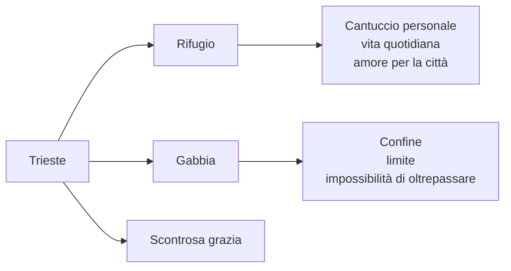
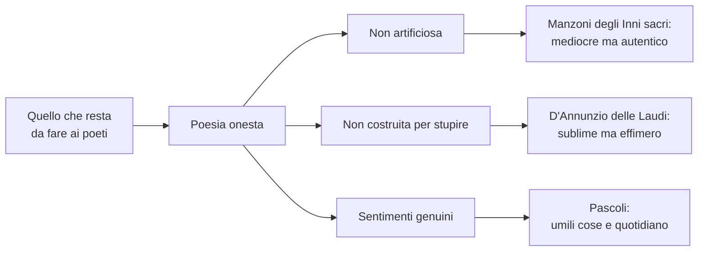
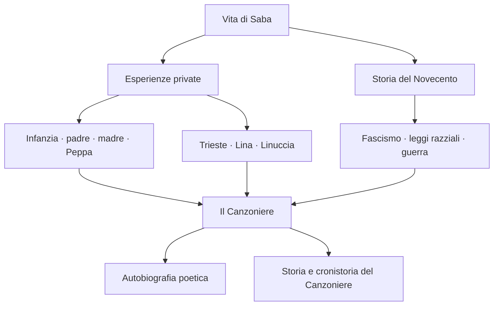
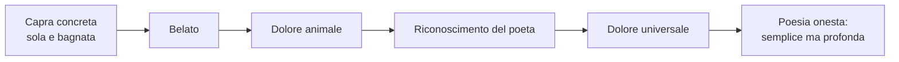
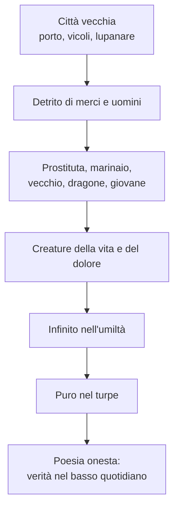
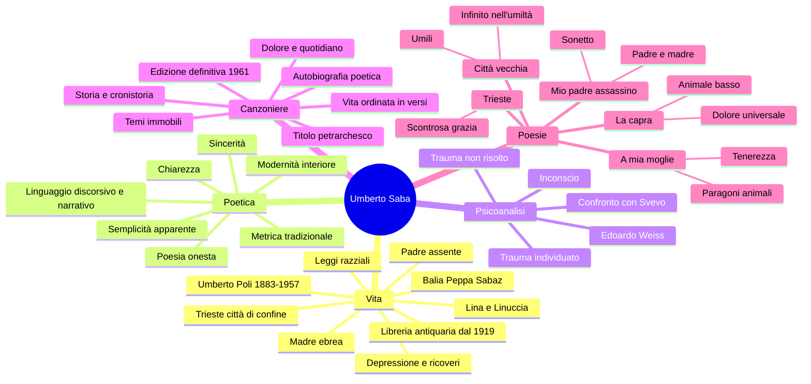

# Umberto Saba

---

## Coordinate essenziali

| Elemento | Dettaglio |
|----------|-----------|
| **Vero nome** | Umberto Poli |
| **Pseudonimo** | Umberto Saba |
| **Nato** | 1883, **Trieste** |
| **Morto** | 1957 |
| **Famiglia** | Madre ebrea, padre cristiano e assente; balia slovena Peppa Sabaz |
| **Figure centrali** | Madre austera · padre fuggitivo · balia Peppa · moglie Lina/Carolina · figlia Linuccia |
| **Lavoro** | Autodidatta; dal 1919 proprietario di una libreria antiquaria a Trieste |
| **Opera principale** | *Il Canzoniere*, autobiografia poetica di una vita |
| **Poetica** | Poesia onesta: chiarezza, sincerità, parole comuni, verità interiore |
| **Contesto** | Trieste di confine, ambiente multilingue e multietnico, contatto precoce con la psicoanalisi |

---

## 1. Trieste: la città di confine

### 1.1 Una città multilingue e multietnica

Saba nasce a **Trieste**, città che non va considerata come semplice luogo di nascita. Trieste è una città di **confine**, di porto, di scambi commerciali, di passaggio di merci e persone. Per questo è anche un ambiente **multilingue** e **multietnico**, aperto alle culture italiana, slava, tedesca, austriaca, ebraica.

Questa condizione di frontiera rende Trieste diversa da molte città italiane più chiuse dentro una tradizione nazionale. La si può confrontare, per capirne la funzione, con una città cosmopolita come **New York**, cioè uno spazio in cui identità diverse convivono e si mescolano. All'opposto, una città universitaria e italiana come **Bologna** può rappresentare un centro culturale importante, ma meno segnato da quella tensione di confine che caratterizza Trieste.

In questa Trieste di primo Novecento si muovono autori fondamentali:

| Autore | Legame con Trieste |
|--------|--------------------|
| **Italo Svevo** | Triestino, borghese, legato alla cultura mitteleuropea e alla psicoanalisi |
| **James Joyce** | Vive a Trieste e lavora come insegnante; entra in contatto con Svevo |
| **Scipio Slataper** | Scrittore triestino, autore de *Il mio Carso*, legato al problema dell'identità di confine |
| **Carlo Michelstaedter** | Goriziano, vicino all'area culturale giuliana, figura di inquietudine filosofica e letteraria |

> [!note] Dalla lezione
> Trieste è presentata come città culturale, di scambi di merci e di persone, al crocevia di culture diverse. La lezione la collega subito a Svevo: anche lui è segnato dalla città di confine, dalla psicoanalisi e da una formazione non chiusa dentro un solo ambiente nazionale.

### 1.2 Trieste amata e odiata

Il rapporto di Saba con Trieste è **ambivalente**. La città è amata perché è il suo rifugio, il luogo del suo "cantuccio", lo spazio concreto della vita quotidiana. Ma è anche odiata perché può diventare una gabbia: un confine che trattiene, una prigione che impedisce di andare oltre.

La lezione propone un confronto con **Recanati per Leopardi**. Come Recanati è per Leopardi il luogo dell'origine, della famiglia e insieme della costrizione, così Trieste è per Saba la città-rifugio e la città-limite.

Questa doppiezza ritorna nella poesia *Trieste*, dove compare la formula celebre della **scontrosa grazia**: Trieste ha una bellezza non dolce, non levigata, ma difficile, aspra, schiva. È una città che attrae e respinge.

---

## 2. Biografia e ferite originarie

### 2.1 Umberto Poli: nascita e famiglia

Umberto Saba nasce come **Umberto Poli** nel **1883**. La sua biografia è povera di eventi esteriori clamorosi, ma ricchissima di tensioni interiori. Ciò che conta non è tanto l'avventura esterna, quanto la **vicenda familiare**: il padre assente, la madre severa, la balia amata, la scissione delle origini.

La madre è **ebrea**, il padre è **cristiano**. Questa doppia origine produce in Saba una prima forma di inquietudine: da una parte l'appartenenza ebraica, dall'altra la presenza del cristianesimo attraverso il padre. La lezione parla di una vera e propria **scissione interiore**.

> [!note] Dalla lezione
> Il docente insiste sul fatto che la vita di Saba è segnata soprattutto dall'interiorità. La guerra e il fascismo entrano nella sua biografia, ma il nucleo più profondo è familiare: infanzia, padre, madre, balia, moglie.

### 2.2 Il padre assente

Il padre abbandona la famiglia praticamente prima della nascita del figlio. Saba cresce quindi senza di lui e lo conosce solo a circa vent'anni. Nella poesia *Mio padre è stato per me l'assassino* il poeta rilegge questa ferita.

La parola **"assassino"** è tra virgolette perché non è una definizione neutra del poeta: è la parola della madre, il giudizio rancoroso con cui Saba è cresciuto. Il padre non è assassino in senso letterale, ma è colui che ha abbandonato la famiglia, non si è preso le proprie responsabilità, è fuggito.

Quando però Saba lo incontra, scopre che quel padre non è un mostro: è un uomo infantile, leggero, irresponsabile, ma anche capace di un dono. Il poeta riconosce in lui qualcosa di sé: lo sguardo, il sorriso, forse il **dono della poesia**.

| Elemento della poesia | Significato |
|-----------------------|-------------|
| **"assassino"** | Parola della madre, carica di rancore |
| **Padre conosciuto a vent'anni** | Il padre è assenza durante l'infanzia |
| **"bambino"** | Uomo non cresciuto, istintivo, irresponsabile |
| **"dono"** | Possibile dono poetico ricevuto dal padre |
| **"pellegrino"** | Uomo inquieto, incapace di fermarsi |
| **"pasciuto"** | Termine alto/desueto: amato e nutrito da più donne |

### 2.3 La madre e la balia Peppa

La madre di Saba è una figura austera, severa, segnata dal dolore dell'abbandono. Affida il figlio a una balia slovena, **Peppa Sabaz**. Con Peppa il bambino vive un rapporto affettuoso, caloroso, allegro. Proprio questo amore rende più evidente la distanza dalla madre.

La balia diventa quindi una figura decisiva: non solo per l'infanzia di Saba, ma anche per il suo nome poetico. Lo pseudonimo **Saba** viene probabilmente collegato a **Sabaz**, il cognome della nutrice; ha dunque un valore affettivo e identitario. Allo stesso tempo, il nome richiama anche l'orizzonte ebraico, perché può essere accostato a una radice ebraica legata alla memoria familiare e all'appartenenza.

Il nome "Saba" tiene insieme due direzioni:

- la **balia Peppa Sabaz**, cioè l'affetto infantile e materno-sostitutivo;
- il **riferimento ebraico**, cioè la parte profonda dell'identità familiare.

### 2.4 Lina, Linuccia e la vita domestica

La figura femminile più importante della poesia di Saba è la moglie **Lina**, cioè Carolina Woelfler. Lina è la donna domestica, quotidiana, con cui Saba vive quasi tutta la vita. La loro relazione non è però semplice: Lina lo abbandona per un breve periodo, anche per l'insoddisfazione del matrimonio, poi ritorna.

Saba canta Lina con grande intensità, ma la lezione sottolinea anche un'ambivalenza: la moglie può assumere inconsciamente una funzione materna, di cura e accudimento. Da lei Saba ha una figlia, **Linuccia**, alla quale dedicherà poesie importanti.

Nella poesia accennata in lezione, *Ed amai nuovamente*, Lina è ricordata come la donna del "**rosso scialle**": lo scialle è semplice, familiare; il rosso rimanda alla passione, all'amore, ma anche al dolore. Saba dice di aver conosciuto altri amori, ma per Lina ricomincerebbe una vita nuova.

### 2.5 Lavoro, storia e ultimi anni

Saba è un **autodidatta**: non costruisce la propria cultura dentro un percorso accademico regolare, ma attraverso letture personali e una formazione autonoma. Dal **1919** gestisce a Trieste una **libreria antiquaria**, che diventa anche il suo lavoro stabile.

La storia del Novecento entra nella sua vita in modo duro. Essendo di origine ebraica, durante il fascismo e le **leggi razziali** deve nascondersi e allontanarsi da Trieste. Viene aiutato da amici e intellettuali, tra cui **Ungaretti**, **Montale** e altri. Negli ultimi anni soffre di depressione e attraversa ricoveri e cure, fino alla morte nel **1957**.

---

## 3. Psicoanalisi e interiorità

### 3.1 Trieste e la psicoanalisi

Trieste è uno dei primi luoghi italiani in cui la psicoanalisi arriva con forza, per la vicinanza al mondo austriaco e mitteleuropeo. Questo vale per Svevo, ma anche per Saba.

Saba entra in rapporto con la psicoanalisi attraverso **Edoardo Weiss**, medico triestino e allievo di Freud. La psicoanalisi individua il trauma centrale della sua vita, legato all'infanzia e alla separazione dalle figure genitoriali, ma non lo risolve definitivamente.

> [!note] Dalla lezione
> La poesia *Mio padre è stato per me l'assassino* viene letta come testo impregnato di psicoanalisi: al centro ci sono il rapporto con il padre, l'infanzia, l'evoluzione nella vita adulta, l'indagine su di sé e sull'inconscio.

### 3.2 Confronto con Svevo

Il confronto con **Svevo** è utile perché entrambi sono triestini, entrambi entrano in contatto con la psicoanalisi, entrambi indagano l'interiorità. Ma la funzione è diversa.

| Aspetto | Svevo | Saba |
|---------|-------|------|
| **Genere principale** | Romanzo | Poesia |
| **Psicoanalisi** | Strumento letterario per rappresentare la nevrosi borghese | Strumento per leggere il trauma personale |
| **Nucleo** | Inettitudine, malattia della vita, autoinganno | Infanzia, padre, madre, desiderio di verità |
| **Tono** | Ironico, narrativo, spesso distaccato | Sincero, diretto, doloroso |

Per Saba la psicoanalisi non è un tema esterno: serve a nominare ciò che la poesia cerca da sempre, cioè la **verità profonda dell'io**.

---

## 4. La poetica: poesia onesta

### 4.1 Chiarezza e sincerità

La formula più importante per capire Saba è **poesia onesta**. La poesia deve essere chiara, sincera, fedele alla verità. Non deve stupire con artifici, non deve costruire maschere retoriche, non deve inseguire la novità formale a tutti i costi.

L'onestà non significa banalità. Significa coraggio: guardare dentro di sé e portare alla luce anche le verità scomode, quelle che stanno nell'**inconscio**. Per questo Saba può usare un linguaggio limpido e vicino al parlato senza diventare superficiale: la lingua semplice è chiamata a rischiarare un mondo interiore **torbido, ambivalente, conflittuale**.

Nella lezione, parlando di *Ed amai nuovamente*, il docente definisce la sincerità di Saba come "**più ardita sincerità**": una sincerità coraggiosa, perché scava nella profondità dell'interiorità.

Questa idea viene formulata con chiarezza anche nello scritto critico ***Quello che resta da fare ai poeti***, del **1911**. Il titolo è già una domanda: che cosa resta da fare ai poeti nel primo Novecento, in un'epoca dominata dal dannunzianesimo, dalle avanguardie e dal gusto per la sperimentazione? La risposta di Saba è netta: resta da fare **poesia onesta**.

Per Saba una poesia è onesta quando nasce da sentimenti autentici, non quando abbaglia il lettore con la tecnica. Non deve essere **artificiosa**, cioè costruita per produrre un effetto di fascino sul lettore; deve invece corrispondere a un'esperienza vera. Per spiegarsi contrappone due esempi:

| Esempio | Valore secondo Saba |
|---------|---------------------|
| **Manzoni degli *Inni sacri*** | Versi anche mediocri sul piano retorico, ma onesti perché ispirati da sentimenti genuini |
| **D'Annunzio delle *Laudi*** | Versi sublimi e magnifici, ma effimeri se costruiti per affascinare e non per dire una verità autentica |

Il punto non è quindi stabilire chi sia tecnicamente più brillante. Saba arriva a una valutazione paradossale ma chiarissima: versi magari meno perfetti, se mossi da un sentimento genuino, valgono più di versi splendidi ma falsi. Da qui emerge anche il legame con **Pascoli**: Saba si sente più vicino alla poesia delle **umili cose**, degli affetti quotidiani, delle situazioni semplici, dei desideri elementari, che non all'estetismo aristocratico di D'Annunzio.

### 4.2 Semplicità apparente

La poesia di Saba sembra semplice. Usa spesso un linguaggio **discorsivo**, **narrativo**, quasi **prosaico**. Le frasi possono sembrare vicine al parlato e alla vita ordinaria.

Ma questa semplicità è solo apparente. Dentro il tono limpido si inseriscono:

- parole comuni e "trite", cioè già usate e consumate;
- termini colti o desueti, come **pasciuto**, **partita**, **torrei**;
- forme metriche tradizionali, come il sonetto;
- contenuti profondamente moderni, legati all'inconscio e al trauma.

### 4.3 Modernità interiore, non formale

Saba non è moderno perché distrugge le forme. Anzi, recupera il titolo petrarchesco *Canzoniere*, usa metri tradizionali, ama rime semplici come **fiore/amore**. La sua modernità non è formale, ma **interiore**.

In pieno Novecento, mentre avanguardie ed ermetismo tendono a rompere con la tradizione o a rendere la parola poetica oscura, Saba sceglie la chiarezza. Ma usa quella chiarezza per dire ciò che è più difficile: il trauma, il desiderio, il dolore, l'ambivalenza, la verità dell'inconscio.

### 4.4 *Amai* come dichiarazione di poetica

La poesia *Amai* è presentata in lezione come una vera dichiarazione di poetica.

| Verso / idea | Significato |
|--------------|-------------|
| **"Amai trite parole"** | Saba ama parole logore, consumate, dette e ridette dalla tradizione |
| **"che non uno osava"** | Nei primi decenni del Novecento molti poeti evitano il repertorio tradizionale |
| **Enjambement dopo "parole"** | Mette in rilievo la distanza tra le parole amate da Saba e le mode dell'epoca |
| **"rima fiore amore"** | Recupero consapevole della rima più tradizionale e apparentemente più compromessa |
| **"la più antica"** | Risale agli albori della poesia italiana, fino allo Stilnovo |
| **"la più difficile"** | È così usata che è quasi impossibile renderla nuova, autentica e sentita |
| **"Amai / amai / amo"** | Anafora incompleta e, nel passaggio di tempo verbale, poliptoto |
| **"Amai la verità che giace al fondo"** | La poesia cerca la verità profonda e nascosta dell'inconscio |
| **"quasi un sogno obliato"** | La verità interiore è come il contenuto di un sogno dimenticato al risveglio |
| **Dolore** | Il dolore riscopre la verità e la avvicina alla coscienza |
| **"te che mi ascolti"** | Apertura dialogica: può essere Lina, una musa, il lettore, chiunque ascolti |
| **"buona carta"** | La carta vincente lasciata alla fine: la poesia stessa |

> [!note] Dalla lezione
> "Trite" significa dette e ridette, consumate. Saba dichiara di amare le parole tradizionali che gli altri poeti non osavano più usare, proprio mentre il primo Novecento preferiva avanguardie, rottura e sperimentazione.

L'analisi della lezione insiste su alcuni punti precisi e va seguita quasi verso per verso.

Il primo nodo è l'espressione **"trite parole"**. "Trite" vuol dire logore, consumate, usate molte volte. Saba non rivendica parole rare o preziose: rivendica proprio quelle che sembrano ormai impossibili da usare, perché troppo compromesse dalla tradizione. La sua scelta è controcorrente: mentre le mode poetiche del primo Novecento vanno verso avanguardia, sperimentalismo e dannunzianesimo, Saba dichiara fedeltà a un lessico apparentemente vecchio.

Prima di tutto, la rima **fiore/amore** è detta "**la più antica**" perché appartiene al repertorio originario della poesia italiana, fin dallo **Stilnovo**. Ma è anche "**la più difficile**" perché è stata usata così tante volte che sembra quasi impossibile adoperarla in modo autentico e nuovo. Saba però non la rifiuta: la accetta proprio perché vuole recuperare parole e forme che la moda letteraria del suo tempo considera ormai logore.

Dal punto di vista retorico, la ripetizione di **"Amai"** costruisce una specie di anafora, anche se non perfettamente regolare. Se però si considera la serie **"Amai, amai, amo"**, la figura diventa un **poliptoto**, perché la stessa radice verbale ritorna in forme diverse. Questo passaggio è importante anche per il significato: i primi "Amai" guardano alla storia della sua poesia e della sua fedeltà alla tradizione; l'"Amo" finale porta il discorso nel presente e lo apre a chi ascolta, forse Lina, forse una musa, forse i lettori. La poesia diventa un dialogo.

Il nucleo più moderno è la **verità che giace al fondo**. Questa verità non è una verità razionale e immediatamente chiara: è una verità profonda, sepolta, simile a un **sogno dimenticato**. Coincide con le zone dell'**inconscio**, con ciò che l'uomo non conosce pienamente di se stesso. Solo il **dolore** riesce a riportarla vicino alla coscienza. Per questo la poesia di Saba è limpida nella forma, ma scava in un mondo interiore torbido, ambivalente, conflittuale.

La similitudine del **sogno obliato** è decisiva: come al risveglio resta solo una traccia incerta del sogno, così la verità interiore non si offre mai in modo pieno e ordinato. Resta come fantasma, come parvenza, e il cuore le si accosta con paura perché riconoscerla significa entrare in contatto con qualcosa di doloroso.

Alla fine compare la "**buona carta**": è la carta vincente lasciata alla fine del gioco. Nella spiegazione della lezione, questa buona carta è la **poesia stessa**, cioè ciò che dà a Saba una possibilità di conoscenza, consolazione e comunicazione con gli altri. La poesia è insieme:

- indagine dell'interiorità;
- ricerca della verità nascosta;
- consolazione nel dolore;
- messaggio da comunicare a chi ascolta.

In questo senso *Amai* tiene insieme i due lati fondamentali di Saba: il ritorno alla **tradizione** e la modernità dell'**inconscio**.

---

## 5. *Il Canzoniere*

### 5.1 Titolo petrarchesco

L'opera principale di Saba è *Il Canzoniere*. Il titolo richiama esplicitamente il *Canzoniere* di **Petrarca**. Nel Novecento, in un'epoca di avanguardie, scegliere questo titolo significa recuperare la tradizione invece di rifiutarla.

La scelta è coerente con tutta la poetica di Saba: classicismo senza artificiosità, forme tradizionali senza retorica vuota, chiarezza senza superficialità.

### 5.2 Autobiografia poetica

*Il Canzoniere* è una sorta di **autobiografia poetica**. Saba ordina la propria vita in versi: infanzia, padre, madre, balia, Trieste, Lina, Linuccia, desiderio, dolore, malattia, vecchiaia.

La poesia non è evasione dalla vita, ma modo per darle forma. La vita viene raccolta, riletta, organizzata. Per questo Saba scrive anche *Storia e cronistoria del Canzoniere*, un'opera in cui commenta e ricostruisce dall'interno il senso della propria raccolta.

I temi del *Canzoniere* restano sostanzialmente costanti:

- i **fanciulli di Trieste**;
- le **vie solitarie** della città;
- i **caffè fumosi del porto**;
- le **donne amate**, soprattutto Lina;
- la vita quotidiana, domestica, portuale;
- il dolore che ritorna sotto forme diverse.

Sono temi quotidiani e quasi immobili, perché Saba concepisce la vita come segnata da una ripetizione profonda. L'uomo spera sempre in un domani migliore, ma sa che il nuovo giorno porterà ancora le stesse sofferenze di quello trascorso. La vita, per Saba, è quindi percepita come **immutabile**: non nel senso che non accada nulla, ma nel senso che il fondo dell'esistenza resta dominato dal dolore.

Qui emerge il collegamento con **Leopardi**, nella consapevolezza malinconica del dolore dell'esistenza. Ma Saba non resta solo dentro il pessimismo: la sofferenza viene alleviata dalla contemplazione delle cose quotidiane, dal sentirsi vivere in un canto intimo e suggestivo. Per questo torna anche il legame con **Pascoli**, nella contemplazione delle cose umili, familiari, apparentemente minime.

Il fondo costante dell'opera è quindi una vita dominata dal **dolore**, ma alleviata dalla contemplazione delle cose quotidiane e dal sentirsi vivere in un canto intimo. La poesia non elimina il dolore: lo rende conoscibile.

### 5.3 *Storia e cronistoria del Canzoniere*

***Storia e cronistoria del Canzoniere***, del **1948**, è uno scritto critico in cui Saba commenta se stesso. La lezione lo definisce una forma di **autoesegesi**: Saba parla della propria opera, spesso anche di sé in terza persona, e accompagna le liriche con aneddoti autobiografici, spiegazioni sulla nascita dei testi e osservazioni sulle scelte poetiche.

Questo testo è importante perché mostra che il *Canzoniere* non è una semplice raccolta di poesie sparse: è un libro costruito, interpretato e ripensato dall'autore stesso. Saba vuole guidare il lettore dentro la storia della propria poesia e dentro la cronistoria concreta, cioè le occasioni, i momenti e i gesti quotidiani da cui alcune liriche nascono.

La parola **autoesegesi** è fondamentale. Di solito l'esegeta è un critico che interpreta un testo scritto da altri; qui invece è Saba stesso a diventare interprete della propria poesia. Questo non rende il testo un semplice commento scolastico: è un atto di controllo e di chiarimento della propria opera, perché Saba spiega perché una poesia nasce, quali episodi l'hanno generata, quali parole contano, quale posto occupa nel libro.

L'esempio più importante discusso in lezione riguarda ***A mia moglie***. Saba racconta la genesi del testo: Lina era uscita per andare in città, lui era rimasto solo, una cagna gli si avvicinò e gli pose il muso sulle ginocchia. Da quell'immagine nacque la poesia, quasi di getto, in uno stato che Saba presenta come vicino all'incoscienza creativa. Quando Lina tornò, stanca e carica di pacchi, Saba volle leggerle subito la poesia; lei però rimase male, perché si sentì offesa dai paragoni con animali come la pollastra, la giovenca o la cagna.

Questo aneddoto serve a capire due cose:

- la poesia di Saba nasce da un'occasione quotidiana, domestica, non da un evento solenne;
- il significato profondo non coincide con l'impressione immediata: ciò che sembra offensivo è in realtà un elogio della creaturalità, della semplicità e della tenerezza.

Per questo *Storia e cronistoria* ha anche una funzione critica: aiuta il lettore a non fermarsi allo scandalo superficiale e a leggere la poesia dentro la poetica dell'umile, del vero e del quotidiano.

### 5.4 Edizione definitiva

L'edizione definitiva del *Canzoniere* è **postuma**, del **1961**. Questo dato è importante perché mostra il carattere progressivo dell'opera: Saba lavora per tutta la vita alla costruzione del libro, come se il libro coincidesse con la vita stessa.

---

## 6. Le poesie

### 6.1 *La capra*: il dolore universale

*La capra* è una poesia centrale per capire Saba. Il poeta incontra una capra sola, legata, bagnata dalla pioggia. È un animale basso, comune, non nobile, lontanissimo dagli animali solenni della tradizione letteraria. Proprio per questo è rivelatore.

La capra belante diventa il segno di un dolore che non appartiene solo all'uomo. Nel suo lamento il poeta riconosce il **dolore universale**, una sofferenza che attraversa tutti gli esseri viventi.

La capra è importante perché:

- è un animale umile, quotidiano, apparentemente non poetico;
- permette di scoprire una verità profonda;
- mostra che il dolore non è solo individuale, ma universale;
- realizza la poesia onesta: parole semplici, situazione concreta, verità al fondo.

| Elemento | Valore |
|----------|--------|
| **Capra** | Animale basso, povero, antieroico |
| **Belato** | Voce del dolore |
| **Solitudine** | Condizione del vivente |
| **Riconoscimento del poeta** | Il dolore dell'animale parla anche dell'uomo |
| **Esito** | Dal particolare concreto si arriva all'universale |

### 6.2 *Mio padre è stato per me l'assassino*

Questa poesia, letta in lezione, appartiene al *Canzoniere* e ha forma di **sonetto**. La struttura è tradizionale, ma il contenuto è pienamente novecentesco: rapporto con il padre, infanzia, trauma, inconscio.

Il testo mette in scena il passaggio da un'immagine ricevuta a una verità personale. Da bambino, Saba conosce il padre attraverso il rancore della madre; da adulto lo vede direttamente e capisce che quel padre era un uomo fragile, infantile, irresponsabile, ma non riducibile alla parola "assassino".

Il verso finale, "**eran due razze in antica tenzone**", riassume la scissione profonda: padre e madre appartengono a mondi diversi, a modi opposti di stare nella vita. Dentro Saba questi due mondi restano in conflitto.

### 6.3 *A mia moglie*

*A mia moglie* va ricordata soprattutto per il meccanismo dei **paragoni animali**. Saba paragona Lina a diversi animali non per degradarla, ma per lodare il vivente nella sua immediatezza. L'animale, in Saba, non è insulto: è elogio della vita naturale, istintiva, corporea, semplice.

Questa scelta permette anche di capire la distanza da **D'Annunzio**. Se D'Annunzio tende alla bellezza preziosa, eccezionale, aristocratica, Saba cerca la verità nell'ordinario, nel domestico, nel basso, nel vivente comune.

La poesia nasce, secondo il racconto di *Storia e cronistoria del Canzoniere*, in modo quasi improvviso: Lina era uscita, Saba rimase solo, una cagna gli si avvicinò e gli posò il muso sulle ginocchia. Da quell'immagine nacque la poesia, composta quasi di getto e poi letta subito alla moglie. Lina però non reagì come Saba sperava: rimase male, perché non si riconosceva nei paragoni con animali umili. Saba dovette spiegarle che non c'era nessuna offesa.

In *Storia e cronistoria* Saba insiste sul fatto che non voleva scandalizzare né sorprendere. Eppure la poesia, quando fu conosciuta, provocò risate e quasi scherno, perché sembrava strano dedicare alla moglie una lirica in cui la donna fosse paragonata agli animali della creazione. Proprio questa stranezza contribuì alla notorietà del testo.

Saba stesso definisce *A mia moglie* una poesia quasi **religiosa**, scritta come una preghiera, ma in senso laico. Non significa che Saba sia credente in senso tradizionale: il riferimento a Dio indica piuttosto la dimensione **creaturale** degli animali, cioè la loro semplicità, innocenza, vicinanza alla vita elementare. Per questo Lina è paragonata alle "femmine di tutti i sereni animali che avvicinano a Dio": è vista come creatura non corrotta dalla falsità, dal calcolo e dall'ipocrisia.

La lezione sottolinea anche due definizioni importanti:

- la poesia può essere detta **proletaria**, per la sua semplicità e per la scelta di immagini non aristocratiche;
- può essere detta **infantile**, perché, secondo Saba, se un bambino potesse sposarsi e scrivere una poesia alla moglie, scriverebbe una poesia così.

Questa "infantilità" non è immaturità: è sguardo puro, diretto, capace di amare gli animali e le creature umili senza vergogna.

Il sentimento dominante non è l'eros dannunziano, né la passione sensuale, ma la **tenerezza**. Saba guarda Lina con gratitudine, affetto profondo, bisogno di protezione e riconoscimento.

| Animale | Aspetto di Lina messo in luce |
|---------|-------------------------------|
| **Bianca pollastra** | Creatura umile e terrena, ma con un passo lento, fiero, quasi regale |
| **Gallinelle** | Voce dolce e malinconica quando Lina si lamenta dei suoi mali |
| **Gravida giovenca** | Maternità, dolcezza, vita fertile, bisogno di essere consolata con un dono |
| **Lunga cagna** | Fedeltà, devozione, dolcezza negli occhi, ferocia nel cuore e gelosia |
| **Pavida coniglia** | Timidezza, paura, vulnerabilità, bisogno di protezione, istinto materno |
| **Rondine** | Leggerezza dei movimenti e annuncio di una nuova primavera per il poeta |
| **Provvida formica** | Operosità, previdenza, cura concreta, laboriosità domestica |
| **Pecchia / ape** | Laboriosità e appartenenza al mondo naturale; "pecchia" è termine più letterario |

#### Lettura dei paragoni

La **bianca pollastra** introduce subito una doppia dimensione. Da una parte c'è l'umiltà terrena: l'animale china il collo per bere, raspa in terra, vive in un'aia. Dall'altra parte compare un'avversativa decisiva, il **"ma"**: nel camminare ha un passo lento, pettoruto, superbo, quasi da regina. Lina è quindi semplice e insieme fiera.

Le **gallinelle** servono a rappresentare la voce di Lina quando si lamenta dei propri mali. Il verbo "querelarsi" vuol dire lamentarsi; la sua voce è paragonata alla "musica dei pollai", cioè a un suono umile ma dolce e triste. Anche qui Saba non alza il tono verso il sublime: trova poesia in un'immagine bassissima e domestica.

La **gravida giovenca** non va banalizzata in modo volgare. La lezione insiste sull'equivoco: dire "giovenca" non è come dire in modo offensivo "vacca". La giovenca è una creatura giovane, fertile, gravida ma ancora libera e festosa. Il suo muggito è così lamentoso che chi la sente vorrebbe strapparle l'erba per farle un dono. Allo stesso modo Saba offre a Lina il suo dono quando è triste: quel dono è la **poesia**.

La **lunga cagna** deriva direttamente dall'aneddoto della genesi del testo. È l'animale che si avvicina a Saba e gli posa il muso sulle ginocchia. In lei convivono **dolcezza** e **ferocia**: dolcezza nello sguardo, ferocia nel cuore, soprattutto quando nasce la gelosia. La cagna guarda il padrone come un dio e signore, lo segue e mostra i denti se qualcuno si avvicina. Lina è quindi fedele e devota, ma anche gelosa e pronta a difendere il legame.

La **pavida coniglia** porta nel testo la fragilità. "Pavida" significa timorosa; la coniglia sta nell'angusta gabbia, si alza quando vede arrivare chi le porta il cibo, cerca gli angoli bui quando ne è privata. L'immagine mette insieme paura, bisogno di cura e istinto materno, perché il pelo strappato per il nido richiama il parto e la protezione dei piccoli.

La **rondine** è più elevata e leggera. Torna in primavera ma riparte in autunno; Lina invece non possiede quest'arte del ripartire. Della rondine ha soprattutto le movenze leggere e la capacità di annunciare al poeta una nuova primavera, proprio quando lui si sentiva vecchio.

La **formica** e la **pecchia** chiudono la serie in direzione della laboriosità. La formica è "provvida", cioè previdente, capace di accumulare e provvedere; la pecchia, cioè l'ape, appartiene allo stesso mondo di creature operose. Lina viene riconosciuta in tutte le femmine dei sereni animali e in nessun'altra donna.

#### Aspetti stilistici

La struttura è semplice e ripetitiva, fondata sull'anafora "**Tu sei come**". Questa ripresa dà al testo un andamento quasi litanico, coerente con l'idea della preghiera laica.

L'andamento della poesia è **prosaico**: non cerca la musicalità alta e preziosa, ma procede con frasi ampie, descrittive, quasi narrative. Il lessico è semplice e quotidiano, pur con incursioni in un registro più alto o letterario: **pecchia** per "ape", **assonna**, **quereli**, alcune inversioni sintattiche.

Dal punto di vista morfosintattico la lezione segnala:

- versi brevi;
- frequenti **anastrofi**, cioè inversioni dell'ordine normale delle parole;
- riprese interne, soprattutto la formula delle femmine dei sereni animali che avvicinano a Dio;
- lessico domestico e quotidiano mescolato a qualche parola più letteraria.

Anche qui si vede la poetica di Saba: una lingua apparentemente semplice, ma capace di rivelare una profondità affettiva e simbolica.

### 6.4 *Trieste*

*Trieste* è da ricordare per il rapporto ambivalente con la città e per l'espressione **scontrosa grazia**. La città è amata e respinta, rifugio e limite. Non è una città idealizzata: ha una grazia difficile, aspra, non addomesticata.

Nella lettura della lezione la città è descritta come un amore inquieto, quasi geloso e tempestoso. La **scontrosa grazia** unisce due elementi opposti: da una parte la grazia, cioè la bellezza; dall'altra lo scontroso, cioè l'asprezza, la chiusura, la difficoltà. Trieste non è consolatoria: ciò che dà piacere dà anche tormento.

La poesia si costruisce come un percorso. Il poeta sale su un'erta, cioè su una posizione sopraelevata, e da lì scopre con lo sguardo le chiese e le vie della città. Trieste si presenta in movimento tra basso e alto: da una parte la spiaggia ingombrata e affollata, dall'altra la collina e la casa che si aggrappa alla cima sassosa.

La città ha un'**aria natia** inquieta e tormentosa. "Natia" significa legata alla nascita, alla casa, all'origine; ma quest'aria non è pacificata. Riflette le scissioni interiori di Saba, legate alla sua appartenenza familiare, alla doppia origine, alle inclinazioni contrastanti. Trieste è materna e perturbante insieme.

Alla fine però offre al poeta un "**cantuccio**" fatto per lui, per la sua vita "**pensosa e schiva**". Il cantuccio è un angolo appartato, una misura minima ma personale, come se nella città intera esistesse un punto esatto in cui Saba può riconoscersi. La chiusura crea una struttura quasi circolare, perché torna l'idea iniziale del poeta che cerca il proprio luogo dentro la città.

L'espressione **"pensosa e schiva"** richiama il modello petrarchesco della vita solitaria e meditativa. La lezione collega questo punto al celebre incipit petrarchesco "Solo e pensoso": anche qui Saba recupera la tradizione, non solo nei temi ma nello stile e nelle posture dell'io poetico.

| Elemento | Significato |
|----------|-------------|
| **Scontrosa grazia** | Bellezza aspra, non pacificata |
| **Erta / posizione alta** | Distanza da cui il poeta guarda e comprende la città |
| **Spiaggia ingombrata** | Dimensione portuale, affollata, concreta |
| **Collina / cima sassosa** | Movimento opposto verso l'alto, ma sempre aspro |
| **Aria natia** | Origine, casa, appartenenza inquieta |
| **Cantuccio** | Rifugio personale dentro la città |
| **Vita pensosa e schiva** | Vita ritirata, meditativa, di ascendenza petrarchesca |

### 6.5 *Città vecchia*

*Città vecchia* appartiene alla raccolta *Trieste e una donna* e completa il rapporto di Saba con la città. Qui non siamo nella Trieste elegante, ma nella zona vecchia vicino al porto, fatta di vie oscure, pozzanghere, fanali, osterie, lupanari, botteghe, degrado e miseria.

Il poeta attraversa un'umanità marginale: la **prostituta**, il **marinaio**, il **vecchio che bestemmia**, la **femmina che bega**, il **dragone** seduto dal friggitore, la giovane folle d'amore. Sono "merci ed uomini" ridotti a detrito di un grande porto di mare: scarti delle merci e scarti dell'umanità.

Il luogo è quello della città vecchia a ridosso della costa e del porto, simile a certi vicoli stretti e bui delle città portuali. La strada è oscura, i fanali si specchiano gialli nelle pozzanghere, la folla passa dall'osteria alla casa o al **lupanare**. Il lupanare è il postribolo, il luogo della prostituzione: quindi Saba non attenua il degrado, lo nomina direttamente.

La formula "**merci ed uomini il detrito di un gran porto di mare**" è durissima. "Detrito" significa resto, scarto. Nel porto non circolano solo merci: circolano anche uomini e donne trattati come scarti, consumati dalla miseria, dal lavoro, dalla prostituzione, dalla marginalità.

Eppure proprio lì Saba trova "**l'infinito nell'umiltà**". La parola **umiltà** va collegata a *humus*, la terra: indica ciò che è basso, povero, vicino alla vita elementare, senza superbia. Non è umiltà moralistica, ma adesione alla dimensione più elementare della vita. Il basso non viene cancellato: diventa il luogo in cui si apre una dimensione più grande dell'umano.

| Figura | Valore nella poesia |
|--------|---------------------|
| **Prostituta** | Marginalità, corpo venduto, vita esclusa dalla rispettabilità borghese |
| **Marinaio** | Figura del porto, del passaggio, della fatica e dell'instabilità |
| **Vecchio che bestemmia** | Dolore degradato, ribellione, miseria senza decoro |
| **Femmina che bega** | Litigio quotidiano, asprezza della vita povera |
| **Dragone dal friggitore** | Soldato mescolato alla scena popolare e bassa |
| **Giovane impazzita d'amore** | Vita tumultuosa, passione povera, dolore affettivo |

Dove la via è più **turpe**, cioè sporca, vergognosa, indecorosa, il pensiero del poeta si fa più **puro**. È un'antitesi fondamentale: il poeta trova purezza non nel sublime, ma nel luogo più degradato. La costruzione "degli umili sento in compagnia il mio pensiero farsi più puro" è anche sintatticamente marcata da un'anastrofe: l'ordine delle parole non è quello più normale, e questo mette in rilievo il legame con gli umili.

Il verso "**s'agita in esse, come in me, il Signore**" non va letto come confessione religiosa tradizionale: indica il riconoscimento di una dignità profonda, quasi sacra, negli umili e nei sofferenti. Saba sente di far parte della stessa umanità ferita. Per questo *Città vecchia* è coerente con tutta la sua poetica: dal basso, dal quotidiano, dall'umile, emerge una verità universale.

Il "Signore" può essere inteso come riconoscimento di una presenza creaturale, di una dignità umana elementare che attraversa prostituta, marinaio, vecchio, soldato, giovane folle d'amore e poeta. Non è un discorso confessionale: è il modo con cui Saba dice che in quelle vite degradate si agita qualcosa di comune, vivo, sacro nel senso più umano del termine.

Il collegamento proposto in lezione con **Pasolini** serve solo a chiarire questo sguardo sugli umili: anche Pasolini, nelle borgate romane, guarderà prostituzione, povertà, piccola criminalità e marginalità senza ridurle a semplice degrado morale, ma cercandovi autenticità.

#### Confronto con Fabrizio De André, *La città vecchia*

Il confronto con la canzone omonima di **Fabrizio De André** è indicato esplicitamente nel [programma d'esame](<../../../programma/italiano.md>) e ripreso nella [lezione del 28/05/2026](<../lezioni/28-05-26/transcription.txt>). È un confronto molto efficace all'orale perché permette di mostrare come uno stesso spazio — la **città vecchia portuale** — possa diventare in due linguaggi diversi il luogo degli esclusi.

De André è legato a **Genova**, città di porto, vicoli, moli e quartieri popolari. La lezione insiste sul fatto che i suoi testi sono spesso costruiti con un vero lavoro sulle forme della **ballata** e con forti **reminiscenze letterarie**; per questo si può pensare che la sua *Città vecchia* nasca anche dalla suggestione della poesia di Saba. Non bisogna però appiattire i due testi: De André recupera immagini e tipi umani simili, ma li organizza con un andamento più narrativo e con una voce più esplicitamente polemica verso la società borghese.

| Aspetto | Saba, *Città vecchia* | De André, *La città vecchia* |
|---------|------------------------|-------------------------------|
| **Città** | Trieste: città vecchia presso il porto, vie oscure, pozzanghere, fanali, osteria, lupanare | Genova: quartieri bassi, calate dei vecchi moli, portoni, osterie, odori di sale, vicoli popolari |
| **Genere** | Lirica del *Canzoniere* | Canzone d'autore / ballata narrativa |
| **Umanità rappresentata** | Prostituta, marinaio, vecchio che bestemmia, femmina che bega, dragone, giovane impazzita d'amore | Prostituta, pensionati ubriachi, vecchio professore ipocrita, ladri, assassini, "tipo strano", emarginati |
| **Sguardo sugli esclusi** | Partecipazione diretta: il poeta sente in loro la stessa vita e lo stesso dolore che sono in lui | Comprensione morale e sociale: il cantautore invita a non giudicare da "buon borghese" |
| **Nucleo religioso / morale** | "S'agita in esse, come in me, il Signore": dignità quasi sacra degli umili | Se non sono puri come "gigli", sono comunque "figli" e "vittime di questo mondo" |
| **Rapporto con il basso** | Dove la via è più turpe, il pensiero si fa più puro | Nel "letame" dell'emarginazione possono nascere fiori: la vita non nasce dai diamanti della rispettabilità |
| **Bersaglio implicito** | La separazione borghese tra rispettabilità e degrado viene superata dalla comunione con gli umili | La società borghese è denunciata apertamente per ipocrisia, giudizio e incapacità di capire |

##### Somiglianze da ricordare

1. **Ambientazione portuale e degradata.**  
   In entrambi i testi la città vecchia non è il centro monumentale o turistico, ma la zona bassa del porto: vicoli, moli, osterie, portoni, lupanari, pozzanghere, odori, buio. È uno spazio dove la rispettabilità borghese non entra se non in modo ipocrita e clandestino.

2. **Galleria di figure marginali.**  
   Saba elenca figure come prostituta, marinaio, vecchio che bestemmia, soldato, giovane folle d'amore. De André costruisce una galleria analoga: prostitute, vecchi pensionati, ubriachi, ladri, assassini, personaggi bizzarri, professori che di giorno condannano ciò che di notte cercano. In entrambi i casi non siamo davanti a eroi, ma a vite scartate.

3. **Rifiuto del moralismo.**  
   Nessuno dei due autori guarda quella realtà con disgusto moralistico. Saba non dice: "io sono diverso da loro"; dice invece che in loro si agita lo stesso Signore che si agita in lui. De André invita a non giudicare con lo sguardo del "buon borghese", perché chi giudica da fuori condanna senza capire.

4. **Poesia del basso.**  
   Entrambi trovano valore poetico in ciò che la letteratura tradizionale o il decoro borghese considererebbero impoetico: prostituzione, bestemmia, ubriachezza, miseria, corpi venduti, vecchiaia, fame, piccoli crimini. Questo è molto sabiano: la poesia onesta non cerca il sublime lontano, ma la verità nella vita umile.

##### Differenze decisive

La differenza più importante riguarda la posizione dell'**io**.

In **Saba**, l'io lirico è **dentro** quel mondo. Attraversa la via, vede gli umili e sente il proprio pensiero purificarsi in loro compagnia. La formula "come in me" è essenziale: prostituta, marinaio, vecchio, soldato e poeta partecipano della stessa vita e dello stesso dolore. Per questo la poesia arriva a una sorta di comunione: l'infinito si trova nell'umiltà, non al di sopra di essa.

In **De André**, la voce sembra solidale, ma è più **narrativa e ammonitrice**. Il cantautore racconta, presenta personaggi, costruisce scene, poi invita chi ascolta a non giudicare. La canzone diventa quindi anche una denuncia dell'ipocrisia sociale: il "buon borghese" condanna ladri, prostitute e assassini, ma spesso non vede le cause sociali della loro condizione, né i propri vizi nascosti.

Un'altra differenza è il tono:

- Saba è più **lirico e spirituale**: parla di infinito, umiltà, purezza, Signore;
- De André è più **narrativo, ironico e sociale**: mette in scena casi concreti, ipocrisie, pensioni, desideri, giudizi borghesi, vittime della società.

##### Frase pronta per l'orale

> Nel programma è previsto il confronto tra *Città vecchia* di Saba e la canzone omonima di De André. Il punto comune è la città portuale come spazio degli esclusi: Trieste per Saba, Genova per De André. Entrambi mostrano prostitute, vecchi, ubriachi, ladri, marinai, figure marginali, e rifiutano il giudizio moralistico. Però Saba partecipa interiormente a quel mondo: negli umili sente agitarsi lo stesso "Signore" che è in lui e trova "l'infinito nell'umiltà". De André invece costruisce una ballata più narrativa e sociale: denuncia l'ipocrisia borghese e invita a capire prima di condannare. In Saba il pensiero si purifica nella via più turpe; in De André gli esclusi non sono gigli, ma sono comunque figli e vittime di questo mondo.

### 6.6 *Ed amai nuovamente*

*Ed amai nuovamente* è una poesia da studiare come testo autonomo, non solo come accenno biografico su Lina. È inserita nel programma tra le poesie del *Canzoniere* di Saba e nella [lezione del 14/05/2026](<../lezioni/14-05-26/transcription.txt>) viene letta come testo utile per capire la sua "**più ardita sincerità**": la capacità di dire senza maschere la verità dell'amore, della colpa, della fedeltà profonda e del dolore.

Il testo è legato alla moglie **Lina**, ma non è una semplice poesia d'amore coniugale. È una lirica di bilancio: Saba guarda alla propria vita affettiva e riconosce che il centro resta Lina, anche se non tutto è stato limpido, lineare o fedele. La grandezza del testo sta proprio qui: l'amore non viene idealizzato; viene detto nella sua complessità, con una sincerità che non nasconde contraddizioni e ferite.

#### Contesto nel *Canzoniere*

Nel *Canzoniere* Lina è una figura fondamentale:

- è la moglie, la donna della vita quotidiana;
- è la madre di Linuccia;
- è spesso avvicinata a una dimensione domestica, semplice, creaturale;
- è anche una figura carica di dolore, gelosia, separazioni, ritorni, dipendenza affettiva.

In *Ed amai nuovamente* Saba non parla dell'amore come sentimento astratto. Parla della propria storia con Lina, cioè di un amore reale, attraversato da altri amori, da infedeltà, da dolore e da un legame che tuttavia non si spezza.

#### Titolo e attacco: un discorso già iniziato

La poesia si apre con una congiunzione: "**Ed** amai nuovamente". Questo dettaglio è importante.

L'attacco con "e" dà l'impressione che la poesia cominci **a discorso già avviato**. Non siamo davanti a un inizio solenne, ma a una ripresa: come se Saba stesse continuando un ragionamento interiore già in corso. "Amai nuovamente" significa: **tornai ad amare**.

Questo avvio suggerisce due cose:

1. l'amore non è unico, immobile, cristallizzato una volta per tutte;
2. la vita affettiva di Saba è fatta di ritorni, riprese, scarti, nuove possibilità.

L'amore per Lina non è quindi rappresentato come favola pura, ma come amore che resiste dentro una biografia complicata.

#### Lina "dal rosso scialle"

Lina è ricordata con un'immagine concreta: il **rosso scialle**.

Lo **scialle** è un indumento semplice, familiare, quotidiano. Non appartiene al lusso aristocratico o all'eleganza dannunziana: richiama il mondo domestico, la casa, la vita comune. È perfettamente coerente con la poetica di Saba, che cerca la verità nelle cose umili.

Il colore **rosso** ha invece un valore simbolico più intenso:

| Elemento | Significato |
|----------|-------------|
| **Scialle** | Quotidianità, semplicità, casa, familiarità |
| **Rosso** | Passione, amore, sangue, dolore |
| **Rosso scialle** | Amore domestico ma doloroso, passione vissuta nella vita concreta |

La lezione insiste proprio su questa doppia lettura: il rosso rimanda alla passione e all'amore, ma anche al **dolore**, perché la passione non è solo trasporto erotico; può essere anche sofferenza, come nella "passione" di Cristo.

#### "Il più della mia vita"

La costruzione "fu di Lina dal rosso scialle **il più della mia vita**" contiene un'anastrofe. L'ordine più normale sarebbe: **il più della mia vita fu di Lina dal rosso scialle**.

"Il più della mia vita" può significare:

- la **maggior parte** della vita di Saba;
- ma anche la **parte migliore**, la parte più importante e più vera.

Questa ambiguità è molto significativa. Saba non dice semplicemente che Lina è stata una presenza lunga nel tempo; dice che a lei appartiene il nucleo più alto e più decisivo della sua esistenza.

#### Linuccia: la figlia "accanto a noi"

Nel testo compare anche la figlia **Linuccia**, indicata come "quella che cresce accanto a noi". La lezione sottolinea la scelta di "**accanto a noi**", non "con noi".

Questo dettaglio è sottile ma importante: la figlia è presente, amata, fondamentale, ma l'espressione sembra preservare l'unità della coppia Lina-Saba. Linuccia cresce vicino a loro, accanto alla loro storia, quasi come creatura più legata a Lina che al padre.

La poesia quindi non è solo un testo su Lina come moglie, ma anche sulla famiglia: Lina, Saba e la figlia sono dentro una rete affettiva complessa, non pacificata.

#### La "più ardita sincerità"

Uno dei passaggi più importanti è quello in cui Saba collega Lina al libro della sua "**più ardita sincerità**".

"Ardita" significa **coraggiosa**. La sincerità di Saba è ardita perché non consiste nel dire cose facili o edificanti: consiste nello scavare nelle zone più scomode dell'interiorità, là dove si trovano le verità dell'**inconscio**.

Qui si vede il cuore della poetica sabiana:

- non artificio;
- non idealizzazione;
- non maschera letteraria;
- ma verità profonda dell'io, anche quando è dolorosa.

Per questo *Ed amai nuovamente* è una poesia "onesta": Saba non finge di essere stato un marito perfetto, non cancella altri amori, non trasforma Lina in una donna angelicata. Dice invece una verità più difficile: altri amori ci sono stati, ma l'anima non si è mai veramente separata da Lina.

#### "L'anima mia partita"

Il verso in cui Saba dice che la sua anima non fu mai "partita" da quella di Lina contiene un termine arcaico: **partita** significa **separata**.

Anche qui la lingua è tipicamente sabiana:

- da una parte è semplice e comprensibile;
- dall'altra inserisce parole desuete o letterarie, come "partita", che danno profondità al discorso.

Il significato è centrale: nonostante le fratture, le crisi e gli altri amori, l'anima di Saba non si è mai davvero staccata da quella di Lina.

#### "Ogni altro conobbi umano amore"

La frase "**Ogni altro conobbi umano amore**" contiene una forte **anastrofe**. L'ordine normale sarebbe: **conobbi ogni altro umano amore**.

Il senso, spiegato in lezione, è molto netto: Saba riconosce di aver conosciuto altri amori, cioè anche di non essere stato fedele a Lina. Questo è uno dei punti in cui emerge la sincerità più coraggiosa del testo.

Il poeta non costruisce un'immagine idealizzata di sé. Non cancella la colpa, non la giustifica con enfasi romantica, non la nasconde. La include nel bilancio della vita.

Subito dopo però compare l'avversativa **"ma"**: gli altri amori non annullano il primato di Lina.

#### "Per Lina torrei un'altra vita"

"Torrei" è un verbo aulico e significa **prenderei**, **accetterei**, **riprenderei in mano**. Quando Saba dice che per Lina "torrei un'altra vita", sta dicendo che per lei ricomincerebbe da capo.

Questa è una dichiarazione fortissima:

- non significa che la vita con Lina sia stata facile;
- non significa che sia stata priva di dolore;
- significa che, nonostante tutto, Lina resta il centro per cui varrebbe la pena rivivere.

L'amore qui non è ingenuo: è un amore dopo la prova, dopo gli errori, dopo il dolore. Proprio per questo è più vero.

#### "L'altezza del suo dolore"

Saba dice di amare Lina per "**l'altezza del suo dolore**". La parola "altezza" sembra indicare qualcosa che sale verso l'alto, ma la lezione propone di leggerla anche come **profondità**: un'altezza rovesciata verso il basso, cioè la grandezza del dolore di Lina.

Lina non è amata perché perfetta, decorativa o angelicata. È amata perché porta in sé un dolore alto/profondo, una sofferenza che la rende umana e vera.

Questo punto collega *Ed amai nuovamente* a molti altri nuclei di Saba:

- il dolore come via d'accesso alla verità;
- la dignità delle creature ferite;
- l'amore per ciò che è fragile e non trionfante;
- la poesia come strumento per dire una verità interiore.

#### "Tutto seppe amare e non se stessa"

La poesia si chiude su una definizione molto intensa di Lina: sa amare tutto, ma non se stessa.

Il verso significa che Lina è capace di dedizione, cura, amore per gli altri e per la vita, ma non possiede una vera capacità di amarsi, proteggersi, riconoscere il proprio valore. In questo c'è insieme elogio e dolore:

- elogio, perché Lina appare generosa e non calcolatrice;
- dolore, perché questa generosità coincide con una ferita interiore.

La lezione spiega anche il valore di "**scaltra**": Lina non è scaltra perché non è calcolatrice, opportunista, capace di usare gli altri per convenienza. È quindi l'opposto della meschinità umana.

| Espressione | Spiegazione |
|-------------|-------------|
| **Ed amai nuovamente** | Attacco con congiunzione: discorso già iniziato; ritorno dell'amore |
| **Rosso scialle** | Immagine domestica; rosso come passione, amore e dolore |
| **Il più della mia vita** | Maggior parte della vita, ma anche parte migliore |
| **Accanto a noi** | Linuccia è vicina alla coppia, ma non cancella l'unità Lina-Saba |
| **Più ardita sincerità** | Sincerità coraggiosa, scavo nell'inconscio e nelle verità scomode |
| **Anima mia partita** | "Partita" = separata; l'anima non si è mai staccata da Lina |
| **Ogni altro conobbi umano amore** | Confessione degli altri amori e dell'infedeltà |
| **Torrei** | Verbo aulico: prenderei/riprenderei; per Lina ricomincerebbe una vita |
| **Altezza del suo dolore** | Grandezza e profondità della sofferenza di Lina |
| **Non mai scaltra** | Non calcolatrice, non opportunista |
| **Tutto seppe amare e non se stessa** | Lina ama tutto, ma non riesce ad amare sé |

#### Perché è una poesia importante

*Ed amai nuovamente* è importante perché concentra molti aspetti decisivi di Saba:

1. **Autobiografia poetica**: la poesia nasce dalla vita reale, dalla relazione con Lina e Linuccia.
2. **Poesia onesta**: Saba non idealizza l'amore, ma confessa anche gli aspetti scomodi.
3. **Centralità di Lina**: la moglie è il centro affettivo del *Canzoniere*, anche quando il rapporto è ferito.
4. **Dolore e verità**: Lina è amata anche per la profondità del suo dolore.
5. **Lingua semplice con inserti colti**: "partita", "torrei", anastrofi e lessico quotidiano convivono.
6. **Psicoanalisi e interiorità**: la sincerità sabiana scava nelle zone più difficili dell'io.

#### Cosa dire all'orale

> *Ed amai nuovamente* è una poesia dedicata a Lina, ma va letta come testo autonomo perché mostra la "più ardita sincerità" di Saba. L'inizio con "Ed" sembra continuare un discorso già iniziato e indica un ritorno dell'amore. Lina è ricordata attraverso il "rosso scialle", immagine semplice e domestica, ma il rosso richiama anche passione e dolore. Saba riconosce che "il più" della sua vita appartiene a Lina: la maggior parte, ma anche la parte migliore. Confessa di aver conosciuto altri amori, quindi non idealizza se stesso; però dice che la sua anima non si è mai separata da quella di Lina e che per lei ricomincerebbe un'altra vita. La ama per "l'altezza del suo dolore", cioè per la profondità della sua sofferenza, e perché Lina seppe amare tutto ma non se stessa. È una poesia onesta perché non nasconde la contraddizione: amore, colpa, fedeltà profonda e dolore convivono nello stesso testo.

---

## 7. Cronologia essenziale

| Anno | Evento |
|------|--------|
| **1883** | Nasce a Trieste Umberto Poli |
| **Infanzia** | Padre assente; madre severa; affidamento alla balia Peppa Sabaz |
| **Circa 1903** | Conosce il padre da adulto, intorno ai vent'anni |
| **1909** | Sposa Lina/Carolina; nasce la figlia Linuccia |
| **1919** | Acquista e gestisce una libreria antiquaria a Trieste |
| **Anni 1920-1930** | Costruisce progressivamente *Il Canzoniere* |
| **Anni 1930** | Si avvicina alla psicoanalisi con Edoardo Weiss |
| **1938 e anni seguenti** | Leggi razziali: Saba, ebreo per origine materna, deve nascondersi e viene aiutato da amici |
| **1957** | Muore dopo anni segnati anche da depressione e ricoveri |
| **1961** | Esce l'edizione definitiva postuma del *Canzoniere* |

---

## 8. Mappa conclusiva

---

## 9. Collegamenti utili

| Collegamento | Perché è utile |
|--------------|----------------|
| **Svevo** | Trieste, psicoanalisi, indagine dell'interiorità |
| **Leopardi** | Rapporto ambivalente con la città d'origine: Recanati/Trieste |
| **Petrarca** | Titolo *Canzoniere* e idea del libro poetico unitario |
| **D'Annunzio** | Contrasto tra estetismo aristocratico e poesia onesta dell'ordinario |
| **Pascoli** | Umili cose, quotidiano, affetti semplici |
| **Freud / psicoanalisi** | Infanzia, padre, trauma, inconscio |
| **Trieste mitteleuropea** | Ambiente multilingue, commerciale, ebraico, slavo, italiano e austriaco |

---

*Fonti: lezioni del 14/05/2026, 18/05/2026, 21/05/2026 e parte su Saba del 26/05/2026; integrazione dei dati essenziali richiesti per lo studio.*
