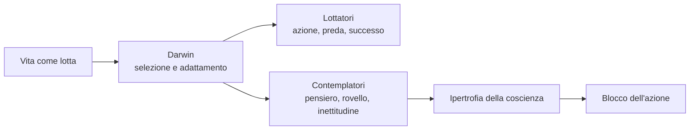
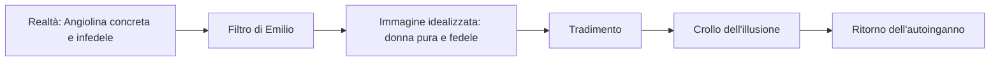
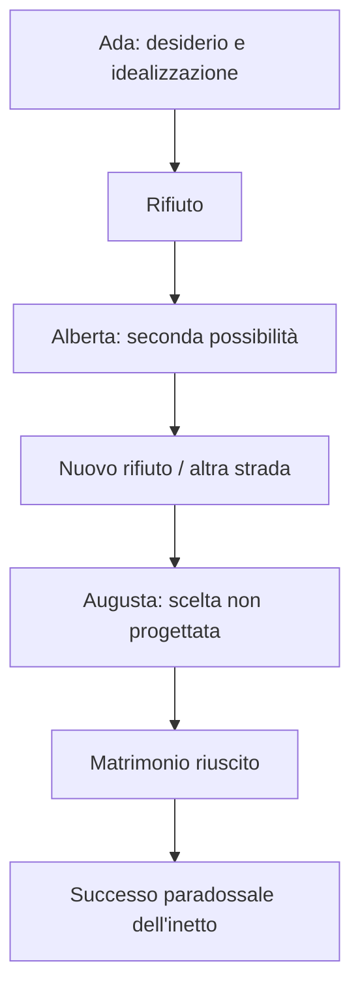
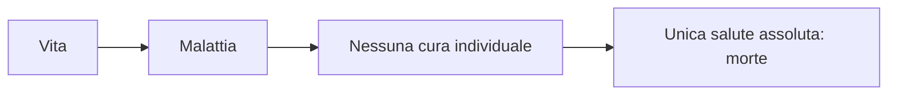
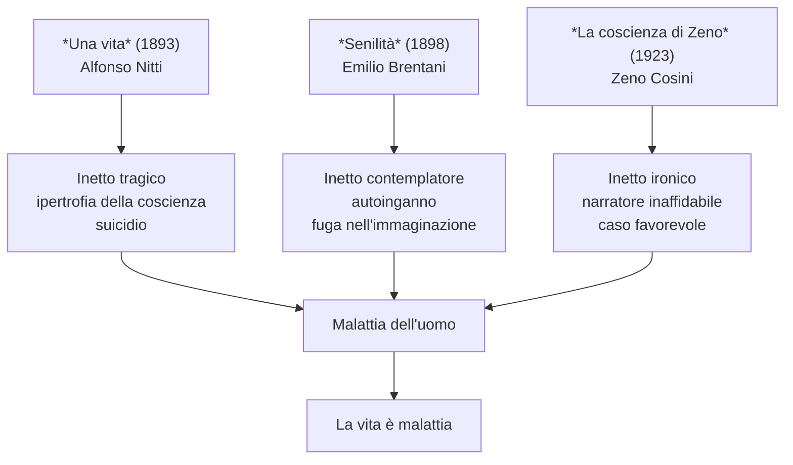

# Italo Svevo

---

## Coordinate essenziali

| Elemento | Dettaglio |
|----------|-----------|
| **Vero nome** | Ettore Schmitz |
| **Pseudonimo** | Italo Svevo: *Italo* rimanda all'identità italiana, *Svevo* al mondo germanico e mitteleuropeo |
| **Nato** | 1861, **Trieste** |
| **Morto** | 1928, dopo un incidente d'auto con complicazioni legate anche al vizio del fumo |
| **Professione** | Prima impiegato di banca, poi industriale nell'impresa Veneziani di vernici navali |
| **Rapporto con la scrittura** | Ossessione, bisogno, forma di autoanalisi e unica vera terapia |
| **Lingue** | 1ª dialetto triestino · 2ª tedesco · 3ª italiano, lingua letteraria scelta per le opere |
| **Opere principali** | *Una vita* (1893) · *Senilità* (1898) · *La coscienza di Zeno* (1923) |

---

## 1. Vita, formazione e identità di confine

### 1.1 Trieste: città mitteleuropea

Svevo nasce a **Trieste**, città di porto e di confine, collocata tra mondo italiano, austriaco e tedesco. Questo dato non è solo geografico: spiega la sua formazione composita, il suo rapporto problematico con la lingua italiana e la sua apertura verso la cultura europea, soprattutto verso Joyce e Freud.

Nel 1873 studia in Germania; quando torna a Trieste nel 1878 ha già una forte vocazione letteraria, ma il padre non la incoraggia. La sua formazione resta quindi quella di un **autodidatta**, meno vincolato ai modelli scolastici e più libero di costruire una narrativa propria.

> [!note] Dalla lezione
> L'italiano per Svevo non è la prima lingua, ma la terza: prima viene il dialetto triestino, poi il tedesco, poi l'italiano scelto come lingua letteraria. Anche per questo la sua formazione è composita.

### 1.2 La doppia vita: impiegato, industriale, scrittore

Svevo lavora come impiegato di banca, poi sposa **Livia Veneziani** ed entra nell'impresa del suocero, specializzata in una vernice navale. Diventa un industriale efficiente, cioè appartiene proprio a quel mondo borghese e produttivo che poi smaschera nei romanzi.

Dopo *Senilità* resta per circa **venticinque anni senza pubblicare**, ma non smette di scrivere. La scrittura non è per lui una carriera: è un bisogno continuo, una forma di terapia più autentica della psicoanalisi.

### 1.3 Joyce e Freud

Nel primo Novecento due incontri sono decisivi.

**James Joyce** è il suo insegnante d'inglese a Trieste. Riconosce il valore di Svevo e contribuisce alla sua fortuna internazionale dopo *La coscienza di Zeno*.

**Freud e la psicoanalisi** arrivano presto a Trieste per la vicinanza con l'area austriaca. Svevo è interessato alla psicoanalisi, ma in modo critico: non la considera davvero efficace come cura medica, mentre la ritiene importantissima come strumento letterario per raccontare inconscio, nevrosi, memoria, autoinganno e malattia.

> [!note] Dalla lezione
> Per Svevo la psicoanalisi è inutile come guarigione, ma è **fondamentale** dal punto di vista letterario: permette al romanzo del Novecento di concentrarsi sulla psiche, sulle contraddizioni dell'io e sull'inconscio. La vera cura, per lui, resta la scrittura.

---

## 2. Scrittura, malattia e società borghese

### 2.1 Scrittura di grado zero

Svevo è stato spesso accusato dalla critica di "scrivere male": lingua lineare, poco elegante, con disarmonie sintattiche. Questa **scrittura di grado zero** dipende anche dal fatto che l'italiano è la sua terza lingua. Tuttavia proprio questa semplicità gli permette di evitare il formalismo e di concentrarsi sul contenuto: la coscienza, la nevrosi, l'autoanalisi.

### 2.2 Scrivere come autoanalisi

Scrivere significa:

- osservarsi dall'interno
- portare alla luce autoinganni e contraddizioni
- trasformare il disagio in racconto
- curare, almeno parzialmente, il male di vivere

Svevo non mette in scena eroi o superuomini, ma l'**uomo ordinario** del Novecento: borghese, fragile, pieno di nevrosi, incapace di aderire pienamente alla vita.

### 2.3 La malattia dell'uomo

La malattia sveviana non è solo clinica o individuale. È il disagio dell'individuo dentro la **società borghese**, fondata su successo economico, profitto, competizione, apparenza e conformismo. Chi non riesce ad adattarsi a questo sistema si sente escluso, debole, inadeguato.

La conclusione più radicale è che la malattia coincide con la vita stessa: se vivere significa essere esposti a dolore, desiderio, frustrazione, nevrosi e morte, allora l'unica salute assoluta sarebbe la morte.

> [!note] Dalla lezione
> La domanda decisiva è: qual è la malattia dell'uomo? La risposta sveviana è tragica: **la malattia è la vita**.

---

## 3. L'inetto e l'ipertrofia della coscienza

### 3.1 Definizione di inetto

Il personaggio chiave della narrativa sveviana è l'**inetto**, dal latino *in-aptus*, cioè inadatto. L'inetto è inadatto alla vita pratica perché è abulico, privo di volontà stabile, incapace di agire con decisione.

Alfonso Nitti, Emilio Brentani e Zeno Cosini sono tre forme diverse di inettitudine. La differenza è nell'esito: Alfonso si suicida, Emilio fugge nel sogno, Zeno sopravvive grazie al caso e all'ironia.

L'evoluzione è importante: nei primi due romanzi l'inetto è soprattutto sconfitto, mentre in *La coscienza di Zeno* l'inettitudine diventa anche una forma di lucidità. Zeno non è più capace degli altri, ma sa guardare la propria condizione da una certa distanza: il **distacco ironico** gli permette di raccontare una situazione tragica con leggerezza e di accettare, almeno in parte, la malattia.

### 3.2 Ipertrofia della coscienza

La radice dell'inettitudine è l'**ipertrofia della coscienza**. *Iper-* indica eccesso; *-trofia* rimanda al nutrimento. Una coscienza ipertrofica è quindi una coscienza eccessivamente alimentata: pensa troppo, rimugina troppo, analizza tutto.

Il risultato non è una maggiore capacità di agire, ma il contrario: più il personaggio pensa, più si blocca. La riflessione diventa rovello, tormento, ostacolo alla scelta.

| Coscienza sana per l'azione | Coscienza ipertrofica |
|-----------------------------|-----------------------|
| Permette decisione rapida | Rimanda continuamente |
| Aderisce alla vita | Osserva la vita da fuori |
| Agisce | Contempla |
| Rischia | Si paralizza |

### 3.3 Lottatori e contemplatori

Svevo costruisce una dicotomia fondamentale:

| Categoria | Caratteristiche | Esempi |
|-----------|-----------------|--------|
| **Lottatori** | Agiscono, afferrano la preda, si adattano alla vita, seguono la logica darwiniana della lotta per la sopravvivenza | Macario, Balli, Angiolina, Guido in parte |
| **Contemplatori** | Pensano, osservano, rimuginano, vivono più nella coscienza che nella realtà | Alfonso, Emilio, Amalia, Zeno |

Il retroterra culturale è **Darwin**: la vita appare come lotta, selezione, capacità di adattamento. Ma gli inetti sveviani non sono adatti alla lotta; non hanno gli organi giusti per afferrare il reale.

---

## 4. *Una vita*: Alfonso Nitti e le ali di gabbiano

### 4.1 Il romanzo

*Una vita* esce nel 1893 ed è un insuccesso. Il protagonista è **Alfonso Nitti**, impiegato e inetto. Il cognome richiama *nihil*, "nulla": Alfonso porta già nel nome un destino di inconsistenza e sconfitta.

Dopo una delusione lavorativa e sentimentale, Alfonso si suicida. È il primo grande inetto sveviano.

### 4.2 "Con le ali di gabbiano ci si nasce"

Nel brano letto in classe, Alfonso partecipa a una gita in barca con **Macario**, personaggio che funziona da amico-nemico, alter ego e antagonista. Il nome Macario deriva dal greco **Makarios**, "felice": anche qui il nome contiene un significato. Macario è felice perché aderisce spontaneamente alla vita, sa stare al mondo, sa agire.

Durante la gita, Macario osserva i **gabbiani**: hanno un cervello piccolissimo, "quantità da negligersi", ma possiedono ali, occhi, stomaco, appetito e istinto perfettamente funzionali alla caccia. Sono fatti per piombare sulla preda. Il loro piccolo cervello non è un limite, perché per vivere non serve pensare troppo: serve agire al momento giusto.

Alfonso, invece, ha troppa coscienza. Il suo cervello non lo aiuta: lo ostacola. Non sa godere della gita, è pallido, impaurito, aggrappato con le mani. Macario nota le sue mani e costruisce l'opposizione decisiva:

- le **mani dei lottatori** sono organi per afferrare
- le **mani dei contemplatori** sono inabili a tenere
- le **ali** servono al gabbiano per cacciare, ma ad Alfonso servono solo per l'immaginazione

> [!note] Dalla lezione
> Macario dice ad Alfonso che chi non ha le ali necessarie quando nasce non le avrà mai. Lottatori si nasce: chi non sa piombare sulla preda al momento giusto non lo imparerà guardando gli altri.

La battuta finale è centrale: Alfonso chiede se anche lui abbia le ali e Macario risponde: **"Per fare voli poetici sì"**. Alfonso può immaginare, sognare, fare voli poetici; ma non può afferrare il reale. Ha ali per la fantasia, non mani per l'azione.

### 4.3 Significato simbolico

| Immagine | Significato |
|----------|-------------|
| **Gabbiano** | Animale perfettamente adatto alla caccia e alla vita |
| **Ali** | Capacità naturale di piombare sulla preda; in Alfonso diventano solo fantasia |
| **Mani** | Presa sul reale, azione concreta, capacità di afferrare |
| **Cervello piccolo del gabbiano** | Non serve pensare troppo per vivere: serve essere adatti |
| **Cervello di Alfonso** | Ipertrofia della coscienza, impaccio, paralisi |
| **Voli poetici** | Immaginazione senza efficacia pratica |

---

## 5. *Senilità*: Emilio, Amalia, Balli e Angiolina

### 5.1 Il romanzo

*Senilità* esce nel 1898 ed è anch'esso ignorato. Il protagonista è **Emilio Brentani**, giovane con velleità letterarie: crede di possedere una grandezza latente, ma non la realizza mai. Vive di potenzialità, rinvii e autoinganni.

Il titolo non indica la vecchiaia anagrafica: i personaggi principali sono giovani. La **senilità** è una condizione interiore fatta di fiacchezza, rinuncia, grigiore, monotonia, frustrazione e tendenza a vivere più nei pensieri che nella realtà.

### 5.2 Il sistema dei personaggi

Il romanzo organizza i personaggi secondo lo stesso schema lottatori/contemplatori.

| Personaggio | Ruolo | Categoria | Significato |
|-------------|-------|-----------|-------------|
| **Emilio Brentani** | Protagonista, aspirante scrittore | Contemplatore | Autoinganno, grandezza latente, incapacità di agire |
| **Amalia** | Sorella di Emilio | Contemplatrice | Vita grigia, dedizione al fratello, amore non corrisposto |
| **Stefano Balli** | Scultore | Lottatore | Sa godere della vita, è più sicuro e vitale |
| **Angiolina** | Donna amata da Emilio | Lottatrice | Donna concreta, sensuale, infedele, non coincide con l'ideale di Emilio |

Emilio idealizza **Angiolina**, ragazza del popolo che lui trasforma in creatura pura e angelica, mentre in realtà lo tradisce apertamente. Il suo problema è l'**autoinganno**: non vede la realtà, ma la versione della realtà che gli conviene desiderare.

**Amalia**, la sorella, presenta tratti analoghi: anche lei ama un uomo che non la corrisponde e vive in una condizione di chiusura, monotonia e frustrazione. Dall'altra parte, **Stefano Balli** e **Angiolina** rappresentano l'energia vitale, la capacità di stare nel mondo e godere dei piaceri.

> [!note] Dalla lezione
> La senilità del titolo non rimanda all'età, ma a una condizione interiore: vivere nella rinuncia, nella fiacchezza, nei propri pensieri, invece che nella realtà.

### 5.3 Brano: **La scoperta del tradimento** da *Senilità*

**Etichetta del programma:** ***Senilità*, "La scoperta del tradimento"**.  
Fonti locali: [programma di Italiano](../../../programma/italiano.md), [lezione del 16/04/2026](../lezioni/16-04-26/transcription.txt).

Questo brano va studiato come momento rivelatore dell'intero romanzo: Emilio scopre che **Angiolina non coincide con l'immagine idealizzata** che lui ha costruito. Lei non è la creatura pura, fedele, quasi angelica che Emilio vuole vedere; è una donna concreta, sensuale, libera nei comportamenti e capace di tradirlo in modo anche evidente.

La "scoperta" è quindi duplice:

| Che cosa scopre Emilio | Perché è importante |
|------------------------|--------------------|
| **Il tradimento di Angiolina** | La realtà contraddice l'immagine pura che lui aveva inventato |
| **La propria cecità** | Emilio capisce, almeno per un momento, di avere vissuto più nell'illusione che nei fatti |
| **La vitalità di Angiolina** | Angiolina appartiene al mondo dei lottatori: vive, desidera, agisce, non si lascia rinchiudere nell'idea di Emilio |
| **La propria senilità interiore** | Emilio è giovane, ma interiormente vecchio: osserva, fantastica, giudica, soffre, senza riuscire a stare davvero nella vita |

Il punto decisivo non è soltanto che Angiolina tradisce Emilio. Il punto è che Emilio **aveva bisogno di non vedere**. La sua relazione nasce già come autoinganno: egli trasforma una ragazza reale in una figura letteraria, morale, angelicata. Per questo il tradimento non distrugge solo un rapporto sentimentale, ma distrugge una costruzione mentale.

#### Perché Emilio si autoinganna

Emilio non ama Angiolina per ciò che è: ama l'immagine che egli stesso proietta su di lei. Questo meccanismo è tipicamente sveviano:

Emilio è un **contemplatore**: pensa, interpreta, fantastica. Angiolina è invece una **lottatrice**: appartiene alla vita, al desiderio, all'azione. Per questo la loro relazione è squilibrata fin dall'inizio. Emilio cerca di possedere Angiolina trasformandola in un'idea; Angiolina sfugge perché non è un'idea, ma una persona viva.

#### Lessico e temi da ricordare

| Parola chiave | Spiegazione |
|--------------|-------------|
| **Tradimento** | Non è solo infedeltà amorosa: è tradimento dell'immagine costruita da Emilio |
| **Autoinganno** | Emilio vede ciò che desidera vedere, non ciò che accade |
| **Senilità** | Fiacchezza interiore, rinuncia, incapacità di vivere nella realtà |
| **Idealizzazione** | Angiolina viene trasformata in una creatura pura, mentre è vitale e concreta |
| **Inettitudine** | Emilio non riesce né ad agire né a conoscere lucidamente se stesso |

#### Cosa dire all'orale

> In *Senilità*, "La scoperta del tradimento" mostra il crollo dell'illusione di Emilio Brentani. Emilio ha idealizzato Angiolina, vedendola come donna pura e fedele, ma la realtà la rivela diversa: concreta, sensuale, infedele, appartenente al mondo dei lottatori. Il tradimento è quindi importante non solo sul piano sentimentale, ma perché smaschera l'autoinganno del protagonista. Emilio è un inetto e un contemplatore: vive più nei propri pensieri che nella realtà. La senilità del titolo non è vecchiaia anagrafica, ma incapacità interiore di aderire alla vita.

---

## 6. *La coscienza di Zeno*: struttura generale

### 6.1 Il capolavoro

*La coscienza di Zeno* viene pubblicato nel 1923, dopo il lungo silenzio editoriale. Il protagonista è **Zeno Cosini**:

- *Zeno* richiama il greco *xenos*, "straniero": Zeno è estraneo agli altri e a se stesso
- *Cosini* suggerisce piccolezza, insignificanza

È ancora un inetto, ma diverso da Alfonso ed Emilio: possiede distacco ironico, si affida al caso e spesso il caso lo favorisce.

### 6.2 Struttura del romanzo

Il romanzo è composto da:

1. **Prefazione** del Dottor S.
2. **Preambolo** di Zeno
3. capitoli o **blocchi logici**: *Il fumo*, *La morte di mio padre*, *Storia del mio matrimonio*, *La moglie e l'amante*, *Storia di un'associazione commerciale*, *Psicanalisi*

Non c'è andamento cronologico lineare: domina il **tempo misto**, cioè il tempo della coscienza. La memoria procede per nuclei tematici, associazioni, ritorni, contraddizioni.

### 6.3 Tecniche narrative

| Tecnica | Funzione |
|---------|----------|
| **Prima persona** | È la coscienza di Zeno a parlare |
| **Monologo interiore** | Zeno parla a se stesso, si interroga, ragiona, si contraddice |
| **Narratore inaffidabile** | Zeno non offre verità oggettive ma verità filtrate, deformate, mescolate a bugie |
| **Tempo misto** | Il racconto segue la logica della memoria e della coscienza |
| **Ironia** | Distanza critica rispetto alla propria malattia e ai propri fallimenti |

---

## 7. Prefazione: Dottor S., vendetta e narratore inaffidabile

La **Prefazione** è scritta dal **Dottor S.**, lo psicanalista di Zeno. Il nome è ambiguo: può richiamare Svevo, Sigmund Freud, oppure una Z vista allo specchio, cioè un doppio rovesciato di Zeno.

Il Dottor S. dichiara di pubblicare le memorie del paziente per **vendetta**, perché Zeno ha abbandonato la cura. Questa scelta è professionalmente scorretta: il medico viola il rapporto con il paziente e propone perfino di dividere con lui i guadagni se riprenderà la terapia. Sembra quasi un ricatto.

La terapia stessa nasce in modo particolare: il medico ha chiesto a Zeno di scrivere un'autobiografia, lasciando affiorare pensieri e ricordi. Zeno però non rispetta davvero le indicazioni, interrompe il percorso e trasforma l'analisi in un testo letterario. Già nella Prefazione, quindi, la psicoanalisi appare ambigua: fallisce come cura ordinata, ma produce il romanzo.

> [!note] Dalla lezione
> Il lettore non può fidarsi neppure del Dottor S.: anche lui è risentito, interessato, coinvolto. L'inaffidabilità non riguarda solo Zeno, ma anche chi lo introduce.

La Prefazione mette subito in gioco il tema di **verità e bugie**: il Dottor S. avverte che nelle memorie di Zeno ci sono entrambe. Il romanzo del Novecento non offre più una verità sicura e oggettiva; mette il lettore davanti a punti di vista parziali.

### 7.1 Transfer e controtransfert

Il Dottor S. interpreta l'antipatia di Zeno come **transfer**: il paziente investe il medico di sentimenti nati altrove, per esempio odio, dipendenza, amore, rifiuto, legati a figure della propria storia personale. Lo psicanalista diventa uno schermo su cui il paziente proietta vissuti inconsci.

Il **controtransfert** è invece l'insieme dei sentimenti che il medico prova verso il paziente. Un analista dovrebbe conservarne consapevolezza e mantenere distacco professionale. Il Dottor S., però, appare poco distaccato: si sente truffato e pubblica per vendetta.

---

## 8. Preambolo: autoanalisi fallita e monologo interiore

Nel **Preambolo** parla Zeno. È un esempio di **monologo interiore**: Zeno si rivolge a se stesso, tenta di ricordare l'infanzia e commenta il proprio stesso tentativo.

Il medico gli aveva consigliato di non ostinarsi subito a guardare troppo lontano, ma Zeno disobbedisce. Vuole cominciare **ab ovo**, cioè dall'origine. Compra e legge un trattato di psicoanalisi, giudicandolo facile ma noioso: prova a curarsi da solo, con presunzione e sfiducia verso la disciplina.

Questo conferma il rapporto ambivalente con la psicoanalisi: Zeno la usa, la studia, ne assume il linguaggio, ma contemporaneamente la svaluta e la disobbedisce. Per Svevo questo è decisivo: la psicoanalisi non guarisce il personaggio, però offre al romanzo il metodo per scavare nella memoria, nell'inconscio e nelle bugie dell'io.

### 8.1 Gli occhi presbiti e l'infanzia

Zeno dice di voler vedere la propria infanzia, ma più di dieci lustri, cioè circa cinquant'anni, lo separano da essa. I suoi occhi sono **presbiti**: la vista stessa diventa metafora della difficoltà di vedere davvero il passato. Gli ostacoli sono gli anni, le ore, la memoria deformata.

### 8.2 La locomotiva

Nel rilassamento Zeno intravede una **locomotiva** che sbuffa in salita trascinando molte vetture. Lui non sa interpretarla e la considera quasi casuale; ma l'immagine può essere letta come metafora del peso del vivere: affanni, fatiche, dolori, carichi che la vita trascina con sé.

### 8.3 Il bambino in fasce

Zeno prova a risalire alla prima infanzia e vede un **bambino in fasce**, ma dubita che sia lui: forse è il bambino appena nato della cognata. Lo chiama "povero bambino" perché chi nasce è già destinato alla **malattia del vivere**.

Il bambino non può essere protetto del tutto. Anche i genitori, pur senza volerlo, possono trasmettere ferite, errori, traumi. Ogni minuto della vita aggiunge un reagente alla misteriosa combinazione che formerà l'individuo.

Il Preambolo si chiude con **"Ritenterò domani"**: formula simbolica di Zeno. Egli rimanda, rinnova propositi, promette di riprovare, ma non conclude. È lo stesso meccanismo dell'ultima sigaretta.

> [!note] Dalla lezione
> "Ritenterò domani" è il simbolo del personaggio: i suoi proponimenti sono sempre rinnovabili, come l'ultima sigaretta.

---

## 9. Il fumo: U.S., date e nevrosi

Il primo blocco narrativo è **Il fumo**. Zeno crede che il fumo sia la causa della propria malattia: abulia, incapacità di volontà, inettitudine. Per questo prova continuamente a smettere.

La formula decisiva è **U.S.**, cioè **ultima sigaretta**. Zeno annota date su libri, fogli, pareti; cerca giorni significativi, combinazioni numeriche, anniversari. Il meccanismo è nevrotico: ogni data dovrebbe inaugurare una nuova vita, ma ogni ultima sigaretta è seguita da un'altra.

### 9.1 Il 2 febbraio 1886

Una data ricordata è **2 febbraio 1886**, quando Zeno passa dagli studi di legge a quelli di chimica e registra l'ultima sigaretta. Il cambio di studi non è un dettaglio: mostra che Zeno mette continuamente in dubbio le proprie scelte, cerca giustificazioni, si autoconvince.

Quando torna alla legge, registra un'altra ultima sigaretta. La sigaretta diventa il capro espiatorio della sua incapacità: forse Zeno ama il vizio proprio perché gli permette di attribuire al fumo la colpa della propria debolezza.

### 9.2 Il cimitero dei buoni propositi

Da studente Zeno copre le pareti della stanza con date di ultime sigarette, scritte con colori diversi e perfino a olio. Quella stanza diventa il **cimitero dei suoi buoni propositi**: ogni data è la traccia fisica di un fallimento.

Le date preferite sono quelle musicali o simboliche:

- il **nono giorno del nono mese del 1899**
- il **primo giorno del primo mese del 1901**

L'ultima sigaretta ha un gusto più intenso perché sembra contenere una vittoria su se stessi e la promessa di un futuro di forza e salute. Ma proprio questa promessa rende il vizio rinnovabile: ogni sigaretta può diventare l'ultima, quindi nessuna è davvero l'ultima.

---

## 10. La morte del padre: schiaffo, colpa e inettitudine

Il capitolo **La morte di mio padre** mette al centro il rapporto padre-figlio, tema tipico del primo Novecento e legato alla psicoanalisi.

Il padre di Zeno è percepito come autoritario e giudicante. Quando è ormai moribondo, si solleva dal letto in uno spasmo e lascia cadere la mano sul volto del figlio. Zeno interpreta il gesto come uno **schiaffo**, cioè come ultima punizione del padre.

Il lettore non può sapere se sia davvero uno schiaffo intenzionale o un gesto involontario dovuto alla malattia. Proprio qui emerge l'inaffidabilità del racconto: il fatto è filtrato dalla coscienza di Zeno.

La reazione di Zeno rivela:

- senso di colpa
- frustrazione
- bisogno di riconoscimento paterno
- immaturità
- incapacità di trovare in sé il fondamento della propria identità

Zeno pensa che, morto il padre, non avrà più nessuno a cui dimostrare la propria grandezza. Questo mostra la sua insicurezza: non si sente adulto se non viene confermato da un'autorità esterna.

---

## 11. Matrimonio, Augusta e salute malata

Nel capitolo **Storia del mio matrimonio**, Zeno frequenta la famiglia **Malfenti**. Il capofamiglia diventa per lui una sorta di **padre elettivo**: industriale di successo, figura forte, modello borghese.

Zeno si innamora di **Ada**, la più bella, ma viene rifiutato. Nella stessa serata chiede la mano anche ad **Alberta**, che vuole studiare, e infine ad **Augusta**, la meno avvenente, che accetta e diventa una moglie perfetta.

Questo episodio mostra che Zeno è **amorale**, non semplicemente immorale: è privo di un orientamento morale stabile, si lascia guidare dagli eventi e dal caso. Paradossalmente il caso lo favorisce, perché Augusta si rivela la moglie migliore per lui.

### 11.1 Augusta e la salute

Augusta incarna la **salute**: crede nel matrimonio, nella messa domenicale, nelle certezze, nei punti fermi. Non mette continuamente in discussione la vita. Per Zeno questa salute è insieme ammirevole e inquietante.

Zeno arriva infatti a definirla una **salute malata**. È un ossimoro: Augusta è sana perché vive tranquilla, ma è "malata" perché non sa di vivere dentro la malattia dell'esistenza. La sua sicurezza appare superficiale a chi, come Zeno, dubita di tutto.

> [!note] Dalla lezione
> Per chi si fa domande, chi possiede certezze incontrovertibili può sembrare spaventoso. Il senso della vita sta nel dubbio, non in risposte immobili.

### 11.2 Brano: **Una strana proposta di matrimonio**

**Etichetta del programma:** ***La coscienza di Zeno*, "Una strana proposta di matrimonio"**.  
Fonti locali: [programma di Italiano](../../../programma/italiano.md), [lezione del 16/04/2026](../lezioni/16-04-26/transcription.txt), [lezione del 20/04/2026](../lezioni/20-04-26/transcription.txt).

Il brano appartiene al blocco narrativo **Storia del mio matrimonio**. Zeno frequenta la famiglia **Malfenti**, attratto soprattutto dal capofamiglia, che diventa per lui un **padre elettivo**: un uomo d'affari solido, sicuro, borghese, cioè tutto ciò che Zeno sente di non essere.

La proposta è "strana" perché non nasce come scelta lineare e romantica. Zeno desidera **Ada**, la più bella e la più affascinante; quando lei lo rifiuta, chiede la mano ad **Alberta**; infine arriva ad **Augusta**, la sorella meno avvenente, che accetta e diventa sua moglie.

| Passaggio | Che cosa succede | Significato |
|----------|------------------|-------------|
| **Zeno desidera Ada** | Ada rappresenta la bellezza, l'eleganza, l'ideale borghese desiderabile | Zeno vuole ciò che lo confermerebbe socialmente e narcisisticamente |
| **Ada lo rifiuta** | La proposta fallisce | Zeno sperimenta l'inadeguatezza |
| **Zeno si rivolge ad Alberta** | Anche questa possibilità non si realizza: Alberta vuole studiare e non accetta | Il matrimonio appare sempre meno scelta amorosa e sempre più tentativo di sistemazione |
| **Zeno chiede Augusta** | Augusta accetta | Il caso, più che la volontà, decide la vita di Zeno |

L'episodio rivela la natura **amorale** di Zeno. Non significa che egli sia malvagio in senso tradizionale; significa che non possiede un orientamento morale stabile. Passa da una sorella all'altra con una logica opportunistica, incerta, quasi automatica, lasciandosi trascinare dalle circostanze.

#### Perché l'episodio è centrale

La proposta di matrimonio mette insieme molti nuclei della *Coscienza*:

| Tema | Come emerge nel brano |
|------|----------------------|
| **Inettitudine** | Zeno non domina la situazione: reagisce agli eventi, non li governa |
| **Caso** | Il matrimonio riuscito nasce da una sequenza casuale di rifiuti |
| **Autoanalisi ironica** | Zeno racconta a distanza di tempo una scena imbarazzante, deformandola con ironia |
| **Narratore inaffidabile** | Il lettore deve chiedersi quanto Zeno stia confessando e quanto stia giustificando |
| **Salute / malattia** | Augusta, scelta quasi per caso, diventa il simbolo della salute borghese |

Il paradosso è che Zeno sbaglia tutto e tuttavia ottiene l'esito migliore per lui. Non sposa Ada, che idealizza; sposa Augusta, che non desiderava davvero, ma che si rivela stabile, affettuosa, capace di offrirgli una forma di equilibrio. È uno dei punti in cui Svevo mostra che l'inettitudine di Zeno non produce soltanto sconfitta: può trasformarsi in **successo paradossale**.

#### Augusta: salute o salute malata?

Augusta incarna la salute perché crede in ciò che fa: matrimonio, famiglia, messa domenicale, abitudini, certezze. Zeno però percepisce questa salute come **salute malata**, perché gli sembra inconsapevole. Augusta è sana perché non dubita; ma proprio il non dubitare, agli occhi di Zeno, è una forma di malattia spirituale.

#### Cosa dire all'orale

> In "Una strana proposta di matrimonio", Zeno frequenta la famiglia Malfenti e vorrebbe sposare Ada, la figlia più bella. Dopo il rifiuto di Ada, chiede la mano ad Alberta e poi ad Augusta, che accetta. La scena è comica e insieme rivelatrice: Zeno appare amorale, incapace di scegliere in modo coerente, guidato più dal caso che dalla volontà. Tuttavia il caso lo favorisce, perché Augusta diventa la moglie più adatta a lui. Il brano mostra l'inettitudine nuova di Zeno: non è l'inetto tragico di *Una vita*, ma un personaggio che, pur sbagliando, riesce talvolta a sopravvivere grazie all'ironia, all'adattamento e al caso.

---

## 12. Guido Speier e l'atto mancato

**Guido Speier** è il fidanzato e poi marito di Ada. È giovane, brillante, disinvolto, violinista: incarna ciò che Zeno non è ma vorrebbe essere. Zeno lo invidia e lo detesta, pur frequentandolo.

Guido compie scelte professionali azzardate, va incontro alla rovina economica e si suicida. L'episodio più significativo è il funerale: Zeno si reca al cimitero ma segue il corteo funebre sbagliato.

Questa scena va letta in senso psicoanalitico come **atto mancato**: Zeno voleva andare al funerale di Guido, ma inconsciamente fa altro. L'errore rivela un desiderio rimosso: non voleva davvero partecipare, perché Guido era il rivale odiato e invidiato.

### 12.1 Freud: Ego, Es, Super-io, lapsus e sogni

La lezione collega l'atto mancato al modello freudiano:

| Termine | Significato |
|---------|-------------|
| **Ego / Io** | Senso della realtà, coscienza delle proprie azioni |
| **Es** | Parte profonda, inconscia, pulsionale, non controllata |
| **Super-io** | Norme, regole, doveri introiettati da famiglia, scuola, società |
| **Sintomo** | Segno di disequilibrio tra queste istanze |
| **Atto mancato** | Si vuole fare una cosa ma se ne fa un'altra: emerge l'Es |
| **Lapsus** | "Scivolone" della mente: si dice una cosa al posto di un'altra |
| **Sogno** | Emersione libera dell'inconscio, interpretabile dall'analista |

L'errore al funerale di Guido non è casuale: è la parte inconscia di Zeno che si manifesta.

---

## 13. Ultimi capitoli: amante, associazione commerciale, successo casuale

Nel capitolo **La moglie e l'amante**, Zeno ha una relazione adultera con una donna che sostiene anche economicamente. Ma anche qui non è lui a scegliere davvero: alla fine è la donna ad abbandonarlo.

Nel capitolo **Storia di un'associazione commerciale**, Zeno ottiene un buon successo economico, anche grazie alle circostanze legate alla Prima guerra mondiale. Il suo successo non nasce da una volontà eroica o da un talento superiore: nasce dal caso, da circostanze favorevoli, dalla sua capacità di adattarsi passivamente agli eventi.

---

## 14. Il finale: psicanalisi, civiltà malata e apocalisse cosmica

L'ultimo capitolo si intitola **Psicanalisi**. Il romanzo si chiude tornando al tema con cui era iniziato: la cura psicoanalitica. La struttura è circolare.

Zeno polemizza con la psicanalisi perché ha compreso che la sua malattia non è individuale. Non è solo lui a essere malato: è la **vita** a essere malata, è la **civiltà** a essere malata. Perciò la psicanalisi non può guarirlo; al massimo può fargli accettare la malattia.

Zeno si dichiara guarito, ma questa guarigione è ambigua: coincide soprattutto con il rifiuto della psicanalisi, che vede patologia dove per Zeno c'è semplicemente vita.

Qui si capisce il punto più radicale: Zeno non scopre di essere sano, ma scopre che non esiste una salute separata dalla vita. Se la vita è crisi, desiderio, nevrosi, errore, invecchiamento e morte, allora la malattia non è un incidente da eliminare: è la condizione stessa dell'esistenza. Per questo la psicoanalisi può interpretare i sintomi, ma non può cancellare la malattia dell'uomo.

### 14.1 Vita, malattia e morte

Nel finale Zeno afferma che la vita somiglia alla malattia, procede per crisi, miglioramenti e peggioramenti, ma a differenza delle altre malattie è **sempre mortale**. Non sopporta cure: volerla curare sarebbe assurdo come voler curare i buchi del corpo considerandoli ferite.

La formula fondamentale è:

### 14.2 Civiltà malata, alienazione e capitalismo

Zeno allarga il discorso dall'individuo alla civiltà. La **vita attuale è inquinata alle radici**: l'uomo ha preso il posto di alberi e animali, ha inquinato aria e spazio, ha creato sovraffollamento, urbanesimo, mancanza di respiro.

La società moderna produce **alienazione**: l'individuo è estraneo a se stesso e alla società. La spirale produttivistica, la società borghese e il capitalismo nascente allontanano l'uomo dalla sua essenza.

> [!note] Dalla lezione
> La parola chiave per i personaggi del Novecento è **alienazione**: estraneità dell'individuo rispetto alla società e a se stesso.

### 14.3 Animali e uomo occhialuto

Gli animali si evolvono adattando il proprio organismo all'ambiente: la rondinella sviluppa le ali, la talpa si interra, il cavallo trasforma il piede. Il loro progresso non lede la salute.

L'uomo, invece, è **occhialuto**: per orientarsi nella realtà ha bisogno di strumenti fuori di sé. Non potenzia il proprio organismo, ma inventa **ordigni** esterni al corpo.

All'inizio gli ordigni sono prolungamenti del braccio, come bastoni o clave. Poi non hanno più alcun rapporto con l'arto: basta un pulsante, un comando, un meccanismo distante. L'uomo diventa più furbo ma anche più debole; la sua furbizia cresce in proporzione alla sua debolezza.

### 14.4 Ordigno, apocalisse, nebulosa

La parola **ordigno** è decisiva perché preannuncia la catastrofe. Sotto la legge del possessore del maggior numero di ordigni prosperano malattie e ammalati: la selezione naturale viene sostituita dalla potenza tecnica.

Zeno immagina che, quando i gas velenosi non basteranno più, un uomo come tutti gli altri ma "un po' più ammalato" inventerà o userà un esplosivo incomparabile e lo collocherà al centro della terra. L'esplosione sarà enorme e nessuno la udrà; la terra tornerà allo stato di **nebulosa**, priva di parassiti e malattie.

Questa immagine anticipa in modo impressionante le paure novecentesche dell'atomica, delle dittature e dell'uomo che può decidere le sorti del mondo attraverso la tecnica.

### 14.5 Nichilismo o palingenesi

Il finale è ambiguo:

| Interpretazione | Significato |
|-----------------|-------------|
| **Nichilismo** | La distruzione è definitiva; se la vita è malattia, la morte è l'unica salute |
| **Palingenesi** | Dopo l'azzeramento cosmico può esserci una rinascita, una nuova origine |

La parola finale del romanzo è **"malattie"**. Non è casuale: tutta *La coscienza di Zeno* arriva lì, alla diagnosi della vita e della civiltà come malattia.

> [!note] Dalla lezione
> Il tono dell'ultima pagina cambia: non è più soltanto ironico, ma ragionativo, serio, solenne. Il romanzo si chiude su un'apocalisse cosmica che può essere letta come distruzione nichilistica o come possibile palingenesi.

---

## 15. Quadro dei tre romanzi

| Romanzo | Protagonista | Meccanismo | Esito |
|---------|--------------|------------|-------|
| *Una vita* | Alfonso Nitti | Non ha mani per afferrare il reale; ha solo voli poetici | Suicidio: l'inettitudine resta tragica |
| *Senilità* | Emilio Brentani | Autoinganno, grandezza latente, senilità interiore | Fuga nel sogno e nell'illusione |
| *La coscienza di Zeno* | Zeno Cosini | Nevrosi, ironia, caso, narratore inaffidabile | Successo paradossale, accettazione della malattia e diagnosi cosmica |

---

## 16. Cronologia essenziale

| Anno | Evento / Opera |
|------|----------------|
| **1861** | Nasce Ettore Schmitz a Trieste |
| **1873** | Studia in Germania |
| **1878** | Ritorna a Trieste |
| **1893** | Pubblica *Una vita* |
| **1898** | Pubblica *Senilità* |
| **1900** | *L'interpretazione dei sogni* di Freud inaugura simbolicamente la psicoanalisi |
| **Primo Novecento** | Conosce Joyce e si interessa a Freud |
| **1923** | Pubblica *La coscienza di Zeno* |
| **1928** | Muore dopo incidente d'auto, con complicazioni legate al fumo |

---

## 17. Fonti e testi da portare

Testi centrali emersi dalle lezioni:

- *Una vita*, **"Con le ali di gabbiano ci si nasce"**
- *La coscienza di Zeno*, **Prefazione**
- *La coscienza di Zeno*, **Preambolo**
- *La coscienza di Zeno*, **Il fumo / Ultima sigaretta**
- *La coscienza di Zeno*, **La morte di mio padre / schiaffo del padre**
- *Senilità*, **La scoperta del tradimento**
- *La coscienza di Zeno*, **Una strana proposta di matrimonio**
- *La coscienza di Zeno*, **finale / Psicanalisi**

---

*Fonti: lezioni del 13/04/2026, 16/04/2026 e parte Svevo del 20/04/2026 — Lingua e letteratura italiana*
