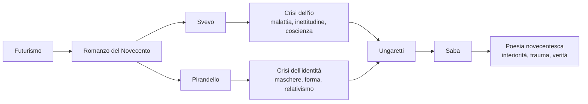

# Indice interrogazioni maggio — riassunti rapidi

> **Scopo:** navigazione veloce tra i riassunti utili per le interrogazioni di maggio.
> **Campo:** dal Futurismo a Saba, compresi.
> **Formato consigliato:** partire dai riassunti per una ripresa discorsiva, poi usare i ripassi solo per fissare collegamenti e mappe finali.

> **PDF unico:** [riassunti-interrogazioni-maggio.pdf](riassunti-interrogazioni-maggio.pdf)

---

## Percorso di studio

Questa sezione del programma segue il passaggio dal clima delle avanguardie alla crisi del romanzo e dell'identità nel Novecento, fino alla poesia italiana tra guerra, interiorità e autobiografia. L'ordine più comodo per studiare è quello delle cartelle: prima il **Futurismo**, poi il **romanzo del Novecento**, quindi **Svevo** e **Pirandello** come grandi autori della crisi dell'io, infine **Ungaretti** e **Saba** per la poesia novecentesca.

---

## Link rapidi ai riassunti

| Ordine | Argomento | Markdown | PDF | Perché conta |
|---:|-----------|----------|-----|--------------|
| 1 | **Il Futurismo** | [futurismo/riassunto.md](futurismo/riassunto.md) | [futurismo/riassunto.pdf](futurismo/riassunto.pdf) | Serve per capire avanguardia, modernità, macchina, velocità, rottura con il passato e sperimentazione formale. |
| 2 | **Il romanzo del Novecento** | [romanzo-novecento/riassunto.md](romanzo-novecento/riassunto.md) | [romanzo-novecento/riassunto.pdf](romanzo-novecento/riassunto.pdf) | Introduce soggettività, tempo interiore, narratore inattendibile, personaggio in crisi e confronto con Proust, Kafka e Joyce. |
| 3 | **Italo Svevo** | [svevo/riassunto.md](svevo/riassunto.md) | [svevo/riassunto.pdf](svevo/riassunto.pdf) | Autore dell'inetto, della coscienza ipertrofica, della malattia come chiave della vita e del romanzo come autoanalisi. |
| 4 | **Luigi Pirandello** | [pirandello/riassunto.md](pirandello/riassunto.md) | [pirandello/riassunto.pdf](pirandello/riassunto.pdf) | Centrale per identità frantumata, maschere, vita e forma, umorismo, relativismo e teatro nel teatro. |
| 5 | **Giuseppe Ungaretti** | [ungaretti/riassunto.md](ungaretti/riassunto.md) | [ungaretti/riassunto.pdf](ungaretti/riassunto.pdf) | Porta alla poesia della parola essenziale, della guerra, del segreto, dell'analogia e della fratellanza. |
| 6 | **Umberto Saba** | [saba/riassunto.md](saba/riassunto.md) | [saba/riassunto.pdf](saba/riassunto.pdf) | Chiude il percorso con poesia onesta, autobiografia, trauma familiare, Trieste e ricerca della verità interiore. |

---

## Collegamenti da tenere pronti

Il **Futurismo** è utile come soglia del Novecento: rompe con il passato, rifiuta musei e biblioteche, celebra macchina, velocità, guerra e modernità urbana. Questo aiuta anche a capire per contrasto autori successivi come Ungaretti, che eredita alcune libertà formali ma le piega a una poesia essenziale e tragica, non aggressiva o celebrativa.

Il **romanzo del Novecento** prepara Svevo e Pirandello: non conta più raccontare una realtà ordinata dall'esterno, ma mostrare una realtà filtrata dalla coscienza. Il tempo diventa soggettivo, il narratore può essere inattendibile, il personaggio non è più compatto ma problematico e in divenire.

**Svevo** e **Pirandello** vanno studiati anche insieme. Svevo lavora sull'inetto, sulla malattia, sull'autoanalisi e sulla coscienza che blocca l'azione; Pirandello lavora sulla maschera, sulla forma sociale, sulla verità soggettiva e sulla frantumazione dell'identità. Entrambi mostrano che l'io novecentesco non è stabile.

**Ungaretti** e **Saba** rappresentano due modi diversi di fare poesia nel Novecento. Ungaretti riduce la parola all'essenziale, lavora sul silenzio, sulla guerra e sull'illuminazione analogica; Saba cerca una poesia chiara, onesta, autobiografica, capace di dire il trauma e la verità dell'interiorità con parole comuni.

---

## Strategia veloce per ripassare

1. Apri prima il riassunto dell'argomento.
2. Fissa le parole chiave: movimento, poetica, opere, tecniche, temi.
3. Per gli autori, riduci la biografia a ciò che spiega opere e poetica.
4. Prepara almeno un collegamento in avanti e uno all'indietro.
5. Chiudi con una frase sintetica del tipo: "questo autore/argomento è importante perché...".
