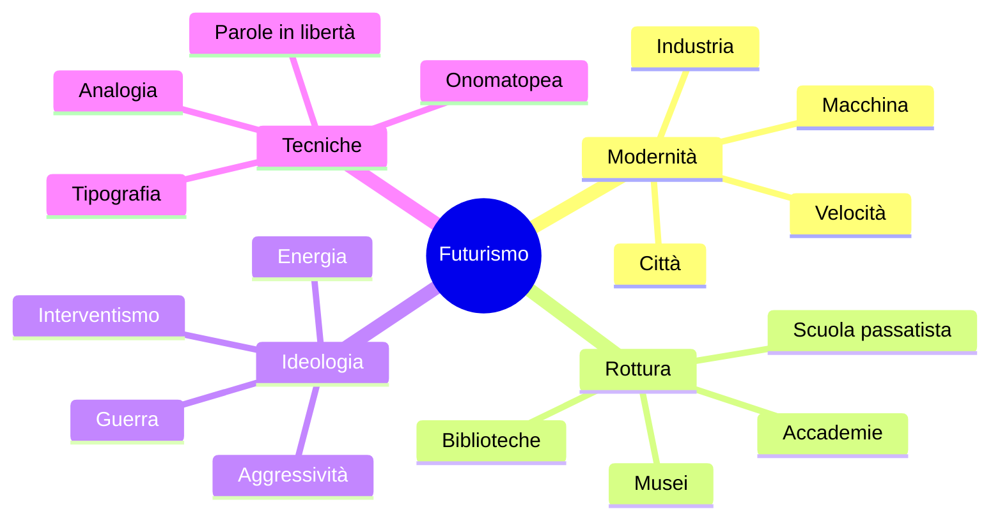
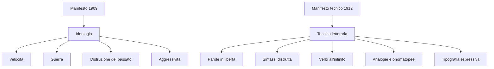
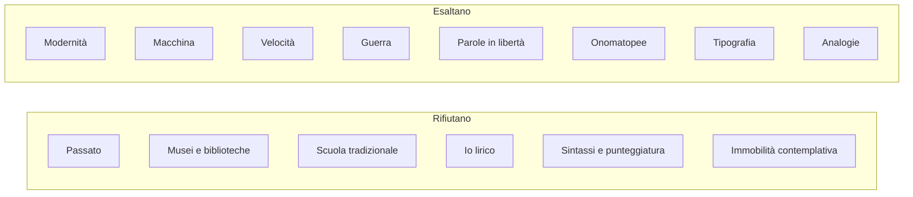

# Il Futurismo — Riassunto di studio

---

## Date fondamentali

| Anno / Data | Evento |
|-------------|--------|
| **1899** | Fondazione della FIAT, simbolo dell'industrializzazione italiana nascente |
| **20 febbraio 1909** | Pubblicazione del *Manifesto del Futurismo* su *Le Figaro* |
| **1911** | *Manifesto dei pittori futuristi* |
| **1912** | *Manifesto tecnico della letteratura futurista* |
| **1913** | Inizio della rivista **Lacerba** a Firenze |
| **1914** | **Zang Tumb Tumb** di Marinetti |
| **1915** | **Rarefazioni e parole in libertà** di Corrado Govoni |

---

## 1. Contesto storico e nascita

Il Futurismo è il **primo movimento d'avanguardia** italiano del Novecento. Il termine *avanguardia* viene dal lessico militare: indica chi va avanti, in avanscoperta, prima degli altri. Anche i futuristi vogliono precedere il proprio tempo, esplorare forme nuove e rompere con ciò che percepiscono come vecchio, immobile e superato.

Non è un movimento solo letterario: investe **letteratura, pittura, teatro, musica, cucina, grafica, costume e società**. Il suo strumento principale è il **manifesto**, cioè un testo programmatico, provocatorio, fatto per dichiarare pubblicamente una nuova idea di arte e di vita.

### 1.1 La polemica contro la società borghese

Il bersaglio polemico dei futuristi è la **società borghese**, giudicata repressiva e indifferente verso l'arte. Questo rifiuto riprende un tema già presente nei **poeti maledetti** francesi, come Baudelaire, con l'immagine del poeta che perde la propria aureola e dell'**Albatros** inadatto alla società moderna.

La differenza è che i futuristi non reagiscono con malinconia o isolamento: rispondono con **aggressività**, sfida e volontà distruttiva. L'artista futurista si sente antagonista della classe dominante, declassato e inserito in una società capitalistico-industriale in cui anche l'arte entra nel mercato. Per Marinetti, ciò che non diventa merce e non partecipa alla nuova produzione moderna merita di essere distrutto.

### 1.2 Modernità, industria, macchina

Il mito centrale del Futurismo è la **modernità**: città, fabbriche, traffico, elettricità, macchine, velocità, rumore. L'Italia è ancora in larga parte agricola, ma l'industrializzazione sta iniziando: la FIAT, fondata nel **1899**, diventa il simbolo della nuova civiltà meccanica.

L'automobile è l'oggetto mitico del primo Novecento: non è ancora un bene comune, ma appare come emblema di lusso, potenza e futuro. Con le avanguardie la letteratura abbandona progressivamente l'idillio agreste e accoglie l'**eroismo della vita moderna**: boulevard, officine, luci artificiali, macchinari e folla urbana.

> [!note] Dalla lezione
> D'Annunzio contribuì alla parola **automobile**, scegliendola al femminile e motivandola con una descrizione provocatoria e misogina: l'automobile avrebbe grazia e vivacità femminili, ma anche una perfetta obbedienza.

### 1.3 Opera d'arte e riproducibilità

Per i futuristi l'opera d'arte non deve essere un oggetto unico, sacro e irripetibile. La modernità porta con sé **tipografia, stampa, fotografia**, cioè tecniche che consentono la riproduzione e la diffusione di massa. Anche l'arte deve assumere questa logica produttiva: la pagina stampata, il carattere tipografico, il segno grafico e l'impaginazione diventano strumenti espressivi.

### 1.4 Rapporto con D'Annunzio e Nietzsche

Il rapporto con **D'Annunzio** è ambivalente. I futuristi condividono con lui vitalismo, forza, temerità, interventismo, disprezzo per la debolezza e culto dell'azione. Però rifiutano il suo **culto del passato**, della tradizione classica, del mito e della bellezza antica.

Per questo in *Contro i professori* Marinetti prende le distanze anche da **Nietzsche**: il suo Superuomo, pur legato alla potenza, resta secondo i futuristi un prodotto della cultura greca e della mitologia, dunque ancora passatista.

---

## 2. Ideologia futurista

### 2.1 Distruzione del passato

Il programma futurista è un progetto di **eversione**: non vuole semplicemente superare il passato, ma distruggerne il prestigio. Il passato è visto come una prigione, un peso morto che impedisce alla modernità di esprimersi.

Le formule più celebri sono:

- **«Bruciamo i musei»**, perché il museo conserva e immobilizza ciò che per i futuristi non parla più al presente.
- **«Uccidiamo il chiaro di luna»**, perché il chiaro di luna rappresenta la poesia sentimentale e contemplativa da Petrarca a Leopardi.
- La **museificazione** dell'arte viene interpretata come una forma di morte: l'opera diventa reliquia, perde energia vitale e si cristallizza.

La polemica riguarda anche scuola, professori, biblioteche e accademie: tutti luoghi in cui, secondo Marinetti, il passato viene trasformato in autorità e imposto ai giovani.

### 2.2 Dinamismo, velocità, aggressività

L'arte futurista deve imitare il mondo contemporaneo: non la natura quieta, ma la città in movimento. I valori principali sono **dinamismo**, **velocità** e **aggressività temeraria**.

Il dinamismo è la percezione di un mondo in continua trasformazione. La velocità diventa una bellezza nuova, legata ad automobile, treno, aereo e macchina. L'aggressività completa il quadro: il Futurismo esalta il pericolo, la ribellione, il coraggio fisico, lo schiaffo, il pugno, la lotta.

I temi tipici sono quindi: automobili, treni in corsa, aeroplani, fabbriche, officine, luci elettriche, folle urbane, guerra, mitragliatrici, cannoni, esplosioni, rumori meccanici e oggetti tecnici.

### 2.3 Guerra e interventismo

L'aspetto ideologico più controverso è la **glorificazione della guerra**, definita **«sola igiene del mondo»**. La guerra, per i futuristi, eliminerebbe debolezza, immobilismo e viltà, imponendo energia, rischio e forza.

Per questo i futuristi si collocano tra gli **interventisti** prima della Prima guerra mondiale e saranno poi vicini al **fascismo**. Le serate futuriste avevano spesso un carattere provocatorio e violento: finivano in risse, bottigliate e scontri, coerentemente con l'iconoclastia del movimento.

---

## 3. I Manifesti

### 3.1 Il *Manifesto del Futurismo* (1909)

Il *Manifesto del Futurismo* viene pubblicato il **20 febbraio 1909** su *Le Figaro*, a Parigi. La scelta di una rivista francese mostra subito l'ambizione internazionale del movimento.

Il testo enuncia i principi generali del Futurismo con uno stile aggressivo, incalzante, quasi militare. Sul piano formale usa **asindeti**, elenchi, ritmo rapido e **climax ascendenti**: la forma stessa comunica energia e violenza.

I nuclei principali sono:

- **Amor del pericolo e temerità**: coraggio, audacia e ribellione diventano elementi essenziali della poesia.
- **Rifiuto dell'immobilità**: contro estasi, sonno e contemplazione, i futuristi esaltano insonnia febbrile, corsa, salto mortale, schiaffo e pugno.
- **Bellezza della velocità**: la modernità aggiunge al mondo una bellezza nuova, superiore a quella tradizionale.
- **Aggressività come criterio estetico**: per Marinetti non c'è bellezza senza lotta; un'opera non aggressiva non può essere un capolavoro.
- **Guerra e distruzione**: il manifesto glorifica guerra, militarismo, patriottismo e gesto distruttore.
- **Attacco alle istituzioni culturali**: musei, biblioteche e accademie sono bersagli da abbattere insieme a moralismo, femminismo e opportunismo.
- **Nuovo sacro moderno**: al Dio tradizionale si sostituisce la velocità onnipresente, quasi divinizzata.

La conclusione lancia dall'Italia un manifesto di violenza incendiaria e fonda ufficialmente il Futurismo.

### 3.2 Il *Manifesto tecnico della letteratura futurista* (1912)

Il *Manifesto tecnico* traduce l'ideologia in regole di scrittura. Qui nasce il **paroliberismo**, cioè le **parole in libertà**: le parole devono liberarsi da sintassi, punteggiatura e vincoli logici.

Le principali regole sono:

| Regola | Significato |
|--------|-------------|
| **Distruggere la sintassi** | Le parole non devono più essere ordinate secondo le regole tradizionali |
| **Usare il verbo all'infinito** | L'infinito elimina la persona e quindi riduce l'io soggettivo; esprime anche continuità e dinamismo |
| **Abolire l'aggettivo** | L'aggettivo è una sfumatura lenta e meditativa, incompatibile con la rapidità |
| **Abolire l'avverbio** | L'avverbio tiene unite le parole e conserva un tono troppo ordinato |
| **Abolire la punteggiatura** | Virgole e punti sono soste considerate assurde nello stile vivo |
| **Usare il doppio sostantivo** | Ogni sostantivo può essere accostato a un altro per analogia: uomo-torpediniera, folla-risacca, piazza-imbuto |
| **Maximum di disordine** | L'ordine è prodotto dell'intelligenza prudente; l'arte deve orchestrare immagini disordinate |
| **Distruggere l'io** | L'uomo formato da biblioteca e museo non interessa più: conta l'energia impersonale della vita moderna |

Fondamentale è l'**immaginazione senza fili**: le immagini si associano liberamente senza i fili della logica, della grammatica e della tradizione. Marinetti vuole arrivare a sopprimere persino il primo termine dell'analogia, lasciando solo sequenze di immagini rapide, ardite e spesso oscure.

---

## 4. Autori e opere

## 4.1 Filippo Tommaso Marinetti

**Marinetti** è l'animatore del Futurismo: organizza il gruppo, scrive manifesti, conduce le serate futuriste e definisce la poetica del movimento. La rivista di riferimento è **Lacerba**, pubblicata a Firenze dal **1913**, dove compaiono anche artisti come **Boccioni** e **Carrà**.

### *Zang Tumb Tumb* (1914)

L'opera più celebre di Marinetti è **Zang Tumb Tumb**, descrizione fonosimbolica di un episodio della guerra d'Africa. Il titolo è già un'**onomatopea**: riproduce il suono di colpi, esplosioni e battaglia.

Il testo applica le regole del *Manifesto tecnico*:

- parole in libertà;
- sintassi distrutta;
- punteggiatura abolita o ridotta;
- onomatopee proprie;
- ritmo visivo e sonoro;
- uso espressivo dei caratteri tipografici;
- spazi bianchi come silenzio o pausa;
- segni grafici, segni algebrici, parentesi, linee;
- lettere ripetute dentro le parole;
- disegni e variazioni di grandezza.

La pagina non è più solo supporto della poesia: diventa spazio visivo e acustico. Il grassetto può indicare un aumento della voce, i caratteri piccoli una voce sottile, lo spazio bianco un'interruzione o un silenzio.

Un confronto utile è con **Ungaretti**: entrambi valorizzano vuoto della pagina, parola isolata ed essenzialità. Però la differenza ideologica è decisiva: il Futurismo esalta la guerra, mentre Ungaretti, dalla trincea, ne mostra la fragilità umana senza glorificarla.

### *Marcia futurista — Parole in libertà*

La *Marcia futurista*, tratta da *Zang Tumb Tumb*, è un esempio tipico di poesia futurista costruita su onomatopee e ritmo performativo. Le sequenze sonore come **iró**, **pic**, **pac**, **ran** imitano la marcia e trasformano la lettura in una performance.

I caratteri tipografici indicano ritmo, volume e tono: le scritte più grandi richiedono voce più forte, quelle più piccole una voce più sottile. Compare anche il **calligramma**, cioè la disposizione delle parole in modo da disegnare l'oggetto nominato, come nel caso del pallone frenato turco. Il procedimento richiama la poesia visiva francese e Apollinaire, per esempio *Il pleut*.

> [!note] Dalla lezione
> Marinetti modificava anche le fotografie per far percepire movimento e dinamismo, rifiutando l'immagine statica e monodimensionale.

### *Contro i professori*

*Contro i professori* sviluppa la polemica futurista contro il **passatismo**. Il bersaglio non è solo la letteratura tradizionale, ma l'intera società che conserva il passato: scuola, università, musei, biblioteche e accademie.

Marinetti rifiuta **Nietzsche** perché il suo Superuomo resta legato alla tragedia greca, al paganesimo e alla mitologia. Al Superuomo greco oppone l'**uomo moltiplicato per opera propria**: nemico del libro, amico dell'esperienza personale, allievo della macchina, guidato da volontà, istinto, calcolo, astuzia e temerità.

Le università vengono attaccate come luoghi in cui l'intellettualità marcisce. I futuristi immaginano di dedicare al terremoto le rovine di Roma e Atene, cioè i simboli massimi della tradizione classica. I tre nemici dell'arte sono **imitazione, prudenza e denaro**, riconducibili a una sola colpa: la **viltà**.

La scuola tradizionale è accusata di soffocare l'energia della gioventù. I professori passatisti, secondo Marinetti, castrano gli spiriti destinati a creare l'avvenire. La scuola futurista dovrebbe invece educare al rischio con un **corso regolare di pericoli fisici**: incendi, annegamenti, crolli e situazioni impreviste. Non è sport in senso positivo, ma addestramento aggressivo alla violenza e alla lotta.

## 4.2 Corrado Govoni

**Corrado Govoni** è l'altro autore studiato e rappresenta soprattutto la **poesia visiva** futurista. La raccolta principale è **Rarefazioni e parole in libertà** del **1915**.

### *Il palombaro* (1915)

*Il palombaro* è uno degli esempi più noti di poesia visiva futurista. Il testo rappresenta il fermento della **vita sottomarina** combinando disegni, parole, caratteri tipografici e analogie.

La poesia non si legge solo in modo lineare: si percepisce **simultaneamente**, come insieme di segni visivi e sonori. Le immagini principali sono costruite per analogia:

- la **medusa** diventa un «ombrello dimenticante», per somiglianza di forma;
- l'**attinia** è descritta come un ceppo insanguinato con capelli serpentini di sirene decapitate, immagine più fantasiosa e inquietante;
- lettere e parole assumono valore grafico, non soltanto linguistico.

Govoni usa anche formule miste di parole e segni algebrici, come **bucato + bagno + ballo = primo amore**, e trasforma lettere in disegno, per esempio le **m** che riproducono l'andamento ondoso del mare.

---

## 5. Pittura futurista

Il Futurismo riguarda anche le arti figurative. Nel **1911** Boccioni, Carrà e Russolo firmano il *Manifesto dei pittori futuristi*. Il principio è lo stesso della letteratura: rappresentare **movimento**, **dinamismo** e modernità.

Un esempio fondamentale è **Dinamismo di un cane al guinzaglio** di **Giacomo Balla**. Il movimento del cane viene reso attraverso la ripetizione delle zampe in sequenza, insieme al movimento della gonna della donna che lo accompagna. L'immagine statica suggerisce così una successione temporale, quasi anticipando il cinema.

Un altro esempio è **Forme uniche della continuità nello spazio** di **Umberto Boccioni**, scultura in bronzo riprodotta sui venti centesimi di euro. Pur usando un materiale pesante, Boccioni crea linee fluide e continue che comunicano movimento.

> [!note] Dalla lezione
> Boccioni in scultura e Marinetti in letteratura affrontano la stessa sfida: rendere dinamico ciò che per natura è statico, cioè il bronzo e la pagina stampata.

---

## 6. Sintesi della poetica

Il Futurismo è una frattura radicale nella letteratura italiana perché rifiuta programmaticamente la tradizione e vuole sostituire alla contemplazione una poetica dell'azione. La modernità non è solo un tema: diventa un metodo, perché influenza forma, lingua, grafica, ritmo e rapporto con la pagina.

Le sue posizioni ideologiche sono problematiche: esaltazione della guerra, disprezzo per la cultura umanistica, aggressività, interventismo e vicinanza al fascismo. Tuttavia le innovazioni formali restano fondamentali per la modernità artistica: **paroliberismo**, **poesia visiva**, **simultaneità delle percezioni**, uso espressivo della tipografia, calligramma, onomatopea e rottura della sintassi.

## 7. Come si costruisce un testo futurista

L'esercizio pratico svolto in classe mostra come le regole del *Manifesto tecnico* possano diventare procedura:

1. Scrivere una frase di 10-15 parole in disposizione libera.
2. Eliminare aggettivi e avverbi.
3. Togliere punteggiatura e pronomi.
4. Trasformare i verbi all'infinito.
5. Accostare a ogni sostantivo un altro sostantivo per analogia.
6. Disporre il materiale in ordine casuale.
7. Aggiungere onomatopee, disegni, linee e variazioni grafiche.

Il risultato è una pagina in cui il significato non dipende più solo dalla frase ordinata, ma da suono, immagine, posizione, ritmo e analogia: cioè dalla trasformazione della poesia in oggetto visivo e dinamico.
