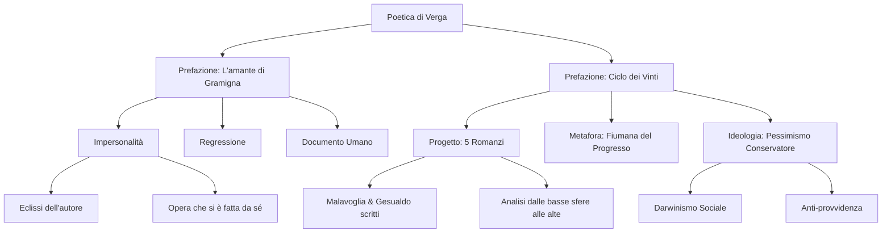

# Lezione - 01-12-25 - LINGUA E LETTERATURA ITALIANA

## Metadata
- 📅 **Data:** 01-12-25
- 📚 **Materia:** LINGUA E LETTERATURA ITALIANA
- 👨‍🏫 **Argomento:** Poetica di Giovanni Verga (Prefazioni e Manifesti del Verismo)
- ✅ **Stato:** COMPLETO

## Riassunto
La lezione analizza i due testi fondamentali per comprendere la poetica verista di Giovanni Verga: la lettera a Salvatore Farina (prefazione a *L'amante di Gramigna*) e la prefazione al *Ciclo dei Vinti*. Attraverso la lettura diretta, vengono definiti i concetti chiave dell'**impersonalità** (l'eclissi dell'autore) e della **regressione** narrativa. Si esamina il progetto del *Ciclo dei Vinti*, un'indagine sociologica e letteraria basata sul **Darwinismo sociale** e sulla metafora della **"fiumana del progresso"**, che travolge i più deboli ("i vinti") che tentano di cambiare il proprio stato sociale, delineando la visione pessimistica e conservatrice dell'autore.

## Parole Chiave
- **Impersonalità**: Tecnica narrativa per cui l'autore "scompare" dal testo, non esprimendo giudizi né commenti, lasciando che i fatti parlino da soli ("eclissi del narratore").
- **Regressione**: Procedimento con cui l'autore rinuncia alla propria cultura e linguaggio per adottare l'ottica, i valori e la lingua della comunità popolare che descrive.
- **Documento Umano**: Definizione dell'opera letteraria che deve basarsi su fatti veri ("fatto nudo e schietto"), analizzati con scrupolo scientifico.
- **Ciclo dei Vinti**: Progetto di cinque romanzi (di cui solo due realizzati) volti a studiare l'avidità e l'ambizione umana attraverso tutte le classi sociali.
- **Fiumana del Progresso**: Metafora che descrive il progresso come una piena violenta che, vista da lontano appare maestosa (evoluzione dell'umanità), ma da vicino travolge e distrugge i singoli individui ("i vinti").
- **Vaga bramosia dell'ignoto**: Il desiderio indefinito di migliorare la propria condizione ("stare meglio") che rompe l'equilibrio iniziale e porta alla rovina (es. *I Malavoglia*).
- **La Roba**: Termine verghiano per indicare l'accumulo di beni materiali e terrieri, considerati più importanti del denaro liquido e degli affetti (es. *Mastro-don Gesualdo*).
- **Darwinismo Sociale**: Applicazione delle teorie di Darwin alla società: la vita è una "lotta per l'esistenza" dove il più forte vince e il debole soccombe.
- **Forma inerente al soggetto**: Principio stilistico per cui il linguaggio e la sintassi devono adattarsi alla classe sociale rappresentata.

## Argomenti Trattati
- Analisi della Prefazione a *L'amante di Gramigna* (Lettera a Salvatore Farina).
- Teoria dell'Impersonalità e della Regressione.
- Analisi della Prefazione al *Ciclo dei Vinti* (*I Malavoglia*).
- Struttura e tematiche dei 5 romanzi del Ciclo.
- La concezione del Progresso e il pessimismo verghiano.

## Mappa Concettuale

---

## Contenuto Completo

### 1. Prefazione a "L'amante di Gramigna" (Lettera a Salvatore Farina)

Questo testo è il manifesto tecnico del Verismo. Verga lo scrive sotto forma di lettera all'amico intellettuale Salvatore Farina, introducendo la novella *L'amante di Gramigna* (contenuta in *Vita dei campi*).

**Concetti Fondamentali:**

*   **Il Documento Umano:** L'opera non è un racconto di invenzione, ma un "documento umano", un fatto storico, vero.
*   **Fatto nudo e schietto:** Verga rifiuta il romanzesco e gli abbellimenti. Il lettore deve trovarsi faccia a faccia con la realtà cruda.
*   **Metodo Scientifico:** L'analisi delle passioni umane deve seguire uno "scrupolo scientifico", indagando i rapporti di causa-effetto che le generano (influenza del Positivismo e di Zola).
*   **Profezia sui romanzi futuri:** Verga ipotizza che in futuro, affinata l'arte realistica, i romanzi saranno semplici "**fatti diversi**" (*faits divers*), ovvero fatti di cronaca, senza bisogno di romanzare.

> 📌 **Definizione chiave: Impersonalità / Eclissi dell'Autore**
> "La mano dell'artista rimarrà assolutamente invisibile... l'opera d'arte sembrerà **essersi fatta da sé**... senza serbare alcun punto di contatto con il suo autore, alcuna macchia del peccato d'origine."
>
> L'autore deve sparire. L'opera deve sembrare un fatto naturale, sorto spontaneamente, non filtrato dalla lente soggettiva dello scrittore.

**Conseguenze Tecniche (I 3 punti della poetica):**
1.  **Impersonalità:** Sparizione dell'autore e dei suoi giudizi.
2.  **Regressione:** L'autore abbandona il suo intelletto e cultura per adottare l'ottica "anonima popolare".
3.  **Riduzione all'essenziale:** Scarnificazione del racconto. Eliminazione di descrizioni superflue e presentazioni dei personaggi (i personaggi si definiscono da soli tramite azioni e parole).

---

### 2. Prefazione al "Ciclo dei Vinti"

Testo programmatico premesso al romanzo *I Malavoglia*. Verga illustra il piano dell'intera opera (pentalogia) e la filosofia che la sottende.

#### A. Il Progetto dei Cinque Romanzi
L'obiettivo è studiare il "meccanismo delle passioni" e l'ambizione umana a partire dalle classi più basse fino ai vertici della società.

1.  **I Malavoglia** (Mondo rurale/pescatori): Lotta per i bisogni materiali primari.
    *   *Trama citata:* Famiglia di pescatori poveri ma dignitosi. Tentano il commercio dei lupini (ipotecando la casa) per stare meglio. La barca "Provvidenza" naufraga. Risultato: rovina economica, morte di Bastianazzo, carcere per 'Ntoni, prostituzione, disgregazione familiare.
2.  **Mastro-don Gesualdo** (Mondo borghese/provinciale): Avidità di ricchezze.
    *   *Personaggio:* Un muratore divenuto ricco (*parvenu*). Sacrifica tutto (affetti, famiglia) per la "**Roba**". Muore solo.
3.  **La Duchessa de Leyra** (Aristocrazia): Vanità aristocratica (aspirazione al titolo nobiliare). *Solo abbozzato.*
4.  **L'Onorevole Scipione** (Politica): Ambizione di potere politico.
5.  **L'uomo di lusso** (Intellettuale/Artista): Riunisce tutte le bramosie precedenti + stanchezza e senso di artificio.

#### B. Perché partire dalle "Basse Sfere"?
Verga inizia dai poveri (*I Malavoglia*) perché:
*   I meccanismi sono **meno complicati**, più elementari e facili da osservare.
*   Nelle classi alte, l'**educazione** e la **civiltà** rendono tutto più "artificiale" e complesso, mascherando i sentimenti reali.
*   Metafora: I poveri sono più vicini al mondo naturale/animale; i ricchi sono mascherati dalle convenzioni sociali.

#### C. La Fiumana del Progresso e l'Ideologia
> 📖 **Citazione:** "Il movente dell'attività umana che produce la **fiumana del progresso** è preso qui alle sue sorgenti."

Verga utilizza la metafora del fiume in piena (fiumana):
*   **Visione da lontano (Macro-storia):** Il progresso appare grandioso, positivo, porta all'evoluzione dell'umanità.
*   **Visione da vicino (Micro-storia/Il singolo):** Il progresso è brutale. Travolge e schiaccia chiunque tenti di parteciparvi senza avere i mezzi o chi cade durante la corsa.

**Concetti Ideologici:**
*   **Vaga bramosia dell'ignoto:** La molla che spinge a voler star meglio, a non accontentarsi. Per Verga, rompere l'equilibrio tradizionale porta sempre al peggioramento.
*   **Pessimismo Conservatore:** Verga non crede che la condizione dei poveri possa cambiare. Chi cerca di uscire dalla propria classe sociale (l'ideale dell'ostrica) viene punito.
*   **Anti-Provvidenza:** A differenza di Manzoni, non c'è salvezza divina. La barca dei Malavoglia si chiama ironicamente "Provvidenza" ma naufraga. Domina il **Caso** e la **Fatalità**.
*   **Darwinismo Sociale:** La vita è una lotta per la sopravvivenza ("Lotta per l'esistenza"). Vincono i più forti, i deboli ("i Vinti") soccombono e vengono lasciati sulla riva.

> ⚠️ **Attenzione:** Verga NON è contro il progresso in senso assoluto (riconosce che l'umanità avanza), ma sottolinea il costo umano, le vittime che il progresso lascia dietro di sé.

#### D. Forma e Stile
> 📌 **Principio:** "La forma è inerente al soggetto."

Lo stile deve adattarsi all'ambiente sociale descritto:
*   *I Malavoglia*: Sintassi dialettale siciliana (pur scrivendo in italiano), modi di dire popolari.
*   *Mastro-don Gesualdo*: Italiano medio, livello più elevato.
*   *Opere successive*: Linguaggio sempre più raffinato e complesso ("mezze tinte", "artifici").

---

## 🔗 Collegamenti
- **Prerequisiti:**
    - Il **Naturalismo francese** (Emile Zola) e il metodo sperimentale.
    - Il **Positivismo** (fiducia nella scienza, determinismo ambientale/genetico).
    - Lettura di *Rosso Malpelo* (tecnica dello straniamento e regressione).
    - Alessandro Manzoni (confronto: Narratore onnisciente vs. Eclissi; Provvidenza vs. Caso).
- **Anticipazioni:**
    - La critica al progresso (Pasolini e la società dei consumi, anche se diversa dalla povertà verghiana).
- **Da approfondire:**
    - La trama dettagliata de *I Malavoglia* e il "sistema dei personaggi".
    - Differenza specifica tra "parole pittoresche" popolari e dialetto stretto.
- **Domande aperte:**
    - Si è avverata la profezia di Verga sui romanzi come soli fatti di cronaca? (Risposta in classe: No, non tutti i romanzi oggi sono realisti/cronachistici).