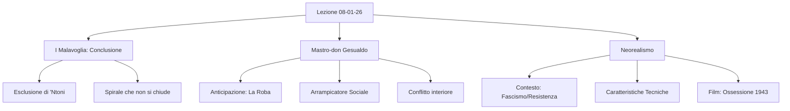

Ecco lo schema di studio completo e dettagliato basato sulla trascrizione della lezione.

```markdown
# Lezione - 08-01-26 - LINGUA E LETTERATURA ITALIANA

## Metadata
- 📅 Data: 08-01-26
- 📚 Materia: LINGUA E LETTERATURA ITALIANA
- ✅ Stato: COMPLETO

## Riassunto
La lezione conclude l'analisi de *I Malavoglia* di Verga, concentrandosi sul finale del romanzo, l'addio di 'Ntoni e la disgregazione parziale del nucleo familiare ("spirale aperta"). Si introduce poi *Mastro-don Gesualdo*, secondo romanzo del *Ciclo dei Vinti*, analizzando la figura del protagonista come "arrampicatore sociale" e anticipato dalla novella *La Roba*. Infine, si apre il modulo sul **Neorealismo**, contestualizzando il movimento tra fascismo e Resistenza, ed esaminando il film precursore *Ossessione* (1943) di Luchino Visconti come rottura con l'estetica del ventennio.

## Parole Chiave
- **Tempo Ciclico vs Lineare**: Contrasto tra la ripetitività rassicurante della tradizione (Padron 'Ntoni) e il progresso/cambiamento irreversibile (giovane 'Ntoni).
- **Ideale dell'Ostrica**: Concetto verghiano secondo cui i poveri sono al sicuro solo se rimangono attaccati al proprio scoglio (famiglia/tradizione); chi si stacca viene divorato dal mondo.
- **Roba**: L'accumulo ossessivo di beni materiali (terre, bestiame) che diventa ragione di vita e alienazione, tipico di Mazzarò e Gesualdo.
- **Grottesco**: Categoria estetica che fonde comico e tragico (es. la morte di Mazzarò).
- **Parvenu**: Termine francese (spesso dispregiativo) per indicare un "arricchito" che non possiede la cultura o la raffinatezza della classe a cui aspira.
- **Determinismo**: Principio naturalista/verista secondo cui l'uomo è determinato da razza, ambiente e momento storico.
- **Neorealismo**: Corrente culturale (cinema/letteratura) nata negli anni '40 che rifiuta la retorica fascista per mostrare l'Italia reale, povera e popolare.
- **Cinema dei Telefoni Bianchi**: Cinema d'evasione e disimpegnato del periodo fascista, contrapposto al cinema impegnato neorealista.

## Argomenti Trattati
- Conclusione de *I Malavoglia*: analisi dell'ultimo capitolo.
- Introduzione a *Mastro-don Gesualdo* e collegamento con *La Roba*.
- Introduzione al Neorealismo: contesto storico e caratteristiche cinematografiche.
- Analisi del film *Ossessione* (1943) di Luchino Visconti.

## Mappa Concettuale



---

## Contenuto Completo

### 1. Conclusione de *I Malavoglia*

L'analisi si concentra sull'ultimo capitolo del romanzo, evidenziando il definitivo distacco del giovane 'Ntoni dal mondo arcaico di Aci Trezza.

> 📌 **Struttura a Spirale:** A differenza della situazione iniziale (famiglia unita come le dita di una mano), il finale presenta una **spirale che non si chiude**. Non c'è un ritorno all'ordine perfetto: la famiglia è disgregata (Padron 'Ntoni morto, Lia prostituta), sebbene Alessi abbia riscattato la Casa del Nespolo.

#### Analisi del Testo (Ultimo Capitolo)
Il brano mostra il ritorno notturno di 'Ntoni, coperto di polvere e mutato nell'aspetto.

**Punti chiave dell'analisi:**
- **Rovesciamento del Topos Epico:** A differenza di Ulisse, riconosciuto dal cane Argo, 'Ntoni **non viene riconosciuto** nemmeno dal cane, che gli abbaia contro.
- **Emarginazione Spaziale:** 'Ntoni si siede in un *"cantuccio"*, simbolo del suo distacco fisico ed emotivo.
- **Incomunicabilità:** Il dialogo è scarso, dominato dal silenzio e dal dolore. La minestra gli va *"tutta in veleno"* (amarezza/rimorso).
- **Consapevolezza e Esclusione:** 'Ntoni ha visto il mondo (il progresso) e non può più integrarsi nel tempo ciclico e immobile del villaggio.
    - *Citazione critica:* Riferimento a **Marco Santagata**: la "nobiltà" dei Malavoglia sta nel desiderare il bene per tutto il gruppo familiare, non solo per sé. 'Ntoni sente di aver tradito questo ideale e l'unione familiare.

**Simbolismi Finali:**
1.  **La Porta/Uscio:** Confine invalicabile tra il "dentro" (il nido, la sicurezza) e il "fuori" (l'ignoto, l'esclusione).
2.  **Il Mare:**
    *   *Mare Assoluto/Universale:* Il destino di 'Ntoni, senza paese, uguale ovunque.
    *   *Mare di Aci Trezza:* Personificato ("amico", "brontola"), specifico del luogo.
3.  **Rocco Spatu:** L'ubriacone del paese è l'ultimo personaggio a comparire. Apre la giornata mentre 'Ntoni se ne va. Rappresenta il **ciclo perpetuo e immobile** di chi resta, contrapposto allo sradicamento di chi parte.

---

### 2. Mastro-don Gesualdo e *La Roba*

Transizione verso il secondo romanzo del *Ciclo dei Vinti* (pubblicato nel 1889).

#### Anticipazione: Novella *La Roba*
- **Protagonist:** Mazzarò.
- **Temi:** Accumulo di beni materiali (terra/bestiame) come unica ragione di vita. Disprezzo per il denaro cartaceo (simbolico) vs amore per la "roba" (tangibile).
- **Finale Grottesco:** Mazzarò, morente, uccide gli animali gridando *"Roba mia, vienitene con me!"*. Unione di tragico (morte) e comico (assurdità del gesto).

#### Il Romanzo: *Mastro-don Gesualdo*
> 📌 **Titolo Ossimorico:**
> - **Mastro:** Indica la provenienza umile, il lavoratore manuale (muratore).
> - **Don:** Appellativo onorifico per i signori/notabili.
> Il titolo racchiude il conflitto d'identità del protagonista.

**Caratteristiche del Personaggio:**
- È un **Self-made man** (eroe del lavoro) ma un **Vinto** sul piano umano.
- **Arrampicatore sociale / Parvenu:** Cerca l'ascesa sposando la nobile decaduta Bianca Trao.
- **Doppia Esclusione:** Disprezzato dai nobili (per le origini umili) e odiato dal popolo (per la ricchezza).
- **Conflitto Interiorizzato:** A differenza dei *Malavoglia* (conflitto Famiglia vs Comunità), qui il dramma è tutto interno a Gesualdo (successo economico vs fallimento affettivo).

**Relazioni Familiari:**
- **Moglie (Bianca Trao):** Lo sposa per interesse, lo disprezza.
- **Figlia (Isabella):** Si vergogna del padre. (Nota: Il terzo romanzo doveva essere *La Duchessa di Leyra*, su di lei).
- **Diodata:** La serva fedele che lo ama davvero, madre dei suoi figli illegittimi non riconosciuti (sacrificata all'ambizione sociale).

---

### 3. Il Neorealismo (Cinema e Letteratura)

Introduzione al movimento culturale sviluppatosi tra gli anni '40 e '50.

> 📌 **Contesto Storico:**
> Il Neorealismo nasce come reazione a:
> 1.  Dittatura Fascista (Ventennio).
> 2.  Seconda Guerra Mondiale.
> 3.  Resistenza e Liberazione (25 aprile 1945).
> *Nota locale:* Liberazione di Ravenna (4 dicembre 1944) e Alfonsine (10 aprile 1945).

**Caratteristiche del Cinema Neorealista:**
- **Rottura col passato:** Rifiuto del cinema dei "Telefoni Bianchi" (borghese, d'evasione) e dei kolossal storici fascisti (retorica imperiale).
- **Tecniche e Scelte:**
    - Attori **non professionisti** (presi dalla strada).
    - Riprese in **esterni** (scenografie reali, no teatri di posa).
    - Paesaggi **orizzontali** (vs verticalità monumentale fascista).
- **Temi e Soggetti:**
    - Protagonismo della **folla/massa** e dei **bambini** (spesso più responsabili degli adulti, es. *Ladri di biciclette*, *Germania anno zero*).
    - Attenzione agli **umili**, agli oppressi, alla povertà.
    - Impegno morale e politico (antifascismo, sinistra/marxismo).
    - Denuncia della realtà: miseria, disoccupazione, macerie.

#### Film Precursore: *Ossessione* (1943)
- **Regista:** Luchino Visconti.
- **Genere:** Noir (tratto da *Il postino suona sempre due volte*), anticipa il Neorealismo.
- **Perché è rivoluzionario?**
    1.  Mostra un'Italia **misera e squallida** (pianura padana fangosa, osterie povere), smentendo la propaganda fascista dell'Italia "florida".
    2.  Attacca la sacralità della **famiglia** (adulterio, omicidio del marito).
    3.  Personaggi: Bragana (caricatura del fascista virile e autoritario), Gino (vagabondo/socialmente instabile).
- **Reazione:** Il film fu bloccato e censurato dal regime (episodio dell'esorcismo alla sala di Salsomaggiore).

---

## 🔗 Collegamenti
- **Prerequisiti:** Verismo, poetica dell'Impersonalità, trama generale de *I Malavoglia*.
- **Anticipazioni:** Approfondimento su *Mastro-don Gesualdo* (intreccio), visione spezzoni *Ladri di biciclette*.
- **Da approfondire:** Differenza tra il determinismo in Verga (Naturalismo) e l'impegno sociale nel Neorealismo.
- **Riferimenti Locali:** Storia della Resistenza nel ravennate (Isola degli Spinaroni, Arrigo Boldrini "Bulow").
```