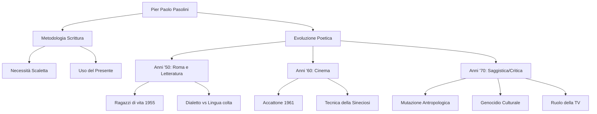

# Lezione - 09-12-25 - LINGUA E LETTERATURA ITALIANA

## Metadata
- 📅 Data: 09-12-25
- 📚 Materia: LINGUA E LETTERATURA ITALIANA
- ✅ Stato: COMPLETO

## Riassunto
La lezione verte sulla correzione della verifica scritta su Pier Paolo Pasolini, evidenziando gravi lacune metodologiche (mancanza di studio dal libro, assenza di scaletta, errori grammaticali). Viene ricostruito il percorso evolutivo dell'autore: dal periodo friulano e l'arrivo a Roma negli anni '50 (scoperta del sottoproletariato), al passaggio al cinema con *Accattone* per un maggiore realismo, fino al pessimismo degli anni '70. Il focus centrale è sul concetto di **mutazione antropologica**, la critica alla società dei consumi e il "genocidio culturale" operato dalla televisione e dall'omologazione borghese.

## Parole Chiave
- **Scaletta**: Struttura logica preliminare fondamentale per organizzare un testo scritto ("intreccio di fili").
- **Sottoproletariato**: Classe sociale marginale delle borgate romane, esclusa dalla storia e dal progresso, caratterizzata (inizialmente) da purezza e vitalità arcaica.
- **Mutazione Antropologica**: Concetto pasoliniano che indica il cambiamento profondo e irreversibile dell'umanità (in particolare dei ceti popolari) causato dal consumismo che omologa valori e comportamenti al modello piccolo-borghese.
- **Sineciosi**: Figura retorica (e tecnica cinematografica in Pasolini) che consiste nell'accostare due elementi opposti (es. sacro e profano) per creare un contrasto stridente e significativo.
- **Genocidio Culturale**: La distruzione delle particolarità locali, dei dialetti e delle tradizioni contadine/popolari operata dalla società di massa.
- **Nuovo Fascismo**: Definizione che Pasolini attribuisce al potere della società dei consumi e della televisione, capace di omologare le coscienze più efficacemente del fascismo storico.
- **Ossimoro Vivente**: Autodefinizione di Pasolini nelle *Ceneri di Gramsci*, che esprime la contraddizione tra l'adesione razionale al marxismo e l'amore viscerale per il mondo sottoproletario pre-industriale.

## Argomenti Trattati
- Metodologia della scrittura e errori comuni
- Biografia e contesto storico di Pier Paolo Pasolini
- La produzione narrativa: *Ragazzi di vita* e il mito del sottoproletariato
- Il Cinema come strumento di realismo e la tecnica della sineciosi
- Il pensiero degli anni '70: Mutazione antropologica e critica alla modernità

## Mappa Concettuale

---

## Contenuto Completo

### 1. Metodologia della Scrittura e Correzione Verifica

Il docente apre la lezione criticando severamente l'approccio allo studio e alla scrittura dimostrato nella verifica.

> 📌 **Definizione chiave (Testo):** Un testo è un "intreccio di fili". Se la struttura non è solida (mancanza di scaletta), il discorso implode o presenta buchi logici.

**Errori metodologici rilevati:**
- **Mancanza di studio:** L'80% degli studenti non ha aperto il libro di testo, basandosi solo su ricordi vaghi della lezione.
- **Assenza di scaletta:** Scrittura "a ruota libera" o "flusso di coscienza" senza contestualizzazione temporale (salti dagli anni '50 ai '70 senza distinzione).
- **Errori lessicali:** Confusione su termini specifici (es. *mutazione morfologica* invece di *antropologica*).
- **Tempi Verbali:** Uso errato dei tempi passati. Nelle analisi letterarie **è preferibile l'uso del presente**.

> ⚠️ **Attenzione:** Non confondere *proletariato* (classe lavoratrice con coscienza di classe) con *sottoproletariato* (emarginati, esclusi, che vivono di espedienti). Sono concetti distinti fondamentali per capire Pasolini.

---

### 2. Pier Paolo Pasolini: Biografia e Contesto

Per analizzare l'opera è necessario un inquadramento biografico e geografico.

**Mini-biografia contestuale:**
- **Nascita:** 1922 a Bologna.
- **Infanzia/Giovinezza:** Estati a Casarsa (Friuli). Legame indissolubile con la madre, Susanna Colussi. Mondo rurale e arcaico (*Poesie a Casarsa*).
- **Svolta (1949-1950):** A seguito dei fatti di Ramuscello (scandalo), fugge con la madre a **Roma**.
- **Impatto con Roma:** Contatto traumatico e affascinante con le **borgate** e il sottoproletariato.

---

### 3. La Fase Narrativa (Anni '50) e il Sottoproletariato

Pasolini esplora le borgate romane, vedendo nei "ragazzi di vita" una purezza primordiale non contaminata dalla borghesia.

**Opere chiave:**
- *Ragazzi di vita* (1955)
- *Una vita violenta* (1959)
- *Le ceneri di Gramsci* (1957) - Raccolta poetica.

**Analisi Stilistica e Contenutistica:**
- **Contenuto:** Vita di espedienti (furti, prostituzione), rifiuto del lavoro ("bestemmia"), vita alla giornata.
- **Forma (Mimesi Linguistica):**
    - Dialoghi: **Romanesco** (appreso grazie ai fratelli Franco e Sergio Citti).
    - Narrazione: Italiano colto, lirico.
- **Esempio dal testo (*Ragazzi di vita*):**
    - L'episodio di **Riccetto** che rischia la vita per salvare una rondinella (o "passerottolo") nel Tevere (simbolo di istinto e compassione naturale).
    - *Evoluzione:* Dopo il carcere (istituzione rieducativa), lo stesso Riccetto lascia affogare un amico.
    - *Significato:* Le istituzioni e la società "omologano" e rendono indifferenti/alienati, spegnendo la vitalità originaria.

> 📌 **La contraddizione (Ceneri di Gramsci):** Pasolini si definisce un **ossimoro vivente**. Razionalmente aderisce al marxismo (riscatto del popolo), ma visceralmente ama la povertà e l'ignoranza del popolo perché ne preservano l'autenticità. Il progresso borghese distruggerebbe questa purezza.

---

### 4. Il Cinema e la Ricerca del Realismo (Anni '60)

Pasolini passa al cinema per un bisogno di rappresentazione ancora più diretta della realtà.

**Opera Chiave:**
- Film: *Accattone* (1961).
- *Nota terminologica:* Un film "esce" al cinema, non si "pubblica".

**Caratteristiche:**
- **Attori non professionisti:** Franco Citti (vero ragazzo di borgata) per garantire autenticità.
- **Figura Retorica: Sineciosi.**
    - *Definizione:* Accostamento di elementi opposti per creare contrasto.
    - *Applicazione nel film:* Pasolini accompagna immagini di vita degradata delle borgate con **musica colta e sacra** (Bach, Vivaldi).
    - *Effetto:* Sacralizzazione della miseria e del sottoproletariato.

---

### 5. Gli Anni '70: La Mutazione Antropologica

È il periodo della disillusione totale. Lo scarto tra il "prima" (mondo contadino/paleoindustriale) e il "dopo" (società dei consumi) diventa incolmabile.

**Concetti Fondamentali:**
- **Boom Economico e Società di Massa:** Portano benessere materiale ma distruzione spirituale.
- **Mutazione Antropologica:** I figli del sottoproletariato si vergognano delle proprie origini e imitano i modelli piccolo-borghesi imposti dai media.
- **Il Ruolo della Televisione:**
    - Definita **"Nuovo Fascismo"**: impone un modello unico e normativo senza usare la violenza fisica, ma manipolando le coscienze.
    - Causa del **Genocidio Culturale**: distruzione dei dialetti, delle tradizioni e delle particolarità regionali.
- **Riferimento Bibliografico:** Articolo *Il mio Accattone in TV dopo il genocidio* (1974).

> ⚠️ **Punto critico (Critica di Sanguineti):** Pasolini è stato accusato di voler mantenere il popolo nell'ignoranza e nella povertà pur di preservarne una purezza idealizzata ("vergognarsi dell'ignoranza è il primo passo per superarla", ma Pasolini nega questo passaggio se porta all'omologazione).

**Attualizzazione:**
La riflessione pasoliniana sull'omologazione è applicabile oggi ai social media, agli influencer e alla perdita di identità linguistica tra i giovani (slang globalizzati).

---

## 🔗 Collegamenti
- **Prerequisiti:** Conoscenza del Neorealismo (da cui Pasolini parte ma si distacca), contesto storico del Boom Economico italiano.
- **Anticipazioni:** Il concetto di "omologazione" si collega alla sociologia moderna e alla critica della globalizzazione.
- **Da approfondire:** L'articolo "Il vuoto del potere" (o l'articolo delle lucciole) per completare la visione politica degli anni '70.
- **Domande aperte:** La visione di Pasolini è conservatrice/reazionaria o profetica? (Dibattito critico con Sanguineti).