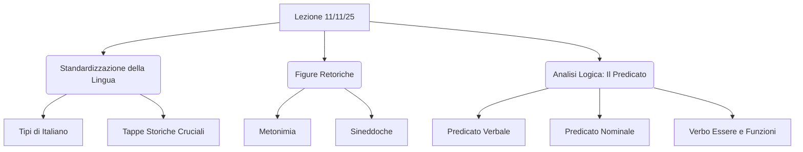

# Lezione - 11-11-25 - Schema da RAW

## Metadata
- 📅 Data lezione: 11-11-25
- 📄 File RAW originale: LINGUA_ITALIANA_11-11-25_RAW
- ✅ Stato: COMPLETO

## Riassunto
La lezione si articola in due parti principali: l'evoluzione storica dell'italiano e l'analisi grammaticale. Inizialmente, si ripercorre il processo di standardizzazione della lingua, evidenziando le tappe cruciali come l'introduzione della stampa, la Questione della lingua risolta da Pietro Bembo, la fondazione della Crusca, l'Unità d'Italia (Manzoni e istruzione) e la diffusione dei mass media. Successivamente, la lezione si sposta sull'analisi delle figure retoriche (Metonimia e Sineddoche) e, in conclusione, sull'analisi logica, focalizzandosi sulla distinzione tra Predicato Verbale, Nominale e Composto, con particolare attenzione alle diverse funzioni del verbo 'Essere'.

## Parole Chiave
- Standardizzazione
- Questione della Lingua
- Pietro Bembo
- Metonimia
- Sineddoche
- Predicato Verbale
- Predicato Nominale
- Verbo Essere
- Diamesica
- Copula

## Argomenti Trattati
- Tipi di Italiano e Variazione Diamesica
- Tappe Storiche della Standardizzazione
- Figure Retoriche di Sostituzione (Metonimia e Sineddoche)
- Analisi Logica: Classificazione del Predicato

## Mappa Concettuale

---

## Contenuto Completo

### Tipi di Italiano e Standardizzazione Storica

Si riprende la classificazione tripartita della lingua italiana (italiano standard, italiano neostandard o dell'uso medio, italiano regionale). Questi tipi riflettono i gradi di variazione diamesica, che è la distanza tra l'italiano scritto/parlato formale e l'italiano parlato colloquiale.

La standardizzazione è il processo attraverso il quale l'italiano si è evoluto e consolidato fino a diventare la lingua nazionale.

> 📌 **Definizione chiave (Diamesica):** Grado di variazione della lingua basato sul mezzo (scritto vs. parlato) e sul registro (formale vs. colloquiale).

#### Tappe Fondamentali per la Standardizzazione

1. **L'Introduzione della Stampa (XV secolo):**
    *   **Date:** 1455 (Sacro Romano Impero); 1465-1466 (Italia).
    *   **Importanza:** Diffusione massiva della circolazione delle idee, del libro e delle parole, contribuendo al processo di standardizzazione linguistica.

2. **La Questione della Lingua (Dibattito tra '400 e '500):**
    *   **Obiettivo:** Individuare la lingua più prestigiosa e degna di essere la lingua letteraria di riferimento.
    *   **Scuole di pensiero iniziali:**
        *   **Scuola Cortigiana:** Esponente principale: Baldassarre Castiglione.
        *   **Scuola Purista:** Sosteneva il fiorentino e si rifaceva ad autori come Petrarca.
    *   **Risoluzione (Pietro Bembo):** Bembo propose di adottare non il fiorentino del '500, ma il **fiorentino del '300**, ritenuto ideale per la sua epoca letteraria.
    *   **Distinzioni di Bembo:**
        *   **Lingua della Poesia:** Fioretino di Petrarca.
        *   **Lingua della Prosa:** Fioretino di Boccaccio.
    *   **Conseguenza:** Per secoli, la lingua scritta si è mantenuta molto diversa dalla parlata, creando l'ampia distanza tra scritto e parlato tipica dell'italiano.

3. **La Fondazione dell'Accademia della Crusca:**
    *   **Scopo:** Studiare, osservare e disciplinare la lingua.
    *   **Opera Fondamentale:** Il *Vocabolario della Crusca* (primo dizionario della lingua italiana), che contribuì massivamente alla standardizzazione stabilendo le parole prestigiose e corrette da utilizzare.
    *   **Luogo:** Fondazione a Firenze, centro culturale e linguistico per eccellenza.

4. **L'Unità d'Italia (XIX secolo):**
    *   **Mezzi di Diffusione:** Istituzione del sistema scolastico e dell'istruzione pubblica.
    *   **Testo Cruciale:** *I Promessi Sposi* di Alessandro Manzoni.
    *   **Proposta Manzoniana:** Rivisitazione della Questione della lingua (ottocentesca). Sostenne l'uso del **fiorentino colto** (parlato dalle classi più abbienti e prestigiose).

5. **La Diffusione dei Mass Media:**
    *   **Impatto:** Radio e, in particolare, la televisione hanno diffuso l'italiano in modo massivo e più standard.
    *   > ⚠️ **Attenzione:** La televisione ha anche incentivato la diffusione dell'italiano regionale attraverso la presenza di alcune figure.

---

### Figure Retoriche di Sostituzione (Metonimia e Sineddoche)

#### 1. La Metonimia

La metonimia è una figura retorica di sostituzione per **contiguità** (vicinanza logica). Si differenzia dalla metafora, che è una sostituzione per analogia.

**Tipologie di Metonimia (Contiguità):**

| Tipo di Contiguità | Esempio (Metonimia) | Significato Reale |
| :--- | :--- | :--- |
| **Autore per l'Opera** | Abbiamo letto Manzoni. | Abbiamo letto l'opera di Manzoni. |
| **Contenente per il Contenuto** | Beviamo un bicchiere/una bottiglia. | Beviamo il contenuto del bicchiere/bottiglia. |
| **Produttore per il Prodotto** | Abbiamo bevuto un Brunello/mangiato un Parmigiano/indossato una Versace. | Abbiamo bevuto un vino prodotto a Brunello/mangiato formaggio prodotto a Parma/indossato un vestito prodotto da Versace. (Frequente nel linguaggio pubblicitario) |
| **Materiale per l'Oggetto** | La porcellana/il bronzo. | Gli oggetti (statue) fatti con quel materiale. |
| **Astratto per il Concreto** | La gioventù/la vecchiaia/la giustizia. | I giovani/i vecchi/i giudici. |
| **Causa per l'Effetto** | I sudori. | Il lavoro, la fatica. |
| **Effetto per la Causa** | I versi di Dante. | La poesia. |
| **Strumento per la Persona** | L'aratro/il violino. | Il contadino/il violinista. |
| **Mezzo per il Fine** | L'inchiostro/il pennello. | Lo studio/l'arte. |
| **Singolo per la Specie** | L'acciaio/il pane. | La spada/il cibo. |

#### 2. La Sineddoche

La sineddoche è una figura retorica di sostituzione per contiguità basata su un rapporto **quantitativo**.

**Rapporti della Sineddoche:**
1. **Parte per il Tutto:** *Le vele* per indicare la nave; *il tetto* per la casa; *i piedi* per il corpo; *i mortali* per l'uomo (specie per genere).
2. **Tutto per la Parte:** *L'Italia* per indicare la squadra nazionale.
3. **Genere per la Specie / Specie per il Genere.**

> ⚠️ **Attenzione:** La sineddoche è considerata una forma particolare di metonimia in cui il rapporto di contiguità è specificamente di tipo quantitativo.

---

### Analisi Logica: La Classificazione del Predicato

Il predicato è l'elemento fondamentale, il cuore della frase, insieme al soggetto.

#### 1. Predicato Verbale (PV)
- **Funzione:** Indica un'azione compiuta o subita dal soggetto (es. *Mario mangia*), oppure un fatto di esistenza o di modo di essere.
- **Forma:** Il verbo da solo (se non è 'essere' e non è ausiliare) o il verbo 'essere' quando indica esistenza o posizione.
- **Esempio:** *Mario è a casa.* ('è' può essere sostituito con 'si trova', quindi è PV).

#### 2. Predicato Nominale (PN)
- **Funzione:** Indica un modo di essere o una qualità del soggetto.
- **Forma:** Verbo *essere* (Copula) + Nome o Aggettivo (Nome del Predicato o Parte Nominale).
- **Componenti:**
    - **Copula:** Il verbo 'essere'.
    - **Nome del Predicato (o Parte Nominale):** Può essere Nome (*studente*), Aggettivo (*bravo*), o Pronome (*lui*).
- **Elementi della Parte Nominale:** Se la parte nominale è un nome, anche gli elementi che lo accompagnano (aggettivi, complementi) fanno parte del PN. Es: *è un bravo studente*.

#### 3. Predicato Composto
- **Forma:** Verbo Ausiliare ('Essere' o 'Avere') + Participio Passato.
- **Funzione:** Costituisce i tempi composti del verbo.
- **Esempio:** *Mario è andato a scuola.* (Tutto 'è andato' è Predicato Composto).

#### La Complessa Funzione del Verbo Essere

Il verbo 'Essere' è il più difficile da analizzare, potendo avere tre funzioni: PV, PN o Ausiliare.

| Funzione di 'Essere' | Test di Riconoscimento | Esempio | Risultato Analisi |
| :--- | :--- | :--- | :--- |
| **Predicato Verbale** | Sostituibile con *stare, trovarsi, esistere, rimanere*? **SÌ** | *Mario è a casa.* | PV ('è') |
| **Predicato Nominale**| Accompagnato da Nome, Aggettivo, o Pronome? **SÌ** | *Mario è stanco.* *La mela è buona.* | PN ('è stanco') |
| **Ausiliare** | Accompagnato da un Participio Passato? **SÌ** | *Mario è andato a scuola.* | Predicato Composto ('è andato') |

> 📌 **Verbi Copulativi:** Verbi con significato simile a 'essere' (es. *diventare, sembrare, chiamarsi*), che fungono da copula e formano un Predicato Nominale (es. *Mario sembra stanco*).

> ⚠️ **Attenzione (PN Implicito):** Il predicato nominale può essere implicito quando il verbo 'essere' è omesso (Es: *Mario bravo studente* = Mario è un bravo studente). Questo non accade con i verbi d'azione.

## 🔗 Note e Collegamenti
- **Richiama concetti da:** Lezione precedente sui tre tipi di italiano e la variazione diamesica.
- **Anticipa:** Prossimo argomento sarà un'analisi più dettagliata dell'Italiano Standard (punto di arrivo del processo storico).
- **Da approfondire:** L'analisi logica dei complementi (stato in luogo, moto a luogo) che completano il significato del predicato.