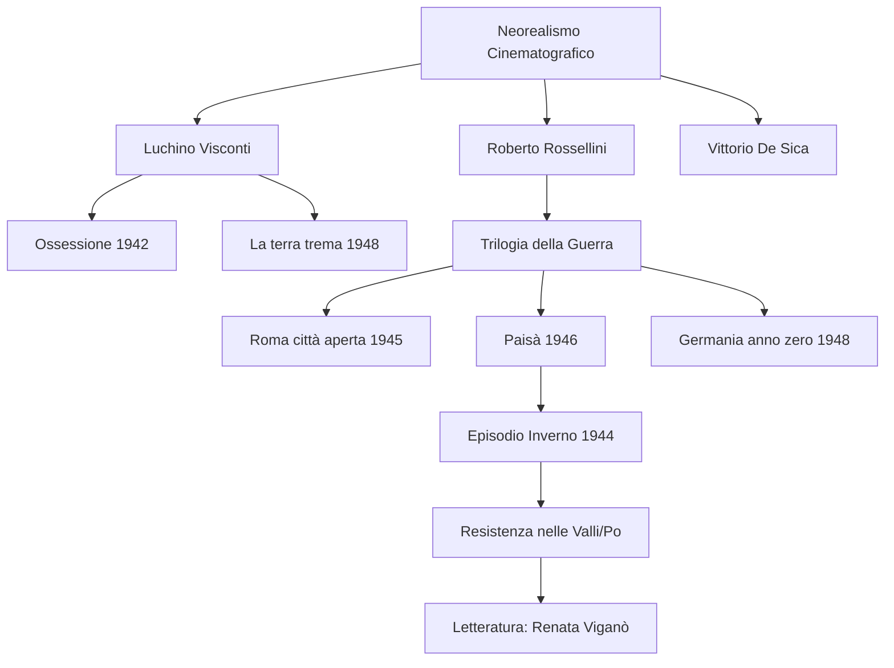

# Lezione - 12-01-26 - LINGUA E LETTERATURA ITALIANA

## Metadata
- 📅 **Data:** 12-01-26
- 📚 **Materia:** LINGUA E LETTERATURA ITALIANA
- ✅ **Stato:** COMPLETO

## Riassunto
La lezione approfondisce il **Neorealismo cinematografico italiano**, focalizzandosi sui suoi massimi esponenti: Visconti, De Sica e, in particolare, Roberto Rossellini. Viene analizzata la "Trilogia della guerra" di Rossellini, con un'analisi dettagliata di *Roma città aperta* e della sua rappresentazione dell'antifascismo trasversale. Un focus specifico è dedicato al film *Paisà*, con l'analisi dell'episodio ambientato nelle valli del Po, che illustra le peculiarità della Resistenza in pianura e funge da ponte verso la letteratura neorealista di Renata Viganò.

## Parole Chiave
- **Neorealismo**: Movimento culturale che mira a rappresentare la realtà quotidiana, la guerra e la povertà senza filtri, spesso usando attori non professionisti e riprese in esterni.
- **Visione documentaristica**: Stile di regia che rimane fedele alla realtà così com'è, documentando eventi storici e sociali con immediatezza (tipico di Rossellini).
- **Trilogia della guerra**: Ciclo di tre film di Rossellini (*Roma città aperta*, *Paisà*, *Germania anno zero*) che raccontano il dramma del conflitto mondiale.
- **Antifascismo trasversale**: Fenomeno politico che ha unito diverse ideologie (comunisti, cattolici, repubblicani) nel CLN contro l'occupazione nazi-fascista.
- **Resistenza in pianura**: Lotta partigiana combattuta in territori piatti (valli, paludi) particolarmente esposti e pericolosi rispetto ai ripari della montagna.

## Argomenti Trattati
- I protagonisti del Neorealismo: Visconti, De Sica, Rossellini.
- Analisi di *Roma città aperta* (1945) e l'iconografia di Anna Magnani.
- Analisi di *Paisà* (1946) e la struttura ad episodi.
- Collegamento tra cinema neorealista e letteratura (*L'Agnese va a morire*).

## Mappa Concettuale

---

## Contenuto Completo

### 1. I Protagonisti del Cinema Neorealista
Il Neorealismo italiano rappresenta un momento di eccellenza mondiale in cui il cinema "fa scuola". La lezione identifica tre registi cardine:
- **Luchino Visconti:** Citato per l'anticipazione del neorealismo con *Ossessione* (1942) e il legame con Verga ne *La terra trema* (1948).
- **Vittorio De Sica:** Menzionato come figura centrale (padre dell'attore Christian De Sica).
- **Roberto Rossellini:** Definito il regista della "visione documentaria".

> 📌 **Definizione chiave:** **Visione documentaria della realtà** significa rimanere quanto più possibile aderenti alla realtà così com'è, eliminando abbellimenti o filtri artificiali nella messa in scena.

---

### 2. Roberto Rossellini e la "Trilogia della guerra"
Rossellini firma tre capolavori che documentano il passaggio dalla guerra alla ricostruzione:

#### A. Roma città aperta (1945)
- **Contesto:** Girato nell'ultimo anno di guerra per le strade di Roma.
- **Cast:** Anna Magnani (Pina) e Aldo Fabrizi (Don Pietro), attori professionisti calati in un contesto reale.
- **Analisi della scena madre:** La morte di Pina che insegue la camionetta dei nazisti.
    - **Forma:** La caduta della Magnani fu casuale (non prevista dal copione), ma Rossellini la tenne per la sua potenza realistica.
    - **Contenuto:** Mostra il coraggio civile contro il regime.
    - **Interpretazione:** Rappresenta l'antifascismo come **fenomeno trasversale**. Il film unisce Francesco (ideologo marxista/comunista) e Don Pietro (sacerdote cattolico) nel medesimo sacrificio.

#### B. Paisà (1946)
- **Struttura:** Film a episodi che risale l'Italia dalla Sicilia al Po.
- **Titolo:** Deriva dall'appellativo "paesano" usato dai soldati.
- **Episodio "Inverno 1944" (Valli di Comacchio):**
    - **Analisi:** Ambientato in un paesaggio piatto e insolito per la Resistenza (solitamente associata a Fenoglio o Pavese e alle montagne).
    - **Caratteristiche:** Mostra partigiani e alleati scarsamente armati e in condizioni di estrema indigenza, esposti al fuoco nazi-fascista in un territorio senza ripari naturali.

#### C. Germania anno zero (1948)
- Terzo capitolo della trilogia (citato cronologicamente).

> ⚠️ **Attenzione:** Molte comparse nei film di Rossellini erano cittadini reali che avevano vissuto i rastrellamenti pochi mesi prima; il set diventava per loro un momento di trauma psicologico reale (re-living).

---

### 3. Connessioni tra Cinema e Letteratura
La lezione introduce il ponte verso lo studio letterario della Resistenza.
- **Autrice chiave:** **Renata Viganò**.
- **Opera:** *L'Agnese va a morire*.
- **Collegamento:** Il regista Giuliano Montaldo, negli anni '70, si ispirerà proprio all'episodio di *Paisà* ambientato nelle valli per trasporre cinematograficamente il romanzo della Viganò.

📖 **Riferimenti Letterari menzionati:**
- Beppe Fenoglio e Cesare Pavese (Resistenza nelle Langhe/Montagna).
- Renata Viganò (Resistenza in pianura/Valli).

---

## 🔗 Collegamenti
- **Prerequisiti:** Definizione generale di Neorealismo e Verismo (connessione Visconti-Verga).
- **Anticipazioni:** Analisi di Vittorio De Sica (prossima lezione) e studio dei romanzi di Renata Viganò, Beppe Fenoglio e Cesare Pavese.
- **Da approfondire:** La figura di Pier Paolo Pasolini (citato in relazione ad Anna Magnani in *Mamma Roma*).
- **Domande aperte:** Come cambia la percezione della Resistenza tra la narrazione immediata (1945) e quella degli anni '70?

---
*Note: Durante la lezione è stata mostrata la scena della morte di Pina in "Roma città aperta" e l'inizio dell'episodio delle Valli in "Paisà".*