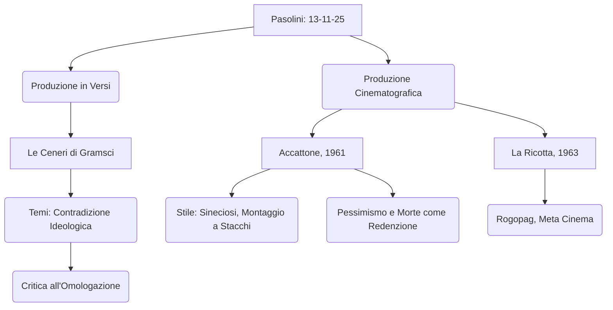

# Lezione - 13-11-25 - Schema da RAW

## Metadata
- 📅 Data lezione: 13-11-25
- 📄 File RAW originale: Trascrizione_Pasolini_13-11-25.txt
- ✅ Stato: COMPLETO

## Riassunto
La lezione si concentra sull'opera di Pier Paolo Pasolini, coprendo la sua produzione poetica e cinematografica. Si analizzano *Le Ceneri di Gramsci*, un'opera in versi del 1950 che esplora la contraddizione ideologica di Pasolini verso il riscatto del proletariato. Successivamente, si esamina il debutto cinematografico con *Accattone* (1961), pellicola neorealista girata nella periferia romana, che utilizza attori non professionisti e la figura retorica della sineciosi per elevare la miseria a solennità sacrale. Infine, si introduce *La Ricotta* (1963), un atto di metacinema che critica l'ipocrisia borghese e la strumentalizzazione della religione, culminando con la morte sacrificale e ironica del protagonista.

## Parole Chiave
- Pasolini
- Le Ceneri di Gramsci
- Ossimoro Vivente
- Riscatto Proletariato
- Accattone
- Sineciosi
- Vilipendio alla Religione
- Metacinema
- Neorealismo
- Omologazione Borghese

## Argomenti Trattati
- La Produzione in Versi: *Le Ceneri di Gramsci*
- Il Cinema Pasoliniano: Esigenza di Realismo
- Analisi di *Accattone* (1961)
- Analisi di *La Ricotta* (1963)

## Mappa Concettuale



---

## Contenuto Completo

### La Produzione in Versi: *Le Ceneri di Gramsci*

L'opera *Le Ceneri di Gramsci* (anni '50) appartiene alla produzione in versi di Pasolini, distinguendosi dalla sua produzione narrativa precedente (*Ragazzi di vita*, *Una vita violenta*). È una raccolta di 11 componimenti definiti dall'autore stesso come *poemetti*, caratterizzati da un tono narrativo.

**Forma e Stile:**
*   **Metro:** Pasolini adotta la **terzina dantesca**, scelta considerata anticonformistica per l'epoca (di sperimentazioni e avanguardie), rappresentando un ritorno al passato con una rielaborazione stilistica.
*   **Andamento:** I poemetti, pur in versi, hanno l'andamento della prosa (poesia di carattere narrativo).
*   **Contenuto:** Componente autobiografica (vita di Pasolini a Roma) e riflessione ideologica.

**Gramsci: L'Intellettuale e il Popolo**
Gramsci, co-fondatore de *L'Unità* (organo storico del Partito Comunista), fu l'intellettuale che più di tutti rifletté sul ruolo dell'intellettuale nel rapporto con la cultura popolare. Egli auspicava un avvicinamento tra alta cultura e gli umili, attraverso un linguaggio comprensibile dal popolo.

**Il Significato del Titolo:**
Il titolo suggerisce che, nella seconda metà degli anni '50 (l'opera è del '56), del progetto di Gramsci non rimangono che le ceneri. Gramsci è sepolto nel Cimitero Acattolico (detto anche cimitero degli inglesi) a Roma, dove Pasolini si reca (esiste una foto iconica della visita alla tomba).

> 📌 **Tesi centrale: Lo Scandalo del Contraddirsi**
> Pasolini, che si definiva un **ossimoro vivente** (abitato da intime contraddizioni), esprime in questi versi la sua profonda ambivalenza ideologica:

```quote
"Lo scandalo del contraddirmi, dell’essere / con te e contro di te. Punto e virgola.
Con te nel cuore, virgola, in luce, virgola, / contro te nelle buie viscere."
```

| Elemento | Riferimento a Gramsci | Significato |
| :--- | :--- | :--- |
| **Con te (nel cuore, in luce)** | Supporto Razionale | Basato sulla **Ragione** (luce). Favorevole al **riscatto del proletariato** (marxista: miglioramento delle condizioni di vita, maggiori diritti, benessere). |
| **Contro te (nelle buie viscere)** | Opposizione Istintuale | Basato sull'**Istinto** (viscere, buio). Opposizione al riscatto che porterebbe all'**omologazione** con il mondo borghese, causando la perdita dei valori popolari (sincerità, purezza, vitalismo). |

#### Il Pianto della Scavatrice
La riflessione si estende all'Italia, registrando il passaggio irreversibile da paese preindustriale a industriale, analizzato attraverso il paesaggio.

*   **Scavatrice:** Braccio meccanico, simboleggia l'urbanizzazione, la **cementificazione** e la cancellazione degli spazi aperti a favore dell'industria.
*   **Figura Retorica:** Personificazione (la scavatrice *piange*).
*   **Verso Chiave:** "Piange ciò che muta, virgola, anche per farsi migliore."
    *   Il mutamento (progresso, costruzione di *palazzi popolari* in periferia al posto di *baracche* per i nullatenenti) porta a un miglioramento delle condizioni abitative, ma al contempo comporta la perdita di un mondo fatto di povertà e **verità**.
    *   Il nuovo isolato e il cortile rappresentano il **rancore** e l'ipocrisia del mondo borghese, dominato dal calcolo e dalla logica del profitto.

---

### Il Cinema Pasoliniano: Esigenza di Realismo

Pasolini inizia la sua carriera cinematografica nel **1961**. Sebbene dichiarasse inizialmente di esserne *digiuno*, aveva lavorato a Roma per l'industria cinematografica come sceneggiatore, attore e autore (contribuendo, ad esempio, a *La dolce vita* di Fellini).

**Contesto Cinematografico:**
Gli anni '50 e '60 furono l'epoca d'oro del cinema italiano (Neorealismo, Fellini), che faceva scuola a livello mondiale (influenzando registi come Scorsese e Spielberg). Pasolini approda al cinema mosso da un'esigenza di **realismo**, considerando l'immagine la forma più autentica e fedele di rappresentazione della realtà.

#### Analisi di *Accattone* (1961)

*Accattone*, la prima pellicola di Pasolini, è girata nella periferia romana.

**Protagonisti e Contenuto:**
*   **Attori:** Non professionisti, si esprimono nel linguaggio dialettale che usavano nella realtà (spesso doppiati, anche dagli stessi protagonisti).
*   **Trama:** Trasposizione dei personaggi e delle ambientazioni dei suoi romanzi. Accattone (borgataro, considera il lavoro una "bestia") vive di espedienti, sfruttando una prostituta. Il suo tentativo di vita onesta per amore di Stella fallisce, e muore in modo drammatico durante un piccolo furto in fuga dalla polizia.

**Censura:**
*Accattone* fu il **primo film italiano vietato ai minori di 18 anni**. Il divieto era dovuto alla rappresentazione non retorica e senza abbellimenti della vita degli *ultimi* (gli innocenti e i crudeli), simile alle accuse di oscenità e pornografia rivolte ai suoi romanzi.

**Elementi Stilistici (Linguaggio Cinematografico):**
| Aspetto | Caratteristiche | Significato |
| :--- | :--- | :--- |
| **Montaggio** | A stacchi, a blocchi, brutale, netto. | Evidenzia il linguaggio cinematografico (immagini giustapposte) e la realtà nuda. |
| **Luce/Fotografia** | Luce bruciante (afa), violento contrasto (luci e ombre), nitida e spoglia. | Aggiunge drammaticità e autenticità. I volti sono "pasoliniani" (autentici, imperfetti). |
| **Recitazione/Gergo** | Brutale, naturalistica, mimetica. | Imitazione fedele della realtà. |
| **Ieraticità (Arte)** | Inquadrature solenni come pale d'altare medievali/rinascimentali (Cimabue, Giotto). | Trasferisce un assetto sacrale a figure di diseredati. Pasolini era studioso di storia dell'arte (Roberto Longhi). |
| **Colonna Sonora** | Musica classica (Bach, Vivaldi). | Contrasto con le immagini di miseria e criminalità. |

> 📌 **Figura Retorica: Sineciosi**
> L'accostamento di elementi "bassi" (immagini di povertà) ad elementi "alti" (musica colta) genera una nuova forma comunicativa.

**Analisi delle Scene (La Morte):**
*   I borgatari esprimono la pienezza vitale sfidando la morte (scommettere sul tuffo nel Tevere dopo aver mangiato, ridendo e scherzando sul funerale). L'ingordigia rappresenta la "fame di vita".
*   Il corpo seminudo di Accattone sul ponte, con le braccia allargate prima del tuffo, richiama l'immagine sacra di Gesù Cristo in croce.
*   **Le ultime parole di Accattone:** "Mo sto bene" (Adesso sto bene).
*   **Interpretazione del Finale:** La morte rappresenta una forma di **redenzione** o felicità che non può essere trovata nella vita. Non c'è alcuna possibilità di riscatto o salvezza in un mondo senza risorse.
*   **Gesto Simbolico:** L'amico fa il **segno della croce al contrario** di fronte al morente, a sottolineare che si tratta di un mondo **senza Dio** e senza consolazione provvidenziale.

📖 **Riferimenti:** Franco Citti (attore protagonista) e suo fratello Sergio Citti funsero da maestri di *romanesco* per Pasolini.

### Analisi di *La Ricotta* (1963)

*La Ricotta* è un episodio del film collettivo **Rogopag** (acronimo per Rossellini, Godard, Pasolini, Gregoretti), realizzato nel **1963**.

**Contenuto e Temi:**
*   **Genere:** Meta cinema (un film sulla produzione di un altro film).
*   **Trama:** Stracci (il cui nome significa *stracci*, scarti), un uomo del popolo che lavora come comparsa nel ruolo del ladrone nella crocifissione di Cristo, è tormentato dalla fame.
*   **Il Regista:** Il regista del film nel film è una figura militaresca e ossessionata dalla forma, che critica la borghesia italiana e l'analfabetismo.
    *   **Domande al Regista (Intervista):**
        1.  *Cosa vuole esprimere?* "Il mio intimo, profondo, arcaico cattolicesimo."
        2.  *Società Italiana?* "Il popolo più analfabeta, la borghesia più ignorante d'Europa."
        3.  *Morte?* "Come marxista è un fatto che non prendo in considerazione."
        4.  *Fellini?* "Egli danza."
    *   **Critica all'uomo medio:** Il regista definisce l'intervistatore *uomo medio*: "un mostro, un pericoloso delinquente, conformista. Colonialista, razzista, schiavista, qualunquista."
*   **La Morte di Stracci:** Stracci, dopo aver rimediato il *cestino* (il pasto giornaliero della troupe), muore sulla croce per indigestione (dopo aver mangiato voracemente la ricotta).
*   **Conclusione del Regista:** "È morto. Povero Stracci. Crepaci. Non aveva altro modo per ricordarci che anche lui era vivo."

**Censura:**
Il film fu censurato e tolto dai cinema per **vilipendio alla religione cattolica** (oltraggio/offesa), tanto che ne rimasero pochissime copie.

> 📝 **Dichiarazione di Pasolini (Introduzione al film):**
> Pasolini dichiara che la storia della passione che *La Ricotta* rievoca è per lui "la più grande che sia mai accaduta e i testi che la raccontano, i più sublimi che siano mai stati scritti."

**Il Poeta (Alter Ego di Pasolini):**
Compare un poeta che recita versi in cui si identifica con la tradizione e critica il mondo moderno: "Io sono una forza del passato, solo nella tradizione è il mio amore... mi aggiro più moderno di ogni moderno, a cercare fratelli che non sono più."

---

## 🔗 Note e Collegamenti
- **Richiama concetti da:** Le precedenti analisi narrative di Pasolini (*Ragazzi di vita*, *Una vita violenta*), in particolare il tema dei valori popolari contro l'ipocrisia borghese.
- **Da approfondire:** L'influenza del Neorealismo e della storia dell'arte (Caravaggio, Giotto, Longhi) sullo stile delle inquadrature pasoliniane.
- **Riferimenti culturali menzionati:** Antonio Gramsci, *L'Unità*, Federico Fellini (*La dolce vita*), Roberto Longhi, registi come Scorsese e Spielberg.