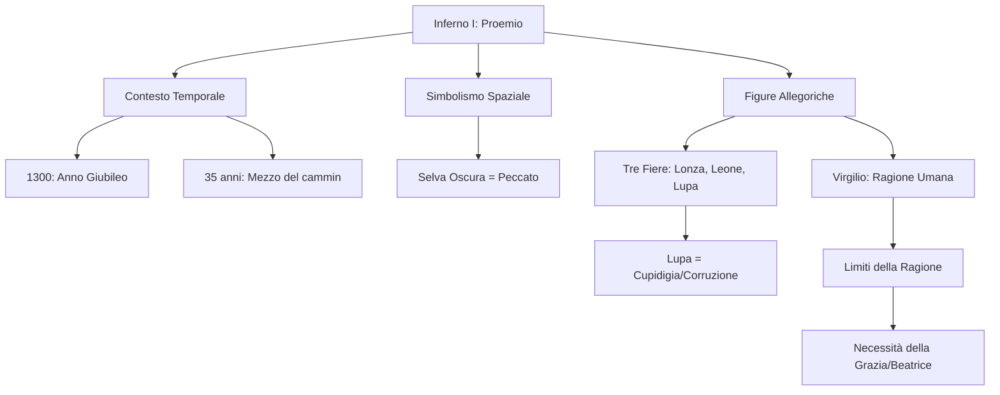

# Lezione - 15-01-26 - LINGUA E LETTERATURA ITALIANA

## Metadata
- 📅 **Data:** 15-01-26
- 📚 **Materia:** LINGUA E LETTERATURA ITALIANA
- ✅ **Stato:** COMPLETO

## Riassunto
La lezione approfondisce il primo canto dell'Inferno, che funge da proemio all'intera *Divina Commedia*, analizzandone la dimensione simbolica e allegorica. Dante descrive il suo smarrimento nella "selva oscura" nel 1300, anno del primo Giubileo, all'età di 35 anni ("nel mezzo del cammin"). Vengono esaminate le tre fiere, con particolare enfasi sulla lupa come simbolo della cupidigia, e l'incontro salvifico con Virgilio. Quest'ultimo, incarnazione della Ragione umana e dell'autorità imperiale, viene scelto come guida per i primi due regni, sottolineando però il limite della ragione rispetto alla Grazia divina.

## Parole Chiave
- **Selva Oscura**: Allegoria del peccato e dello smarrimento morale, politico e intellettuale.
- **Proemio**: Canto introduttivo che presenta i temi e le motivazioni dell'intera opera.
- **Cupidigia**: Desiderio insaziabile di beni e potere, considerata da Dante la radice della corruzione medievale.
- **Auctoritas**: Il prestigio e l'autorevolezza riconosciuta agli autori classici, in questo caso incarnata da Virgilio.
- **Allegoria**: Procedimento retorico per cui un concetto astratto viene espresso attraverso un'immagine concreta (es. le fiere per i vizi).
- **Grazia**: Intervento divino necessario per la salvezza, che la sola ragione umana non può raggiungere.

## Argomenti Trattati
- La collocazione temporale e il significato del Proemio.
- L'allegoria della Selva e le Tre Fiere.
- La figura di Virgilio: la Ragione e i suoi limiti.

## Mappa Concettuale

---

## Contenuto Completo

### 1. Il Proemio e il Contesto Temporale
Il primo canto dell'Inferno non è solo l'inizio della prima cantica, ma funge da **proemio all'intero poema**. Dante definisce immediatamente le coordinate spazio-temporali e spirituali del suo viaggio.

> 📌 **Definizione chiave:** **"Nel mezzo del cammin di nostra vita"** indica il raggiungimento dei 35 anni d'età. Secondo la concezione medievale, la vita umana è un arco il cui culmine è fissato a 35 anni.

**Punti chiave:**
- **Datazione:** Il viaggio è ambientato nel **1300**, anno del primo Giubileo indetto da Bonifacio VIII. È un momento di forte carica spirituale ma anche di profonda crisi politica.
- **Universalità:** L'uso del possessivo "nostra" (vita) indica che il viaggio di Dante non è solo personale, ma rappresenta il percorso di redenzione di tutta l'umanità.

### 2. La Selva e le Tre Fiere
L'azione inizia con Dante che si ritrova in una "selva oscura". Questo luogo non è solo fisico, ma rappresenta una condizione interiore e collettiva.

**Analisi del Contenuto:**
- **La Selva:** Rappresenta lo smarrimento morale, il peccato e la crisi politica del tempo.
- **Le Tre Fiere:** Dante incontra tre animali che gli sbarrano la strada verso il colle della salvezza:
    1.  **Lonza:** Rappresenta la lussuria.
    2.  **Leone:** Rappresenta la superbia.
    3.  **Lupa:** Rappresenta la **cupidigia** (avidità).

> ⚠️ **Attenzione:** La lupa è considerata la fiera più pericolosa. Dante la descrive come magra e affamata, simbolo di un desiderio che non si placa mai ("più mangia e più ha fame"). Per l'autore, la cupidigia è la causa principale della corruzione della Chiesa e della crisi dei poteri universali.

📖 **Citazione testuale:** 
> *"Ed ha natura sì malvagia e ria, / che mai non empie la bramosa voglia, / e dopo 'l pasto ha più fame che pria."* (Inf. I)

### 3. La figura di Virgilio
In soccorso di Dante interviene l'ombra di Virgilio, il grande poeta latino autore dell'Eneide.

**Analisi della Forma e Interpretazione:**
- **Il Ruolo:** Virgilio è definito *"lo mio maestro e 'l mio autore"*. Egli rappresenta la **Ragione umana** e l'**Impero** (fu il poeta di Augusto).
- **L'Auctoritas:** Viene scelto come guida perché rappresenta la perfezione stilistica e la massima saggezza raggiungibile dall'uomo senza la rivelazione cristiana.
- **Il Limite:** Virgilio può condurre Dante attraverso l'Inferno e il Purgatorio, ma non oltre. La sola ragione non è sufficiente per accedere alla visione di Dio.

> 📌 **Definizione chiave:** **Ragione vs Grazia.** Virgilio (Ragione) può mostrare le conseguenze del peccato, ma solo Beatrice (Grazia/Fede) può condurre alla salvezza eterna.

---

## 🔗 Collegamenti
- **Prerequisiti:** Concetto di allegoria medievale; situazione politica di Firenze tra Guelfi Bianchi e Neri.
- **Anticipazioni:** La figura di Beatrice che apparirà nel Purgatorio (Canto XXX); il tema della corruzione ecclesiastica ripreso nel corso di tutta l'opera.
- **Da approfondire:** La profezia del "Veltro" (accennata nel Canto I come colui che sconfiggerà la lupa).
- **Domande aperte:** Perché Dante sceglie proprio un autore pagano come guida morale nel Medioevo cristiano? (Risposta: Per il valore civile e imperiale di Virgilio).