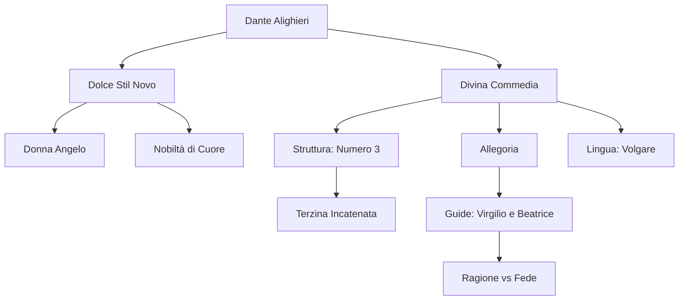

# Lezione - 16-01-26 - LINGUA E LETTERATURA ITALIANA

## Metadata
- 📅 Data: 16-01-26
- 📚 Materia: LINGUA E LETTERATURA ITALIANA
- ✅ Stato: COMPLETO

## Riassunto
La lezione delinea la figura di **Dante Alighieri** come "padre della lingua italiana", analizzando il passaggio dal **Dolce Stil Novo** alla stesura della **Divina Commedia**. Viene approfondita la struttura metrica della **terzina incatenata**, strettamente legata alla simbologia cristiana del numero tre, e il sistema delle **allegorie** (selva, fiere, guide). Infine, si esamina la distinzione tra ragione umana (Virgilio) e fede (Beatrice) nel percorso di purificazione dell'anima attraverso i tre regni ultraterreni.

## Parole Chiave
- **Dolce Stil Novo**: Movimento poetico del XIII secolo che celebra la nobiltà d'animo e la "donna angelo".
- **Donna Angelo**: Concetto stilnovista della donna come intermediaria spirituale tra l'uomo e Dio.
- **Allegoria**: Figura retorica che esprime un concetto astratto attraverso un'immagine concreta (fondamentale per la lettura della Commedia).
- **Terzina Incatenata**: Schema metrico dantesco (ABA BCB CDC) che garantisce continuità narrativa.
- **Volgare**: Lingua parlata dal popolo, scelta da Dante per la sua opera per la sua flessibilità e universalità.
- **Anagogico**: Uno dei quattro livelli di lettura del testo, riferito al significato spirituale che conduce alle verità eterne.

## Argomenti Trattati
- Il Dolce Stil Novo e la "Donna Angelo"
- Struttura e Genesi della Divina Commedia
- Il sistema allegorico e la simbologia numerica
- Le guide: Virgilio e Beatrice

## Mappa Concettuale

---

## Contenuto Completo

### 1. Il Contesto: Dal Dolce Stil Novo all'Esilio
Dante Alighieri si forma nel clima culturale del **Dolce Stil Novo**, movimento nato a Bologna e fiorito a Firenze. La sua produzione è profondamente segnata dal trauma dell'**esilio (1302)**, causato dai conflitti politici tra Guelfi Bianchi (fazione di Dante) e Guelfi Neri.

> 📌 **Definizione chiave:** **Donna Angelo.** Figura femminile che funge da tramite necessario tra l'uomo e la salvezza divina, purificando l'animo dell'amante.

**Analisi del movimento:**
- **Contesto:** Superamento della lirica cortese siciliana e toscana.
- **Contenuto:** Identità tra "cuore gentile" (nobiltà d'animo per merito, non per nascita) e amore.
- **Forma:** Stile "dolce", ovvero un linguaggio piano, armonioso e privo di asperità fonetiche.

📖 **Riferimenti:**
- *Guido Guinizzelli*: "Al cor gentil rempaira sempre amore" (Manifesto del movimento).
- *Dante Alighieri*: "Tanto gentile e tanto onesta pare" (Il verbo "pare" indica l'apparire nella sua evidenza miracolosa).

### 2. La Divina Commedia: Struttura e Simbologia
Inizialmente intitolata solo *Commedia* (l'aggettivo "Divina" fu aggiunto da **Giovanni Boccaccio** nel *Trattatello in laude di Dante*), l'opera rappresenta una sintesi universale del sapere medievale.

**La simbologia numerica (Il numero 3):**
Tutta l'architettura teologica dell'opera riflette la **Trinità**:
- **3 Cantiche**: Inferno, Purgatorio, Paradiso.
- **33 Canti** per cantica (+1 proemio iniziale = 100 canti).
- **Terzina incatenata (ABA BCB CDC)**: Struttura che permette un movimento narrativo continuo, dove ogni rima centrale prepara la successiva.

> ⚠️ **Attenzione:** All'esame potrebbero chiedere perché si chiama "Commedia". I motivi sono due: 1) La trama ha un inizio tragico e una fine lieta. 2) Lo stile è "umile" (volgare), permettendo di trattare sia temi bassi/scurrili che sublimi.

### 3. Analisi Allegorica e Livelli di Lettura
La *Commedia* non è solo il resoconto di un viaggio, ma un'**architettura teologica** che richiede una lettura a più livelli: letterale, allegorico, morale e anagogico.

**Le Figure Retoriche Chiave:**
- **Allegoria della Selva**: Rappresenta il peccato e lo smarrimento spirituale ("Nel mezzo del cammin di nostra vita / mi ritrovai per una selva oscura").
- **Le tre fiere**: 
    1. **Lonza**: Lussuria.
    2. **Leone**: Superbia.
    3. **Lupa**: Avarizia (la più pericolosa per Dante).

**Le Guide:**
- **Virgilio**: Rappresenta la **Ragione Umana**. Autore dell'Eneide (modello supremo per Dante). Può guidare attraverso l'Inferno e il Purgatorio ma non nel Paradiso perché pagano (risiede nel Limbo).
- **Beatrice**: Rappresenta la **Fede/Grazia**. È la donna-angelo che conduce alla visione di Dio.

> 📌 **Definizione chiave:** **Senso Anagogico.** Il livello di lettura che conduce l'anima verso la comprensione delle realtà eterne e della salvezza divina.

---

## 🔗 Collegamenti
- **Prerequisiti:** Struttura della lirica cortese (Scuola Siciliana) e Guittone d'Arezzo.
- **Anticipazioni:** Il *Canzoniere* di Petrarca (focalizzazione sull'interiorità dell'io) e il realismo di Boccaccio.
- **Da approfondire:** La differenza tra la visione dell'amore in Guido Cavalcanti (distruttiva) e in Dante (salvifica).
- **Domande aperte:** Come si concilia lo stile "umile" del volgare con la materia dottrinale altissima del Paradiso?