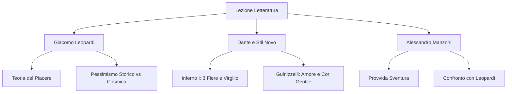

# Lezione - 17-11-25 - LINGUA E LETTERATURA ITALIANA

## Metadata
- 📅 **Data:** 17-11-25
- 📚 **Materia:** LINGUA E LETTERATURA ITALIANA
- ✅ **Stato:** COMPLETO

## Riassunto
La lezione offre una panoramica trasversale sui "giganti" della letteratura italiana, analizzando le fasi filosofiche di **Giacomo Leopardi** (dalla Teoria del piacere al Pessimismo Cosmico) e il concetto di "Provvida Sventura" in **Alessandro Manzoni**. Viene inoltre approfondito il Medioevo con l'analisi allegorica del **Canto I dell'Inferno** di Dante e la genesi del **Dolce Stil Novo**, focalizzandosi sulla rivoluzione della figura femminile (donna-angelo) e sul concetto di nobiltà d'animo introdotto da Guinizzelli.

## Parole Chiave
- **Teoria del Piacere**: Concezione leopardiana secondo cui l'uomo desidera un piacere infinito per durata ed estensione, scontrandosi con una realtà finita.
- **Pessimismo Cosmico**: Fase del pensiero di Leopardi (post 1824) in cui la Natura è vista come meccanismo indifferente e matrigna, causa strutturale dell'infelicità.
- **Provvida Sventura**: Concetto manzoniano secondo cui il dolore e le sventure sono permessi da Dio come strumento pedagogico per la salvezza dell'anima.
- **Selva Oscura**: Allegoria dantesca rappresentante lo stato di peccato e smarrimento spirituale antecedente la redenzione.
- **Dolce Stil Novo**: Movimento poetico del secondo Duecento (Bologna/Firenze) che identifica l'amore con la nobiltà d'animo ("cor gentile") e spiritualizza la donna.
- **Donna-Angelo**: Figura femminile stilnovista che funge da mediatrice tra l'uomo e Dio, la cui bellezza è riflesso divino e porta salvezza.
- **Allegoria**: Figura retorica in cui un concetto astratto viene espresso attraverso un'immagine concreta (es. le tre fiere in Dante).

## Argomenti Trattati
- **Giacomo Leopardi**: Il sistema filosofico, la Teoria del Piacere e l'evoluzione del Pessimismo.
- **Dante Alighieri**: Analisi del Canto I dell'Inferno (simbologia e allegoria).
- **Il Dolce Stil Novo**: Origini, manifesto poetico e innovazioni tematiche.
- **Alessandro Manzoni**: La visione della storia e la funzione salvifica del dolore.

## Mappa Concettuale

---

## Contenuto Completo

### 1. Giacomo Leopardi: Il Pensiero Filosofico

**Contesto:** Leopardi non va ridotto alla figura del poeta "depresso"; è un gigante filosofico. Il suo pensiero, sebbene non sistematico (non ha scritto trattati organici), è racchiuso nello *Zibaldone*, il suo diario intellettuale.

#### A. La Teoria del Piacere
> 📌 **Definizione chiave:** L'uomo possiede per natura un desiderio di piacere **infinito** (illimitato per estensione e durata). La realtà offre solo piaceri **finiti**. Da questa sproporzione nasce l'infelicità umana.

*   **Natura biologica:** Questa insoddisfazione è un meccanismo materiale, non spirituale (Leopardi è sensista/materialista).
*   **Ruolo dell'Immaginazione:** È l'unico rimedio (temporaneo). Permette di concepire ciò che è "vago e indefinito", illudendo l'uomo di toccare l'infinito.
    *   *Esempio:* Ne *L'Infinito*, la siepe ostacola la vista reale e attiva l'immaginazione.
*   **Vago vs Indefinito:**
    *   *Vago:* Impreciso.
    *   *Indefinito:* Senza confini (ciò che permette la poesia).

#### B. Evoluzione del Pessimismo
Il pensiero leopardiano attraversa due fasi cruciali (spesso oggetto d'esame):

1.  **Pessimismo Storico (Fase Iniziale):**
    *   **Causa dell'infelicità:** L'uomo stesso e il progresso della civiltà (la Ragione).
    *   **Visione della Natura:** **Madre benigna**. Ha dato all'uomo le illusioni e l'immaginazione per velare la triste verità.
    *   **Antichi vs Moderni:** I Greci/Romani erano felici ed eroici perché vicini alla natura e alle illusioni. I Moderni sono infelici e vili perché la Ragione ha svelato la verità.
2.  **Pessimismo Cosmico (Svolta del 1824):**
    *   **Causa dell'infelicità:** Condizione strutturale dell'esistenza (ontologica). Tutto l'universo soffre.
    *   **Visione della Natura:** **Matrigna**. Meccanismo cieco e indifferente alla sorte delle creature (*Dialogo della Natura e di un Islandese*).
    *   **Ruolo della Ragione:** Diventa positiva. È l'unico strumento per guardare in faccia la realtà con dignità ("Social Catena").

> ⚠️ **Attenzione:** Non confondere il concetto di Natura nelle due fasi. Prima è protettiva (madre), poi è carnefice/indifferente (matrigna).

---

### 2. Dante Alighieri: Inferno, Canto I

**Contesto:** Proemio dell'intera *Commedia*. Dante si trova nella "selva oscura".

#### A. Analisi Allegorica
*   **Selva Oscura:** Allegoria del **peccato** e dello smarrimento spirituale. Non è un luogo fisico ma una condizione dell'anima (confusione tra bene e male).
*   **Virgilio:** Rappresenta la **Ragione Umana**.
    *   Funzione: Guida attraverso Inferno e Purgatorio (riconoscimento degli errori).
    *   Limite: Non può portare in Paradiso (serve la Teologia/Beatrice).

#### B. Le Tre Fiere (Ostacoli alla conversione)
Le fiere rappresentano le disposizioni peccaminose che impediscono l'uscita dalla selva:
1.  **Lonza:** Lussuria.
2.  **Leone:** Superbia.
3.  **Lupa:** Avarizia (Cupidigia).

> 📌 **Focus sulla Lupa:** È la bestia più pericolosa. Dante la definisce "magra" perché la fame di beni materiali non si placa mai (brama infinita).
> *   *Interpretazione Politica:* Simboleggia anche la corruzione della Curia romana e la cupidigia politica del tempo.

---

### 3. Il Dolce Stil Novo

**Contesto:** Seconda metà del Duecento. Nasce a Bologna, si sviluppa a Firenze. Non è una scuola con statuto, ma una "tendenza" poetica condivisa.

#### A. I Protagonisti
*   **Precursore:** Guido Guinizzelli (Bolognese).
*   **Esponenti:** Guido Cavalcanti, Lapo Gianni, Dante Alighieri (giovane).
*   **Origine del nome:** Coniato da Dante nel *Purgatorio* (Canto XXIV), parlando con Bonagiunta Orbicciani.
    *   *Dolce:* Stile limpido, musicale, privo di suoni aspri (contrapposto a Guittone d'Arezzo).
    *   *Nuovo:* Nuova concezione della donna e dell'amore.

#### B. Concetti Fondamentali
1.  **Identità Amore-Cuore Gentile:**
    *   Manifesto: *Al cor gentil rempaira sempre amore* (Guinizzelli).
    *   Concetto: Amore e nobiltà d'animo sono inscindibili.
    *   *Similitudine naturalistica:* Come il calore non si separa dal fuoco.
2.  **Nuova Nobiltà:**
    *   Polemica anti-feudale: La nobiltà non è di sangue (ereditaria), ma spirituale (virtù personale).
3.  **Donna-Angelo:**
    *   Differenza dall'Amor Cortese: La donna non è solo *domina* (padrona), ma mediatrice tra uomo e Dio.
    *   Effetto: Il suo saluto dona beatitudine e salvezza spirituale (*Tanto gentile e tanto onesta pare*).

> ⚠️ **Attenzione all'esame:** Saper distinguere tra la donna provenzale (amore spesso sensuale/terreno) e la donna stilnovista (esperienza di elevazione mistica).

---

### 4. Alessandro Manzoni: La Provvida Sventura

**Contesto:** Visione teologica e storica all'interno de *I Promessi Sposi*, dell'*Adelchi* e del *Cinque Maggio*.

#### A. Definizione e Funzione
> 📌 **Definizione chiave:** La **Provvida Sventura** è la sofferenza che, sebbene appaia ingiusta, è permessa da Dio come strumento di salvezza ed elevazione spirituale.

*   Il dolore non è fine a se stesso ma ha una funzione **pedagogica**.
*   Il male storico viene volto in bene superiore (ultraterreno) dalla Provvidenza.

#### B. Esempi Letterari
*   **Ermengarda (*Adelchi*):** Muore di dolore per l'abbandono amoroso. Questa sventura la sposta dalla schiera degli "oppressori" (i Longobardi) a quella degli "oppressi", garantendole la santificazione.
*   **Napoleone (*Il Cinque Maggio*):** L'esilio e l'immobilità forzata a Sant'Elena sono il momento in cui scende la Grazia divina ("Provvida Sventura" anche per i potenti).

#### C. Confronto Manzoni vs Leopardi
*   **Leopardi:** Dolore = senza senso, Natura matrigna, nessuna speranza oltre la morte.
*   **Manzoni:** Dolore = ha un senso trascendente (fiducia in Dio), "sugo della storia".

---

## 🔗 Collegamenti
- **Prerequisiti:** Concetti di Amor Cortese e Scuola Siciliana (per capire lo scarto dello Stil Novo); Illuminismo e Sensismo (base filosofica di Leopardi).
- **Anticipazioni:** Il concetto di "vago e indefinito" tornerà fondamentale nel Decadentismo (Pascoli/D'Annunzio).
- **Da approfondire:** Leggere *Al cor gentil* di Guinizzelli (cercare le metafore naturali) e ripassare la vita di Guinizzelli.
- **Domande aperte:** Analogie precise tra Leopardi e Schopenhauer (Volontà di vivere vs Desiderio di piacere).