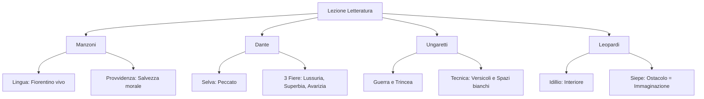

Ecco lo schema di studio completo basato sulla trascrizione fornita, che appare come una lezione di ripasso/antologica su quattro autori fondamentali (Manzoni, Dante, Ungaretti, Leopardi).

```markdown
# Lezione - 18-11-25 - LINGUA E LETTERATURA ITALIANA

## Metadata
- 📅 Data: 18-11-25
- 📚 Materia: LINGUA E LETTERATURA ITALIANA
- ✅ Stato: COMPLETO

## Riassunto
La lezione ha affrontato quattro pilastri della letteratura italiana. Si è analizzata la **questione della lingua** e la **Provvidenza** in Manzoni (*I Promessi Sposi*), definendo il passaggio al fiorentino colto e il concetto di "provvida sventura". Si è esaminato il proemio della *Divina Commedia* di Dante, focalizzandosi sul valore allegorico della selva e delle tre fiere. È stato introdotto Ungaretti nel contesto della Grande Guerra, evidenziando la rivoluzione metrica e il vitalismo disperato dell'*Allegria*. Infine, si è discusso l'*Infinito* di Leopardi, spiegando la funzione della siepe come attivatore dell'immaginazione e il concetto di "idillio" come avventura interiore.

## Parole Chiave
- **Fiorentino Colto**: Modello linguistico adottato da Manzoni (lingua viva parlata dalle persone istruite di Firenze) per rendere il romanzo nazionale.
- **Provvida Sventura**: Concetto manzoniano secondo cui la sofferenza e i guai, permessi da Dio, sono strumenti di maturazione e salvezza spirituale.
- **Allegoria**: Figura retorica fondamentale in Dante, dove un elemento concreto (es. selva) rappresenta un concetto astratto (es. peccato).
- **Versicoli**: Versi brevissimi, talvolta di una sola parola, usati da Ungaretti per isolare il significato e dare peso al silenzio.
- **Idillio (Leopardiano)**: Non descrizione serena della natura, ma rappresentazione soggettiva di un'avventura storica dell'animo del poeta.
- **Ermetismo**: Corrente poetica che ricerca la parola "pura" ed essenziale, spesso oscura; Ungaretti ne è precursore.
- **Immaginazione**: Facoltà mentale che, per Leopardi, costruisce una realtà alternativa e infinita quando la vista del reale è ostacolata.

## Argomenti Trattati
- Alessandro Manzoni: La lingua e la Provvidenza ne *I Promessi Sposi*.
- Dante Alighieri: Canto I dell'*Inferno* (Allegoria e Fiere).
- Giuseppe Ungaretti: La poetica della parola e la guerra (*L'Allegria*).
- Giacomo Leopardi: Analisi de *L'Infinito* e teoria della visione.

## Mappa Concettuale



---

## Contenuto Completo

### 1. Alessandro Manzoni: Lingua e Provvidenza

**Contesto e Lingua**
Manzoni ricerca una lingua unitaria per un romanzo che sia popolare e nazionale, accessibile non solo ai letterati.
- **Evoluzione:**
  1. *Fermo e Lucia*: Lingua ibrida (toscano, francesismi, lombardismi) -> Fallimentare.
  2. *I Promessi Sposi* (Definitiva): "Risciacquatura dei panni in Arno". Adozione del **fiorentino parlato dalle persone colte**.
- **Esempio pratico:** Sostituzione dell'arcaico "io aveva" con il moderno "io avevo".

**La Triade Manzoniana**
Base della poetica:
1. L'utile per iscopo
2. Il vero per soggetto
3. L'interessante per mezzo

> ⚠️ **Attenzione:** La **Provvidenza** non è un *deus ex machina* (soluzione magica). Non garantisce il lieto fine materiale, ma opera attraverso le scelte umane per la salvezza spirituale ("Provvida sventura").

**Esempi e Personaggi**
- **Fra Cristoforo:** Muore di peste (male fisico) ma raggiunge la pienezza della carità (salvezza spirituale).
- **Il "Sugo della storia":** I guai arrivano anche senza colpa; la fiducia in Dio li rende utili per una vita migliore. Termine culinario ("sugo") usato per abbassare il tono.
- **Oppressori:**
  - *Don Rodrigo*: Statico, muore disperato.
  - *Innominato*: Dinamico, si converte (dimostrazione della Grazia).

📖 **Riferimenti:** Libro pag. 124. Analisi capitolo Monaca di Monza da consegnare.

---

### 2. Dante Alighieri: Canto I (Inferno)

Il Canto I funge da **proemio all'intera opera**, non solo all'Inferno.

**Analisi del testo**
- *"Nel mezzo del cammin di nostra vita"*: 35 anni (secondo la Bibbia l'età media era 70).
- *"Selva oscura"*:
  > 📌 **Definizione chiave:** **Allegoria** dello smarrimento morale e del peccato che offusca la ragione (non solo buio fisico).

**Le Tre Fiere (Ostacoli alla salvezza)**
1. **Lonza**: Lussuria.
2. **Leone**: Superbia.
3. **Lupa**: Avarizia/Cupidigia (la più pericolosa).

---

### 3. Giuseppe Ungaretti: La Guerra e la Parola

**Contesto Storico e Biografico**
Inizi '900, Prima Guerra Mondiale. Ungaretti volontario sul Carso. La poesia nasce come **urgenza vitale** in trincea, di fronte alla morte.

**Poetica e Tecnica**
- **Raccolta:** *Il Porto Sepolto* -> *L'Allegria*.
- **Stile:** Frantumazione del verso tradizionale. Uso di **"versicoli"** (versi di una sola parola).
- **Punteggiatura:** Abolita. Le pause sono date dagli spazi bianchi (il silenzio isola la parola per ridarle significato originario).
- **Rapporto col l'Ermetismo:** Ungaretti è precursore della ricerca della parola essenziale/"pura".

**Analisi Opere**
- **Mattina:** *"M'illumino / d'immenso"* -> Folgorazione, assenza di descrizione.
- **San Martino del Carso:** Similitudine tra il paese distrutto ("brandello di muro") e il cuore del poeta.
- **Il titolo "Allegria":** Paradosso. Non felicità, ma l'esultanza del naufrago che scopre di essere ancora vivo. Vicinanza alla morte = desiderio di vita (*Veglia*).

📖 **Riferimenti:** Libro pag. 450, 452-453.

---

### 4. Giacomo Leopardi: L'Infinito

**Contesto**
1819, Recanati. Raccolta *Idilli*.

**Concetto di Idillio**
Per Leopardi non è la quiete campestre (Teocrito), ma un'**avventura storica dell'animo** (soggettiva e interiore).

**Analisi: La Teoria della Visione**
La poesia nasce dal limite, non dalla libertà di sguardo.
1. **Elemento Visivo (Il Reale):** La **Siepe** sul Monte Tabor.
   - Funzione: Esclude lo sguardo dall'orizzonte.
   - Effetto: Attiva l'**Immaginazione** (costruzione di una realtà infinita compensatoria).
2. **Elemento Uditivo:** Il vento ("stormir tra queste piante").
   - Funzione: Riporta alla realtà e crea il confronto tra *Finito* (rumore) e *Infinito* (silenzio eterno).

> 📌 **Definizione chiave:** Il **Naufragio**: *"E il naufragar m'è dolce in questo mare"*. Perdita dell'io razionale che genera un piacere positivo (annullamento della coscienza), eccezione rispetto al "piacere negativo" (assenza di dolore) tipico di Leopardi.

---

## 🔗 Collegamenti
- **Prerequisiti:** Conoscenza del Giansenismo (per Manzoni) e della struttura biblica della vita (per Dante).
- **Anticipazioni:** Collegamento tra Ungaretti e l'Esistenzialismo (Sartre) da fare in Filosofia.
- **Da approfondire:** Confronto morte Don Rodrigo vs Conversione Innominato (possibile domanda esame).
- **Domande aperte:** Analisi del capitolo "Notte degli imbrogli" (Manzoni).
```