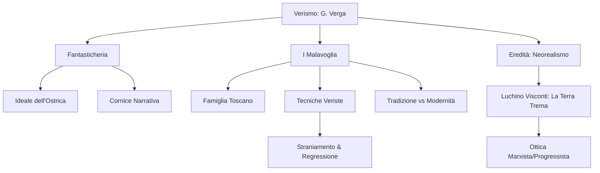

Ecco lo schema di studio completo e dettagliato basato sulla trascrizione della lezione.

# Lezione - 18-12-25 - LINGUA E LETTERATURA ITALIANA

## Metadata
- 📅 **Data:** 18-12-25
- 📚 **Materia:** LINGUA E LETTERATURA ITALIANA
- ✅ **Stato:** COMPLETO

## Riassunto
La lezione analizza la poetica di Giovanni Verga partendo dalla novella *Fantasticheria*, fondamentale per comprendere l'"Ideale dell'ostrica" e l'anticipazione dei temi de *I Malavoglia*. Si approfondisce il romanzo *I Malavoglia*, esaminandone la trama, il sistema dei personaggi, il contesto storico post-unitario e le tecniche narrative veriste (impersonalità, regressione, straniamento). Infine, viene istituito un collegamento con il Novecento attraverso il **Neorealismo**, confrontando la visione conservatrice di Verga con quella marxista e progressista di Luchino Visconti nel film *La terra trema* e citando la riflessione di Pasolini.

## Parole Chiave
- **Ideale dell'ostrica**: Concezione verghiana secondo cui i "vinti" possono salvarsi solo rimanendo attaccati al proprio scoglio (famiglia, tradizione); chi si stacca è destinato a perire.
- **Mondo "pesce vorace"**: Metafora della società esterna e del progresso che inghiotte e distrugge chi, per "vaghezza dell'ignoto", abbandona le proprie origini.
- **Antifrasi**: Figura retorica per cui si afferma il contrario di ciò che si intende (es. "Malavoglia" per una famiglia laboriosa, "La Longa" per una donna bassa).
- **Impersonalità**: Tecnica verista in cui l'autore "si eclissa", non giudica e non appare, lasciando che i fatti parlino da soli.
- **Discorso Indiretto Libero**: Tecnica narrativa che riporta pensieri o parole dei personaggi senza verbi dichiarativi (disse, pensò), assumendone la sintassi e il lessico.
- **Straniamento**: Tecnica per cui un fatto normale viene presentato come strano (o viceversa) perché filtrato attraverso l'ottica deformata della comunità (es. la morte in ospedale vista come superbia).
- **Determinismo**: Concezione filosofica (influenza di Taine) secondo cui l'uomo è determinato da ereditarietà, ambiente e momento storico; in Verga si traduce in immobilismo sociale.
- **Neorealismo**: Corrente cinematografica e letteraria (anni '40-'50) che rappresenta la realtà senza filtri, con attori non professionisti, focalizzandosi su povertà e ingiustizie (reazione alla retorica fascista).
- **Lotta di classe**: Concetto marxista al centro della rilettura di Visconti (*La terra trema*), che auspica il riscatto del proletariato (differenza chiave rispetto al pessimismo verghiano).

## Argomenti Trattati
- Analisi della novella *Fantasticheria* (Vita dei Campi).
- Struttura, trama e analisi stilistica de *I Malavoglia*.
- Il contesto storico: Unità d'Italia e questione meridionale.
- Il Neorealismo cinematografico e il confronto Verga-Visconti.

## Mappa Concettuale

---

## Contenuto Completo

### 1. Fantasticheria (da *Vita dei Campi*)

Questa novella è considerata una **dichiarazione di poetica** fondamentale e un testo "seminale" per la produzione successiva di Verga.

> 📌 **Definizione chiave - Ideale dell'Ostrica:** La convinzione che i poveri, per sopravvivere alle "tempeste della vita", debbano rimanere attaccati al proprio "scoglio" (luogo natio, tradizioni, famiglia). Chi prova a staccarsi per desiderio di miglioramento viene divorato dal mondo (**pesce vorace**).

**Caratteristiche della novella:**
*   **Posizione *Sui Generis*:** A differenza delle altre novelle veriste pure, presenta una **cornice narrativa**. Un narratore (letterato) si rivolge a una donna aristocratica/borghese rievocando una gita ad Aci Trezza.
*   **Struttura a contrasto:** Mette in opposizione il mondo frivolo e ricco della donna ("*il mare... baciava i vostri guanti*") con la realtà dura e misera dei pescatori ("*pelle più dura del pane che mangiano*").
*   **Anticipazione de *I Malavoglia*:** Verga introduce qui personaggi e temi che svilupperà nel romanzo:
    *   **Padron 'Ntoni:** Il nonno che muore all'ospedale.
    *   **La morte lontana da casa:** Descrizione cromatica simbolica. "*In una gran corsia tutta bianca, fra dei lenzuoli bianchi, masticando del pane bianco*".
    *   **Simbolismo del Bianco:** Rappresenta l'estraneità, la freddezza e la solitudine della città (modernità) contrapposta al "pane nero" (miseria ma familiarità) del paese.
    *   **I "monellucci":** Destino segnato dall'**ereditarietà** e dall'ambiente (determinismo). Cresceranno e moriranno come i loro padri.

**Visione del mondo:**
*   **Immobilismo sociale:** Non c'è possibilità di riscatto. L'autore mostra un pessimismo "amaramente conservatore".
*   **Religione della famiglia:** Unica difesa contro le avversità ("*l'istinto che hanno i piccoli di stringersi tra loro*").

---

### 2. I Malavoglia (Romanzo - Ciclo dei Vinti)

Primo romanzo del ciclo, ambientato ad Aci Trezza tra il **1863 e il 1878** (Italia Post-Unitaria).

**Trama e Genealogia:**
La famiglia **Toscano** (detta *Malavoglia*) vive nella "Casa del Nespolo" e possiede la barca "Provvidenza".
*   **Soprannome Antifrastico:** "Malavoglia" indica il contrario della loro natura laboriosa.
*   **Componenti:**
    *   **Padron 'Ntoni:** Patriarca, custode dei valori.
    *   **Bastianazzo:** Figlio, muore nel naufragio (esecutore passivo del volere paterno).
    *   **Maruzza (La Longa):** Moglie, muore di colera.
    *   **Nipoti:** 'Ntoni (il giovane, inquieto), Luca (muore a Lissa), Mena, Alessi (ricostruisce il nido), Lia (finisce prostituta).

**Eventi Chiave:**
1.  Partenza del giovane 'Ntoni per la **leva militare** (vista come ingiustizia dello Stato unitario che sottrae braccia al lavoro).
2.  Affare dei **Lupini** (tentativo di miglioramento economico) $\rightarrow$ Naufragio della *Provvidenza*.
3.  Perdita della Casa del Nespolo.
4.  Disgregazione del nucleo familiare.
5.  Finale: Alessi riscatta la casa (ricomposizione parziale), ma il cerchio rimane aperto: il giovane 'Ntoni si auto-esclude per sempre.

**Contesto Storico e Sociale:**
*   **Italia Post-Unitaria:** Il nuovo Stato è percepito come un nemico (tasse, leva obbligatoria).
*   **Modernità:** Arrivo del telegrafo/treno visto con sospetto e paura ("sostanze diaboliche").
*   **Economia:** Passaggio da economia arcaica a moderna (interesse/profitto).

**Analisi del Sistema dei Personaggi:**
Si contrappongono due mondi e due logiche:
1.  **Padron 'Ntoni (Morale Patriarcale):**
    *   Valori: Onestà, lavoro, "Religione della famiglia".
    *   Linguaggio: Proverbi, saggezza antica.
    *   Metafora: La mano ("*Per menare il remo bisogna che le cinque dita s'aiutino*").
2.  **Zio Crocifisso / Campana di Legno (Logica dell'Utile):**
    *   Valori: Interesse economico, egoismo cinico, profitto immediato.
    *   Rappresenta la comunità di paese che, nella miseria, diventa spietata (legge del più forte).

**Tecniche Narrative e Stile:**
*   **Lingua:** Italiano "parlato dai siciliani". Non dialetto puro, ma sintassi e modi di dire dialettali tradotti.
*   **Discorso Indiretto Libero:** Esempio del farmacista ("*predicava sottovoce di fare la rivoluzione, se non erano minchioni*"). Mimetismo del parlato senza mediazione del narratore.
*   **Straniamento:**
    *   *Esempio:* La morte di Padron 'Ntoni in ospedale (ambiente asettico/bianco) viene vista dal paese non come una tragedia di solitudine, ma come un atto di superbia/lusso dei Malavoglia.
*   **Similitudini "basse":** Tratte dal mondo animale/contadino ("*Nero peggio dell'anima di Giuda*", "*Il vento faceva il diavolo come gatti sul tetto*").

---

### 3. Il Neorealismo e l'Eredità di Verga

Collegamento interdisciplinare con il Cinema e la Storia del Novecento.

> 📌 **Definizione Neorealismo:** Movimento (anni '40-'50) nato come reazione al Fascismo. Mostra l'Italia reale: povertà, macerie, disoccupazione, guerra. Uso di attori non professionisti e riprese in esterna.

**Contesto:**
*   **Cinema Fascista:** Propaganda (Istituto Luce, Cinecittà), film dei "telefoni bianchi" o Colossal storici (esaltazione impero romano, irrealtà).
*   **Cinema Neorealista:** Impegno civile, orientamento politico prevalentemente di **sinistra**.

**Luchino Visconti e *La terra trema* (1948):**
*   **Ispirazione:** Libero adattamento de *I Malavoglia*.
*   **Setting:** Aci Trezza, attori pescatori locali che parlano siciliano.
*   **Differenza Ideologica Fondamentale:**
    *   **Verga (Ottocento):** Pessimista, conservatore, antistoricista. Il tentativo di cambiare porta alla rovina.
    *   **Visconti (Novecento):** Marxista, progressista. Legge la vicenda come **sfruttamento** (pescatori vs grossisti). Auspica la **Lotta di Classe** e la presa di coscienza del proletariato.

**Pier Paolo Pasolini sul Neorealismo:**
*   Definisce il Neorealismo come: "*Il primo atto di coscienza critica che l'Italia ha avuto di se stessa*".
*   L'Italia si guarda "senza veli retorici", scoprendo la propria unità nella miseria e nella speranza di un futuro migliore (rivoluzione mai avvenuta).

---

## 🔗 Collegamenti
- **Prerequisiti:** Verismo, Naturalismo francese (Zola), Determinismo di Taine, Novelle *Rosso Malpelo* e *La Lupa*.
- **Anticipazioni:** Approfondimento su Pasolini (differenza tra l'afflato lirico di Pasolini e il rigore documentaristico neorealista).
- **Da approfondire:** Visione delle sequenze del film *La terra trema* (disponibile scheda di confronto libro/film).
- **Domande aperte:** Riflessione sull'attualità della "leva militare" e sul concetto di "Lotta di classe" nel sistema capitalista odierno.