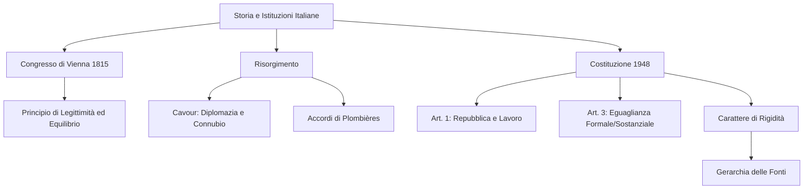

# Lezione - 19-01-26 - LINGUA E LETTERATURA ITALIANA

## Metadata
- 📅 **Data:** 19-01-26
- 📚 **Materia:** LINGUA E LETTERATURA ITALIANA (Educazione Civica e Inquadramento Storico)
- ✅ **Stato:** COMPLETO

## Riassunto
La lezione delinea un percorso storico-giuridico che parte dalla Restaurazione post-napoleonica (1815) per giungere alla nascita della Repubblica Italiana (1948). Viene analizzata la figura diplomatica di Cavour e il suo ruolo nel Risorgimento, fondato su alleanze strategiche e riforme liberali. Il focus principale si sposta poi sulla Costituzione Italiana, analizzandone la struttura rigida e i principi fondamentali di democrazia, lavoro ed eguaglianza (formale e sostanziale). Infine, si sottolinea come l'identità nazionale sia sancita da simboli e valori che rendono la Carta il vertice insuperabile delle fonti del diritto.

## Parole Chiave
- **Costituzione Rigida**: Testo legislativo che richiede procedimenti complessi (aggravati) per essere modificato, garantendo stabilità ai valori fondanti.
- **Eguaglianza Sostanziale**: Impegno dello Stato a rimuovere attivamente gli ostacoli economici e sociali che limitano la libertà e l'uguaglianza dei cittadini.
- **Sovranità Popolare**: Principio secondo cui il potere politico appartiene al popolo, che lo esercita nei limiti della legge.
- **Connubio Cavouriano**: Accordo politico tra l'ala progressista dei moderati e quella moderata dei democratici per creare una maggioranza stabile.
- **Principio di Legittimità**: Criterio del Congresso di Vienna volto a restaurare sui troni i sovrani spodestati da Napoleone.
- **Risorgimento**: Processo culturale, politico e militare che ha portato all'unificazione e all'indipendenza dell'Italia nel XIX secolo.

## Argomenti Trattati
- La Costituzione Italiana: Origini e Principi Fondamentali (Art. 1, 3, 12)
- Il Risorgimento: La diplomazia di Cavour e l'unificazione
- La Restaurazione: Il Congresso di Vienna e i nuovi equilibri europei

## Mappa Concettuale

---

## Contenuto Completo

### 1. La Costituzione Italiana: La Legge Fondamentale

La Costituzione rappresenta l'apice della gerarchia delle fonti del diritto. Entrata in vigore il **1° gennaio 1948**, è il risultato del referendum del 2 giugno 1946 e del lavoro dell'Assemblea Costituente.

> 📌 **Definizione chiave:** **Costituzione Rigida.** Si definisce "rigida" perché non può essere modificata da una legge ordinaria, ma richiede un procedimento "aggravato" (più lungo e complesso), proteggendo i valori democratici da maggioranze parlamentari temporanee.

**Analisi degli Articoli (Principi Fondamentali):**
- **Articolo 1:** *"L'Italia è una Repubblica democratica, fondata sul lavoro."* Il lavoro sostituisce il censo o il titolo nobiliare come metro della dignità sociale; è il fondamento della cittadinanza attiva.
- **Articolo 3 (Il fulcro dell'eguaglianza):**
    - **Eguaglianza Formale (comma 1):** Tutti sono uguali davanti alla legge (senza distinzioni di sesso, razza, lingua, religione).
    - **Eguaglianza Sostanziale (comma 2):** Lo Stato ha il compito di "rimuovere gli ostacoli" (es. borse di studio per meritevoli privi di mezzi).
- **Articolo 12:** Definisce il Tricolore (verde, bianco e rosso) come simbolo dell'unità e dell'identità nazionale.

📖 **Riferimento:** Primi 12 articoli (Principi Fondamentali), immodificabili nel loro nucleo essenziale.

---

### 2. Il Risorgimento e la figura di Cavour

Il Risorgimento non è solo un evento militare, ma un processo culturale e politico volto all'indipendenza italiana. Camillo Benso Conte di **Cavour** ne è il regista diplomatico.

**Punti chiave della strategia cavouriana:**
- **Il Connubio:** Accordo politico per isolare le ali estreme e governare dal centro.
- **Internazionalizzazione:** Partecipazione alla **Guerra di Crimea** non per conquiste territoriali, ma per portare la "questione italiana" sui tavoli diplomatici europei.
- **Politica Economica:** Promozione del **liberismo**, modernizzazione dell'agricoltura e creazione di infrastrutture ferroviarie in Piemonte.
- **Accordi di Plombières:** Alleanza difensiva con Napoleone III (Francia) contro l'Austria.

> ⚠️ **Attenzione:** Garibaldi e Cavour avevano visioni opposte (monarchia vs democrazia d'azione), nonostante la collaborazione finale per l'Unità.

---

### 3. La Restaurazione e il Congresso di Vienna (1814-1815)

Dopo la caduta di Napoleone, le potenze europee cercarono di ripristinare l'Antico Regime. Il protagonista di questa fase fu il diplomatico austriaco **Metternich**.

**I due principi cardine:**
1.  **Principio di Legittimità:** Ritorno dei sovrani "per diritto divino" (es. Luigi XVIII di Borbone in Francia).
2.  **Principio di Equilibrio:** Impedire che uno Stato diventasse egemone (creazione di "Stati cuscinetto").

> 📌 **Definizione chiave:** **Restaurazione.** Il tentativo (parzialmente fallito) di cancellare l'eredità della Rivoluzione Francese e dell'amministrazione napoleonica.

---

## 🔗 Collegamenti
- **Prerequisiti:** Rivoluzione Francese e ascesa di Napoleone Bonaparte.
- **Anticipazioni:** Analisi del sistema parlamentare italiano e delle riforme del tardo Ottocento.
- **Da approfondire:** Differenza tra Costituzioni "brevi/ottriate" (come lo Statuto Albertino) e "lunghe/votate" (come la Costituzione del 1948).
- **Domande aperte:** In che modo l'eguaglianza sostanziale viene applicata oggi nel sistema scolastico italiano?