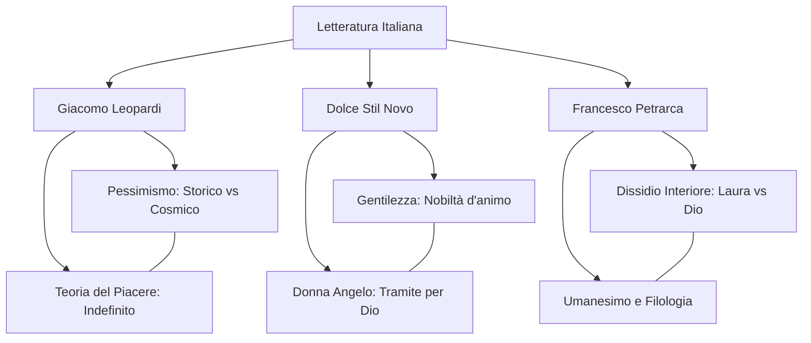

# Lezione - 20-01-26 - LINGUA E LETTERATURA ITALIANA

## Metadata
- 📅 **Data:** 20-01-26
- 📚 **Materia:** LINGUA E LETTERATURA ITALIANA
- ✅ **Stato:** COMPLETO

## Riassunto
La lezione analizza tre pilastri della letteratura italiana: l'evoluzione filosofica di **Giacomo Leopardi**, la nascita del **Dolce Stil Novo** e la figura di **Francesco Petrarca**. Di Leopardi viene approfondito il passaggio dal pessimismo storico a quello cosmico e la teoria del piacere legata all'indefinito. Dello Stilnovo si esamina il concetto di "gentilezza" come nobiltà d'animo e la figura della donna-angelo. Infine, Petrarca viene presentato come il primo intellettuale moderno, caratterizzato dal "dissidio interiore" tra aspirazione spirituale e desideri terreni, e come padre della filologia umanistica.

## Parole Chiave
- **Pessimismo Cosmico**: Fase del pensiero leopardiano in cui la natura è vista come "matrigna" indifferente al dolore universale degli esseri viventi.
- **Gentilezza**: Nello Stilnovo, indica la nobiltà d'animo e la predisposizione alla virtù, contrapposta alla nobiltà di sangue ereditaria.
- **Dissidio Interiore**: Il conflitto perenne di Petrarca tra l'attaccamento ai beni terreni (amore e gloria) e l'aspirazione alla salvezza spirituale.
- **Zibaldone**: Diario intellettuale di Leopardi (oltre 4000 pagine) che raccoglie riflessioni filosofiche e letterarie scritte tra il 1817 e il 1832.
- **Filologia**: Scienza che ricostruisce la forma originale dei testi antichi; Petrarca ne è il precursore riscoprendo i classici (es. Cicerone).
- **Unilinguismo**: Stile poetico di Petrarca caratterizzato da un vocabolario selezionato, elegante e omogeneo (opposto al plurilinguismo dantesco).

## Argomenti Trattati
- Giacomo Leopardi: Vita, conversioni e sistema filosofico.
- Il Dolce Stil Novo: Il manifesto di Guinizzelli e la poetica della lode.
- Francesco Petrarca: L'intellettuale moderno e il Canzoniere.

## Mappa Concettuale

---

## Contenuto Completo

### 1. Giacomo Leopardi: Dal Pensiero alla Poesia

Giacomo Leopardi (Recanati, 1798) si forma nella biblioteca paterna attraverso uno "**studio matto e disperatissimo**" che ne compromette la salute ma gli conferisce una cultura enciclopedica (conoscenza di greco, latino, ebraico a 15 anni).

> 📌 **Definizione chiave: Le Conversioni.** 
> - **1816: Dall'erudizione al bello** (passaggio dallo studio tecnico alla sensibilità poetica).
> - **1819: Dal bello al vero** (adesione a una filosofia razionale e amara).

**Punti chiave:**
- **Lo Zibaldone:** Diario intellettuale non destinato alla pubblicazione, fondamentale per tracciare l'evoluzione del suo pensiero.
- **Pessimismo Storico:** Natura come "madre benigna" che offre illusioni per nascondere il male. L'infelicità è causata dal progresso e dalla ragione.
- **Pessimismo Cosmico:** Natura come "**matrigna indifferente**". Il dolore è universale e meccanico; la natura segue cicli di creazione/distruzione senza curarsi dell'individuo.
- **Teoria del Piacere:** L'uomo desidera un piacere infinito ma ottiene solo piaceri finiti. L'unica via di fuga è il **Vago e l'Indefinito**.

📖 **Riferimenti:** *L'Infinito* (esempio di siepe che favorisce l'immaginazione), *I Canti* (Piccoli e Grandi Idilli).

---

### 2. Il Dolce Stil Novo: La Nobiltà del Cuore

Il movimento nasce nel Duecento come superamento della lirica provenzale, spostando il focus dal vassallaggio d'amore alla dimensione spirituale.

**Punti chiave:**
- **La Gentilezza:** Definita come nobiltà d'animo. 
- **Guido Guinizzelli:** Autore del manifesto *"Al cor gentil rempaira sempre amore"*.
- **La similitudine del Sole e del Fango:** Guinizzelli spiega che come il sole splende sul fango senza nobilitarlo, così un titolo nobiliare non rende "gentile" chi ha il cuore vile.
- **Donna Angelo:** La donna diventa strumento di elevazione spirituale (Beatrice per Dante).

> ⚠️ **Attenzione:** Esiste una divergenza tra gli stilnovisti. Per **Guinizzelli** l'amore eleva; per **Cavalcanti** l'amore è una forza oscura e irrazionale che distrugge il poeta.

---

### 3. Francesco Petrarca: L'Intellettuale Cosmopolita

Petrarca (1304-1374) rappresenta il ponte tra Medioevo e Umanesimo. È il primo intellettuale moderno che sceglie il distacco dalla politica attiva e la sicurezza economica degli ordini minori (chierico) per dedicarsi allo studio.

**Punti chiave:**
- **Filologia:** Petrarca riscopre i classici (es. Cicerone) cercando di riportarli alla loro forma originale.
- **Il Canzoniere (*Rerum vulgarium fragmenta*):** 366 componimenti (uno per giorno dell'anno + proemio). Definite dall'autore "nugae" (bazzecole), sono in realtà il fondamento del lirismo moderno.
- **Il Dissidio:** Conflitto tra l'amore per **Laura** (simbolo di gloria terrena, ma anche ostacolo spirituale) e l'aspirazione a Dio.

**Figure Retoriche e Tecnica:**
- **Unilinguismo:** Uso di un lessico aulico e selezionato, opposto al plurilinguismo dantesco.
- **Simbolismo del nome Laura:** Richiama l'**auro** (oro), l'**aura** (aria) e il **lauro** (gloria poetica).

> 📌 **Definizione chiave: Diario dell'anima.** Il Canzoniere non è una narrazione cronologica, ma un'analisi psicologica del tormento interiore.

---

## 🔗 Collegamenti
- **Prerequisiti:** Concetto di amor cortese (Provenzali) e struttura della Divina Commedia.
- **Anticipazioni:** Approfondimento del "Petrarchismo" nel Rinascimento e l'influenza del pessimismo leopardiano sul Verismo.
- **Da approfondire:** Differenza tra la Beatrice di Dante (beata) e la Laura di Petrarca (umana e soggetta al tempo).
- **Domande aperte:** Come si concilia la fede di Petrarca con il suo desiderio ossessivo di gloria terrena? In che modo la natura matrigna di Leopardi influisce sulla sua tecnica poetica dei Canti?