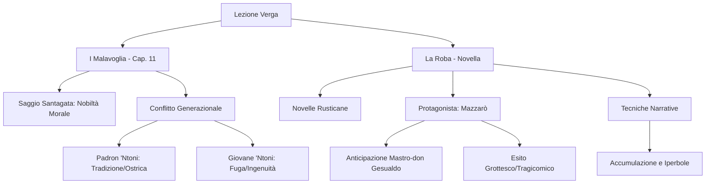

# Lezione - 22-12-25 - LINGUA E LETTERATURA ITALIANA

## Metadata
- 📅 **Data:** 22-12-25
- 📚 **Materia:** LINGUA E LETTERATURA ITALIANA
- 👨‍🏫 **Autore/Movimento:** Giovanni Verga / Verismo
- ✅ **Stato:** COMPLETO

## Riassunto
La lezione analizza due opere fondamentali di Giovanni Verga, concentrandosi sul conflitto tra mentalità arcaica e moderna. Si esamina il capitolo 11 de *I Malavoglia* attraverso il saggio di Santagata, evidenziando lo scontro generazionale tra Padron 'Ntoni (tradizione) e il giovane 'Ntoni (desiderio di fuga), entrambi portatori di una specifica "nobiltà" morale. Successivamente, si introduce la novella *La Roba* (*Novelle Rusticane*), analizzando la figura di Mazzarò, l'accumulo ossessivo di beni materiali e l'uso di tecniche narrative come l'iperbole e l'accumulazione per descrivere l'identificazione totale tra uomo e proprietà.

## Parole Chiave
- **Verismo**: Movimento letterario italiano di fine '800 (ispirato al Naturalismo francese) che mira a rappresentare la realtà in modo oggettivo, con la tecnica dell'impersonalità.
- **I Malavoglia**: Primo romanzo del *Ciclo dei Vinti* (1881), incentrato sulla famiglia di pescatori di Aci Trezza.
- **Ideale dell'ostrica**: Concetto verghiano secondo cui chi si stacca dal proprio ambiente d'origine (come l'ostrica dallo scoglio) è destinato a perire.
- **Mentalità Conservatrice**: Visione del mondo statica, legata ai cicli naturali e alle tradizioni, incarnata da Padron 'Ntoni.
- **La Roba**: Novella e concetto chiave che indica l'accumulo di beni materiali (terre, bestiame) che diventano l'unica ragione di vita del personaggio.
- **Mazzarò**: Protagonista dell'omonima novella, "self-made man" ossessionato dal possesso, anticipazione grottesca di Mastro-don Gesualdo.
- **Grottesco**: Tono tragicomico utilizzato in *La Roba*, diverso dalla tragicità pura dei romanzi maggiori.
- **Toponomastica**: Studio e uso dei nomi di luogo; Verga la usa per dare verosimiglianza e misurare la vastità dei possedimenti.
- **Iperbole**: Figura retorica che consiste nell'esagerazione (es. "vigna che non finiva più").
- **Assiolo**: Rapace notturno citato nel testo, il cui verso ("chiù") sarà centrale nella poetica di Giovanni Pascoli (*Myricae*).

## Argomenti Trattati
- Analisi del Capitolo 11 de *I Malavoglia*: Il confronto nonno-nipote e il saggio di Santagata.
- La mentalità popolare e i proverbi nel linguaggio verghiano.
- Introduzione e analisi della novella *La Roba* (*Novelle Rusticane*).
- Caratteristiche del personaggio di Mazzarò e tecniche stilistiche.

## Mappa Concettuale

---

## Contenuto Completo

### 1. I Malavoglia (Capitolo 11): La Nobiltà e il Conflitto
*(Riferimento testo: Pagina 208)*

La lezione approfondisce un passo cruciale del romanzo del 1881, analizzato attraverso la lente critica del saggio di **Santagata** intitolato *"La nobiltà dei Malavoglia"*.

> 📌 **Definizione chiave (Tesi di Santagata):** Il termine "nobiltà" non si riferisce allo status sociale o economico (i Malavoglia sono poveri pescatori), ma a una **condizione morale**. La loro nobiltà risiede nell'assenza di scorciatoie, nella devozione alla famiglia, all'onestà, al lavoro e al sacrificio.

#### A. Il Dialogo: Padron 'Ntoni vs. Giovane 'Ntoni
Il brano mette a confronto due mentalità opposte attraverso un dialogo serrato.

**1. Il Vecchio Padron 'Ntoni (La Tradizione):**
Rappresenta il mondo rurale, ciclico, immobile. Cerca di proteggere il nipote mettendolo in guardia con la saggezza popolare.
- **Linguaggio:** Uso massiccio di **proverbi** (modalità popolare/orale).
    - *"Chi va coi zoppi, all'anno zoppica"* (Attenzione alle cattive compagnie).
        > ⚠️ **Nota Linguistica:** La forma *"coi zoppi"* è un errore morfosintattico (corretto: *con gli zoppi*) voluto da Verga per mimare l'italiano popolare/analfabeta (mimesi del parlato).
    - *"Più ricco è in terra chi meno desidera"* (Chi si accontenta gode).
    - *"Ad ogni uccello suo nido è bello"* (Similitudine animale: attaccamento alla casa).
    - *"Chi cambia la vecchia per la nuova, peggio trova"*.
    - *"Il buon pilota si prova nelle burrasche"*.
- **Mentalità:** Conservatrice. Chi si allontana dalle origini ("Ideale dell'ostrica") per cercare l'ignoto è destinato alla sconfitta nel "mondo come pesce vorace" (cit. *Fantasticheria*).

**2. Il Giovane 'Ntoni (Il Nuovo/L'Ingenuità):**
Rappresenta il desiderio di rottura, il rifiuto della miseria statica.
- **Motivazione:** Non è egoismo puro, ma uno **slancio generoso** (nobiltà di sentimenti). Vuole arricchire la madre e la famiglia ("Voglio farla ricca mia madre!").
- **Visione della Città:** Estremamente **ingenua** e irrealistica. La immagina come un luogo dove:
    - Non si fa nulla.
    - Si mangia carne e pasta tutti i giorni.
    - Tutti sono ricchi.
- **Esito:** È un sognatore sprovveduto. Chi si allontana diventa uno **"Zingaro"** (senza radici), destinato a perdersi. La sua ricerca del "nuovo" sarà fallimentare (è un *Vinto*).

#### B. Temi del Passo
- **La Nostalgia:** Il nonno avverte il nipote che, lontano, soffrirà la mancanza del "sole che entra dalla finestra" e dei "sassi che ti conoscono".
- **Il Lavoro:** Per il giovane è una condanna ("cane alla catena", "mulo da bindolo"); per il vecchio è un dovere sacro che nobilita.

---

### 2. La Roba (Novelle Rusticane)
*(Riferimento testo: Pagina 265)*

Si passa all'analisi della novella contenuta nella raccolta *Novelle Rusticane* (successiva a *Vita dei campi*), ambientata nella piana di Catania.

> 📌 **Contesto:** Il protagonista, **Mazzarò**, anticipa il personaggio di *Mastro-don Gesualdo*, ma con una differenza fondamentale: l'esito della novella è **grottesco/tragicomico**, mentre il romanzo ha un esito tragico.

#### A. Analisi dell'Incipit
La novella non inizia con la descrizione del personaggio, ma del paesaggio, utilizzando la tecnica dello straniamento e dell'accumulo.

1. **Il Viandante:** La vastità dei possedimenti è mostrata attraverso gli occhi di un viandante che attraversa la Sicilia. Alla domanda "Di chi è qui?", la risposta è sempre e solo: *"Di Mazzarò"*.
2. **Toponomastica precisa:** Verga cita luoghi reali (*Biviere di Lentini, Piana di Catania, Francofonte*) per dare concretezza e misurare l'immensa estensione delle terre.
3. **Stile:**
    - Periodare più steso e complesso rispetto ai *Malavoglia*.
    - Uso del **Discorso Indiretto Libero** misto a discorso diretto.

#### B. Figure Retoriche e Simbologia
- **Iperbole (Esagerazione):**
    - *"Vigna che non finiva più"*.
    - *"Pareva che Mazzarò fosse disteso tutto grande per quanto era grande la terra"*.
- **Similitudini:**
    - *"Ricco come un maiale"*.
    - *"Uliveto folto come un bosco"*.
- **Metafora:**
    - *"Aveva la testa che era un brillante"* -> Indica intelligenza, scaltrezza, astuzia (non le dimensioni fisiche).
- **Riferimento Letterario:**
    - **L'Assiolo:** Viene citato questo rapace notturno (verso lugubre).
    > 📖 **Collegamento:** Il verso dell'assiolo ("chiù") è il titolo e il tema centrale di una famosa poesia di **Giovanni Pascoli** (*Myricae*), che verrà studiata successivamente.

#### C. Ritratto di Mazzarò
- **Fisico:** Un "omiciattolo" a cui non si darebbe un soldo. Di grasso ha solo la pancia (simbolo di accumulo, ma paradossale perché mangia pochissimo).
- **Psicologia:** Sobrietà e avarizia. Mangia "due soldi di pane".
- **Storia:** È un *self-made man*. Ha accumulato la "roba" lavorando duramente (zappare, potare, mietere) dove prima veniva preso a calci. Ora è chiamato "Eccellenza" dagli stessi che lo umiliavano.
- **Tema centrale:** Identificazione totale dell'uomo con la "roba". I possedimenti non sono un mezzo, ma il fine ultimo dell'esistenza.

---

## 🔗 Collegamenti

- **Prerequisiti:** Conoscenza del Verismo, della trama generale de *I Malavoglia*, della novella *Fantasticheria* (Ideale dell'ostrica).
- **Anticipazioni:**
    - **Giovanni Pascoli**: La citazione dell'assiolo anticipa la poetica del simbolismo pascoliano.
    - **Mastro-don Gesualdo**: Mazzarò è lo studio preparatorio per il secondo romanzo del Ciclo dei Vinti.
    - **Neorealismo**: Argomento da trattare a gennaio come evoluzione del Verismo.
- **Da approfondire (Compiti):**
    - Studiare il saggio di Santagata (pagine inviate via WhatsApp).
    - Studiare la fine de *I Malavoglia*.
    - Leggere il resto della novella *La Roba* e studiare l'analisi del testo.
- **Domande aperte:** Riflettere sulla differenza tra l'umorismo amaro/grottesco di *La Roba* e la tragedia di *Gesualdo*.