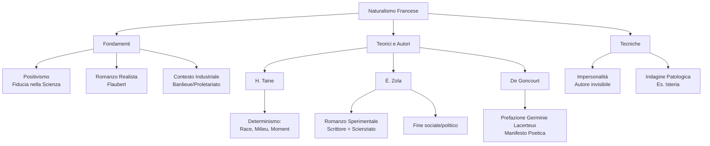

# Lezione - 24-11-25 - LINGUA E LETTERATURA ITALIANA

## Metadata
- 📅 **Data:** 24-11-25
- 📚 **Materia:** LINGUA E LETTERATURA ITALIANA
- ✅ **Stato:** COMPLETO

## Riassunto
La lezione introduce il **Naturalismo francese** come base culturale per il futuro studio del Verismo italiano. Viene analizzato il contesto filosofico del **Positivismo**, caratterizzato dalla fiducia nella scienza e nel determinismo, in contrapposizione al Romanticismo. Si esaminano i tre fattori determinanti dell'uomo secondo **Taine** (race, milieu, moment) e la concezione del romanziere-scienziato di **Zola**, che applica il metodo sperimentale alla letteratura per fini sociali. Infine, viene discusso il principio dell'**impersonalità** (Flaubert) e analizzata la prefazione a *Germinie Lacerteux* dei fratelli **De Goncourt** come manifesto della nuova estetica che include le classi subalterne e il patologico.

## Parole Chiave
- **Positivismo**: Corrente filosofica che risponde all'irrazionalismo romantico ponendo fiducia assoluta nella ragione, nella scienza e nel metodo sperimentale.
- **Naturalismo**: Corrente letteraria francese della seconda metà dell'800 che applica i principi scientifici del Positivismo alla letteratura.
- **Determinismo**: Concezione secondo cui l'agire umano è regolato da rigidi rapporti causa-effetto, indagabili scientificamente.
- **Ippolito Taine**: Teorico del Naturalismo, identifica i tre fattori che determinano l'uomo: *race* (ereditarietà), *milieu* (ambiente), *moment* (momento storico).
- **Romanzo Sperimentale**: Opera teorica di Émile Zola in cui lo scrittore viene equiparato a uno scienziato che osserva i fenomeni umani.
- **Impersonalità**: Tecnica narrativa dove l'autore è "invisibile" e non esprime giudizi, opposta al narratore onnisciente manzoniano.
- **Gustave Flaubert**: Autore di *Madame Bovary*, precursore del realismo e teorico dell'impersonalità ("Dio nell'universo").
- **Fratelli De Goncourt**: Autori di *Germinie Lacerteux*, la cui prefazione funge da manifesto poetico per l'interesse verso le classi subalterne e il patologico.
- **Isteria**: Patologia (dal greco *hysteron*, utero) associata all'epoca alle donne, citata come esempio di studio clinico-letterario.

## Argomenti Trattati
- Il contesto filosofico: dal Romanticismo al Positivismo.
- I tre fondamenti del Naturalismo: Positivismo, Romanzo Realista, Contesto Socio-economico.
- La teoria deterministica di Taine (*Race, Milieu, Moment*).
- Émile Zola e la funzione sociale del "Romanzo Sperimentale".
- La tecnica dell'Impersonalità (confronto Flaubert vs Manzoni).
- Il Manifesto del Naturalismo: i Fratelli De Goncourt e *Germinie Lacerteux*.

## Mappa Concettuale

---

## Contenuto Completo

### 1. Introduzione e Contesto: Il Positivismo

La lezione si apre collegando il futuro studio del **Verismo italiano** (esponente principale: **Giovanni Verga**, opere citate: *Rosso Malpelo*, *I Malavoglia*) alla sua matrice d'origine francese: il **Naturalismo**.

Il sostrato culturale indispensabile è il **Positivismo**.

> 📌 **Definizione chiave:** Il **Positivismo** è una corrente filosofica che nasce come risposta agli esiti irrazionalistici del Romanticismo, riconnettendosi idealmente all'Illuminismo per la fiducia nella **ragione** e nella **scienza**.

**Caratteristiche del Positivismo:**
- **Ideologia scientista:** Primato della scienza come unico metodo di conoscenza valido.
- **Estensione del metodo sperimentale:** Applicazione del metodo scientifico anche all'uomo e alla società (nascita di sociologia e psicologia).
- **Visione Deterministica:** La realtà e l'agire umano sono regolati da leggi meccaniche di causa-effetto.

### 2. Le Origini del Naturalismo Francese

Il Naturalismo nasce in Francia nella seconda metà dell'Ottocento (il Verismo in Italia arriverà più tardi, 1865-1870). Si basa su **tre pilastri**:

1.  **Il Positivismo:** (Fondamento ideologico).
2.  **Il Romanzo Realista (metà '800):**
    *   Anticipa temi e tecniche.
    *   Autore chiave: **Gustave Flaubert**.
    *   Opera citata: *Madame Bovary*. Analizza la società borghese, le sue contraddizioni (apparenza vs realtà), l'insoddisfazione coniugale.
    *   Indaga aspetti "scomodi" della realtà.
3.  **Il Contesto Socio-economico:**
    *   Francia molto industrializzata (più avanzata dell'Italia).
    *   Urbanizzazione massiccia (Parigi).
    *   Focus sulle **Banlieue** (periferie).
    *   Protagonisti: **Classi subalterne** (operai, disoccupati, esclusi dal progresso).
    *   Temi sociali: Povertà, **alcolismo** (piaga sociale per dimenticare la miseria), degrado.

### 3. La Teoria Deterministica (Hippolyte Taine)

Secondo i naturalisti, ogni aspetto della realtà (incluso l'uomo) è governato da leggi meccaniche.
Il teorico **Hippolyte Taine** stabilisce che l'uomo è il risultato matematico di tre fattori:

1.  **Race** (Razza): Il fattore ereditario/genetico (es. tare familiari, malattie mentali).
2.  **Milieu** (Ambiente): L'ambiente sociale in cui si vive (classe sociale, famiglia).
3.  **Moment** (Momento): Il contesto storico-politico.

> ⚠️ **Concetto fondamentale:** Conoscendo questi tre fattori, i comportamenti psicologici umani sono prevedibili e studiabili come qualsiasi fenomeno naturale (es. l'azoto in laboratorio).

### 4. Émile Zola e il "Romanzo Sperimentale"

**Émile Zola** (maggiore esponente) teorizza il ruolo della letteratura nel saggio *Il romanzo sperimentale* (*Le Roman expérimental*).

**Punti chiave della poetica di Zola:**
- **Letteratura come inchiesta:** Indagine scientifica sull'uomo e la società.
- **Scrittore = Scienziato:** Lo scrittore osserva i fenomeni umani con distacco, come un chimico in laboratorio.
- **Ottimismo e Scopo Politico:** (Specifico del Naturalismo francese): L'obiettivo è fornire ai governanti gli strumenti conoscitivi per curare le "malattie" della società e migliorare le condizioni di vita.

### 5. La Tecnica dell'Impersonalità

Il metodo scientifico impone un nuovo atteggiamento narrativo.

*   **Confronto:**
    *   **Alessandro Manzoni** (*Promessi Sposi*, 1840): **Narratore onnisciente**. Interviene, giudica, commenta moralmente.
    *   **Naturalisti:** **Impersonalità**. Lo scrittore non giudica, non partecipa emotivamente.

> 📖 **Citazione (Gustave Flaubert, 1852):**
> *"L'autore deve essere nella sua opera come Dio nell'universo: presente dovunque e non visibile in nessun luogo."*

L'autore deve "sparire" dietro l'opera, lasciando parlare i fatti.

### 6. Il Manifesto: Prefazione a "Germinie Lacerteux" (De Goncourt)

Un testo chiave (manifesto di poetica) è la prefazione al romanzo *Germinie Lacerteux* (1864) dei **Fratelli De Goncourt**.

**L'opera:**
- Ispirata a un caso di cronaca vero (una loro domestica).
- Trama: Una cameriera si degrada per una passione amorosa.
- Tema centrale: La malattia, specificamente l'**Isteria**.

> 📌 **Approfondimento: L'Isteria**
> Etimologia dal greco *hysteron* (utero). All'epoca considerata malattia tipicamente femminile legata alla sfera sessuale/riproduttiva, sintomo di nervosismo e agitazione. Colpiva spesso le donne povere (manicomi). Anticipa gli studi di Freud sulla sessualità e frustrazione femminile.

**Punti del Manifesto (Poetica dei Goncourt):**
1.  **Rifiuto del gusto del pubblico:** Il romanzo non deve assecondare la moda o intrattenere (anti-*feuilleton*).
2.  **Romanzo come strumento di conoscenza:** È la forma più adatta per l'indagine scientifica del reale.
3.  **Legame con la Medicina:** Letteratura come diagnosi e analisi dei sintomi (modello clinico).
4.  **Diritto di cittadinanza per le classi inferiori:** I poveri e gli umili diventano protagonisti letterari.
5.  **Estetica del "brutto" e del patologico:** Temi morbosi, malattie, vizi (es. incesto in *Teresa Raquin* di Zola) entrano in letteratura.

---

## 🔗 Collegamenti
- **Prerequisiti:** Romanticismo (per contrasto), Alessandro Manzoni (Promessi Sposi) per confronto sulla tecnica narrativa.
- **Anticipazioni:** Il Verismo italiano (Verga) che riprenderà queste tecniche ma con differenze ideologiche (mancanza di ottimismo/progresso).
- **Da approfondire:** Lettura della parte generale sul Naturalismo nel libro di testo (volume dove è presente Verga).
- **Domande aperte:** In che modo specifico il "pessimismo" di Verga si differenzierà dall'ottimismo riformista di Zola? (Tema per le prossime lezioni).