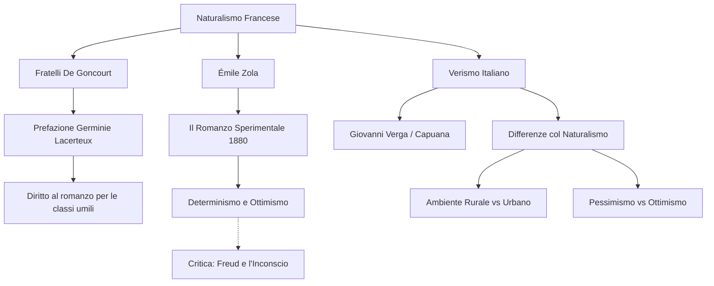

# Lezione - 25-11-25 - LINGUA E LETTERATURA ITALIANA

## Metadata
- 📅 Data: 25-11-25
- 📚 Materia: LINGUA E LETTERATURA ITALIANA
- ✅ Stato: COMPLETO

## Riassunto
La lezione analizza le dichiarazioni di poetica fondamentali del Naturalismo francese, partendo dalla prefazione di *Germinie Lacerteux* dei fratelli De Goncourt, che rivendica la dignità letteraria delle classi inferiori e introduce il concetto di "romanzo vero" e scientifico. Si approfondisce la figura di Émile Zola e il suo *Romanzo sperimentale*, evidenziando l'ottimismo positivista e la pretesa di dominare scientificamente le passioni umane, visione successivamente smentita dalla psicoanalisi di Freud. Infine, viene introdotto il Verismo italiano (Verga, Capuana), mettendolo a confronto con il modello francese: si evidenzia il passaggio dall'ambientazione urbana e industriale a quella rurale e arretrata del Sud Italia, con un conseguente spostamento ideologico dall'ottimismo progressista al pessimismo fatalista.

## Parole Chiave
- **Naturalismo**: Corrente letteraria francese della seconda metà dell'800 che applica il metodo scientifico all'osservazione della realtà sociale e umana.
- **Romanzo Sperimentale**: Opera teorica di Zola (1880) che equipara la letteratura alla scienza (fisiologia), sostenendo che il comportamento umano è determinato da leggi fisse.
- **Determinismo**: Concezione filosofica secondo cui i fenomeni umani (pensieri, passioni) sono causati necessariamente da fattori come ereditarietà, ambiente e momento storico.
- **Impersonalità**: Tecnica narrativa che prevede l'assenza di giudizio o intervento esplicito dell'autore, che deve "sparire" dietro i fatti narrati.
- **Clinica dell'Amore**: Espressione dei De Goncourt per definire l'analisi scientifica, fredda e priva di morbosità delle passioni, opposta alla letteratura romantica o erotica.
- **Verismo**: Movimento letterario italiano derivato dal Naturalismo, focalizzato sulla realtà rurale e arretrata del Sud (questione meridionale).
- **Inconscio**: Concetto freudiano citato per confutare l'ottimismo naturalista; parte della psiche non conoscibile che determina l'agire umano ("L'Io non è padrone in casa propria").

## Argomenti Trattati
- La poetica dei Fratelli De Goncourt (*Germinie Lacerteux*)
- Émile Zola e il metodo scientifico (*Il romanzo sperimentale*)
- Critica al determinismo naturalista attraverso Freud
- Introduzione al Verismo italiano e confronto con la Francia

## Mappa Concettuale

---

## Contenuto Completo

### 1. La Poetica dei Fratelli De Goncourt: *Germinie Lacerteux*

I fratelli Edmond e Jules De Goncourt scrivono una prefazione fondamentale al loro romanzo *Germinie Lacerteux*, considerata uno dei manifesti del Naturalismo.

> 📌 **Definizione chiave: "Romanzo Vero" vs "Romanzo Falso"**
> - **Romanzo Falso:** La letteratura amata dal pubblico dell'epoca, fatta di intrighi, avventure "nel gran mondo" (aristocrazia/borghesia), storie romantiche, "operette maliziose" o erotiche ("pruriginose") volte solo a consolare o divertire.
> - **Romanzo Vero:** Un'opera che "viene dalla strada", severa, pura, basata sul **rigore scientifico** e sull'assenza di intervento autoriale.

**Punti chiave della Prefazione:**
- **Il Pubblico:** È criticato perché cerca letture "anodine e consolanti" (tranquillizzanti) che non turbino la digestione. Il romanzo naturalista, invece, è fatto per "contrariare le abitudini" e "nuocere all'igiene" (psichica) del lettore, instillando dubbi.
- **La "Clinica dell'Amore":** Gli autori non offrono una "fotografia licenziosa" (morbosa/erotica) del piacere, ma uno studio clinico, un'analisi scientifica delle passioni senza patetismi.
- **Democrazia letteraria:** Nel XIX secolo, epoca di suffragio universale e democrazia, le **"classi inferiori"** (il popolo, i ceti subalterni) hanno il diritto di essere rappresentate.
- **La domanda cruciale:** Gli autori si chiedono se:
  > *"Le lacrime che si piangono in basso possano far piangere come quelle che si piangono in alto".*
  Ovvero: le miserie dei poveri hanno la stessa dignità letteraria e tragica di quelle dei ricchi? La risposta è sì.

**Analisi:** Il romanzo diventa strumento di **ricerca sociale** e "storia morale contemporanea". C'è un legame ideale (retroterra) con autori futuri come **Pasolini** per l'interesse verso le classi umili e la realtà nuda e cruda.

### 2. Émile Zola e il Naturalismo Scientifico

Émile Zola è il massimo teorico ed esponente del Naturalismo.

**Opere Fondamentali:**
- **Teorica:** *Il romanzo sperimentale* (1880) - Saggio di poetica.
- **Romanzi:** *Thérèse Raquin* (1867), *L'Assommoir* (L'Ammazzatoio, 1877).

**Caratteristiche della poetica di Zola:**
1.  **Distacco e Oggettività:** A differenza di Manzoni (che interviene con giudizi morali o ironia), Zola non esprime giudizi. L'autore è come uno scienziato che assiste ai fatti.
2.  **Rappresentazione del "brutto":** Il ripugnante perde il carattere morboso e diventa strumento di denuncia sociale indiretta.
3.  **Metodo Sperimentale (Analisi del testo):**
    - Come la chimica e la fisica si sono liberate del soprannaturale/magico, così deve fare la fisiologia e infine il romanzo.
    - **Determinismo:** Il corpo umano è una "macchina". Anche il pensiero e le passioni sono regolati da leggi fisse (causa-effetto).
    - **I tre fattori determinanti:** Ereditarietà, Ambiente, Momento storico.

> ⚠️ **Attenzione all'Ottimismo Positivista:** Zola e i naturalisti sono dominati da una profonda **fiducia (ottimismo)**. Credono che conoscendo le leggi scientifiche dell'uomo ("diventare padroni dei fenomeni"), si possa guidare la società, correggere le storture e eliminare le ingiustizie.

**Critica e Superamento (Il confronto con Freud):**
L'idea naturalista di poter dominare e prevedere la psiche umana ("smontare e rimontare gli ingranaggi") si rivela ingenua alla luce delle scoperte del primo Novecento.
- **Sigmund Freud** e la psicoanalisi dimostrano che **"L'Io non è padrone in casa propria"**.
- Esiste l'**Inconscio** (parte sommersa dell'iceberg), che determina le nostre azioni ma non è conoscibile né controllabile razionalmente. La psiche è ambivalente, non meccanica.
- Esempio di alterazione della realtà: malattie degenerative (Alzheimer), schizofrenia, uso di droghe.

### 3. Il Verismo Italiano

Il Verismo nasce in Italia (ultimi decenni '800) recependo il Naturalismo francese, ma adattandolo a un contesto radicalmente diverso.

**Esponenti:**
- **Giovanni Verga** (Catania): Massimo esponente.
- **Luigi Capuana**: Teorico del movimento.

**Confronto Naturalismo vs Verismo:**

| Caratteristica | Naturalismo Francese (Zola) | Verismo Italiano (Verga) |
| :--- | :--- | :--- |
| **Soggetti** | Proletariato urbano (città, operai) | **Mondo contadino**, braccianti, minatori, pescatori |
| **Ambiente** | Francia industrializzata, dinamica | **Sud Italia** (Sicilia) arretrato, rurale |
| **Mobilità Sociale** | Dinamismo presente | **Immobilismo assoluto** (destino segnato) |
| **Mentalità** | Scientifica, progressista | Superstiziosa, arcaica (es. *Rosso Malpelo*) |
| **Ideologia** | **Ottimismo** (fiducia nel progresso e nella politica) | **Pessimismo** cupo. Nessuna fiducia nel progresso o nello Stato |

**Il contesto storico-sociale del Verismo:**
- L'Italia è unita dal 1861, ma il Sud è arretrato.
- **Estraneità allo Stato:** Per i siciliani, l'unità e lo Stato sono entità astratte o nemiche (es. la leva militare obbligatoria vista come una sciagura che toglie braccia alla terra e impoverisce le famiglie).
- Verga non crede che la letteratura possa cambiare la società (a differenza di Zola), si limita a fotografare la realtà di "chi perde".

---

## 🔗 Collegamenti
- **Prerequisiti:** Concetto di Positivismo, differenze socio-economiche tra Francia e Italia nel XIX secolo, Alessandro Manzoni (per il confronto sul narratore).
- **Anticipazioni:** Analisi specifica delle novelle di Verga (*Rosso Malpelo*), il Ciclo dei Vinti.
- **Da approfondire:** Lettura integrale della prefazione di *Germinie Lacerteux*; lettura brani da *L'Assommoir*.
- **Riferimenti Letterari:** Pasolini (come erede dell'interesse per il sottoproletariato), Leopardi (per il contrasto sull'ottimismo/progresso nella *Ginestra*).
- **Domande aperte:** In che modo la tecnica dell'impersonalità cambia tra Zola e Verga? (Da sviluppare nelle prossime lezioni).