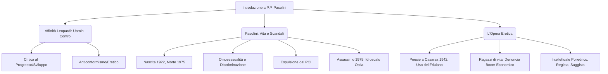

# Lezione - 27-10-25 - Schema da RAW

## Metadata
- 📅 Data lezione: 27-10-25
- 📄 File RAW originale: [NOME_FILE_RAW]
- ✅ Stato: COMPLETO

## Riassunto
La lezione introduce la figura e l'opera di Pier Paolo Pasolini (1922-1975), analizzando la sua posizione di "uomo contro" attraverso un accostamento critico con Giacomo Leopardi. Entrambi gli autori sono affini per il loro anticonformismo e la critica ai falsi miti del proprio tempo, in particolare contro il mito del progresso. La vita di Pasolini fu segnata da emarginazione dovuta alla sua omosessualità e da decine di processi che lo definirono un eretico, soprattutto a seguito della pubblicazione dei romanzi romani come *Ragazzi di vita*, che svelavano le crepe sociali nascoste dal Boom Economico. La sua carriera di poeta, regista e intellettuale poliedrico si concluse tragicamente con il suo assassinio nel 1975, un evento che ancora oggi solleva ipotesi di complotto.

## Parole Chiave
- Pier Paolo Pasolini (PPP)
- Giacomo Leopardi
- Anticonformismo
- Eresia / Poeta Eretico
- Boom Economico
- Operette Morali
- Partito Comunista Italiano (PCI)
- Ragazzi di vita
- Scandalo

## Argomenti Trattati
- Affinità tra Leopardi e Pasolini (Anticonformismo e Critica al Progresso)
- Scandalo e Censura nell'Opera di Leopardi
- Vita e Contesto Storico di Pasolini (Boom Economico)
- L'Eretico Pasolini: Esordio, Espulsione e Discriminazione
- L'Opera Romana e la Denuncia Sociale

## Mappa Concettuale

---

## Contenuto Completo

### Argomento Principale 1 - L'Accostamento Eretico: Leopardi e Pasolini Uomini Contro

La lezione introduce Pier Paolo Pasolini (nato 1922, morto 1975) attraverso l'accostamento con **Giacomo Leopardi**, due autori distanti nel tempo ma affini per atteggiamento, specialmente nei confronti della contemporaneità.

> 📌 **Definizione chiave: Uomini Contro:** Entrambi gli autori si posizionano criticamente contro quelli che considerano i falsi miti del loro tempo, incarnando una libertà di pensiero percepita come scandalosa.

**La critica di Leopardi ai contemporanei:**
Leopardi manifesta un atteggiamento critico e spesso **anticonformista** nei confronti della società del suo tempo:
- **Progresso:** È critico nei confronti del progresso, esaltato dai suoi contemporanei come avanzamento e garanzia di benessere.
- **Miti del Tempo:** Critica l'antropocentrismo, che vede l'uomo in una posizione privilegiata nel cosmo, decostruendolo con la sua filosofia "dolorosa ma vera".

**La Censura sull'Opera Leopardiana:**
L'accoglienza di Leopardi fu tiepida o ostile. La sua opera fu vittima di censura:
- **Operette Morali:** Furono considerate un "invito al suicidio" e accusate di blasfemia e di essere improntate a un **funesto scetticismo e fatalismo il più desolato** (nichilismo).
- **Condanna Ufficiale:** La *Congregazione per l'indice dei libri proibiti* condannò le *Operette Morali* il **27 giugno 1850**. L'accademico Antonio Giuliano ha accertato che il Vaticano considerava il poeta "imbevuto fin dagli anni più teneri dei principi dello stoicismo" e le sue dottrine "di grave pericolo la lettura, massimamente per la celebrità dello scrivente."
- **Contro la Borghesia:** La polemica aspra e continua di Leopardi era diretta contro il suo secolo, definito "superbo e sciocco," contro lo scientismo e lo spiritualismo ottimistico.

> 📖 **Riferimenti letterari:** Il difficile rapporto con gli intellettuali fiorentini del **Gabinetto Vieusseux**, che non diedero il giusto riconoscimento alla sua poesia.

### Argomento Principale 2 - Pasolini: Vita, Scandali ed Eresia nel Novecento

Pasolini opera negli anni '50 e '60, l'epoca del **Boom Economico**, in un contesto completamente diverso da Leopardi.

**La Critica di Pasolini al Progresso:**
Pasolini fu una voce critica nei confronti del progresso del suo tempo, distinguendo tra:
- **Progresso vs. Sviluppo/Falso Progresso:** Critica il boom economico che, secondo lui, non portò un "maggiore benessere economico per tutti," ma lasciò ampi strati della popolazione nell'emarginazione.

**L'Eretico e lo Scandalo (1949-1950):**
Il concetto di **Eretico** (dal greco *hairesis*, deviazione dalla *ortodossia*) è centrale per definire PPP, il "poeta eretico per antonomasia del Novecento."

- **Omosessualità e Marginalità:** Pasolini era dichiaratamente omosessuale, subendo discriminazioni che colpirono anche la sua opera. Fu accusato in decine di processi (anche per crimini fantasiosi, es. rapina a mano armata con proiettile d'oro).
- **Espulsione dal PCI:** Nonostante fosse comunista e iscritto al Partito Comunista Italiano, Pasolini fu espulso dal PCI di Udine in seguito allo scandalo del 1949 (accusa di corruzione di minorenni e atti osceni), poiché i comunisti non volevano omosessuali tra le proprie file.
- **Posizione Scomoda:** Venne rifiutato anche dalla Chiesa cattolica. Intervenne sulle vicende del proprio tempo con una voce sempre scomoda e interpretata come scandalosa.
- **Trasferimento a Roma:** Nel **1950**, in seguito allo scandalo e alla difficoltà di trovare lavoro, abbandona il Friuli e si trasferisce a Roma con la madre.

> 📝 **Enzo Siciliano (Massimo studioso di PPP):** Il ruolo civile della poesia pasoliniana si configurò sempre come "lotta contro ogni convenzione repressiva e autoritaria."

### Argomento Principale 3 - L'Esordio Letterario e la Denuncia Sociale

#### A. Gli Anni della Formazione e l'Esordio Eretico

**Contesto Familiare:**
- **Padre:** Militare, originario di Ravenna (famiglia Pasolini importante dall'800).
- **Madre (Susanna Colussi):** Friulana, maestra (la figura materna e l'insegnamento sono fondamentali). Si conobbero in Friuli quando il padre si trasferì lì per servizio.
- **Fratello (Guido):** Partigiano (fazione cattolica), ucciso nell'**Eccidio di Porzûs** da partigiani comunisti ("rossi"). Nonostante ciò, Pasolini rimase comunista (visto come l'unica alternativa autentica al Fascismo).

**L'Esordio in Friulano (1942):**
- **Opera:** *Poesie a Casarsa* (libro esile di poche pagine).
- **Scelta Linguistica:** Scritto in dialetto friulano (lingua della madre), parlato dai contadini/popolo. Questa fu la prima scelta controcorrente.
- **Valore Letterario:** Il critico **Contini** riconobbe subito il valore dell'opera, parlando di scandalo per l'uso del dialetto, che veniva così innalzato a dignità letteraria (operazione simile a quella di Dante con il volgare fiorentino).
- **Citazione Contini:** "Pasolini libera una lingua minore, come il friulano, per farne uno strumento raffinatissimo."

#### B. La Narrativa Romana e la Carica Politica

A Roma Pasolini pubblica i suoi romanzi più noti, scatenando subito un nuovo scandalo:

| Opera | Anno | Contenuto | Linguaggio |
| :--- | :--- | :--- | :--- |
| *Ragazzi di vita* | 1955 | Ambientato nelle borgate proletarie romane; protagonisti: ragazzi perditempo, dediti a piccoli furti e prostituzione. | Linguaggio che risente molto del **romanesco** (lingua parlata dal popolo). |
| *Una vita violenta* | 1959 | Simili ambientazioni e tematiche. | --- |

- **Processo:** Il libro *Ragazzi di vita* fu denunciato e accusato di **pornografia** e oscenità. Pasolini fu prosciolto con formula piena.
- **Difesa:** Intervennero in suo favore storici della letteratura come **Carlo Bo** e il poeta **Giuseppe Ungaretti**.
- **Vera Accusa:** Lo scandalo non era solo nei contenuti, ma nella **dirompente carica politica** del romanzo. Pasolini metteva in luce le "crepe" e il "subbuglio esistenziale" della società italiana che si stava medicando dalle ferite della guerra e che il governo voleva raffigurare come un paese in crescita, libero da povertà e disoccupazione. Il processo fu un tentativo di tacitare la sua parola che tuonava contro "ottimismi facili e ipocriti."

**Profilo Intellettuale:**
Pasolini dimostra un'attività **febbrile** e una varietà di generi e linguaggi: è poeta, romanziere, giornalista, attore e soprattutto **regista**. La sua poliedricità ricorda l'artista rinascimentale.

#### C. La Morte

- **Data e Luogo:** Assassino il **2 novembre 1975** all'**Idroscalo di Ostia**, zona di baracche e povertà.
- **Confessione:** L'assassino fu un minorenne, **Pino Pelosi** ("ragazzo di vita"), che si autoaccusò.
- **Ipotesi alternative:** La vicenda non è considerata limpida. Si sono avvicendate ipotesi di **complotto di Stato** per eliminare la voce scomoda di Pasolini.

---

## 🔗 Note e Collegamenti
- **Richiama concetti da:** La filosofia del pessimismo e la critica al progresso di Leopardi.
- **Anticipa:** Lo studio futuro dei romanzi *Ragazzi di vita* e *Una vita violenta*.
- **Da approfondire:** L'Eccidio di Porzûs (sezione di storia). Le dinamiche del Boom Economico italiano (anni '50-'60). Le teorie sul complotto di Stato dietro la morte di Pasolini.