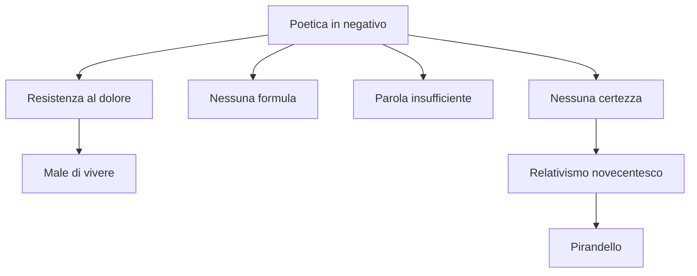
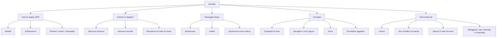

# Eugenio Montale — Riassunto per la maturità

---

## Coordinate essenziali

| Elemento | Dettaglio |
|----------|-----------|
| **Nascita** | **1896**; autore ligure, legato fin dall'infanzia alle estati a **Monterosso** nelle Cinque Terre |
| **Profilo** | **Poeta**, ma anche **giornalista** e **saggista**: all'esame può capitare un testo poetico o un testo in prosa |
| **Riconoscimento** | **Premio Nobel per la letteratura nel 1975**, anno della morte di Pasolini |
| **Formazione** | Simbolismo, Decadentismo francese, fino a **D'Annunzio**, autore imprescindibile da "attraversare" |
| **Raccolte principali** | ***Ossi di seppia***, **1925**; ***Le occasioni***, **1939**; ***La bufera e altro***, **1956**; negli anni Settanta ***Satura*** |
| **Prima raccolta** | ***Ossi di seppia***, pubblicata da **Piero Gobetti**; titolo originario ***Rottami*** |
| **Poetica** | **Poetica in negativo**: nessuna certezza, nessuna formula risolutiva; la poesia resiste al dolore e al **male di vivere** |
| **Paesaggio** | Liguria scabra, essenziale, arida; estate di sole bruciante che acceca e tortura; disarmonia uomo-natura |
| **Immagini chiave** | Campana di vetro, esilio dalla vita, io prigioniero, muraglia con cocci aguzzi, limite, varco, correlativo oggettivo |
| **Stile** | Aspro, conciso, fonosimbolico; musicalità secca, allitterazioni aspre, tecnicismi, lessico anche botanico |

---

## 1. Montale nel Novecento

Montale viene presentato come uno degli autori inevitabili del Novecento: è **Premio Nobel**, si presta a molti collegamenti e può comparire sia allo scritto sia all'orale. La sua produzione non è solo poetica: accanto alle liriche ci sono prosa, giornalismo e saggistica. Non è però un romanziere.

Le raccolte decisive sono tre: ***Ossi di seppia*** del **1925**, ***Le occasioni*** del **1939**, ***La bufera e altro*** del **1956**. *Ossi di seppia* nasce nel ventennio fascista; *Le occasioni* appartiene al periodo che precede la Seconda guerra mondiale; *La bufera e altro*, già dal titolo, allude anche all'esperienza della Seconda guerra mondiale. Negli anni Settanta esce ***Satura***, diversa in parte dalle raccolte precedenti per un tono più **ironico** e talvolta **sarcastico** verso l'Italia contemporanea. Dentro *Satura* si trova la sezione ***Xenia***, dal greco "doni votivi", dedicata alla memoria della moglie **Drusilla Tanzi**, detta **la Mosca** per le spesse lenti che indossava.

| Raccolta | Data | Coordinate da ricordare |
|----------|------|--------------------------|
| ***Ossi di seppia*** | **1925** | Prima grande raccolta; pubblicata da Gobetti; paesaggio ligure, aridità, male di vivere, poetica in negativo |
| ***Le occasioni*** | **1939** | Raccolta del periodo immediatamente precedente la Seconda guerra mondiale; in lezione è stata solo collocata cronologicamente |
| ***La bufera e altro*** | **1956** | Il titolo rimanda anche alla bufera storica della Seconda guerra mondiale; in lezione è stata solo inquadrata |
| ***Satura*** | Anni Settanta | Tono più ironico e sarcastico verso l'Italia contemporanea; contiene ***Xenia*** |
| ***Xenia*** | Sezione di *Satura* | Versi per Drusilla Tanzi, la Mosca; il titolo significa "doni votivi" |

---

## 2. D'Annunzio: autore da attraversare

La formazione di Montale passa attraverso il **Simbolismo**, il **Decadentismo francese** e soprattutto **D'Annunzio**. Montale lo considera un autore **imprescindibile** per la poesia del Novecento: non si può semplicemente ignorarlo, bisogna **attraversarlo**. Attraversare D'Annunzio significa conoscerne la forza e insieme prenderne le distanze.

La distanza è netta sul piano della poetica. Montale rifiuta il **gigantismo dell'io**, l'estetismo, il sublime, la poesia aulica e accademica, il modello del poeta-vate capace di consegnare verità alle masse. Al centro della sua poesia non ci sono piante nobili e letterarie, paesaggi magnifici o fusione panica con la natura, ma **oggetti dimessi**, paesaggi scabri, fossi, pozzanghere mezzo seccate, limoni, muri, rottami, ossi di seppia.

La distanza, però, non cancella l'eredità. Da D'Annunzio resta soprattutto una lezione **stilistica**: attenzione al **fonosimbolismo**, al valore sonoro delle parole, a un lessico anche colto, raffinato e letterario. In ***I limoni***, pur dentro una polemica antidannunziana, compaiono veri e propri calchi da ***La pioggia nel pineto***: il testo montaliano si apre con **"Ascoltami"**, poi passa a **"Vedi"**, richiamando gli imperativi dannunziani **"Taci"** e **"Ascolta"**. Montale polemizza con D'Annunzio, ma sa che D'Annunzio resta un passaggio obbligato.

| D'Annunzio | Montale |
|------------|---------|
| Poeta-vate, sublime, aulico | Poeta senza certezze, parola insufficiente |
| Panismo, fusione con la natura | Disarmonia uomo-natura |
| Piante letterarie e preziose | Fossi erbosi, pozzanghere, limoni |
| Meriggio come estasi panica | Meriggio come immobilità, sonnolenza, indifferenza |
| Fonosimbolismo e raffinatezza stilistica | Eredità sonora e lessicale, ma piegata a uno stile aspro e negativo |

---

## 3. *Ossi di seppia*: titolo, storia, antifascismo

***Ossi di seppia*** esce nel **1925**, in pieno ventennio fascista, presso **Piero Gobetti**, giovane editore antifascista poi eliminato dal regime. La scelta editoriale è significativa: la raccolta diventa per molti giovani dell'epoca una **bandiera**, quasi un manifesto dell'**antifascismo**, perché si oppone frontalmente alla retorica fascista, celebrativa, sicura, rumorosa.

Il titolo originario era ***Rottami***. Anche il titolo definitivo, ***Ossi di seppia***, rimanda alla stessa area di significato: **detrito**, **residuo**, **scarto**, ciò che resta dopo il passaggio del mare. Gli ossi di seppia sono resti marini lasciati sulla battigia. Questa immagine concentra il senso di **consumazione dell'esistenza**, di residualità e di esilio dalla pienezza della vita.

La poesia di Montale si colloca idealmente su una linea alta, da **Dante** a **Leopardi**, ma abbassa il tono rispetto a D'Annunzio: cerca una poesia forte non nel sublime, ma nelle situazioni quotidiane e negli oggetti rimasti ai margini. Gli *Ossi* sono dunque una raccolta di scarti, non perché la poesia sia povera di significato, ma perché proprio lo scarto diventa il luogo in cui si manifesta la condizione moderna dell'uomo.

---

## 4. Poetica in negativo

La formula decisiva è **poetica in negativo**. Montale non offre certezze, non possiede una verità da comunicare, non consegna formule salvifiche. In ***Non chiederci la parola*** il poeta dice esplicitamente che non bisogna chiedere alla poesia una parola capace di squadrare l'animo, illuminarlo e dichiararlo con lettere di fuoco. La poesia non apre mondi, non rivela una verità definitiva; può dare solo **"qualche storta sillaba e secca come un ramo"**.

Questo non significa che la poesia sia inutile. Proprio perché non risolve, diventa una forma di **resistenza**: resistenza al dolore, al male di vivere, all'impossibilità di aderire pienamente alla vita. Montale sente di poter sfiorare il significato dell'esistenza, ma mai di possederlo. La realtà sembra talvolta vicina a tradire il proprio segreto, ma il segreto resta sempre inafferrabile.

Il contesto culturale è quello del **relativismo novecentesco**: non c'è una verità assoluta accessibile. Il collegamento con **Pirandello** è utile proprio per questo: anche in Pirandello la verità stabile entra in crisi, l'identità è problematica, l'uomo spesso procede con maschere o paraocchi. Montale porta questa crisi dentro la poesia.

---

## 5. Esilio dalla vita, campana di vetro, io prigioniero

Uno dei temi centrali degli *Ossi* è l'**esilio del poeta dalla vita**. Montale dichiara in prosa di essersi sempre sentito come sotto una **campana di vetro**: vede la vita, la desidera, ne intuisce la pienezza, ma non riesce ad aderirvi in modo immediato, spontaneo, naturale. La campana di vetro indica separazione, isolamento, impossibilità di contatto pieno con la realtà.

Da qui nasce il senso di **estraneità**. Il poeta si sente appartenere alla **razza di chi rimane a terra**, come nella poesia *Falsetto*, dove Esterina, ragazza ventenne che si tuffa nel mare, rappresenta la pienezza vitale, la sicurezza di chi vive senza fratture. Il mare è per lei un **"divino amico"**; per Montale, invece, la pienezza resta impossibile.

L'io montaliano è un **io prigioniero**, chiuso in una negatività senza scampo. La vita è concepita come una **prigione**, segnata dal male di vivere e da una separazione fra uomo e natura che richiama il pessimismo di **Leopardi**. La tensione alla verità esiste, ma si scontra con un limite invalicabile.

L'immagine più forte del limite è la **muraglia** con in cima **cocci aguzzi di bottiglia**, ricordata a proposito di ***Meriggiare pallido e assorto***. Il muro rappresenta un confine oltre il quale forse ci sarebbe il disvelamento del mistero dell'esistenza, ma il poeta non può oltrepassarlo. Nella lezione il testo è stato solo nominato e rimandato: **non è stato analizzato** in queste lezioni, quindi va ricordato come richiamo al tema del limite, non come testo svolto in modo dettagliato.

| Immagine | Significato |
|----------|-------------|
| **Campana di vetro** | Impossibilità di aderire spontaneamente alla vita |
| **Ossi di seppia / rottami** | Scarto, residuo, consumazione, esistenza ridotta a detrito |
| **Razza di chi rimane a terra** | Incapacità di vivere la pienezza vitale rappresentata da Esterina |
| **Muraglia con cocci aguzzi** | Limite invalicabile davanti al mistero dell'esistenza |
| **Varco** | Spiraglio possibile, apparizione momentanea di senso, mai possesso definitivo |

---

## 6. Paesaggio ligure: aridità e disarmonia

Il paesaggio degli *Ossi* è soprattutto quello della **Liguria**. Montale è ligure e trascorre fin dall'infanzia le estati a **Monterosso**, nelle Cinque Terre. Ma la Liguria non viene rappresentata come paesaggio armonioso o consolante: è un luogo **scabro**, **essenziale**, dominato dall'**aridità**.

L'estate montaliana non scalda dolcemente: il sole è **bruciante**, **acceca**, **tortura**. Il paesaggio non appare nel suo vigore, ma nella sua secchezza e asprezza: fossi, canne, pozzanghere mezzo seccate, muri scalcinati, foglie riarse. L'aridità diventa segno fisico della condizione esistenziale: solitudine, esilio, disarmonia.

Il mare ha un valore ambivalente. Da un lato è il luogo della pienezza vitale, dell'indistinto, della comunione con l'**Essere** con la maiuscola; dall'altro questa pienezza è **negata** al poeta. Per questo Montale si allontana dal **panismo dannunziano**: non c'è fusione gioiosa tra io e natura, ma frattura.

---

## 7. Lingua e stile

Lo stile di Montale è **aspro** e **conciso**. I versi sono spesso difficili, con una musicalità **secca**, lontana dalla fluidità melodiosa della poesia aulica. Il suono non è ornamentale: ha valore **fonosimbolico**, cioè riproduce e rafforza il significato. Parole come **pozzanghere**, **mezzo seccate**, **strozzato**, **gorgoglia**, **incartocciarsi**, **riarsa**, con gutturali, gruppi consonantici e suoni secchi, evocano aridità, fatica, scabrezza, mancanza di linfa.

Montale usa anche **allitterazioni aspre**, **tecnicismi** e un lessico settoriale, spesso botanico. In questo ricorda in parte **Pascoli**, per l'attenzione ai nomi precisi delle cose, ma l'effetto è diverso: in Montale la precisione non costruisce un nido affettivo, bensì un mondo duro, secco, disarmonico.

| Aspetto stilistico | Funzione |
|--------------------|----------|
| **Aspro e conciso** | Rifiuto della musicalità facile e del sublime |
| **Fonosimbolismo** | I suoni incarnano aridità, scabrezza, gorgoglio, fatica |
| **Allitterazioni aspre** | Rafforzano la durezza del paesaggio e dell'esistenza |
| **Tecnicismi** | Precisione concreta, lessico non genericamente lirico |
| **Lessico botanico** | Nomi specifici di piante e oggetti naturali, spesso in funzione polemica o antiaulica |
| **Tu colloquiale** | Il poeta si rivolge direttamente al lettore: "Ascoltami", "Vedi", "Non chiederci" |

---

## 8. *I limoni*: dichiarazione di poetica

### 8.1 Contesto e polemica iniziale

***I limoni*** è un testo del **1921** e funziona come dichiarazione di poetica. Montale vi esprime il rifiuto della poesia **aulica**, **accademica**, sublime. Il primo bersaglio polemico è **D'Annunzio**. L'attacco ai **"poeti laureati"** non indica semplicemente poeti famosi: "laureati" viene da **lauro**, alloro, simbolo tradizionale della gloria poetica. Sono i poeti consacrati, ufficiali, legati a un repertorio nobile.

I poeti laureati si muovono tra piante dai nomi poco usati: **bossi**, **ligustri**, **acanti**. Non sono piante umili, ma piante della tradizione letteraria. Montale oppone a questo mondo la propria scelta: **"Io, per me"**. È una presa di distanza e insieme una rivendicazione di isolamento. Il poeta ama le strade che sboccano negli **erbosi fossi**, le pozzanghere mezzo seccate dove i ragazzi catturano qualche sparuta anguilla, le viuzze, i ciglioni, i ciuffi di canne, gli orti con gli alberi dei limoni.

La prima strofa contrappone dunque due poetiche:

| Poesia aulica | Poetica montaliana |
|---------------|--------------------|
| Poeti laureati | Io isolato, "Io, per me" |
| Bossi, ligustri, acanti | Fossi erbosi, pozzanghere, canne, orti, limoni |
| Tradizione nobile | Paesaggio dimesso e quotidiano |
| Sublime dannunziano | Tono minore e prosaico |

### 8.2 Aridità, sensi e piccola ricchezza

La descrizione non è idillica. Le **pozzanghere mezzo seccate** producono foneticamente e semanticamente un'impressione di **afa** e **aridità**. Il paesaggio ligure si presenta secco, scabro, non armonioso. Questa aridità è la forma naturale della disarmonia esistenziale.

Nella seconda strofa il dato visivo si amplia con sensazioni **uditive** e **olfattive**. Quando le gazzarre degli uccelli si spengono e l'aria quasi non si muove, si ascolta più chiaramente il sussurro dei rami e si avverte l'odore dei limoni. In quel momento l'inquietudine sembra placarsi: **"tocca anche a noi poveri la nostra parte di ricchezza"**, e questa ricchezza è proprio **l'odore dei limoni**. I "poveri" sono i poeti che non appartengono alla gloria dei laureati, ma cantano la quotidianità e le cose umili.

### 8.3 D'Annunzio attraversato: i calchi da *La pioggia nel pineto*

La polemica antidannunziana non impedisce a Montale di usare tracce stilistiche dannunziane. L'apertura **"Ascoltami"** e poi **"Vedi"** ricordano gli imperativi di ***La pioggia nel pineto***, **"Taci"** e **"Ascolta"**. La differenza è decisiva: D'Annunzio usa quegli imperativi per condurre alla fusione panica con la natura; Montale li usa per portare il lettore dentro un paesaggio dimesso, arido, in cui il segreto dell'esistenza sembra appena affiorare e subito sottrarsi.

### 8.4 Il segreto, l'anello che non tiene, il varco

Nei silenzi, le cose sembrano sul punto di **tradire il loro ultimo segreto**. Il poeta spera di scoprire uno **sbaglio di natura**, il **punto morto del mondo**, l'**anello che non tiene**, il **filo da disbrogliare** capace di metterlo "nel mezzo di una verità". La formula è importante: non **la** verità assoluta, ma **una** verità, parziale, intravista.

Queste immagini indicano una crepa nell'ordine compatto del reale. Se la realtà fosse una catena perfetta, l'anello che non tiene sarebbe il punto debole attraverso cui passare oltre; se fosse un groviglio, il filo da disbrogliare permetterebbe di capirne il senso. Ma Montale non arriva mai al possesso del mistero: il segreto è sfiorato, non conquistato.

### 8.5 La caduta dell'illusione e il ritorno dei limoni

L'ultima strofa si apre con un **"Ma"** avversativo. Proprio quando sembra manifestarsi il miracolo, **l'illusione manca**. Il tempo riporta l'uomo nelle **città rumorose**, dove l'azzurro del cielo si vede solo a pezzi, in alto, tra le **cimase**, cioè i cornicioni dei palazzi. Seguono immagini invernali: la pioggia stanca la terra, il tedio dell'inverno si addensa sulle case, la luce si fa avara e l'anima amara.

Poi, da un **malchiuso portone**, tra gli alberi di una corte, appaiono i **gialli dei limoni**. È qui che si apre un **varco**: il gelo del cuore si scioglie e in petto scrosciano le canzoni dei limoni, definiti **"trombe d'oro della solarità"**. Il giallo dei limoni non consegna la salvezza definitiva, ma è un segnale positivo, un'apparizione improvvisa di senso dentro il grigiore della città e dell'inverno.

### 8.6 Correlativo oggettivo

I limoni sono un esempio di **correlativo oggettivo**: oggetti fisici e concreti che si caricano di significato metafisico. L'oggetto non è solo decorazione: diventa il segno tangibile di una condizione astratta dell'esistenza. I limoni incarnano la tensione alla verità, la richiesta di senso, la possibilità del varco; ma questa tensione resta senza esito definitivo.

---

## 9. *Non chiederci la parola*: poetica in negativo

***Non chiederci la parola***, del **1923**, è uno dei testi fondamentali degli *Ossi di seppia* e una vera dichiarazione di poetica. Il titolo coincide con il primo verso e contiene già la negazione: non chiedere ai poeti una parola capace di spiegare tutto.

La prima strofa rifiuta l'idea di una parola poetica ordinatrice. Non bisogna chiedere una parola che **"squadri da ogni lato"** l'animo informe, cioè che renda regolare e comprensibile il caos interiore, né che lo dichiari a **lettere di fuoco**, illuminandolo in modo definitivo. L'immagine del **croco** che risplende in un **polveroso prato** è una similitudine e insieme un contrasto cromatico: il giallo vivo del fiore risalta in un prato non verde e rigoglioso, ma polveroso, arido, insolito.

La seconda strofa introduce l'uomo **sicuro**. "Sicuro" deriva dal latino *sine cura*, cioè **senza preoccupazione**. L'uomo che se ne va sicuro è colui che attraversa la vita senza dubbi, in pace con gli altri e con sé stesso, senza curare la propria ombra stampata dalla canicola su un muro scalcinato. È il **conformista**: si adegua ai modelli imposti, non si pone domande, procede come con paraocchi. Qui il collegamento con **Pirandello** è esplicito: chi non si interroga può sembrare felice, ma solo perché evita la crisi che nasce dal guardare davvero la realtà.

L'ombra rappresenta la parte inquieta, conflittuale, problematica dell'io. L'uomo sicuro non la cura, non la guarda. Montale, invece, appartiene alla coscienza che non può ignorare il disagio.

La terza strofa riprende la negazione: **"Non domandarci la formula che mondi possa aprirti"**. La poesia non possiede una formula magica, non apre mondi, non rivela la verità come faceva il poeta-vate. Può dare solo **"qualche storta sillaba e secca come un ramo"**: la parola poetica è ridotta quasi a **balbettìo**, storta, secca, arida. La conclusione è la formula più celebre della poetica montaliana: **"ciò che non siamo, ciò che non vogliamo"**. La conoscenza è possibile solo in negativo.

| Verso / immagine | Significato |
|------------------|-------------|
| **Non chiederci la parola** | Rifiuto della poesia come verità assoluta |
| **Animo nostro informe** | Interiorità caotica, non ordinabile del tutto |
| **Lettere di fuoco** | Parola illuminante e definitiva, negata da Montale |
| **Croco nel polveroso prato** | Immagine luminosa dentro aridità e polvere |
| **Uomo sicuro** | Conformista, senza dubbi, *sine cura* |
| **Ombra** | Parte inquieta e conflittuale dell'io |
| **Formula che mondi possa aprirti** | Verità rivelatrice che la poesia non può dare |
| **Storta sillaba e secca come un ramo** | Parola povera, arida, non salvifica |
| **Ciò che non siamo, ciò che non vogliamo** | Conoscenza solo negativa |

---

## 10. *Spesso il male di vivere ho incontrato*

### 10.1 Struttura e correlativi del male

***Spesso il male di vivere ho incontrato*** è un testo cardine della poetica montaliana. Il componimento è diviso in due parti. Nella prima strofa compaiono i **correlativi oggettivi** del **male di vivere**: il **rivo strozzato che gorgoglia**, l'**incartocciarsi della foglia riarsa**, il **cavallo stramazzato**. Sono oggetti e immagini fisiche che rimandano a una condizione metafisica: la vita è attraversata da dolore, fatica, impedimento, esaurimento.

L'inizio **"Spesso il male di vivere ho incontrato"** contiene un'**anastrofe**, perché l'ordine normale sarebbe "ho incontrato spesso il male di vivere". Il male non è un'idea astratta dichiarata in modo teorico: viene incontrato nelle cose.

| Correlativo oggettivo | Regno / ambito | Significato |
|-----------------------|----------------|-------------|
| **Rivo strozzato che gorgoglia** | Acqua / natura fisica | Vita impedita, flusso bloccato, sofferenza sonora |
| **Foglia riarsa che si incartoccia** | Vegetale | Mancanza di linfa, secchezza, aridità |
| **Cavallo stramazzato** | Animale | Crollo, fatica, vita spezzata |

Attraverso tre immagini Montale mostra che il male riguarda tutte le forme della vita: corso d'acqua, vegetale, animale. La lezione lo collega a **Leopardi**, in particolare al passo del **giardino nello *Zibaldone***, dove il dolore attraversa l'intera natura; un collegamento possibile è anche con ***La ginestra***, ma il riferimento centrale indicato è lo *Zibaldone*.

### 10.2 Fonosimbolismo del dolore

Il testo lavora fortemente sul **fonosimbolismo**. **"Rivo strozzato che gorgoglia"** contiene suoni gutturali e cupi; **"incartocciarsi"** e **"riarsa"** hanno suoni secchi che rendono la scabrezza e la mancanza di linfa della foglia. Il suono partecipa al significato: non abbellisce il male, lo fa sentire.

### 10.3 Il solo bene: divina Indifferenza

La seconda parte introduce l'unico bene conosciuto: **"Bene non seppi, fuori del prodigio / che schiude la divina Indifferenza"**. La parafrasi è: non conobbi altro bene se non il prodigio che l'indifferenza fa nascere. L'**Indifferenza** è detta **divina** non perché in Montale ci sia Dio, ma perché è propria di una dimensione non toccata dalle miserie del mondo. La lezione insiste: **non c'è Dio in Montale**, la prospettiva resta laica e immanente.

L'indifferenza è simile a un'**atarassia**, un'autosufficienza interiore, un distacco dal male del mondo. Non è felicità positiva, ma sospensione dal dolore.

I correlativi oggettivi dell'indifferenza sono tre: la **statua nella sonnolenza del meriggio**, la **nuvola**, il **falco alto levato**.

| Correlativo dell'Indifferenza | Significato |
|-------------------------------|-------------|
| **Statua** | Fredda, marmorea, immobile, insensibile; non partecipa al dolore |
| **Meriggio** | Mezzogiorno; in Montale immobilità e sonnolenza, non estasi panica |
| **Nuvola** | Altezza, distacco dalle miserie umane |
| **Falco alto levato** | Elevazione, lontananza, separazione dal male del mondo |

Il **meriggio** permette un altro confronto con D'Annunzio. In **Alcyone**, e in generale nella poesia dannunziana, il meriggio è momento privilegiato dell'**estasi panica**. In Montale, invece, il meriggio è immobilità, sonnolenza, indifferenza. La statua è ancorata alla terra; nuvola e falco stanno in alto, staccati dalle sofferenze umane. Il bene possibile non è partecipazione piena alla vita, ma distanza.

Il collegamento con **Leopardi** ritorna anche qui: l'immagine della divinità lontana e indifferente richiama la **luna** del ***Canto notturno di un pastore errante dell'Asia***, non quella dei piccoli idilli. È una presenza superiore e distante, non consolante.

---

## 11. Correlativo oggettivo

Il **correlativo oggettivo** è un procedimento centrale della poetica montaliana: un oggetto fisico, concreto, tangibile diventa il segno di una condizione astratta, esistenziale o metafisica. Montale non spiega psicologicamente il dolore in modo diretto; lo fa vedere in un rivo strozzato, una foglia riarsa, un cavallo stramazzato. Non definisce il varco in astratto; lo concentra nel giallo dei limoni intravisti da un malchiuso portone.

| Oggetto / immagine | Valore astratto |
|--------------------|-----------------|
| **Limoni** | Varco, richiesta di senso, apparizione momentanea di solarità |
| **Rivo strozzato** | Male di vivere come impedimento e soffocamento |
| **Foglia riarsa** | Aridità, mancanza di linfa vitale |
| **Cavallo stramazzato** | Fatica e crollo della vita animale |
| **Statua, nuvola, falco** | Divina Indifferenza, distacco dal dolore |
| **Muraglia con cocci aguzzi** | Limite invalicabile davanti al mistero |

Il correlativo oggettivo è coerente con la poetica in negativo: la poesia non dà la formula del mondo, ma mostra oggetti che incarnano una domanda, una ferita, un limite.

---

## 12. Collegamenti utili

| Collegamento | Perché serve |
|--------------|--------------|
| **Leopardi** | Male di vivere, dolore diffuso in tutta la natura, pessimismo, separazione uomo-natura; richiamo al giardino dello *Zibaldone* e alla luna del *Canto notturno* |
| **Pirandello** | Relativismo novecentesco, crisi della verità, uomo conformista che procede senza interrogarsi; immagine dei paraocchi richiamata nella lezione |
| **D'Annunzio** | Autore imprescindibile da attraversare; polemica contro sublime, aulico, panismo e poeta-vate; eredità stilistica e fonosimbolica; calchi da *La pioggia nel pineto* in *I limoni* |
| **Pascoli** | Lessico botanico e precisione terminologica; attenzione ai nomi concreti, ma in Montale senza nido consolatorio |
| **Fascismo** | *Ossi di seppia* esce nel 1925 da Gobetti e diventa per i giovani una bandiera antifascista, opposta alla retorica celebrativa del regime |

---

## 13. Schema finale

