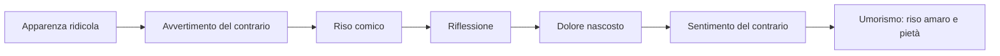
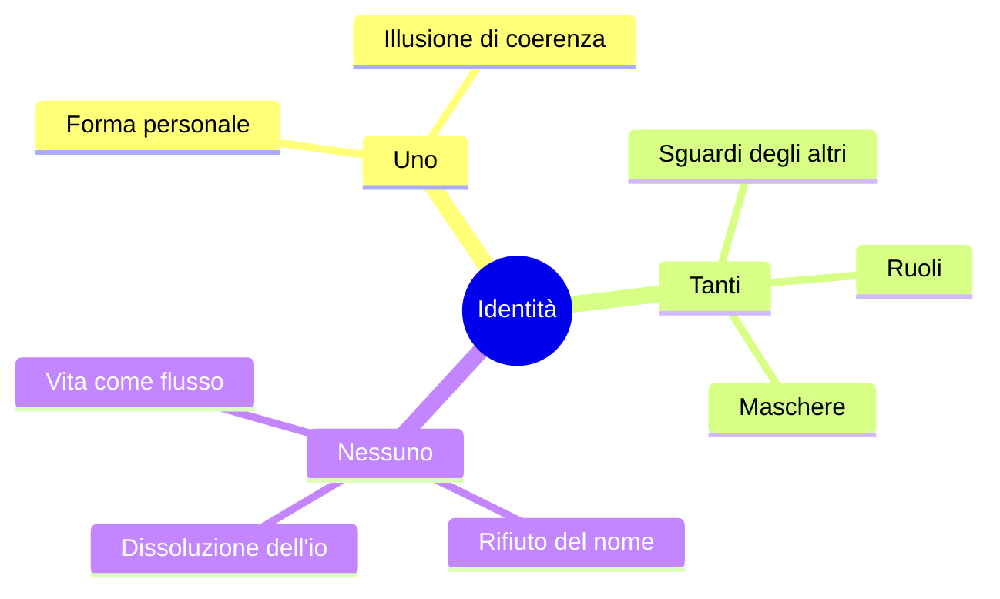
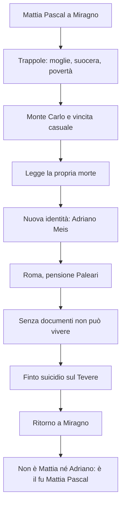
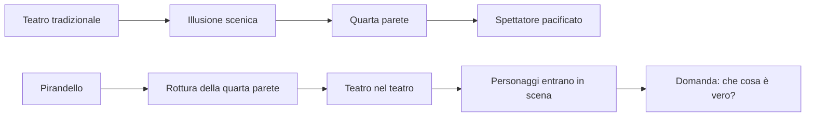
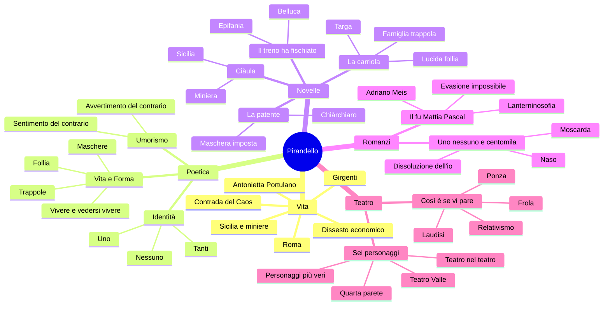

# Luigi Pirandello

---

## Coordinate essenziali

| Elemento | Dettaglio |
|----------|-----------|
| **Nome** | Luigi Pirandello |
| **Nascita** | 1867, **Girgenti** / Agrigento, nella **contrada del Caos** |
| **Morte** | 1936, Roma |
| **Luoghi decisivi** | Sicilia · Bonn · Roma |
| **Professione** | Scrittore, professore alla Facoltà di Magistero, autore di novelle, romanzi, saggi e teatro |
| **Famiglia** | Sposa **Antonietta Portulano**, poi colpita da gravi crisi nervose e ricoverata |
| **Crisi economica** | Allagamento delle **miniere di zolfo** del padre e perdita della dote della moglie |
| **Opere chiave** | *L'umorismo*, *Novelle per un anno*, *Il fu Mattia Pascal*, *Uno, nessuno e centomila*, *Così è (se vi pare)*, *Sei personaggi in cerca d'autore* |

Pirandello va studiato come autore della **crisi dell'identità**, della **verità soggettiva** e della frattura tra ciò che l'uomo sente di essere e la forma che la società gli impone. La sua opera smonta l'idea che esista un io stabile, una realtà unica e una verità oggettiva valida per tutti.

La sua grande domanda è sempre la stessa: che cosa resta dell'uomo quando scopre che il nome, il ruolo sociale, la famiglia, il lavoro e perfino l'immagine che ha di sé non coincidono con la vita autentica? Da questa domanda nascono l'umorismo, le maschere, la follia, i personaggi doppi o frantumati e il teatro che mette in crisi lo spettatore.

---

## 1. Vita, luoghi e origine dei temi

Pirandello nasce in Sicilia, a **Girgenti**, nella **contrada del Caos**. Il nome del luogo assume un valore simbolico: il caos richiama bene un autore che mette in discussione ordine, identità, logica e verità. La Sicilia resta importante non solo come radice biografica, ma anche come spazio narrativo: il mondo delle miniere e dei carusi ritorna, per esempio, in ***Ciàula scopre la luna***.

Studia anche a **Bonn**, dove discute una tesi sul dialetto agrigentino, poi vive a **Roma**, dove insegna e scrive. Sposa **Antonietta Portulano**, la cui malattia nervosa, segnata anche da gelosia patologica e accuse irrazionali, porta Pirandello a conoscere da vicino la **follia**. Per questo la pazzia, nelle sue opere, non è un tema astratto: è una frattura vissuta dentro la famiglia e poi trasformata in materia letteraria.

Un altro evento decisivo è il **dissesto economico**: l'allagamento delle miniere di zolfo del padre causa la perdita della dote della moglie. Pirandello deve scrivere anche per necessità materiale. ***Il fu Mattia Pascal*** nasce proprio in questa fase, mentre assiste la moglie malata.

La biografia va quindi riassunta, ma non separata dalle opere. La Sicilia spiega l'ambiente chiuso e arcaico di alcune novelle; la malattia della moglie spiega l'attenzione per la follia e per la famiglia non idilliaca; il dissesto economico mostra che la scrittura è anche fatica concreta; Roma e il teatro spiegano la maturazione di una poetica moderna, capace di rompere le forme tradizionali.

| Dato biografico | Valore nell'opera |
|-----------------|-------------------|
| **Contrada del Caos** | Simbolo di crisi dell'ordine e delle certezze |
| **Sicilia e miniere** | Ambiente duro, chiuso, legato a *Ciàula* e al mondo dei carusi |
| **Bonn** | Formazione filologica e apertura europea |
| **Roma** | Insegnamento e maturazione letteraria |
| **Malattia della moglie** | Esperienza concreta della follia e della famiglia come possibile trappola |
| **Dissesto economico** | Scrittura come lavoro e necessità, oltre che vocazione |

### Cronologia minima

| Anno | Evento / opera |
|------|----------------|
| **1867** | Nasce a Girgenti, nella contrada del Caos |
| **1903-1904** | *Il fu Mattia Pascal*, prima a puntate e poi in volume |
| **1908** | Pubblica *L'umorismo* |
| **1917** | *Così è (se vi pare)* |
| **1921** | *Sei personaggi in cerca d'autore*, Teatro Valle di Roma |
| **1926** | *Uno, nessuno e centomila* |
| **1936** | Muore a Roma |

---

## 2. *L'umorismo*: dal riso alla pietà

Nel 1908 Pirandello pubblica ***L'umorismo***, saggio fondamentale per capire tutta la sua poetica. L'arte non deve fermarsi all'apparenza, ma deve **scomporre il reale**: dietro ciò che sembra normale, ridicolo o assurdo, deve scoprire il dolore nascosto, la contraddizione, la maschera.

L'esempio più famoso è quello della **vecchia signora imbellettata**. A prima vista fa ridere: è anziana, ma si trucca e si veste in modo giovanile e vistoso. Questo primo livello è il **comico**, cioè l'**avvertimento del contrario**: vedo qualcosa che contraddice ciò che mi aspetterei.

Se però interviene la riflessione, il riso cambia. Forse quella donna non si veste così per piacere, ma per trattenere l'amore di un marito più giovane. Allora il ridicolo rivela una sofferenza: nasce l'**umorismo**, cioè il **sentimento del contrario**.

| Livello | Che cosa accade | Effetto |
|---------|-----------------|---------|
| **Avvertimento del contrario** | Noto qualcosa di fuori posto | Riso comico |
| **Riflessione** | Mi chiedo che cosa ci sia dietro | Il riso si incrina |
| **Sentimento del contrario** | Scopro il dolore nascosto | Pietà, amarezza, riso pensoso |

Nelle novelle pirandelliane questo meccanismo è continuo: Belluca sembra pazzo, Chiàrchiaro sembra grottesco, il protagonista della *Carriola* sembra ridicolo. Ma appena si capisce la loro prigione, il comico diventa tragico.

L'umorismo è dunque diverso dalla semplice comicità. Il comico resta alla superficie e ride della contraddizione; l'umorismo scende sotto la superficie e scopre che quella contraddizione nasce spesso da un dolore. Per questo il riso pirandelliano è quasi sempre instabile: comincia come riso, ma diventa disagio, compassione e pensiero.

---

## 3. Vita e Forma

Il centro della poetica pirandelliana è il contrasto tra **Vita** e **Forma**.

La **Vita** è movimento continuo, eterno divenire, flusso indistinto, quasi un **magma vulcanico**. Non è ordinata, stabile, definibile. La **Forma**, invece, è tutto ciò che fissa l'individuo: nome, cognome, ruolo, professione, immagine sociale, idea di sé.

| Vita | Forma |
|------|-------|
| Movimento | Fissazione |
| Possibilità | Ruolo |
| Flusso | Maschera |
| Autenticità non definita | Identità riconoscibile |
| Divenire | Cristallizzazione |

Per vivere in società dobbiamo avere una forma: essere studenti, insegnanti, figli, genitori, mariti, mogli, professionisti. Però ogni forma è anche una gabbia, perché riduce la vita a una figura rigida. Da qui la formula decisiva: **ogni forma è una morte**.

Pirandello chiama **trappole** le istituzioni e i ruoli che imprigionano l'uomo:

| Trappola | Perché imprigiona |
|----------|-------------------|
| **Famiglia** | Impone ruoli, doveri, segreti, rancori; può diventare una "stanza della tortura" |
| **Lavoro** | Riduce la persona a funzione |
| **Società** | Pretende coerenza, normalità, rispettabilità |
| **Nome** | Chiude l'identità in una definizione fissa |

Chi rifiuta la forma appare **pazzo**, perché viola le regole della convivenza sociale. Ma il pazzo pirandelliano può essere più vicino alla Vita: non accetta più la maschera che gli altri gli impongono.

La forma non è soltanto ciò che scegliamo. Ognuno si costruisce un'immagine in cui vuole riconoscersi, ma gli altri gli attribuiscono continuamente immagini diverse. Per un professore gli alunni sono studenti; per gli alunni lui è insegnante; per la famiglia è padre, madre, figlio, marito o moglie. Ogni prospettiva contiene qualcosa, ma nessuna contiene la vita intera della persona.

### Vivere e vedersi vivere

Un'altra opposizione fondamentale è tra **vivere** e **vedersi vivere**. Chi vive davvero aderisce alla vita senza osservarsi dall'esterno. Chi invece si guarda vivere scopre la distanza tra la propria vita autentica e la forma che indossa. Da quel momento non può più tornare alla spontaneità.

La formula da ricordare è: **"Chi vive, quando vive, non si vede vivere"**. Se una persona vede la propria vita, significa che non la vive più: la subisce. Per questo **conoscersi è morire**: conoscere se stessi significa vedere la forma in cui ci si è irrigiditi.

---

## 4. Identità: uno, tanti, nessuno

Pirandello vive nel clima culturale del primo Novecento, segnato dalla crisi delle certezze positivistiche, dalla psicoanalisi di **Freud** e soprattutto dagli studi di **Alfred Binet** sulle personalità molteplici. Binet sosteneva che nell'individuo possano convivere più persone ignote a lui stesso.

Pirandello traduce questa idea in letteratura: noi crediamo di essere **uno**, ma in realtà siamo **tanti**, perché ogni persona ci vede in modo diverso. Se poi rifiutiamo tutte le forme, diventiamo **nessuno**.

| Formula | Significato |
|---------|-------------|
| **Uno** | L'identità coerente che crediamo di avere |
| **Tanti / centomila** | Le immagini diverse che gli altri costruiscono di noi |
| **Nessuno** | L'io che si dissolve quando rifiuta ogni forma |

Questa visione collega Pirandello al **romanzo del Novecento**: l'eroe compatto dell'Ottocento scompare e al suo posto troviamo personaggi problematici, inadatti, coscienti della propria crisi. Il confronto con **Svevo** è utile: Zeno e Mattia Pascal sono narratori di sé stessi, riflettono troppo, mescolano verità e menzogne. Svevo insiste sulla malattia e sull'inettitudine; Pirandello sulla maschera, sulla forma e sulla frantumazione dell'io.

---

## 5. Le novelle

### 5.1 *Il treno ha fischiato*

Il protagonista è **Belluca**, un contabile e **impiegato** modello: puntuale, obbediente, diligente. Un giorno arriva in ufficio in ritardo e farnetica dicendo di aver sentito **il treno fischiare**. I colleghi lo giudicano pazzo perché rompe la forma in cui lo avevano chiuso.

Poi si scopre la sua vita: Belluca è schiacciato dal lavoro e da una famiglia pesantissima, fatta di doveri, malattie, donne da mantenere, assenza di respiro. Il fischio del treno è reale, non allucinato; diventa però un'**epifania**, perché gli rivela l'esistenza di viaggi, terre lontane, possibilità, immaginazione.

| Elemento | Significato |
|----------|-------------|
| **Belluca impiegato** | Forma sociale del lavoratore silenzioso |
| **Fischio del treno** | Epifania uditiva, apertura verso la Vita |
| **Giudizio dei colleghi** | La società chiama follia ciò che rompe la maschera |
| **Umorismo** | Prima sembra ridicolo; poi si scopre la tragedia |

Belluca non fugge davvero, ma ottiene almeno una libertà mentale: può allontanarsi con l'immaginazione dalla sua prigione quotidiana.

### 5.2 *La carriola*

Il protagonista è un uomo rispettabile: marito, padre, professore di diritto, avvocato, cittadino stimato. Proprio questa rispettabilità è la sua prigione. La novella inizia **in medias res**, con il narratore che allude a un atto segreto e pericoloso: se fosse scoperto, sarebbe giudicato pazzo.

Nel flashback, tornando da **Perugia** in treno, il protagonista alza gli occhi dalle carte di lavoro e percepisce il **brulichio di una vita diversa**, una vita possibile ma mai vissuta. Poi, davanti alla porta di casa, legge sulla targa il proprio nome e i propri titoli: si vede dall'esterno e non si riconosce. Capisce che quell'uomo rispettato non è la sua vita, ma una forma costruita da società, famiglia, lavoro e aspettative.

La targa è un oggetto simbolico: raccoglie nome, titoli, prestigio e identità pubblica. Proprio davanti a quella targa il protagonista capisce di essere diventato un personaggio per gli altri. La sua vita sembra completa e rispettabile, ma dentro è morta, perché è stata sostituita da una funzione sociale.

La famiglia appare come **trappola**, addirittura come "stanza della tortura": non perché manchi l'affetto, ma perché i ruoli familiari possono soffocare. Il lavoro è trappola perché riduce l'individuo a funzione; la società perché pretende normalità.

Il gesto liberatorio è assurdo e minimo: prende la vecchia cagnetta per le zampe posteriori e le fa fare **la carriola**. Non le fa male, ma per un professore e avvocato quel gioco è scandaloso. È una **lucida follia**: comica all'apparenza, tragica perché rivela un uomo schiacciato da una forma morta.

Il gesto è tanto più significativo quanto più è piccolo. Non è una ribellione eroica, non cambia davvero la sua vita e non lo libera stabilmente. Gli concede solo un istante fuori dalla maschera. Proprio per questo è pirandelliano: mostra che l'uomo può intravedere la Vita, ma resta quasi sempre imprigionato nella Forma.

### 5.3 *La patente*

***La patente*** è una novella grottesca e umoristica. Il protagonista, **Rosario Chiàrchiaro**, è considerato da tutti uno **iettatore**. Questa superstizione lo ha rovinato: nessuno vuole avere rapporti con lui, la sua famiglia è in miseria, la moglie è paralitica e le figlie devono essere mantenute.

La vicenda parte **in medias res**: il giudice **D'Andrea** esamina la querela che Chiàrchiaro ha presentato contro due uomini che facevano scongiuri al suo passaggio. D'Andrea vorrebbe convincerlo a ritirarla, ma Chiàrchiaro vuole paradossalmente **perdere**. Desidera che il tribunale riconosca ufficialmente la sua fama di iettatore, così da ottenere una vera **patente** e trasformare la maschera subita in mestiere.

| Livello | Contenuto |
|---------|-----------|
| **Comico** | Chiàrchiaro si veste e si comporta da iettatore |
| **Tragico** | Non crede alla superstizione, ma ne è stato distrutto |
| **Umoristico** | Il riso diventa pietà davanti alla miseria familiare |
| **Tema** | La maschera imposta dagli altri diventa gabbia e unica possibilità di sopravvivenza |

### 5.4 *Ciàula scopre la luna*

*Ciàula scopre la luna* va ricordata come collegamento alla **Sicilia** e al mondo delle **miniere**. Ciàula è un caruso, vicino per ambiente a *Rosso Malpelo*, ma Pirandello non resta dentro un verismo positivistico: il suo sguardo è più simbolico, psicologico e umoristico.

---

## 6. I romanzi

### 6.1 *L'esclusa*

***L'esclusa*** è il primo romanzo di Pirandello e conserva residui naturalistici. È importante soprattutto come punto di partenza: ci sono già il giudizio collettivo, l'esclusione dell'individuo e il peso della società, ma la piena rivoluzione pirandelliana arriverà con *Il fu Mattia Pascal*.

### 6.2 *Il fu Mattia Pascal*

***Il fu Mattia Pascal*** viene pubblicato a puntate nel **1903** e in volume nel **1904**. È un romanzo centrale sulla crisi dell'identità e sull'impossibilità di evadere dalle forme sociali.

Mattia Pascal vive a **Miragno**, paese immaginario della Liguria. La sua vita è una trappola: moglie non amata, suocera invadente, problemi economici. Si allontana, va a **Monte Carlo** e vince al casinò per caso. Poco dopo legge sul giornale che un cadavere suicida è stato identificato come lui.

Decide allora di sfruttare l'equivoco: se Mattia Pascal è morto, può inventarsi una nuova vita. Assume l'identità di **Adriano Meis**, viaggia e poi si stabilisce a Roma nella pensione di **Anselmo Paleari**, appassionato di teosofia e spiritismo. Per cancellare un segno del vecchio io si opera anche all'**occhio strabico**, simbolo di una visione obliqua e non pacificata.

#### La Lanterninosofia

Durante la convalescenza di Adriano Meis, Anselmo Paleari espone la **Lanterninosofia**. Ogni individuo possiede un piccolo **lanternino**, che illumina solo una parte limitata della realtà e rende visibile il buio circostante. Non vediamo la realtà in sé, ma ciò che il nostro lume ci permette di vedere.

Le masse, invece, seguono grandi **lanternoni** collettivi: fede religiosa, fiducia nella scienza, ideologie politiche. Nei periodi di crisi questi lanternoni si spengono e resta il caos. La teoria esprime il **relativismo gnoseologico**: la realtà non è conoscibile in modo unico, oggettivo e definitivo.

Questa visione supera il **Positivismo**, perché nega la conoscibilità razionale e oggettiva del reale, e supera anche il **Decadentismo**, perché non garantisce nemmeno l'esistenza di una realtà profonda e unitaria da decifrare.

La Lanterninosofia è uno dei passaggi più utili per l'orale perché concentra molti temi: relativismo, crisi delle certezze ottocentesche, fine della fiducia nella scienza come spiegazione assoluta, solitudine dell'individuo moderno. Ognuno vede poco e vede a modo proprio; quando le grandi luci comuni si spengono, non resta una verità più alta, ma il buio.

#### Il fallimento dell'evasione

Adriano Meis scopre che senza documenti non si può vivere: non può sposare la donna amata, denunciare un furto, possedere diritti, esistere giuridicamente. Allora inscena un suicidio lasciando cappello e bastone sul Tevere e torna a Miragno.

Ma la vita è andata avanti: la moglie si è risposata, il paese non può reintegrarlo, la vecchia identità è perduta. Mattia non può più essere Mattia e non può essere Adriano. Resta **il fu Mattia Pascal**, un morto-vivo che visita la propria tomba e vive sospeso in una biblioteca polverosa.

Il titolo è quindi già una conclusione: "fu" indica qualcuno che è stato e non è più. Mattia non muore biologicamente, ma muore socialmente. Non possiede una forma valida; è escluso dal flusso normale della vita e resta in una condizione paradossale.

| Aspetto | Significato |
|---------|-------------|
| **Narratore-personaggio** | Mattia racconta la propria storia a distanza di tempo |
| **Narratore inattendibile** | Mescola verità, menzogne, autoinganni |
| **Coscienza ipertrofica** | Pensa troppo, si osserva, non vive spontaneamente |
| **Caso** | La vicenda procede per eventi fortuiti |
| **Occhio strabico** | Segno della visione obliqua |
| **Conclusione** | Dentro le forme si soffoca, ma fuori dalle forme non si vive |

La formula conclusiva è netta: **evadere è impossibile**.

### 6.3 *Uno, nessuno e centomila*

In ***Uno, nessuno e centomila*** la crisi dell'identità diventa totale. Se in *Il fu Mattia Pascal* c'era lo sdoppiamento Mattia / Adriano, qui c'è la frantumazione completa dell'io.

Il protagonista è **Vitangelo Moscarda**, detto **Gengè**. Tutto nasce da un dettaglio minimo: la moglie gli fa notare che il suo naso pende da una parte. Moscarda non lo sapeva. Capisce allora che l'immagine che ha di sé non coincide con quella degli altri.

Da qui nasce la scoperta decisiva:

- io credo di essere **uno**;
- per ogni persona sono un Moscarda diverso, quindi sono **centomila**;
- se rifiuto tutte queste immagini, divento **nessuno**.

Moscarda rifiuta beni, ruolo sociale, nome, proprietà e identità stabile. Il nome è la prima trappola, perché "conclude" una vita che invece dovrebbe restare flusso. Il finale richiama il **panismo**, ma in modo rovesciato rispetto a **D'Annunzio**: in D'Annunzio la fusione con la natura esalta l'io superomistico; in Pirandello significa annullamento dell'io, dissoluzione nella Vita, rifiuto della forma personale.

Il romanzo è l'approdo più radicale della poetica pirandelliana. Mattia Pascal cerca di cambiare forma e fallisce; Moscarda prova a distruggere ogni forma. Per questo *Uno, nessuno e centomila* porta oltre lo sdoppiamento: non c'è più soltanto un io doppio, ma un io moltiplicato dagli sguardi e infine dissolto.

---

## 7. Il teatro

Pirandello arriva al teatro in età matura e lo trasforma in uno strumento di crisi. Il teatro tradizionale tendeva a creare illusione e a pacificare lo spettatore; Pirandello, invece, vuole distruggere le certezze, mostrare i meccanismi della finzione e costringere il pubblico a interrogarsi.

Questa rivoluzione teatrale è coerente con tutta la sua poetica. Se nella vita la realtà è sempre filtrata da maschere e punti di vista, anche il teatro non può più fingere di offrire una realtà chiusa e ordinata. Deve mostrare la propria costruzione, rompere l'illusione e far vedere che anche la scena è una forma problematica.

### 7.1 *Così è (se vi pare)*

***Così è (se vi pare)***, del **1917**, nasce dalla novella *La signora Frola e il signor Ponza suo genero*. In un paese arrivano il signor Ponza, sua moglie e la signora Frola. La comunità vuole sapere chi sia davvero la donna.

| Personaggio | Verità sostenuta |
|-------------|------------------|
| **Signora Frola** | La donna è sua figlia; Ponza è pazzo perché la crede una seconda moglie |
| **Signor Ponza** | La figlia della signora Frola è morta; la donna è la sua seconda moglie; Frola è pazza |

Le due versioni sono inconciliabili. Gli abitanti del paese pretendono una verità oggettiva e infieriscono sui personaggi, senza rispettare il dolore e la pietà reciproca che forse li tiene in vita. Nel dramma compare **Laudisi**, alter ego di Pirandello, che con ironia smonta la sicurezza di chi crede di poter possedere la verità.

La formula finale è: **"Io sono colei che mi si crede."** Non viene rivelata una verità unica: l'identità dipende dagli sguardi. È il **relativismo gnoseologico**, cioè l'idea che esistano tante verità quanti sono i punti di vista.

Il dramma è importante anche perché mostra la violenza della curiosità collettiva. Il paese vuole sapere per possedere una verità, ma non si cura della sofferenza di Frola e Ponza. Pirandello mette quindi in discussione non solo la conoscenza, ma anche il diritto morale di pretendere una verità quando quella verità distrugge chi la vive.

### 7.2 *Sei personaggi in cerca d'autore*

***Sei personaggi in cerca d'autore*** va in scena nel **1921** al **Teatro Valle** di Roma. La prima reazione del pubblico è violenta: molti gridano **"manicomio!"** e Pirandello deve uscire dall'ingresso secondario. Poco dopo, però, l'opera diventa un successo europeo.

L'opera è rivoluzionaria perché rompe l'illusione scenica:

- cade la **quarta parete**;
- il teatro mostra sé stesso;
- la scena inizia con attrezzisti, tecnici e attori;
- la compagnia sta provando *Il giuoco delle parti*;
- gli attori criticano ironicamente le commedie di Pirandello;
- irrompono sei personaggi in cerca di un autore;
- nasce il **teatro nel teatro**.

I sei personaggi portano un dramma che non ha trovato forma artistica. Sono giudicati pazzi dagli attori, ma ribaltano l'accusa: la vita è piena di assurdità vere, mentre il teatro costruisce assurdità verosimili. La questione centrale diventa: chi è più vero, l'uomo o il personaggio?

La scena iniziale è già una dichiarazione di poetica: non vediamo un mondo finto presentato come reale, ma un teatro che sta preparando un altro teatro. Gli attori sono attori, il capocomico è capocomico, gli attrezzisti sono visibili. Lo spettatore non può abbandonarsi all'illusione, perché viene continuamente riportato al problema della rappresentazione.

| Uomini / attori | Personaggi |
|-----------------|-------------|
| Vivono biologicamente | Vivono artisticamente |
| Cambiano e muoiono | Restano fissati in una forma |
| Recitano parti | Sono la propria parte |
| Appaiono reali | Possono essere più veri |

La frase-idea è che i personaggi sono **"meno reali forse, ma più veri"**. Il paradosso è profondamente pirandelliano: nella vita la forma imprigiona e uccide, ma nell'arte può dare durata.

Il confronto tra uomini e personaggi chiarisce il paradosso della Forma. Nella società la forma è morte, perché blocca il flusso vitale in un ruolo. Nell'arte, invece, la forma può diventare durata: Don Abbondio o Sancho Panza non sono uomini vivi, ma continuano a esistere nella fantasia dei lettori. Il personaggio, una volta compiuto, può sopravvivere più dell'uomo.

---

## 8. Collegamenti per l'orale

| Collegamento | Come usarlo |
|--------------|-------------|
| **Svevo** | Romanzo del Novecento, narratore inattendibile, coscienza ipertrofica, personaggi non eroici |
| **Romanzo del Novecento** | Crisi dell'io, interiorità problematica, fine dell'eroe ottocentesco, soggettività |
| **Positivismo** | Pirandello lo supera: la realtà non è conoscibile oggettivamente dalla ragione |
| **Decadentismo** | Parte dalla crisi del Positivismo, ma va oltre: non esiste una realtà unitaria stabile |
| **D'Annunzio** | Panismo rovesciato: non esaltazione dell'io, ma annullamento in *Uno, nessuno e centomila* |
| **Freud** | Inconscio e pulsioni represse come sfondo culturale |
| **Binet** | Influenza più diretta: personalità molteplici, coesistenza di più io |
| **Teatro moderno** | Rottura della quarta parete, teatro nel teatro, crisi dello spettatore |

---

## 9. Quadro finale

Pirandello mostra che l'uomo non possiede un'identità unica: vive dentro forme sociali necessarie ma soffocanti, indossa maschere, viene definito dagli sguardi altrui e non può raggiungere una verità oggettiva stabile. L'umorismo nasce proprio da questa frattura: ciò che sembra comico rivela una sofferenza. Le novelle, i romanzi e il teatro portano sempre allo stesso nodo: la Vita è flusso, la Forma è prigione, e l'uomo moderno è costretto a oscillare tra il bisogno di una maschera e il desiderio impossibile di liberarsene.

---

## Titoli esatti dei testi del programma

- ***Pascal porta i fiori alla propria tomba* (cap. XVIII):** momento conclusivo del *Fu Mattia Pascal*, in cui il protagonista prende atto di essere socialmente morto.
- ***Il naso* da *Uno, nessuno e centomila*:** Moscarda scopre che gli altri lo vedono diversamente da come lui si immagina; da qui nasce la crisi dell'identità.
- ***Nessun nome* da *Uno, nessuno e centomila*:** approdo finale alla dissoluzione dell'identità personale e al rifiuto di una forma stabile.

