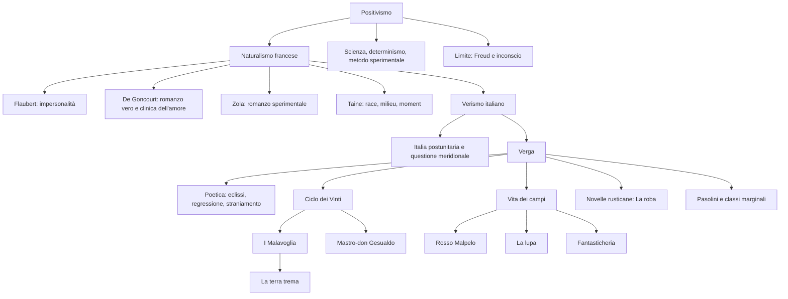

# Positivismo, Naturalismo, Verismo e Giovanni Verga — scheda di ripasso

## Fonti usate

- Fonte madre: [APPUNTI-NATURALISMO-VERISMO-VERGA-MEGA.md](../studio/disordinato%28gioele%29/APPUNTI-NATURALISMO-VERISMO-VERGA-MEGA.md)
- Fonte di controllo e chiarimento teorico: [Naturalismo, Verismo e Giovanni Verga.md](../studio/disordinato%28gioele%29/Naturalismo%2C%20Verismo%20e%20Giovanni%20Verga.md)

> **Nota di metodo**  
> Questa scheda ricompone e ordina i materiali disordinati indicati nelle fonti. Non è pensata come riassunto veloce: è una scheda completa da usare per sostituire gli appunti sparsi nello studio del capitolo su Positivismo, Naturalismo, Verismo e Verga.

## Come studiarla

1. **Parti dal quadro generale**: capisci il passaggio Romanticismo → Positivismo → Naturalismo francese → Verismo italiano.
2. **Memorizza le parole-chiave**: *determinismo*, *race-milieu-moment*, *impersonalità*, *eclissi*, *regressione*, *straniamento*, *discorso indiretto libero*, *fiumana del progresso*, *vinti*, *roba*.
3. **Studia le opere con lo stesso schema**: contesto, contenuto, temi, tecnica narrativa, importanza, cosa dire all’orale.
4. **Collega sempre poetica e testi**: non dire solo che Verga è impersonale; mostra come lo si vede nell’incipit di *Rosso Malpelo*, nella voce corale della comunità, nei proverbi dei *Malavoglia*.
5. **Prepara confronti**: Naturalismo/Verismo, Manzoni/Verga, Verga/Visconti, Verga/Pasolini, Positivismo/Freud.
6. **All’orale non isolare Verga**: presentalo come risposta italiana a un clima europeo dominato da scienza, determinismo, questione sociale e crisi dell’ottimismo progressista.

## Quadro programma

| Nucleo | Cosa sapere bene | Nomi/opere da agganciare |
|---|---|---|
| **Positivismo** | Fiducia in scienza e ragione; determinismo; metodo sperimentale; nascita di psicologia e sociologia; limiti dell’ottimismo scientifico | Illuminismo, scienza, Freud, Leopardi |
| **Naturalismo francese** | Romanzo come indagine scientifica della società; impersonalità; attenzione alle classi subalterne e al patologico | Flaubert, De Goncourt, Zola, Taine |
| **Verismo italiano** | Adattamento italiano del Naturalismo; Sud postunitario; mondo rurale; immobilismo; pessimismo | Verga, Capuana, questione meridionale |
| **Verga** | Biografia, fase pre-verista, Scapigliatura, *Nedda*, svolta verista | Catania, Firenze, Milano, *Vita dei campi* |
| **Poetica verghiana** | Impersonalità, eclissi, regressione, straniamento, discorso indiretto libero, linguaggio, pessimismo, Darwinismo sociale | *L’amante di Gramigna*, Ciclo dei Vinti |
| **Opere** | *Rosso Malpelo*, *La lupa*, *Fantasticheria*, *I Malavoglia*, *La roba*, *Mastro-don Gesualdo* | *Vita dei campi*, *Novelle rusticane*, Ciclo dei Vinti |
| **Collegamenti** | Neorealismo, *La terra trema*, Pasolini e il Verismo | Visconti, Pasolini, borgate, sottoproletariato |

---

# 1. Positivismo

## 1.1 Definizione

Il **Positivismo** è una corrente filosofica della **seconda metà dell’Ottocento**. Nasce come risposta agli esiti irrazionalistici del Romanticismo: se il Romanticismo aveva valorizzato la soggettività, il sentimento, l’immaginazione, la ricerca dell’assoluto e la morale individuale, il Positivismo sposta il centro della cultura verso l’**oggettività scientifica**.

Il termine rimanda a ciò che è “positivo”, cioè **concreto, osservabile, verificabile**. La realtà viene considerata conoscibile attraverso la ragione e la scienza; l’uomo, la società e persino i comportamenti psicologici possono essere studiati come fenomeni regolati da cause precise.

| Romanticismo | Positivismo |
|---|---|
| Soggettività dell’individuo | Oggettività scientifica |
| Sentimento e immaginazione | Ragione e scienza |
| Idealismo e morale del singolo | Determinismo e leggi causa-effetto |
| Ricerca dell’assoluto | Studio dei fenomeni concreti |

> **Formula da ricordare**  
> Il Positivismo applica alla realtà umana lo stesso atteggiamento con cui lo scienziato osserva la natura: analisi, osservazione, cause, leggi, previsione.

## 1.2 Contesto e fiducia nella scienza

Il Positivismo recupera idealmente la fiducia illuministica nella ragione e nel progresso, ma la colloca dentro il mondo della seconda metà dell’Ottocento, segnato da industrializzazione, sviluppo tecnico, fiducia nella medicina, nella biologia, nella chimica e nelle scienze sociali.

L’idea di fondo è che la scienza possa spiegare non solo i fenomeni naturali, ma anche quelli umani. Da qui derivano nuove discipline o nuovi modi di concepire discipline già esistenti:

- la **psicologia**, intesa come studio scientifico della mente;
- la **sociologia**, intesa come studio scientifico della società e dei suoi meccanismi;
- l’applicazione del **metodo sperimentale** anche a campi non strettamente naturali.

## 1.3 Determinismo

Uno dei principi centrali del Positivismo è il **determinismo**. Secondo questa visione, ogni comportamento umano è il risultato di cause precise: ambiente, ereditarietà, contesto storico e sociale, condizioni materiali.

Non esiste quindi un individuo assolutamente libero, che agisce solo in base alla propria volontà. L’uomo è invece condizionato da forze che lo precedono e lo circondano.

> **Esempio utile all’orale**  
> Se una persona nasce in una famiglia povera, in un ambiente degradato, in un determinato momento storico e con certe tare ereditarie, il Positivismo tende a considerare il suo comportamento come l’esito di quelle condizioni. L’individuo non è studiato come eccezione morale, ma come fenomeno determinato.

## 1.4 Metodo sperimentale e letteratura

Il Positivismo influenza la letteratura perché suggerisce agli scrittori che anche l’uomo e la società possano essere studiati con metodo scientifico. Il romanziere, soprattutto nel Naturalismo francese, diventa quasi uno scienziato: osserva, registra, analizza, mette in scena i meccanismi sociali e psicologici.

La conseguenza è una letteratura che vuole essere:

- **oggettiva**, cioè senza interventi sentimentali o moralistici dell’autore;
- **documentaria**, perché interessata a casi concreti e ambienti reali;
- **scientifica**, almeno nelle intenzioni;
- **sociale**, perché studia i rapporti tra individuo e ambiente.

## 1.5 Limiti e crisi dell’ottimismo positivista

Il Positivismo è segnato da una grande fiducia nel progresso: conoscere le leggi che regolano la natura e la società dovrebbe permettere di **intervenire per migliorare il mondo**. Tuttavia questa fiducia entra in crisi.

Le fonti collegano questa crisi soprattutto alla **psicoanalisi di Freud**. Freud mostra che l’uomo non è completamente trasparente a se stesso: esiste l’**inconscio**, una zona della psiche che sfugge al controllo razionale.

La frase-chiave è:

> **“L’Io non è padrone in casa propria.”**

Significa che la coscienza non domina interamente la vita psichica. Una parte decisiva dell’uomo resta nascosta, sommersa, non controllabile dalla ragione. La metafora dell’**iceberg** chiarisce il rapporto: la coscienza è solo la punta visibile; l’inconscio è la massa più ampia sotto la superficie.

> **Collegamento con Leopardi**  
> La critica all’ottimismo positivista richiama anche Leopardi: nella *Ginestra* egli ironizza sulle “magnifiche sorti e progressive”, cioè sull’illusione che il progresso renda automaticamente felice l’umanità. In questo senso Leopardi anticipa una diffidenza verso l’ottimismo progressista che il Novecento renderà ancora più evidente.

---

# 2. Naturalismo francese

## 2.1 Definizione e contesto

Il **Naturalismo francese** nasce nella seconda metà dell’Ottocento, in particolare tra **1865 e 1870**. È la traduzione letteraria del clima positivista: il romanzo diventa uno strumento per osservare scientificamente l’uomo, la società, le passioni, le malattie, la miseria, il degrado.

I tre elementi fondanti del Naturalismo sono:

| Elemento | Significato |
|---|---|
| **Positivismo** | Fondamento filosofico: fiducia nella scienza, determinismo, metodo sperimentale |
| **Romanzo realista di metà Ottocento** | Base narrativa: attenzione al vero, alla società contemporanea, agli aspetti scomodi della realtà |
| **Contesto socio-economico francese** | Francia industrializzata, grandi metropoli, proletariato urbano, banlieue |

## 2.2 Ambientazione e temi

Il Naturalismo non racconta la Parigi elegante dei boulevards e dei palazzi aristocratici. Racconta soprattutto le **banlieue**, le periferie degradate, gli operai, i disoccupati, gli emarginati, cioè coloro che l’industrializzazione ha escluso dai benefici della modernità.

I temi privilegiati sono:

- **alcolismo**;
- **miseria**;
- **indigenza**;
- **degradazione fisica e morale**;
- **malattia**;
- **patologico** e **morboso**;
- conflitti sociali legati alla nuova società industriale.

> **Punto decisivo**  
> Il Naturalismo porta nella letteratura alta realtà che prima erano considerate indegne: le classi inferiori, il brutto, il malato, il degradato, il moralmente scomodo.

## 2.3 Hippolyte Taine: race, milieu, moment

Secondo **Hippolyte Taine**, teorico vicino al Naturalismo, l’uomo è determinato da tre fattori fondamentali:

| Fattore | Traduzione | Significato |
|---|---|---|
| **Race** | Razza / ereditarietà | Patrimonio genetico, tare ereditarie, tratti trasmessi |
| **Milieu** | Ambiente | Ambiente sociale in cui l’individuo nasce e vive |
| **Moment** | Momento storico | Periodo storico e condizioni collettive in cui l’individuo agisce |

Questi tre fattori determinano i tratti psicologici dell’individuo e generano il suo comportamento.

> **Frase da ricordare**  
> **Race + milieu + moment = determinazione dell’individuo.**

## 2.4 Flaubert e il principio dell’impersonalità

Prima del Naturalismo vero e proprio, il romanzo realista aveva preparato il terreno. **Gustave Flaubert**, con ***Madame Bovary* (1857)**, rappresenta un punto di svolta.

### Contesto e contenuto

Il romanzo racconta la vicenda di **Emma Bovary**, donna sposata con un medico di provincia. Insoddisfatta della vita coniugale, Emma cerca evasione in storie sentimentali e amorose, fino alla rovina e alla morte. La trama non conta solo per ciò che accade, ma per il modo in cui Flaubert indaga la società borghese del suo tempo.

Da un lato vi è l’**apparenza**: matrimonio rispettabile, vita ordinata, felicità esibita. Dall’altro vi è la **realtà nascosta**: insoddisfazione, tradimenti, vuoto esistenziale, ipocrisia.

### Il canone dell’impersonalità

Flaubert formula il principio che diventerà fondamentale per Naturalismo e Verismo:

> **“L’autore deve essere nella sua opera come Dio nell’universo: presente dovunque e non visibile in nessun luogo.”**

Lo scrittore deve costruire l’opera, scegliere materiali e struttura, ma non deve rendere visibile la propria presenza. Non deve commentare, giudicare, spiegare moralmente: deve lasciare che i fatti parlino.

| Aspetto | Narratore tradizionale | Narratore impersonale |
|---|---|---|
| Presenza dell’autore | Visibile, commenta | Invisibile, si eclissa |
| Giudizio morale | Esplicito | Assente o implicito nei fatti |
| Effetto sul lettore | Guidato dall’autore | Costretto a interpretare |
| Metodo | Morale e narrativo | Quasi scientifico |

## 2.5 I fratelli De Goncourt e *Germinie Lacerteux*

Con **Edmond e Jules De Goncourt** il Naturalismo trova una prima espressione compiuta. Nel **1864** pubblicano ***Germinie Lacerteux***.

### Contesto

Il romanzo è ispirato a un **caso di cronaca reale**: i due fratelli avevano scoperto che la loro domestica, apparentemente irreprensibile, conduceva una doppia vita. Da questo caso nasce la storia di una domestica malata di **isteria**, che si degrada progressivamente fino alla morte a causa di una passione amorosa incontrollabile.

### Perché conta

L’opera è importante soprattutto per la **Prefazione**, considerata un manifesto del Naturalismo.

I De Goncourt sostengono che:

1. il pubblico ama romanzi falsi, ma il loro è un **romanzo vero**;
2. il romanzo deve venire “dalla strada”, non dal “gran mondo” aristocratico e borghese;
3. le **classi inferiori** hanno diritto a entrare nella letteratura alta;
4. anche il brutto, il patologico e il morboso sono materia letteraria;
5. il romanzo ha una funzione prevalentemente **conoscitiva**;
6. la letteratura si avvicina alla **medicina**, perché analizza sintomi, malattie sociali e passioni.

### “Clinica dell’amore”

Una formula fondamentale è:

> **“Lo studio che segue è la clinica dell’amore.”**

L’amore non è trattato in modo romantico o sentimentale, ma come un fenomeno da osservare clinicamente. Lo scrittore deve comportarsi come un medico: osserva i sintomi, formula una diagnosi, mostra le cause del male.

### Citazioni da sapere

> **“Il pubblico ama i romanzi falsi: questo romanzo è un romanzo vero.”**

> **“Le lacrime che si piangono in basso possano far piangere come quelle che si piangono in alto.”**

La seconda frase è decisiva: afferma che le sofferenze delle classi basse valgono letterariamente quanto quelle dei ricchi e dei nobili.

## 2.6 Émile Zola e *Il romanzo sperimentale*

**Émile Zola** è il massimo esponente e teorico del Naturalismo francese. Nel **1880** pubblica ***Il romanzo sperimentale***, che non è un romanzo ma un **saggio di poetica**.

### Il romanziere come scienziato

Per Zola lo scrittore deve diventare **scienziato**: deve applicare alla letteratura lo stesso metodo con cui il biologo o il medico studiano i fenomeni naturali.

Il romanziere:

- osserva i comportamenti;
- individua cause e condizioni;
- rappresenta le leggi che regolano passioni e rapporti sociali;
- non abbellisce;
- non giudica moralmente;
- non guida il lettore con commenti personali.

> **Citazione-chiave**  
> **“Studiare i fenomeni per diventarne padroni.”**

L’idea è che, conoscendo scientificamente la società, sia possibile correggerne le storture. Qui emerge l’**ottimismo progressista** dei naturalisti francesi: la letteratura può fornire strumenti ai governanti per migliorare la società.

## 2.7 *L’Assommoir*

### Contesto

***L’Assommoir*** è il romanzo più celebre di Zola tra quelli citati nelle fonti. Il titolo significa **“l’ammazzatoio”** ed è anche il nome dell’osteria in cui il padre di famiglia passa le giornate a bere, “ammazzandosi” con l’alcol.

### Contenuto

Il romanzo racconta la storia di una famiglia operaia. Dopo un periodo di relativo benessere, la famiglia precipita nella miseria. **Gervaise** riesce inizialmente ad aprire una lavanderia e a raggiungere una condizione di modesta agiatezza; ma il marito alcolizzato dissipa le entrate della famiglia. La figlia **Nana**, impiegata in un negozio di fiori con una paga miserabile, finisce per darsi alla prostituzione per sopravvivere.

### Tecnica narrativa

Gli eventi sono narrati **senza orpelli**, senza abbellimenti e senza commenti moralistici. Spesso sono filtrati attraverso il **punto di vista dei personaggi**: il narratore cerca di nascondere la propria presenza e di raccontare gli eventi attraverso la sensibilità, la psicologia e le parole dei personaggi stessi.

### Perché conta

Il romanzo mostra bene l’ambizione naturalista: denunciare una piaga sociale, l’**alcolismo**, non con il pathos melodrammatico, ma attraverso una rappresentazione oggettiva della degradazione materiale e morale.

---

# 3. Verismo italiano

## 3.1 Definizione

Il **Verismo** è la corrente letteraria italiana che si sviluppa negli **ultimi decenni dell’Ottocento**. Prende le mosse dal Naturalismo francese, ma lo adatta alla realtà italiana, profondamente diversa da quella francese.

I due nomi fondamentali sono:

- **Giovanni Verga**, principale autore creativo;
- **Luigi Capuana**, soprattutto teorico del movimento.

## 3.2 Contesto postunitario e questione meridionale

Per comprendere il Verismo bisogna partire dall’Italia dopo l’**Unità del 1861**. Il Sud, e in particolare la Sicilia di Verga, appare lontano dallo sviluppo industriale francese: è segnato da arretratezza, immobilismo sociale, superstizione, povertà, scarsissimo dinamismo economico.

La modernità e lo Stato unitario non sono percepiti come liberazione, ma spesso come imposizione estranea.

Esempi importanti nelle fonti:

- la **leva militare obbligatoria**, che sottrae giovani alle famiglie e al lavoro;
- le **tasse**, percepite come imposizioni incomprensibili;
- la distanza tra popolo meridionale e Stato unitario;
- l’assenza di reali possibilità di riscatto sociale.

> **Questione meridionale**  
> Il Verismo nasce dentro una realtà in cui il Sud appare escluso dal progresso. La letteratura verista non racconta la città industriale, ma villaggi, campagne, miniere, pescatori, contadini, braccianti.

## 3.3 Differenze tra Naturalismo e Verismo

| Aspetto | Naturalismo francese | Verismo italiano |
|---|---|---|
| Paese | Francia industrializzata | Italia arretrata, soprattutto Sud |
| Ambiente | Metropoli, banlieue, periferie urbane | Campagna, paesi, mondo rurale siciliano |
| Protagonisti | Proletariato urbano, operai, disoccupati | Contadini, pescatori, minatori, braccianti |
| Visione del progresso | Ottimismo progressista | Pessimismo conservatore |
| Fiducia nella scienza | Alta: conoscere per migliorare | Limitata: rappresentare senza sperare nel riscatto |
| Finalità | Fornire strumenti per migliorare la società | Mostrare la realtà senza finalità riformatrice |
| Dinamismo sociale | Presente, almeno possibile | Immobilismo quasi assoluto |

La differenza più importante riguarda l’ideologia. I naturalisti francesi credono che la conoscenza scientifica possa migliorare la società. Verga, invece, non condivide questo ottimismo: rappresenta il mondo degli umili senza credere che la letteratura possa redimerlo.

> **Formula efficace**  
> Il Naturalismo osserva la miseria per correggerla; il Verismo la rappresenta come una condizione storica e sociale quasi ineluttabile.

---

# 4. Giovanni Verga

## 4.1 Vita: tre città fondamentali

La vita di Verga si può organizzare intorno a tre città:

| Città | Periodo | Significato |
|---|---:|---|
| **Catania** | 1840; ritorno finale | Nascita, famiglia di proprietari terrieri, radici siciliane |
| **Firenze** | 1867-1872 | Contatto con ambienti intellettuali e prime pubblicazioni |
| **Milano** | 1872-1893 | Contatto con la Scapigliatura e svolta verso il Verismo |

Verga nasce a **Catania nel 1840**, in una famiglia di proprietari terrieri con tradizioni risorgimentali. La Sicilia, con i suoi contadini, pescatori, braccianti, minatori, paesi e rapporti sociali, diventerà la materia principale della produzione matura.

Muore a Catania nel **1922**.

## 4.2 La fase pre-verista

Prima della svolta verista, Verga scrive opere molto diverse da quelle più celebri. I protagonisti sono spesso aristocratici, artisti o nobili, e i temi sono passioni sentimentali, drammi amorosi, suicidi, conflitti interiori, atmosfere tardo-romantiche.

### *Storia di una capinera*

Il romanzo affronta il tema della **monacazione forzata**, lo stesso tema della Monaca di Monza manzoniana. La protagonista **Maria**, educata in convento, si innamora di Nino, destinato però alla sorellastra. Costretta a prendere il velo, assiste impotente alla felicità altrui, impazzisce e muore.

L’ispirazione nasce dall’immagine di una capinera prigioniera in gabbia: il velo nero della monaca richiama il piumaggio scuro dell’uccello.

> **Perché non è ancora Verismo**  
> Il tono è tardo-romantico: sentimentale, patetico, lacrimevole. Il narratore interviene e guida l’emozione del lettore.

### Romanzi milanesi pre-veristi

Nel periodo milanese Verga pubblica romanzi ancora lontani dal Verismo:

| Opera | Protagonista / ambiente | Tratto dominante |
|---|---|---|
| ***Eva*** | Pittore e ballerina | Passione e mondo artistico |
| ***Tigre reale*** | Barone e contessa russa | Amore aristocratico |
| ***Eros*** | Marchese Alberti | Passione, suicidio, ambiente nobile |

Questa produzione racconta la parte alta della società e risente ancora di modelli sentimentali e mondani.

## 4.3 La Scapigliatura

A Milano Verga entra in contatto con la **Scapigliatura**, movimento letterario e artistico di ribellione contro il mondo conservatore e borghese. Il nome richiama i capelli “scapigliati” dei giovani artisti, segno di contestazione.

Tra gli esponenti ricordati nelle fonti vi sono **Boito**, **Tarchetti** ed **Emilio Praga**.

Gli scapigliati contestano:

- i valori romantici;
- i valori cristiani;
- la poesia tradizionale;
- il modello manzoniano, percepito come padre letterario da “uccidere” simbolicamente.

Nel *Preludio*, Emilio Praga parla della necessità di un **Anticristo** che uccida i “padri” letterari. Il bersaglio principale è **Manzoni**, il padre della letteratura italiana moderna.

> **Importanza per Verga**  
> La Scapigliatura aiuta Verga ad allontanarsi dal sentimentalismo romantico e dal modello manzoniano, preparando indirettamente la svolta verista.

## 4.4 *Nedda* (1874): anticipazione della svolta verista

### Contesto

Nel **1874** Verga pubblica ***Nedda***, novella che secondo la critica **anticipa** la svolta verista ma non è ancora pienamente verista.

La protagonista è **Nedda**, una bracciante siciliana che lavora come raccoglitrice di olive. Appartiene al **sottoproletariato agricolo**, la fascia più bassa della società rurale siciliana.

### Contenuto

Nedda lavora duramente fra gli stenti per mantenere la madre ammalata. Dopo la morte della madre, cede all’amore di **Ianu**, giovane carrettiere. Ianu però muore di malaria prima di poterla sposare. Anche la bambina nata dalla loro unione muore di stenti.

La vicenda è una parabola di miseria senza riscatto.

### Elementi già veristi

In *Nedda* sono già presenti temi che diventeranno centrali in Verga:

- attenzione agli **umili**;
- mondo degli emarginati e dimenticati dalla letteratura;
- ambiente rurale siciliano;
- appartenenza a un sottoproletariato da cui non si riesce a uscire;
- **determinismo** sociale ed ereditario;
- povertà trasmessa come una maledizione;
- assenza di speranza di cambiamento.

La frase da memorizzare è:

> **“Così era stato di sua madre, così di sua nonna, così sarebbe stato di sua figlia.”**

Significa che il destino si ripete di generazione in generazione: la miseria si eredita.

### Perché non è ancora pienamente verista

Dal punto di vista della **forma**, *Nedda* non è ancora verista. Manca l’impersonalità compiuta: il narratore è ancora **onnisciente**, interviene, descrive, commenta, guida la pietà del lettore.

Sono presenti espressioni di partecipazione emotiva, come “povera figliola”, che tradiscono la presenza dell’autore. I personaggi non parlano ancora davvero da soli: sono descritti e filtrati dalla voce narrante.

> **Cosa dire all’orale**  
> *Nedda* è verista nei contenuti, ma non ancora nella tecnica. Anticipa il mondo degli umili e il determinismo, ma conserva un narratore sentimentale e onnisciente.

## 4.5 La conversione verista

La svolta vera avviene a partire dal **1878**, con ***Vita dei campi***. La raccolta contiene novelle fondamentali:

- ***Rosso Malpelo***;
- ***La lupa***;
- ***Cavalleria rusticana***;
- ***Fantasticheria***;
- ***L’amante di Gramigna***.

In questa fase Verga adotta pienamente le tecniche della narrazione verista: impersonalità, eclissi del narratore, regressione, straniamento, linguaggio popolare, punto di vista dal basso.

---

# 5. Poetica verghiana

## 5.1 Impersonalità ed eclissi del narratore

La tecnica fondamentale del Verismo è l’**eclissi del narratore**. Il narratore scompare dalla narrazione: non presenta i personaggi dall’alto, non spiega, non giudica, non interrompe il racconto con commenti morali.

Il lettore non trova formule del tipo: “Era un uomo buono”, “Era un malvagio”, “Bisogna compatirlo”. I personaggi si caratterizzano da soli attraverso:

- parole;
- azioni;
- comportamenti;
- proverbi;
- giudizi della comunità;
- linguaggio sociale.

L’autore deve dare l’impressione che l’opera sia nata spontaneamente dalla realtà rappresentata.

## 5.2 Regressione

La **regressione** è la tecnica con cui l’autore colto abbandona il proprio punto di vista e “regredisce” a quello dei personaggi o della comunità narrata.

Verga non guarda i contadini o i minatori dall’alto, con superiorità borghese. Assume invece la loro prospettiva, il loro linguaggio, le loro superstizioni, il loro modo di collegare cause ed effetti.

Esempio classico: l’incipit di *Rosso Malpelo*.

> **“Malpelo si chiamava così perché aveva i capelli rossi, e aveva i capelli rossi perché era un ragazzo malizioso e cattivo.”**

Il nesso logico è assurdo per noi: non sono i capelli rossi a rendere cattivi. Ma la frase riproduce la mentalità superstiziosa della comunità dei minatori.

## 5.3 Straniamento

Lo **straniamento** consiste nel presentare come normale ciò che per il lettore è terribile o inaccettabile, oppure nel presentare come strano ciò che per noi sarebbe normale.

In *Rosso Malpelo*, il lavoro minorile, le botte, la violenza nella cava sono raccontati come fatti ordinari, perché tali sono per la comunità rappresentata. Viceversa, la disperazione della madre di Ranocchio appare incomprensibile a Malpelo: dal punto di vista economicistico della cava, Ranocchio guadagnava poco, quindi non si capisce perché la madre soffra così tanto.

## 5.4 Discorso indiretto libero

Il **discorso indiretto libero** riporta pensieri e parole dei personaggi senza segnali espliciti del discorso diretto o indiretto.

Non ci sono necessariamente:

- verbi come “disse”, “pensò”, “ritenne”;
- due punti;
- virgolette;
- formule introduttive.

Le parole dei personaggi si fondono con la voce del narratore, creando una narrazione mimetica, vicina alla realtà parlata.

## 5.5 Linguaggio

Il linguaggio verghiano non è dialetto puro. Verga non scrive sistematicamente in siciliano, ma usa un **italiano che ricalca la sintassi del dialetto siciliano**.

Elementi tipici:

- termini dialettali;
- proverbi;
- modi di dire popolari;
- espressioni dell’oralità;
- uso improprio o popolare del “che”;
- similitudini con il mondo animale;
- sintassi vicina al parlato.

> **Principio fondamentale**  
> La forma è inerente al soggetto: il linguaggio deve adattarsi all’ambiente sociale rappresentato. Nei *Malavoglia* lo stile è popolare; in *Mastro-don Gesualdo*, dove il protagonista appartiene a un ceto più elevato, lo stile si avvicina a un italiano medio.

## 5.6 Pessimismo e immobilismo

Verga è definito nelle fonti un **conservatore pessimista**. Questo non significa che sia semplicemente “contro” il progresso, ma che ne osserva le conseguenze sui singoli individui, soprattutto sui deboli.

Da lontano, il progresso sembra migliorare la vita dell’umanità; da vicino, travolge chi non ha strumenti per parteciparvi. I poveri, i deboli, gli umili pagano il prezzo più alto.

In Verga non c’è fiducia nel cambiamento sociale. Chi tenta di “mutare stato” si espone alla rovina. L’unica forma di difesa possibile è restare attaccati al proprio ambiente, alla famiglia, al lavoro, alla tradizione.

## 5.7 Darwinismo sociale

Verga applica alla società una visione vicina al **Darwinismo sociale**: la vita è lotta per l’esistenza. I più deboli soccombono, i più forti prevalgono, ma nessuno è davvero libero dalla logica della sopraffazione.

La società appare regolata da leggi simili a quelle naturali:

- non vince il più giusto, ma il più adatto;
- la pietà non modifica i rapporti di forza;
- chi è debole viene travolto;
- la vittima può diventare carnefice di qualcuno ancora più debole.

*Rosso Malpelo* è l’esempio più chiaro: Malpelo subisce violenza, ma a sua volta la riversa su Ranocchio e sull’asino grigio, non per pura cattiveria, ma perché ha imparato che nel mondo sopravvive solo chi sa difendersi.

---

# 6. Le due grandi prefazioni di poetica

## 6.1 Prefazione a *L’amante di Gramigna* / Lettera a Salvatore Farina

### Contesto

La prefazione a ***L’amante di Gramigna*** è una lettera all’amico e intellettuale **Salvatore Farina**. Nelle fonti è indicata come una vera **dichiarazione di poetica verista**.

### Concetti fondamentali

I concetti principali sono:

1. **documento umano**;
2. **fatto nudo e schietto**;
3. **impersonalità**;
4. **eclissi del narratore**;
5. **regressione**;
6. rifiuto degli effetti romanzeschi e sentimentali.

### Documento umano

Verga presenta il racconto non come invenzione letteraria, ma come un **documento umano**: un caso tratto dalla vita reale, fatto di personaggi, luoghi e passioni osservabili.

> **“Eccoti non un racconto, ma l’abbozzo di un racconto. Esso almeno avrà il merito di essere brevissimo, e di essere storico, un documento umano.”**

Il racconto deve sembrare raccolto nei “viottoli dei campi”, con parole semplici e pittoresche della narrazione popolare.

### Fatto nudo e schietto

Verga vuole mettere il lettore di fronte al **fatto nudo e schietto**, cioè alla realtà senza abbellimenti, senza invenzioni romanzesche, senza sentimentalismi.

Il lettore non deve sentire la mano dell’autore che guida le emozioni. Deve trovarsi “faccia a faccia” con il fatto.

### Eclissi e opera fatta da sé

La frase più importante è:

> **“L’opera d’arte sembrerà essersi fatta da sé.”**

È la sintesi più famosa del canone dell’impersonalità: l’artista deve essere così invisibile che l’opera sembri nata spontaneamente dalla realtà stessa.

### Il misterioso processo delle passioni

Verga parla del “misterioso processo” per cui le passioni si annodano, si intrecciano, maturano e si svolgono. Qui si vede l’influsso del metodo naturalista: non interessa l’effetto melodrammatico, ma l’analisi del modo in cui una passione nasce e conduce alla catastrofe.

## 6.2 Prefazione al Ciclo dei Vinti

### Il progetto

Il **Ciclo dei Vinti** è un progetto di **cinque romanzi**. Verga vuole studiare i meccanismi dell’agire umano partendo dalle classi più basse e salendo progressivamente verso quelle più alte.

| Romanzo | Protagonista / classe | Bramosia dominante | Stato |
|---|---|---|---|
| ***I Malavoglia*** | Famiglia di pescatori | Bisogni materiali / desiderio di stare meglio | Completato |
| ***Mastro-don Gesualdo*** | Manovale arricchito | Avidità di ricchezze | Completato |
| ***La Duchessa de Leyra*** | Aristocratica | Vanità aristocratica | Iniziato / parziale |
| ***L’Onorevole Scipioni*** | Politico | Ambizione politica | Non scritto |
| ***L’uomo di lusso*** | Esteta / intellettuale | Riunisce tutte le bramosie | Non scritto |

Verga completa solo i primi due romanzi. Gli altri restano allo stato di progetto, frammento o non vengono scritti.

### “Vaga bramosia dell’ignoto”

Nella prefazione ai *Malavoglia*, Verga scrive:

> **“Questo racconto è lo studio sincero e spassionato del come probabilmente devono nascere e svilupparsi nelle più umili condizioni, le prime irrequietudini per il benessere; e quale perturbazione debba arrecare in una famigliuola vissuta sino allora relativamente felice, la vaga bramosia dell’ignoto.”**

La **vaga bramosia dell’ignoto** è il desiderio confuso, intenso e pericoloso di ciò che non si conosce: stare meglio, cambiare condizione, uscire dal proprio mondo. Nei *Malavoglia* questa bramosia distrugge l’equilibrio della famiglia.

### “Fiumana del progresso”

La **fiumana del progresso** è una delle metafore centrali della poetica verghiana. Il progresso è come un fiume in piena: avanza, trascina, sommerge, travolge. Da lontano può apparire positivo; da vicino distrugge i deboli.

Solo l’osservatore, travolto anch’egli dalla fiumana ma capace di guardarsi attorno, ha il diritto di interessarsi ai “deboli che restano per via”, cioè ai **vinti**.

### Provvidenza anti-provvidenziale

Nei *Malavoglia* la barca si chiama **Provvidenza**, ma il nome è tragicamente ironico: non c’è una Provvidenza divina che guida gli eventi verso il bene. A dominare sono caso, necessità, fatalità, sconfitta.

| Manzoni | Verga |
|---|---|
| Provvidenza cristiana, disegno divino anche nel dolore | Anti-provvidenzialismo, caso e fatalità |
| Storia orientata al bene | Storia come disfatta e fallimento |
| Narratore guida moralmente il lettore | Narratore eclissato, nessun giudizio esplicito |

---

# 7. Opere e testi

## 7.1 *Rosso Malpelo*

### Contesto

***Rosso Malpelo*** è la novella più celebre di Verga, contenuta in ***Vita dei campi* (1878)**. È ambientata in una cava di **rena rossa** in Sicilia, dove lavorano adulti e ragazzi, i **carusi**, in condizioni durissime.

La novella rappresenta la piena svolta verista perché applica in modo esemplare regressione, straniamento, impersonalità e punto di vista corale.

### Contenuto

Il protagonista è **Malpelo**, un ragazzo dai capelli rossi. La comunità superstiziosa lo considera cattivo proprio perché ha i capelli rossi. Lavora nella stessa cava dove è morto il padre, **Mastro Misciu**, soprannominato “Bestia” perché si faceva sfruttare senza protestare.

La madre e la sorella lo trattano con ostilità, quasi temendo che sottragga loro denaro. Malpelo vive senza affetto, escluso dalla famiglia e dalla comunità.

Malpelo prende sotto la propria protezione **Ranocchio**, un ragazzino zoppo appena arrivato alla cava. Ma lo protegge in modo paradossale: lo picchia per insegnargli a difendersi, perché nel mondo della cava la violenza appare l’unica legge di sopravvivenza.

Alla fine Malpelo accetta di esplorare una galleria pericolosa e scompare nelle viscere della terra, seguendo simbolicamente il destino del padre. I ragazzi della cava abbassano la voce quando parlano di lui, come se fosse diventato una figura quasi leggendaria.

### Temi

| Tema | Spiegazione |
|---|---|
| **Determinismo sociale** | Malpelo è imprigionato nel destino della cava e nella superstizione della comunità |
| **Pregiudizio** | I capelli rossi vengono interpretati come segno di malvagità |
| **Lavoro minorile** | I carusi vivono in condizioni disumane |
| **Darwinismo sociale** | I più forti opprimono i più deboli; la vittima può diventare oppressore |
| **Assenza di affetto** | Solo il padre voleva bene a Malpelo |
| **Animalizzazione** | Gli uomini sono paragonati ad animali: cani, bestie, asini |
| **Morte come liberazione** | Per Malpelo morire può significare uscire dalla sofferenza |

### Tecnica narrativa

L’incipit è l’esempio perfetto della **regressione**:

> **“Malpelo si chiamava così perché aveva i capelli rossi, e aveva i capelli rossi perché era un ragazzo malizioso e cattivo.”**

Il narratore non corregge la superstizione popolare: la assume come punto di vista della comunità. Questo produce anche **straniamento**, perché il lettore percepisce l’assurdità del ragionamento, ma il testo lo presenta come normale.

La novella usa inoltre:

- similitudini animali: Malpelo come cane rognoso, asino, bestia;
- linguaggio popolare;
- punto di vista economico della comunità;
- assenza di giudizio morale esplicito dell’autore.

### Episodi importanti

#### La morte del padre

Mastro Misciu muore sepolto dalla rena rossa mentre svolge un lavoro pericoloso, pagato a **cottimo**, accettato per guadagnare di più e mantenere la famiglia. Era chiamato “Bestia” perché lavorava come un animale da soma.

La reazione di Malpelo è bestiale e disperata: non piange in modo convenzionale, ma scava con le unghie nella rena, lacerandosi le mani. È l’unico momento in cui emerge chiaramente che il padre era il suo unico vero affetto.

#### Ranocchio

Ranocchio è più debole di Malpelo. Malpelo lo maltratta, ma al tempo stesso gli cede parte del suo pane: gesto di affetto che la comunità interpreta come un modo per tenerlo sottomesso. Questo è un altro esempio di straniamento: un gesto generoso viene deformato dal punto di vista brutale della cava.

#### L’asino grigio

Malpelo picchia l’asino grigio e gli dice “così creperai più presto”. La frase è crudele, ma nel suo mondo la morte può apparire come liberazione dalla sofferenza. Malpelo proietta sull’asino la propria visione della vita.

### Perché conta

*Rosso Malpelo* è fondamentale perché mostra in forma narrativa la poetica verista: il narratore scompare, la comunità parla attraverso il testo, la violenza sociale è presentata senza commento sentimentale, il lettore deve giudicare da sé.

### Cosa dire all’orale

All’orale puoi dire:

> *Rosso Malpelo* è la novella più esemplare del Verismo verghiano. L’incipit mostra la regressione al punto di vista della comunità superstiziosa; la vicenda mostra il Darwinismo sociale, perché Malpelo, vittima della violenza, la riproduce su chi è più debole. L’autore non interviene a condannare, ma lascia che la brutalità emerga dai fatti.

---

## 7.2 *La lupa*

### Contesto

***La lupa*** è una novella di ***Vita dei campi***. Racconta una storia di isolamento, emarginazione e pregiudizio simile a quella di *Rosso Malpelo*, ma con protagonista femminile.

La protagonista è la **Gnà Pina**, soprannominata “la Lupa” perché dominata da una passione erotica insaziabile.

### Il significato del soprannome

Il soprannome ha un importante riferimento letterario e simbolico. Nel primo canto dell’*Inferno* dantesco, la lupa rappresenta l’**avarizia/avidità**, cioè una fame che non si sazia mai. In Verga la Lupa è “insaziabile” non di denaro, ma di passione e istinto erotico.

| Fiera dantesca | Significato | Tratti |
|---|---|---|
| Leone | Superbia | Incedere maestoso, criniera |
| Lonza | Lussuria | Pelo maculato, incedere sinuoso |
| **Lupa** | **Avarizia / avidità** | Magra, sempre affamata |

### Contenuto

La Lupa si innamora di **Nanni**, giovane tornato dal servizio militare. Nanni però non vuole lei, ma preferisce sposare sua figlia **Maricchia**.

La Lupa, pur di restare vicina all’uomo desiderato, costringe la figlia a sposarlo, minacciandola. Dopo il matrimonio intreccia una relazione sessuale con il genero. Nanni è tormentato dal senso di colpa e cerca di allontanarla, ma continua a cedere alla passione.

Arriva persino a rivolgersi al brigadiere:

> **“È la tentazione dell’inferno!”**

Chiede di essere mandato in prigione o di essere fermato, perché non riesce a dominarsi.

Il finale è sospeso ma chiaro: Nanni va verso la Lupa con la **scure**. Lei non arretra, con in mano papaveri rossi e gli occhi neri che lo “mangiano”. L’omicidio non è descritto direttamente, ma è evidente.

### Temi

- passione erotica come forza primordiale;
- esclusione sociale della donna trasgressiva;
- punto di vista della comunità contadina;
- assenza di giudizio morale esplicito dell’autore;
- superstizione e pregiudizio;
- istinto incontrollabile;
- violenza maschile e femminicidio, in termini moderni;
- tempo agricolo e ciclico.

### Tecnica narrativa

La novella è raccontata dal punto di vista della comunità paesana. La Lupa viene vista come presenza quasi demonica:

> **“Al villaggio la chiamavano la Lupa perché non era sazia giammai – di nulla.”**

L’autore non dice direttamente: “è una donna colpevole” o “è una vittima”. Lascia parlare il paese, con i suoi proverbi, le sue paure, le sue immagini.

### Linguaggio e simboli

I colori dominanti sono:

- **rosso**: passione, papaveri, sangue;
- **nero**: occhi della Lupa, morte, oscurità.

Il tempo non è misurato in date, ma attraverso i cicli del lavoro agricolo: mietitura del fieno, raccolta delle olive, spremitura dell’olio, potatura delle viti.

La novella è ricca di proverbi e modi di dire popolari:

> **“Il diavolo quando invecchia si fa eremita.”**

> **“In quell’ora fra vespero e nona, in cui non ne va in volta femmina buona.”**

### Perché conta

*La lupa* mostra il Verismo applicato alla passione: non la passione romantica, idealizzata, ma una forza arcaica, naturale, incontrollabile, che travolge i rapporti familiari e sociali.

### Cosa dire all’orale

All’orale puoi dire:

> *La lupa* rappresenta una passione primordiale, vista attraverso lo sguardo giudicante e superstizioso della comunità. Verga non interviene moralmente: lascia emergere la violenza del desiderio, del pregiudizio e dell’esclusione sociale attraverso simboli fortissimi come il rosso dei papaveri e il nero degli occhi della protagonista.

---

## 7.3 *Fantasticheria*

### Contesto

***Fantasticheria*** è una novella di ***Vita dei campi*** molto importante perché può essere letta come una **dichiarazione di poetica**. Contiene due immagini fondamentali per capire Verga e *I Malavoglia*:

- l’**ideale dell’ostrica**;
- il **mondo come pesce vorace**.

### Struttura

La novella è particolare rispetto ad altre opere veriste perché ha una **cornice**: un letterato ricorda una gita ad Aci Trezza con una signora aristocratica. Per questo non realizza pienamente le tecniche veriste più mature, ma anticipa personaggi, ambienti e temi dei *Malavoglia*.

### Contenuto e immagini principali

Aci Trezza è descritto come un gruppo di casupole abitate da pescatori, gente povera e resistente, con “la pelle più dura del pane che mangiano, quando ne mangiano”.

La novella anticipa **Padron ’Ntoni**, immaginato morto lontano dal proprio paese, in un ospedale bianco, fra lenzuoli bianchi e mani bianche di suore che non comprendono il suo dialetto semibarbaro. L’insistenza sul **bianco** segnala estraneità, isolamento, perdita del proprio mondo.

### L’ideale dell’ostrica

> **“Insomma, l’ideale dell’ostrica.”**

L’ostrica vive attaccata allo scoglio. Staccarsi dallo scoglio significa morire. Per Verga, gli umili devono restare attaccati al proprio ambiente, alla famiglia, al paese, al lavoro tradizionale: chi si allontana per “vaghezza dell’ignoto” va incontro alla rovina.

| Scoglio | Significato |
|---|---|
| Paese | Spazio familiare e protettivo |
| Famiglia | Unica difesa contro il mondo |
| Tradizione | Regola di sopravvivenza |
| Lavoro | Identità e appartenenza |

### Il mondo come pesce vorace

> **“Il mondo, da pesce vorace ch’egli è, se lo ingoiò.”**

Il mondo esterno è un predatore. Chi si stacca dal proprio nucleo familiare per brama di meglio o curiosità viene inghiottito.

### Temi

- immobilismo sociale;
- religione della famiglia;
- determinismo;
- attaccamento al luogo natale;
- pericolo del cambiamento;
- visione conservatrice;
- anticipazione dei *Malavoglia*.

### Perché conta

*Fantasticheria* è fondamentale perché espone la base ideologica dei *Malavoglia*: la famiglia è l’unico argine contro un mondo ostile; chi tenta di cambiare condizione si perde.

### Cosa dire all’orale

All’orale puoi dire:

> *Fantasticheria* anticipa i *Malavoglia* attraverso l’ideale dell’ostrica: gli umili sopravvivono solo restando attaccati al proprio scoglio, cioè alla famiglia e al paese. Il mondo esterno è un pesce vorace che inghiotte chi cerca di mutare stato.

---

## 7.4 *I Malavoglia* (1881)

### Contesto

***I Malavoglia*** è il primo romanzo del **Ciclo dei Vinti**, pubblicato nel **1881**. Racconta la vicenda di una famiglia di pescatori di **Aci Trezza**, in Sicilia, negli anni successivi all’Unità d’Italia.

Il tempo della storia copre circa gli anni **1863-1878**, cioè il periodo immediatamente successivo all’unificazione.

### Titolo e famiglia

I protagonisti sono i **Toscano**. “Malavoglia” è il soprannome con cui la famiglia è conosciuta nel paese. È un soprannome **antifrastico**, perché significa il contrario della realtà: sembrerebbe indicare persone pigre, ma i Malavoglia sono laboriosi.

### Personaggi principali

| Personaggio | Ruolo |
|---|---|
| **Padron ’Ntoni** | Patriarca, capofamiglia, custode della tradizione |
| **Bastianazzo** | Figlio di Padron ’Ntoni, muore nel naufragio |
| **Maruzza** / la Longa | Moglie di Bastianazzo |
| **’Ntoni giovane** | Nipote inquieto, attratto dal cambiamento |
| **Luca** | Muore nella battaglia di Lissa |
| **Mena** | Figlia legata al destino familiare |
| **Alessi** | Riscatta la Casa del Nespolo |
| **Lia** | Finisce nella prostituzione in città |
| **Zio Crocifisso** | Usuraio, incarnazione dell’utile e dell’egoismo |

### Beni simbolici

I Malavoglia possiedono due beni fondamentali:

- la **Casa del Nespolo**, unico bene immobile e simbolo dell’unità familiare;
- la **Provvidenza**, la barca da pesca, il cui nome è ironicamente anti-provvidenziale.

### Trama

La famiglia vive dignitosamente nella povertà. La prima destabilizzazione arriva con la partenza del giovane ’Ntoni per la **leva militare**, percepita come imposizione dello Stato unitario e come perdita di forza lavoro.

Per migliorare la situazione economica, la famiglia tenta l’**affare dei lupini**: ipoteca la Casa del Nespolo, compra un carico di lupini e lo carica sulla Provvidenza per rivenderlo. La barca però naufraga: il carico si perde e **Bastianazzo** muore.

Da qui comincia la disgregazione:

- Maruzza muore per il colera;
- la Casa del Nespolo viene venduta per pagare i debiti;
- Luca muore nella battaglia di Lissa;
- il giovane ’Ntoni finisce in carcere;
- Lia si perde nella prostituzione cittadina;
- Padron ’Ntoni muore lontano dal paese, in ospedale.

Alla fine **Alessi** riesce a riscattare la Casa del Nespolo e a ricostruire in parte la famiglia. Ma la ferita non è sanata: chi si è staccato dallo scoglio non può davvero rientrare.

### Struttura e contrasti

Il romanzo oppone due mondi:

| Padron ’Ntoni | Zio Crocifisso |
|---|---|
| Religione della famiglia | Logica dell’interesse |
| Onestà e lavoro | Usura e profitto |
| Tradizione | Modernità negativa |
| Proverbi e saggezza popolare | Calcolo egoistico |

Un secondo contrasto è interno alla famiglia:

| Padron ’Ntoni | Giovane ’Ntoni |
|---|---|
| Vuole morire dove è nato | Vuole cambiare stato |
| Accetta la tradizione | Desidera la città |
| Si esprime per proverbi | È inquieto e sognatore |
| Crede nella famiglia come mano unita | Rifiuta di essere “bestia” come gli altri |

### Il capitolo XI

Nel dialogo tra Padron ’Ntoni e il giovane ’Ntoni emerge lo scontro tra tradizione e desiderio di cambiamento.

Padron ’Ntoni dice:

> **“Più ricco è in terra chi meno desidera. Meglio contentarsi che lamentarsi.”**

La sua mentalità è conservatrice: chi si accontenta sopravvive.

Il giovane ’Ntoni risponde:

> **“Voglio cambiare stato, io e tutti voi.”**

Il suo desiderio non è solo egoistico: vuole arricchire anche la famiglia. Ma per Verga questa “bramosia” è pericolosa, perché lo porta fuori dallo scoglio familiare.

Padron ’Ntoni afferma:

> **“Per me io voglio morire dove son nato.”**

Tragicamente morirà in ospedale, lontano da casa.

### La metafora della mano

> **“Per menare il remo bisogna che le cinque dita s’aiutino l’un l’altro.”**

La famiglia è come una mano: ogni dito deve collaborare. Se un membro si separa, l’intero organismo familiare si indebolisce.

### Temi

- religione della famiglia;
- ideale dell’ostrica;
- fiumana del progresso;
- anti-provvidenzialismo;
- questione postunitaria;
- leva militare e Stato percepito come estraneo;
- conflitto tra tradizione e modernità;
- disgregazione familiare;
- impossibilità del riscatto;
- Darwinismo sociale.

### Tecnica narrativa

Nel romanzo sono presenti tutte le tecniche veriste:

- impersonalità ed eclissi del narratore;
- regressione al punto di vista del paese;
- discorso indiretto libero;
- proverbi e modi di dire;
- introduzione di luoghi e personaggi come se il lettore li conoscesse già;
- linguaggio che ricalca la sintassi siciliana;
- punto di vista corale della comunità.

### Perché conta

*I Malavoglia* è il romanzo più importante per capire la visione storica di Verga: il progresso esiste, ma travolge i deboli. Non libera gli umili; li mette in movimento e li distrugge.

### Cosa dire all’orale

All’orale puoi dire:

> *I Malavoglia* mostra la tragedia di una famiglia che tenta di migliorare la propria condizione e viene travolta dalla fiumana del progresso. La Casa del Nespolo e la Provvidenza hanno valore simbolico: la prima è l’unità familiare, la seconda è una Provvidenza ironica e anti-manzoniana. Il romanzo realizza pienamente l’impersonalità verista attraverso lingua popolare, proverbi e punto di vista corale.

---

## 7.5 *La roba*

### Contesto

***La roba*** è una novella contenuta nelle ***Novelle rusticane***. Il protagonista, **Mazzarò**, anticipa per molti aspetti il protagonista di ***Mastro-don Gesualdo***.

La novella ha però un esito più **grottesco** e tragicomico; nel romanzo *Mastro-don Gesualdo* la conclusione sarà invece tragica.

### Significato di “roba”

La **roba** indica i beni materiali concreti:

- terre;
- frutti;
- bestiame;
- case;
- braccianti;
- mezzi agricoli;
- proprietà visibili e toccabili.

Non è denaro astratto: è possesso concreto, accumulo, dominio sulla terra e sulle cose.

### Contenuto

Mazzarò è un uomo che, partendo da una condizione umilissima, ha accumulato una quantità immensa di proprietà grazie al lavoro instancabile, alla scaltrezza e all’ossessione per il possesso.

L’incipit presenta la vastità delle sue terre attraverso una lunga elencazione di luoghi reali della Sicilia:

> **“Il viandante che andava lungo il Biviere di Lentini…”**

Ogni volta che il viandante chiede “Di chi è?”, la risposta è sempre: **“Di Mazzarò.”**

### Contrasto tra possesso e corpo

La novella insiste su un contrasto fortissimo: le proprietà sono immense, ma Mazzarò è fisicamente piccolo:

> **“Invece egli era un omiciattolo.”**

La sua persona è quasi nulla rispetto all’estensione della roba. È come se fosse disteso su tutta la terra che possiede.

### Sobrietà e mentalità economica

Mazzarò vive in modo poverissimo nonostante la ricchezza:

> **“Non mangiava altro che due soldi di pane.”**

Anche il cibo è misurato in denaro. Tutto viene valutato economicamente.

### Intelligenza e ascesa sociale

Mazzarò ha “la testa che era un brillante”: è astuto, pratico, capace di calcolo. Ha lavorato da mattina a sera, senza scarpe, sotto sole, acqua e vento. Chi prima lo prendeva a calci ora gli dà dell’“eccellenza”.

### Temi

- accumulo e avidità;
- ascesa sociale;
- culto della proprietà;
- disumanizzazione;
- economicizzazione di tutti i rapporti;
- anticipazione di *Mastro-don Gesualdo*;
- grottesco tragico.

### Tecnica narrativa

La novella usa:

- precisione **toponomastica**;
- elencazioni iperboliche;
- contrasto tra immensità della roba e piccolezza del proprietario;
- punto di vista popolare;
- stile più complesso rispetto ai *Malavoglia*, coerente con un ambiente sociale diverso.

### Perché conta

*La roba* mostra un livello diverso della “lotta per l’esistenza”: non più solo il bisogno materiale dei pescatori, ma l’ossessione dell’accumulo. Mazzarò è un vinto perché possiede tutto, ma è posseduto dalla roba.

### Cosa dire all’orale

All’orale puoi dire:

> *La roba* anticipa *Mastro-don Gesualdo*: Mazzarò, come Gesualdo, è un arricchito che sacrifica tutto all’accumulo dei beni materiali. La sua ricchezza non lo libera, ma lo disumanizza. La novella mostra la forma più ossessiva della bramosia verghiana.

---

## 7.6 *Mastro-don Gesualdo* — materiale parziale

> **Materiale parziale**  
> Le fonti forniscono una sintesi utile ma non un’analisi estesa del romanzo. Per questo la sezione segnala chiaramente ciò che emerge dagli appunti senza inventare trama o dettagli non presenti.

### Contesto

***Mastro-don Gesualdo* (1889)** è il secondo romanzo completato del **Ciclo dei Vinti**. Dopo i bisogni materiali dei *Malavoglia*, Verga passa a un livello sociale superiore: quello dell’arricchito, del **parvenu**, del nuovo ricco.

### Contenuto essenziale dalle fonti

Il protagonista, **Gesualdo**, è un manovale che si è arricchito enormemente grazie al proprio lavoro instancabile. È diventato proprietario di latifondi, bestiame, operai e mezzi agricoli.

La sua bramosia dominante è l’**avidità di ricchezze**, cioè l’ossessione per la **roba**.

### Temi

- ascesa sociale;
- accumulo;
- isolamento;
- sacrificio degli affetti;
- ossessione per i beni materiali;
- sconfitta dentro il successo;
- solitudine finale.

Le fonti sottolineano che Gesualdo sacrifica **affetti, relazioni e umanità** sull’altare dell’accumulo. Muore **solo**, abbandonato dalla figlia, dalla moglie e persino dalla servitù.

### Tecnica e stile

Secondo il principio della **forma inerente al soggetto**, lo stile di *Mastro-don Gesualdo* è più elevato rispetto ai *Malavoglia*. Il protagonista appartiene a un ceto più alto rispetto ai pescatori di Aci Trezza, quindi il linguaggio si avvicina a un italiano “medio”.

### Perché conta

Il romanzo mostra che anche chi riesce ad arricchirsi è comunque un **vinto**. La promozione sociale non porta felicità: produce isolamento, perdita degli affetti, disumanizzazione.

### Cosa dire all’orale

All’orale puoi dire:

> *Mastro-don Gesualdo* è il secondo romanzo del Ciclo dei Vinti. Gesualdo è un manovale arricchito, dominato dall’ossessione per la roba. Rispetto ai *Malavoglia*, Verga sale di livello sociale e adatta lo stile al soggetto. Anche Gesualdo però è un vinto: possiede molto, ma muore solo, svuotato di affetti e umanità.

---

# 8. Confronto Manzoni / Verga

Il confronto con Manzoni serve a capire la rivoluzione verista.

| Aspetto | Manzoni | Verga |
|---|---|---|
| Narratore | Onnisciente, interviene | Eclissato, impersonale |
| Giudizio morale | Presente | Assente o affidato ai fatti |
| Provvidenza | Guida gli eventi verso il bene | Negata: dominano caso e fatalità |
| Visione della storia | Cristiana e provvidenziale | Pessimista e anti-provvidenziale |
| Protagonisti | Umili positivi, riscatto morale possibile | Vinti, sconfitti senza riscatto |
| Registro | Commento, ironia, guida del lettore | Punto di vista corale e popolare |

> **Frase pronta per l’orale**  
> Manzoni racconta gli umili dall’alto di una visione cristiana e provvidenziale; Verga prova a far parlare il mondo degli umili dall’interno, senza commento morale e senza speranza provvidenziale.

---

# 9. Collegamenti con Neorealismo, *La terra trema* e Pasolini

## 9.1 Neorealismo

Il **Neorealismo** è una corrente letteraria e cinematografica italiana che si sviluppa tra gli **anni Quaranta e Cinquanta**, nel contesto del Fascismo, della Seconda guerra mondiale e del dopoguerra.

L’obiettivo è mostrare la realtà **così com’è**, senza filtri e senza abbellimenti. Nel cinema neorealista spesso recitano attori non professionisti: persone comuni che interpretano se stesse.

I registi ricordati nelle fonti sono:

- **Luchino Visconti**;
- Roberto Rossellini;
- Vittorio De Sica.

Il cinema fascista aveva spesso prodotto cinegiornali celebrativi e colossal storici girati a Cinecittà, funzionali alla propaganda. Il Neorealismo invece esce dagli studi e va **in strada**, mostrando miseria, distruzione, disoccupazione, povertà, violenza e soprusi.

## 9.2 Il giudizio di Pasolini sul Neorealismo

Pasolini definisce il Neorealismo:

> **“Il primo atto di coscienza critica, dal punto di vista politico e ideologico, che l’Italia ha avuto di se stessa.”**

E anche:

> **“La riscoperta dell’Italia. Il primo sguardo che l’Italia dà a se stessa senza veli retorici, senza falsità.”**

Secondo le fonti, molte opere neorealiste hanno un **prospettivismo marxista**: credono che il futuro possa essere migliore.

## 9.3 *La terra trema* di Luchino Visconti

### Contesto

***La terra trema* (1948)** è un film di **Luchino Visconti**, regista di origine aristocratica ma politicamente e culturalmente orientato a sinistra.

Il film è ispirato ai ***Malavoglia***. Visconti scende in Sicilia, riprende la vita dei pescatori e fa recitare persone del luogo, che interpretano se stesse e parlano il loro dialetto.

### Contenuto

Il film racconta la storia della famiglia **Valastro**, trasposizione cinematografica dei Malavoglia. Al centro vi è lo scontro tra pescatori e grossisti del pesce. I pescatori rischiano la vita in mare; i grossisti acquistano il pesce a prezzi bassissimi e lo rivendono a prezzi più alti.

La vicenda denuncia lo **sfruttamento** dei lavoratori da parte del capitale.

### Differenza ideologica tra Verga e Visconti

| Verga | Visconti |
|---|---|
| Conservatore e pessimista | Progressista |
| Antistoricistico | Storicista |
| Non crede nel cambiamento sociale | Auspica lotta di classe e riscatto |
| Mostra i vinti senza prospettiva di redenzione | Interpreta la vicenda in chiave marxista |

La didascalia iniziale del film dice:

> **“I fatti rappresentati in questo film accadono in Italia, dove uomini sfruttano altri uomini.”**

### Cosa dire all’orale

> Visconti recupera ambiente e situazioni dei *Malavoglia*, ma cambia radicalmente l’ideologia: Verga vede il progresso come fiumana che travolge; Visconti legge lo sfruttamento in chiave marxista e auspica un riscatto del proletariato attraverso la lotta di classe.

## 9.4 Pasolini e Verismo

Le fonti indicano un collegamento importante tra Verga e **Pier Paolo Pasolini**.

### Affinità

Entrambi mostrano interesse per:

- classi umili;
- emarginati;
- marginalizzati dalla società;
- realtà popolare cruda;
- punto di vista dal basso;
- rappresentazione senza abbellimenti.

| Aspetto | Verga | Pasolini |
|---|---|---|
| Classi sociali | Contadini, pescatori, minatori siciliani | Sottoproletariato delle borgate romane |
| Ambiente | Mondo rurale siciliano | Periferie urbane romane |
| Rappresentazione | Realtà senza abbellimenti | Realtà cruda delle borgate |
| Punto di vista | Popolare e corale | Dei marginali |

### Differenze

Pasolini possiede un **afflato lirico e poetico** che non appartiene al Verismo in senso stretto. La sua opera non è solo documento sociale: tende a una dimensione simbolica, mitica, poetica.

### Opere pasoliniane utili per collegare

- ***Ragazzi di vita* (1955)**;
- ***Una vita violenta* (1959)**;
- ***Le ceneri di Gramsci* (1956-57)**;
- ***Accattone* (1961)**;
- ***La ricotta***, episodio del film collettivo *Ro.Go.Pa.G.*.

### Riccetto e la rondinella

In *Ragazzi di vita*, all’inizio Riccetto salva una rondinella che sta annegando: è un gesto di solidarietà spontanea verso una creatura debole. Alla fine, dopo il carcere e la “rieducazione” del sistema, vede un amico annegare ma lo ignora.

Il significato è chiaro: la morale borghese e repressiva distrugge nel popolo quella generosità spontanea che Pasolini riconosceva ai marginali.

---

# 10. Domande tipiche e risposte pronte

## 10.1 Positivismo e Naturalismo

### Quali sono le caratteristiche principali del Positivismo?

Il Positivismo è una corrente della seconda metà dell’Ottocento fondata su fiducia nella ragione e nella scienza, determinismo, metodo sperimentale e idea di progresso. Applica il modello scientifico anche allo studio dell’uomo e della società, favorendo discipline come psicologia e sociologia.

### Che cosa significa determinismo?

Significa che i comportamenti umani sono il risultato di cause precise: ereditarietà, ambiente, momento storico, condizioni sociali. L’uomo non è completamente libero e autonomo, ma determinato da fattori che lo precedono e lo condizionano.

### Quali sono i tre fattori di Taine?

I tre fattori sono **race**, **milieu**, **moment**: ereditarietà, ambiente sociale e momento storico. Secondo Taine determinano l’individuo e il suo comportamento.

### Quali sono le dichiarazioni di poetica del Naturalismo?

Le due dichiarazioni fondamentali sono la Prefazione a ***Germinie Lacerteux*** dei fratelli De Goncourt e ***Il romanzo sperimentale*** di Zola.

### Che cosa dicono i De Goncourt nella prefazione?

Sostengono che il romanzo deve essere vero, non falso o compiacente; che anche le classi inferiori hanno diritto a essere protagoniste; che il romanzo può essere una “clinica dell’amore”, cioè un’analisi scientifica delle passioni.

### Che cosa intende Zola con “romanzo sperimentale”?

Zola intende un romanzo che applica alla letteratura il metodo sperimentale della scienza. Lo scrittore deve osservare i fenomeni umani come uno scienziato, studiarne le cause e renderne visibili le leggi.

## 10.2 Verismo

### Quali sono le principali differenze tra Naturalismo e Verismo?

Il Naturalismo nasce nella Francia industrializzata e rappresenta proletariato urbano e banlieue con fiducia nel progresso e nella possibilità di migliorare la società. Il Verismo nasce nell’Italia postunitaria, soprattutto nel Sud arretrato, e rappresenta contadini, pescatori e minatori con pessimismo e immobilismo.

### Perché Verga sceglie protagonisti del mondo contadino invece che urbano?

Perché la realtà italiana, soprattutto meridionale, è molto diversa da quella francese: non è dominata dalle grandi metropoli industriali, ma da campagne, villaggi, miniere, arretratezza e questione meridionale.

### Che cos’è l’impersonalità?

È il principio secondo cui l’autore deve scomparire dall’opera. Non deve commentare né giudicare; deve lasciare che personaggi, azioni e ambiente parlino da soli.

### Che cos’è la regressione?

È la tecnica con cui l’autore rinuncia al proprio punto di vista colto e assume quello dei personaggi o della comunità rappresentata. L’esempio classico è l’incipit di *Rosso Malpelo*.

### Che cos’è lo straniamento?

È la tecnica per cui una situazione terribile viene presentata come normale, oppure una reazione normale viene presentata come strana, perché il narratore adotta il punto di vista della comunità rappresentata.

### Che cos’è il discorso indiretto libero?

È una tecnica che riporta pensieri e parole dei personaggi senza formule introduttive, senza verbi del dire o del pensare, senza virgolette obbligatorie, fondendo voce narrante e voce del personaggio.

## 10.3 Verga e le prefazioni

### Qual è il contenuto della lettera a Salvatore Farina?

È una dichiarazione di poetica. Verga parla di documento umano, fatto nudo e schietto, impersonalità, regressione ed eclissi del narratore. La frase da ricordare è: **“L’opera d’arte sembrerà essersi fatta da sé.”**

### Qual è il contenuto della prefazione al Ciclo dei Vinti?

La prefazione presenta il progetto di cinque romanzi dedicati ai vinti, cioè agli sconfitti nella lotta per l’esistenza. Introduce la “vaga bramosia dell’ignoto” e la “fiumana del progresso”, mostrando il progresso come forza che travolge i deboli.

### Verga è progressista o conservatore?

Le fonti lo definiscono **conservatore pessimista**. Non nega che il progresso esista, ma osserva che sui singoli, soprattutto sui deboli, può avere effetti distruttivi. Non crede in un vero riscatto sociale.

## 10.4 Opere

### Perché *Nedda* anticipa il Verismo ma non è pienamente verista?

Perché i contenuti sono già veristi: umili, miseria, mondo rurale, determinismo, assenza di riscatto. Ma la tecnica non è ancora verista: il narratore interviene, descrive, commenta e suscita pietà.

### Perché *Rosso Malpelo* è un testo esemplare?

Perché mostra regressione, straniamento e Darwinismo sociale. Il narratore assume la superstizione della comunità e non corregge il pregiudizio sui capelli rossi. Malpelo è vittima, ma riproduce violenza su chi è più debole.

### Qual è il riferimento dantesco nella *Lupa*?

La lupa richiama la fiera dantesca dell’*Inferno*, simbolo di avidità insaziabile. In Verga l’insaziabilità diventa erotica e passionale.

### Che cosa significa l’ideale dell’ostrica?

Significa che gli umili sopravvivono solo restando attaccati al proprio scoglio: famiglia, paese, lavoro, tradizione. Chi si stacca viene inghiottito dal mondo.

### Che cosa rappresenta la Casa del Nespolo?

Rappresenta l’unità della famiglia Malavoglia. Perderla significa perdere non solo un bene economico, ma il centro simbolico della famiglia.

### Perché la Provvidenza è ironica?

Perché la barca si chiama Provvidenza, ma non salva la famiglia: naufraga e dà inizio alla rovina. In Verga non c’è Provvidenza manzoniana, ma caso e fatalità.

### Che cosa rappresenta la roba?

La roba rappresenta i beni materiali concreti: terre, bestiame, case, strumenti, proprietà. In *La roba* e in *Mastro-don Gesualdo* diventa ossessione che disumanizza.

## 10.5 Collegamenti

### Come collegare Verga al Neorealismo?

Entrambi cercano una rappresentazione non abbellita della realtà e guardano agli umili. Il Neorealismo però, soprattutto nel cinema, ha spesso una prospettiva politica e progressista più esplicita.

### Come collegare Verga a *La terra trema*?

*La terra trema* di Visconti si ispira ai *Malavoglia*, ma trasforma la vicenda in una denuncia marxista dello sfruttamento dei pescatori da parte dei grossisti. Verga è pessimista e antistoricista; Visconti è progressista e storicista.

### Come collegare Verga a Pasolini?

Entrambi rappresentano classi marginali e adottano uno sguardo dal basso: Verga guarda a contadini, pescatori e minatori siciliani; Pasolini al sottoproletariato delle borgate romane. Pasolini però aggiunge un forte afflato lirico e poetico.

---

# 11. Collegamenti orali utili

## 11.1 Percorso “scienza e letteratura”

- Positivismo: fiducia nella scienza.
- Taine: determinazione dell’individuo.
- Naturalismo: romanzo come esperimento.
- Zola: scrittore-scienziato.
- Verga: metodo oggettivo, ma senza ottimismo riformatore.
- Freud: crisi della fiducia positivista, inconscio.

## 11.2 Percorso “progresso e suoi limiti”

- Positivismo: progresso come miglioramento.
- Naturalismo: fiducia nella possibilità di correggere la società.
- Verga: fiumana del progresso che travolge i deboli.
- Leopardi: critica alle “magnifiche sorti e progressive”.
- Neorealismo: coscienza critica dell’Italia reale.

## 11.3 Percorso “gli umili”

- Manzoni: umili dentro una visione provvidenziale.
- Verga: umili come vinti senza riscatto.
- Visconti: pescatori sfruttati letti in chiave marxista.
- Pasolini: sottoproletariato delle borgate, realtà cruda e poetica.

## 11.4 Percorso “famiglia e appartenenza”

- *Fantasticheria*: ideale dell’ostrica.
- *I Malavoglia*: religione della famiglia.
- Casa del Nespolo: unità familiare.
- Giovane ’Ntoni: desiderio di cambiare stato e rovina.
- Padron ’Ntoni: “morire dove son nato”.

## 11.5 Percorso “linguaggio e punto di vista”

- Flaubert: autore invisibile.
- De Goncourt: romanzo vero.
- Verga: eclissi e regressione.
- *Rosso Malpelo*: punto di vista superstizioso della comunità.
- *I Malavoglia*: proverbi, oralità, discorso indiretto libero.

---

# 12. Citazioni da memorizzare

| Autore / opera | Citazione | Perché serve |
|---|---|---|
| **Flaubert** | “L’autore deve essere nella sua opera come Dio nell’universo: presente dovunque e non visibile in nessun luogo.” | Impersonalità |
| **Taine** | “Race + milieu + moment” | Determinismo |
| **De Goncourt** | “Il pubblico ama i romanzi falsi: questo romanzo è un romanzo vero.” | Romanzo come verità |
| **De Goncourt** | “Lo studio che segue è la clinica dell’amore.” | Metodo medico-scientifico |
| **Zola** | “Studiare i fenomeni per diventarne padroni.” | Romanzo sperimentale |
| **Freud** | “L’Io non è padrone in casa propria.” | Crisi del Positivismo |
| **Verga, *Nedda*** | “Così era stato di sua madre, così di sua nonna, così sarebbe stato di sua figlia.” | Determinismo sociale |
| **Verga, Farina** | “L’opera d’arte sembrerà essersi fatta da sé.” | Eclissi del narratore |
| **Verga, Ciclo dei Vinti** | “Vaga bramosia dell’ignoto” | Desiderio di mutare stato |
| **Verga, Ciclo dei Vinti** | “Fiumana del progresso” | Progresso che travolge |
| **Verga, *Rosso Malpelo*** | “Malpelo si chiamava così perché aveva i capelli rossi…” | Regressione e straniamento |
| **Verga, *Fantasticheria*** | “Ideale dell’ostrica” | Attaccamento allo scoglio |
| **Verga, *Fantasticheria*** | “Il mondo come pesce vorace” | Mondo esterno come minaccia |
| **Pasolini sul Neorealismo** | “Il primo atto di coscienza critica che l’Italia ha avuto di se stessa.” | Collegamento al Novecento |

---

# 13. Glossario essenziale

| Termine | Significato |
|---|---|
| **Positivismo** | Corrente filosofica fondata su ragione, scienza, determinismo e progresso |
| **Determinismo** | Teoria secondo cui ogni fenomeno o comportamento deriva da cause precise |
| **Naturalismo** | Corrente francese che applica il metodo scientifico alla letteratura |
| **Verismo** | Corrente italiana derivata dal Naturalismo, adattata alla realtà rurale e meridionale |
| **Race** | Ereditarietà, patrimonio genetico, tare familiari |
| **Milieu** | Ambiente sociale in cui l’individuo vive |
| **Moment** | Momento storico in cui l’individuo agisce |
| **Documento umano** | Opera fondata su fatti, persone e passioni prese dalla realtà |
| **Fatto nudo e schietto** | Realtà rappresentata senza abbellimenti e senza sentimentalismi |
| **Impersonalità** | Principio per cui l’autore non deve intervenire visibilmente nell’opera |
| **Eclissi del narratore** | Scomparsa del narratore dalla narrazione |
| **Regressione** | Adozione del punto di vista dei personaggi o della comunità popolare |
| **Straniamento** | Presentare come normale ciò che è terribile, o come strano ciò che è normale |
| **Discorso indiretto libero** | Fusione tra voce narrante e parole/pensieri del personaggio senza segnali espliciti |
| **Religione della famiglia** | Culto dell’unità familiare come unica difesa contro il mondo |
| **Ideale dell’ostrica** | Necessità di restare attaccati al proprio ambiente per sopravvivere |
| **Fiumana del progresso** | Progresso come forza collettiva che travolge i deboli |
| **Vinti** | Sconfitti nella lotta per l’esistenza |
| **Darwinismo sociale** | Applicazione alla società della logica della selezione e della lotta per la sopravvivenza |
| **Roba** | Beni materiali concreti: terre, case, bestiame, proprietà |
| **Carusi** | Ragazzi che lavoravano nelle miniere siciliane |
| **Banlieue** | Periferie urbane degradate delle metropoli francesi |
| **Soprannome antifrastico** | Soprannome che esprime il contrario della realtà, come “Malavoglia” per una famiglia laboriosa |

---

# 14. Mini-mappa finale

