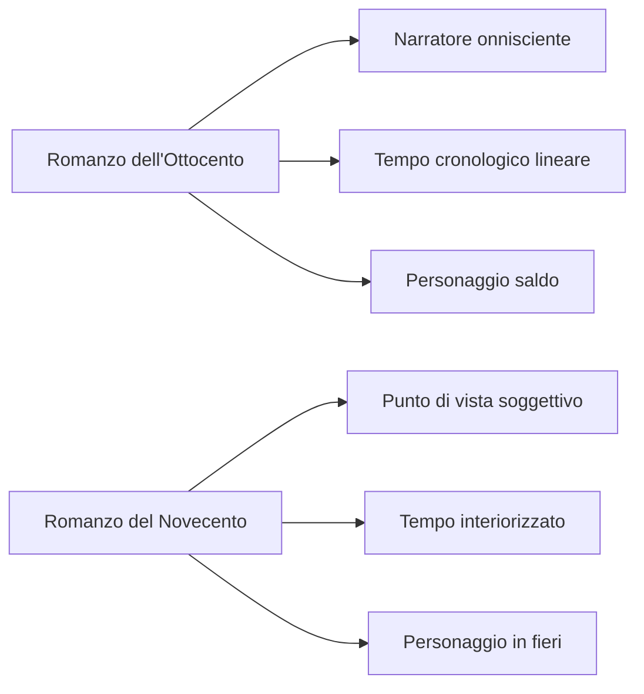
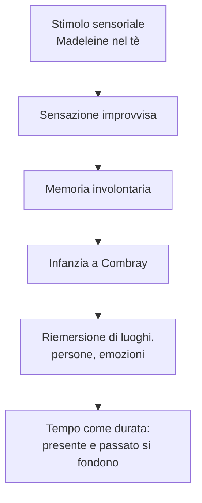
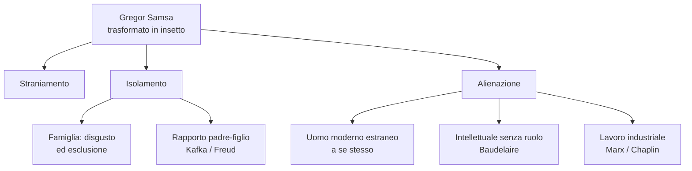
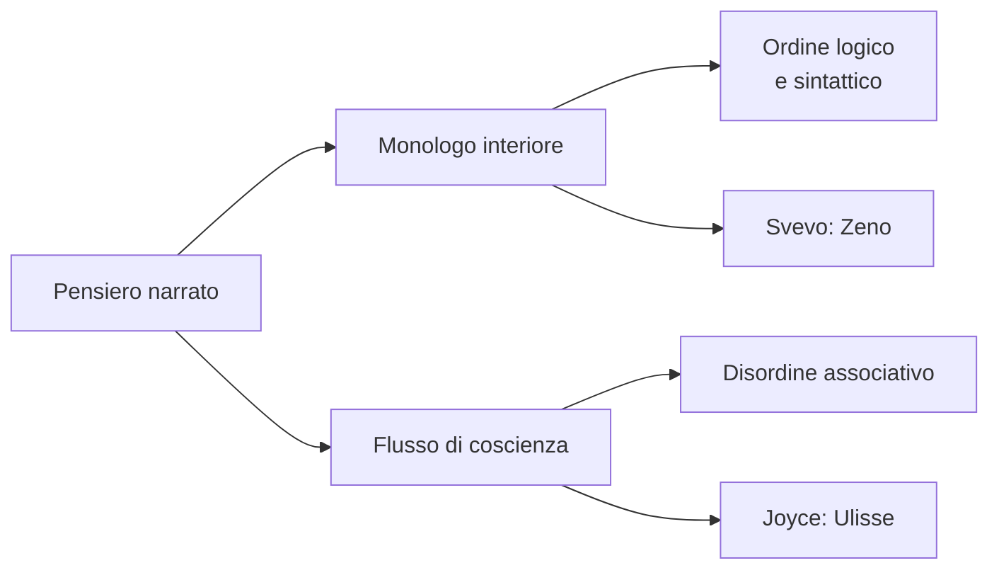
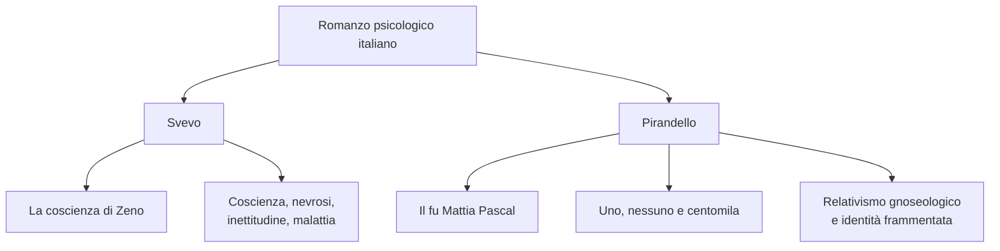
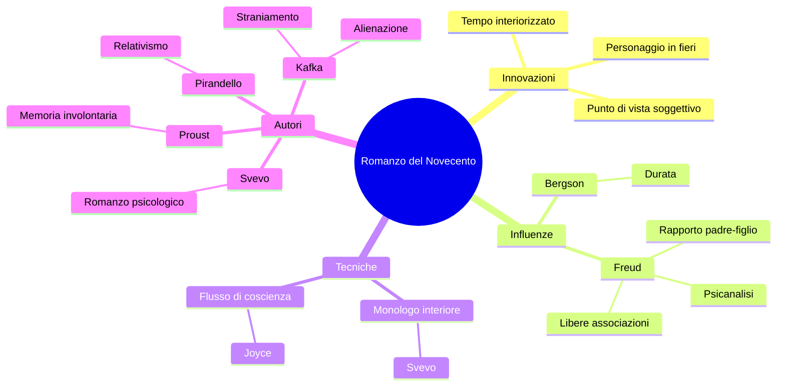

# Il romanzo del Novecento

---

## Coordinate essenziali

| Elemento | Dettaglio |
|----------|-----------|
| **Contesto** | Primo Novecento europeo, crisi delle certezze positiviste |
| **Influenze filosofiche** | Henri Bergson: tempo come durata; Sigmund Freud: psicanalisi |
| **Autori europei chiave** | Marcel Proust, Franz Kafka, James Joyce |
| **Autori italiani chiave** | Italo Svevo, Luigi Pirandello |
| **Genere dominante in Italia** | Romanzo psicologico |
| **Opere di riferimento** | *Dalla parte di Swann*, *La metamorfosi*, *Ulisse*, *La coscienza di Zeno*, *Il fu Mattia Pascal*, *Uno, nessuno e centomila* |

---

## 1. Dall'Ottocento al Novecento: la rivoluzione del romanzo

### 1.1 Il modello ottocentesco

Per capire il romanzo del Novecento bisogna partire dal romanzo dell'Ottocento, rappresentato in Italia soprattutto da *I Promessi Sposi* di Manzoni. Il romanzo ottocentesco si fonda su tre elementi stabili:

- il **narratore onnisciente**, che domina la storia dall'alto, conosce eventi e pensieri dei personaggi e può commentare ciò che accade;
- il **tempo cronologico lineare**, ordinato come una sequenza di fatti successivi;
- il **personaggio saldo e coerente**, "a tutto tondo", con un'identità riconoscibile e compatta.

In questo modello esiste ancora l'idea che la realtà sia conoscibile e narrabile in modo ordinato.

### 1.2 Le tre innovazioni del Novecento

Il romanzo novecentesco mette in crisi proprio questi pilastri.

**Primo: cambia il punto di vista.** Il narratore non è più una voce onnisciente e superiore, ma spesso coincide con la coscienza di un personaggio. La realtà viene filtrata da uno sguardo soggettivo, parziale e deformante. Per questo il narratore può diventare **inattendibile**: non offre una verità assoluta, ma una versione dei fatti legata alla propria interiorità. Ne *La coscienza di Zeno*, ad esempio, tutto passa attraverso Zeno e attraverso il modo in cui egli ricorda, giustifica e contraddice se stesso.

**Secondo: cambia il tempo.** Il tempo non è più soltanto quello esterno dell'orologio, ma diventa **tempo soggettivo**, cioè percepito dall'interiorità. Un'ora può sembrare lunghissima o brevissima a seconda dello stato d'animo, del desiderio, dell'attesa. Questa concezione dipende molto da **Henri Bergson**, che parla del tempo come **durata**: un fluire continuo in cui presente, passato e futuro si compenetrano.

In Svevo questo si vede nella struttura de *La coscienza di Zeno*, che non procede in ordine cronologico ma per nuclei tematici: *Il fumo*, *La morte di mio padre*, *Storia del mio matrimonio*, *Un'impresa commerciale*. Il tempo del romanzo non è lineare: è il tempo della memoria e della coscienza.

**Terzo: cambia il personaggio.** Il protagonista novecentesco non è più stabile, ma **ambiguo, incerto, sfumato**, un personaggio **in fieri**, cioè in divenire. La sua identità non è compatta, ma problematica. Da qui derivano isolamento, estraniamento, solitudine e frantumazione dell'io.

> [!tip] Formula da interrogazione
> Il romanzo psicologico del Novecento si riconosce da tre trasformazioni: **punto di vista soggettivo**, **tempo interiorizzato**, **personaggio ambiguo e in divenire**. Da qui nascono narratore inattendibile, identità frammentata e crisi della verità unica.

Questa crisi si collega al **relativismo gnoseologico** di Pirandello: non esiste una realtà unica conoscibile in modo definitivo, ma tante verità quante sono le persone.

---

## 2. Marcel Proust e la memoria involontaria

### 2.1 La Madeleine

L'episodio più celebre del tempo interiorizzato è quello della **Madeleine** in *Dalla parte di Swann* (1913), primo volume di *Alla ricerca del tempo perduto* di Marcel Proust. Il protagonista, ormai adulto, assaggia una Madeleine intinta nel tè. Quel sapore gli provoca una sensazione improvvisa e potentissima: non recupera solo un ricordo, ma rivive un intero mondo passato, legato all'infanzia a Combray e alla zia Léonie.

Questo meccanismo si chiama **memoria involontaria**. Non è un ricordo cercato razionalmente, ma un ricordo che emerge da sé, provocato da uno stimolo sensoriale. In questo caso agisce il gusto, ma anche l'olfatto è spesso decisivo. La memoria involontaria non riporta alla mente soltanto un fatto: fa riaffiorare emozioni, luoghi, persone e sensazioni come se fossero ancora presenti.

> [!warning] Da non confondere
> La memoria involontaria **non è il déjà vu**. Nel déjà vu si ha l'impressione di aver già vissuto una situazione; in Proust, invece, uno stimolo sensoriale fa riemergere un passato reale e profondo.

### 2.2 Il valore del testo

Nel brano della Madeleine il protagonista capisce che la verità non è nella bevanda, ma **dentro di lui**. Il tè e il dolce non contengono il passato: lo risvegliano. La vista della Madeleine non aveva prodotto nulla, perché l'immagine si era mescolata ad altri ricordi più recenti; invece il sapore era rimasto fedele e aveva conservato il legame con Combray.

Proust insiste proprio sulla forza di **odore e sapore**, più tenui ma anche più persistenti rispetto alle immagini. Quando le persone muoiono e le cose scompaiono, sono queste sensazioni minime a sorreggere "l'immenso edificio del ricordo". Da un sorso di tè e da un dolcetto nasce così un intero universo: casa, città, strade, giardini, persone, cioè tutta Combray.

### 2.3 I piani del tempo

L'episodio mostra perfettamente la sovrapposizione dei piani temporali nel romanzo novecentesco. Il presente dell'assaggio richiama il passato dell'infanzia; il ricordo non segue una successione ordinata, ma ritorna attraverso la sensazione. È il tempo bergsoniano della **durata**, in cui i momenti non sono separati ma si compenetrano.

---

## 3. Franz Kafka e *La metamorfosi*

### 3.1 Straniamento ed estraniamento

*La metamorfosi* di Kafka (1916) è uno degli esempi più forti dell'isolamento del personaggio novecentesco. Il protagonista, **Gregor Samsa**, è un commesso viaggiatore che una mattina si sveglia trasformato in un enorme insetto.

La particolarità del racconto sta nel modo in cui l'evento viene narrato: la trasformazione, assurda e quasi fiabesca, è presentata come se fosse un fatto ordinario. Questa tecnica è lo **straniamento**: mostrare come normale ciò che è fuori dal comune, producendo spaesamento nel lettore.

L'incipit accosta la metamorfosi a dettagli realistici: la camera, il campionario di telerie, l'illustrazione ritagliata dal giornale, la cornice dorata. Proprio il contrasto tra fatto surreale e ambiente quotidiano crea l'effetto kafkiano.

Anche la reazione di Gregor è straniante: invece di disperarsi per la trasformazione, pensa al brutto tempo e alla possibilità di fare un altro dormitino. L'assurdo viene trattato con una normalità inquietante.

### 3.2 I significati della metamorfosi

La metamorfosi ha diversi livelli di significato.

**Sul piano personale e biografico**, Gregor richiama la condizione di Kafka. È l'uomo che sostiene economicamente la famiglia e che, quando non può più lavorare, viene escluso. La famiglia non lo comprende: prova disgusto, diffidenza e disperazione. Questo rimanda al rapporto conflittuale tra Kafka e il padre, espresso anche nella *Lettera al padre*, dove lo scrittore accusa il genitore di aver ostacolato la sua vocazione letteraria.

Il tema padre-figlio è centrale nel romanzo del Novecento anche per l'influenza della **psicanalisi freudiana**: Freud mostra quanto i rapporti con i genitori e le figure di riferimento incidano sulla formazione psichica dell'individuo.

**Sul piano universale**, Gregor rappresenta l'intellettuale che ha perso il proprio ruolo nella società. Qui il collegamento è con Baudelaire e con la **perdita dell'aureola**: il poeta non è più una figura sacra o riconosciuta.

In senso ancora più ampio, Gregor incarna l'**alienazione** dell'uomo moderno. Alienazione deriva da *alienum*, cioè "estraneo": l'individuo diventa estraneo a se stesso, alla propria umanità e ai propri desideri. La lezione collegava questo tema anche a Marx, all'operaio ridotto a gesto ripetitivo, e a *Tempi moderni* di Charlie Chaplin, dove il lavoro industriale continua a dominare il corpo anche fuori dalla fabbrica.

---

## 4. Le tecniche narrative: monologo interiore e flusso di coscienza

### 4.1 Monologo interiore

Il **monologo interiore** presenta in prima persona i pensieri del personaggio, come se fossero rivolti a un interlocutore, anche se in realtà il personaggio parla a se stesso. La forma resta ancora ordinata: sintassi, logica e struttura del discorso sono riconoscibili.

Un esempio è il **Preambolo de *La coscienza di Zeno***, dove Zeno racconta di volersi autocurare e di aver comprato un volume di psicanalisi. Qui non c'è caos linguistico totale: c'è una voce interiore, ma ancora organizzata.

### 4.2 Flusso di coscienza

Il **flusso di coscienza** (*stream of consciousness*) è più radicale: registra i pensieri come sorgono nella mente, in modo spontaneo e alogico. La punteggiatura si riduce o scompare, la sintassi si disgrega, i pensieri procedono per **libere associazioni**.

Il legame con Freud è evidente: le libere associazioni sono uno dei meccanismi della psicanalisi. La scrittura imita il funzionamento della psiche senza l'intervento ordinatore del narratore.

L'esempio per eccellenza è l'*Ulisse* di **James Joyce** (1922), dove la coscienza dei personaggi viene trascritta nel suo scorrere immediato, con salti, ritorni, associazioni improvvise e assenza di filtro logico.

> [!warning] Errore da evitare all'esame
> Non dire che Zeno usa il flusso di coscienza. **Zeno = monologo interiore**; **Joyce, *Ulisse* = flusso di coscienza**. Nel monologo interiore resta un ordine logico-sintattico; nel flusso di coscienza dominano associazione libera, sintassi spezzata e punteggiatura assente o ridotta.

| Tecnica | Definizione | Caratteristiche | Esempio |
|---------|-------------|-----------------|---------|
| **Monologo interiore** | Pensieri in prima persona, come rivolti a qualcuno | Struttura logica e sintattica ancora presente | Preambolo de *La coscienza di Zeno* |
| **Flusso di coscienza** | Pensieri registrati nel loro fluire spontaneo | Associazioni libere, sintassi disgregata, punteggiatura ridotta | *Ulisse* di Joyce |

---

## 5. James Joyce e l'*Ulisse*

Joyce è il maestro del flusso di coscienza nella letteratura inglese. In *Ulisse* (1922) porta questa tecnica alla forma più radicale: il pensiero viene trascritto così come emerge, senza ordine narrativo tradizionale e senza un filtro che lo renda pienamente logico.

Il romanzo simula il funzionamento della coscienza umana: un pensiero richiama un altro, un'immagine ne produce un'altra, il discorso procede per salti e associazioni. Per questo Joyce è fondamentale nel quadro del romanzo novecentesco: mostra che la vera materia narrativa non è più soltanto l'azione esterna, ma il movimento interno della mente.

---

## 6. Italo Svevo e *La coscienza di Zeno*

### 6.1 Un romanzo-paradigma

*La coscienza di Zeno* (1923) è uno dei romanzi italiani più rappresentativi del Novecento e riunisce molte innovazioni del nuovo romanzo.

**Punto di vista ristretto.** L'io narrante è Zeno, o meglio la sua coscienza. Tutto ciò che il lettore conosce passa attraverso il suo sguardo soggettivo.

**Narratore inattendibile.** Zeno non racconta se stesso in modo neutro: si giustifica, si contraddice, tenta di assolversi. Il lettore deve quindi interpretare criticamente la sua autobiografia.

**Tempo soggettivo.** Il romanzo non segue una cronologia lineare, ma è organizzato per temi. Presente, passato e futuro si richiamano continuamente.

**Forma autobiografica.** Il racconto assume la forma di memorie, cioè di ricostruzione del vissuto del personaggio.

**Psicanalisi.** Svevo usa la psicanalisi soprattutto come strumento letterario. Non la presenta come guarigione sicura: Zeno abbandona la cura e arriva a considerare la vita stessa come malattia. Però la psicanalisi permette di esplorare nevrosi, contraddizioni, infanzia e zone oscure dell'io.

### 6.2 Svevo e Pirandello

In Italia, Svevo e **Pirandello** sono i principali autori del romanzo psicologico. Entrambi indagano l'interiorità, la crisi dell'identità e la fine delle certezze.

Pirandello, con *Il fu Mattia Pascal* e *Uno, nessuno e centomila*, insiste sul relativismo: l'identità non è unica, ma dipende dagli sguardi degli altri e dalle forme sociali che imprigionano l'individuo. Svevo, invece, concentra l'attenzione sulla coscienza malata e contraddittoria di Zeno.

---

## 7. Quadro riassuntivo

Il romanzo del Novecento nasce dalla crisi delle certezze ottocentesche. Non domina più il narratore onnisciente, non regge più il tempo lineare, non esiste più un personaggio stabile e compatto. Al loro posto troviamo coscienze soggettive, tempi interiori, identità incerte.

Le influenze decisive sono **Bergson**, con il tempo come durata, e **Freud**, con la psicanalisi, l'importanza dell'infanzia, del rapporto con i genitori e delle libere associazioni. Sul piano letterario, Proust mostra la memoria involontaria, Kafka l'estraniamento e l'alienazione, Joyce il flusso di coscienza, Svevo e Pirandello il romanzo psicologico italiano.

---

## 8. Date e opere di riferimento

| Anno | Opera / Evento |
|------|----------------|
| **1913** | Marcel Proust, *Dalla parte di Swann*, primo volume di *Alla ricerca del tempo perduto* |
| **1916** | Franz Kafka, *La metamorfosi* |
| **1922** | James Joyce, *Ulisse* |
| **1923** | Italo Svevo, *La coscienza di Zeno* |

---

*Fonti: lezione del 09/04/2026 — Lingua e letteratura italiana*
