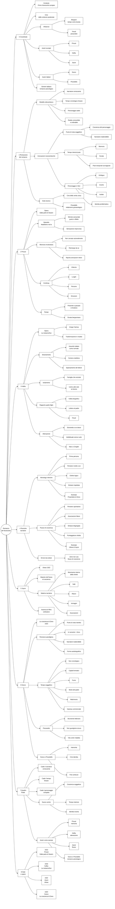

# Schema prova — Romanzo del Novecento

Schema ramificato ma ordinato: segue la sequenza del `riassunto.md`, con rami ricchi e leggibili anche in bianco e nero.

```mermaid
%%{init: {"theme": "base", "themeVariables": {"primaryColor": "#ffffff", "primaryTextColor": "#000000", "primaryBorderColor": "#000000", "lineColor": "#000000", "secondaryColor": "#f5f5f5", "tertiaryColor": "#ffffff"}}}%%
flowchart LR
    R(("Romanzo<br/>del Novecento"))

    R --> C0["0 Coordinate"]
    R --> C1["1 Rivoluzione<br/>del romanzo"]
    R --> C2["2 Proust"]
    R --> C3["3 Kafka"]
    R --> C4["4 Tecniche<br/>narrative"]
    R --> C5["5 Joyce"]
    R --> C6["6 Svevo"]
    R --> C7["7 Quadro<br/>finale"]
    R --> C8["8 Date<br/>e opere"]

    C0 --> C0A["Contesto<br/>Primo Novecento europeo"]
    C0 --> C0B["Crisi<br/>delle certezze positiviste"]
    C0 --> C0C["Influenze"]
    C0C --> C0C1["Bergson<br/>tempo come durata"]
    C0C --> C0C2["Freud<br/>psicanalisi"]
    C0 --> C0D["Autori europei"]
    C0D --> C0D1["Proust"]
    C0D --> C0D2["Kafka"]
    C0D --> C0D3["Joyce"]
    C0 --> C0E["Autori italiani"]
    C0E --> C0E1["Svevo"]
    C0E --> C0E2["Pirandello"]
    C0 --> C0F["Genere italiano<br/>romanzo psicologico"]

    C1 --> C1A["Modello ottocentesco"]
    C1A --> C1A1["Narratore onnisciente"]
    C1A --> C1A2["Tempo cronologico lineare"]
    C1A --> C1A3["Personaggio saldo"]
    C1A --> C1A4["Realta conoscibile<br/>e ordinabile"]
    C1 --> C1B["Innovazioni novecentesche"]
    C1B --> C1B1["Punto di vista soggettivo"]
    C1B1 --> C1B1a["Coscienza del personaggio"]
    C1B1 --> C1B1b["Narratore inattendibile"]
    C1B --> C1B2["Tempo interiorizzato"]
    C1B2 --> C1B2a["Memoria"]
    C1B2 --> C1B2b["Durata"]
    C1B2 --> C1B2c["Piani temporali sovrapposti"]
    C1B --> C1B3["Personaggio in fieri"]
    C1B3 --> C1B3a["Ambiguo"]
    C1B3 --> C1B3b["Incerto"]
    C1B3 --> C1B3c["Isolato"]
    C1B3 --> C1B3d["Identita problematica"]
    C1 --> C1C["Esito teorico"]
    C1C --> C1C1["Crisi della verita unica"]
    C1C --> C1C2["Pirandello<br/>relativismo gnoseologico"]

    C2 --> C2A["Opera<br/>Dalla parte di Swann"]
    C2 --> C2B["Episodio<br/>Madeleine nel te"]
    C2B --> C2B1["Stimolo sensoriale<br/>gusto e olfatto"]
    C2B --> C2B2["Sensazione improvvisa"]
    C2 --> C2C["Memoria involontaria"]
    C2C --> C2C1["Non cercata razionalmente"]
    C2C --> C2C2["Riemerge da se"]
    C2C --> C2C3["Riporta sensazioni intere"]
    C2 --> C2D["Combray"]
    C2D --> C2D1["Infanzia"]
    C2D --> C2D2["Luoghi"]
    C2D --> C2D3["Persone"]
    C2D --> C2D4["Emozioni"]
    C2 --> C2E["Tempo"]
    C2E --> C2E1["Presente e passato<br/>si fondono"]
    C2E --> C2E2["Durata bergsoniana"]

    C3 --> C3A["Opera<br/>La metamorfosi"]
    C3A --> C3A1["Gregor Samsa"]
    C3A --> C3A2["Trasformazione in insetto"]
    C3 --> C3B["Straniamento"]
    C3B --> C3B1["Assurdo trattato<br/>come normale"]
    C3B --> C3B2["Camera realistica"]
    C3B --> C3B3["Spaesamento del lettore"]
    C3 --> C3C["Isolamento"]
    C3C --> C3C1["Famiglia che esclude"]
    C3C --> C3C2["Uomo utile solo<br/>se lavora"]
    C3 --> C3D["Rapporto padre figlio"]
    C3D --> C3D1["Kafka biografico"]
    C3D --> C3D2["Lettera al padre"]
    C3D --> C3D3["Freud"]
    C3 --> C3E["Alienazione"]
    C3E --> C3E1["Estraneita a se stessi"]
    C3E --> C3E2["Intellettuale senza ruolo"]
    C3E --> C3E3["Marx e Chaplin"]

    C4 --> C4A["Monologo interiore"]
    C4A --> C4A1["Prima persona"]
    C4A --> C4A2["Pensiero rivolto a se"]
    C4A --> C4A3["Ordine logico"]
    C4A --> C4A4["Sintassi rispettata"]
    C4A --> C4A5["Esempio<br/>Preambolo di Zeno"]
    C4 --> C4B["Flusso di coscienza"]
    C4B --> C4B1["Pensiero spontaneo"]
    C4B --> C4B2["Associazioni libere"]
    C4B --> C4B3["Sintassi disgregata"]
    C4B --> C4B4["Punteggiatura ridotta"]
    C4B --> C4B5["Esempio<br/>Ulisse di Joyce"]
    C4 --> C4C["Errore da evitare"]
    C4C --> C4C1["Zeno non usa<br/>flusso di coscienza"]

    C5 --> C5A["Ulisse 1922"]
    C5 --> C5B["Maestro del flusso<br/>di coscienza"]
    C5 --> C5C["Materia narrativa"]
    C5C --> C5C1["Movimento interno<br/>della mente"]
    C5C --> C5C2["Salti"]
    C5C --> C5C3["Ritorni"]
    C5C --> C5C4["Immagini"]
    C5C --> C5C5["Associazioni"]
    C5 --> C5D["Assenza di filtro<br/>ordinatore"]

    C6 --> C6A["La coscienza di Zeno<br/>1923"]
    C6 --> C6B["Romanzo paradigma"]
    C6B --> C6B1["Punto di vista ristretto"]
    C6B --> C6B2["Io narrante = Zeno"]
    C6B --> C6B3["Narratore inattendibile"]
    C6B --> C6B4["Forma autobiografica"]
    C6 --> C6C["Tempo soggettivo"]
    C6C --> C6C1["Non cronologico"]
    C6C --> C6C2["Capitoli tematici"]
    C6C --> C6C3["Fumo"]
    C6C --> C6C4["Morte del padre"]
    C6C --> C6C5["Matrimonio"]
    C6C --> C6C6["Impresa commerciale"]
    C6 --> C6D["Psicanalisi"]
    C6D --> C6D1["Strumento letterario"]
    C6D --> C6D2["Non guarigione sicura"]
    C6D --> C6D3["Vita come malattia"]
    C6 --> C6E["Svevo e Pirandello"]
    C6E --> C6E1["Interiorita"]
    C6E --> C6E2["Crisi identita"]
    C6E --> C6E3["Fine certezze"]

    C7 --> C7A["Cade il narratore<br/>onnisciente"]
    C7 --> C7B["Cade il tempo<br/>lineare"]
    C7 --> C7C["Cade il personaggio<br/>compatto"]
    C7 --> C7D["Nuovo centro"]
    C7D --> C7D1["Coscienza soggettiva"]
    C7D --> C7D2["Tempo interiore"]
    C7D --> C7D3["Identita incerta"]
    C7 --> C7E["Autori come esempi"]
    C7E --> C7E1["Proust<br/>memoria"]
    C7E --> C7E2["Kafka<br/>alienazione"]
    C7E --> C7E3["Joyce<br/>flusso"]
    C7E --> C7E4["Svevo e Pirandello<br/>romanzo psicologico"]

    C8 --> C8A["1913<br/>Proust<br/>Dalla parte di Swann"]
    C8 --> C8B["1916<br/>Kafka<br/>La metamorfosi"]
    C8 --> C8C["1922<br/>Joyce<br/>Ulisse"]
    C8 --> C8D["1923<br/>Svevo<br/>La coscienza di Zeno"]
```
