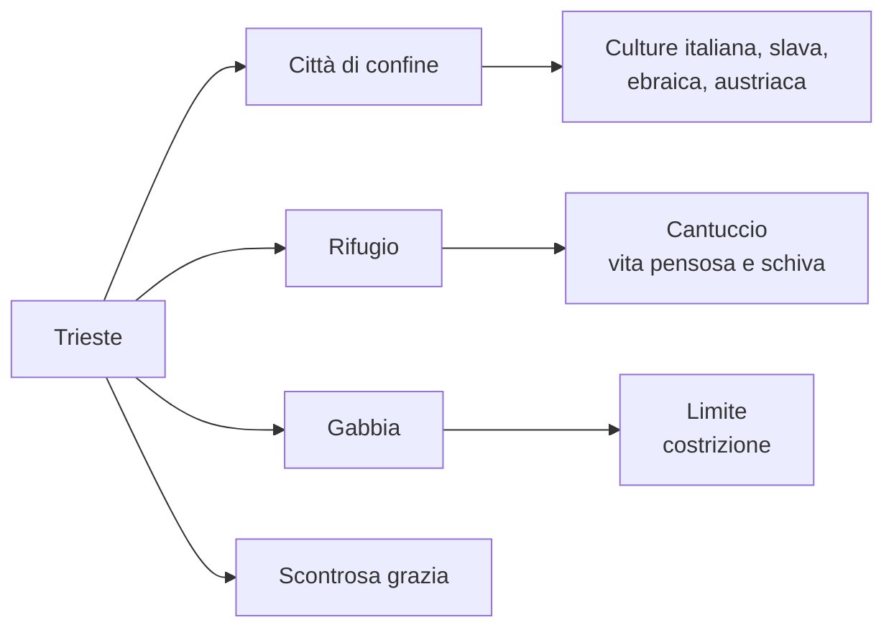
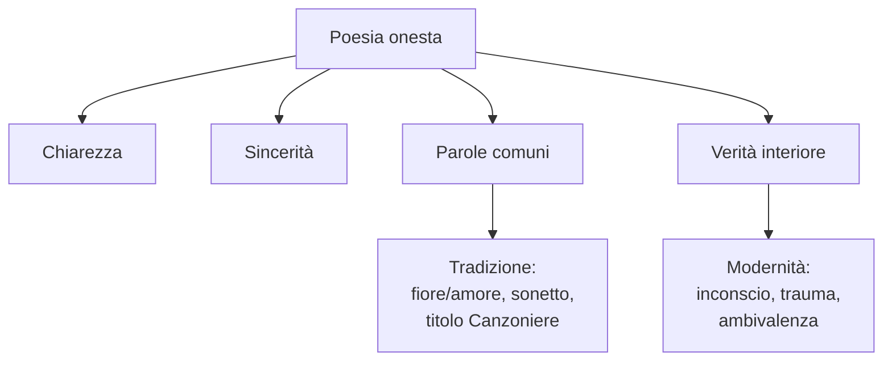
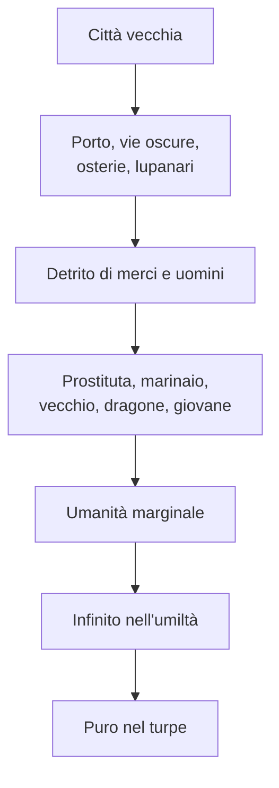
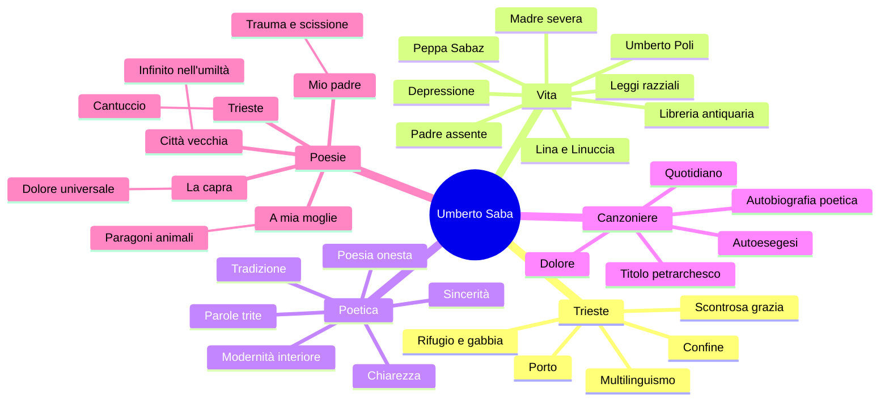

# Umberto Saba

---

## Coordinate essenziali

| Elemento | Dettaglio |
|----------|-----------|
| **Vero nome** | Umberto Poli |
| **Pseudonimo** | Umberto Saba |
| **Nascita e morte** | Trieste, 1883 - 1957 |
| **Famiglia** | Madre ebrea, padre cristiano assente, balia slovena Peppa Sabaz |
| **Figure decisive** | Padre, madre, Peppa, moglie Lina/Carolina, figlia Linuccia |
| **Lavoro** | Autodidatta; dal 1919 libraio antiquario a Trieste |
| **Opera principale** | *Il Canzoniere*, autobiografia poetica di una vita |
| **Poetica** | Poesia onesta: chiarezza, sincerità, parole comuni, verità interiore |
| **Contesto** | Trieste di confine, cultura mitteleuropea, psicoanalisi |

---

## 1. Trieste: città di confine

Saba nasce a **Trieste**, che per lui non è solo un luogo biografico, ma una vera matrice culturale e interiore. È una città di **porto**, di commercio, di passaggio, aperta a culture diverse: italiana, slava, tedesca, austriaca, ebraica. Per questo è una città **multilingue e multietnica**, diversa dai centri italiani più chiusi dentro una tradizione nazionale.

La Trieste di Saba appartiene allo stesso orizzonte di **Svevo**, **Joyce**, **Slataper** e **Michelstaedter**: un ambiente di frontiera, inquieto, più vicino alla cultura mitteleuropea che a un'Italia letteraria uniforme. Il legame con Svevo è particolarmente utile: entrambi sono triestini, entrambi entrano in contatto con la psicoanalisi, entrambi indagano l'interiorità.

Il rapporto di Saba con la città è però **ambivalente**. Trieste è amata perché è il suo rifugio, il suo "cantuccio", lo spazio concreto della vita quotidiana; ma è anche sofferta perché può diventare gabbia, limite, confine che trattiene. In questo senso il paragone con **Recanati per Leopardi** è importante: città dell'origine, ma anche della costrizione.

Nella poesia *Trieste* questa doppiezza si concentra nella formula **scontrosa grazia**: Trieste ha una bellezza aspra, schiva, difficile, non addolcita.

---

## 2. Vita e ferite originarie

### 2.1 Infanzia, padre, madre

Umberto Saba nasce come **Umberto Poli** nel **1883**. La sua vita non è importante per grandi avventure esteriori, ma per le fratture intime che diventano materia poetica: padre assente, madre severa, balia amata, doppia origine religiosa e culturale.

La madre è **ebrea**, il padre è **cristiano**. Questa doppia appartenenza produce in Saba una scissione profonda, che ritorna anche nella poesia *Mio padre è stato per me l'assassino*, dove il verso finale parla di "**due razze in antica tenzone**".

Il padre abbandona la famiglia prima della nascita del figlio. Saba cresce attraverso il giudizio rancoroso della madre, che lo presenta come un "**assassino**": non in senso letterale, ma come colui che ha distrutto la famiglia fuggendo dalle proprie responsabilità. Quando Saba lo conosce, verso i vent'anni, scopre però un uomo infantile, leggero, irresponsabile, non un mostro. In lui riconosce anche qualcosa di sé: lo sguardo, il sorriso, forse il **dono della poesia**.

| Figura | Funzione nella vita e nella poesia |
|--------|------------------------------------|
| **Padre** | Assenza, ferita, irresponsabilità, ma anche somiglianza e possibile dono poetico |
| **Madre** | Severità, dolore dell'abbandono, giudizio rancoroso sul padre |
| **Peppa Sabaz** | Balia slovena, affetto infantile, possibile origine dello pseudonimo |
| **Lina** | Moglie, amore domestico, figura anche materna e ambivalente |
| **Linuccia** | Figlia, presenza affettiva nella vita familiare |

### 2.2 Peppa, Lina e il nome Saba

La madre affida il bambino alla balia slovena **Peppa Sabaz**. Con lei Saba vive un'esperienza affettuosa, calda, quasi materna, in contrasto con la durezza della madre. Per questo Peppa resta una figura decisiva.

Lo pseudonimo **Saba** viene collegato sia al cognome **Sabaz**, quindi alla memoria della balia, sia a un richiamo ebraico. Il nome tiene insieme affetto infantile e identità familiare profonda.

La moglie **Lina**, cioè Carolina Woelfler, è la donna centrale della sua poesia. Il matrimonio è segnato da amore, crisi e ritorni: Lina lo abbandona per un breve periodo, poi torna. In Saba la moglie è amata come donna concreta e quotidiana, ma può assumere anche una funzione materna, di cura e accudimento. In *Ed amai nuovamente* è ricordata attraverso il **rosso scialle**, immagine domestica di passione, amore e dolore.

### 2.3 Lavoro, storia, ultimi anni

Saba è **autodidatta**: la sua cultura nasce da letture personali, non da una formazione accademica regolare. Dal **1919** gestisce una **libreria antiquaria** a Trieste.

La storia del Novecento entra nella sua vita soprattutto con il fascismo e le **leggi razziali**. Per l'origine ebraica materna deve nascondersi e allontanarsi da Trieste, aiutato da amici e intellettuali come **Ungaretti** e **Montale**. Negli ultimi anni soffre di depressione, ricoveri e cure, fino alla morte nel **1957**.

---

## 3. Psicoanalisi e interiorità

Trieste è uno dei primi centri italiani in cui arriva la **psicoanalisi**, grazie alla vicinanza al mondo austriaco e mitteleuropeo. Saba entra in rapporto con essa attraverso **Edoardo Weiss**, medico triestino e allievo di Freud.

La psicoanalisi non è per lui una moda culturale: serve a leggere il trauma originario dell'infanzia, il rapporto con padre e madre, le zone oscure dell'io. Non risolve definitivamente la sua sofferenza, ma gli offre un linguaggio per nominarla.

Il confronto con **Svevo** chiarisce la differenza:

| Aspetto | Svevo | Saba |
|---------|-------|------|
| **Genere** | Romanzo | Poesia |
| **Nucleo** | Nevrosi borghese, inettitudine, autoinganno | Infanzia, trauma, padre, verità interiore |
| **Uso della psicoanalisi** | Strumento narrativo e ironico | Strumento di conoscenza personale |
| **Tono** | Distaccato, ironico | Sincero, diretto, doloroso |

Per Saba la poesia cerca la stessa cosa che la psicoanalisi porta alla luce: la **verità profonda dell'io**, spesso sepolta nell'inconscio.

---

## 4. La poetica: poesia onesta

### 4.1 Chiarezza, sincerità, verità

La formula decisiva è **poesia onesta**. Per Saba la poesia deve essere sincera, chiara, fedele a un'esperienza vera. Non deve stupire con artifici, maschere retoriche o novità formali forzate.

Onestà non significa banalità. Significa avere il coraggio di guardare dentro di sé, anche dove l'interiorità è torbida, contraddittoria, dolorosa. La lingua può essere semplice, vicina al parlato, ma proprio questa limpidezza deve portare alla luce verità difficili.

Questa idea è formulata nello scritto ***Quello che resta da fare ai poeti*** del **1911**. In un'epoca segnata da dannunzianesimo, avanguardie e sperimentalismo, Saba risponde che ai poeti resta da fare una cosa: scrivere **poesia onesta**.

| Modello | Valutazione di Saba |
|---------|---------------------|
| **Manzoni degli *Inni sacri*** | Anche se retoricamente non perfetto, è onesto perché mosso da sentimenti autentici |
| **D'Annunzio delle *Laudi*** | Può essere magnifico, ma rischia di essere effimero se cerca solo fascino e artificio |
| **Pascoli** | Più vicino a Saba per umili cose, quotidiano, affetti semplici |

Il punto non è la bravura tecnica isolata, ma la corrispondenza tra parola e verità interiore. Versi meno splendidi ma autentici valgono più di versi formalmente sublimi ma falsi.

### 4.2 Semplicità apparente e modernità interiore

La poesia di Saba sembra spesso semplice: discorsiva, narrativa, quasi prosaica. Usa parole comuni, situazioni quotidiane, forme tradizionali. Ma questa semplicità è solo apparente, perché dentro contiene inconscio, trauma, ambivalenza, dolore.

Saba non è moderno perché distrugge la forma. Al contrario, recupera il titolo petrarchesco *Canzoniere*, usa metri tradizionali, ama rime semplici come **fiore/amore**. La sua modernità non è soprattutto formale: è **interiore**. In pieno Novecento sceglie la chiarezza per dire ciò che è più difficile.

### 4.3 *Amai*: dichiarazione di poetica

*Amai* è una vera dichiarazione di poetica. Saba afferma di amare le "**trite parole**", cioè parole logore, consumate, dette e ridette, che molti poeti del primo Novecento non osavano più usare. La rima **fiore/amore** è "**la più antica**" perché appartiene alla tradizione italiana fin dalle origini, ma è anche "**la più difficile**" perché è talmente usata da sembrare quasi impossibile renderla nuova.

La ripetizione **"Amai / amai / amo"** funziona come anafora non perfettamente regolare e come **poliptoto**, perché la stessa radice verbale ritorna in forme diverse. I primi "Amai" guardano al passato della sua poesia; l'"Amo" finale porta il discorso nel presente e lo apre a chi ascolta: forse Lina, forse una musa, forse il lettore.

Il centro moderno della poesia è la **verità che giace al fondo**. Questa verità non è razionale e immediata: è simile a un **sogno obliato**, dimenticato al risveglio. È la verità dell'inconscio, che solo il **dolore** riesce ad avvicinare alla coscienza.

La "**buona carta**" finale è la poesia stessa: ciò che permette a Saba di conoscere sé stesso, consolarsi e comunicare con gli altri.

| Espressione | Significato |
|-------------|-------------|
| **Trite parole** | Lessico comune, tradizionale, apparentemente consumato |
| **Fiore/amore** | Rima antica e difficilissima da rendere autentica |
| **Verità che giace al fondo** | Inconscio, verità nascosta dell'io |
| **Sogno obliato** | Verità interiore ricordata solo per tracce |
| **Buona carta** | Poesia come carta vincente, conoscenza e consolazione |

---

## 5. *Il Canzoniere*

### 5.1 Titolo e struttura

L'opera principale di Saba è ***Il Canzoniere***. Il titolo richiama esplicitamente **Petrarca**: nel Novecento delle avanguardie, scegliere un titolo così tradizionale significa dichiarare fedeltà a una linea classica, ma senza retorica vuota.

Il *Canzoniere* è un'**autobiografia poetica**. Saba ordina in versi la propria vita: infanzia, padre, madre, Peppa, Trieste, Lina, Linuccia, desiderio, dolore, malattia, vecchiaia. La poesia non evade dalla vita: la raccoglie, la interpreta, le dà forma.

I temi ricorrenti sono:

- i fanciulli e le vie di Trieste;
- il porto, i caffè, la città vecchia;
- le donne amate, soprattutto Lina;
- gli affetti familiari e domestici;
- il dolore, la malattia, la ripetizione della sofferenza;
- la contemplazione delle cose quotidiane.

La vita appare segnata da un fondo di **dolore immutabile**: l'uomo spera in un domani migliore, ma ritrova spesso le stesse sofferenze. Tuttavia la poesia non è solo pessimismo: il dolore viene alleviato dalla contemplazione delle cose umili, dal canto intimo, dalla possibilità di riconoscersi nel quotidiano. Qui tornano i collegamenti con **Leopardi** per la coscienza del dolore e con **Pascoli** per le umili cose.

### 5.2 *Storia e cronistoria del Canzoniere*

Nel **1948** Saba pubblica ***Storia e cronistoria del Canzoniere***, uno scritto di **autoesegesi**: l'autore interpreta la propria opera, spesso parlando di sé in terza persona, e spiega occasioni, aneddoti, genesi dei testi, scelte poetiche.

Il testo mostra che il *Canzoniere* non è una raccolta casuale, ma un libro costruito, controllato e ripensato dall'autore. Saba vuole guidare il lettore dentro la storia della propria poesia e dentro la cronistoria concreta degli episodi quotidiani da cui nascono le liriche.

L'esempio più importante riguarda ***A mia moglie***. Lina era uscita, Saba era rimasto solo, una cagna gli si avvicinò e gli posò il muso sulle ginocchia. Da quell'immagine nacque la poesia, quasi di getto. Quando Lina tornò, Saba volle leggergliela subito, ma lei rimase male perché si sentì offesa dai paragoni con animali come pollastra, giovenca e cagna.

L'aneddoto chiarisce due punti: la poesia di Saba nasce da occasioni domestiche e quotidiane; ciò che sembra basso o offensivo può essere invece un elogio della **creaturalità**, della semplicità e della tenerezza.

L'edizione definitiva del *Canzoniere* esce postuma nel **1961**, segno che l'opera coincide quasi con l'intera vita poetica di Saba.

---

## 6. Le poesie principali

### 6.1 *La capra*: dolore universale

*La capra* parte da una scena minima: una capra sola, legata, bagnata dalla pioggia. È un animale comune, basso, non nobile, lontano dalla tradizione letteraria più solenne. Proprio per questo diventa rivelatore.

Nel belato della capra Saba riconosce un **dolore universale**, non solo umano ma proprio di tutti i viventi. Dal particolare più umile nasce una verità generale. La poesia realizza perfettamente la poetica onesta: situazione concreta, parole semplici, verità profonda.

| Elemento | Valore |
|----------|--------|
| **Capra** | Animale umile, povero, antieroico |
| **Belato** | Voce del dolore |
| **Solitudine** | Condizione comune del vivente |
| **Riconoscimento** | Il dolore animale parla anche dell'uomo |
| **Esito** | Dal quotidiano all'universale |

### 6.2 *Mio padre è stato per me l'assassino*

Questa poesia è un **sonetto**: forma tradizionale, contenuto modernissimo. Al centro ci sono infanzia, trauma, padre, madre, inconscio.

Il testo racconta il passaggio da una verità ricevuta a una verità personale. Da bambino Saba conosce il padre attraverso la parola della madre, che lo chiama "**assassino**"; da adulto lo incontra e scopre un uomo fragile, infantile, irresponsabile, ma non riducibile al rancore materno.

Il finale, "**eran due razze in antica tenzone**", riassume la scissione: padre e madre appartengono a mondi opposti, e dentro Saba quei mondi restano in conflitto.

### 6.3 *A mia moglie*

*A mia moglie* è fondata sui **paragoni animali**. Saba paragona Lina a creature umili non per offenderla, ma per lodare la vita nella sua immediatezza naturale, istintiva, corporea. L'animale in Saba non degrada: rivela una purezza creaturale.

La poesia è lontanissima dall'estetismo di **D'Annunzio**. Dove D'Annunzio cerca bellezza preziosa e aristocratica, Saba trova verità nell'ordinario, nel domestico, nel basso. Il sentimento dominante non è l'eros raffinato, ma la **tenerezza**.

Saba definisce il testo quasi **religioso**, come una preghiera laica. Il riferimento a Dio non va inteso in senso confessionale rigido: indica la dimensione creaturale degli animali, la loro innocenza e vicinanza alla vita elementare. Lina è simile alle femmine dei sereni animali che avvicinano a Dio perché appare non corrotta da falsità e calcolo.

La poesia è anche detta **proletaria** per la scelta di immagini non aristocratiche e **infantile** perché guarda il mondo con purezza diretta, come farebbe un bambino. Questa infantilità non è immaturità, ma capacità di amare le creature umili senza vergogna.

| Animale | Aspetto di Lina |
|---------|-----------------|
| **Bianca pollastra** | Umiltà terrena e fierezza quasi regale |
| **Gallinelle** | Voce dolce e malinconica dei lamenti |
| **Gravida giovenca** | Maternità, fertilità, bisogno di consolazione |
| **Lunga cagna** | Fedeltà, devozione, dolcezza e gelosia feroce |
| **Pavida coniglia** | Timidezza, vulnerabilità, istinto materno |
| **Rondine** | Leggerezza e annuncio di una nuova primavera |
| **Formica** | Operosità, previdenza, cura domestica |
| **Pecchia / ape** | Laboriosità naturale, con termine più letterario |

La struttura ripete "**Tu sei come**", creando un andamento quasi litanico, coerente con la preghiera laica. Il tono è prosaico e descrittivo; il lessico è quotidiano, ma con parole più alte o letterarie come **pecchia**, **assonna**, **quereli**. Anche qui la semplicità è solo apparente.

### 6.4 *Trieste*

*Trieste* esprime il rapporto ambivalente con la città: amore e tormento, rifugio e limite. L'espressione centrale è **scontrosa grazia**, cioè bellezza aspra, non pacificata.

La poesia è costruita come un percorso. Il poeta sale su un'**erta**, guarda la città dall'alto, vede chiese, vie, spiaggia ingombrata, collina e case aggrappate alla cima sassosa. Trieste è concreta e portuale, ma anche luogo dell'origine: ha un'**aria natia** inquieta, che riflette le scissioni interiori di Saba.

Alla fine la città offre un "**cantuccio**" adatto alla sua vita "**pensosa e schiva**". L'espressione richiama Petrarca e l'idea di una vita solitaria e meditativa. Saba recupera così la tradizione anche dentro un'esperienza moderna e personale.

| Elemento | Significato |
|----------|-------------|
| **Scontrosa grazia** | Bellezza difficile, aspra |
| **Erta** | Distanza da cui il poeta comprende la città |
| **Spiaggia ingombrata** | Porto, folla, concretezza |
| **Aria natia** | Origine inquieta |
| **Cantuccio** | Rifugio personale |
| **Pensosa e schiva** | Vita ritirata, meditativa, di ascendenza petrarchesca |

### 6.5 *Città vecchia*

*Città vecchia*, dalla raccolta *Trieste e una donna*, mostra la Trieste bassa del porto: vie oscure, pozzanghere, fanali, osterie, lupanari, botteghe, miseria. Il poeta attraversa un'umanità marginale: prostituta, marinaio, vecchio che bestemmia, femmina che bega, dragone dal friggitore, giovane folle d'amore.

La formula "**merci ed uomini il detrito di un gran porto di mare**" è durissima: nel porto non circolano solo merci, ma anche esseri umani trattati come scarti. Saba non abbellisce il degrado, lo nomina direttamente.

Eppure proprio lì trova "**l'infinito nell'umiltà**". Umiltà rimanda a *humus*, la terra: ciò che è basso, povero, elementare. Dove la via è più **turpe**, il pensiero del poeta si fa più **puro**. È l'antitesi fondamentale: la purezza non nasce dal sublime, ma dal contatto con gli umili.

Il verso "**s'agita in esse, come in me, il Signore**" non va letto come confessione religiosa tradizionale. Indica piuttosto una dignità creaturale, quasi sacra, che attraversa prostituta, marinaio, vecchio, soldato, giovane e poeta. Saba sente di appartenere alla stessa umanità ferita.

Il confronto con **Pasolini** e **De André** può aiutare: anche loro guardano marginalità, prostituzione, povertà e città portuali senza ridurle a puro degrado morale. In Saba però il nucleo resta specifico: l'infinito si trova nell'umiltà e il pensiero si purifica nel luogo più basso.

### 6.6 *Ed amai nuovamente*

La lezione accenna anche a *Ed amai nuovamente*, legata a Lina. Vanno ricordati alcuni nuclei: l'avvio con la congiunzione sembra continuare un discorso già iniziato; Lina è associata al **rosso scialle**; accanto alla coppia appare Linuccia; Saba riconosce di aver conosciuto altri amori, ma per Lina vorrebbe ricominciare una vita nuova. Il punto più forte è che Lina ha saputo amare tutto, ma non sé stessa.

---

## 7. Cronologia essenziale

| Anno | Evento |
|------|--------|
| **1883** | Nasce a Trieste Umberto Poli |
| **Infanzia** | Padre assente, madre severa, balia Peppa Sabaz |
| **Circa 1903** | Conosce il padre intorno ai vent'anni |
| **1909** | Sposa Lina/Carolina; nasce Linuccia |
| **1919** | Acquista e gestisce una libreria antiquaria |
| **Anni 1920-1930** | Costruisce progressivamente *Il Canzoniere* |
| **Anni 1930** | Si avvicina alla psicoanalisi con Edoardo Weiss |
| **Dal 1938** | Leggi razziali: deve nascondersi e viene aiutato da amici |
| **1948** | Pubblica *Storia e cronistoria del Canzoniere* |
| **1957** | Muore dopo depressione e ricoveri |
| **1961** | Esce l'edizione definitiva postuma del *Canzoniere* |

---

## 8. Collegamenti utili

| Collegamento | Perché serve |
|--------------|--------------|
| **Svevo** | Trieste, psicoanalisi, interiorità |
| **Leopardi** | Rapporto ambivalente con la città d'origine e coscienza del dolore |
| **Petrarca** | Titolo *Canzoniere*, tradizione, vita pensosa e schiva |
| **D'Annunzio** | Contrasto con estetismo, artificio, bellezza aristocratica |
| **Pascoli** | Umili cose, quotidiano, affetti semplici |
| **Freud / Weiss** | Psicoanalisi, trauma, inconscio |
| **Pasolini / De André** | Confronti sul mondo degli umili e degli esclusi, soprattutto per *Città vecchia* |

---

## 9. Mappa conclusiva

---

*Fonte unica: `saba/mega-schema.md`.*
