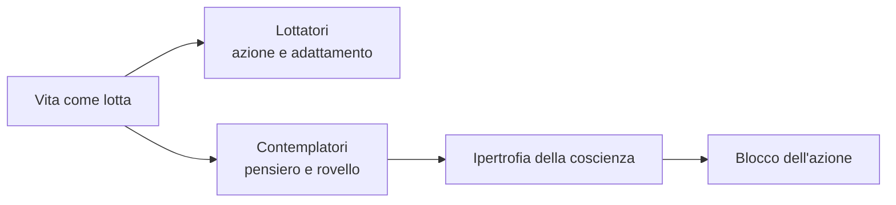
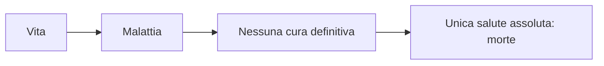
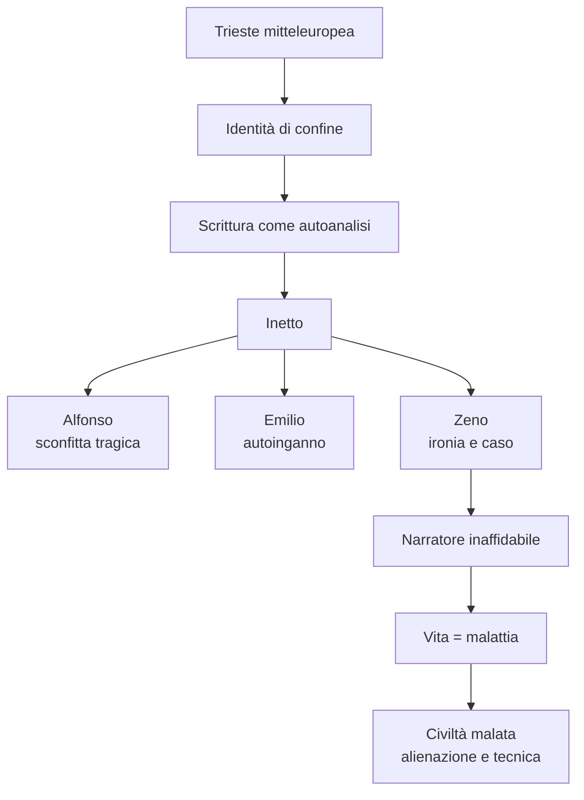

# Italo Svevo

---

## 1. Vita, formazione e identità di confine

Italo Svevo, pseudonimo di **Ettore Schmitz**, nasce a **Trieste** nel 1861 e muore nel 1928 dopo un incidente d'auto. Il nome scelto unisce l'identità italiana e il mondo germanico-mitteleuropeo: Trieste, città di porto e di confine, spiega infatti la sua posizione anomala nella letteratura italiana. Svevo non nasce dentro una tradizione nazionale compatta, ma dentro un ambiente aperto al tedesco, al dialetto triestino, alla cultura europea e alle inquietudini del Novecento.

Studia in Germania, si forma in gran parte da **autodidatta**, lavora come impiegato di banca e poi entra nell'industria Veneziani dopo il matrimonio con **Livia Veneziani**. La sua lingua narrativa, spesso giudicata poco elegante, deriva anche dal fatto che l'italiano non è la sua lingua spontanea; proprio questa sobrietà però si adatta all'analisi della coscienza. Due incontri sono decisivi: **Joyce**, che ne riconosce il valore, e **Freud**, che gli offre strumenti per raccontare nevrosi, memoria, inconscio e autoinganno. Svevo non crede davvero nella psicoanalisi come cura, ma la usa come grande strumento letterario: la vera terapia resta la scrittura.

---

## 2. Scrittura, malattia e società borghese

La narrativa di Svevo nasce da una **scrittura di grado zero**: sobria, poco ornamentale, talvolta disarmonica, ma efficace perché concentra tutto sull'analisi dell'io. Scrivere significa osservare se stessi, smascherare bugie e autoinganni, trasformare il disagio in racconto e cercare una cura mai definitiva.

Il protagonista sveviano non è l'eroe ottocentesco né il superuomo: è l'**uomo ordinario del Novecento**, borghese, fragile, nevrotico, incapace di aderire pienamente alla vita. La **malattia** non è solo clinica: è il disagio dell'individuo in una società fondata su successo, profitto, competizione, apparenza e conformismo. La conclusione più radicale è che la malattia coincide con la vita stessa: vivere significa desiderare, fallire, invecchiare, soffrire e morire, perciò l'unica salute assoluta sarebbe la morte.

> [!note] Idea centrale
> In Svevo la domanda non è soltanto "di che cosa è malato Zeno?", ma "qual è la malattia dell'uomo?". La risposta è tragica: **la malattia è la vita**.

---

## 3. L'inetto e l'ipertrofia della coscienza

Il personaggio chiave è l'**inetto**, inadatto alla vita pratica, abulico, insicuro, incapace di decidere e agire con forza. Alfonso Nitti, Emilio Brentani e Zeno Cosini sono tre forme diverse di inettitudine:

| Romanzo | Inetto | Esito |
|---------|--------|-------|
| *Una vita* | Alfonso Nitti | Sconfitta tragica e suicidio |
| *Senilità* | Emilio Brentani | Fuga nell'illusione e nel sogno |
| *La coscienza di Zeno* | Zeno Cosini | Sopravvivenza ironica, caso favorevole, accettazione ambigua della malattia |

La radice dell'inettitudine è l'**ipertrofia della coscienza**: il personaggio pensa troppo, analizza troppo, rimugina su tutto. La coscienza, invece di aiutare l'azione, la blocca. Da qui nasce la dicotomia tra **lottatori** e **contemplatori**: i primi agiscono, si adattano e afferrano la preda; i secondi pensano, guardano, si tormentano. Il retroterra è darwiniano: la vita è lotta e selezione, ma gli inetti non possiedono gli strumenti per vincerla.

---

## 4. *Una vita*: Alfonso Nitti e le ali di gabbiano

*Una vita* esce nel 1893 ed è un insuccesso. Il protagonista è **Alfonso Nitti**, impiegato e primo grande inetto sveviano. Il cognome richiama il nulla: Alfonso è inconsistente, incapace di imporsi, destinato alla sconfitta. Dopo fallimenti lavorativi e sentimentali si suicida.

Il brano centrale è **"Con le ali di gabbiano ci si nasce"**. Alfonso è in barca con **Macario**, amico-nemico e antagonista simbolico: il nome deriva da *Makarios*, "felice", perché egli aderisce spontaneamente alla vita. Macario osserva i **gabbiani**: hanno poco cervello, ma ali, occhi, stomaco e istinto perfetti per cacciare. Vivere non richiede troppa riflessione, ma capacità di piombare sulla preda. Alfonso, invece, ha troppa coscienza e nessuna presa sul reale; possiede ali solo **"per fare voli poetici"**, cioè per immaginare, non per agire.

| Immagine | Significato |
|----------|-------------|
| **Gabbiano** | Perfetto adattamento alla vita e alla caccia |
| **Ali** | Capacità naturale di afferrare la preda; in Alfonso diventano fantasia |
| **Mani** | Presa concreta sul reale |
| **Cervello piccolo** | Non pensare troppo può favorire l'azione |
| **Voli poetici** | Immaginazione senza efficacia pratica |

---

## 5. *Senilità*: Emilio, Amalia, Balli e Angiolina

*Senilità* esce nel 1898 ed è anch'esso ignorato. Il protagonista è **Emilio Brentani**, giovane con ambizioni letterarie e grandezza solo potenziale. Il titolo non indica vecchiaia anagrafica: la **senilità** è una condizione interiore di fiacchezza, rinuncia, grigiore, monotonia e vita vissuta più nei pensieri che nella realtà.

Il romanzo riprende lo schema lottatori/contemplatori:

| Personaggio | Categoria | Funzione |
|-------------|-----------|----------|
| **Emilio** | Contemplatore | Autoinganno, velleità, incapacità di agire |
| **Amalia** | Contemplatrice | Chiusura, frustrazione, amore non corrisposto |
| **Stefano Balli** | Lottatore | Energia vitale, sicurezza, godimento della vita |
| **Angiolina** | Lottatrice | Concretezza, sensualità, infedeltà, realtà opposta all'ideale |

Emilio idealizza **Angiolina**, trasformandola in creatura pura e angelica, mentre lei è concreta, libera e infedele. Il suo problema è l'**autoinganno**: non vede la realtà, ma ciò che desidera vedere. Anche Amalia vive una forma di chiusura simile, mentre Balli e Angiolina rappresentano la vita che procede senza eccessiva coscienza.

---

## 6. *La coscienza di Zeno*: struttura e tecniche

*La coscienza di Zeno* viene pubblicato nel 1923, dopo il lungo silenzio editoriale. Il protagonista è **Zeno Cosini**: *Zeno* richiama *xenos*, "straniero", e indica estraneità agli altri e a se stesso; *Cosini* suggerisce piccolezza e insignificanza. Zeno è ancora un inetto, ma possiede **distacco ironico**, sa raccontarsi da lontano e spesso viene favorito dal caso.

La struttura comprende **Prefazione** del Dottor S., **Preambolo** di Zeno e blocchi tematici: *Il fumo*, *La morte di mio padre*, *Storia del mio matrimonio*, *La moglie e l'amante*, *Storia di un'associazione commerciale*, *Psicanalisi*. Non c'è ordine cronologico lineare: domina il **tempo misto**, cioè il tempo della coscienza, in cui la memoria procede per nuclei, associazioni, ritorni e contraddizioni.

| Tecnica | Funzione |
|---------|----------|
| **Prima persona** | Il racconto passa attraverso la coscienza di Zeno |
| **Monologo interiore** | Zeno ragiona, si corregge, si contraddice |
| **Narratore inaffidabile** | Verità e bugie sono intrecciate |
| **Tempo misto** | La memoria sostituisce la cronologia lineare |
| **Ironia** | Distanza critica dalla propria malattia |

---

## 7. Prefazione e Preambolo

La **Prefazione** è scritta dal **Dottor S.**, psicanalista di Zeno. Il nome è ambiguo: può rimandare a Svevo, a Sigmund Freud o a una Z rovesciata. Il medico pubblica le memorie del paziente per **vendetta**, perché Zeno ha interrotto la cura. Il gesto è scorretto: viola il rapporto medico-paziente e rende inaffidabile anche lo psicanalista.

Fin dall'inizio il romanzo mette in crisi la verità. Il Dottor S. dice che nelle memorie di Zeno ci sono verità e bugie, ma nemmeno lui è neutrale: è risentito, interessato, coinvolto. Il lettore non riceve una verità oggettiva, bensì punti di vista parziali.

Qui entrano anche **transfer** e **controtransfert**. Il transfer è la proiezione sul medico di sentimenti nati altrove; il controtransfert è la reazione emotiva del medico verso il paziente. Il Dottor S. non domina il proprio controtransfert, perché agisce per risentimento.

Nel **Preambolo** parla Zeno. Il medico gli ha suggerito di scrivere un'autobiografia, ma Zeno disobbedisce, vuole iniziare **ab ovo**, legge un trattato di psicoanalisi e prova a curarsi da solo. La psicoanalisi è quindi insieme usata e svalutata: fallisce come cura ordinata, ma genera il romanzo.

Zeno tenta di rivedere l'infanzia, ma gli anni lo separano dal passato: i suoi occhi sono **presbiti**, metafora della memoria deformata. Nel rilassamento vede una **locomotiva** che trascina molte vetture, immagine interpretabile come peso del vivere. Poi appare un **bambino in fasce**, forse lui, forse il figlio della cognata: chi nasce è già destinato alla malattia della vita.

La chiusa **"Ritenterò domani"** è il simbolo di Zeno: rimanda sempre, promette di ricominciare, rinnova i propositi senza concludere.

---

## 8. Il fumo: ultima sigaretta e nevrosi

Nel capitolo **Il fumo**, Zeno attribuisce al vizio la causa della propria malattia: abulia, debolezza, incapacità di volontà. Per questo tenta continuamente di smettere.

La formula centrale è **U.S.**, **ultima sigaretta**. Zeno annota date su libri, fogli e pareti, cercando giorni simbolici capaci di inaugurare una vita nuova. Ma ogni ultima sigaretta è seguita da un'altra: il proposito diventa rinnovabile all'infinito.

Una data importante è il **2 febbraio 1886**, quando passa dagli studi di legge a quelli di chimica e registra una nuova ultima sigaretta. Quando torna alla legge, ne registra un'altra. Il fumo diventa così un capro espiatorio: Zeno può attribuire alla sigaretta la colpa della propria debolezza.

La stanza dello studente, coperta di date, diventa il **cimitero dei buoni propositi**. L'ultima sigaretta è più intensa proprio perché sembra contenere vittoria, salute e futuro; ma questa promessa la rende sempre ripetibile.

---

## 9. Padre, matrimonio, Augusta e Guido

### 9.1 La morte del padre

Il capitolo **La morte di mio padre** affronta il rapporto padre-figlio. Il padre è per Zeno autorità e giudizio. Quando è moribondo, in uno spasmo lascia cadere la mano sul volto del figlio: Zeno interpreta il gesto come uno **schiaffo**, ultima punizione paterna.

Il lettore non può sapere se sia davvero uno schiaffo intenzionale o un movimento involontario. Conta il filtro della coscienza: Zeno legge l'evento attraverso colpa, bisogno di riconoscimento e immaturità. Morto il padre, sente di non avere più qualcuno a cui dimostrare la propria grandezza.

### 9.2 Matrimonio e salute malata

In **Storia del mio matrimonio**, Zeno frequenta la famiglia **Malfenti**. Il capofamiglia è un padre elettivo: industriale forte, sicuro, borghese. Zeno ama **Ada**, la più bella, ma viene rifiutato; chiede poi la mano ad **Alberta**, che vuole studiare, e infine ad **Augusta**, la meno desiderata, che accetta.

L'episodio mostra che Zeno è **amorale**: non ha una direzione morale stabile e si lascia portare dagli eventi. Il caso però lo favorisce, perché Augusta diventa una moglie perfetta.

Augusta incarna la **salute**: matrimonio, messa, certezze, punti fermi. Zeno la ammira e la teme, arrivando a parlare di **salute malata**. È sana perché vive tranquilla, ma malata perché ignora la malattia dell'esistenza. Per chi dubita di tutto, le certezze assolute possono apparire inquietanti.

### 9.3 Guido Speier e l'atto mancato

**Guido Speier**, marito di Ada, è brillante, disinvolto, violinista: rappresenta ciò che Zeno vorrebbe essere. Zeno lo invidia e lo detesta. Quando Guido fallisce economicamente e si suicida, Zeno va al funerale ma segue il corteo sbagliato.

L'episodio è un **atto mancato**: apparentemente un errore, in realtà una rivelazione dell'inconscio. Zeno voleva partecipare, ma una parte profonda di sé non lo voleva davvero, perché Guido era il rivale odiato.

| Termine freudiano | Significato essenziale |
|-------------------|------------------------|
| **Io / Ego** | Coscienza e rapporto con la realtà |
| **Es** | Parte inconscia, pulsionale, non controllata |
| **Super-io** | Norme e divieti interiorizzati |
| **Sintomo** | Segno di conflitto tra istanze psichiche |
| **Atto mancato** | Si vuole fare una cosa ma se ne compie un'altra |
| **Lapsus e sogno** | Emersioni interpretabili dell'inconscio |

---

## 10. Amante, affari e successo casuale

In **La moglie e l'amante**, Zeno vive una relazione adulterina con una donna che aiuta economicamente, ma non domina davvero la situazione: alla fine è lei ad abbandonarlo. In **Storia di un'associazione commerciale**, invece, ottiene un successo economico favorito anche dalla Prima guerra mondiale. Non diventa un lottatore: sopravvive perché ironia, caso e mobilità lo rendono meno rigido degli altri.

---

## 11. Il finale: psicanalisi, civiltà malata e apocalisse

L'ultimo capitolo, **Psicanalisi**, chiude circolarmente il romanzo. Zeno polemizza con la cura perché ha capito che la malattia non è soltanto individuale. Non è malato solo lui: è malata la **vita**, ed è malata la **civiltà**. La psicoanalisi può interpretare i sintomi, ma non guarire la condizione umana.

Zeno si dichiara guarito, ma la guarigione è ambigua: coincide con il rifiuto della psicoanalisi e con l'accettazione che non esista salute separata dalla vita. La vita procede come una malattia, con crisi, miglioramenti e peggioramenti, ma a differenza delle altre malattie è sempre mortale. Curarla sarebbe assurdo come curare i buchi del corpo considerandoli ferite.

Zeno allarga poi il discorso alla società moderna. La vita attuale è **inquinata alle radici**: l'uomo ha sostituito alberi e animali, ha creato sovraffollamento, urbanesimo, mancanza di respiro. La parola chiave è **alienazione**, cioè estraneità dell'individuo rispetto alla società e a se stesso.

Gli animali si evolvono modificando il proprio organismo; l'uomo invece è **occhialuto**, dipende da strumenti esterni. Gli **ordigni** nascono come prolungamenti del braccio, poi diventano meccanismi sempre più autonomi e distruttivi. L'uomo cresce in furbizia ma anche in debolezza.

La conclusione è apocalittica: un uomo "un po' più ammalato" degli altri potrà inventare o usare un esplosivo incomparabile e collocarlo al centro della terra. L'esplosione farà tornare il pianeta allo stato di **nebulosa**, senza parassiti né malattie. Il finale anticipa le paure novecentesche della tecnica, della guerra e della possibilità di autodistruzione.

L'interpretazione resta doppia:

| Lettura | Significato |
|---------|-------------|
| **Nichilismo** | La distruzione è definitiva: se la vita è malattia, la morte è l'unica salute |
| **Palingenesi** | L'azzeramento può aprire a una rinascita cosmica |

La parola finale è **"malattie"**: tutta l'opera converge nella diagnosi della vita e della civiltà come malattia.

---

## 12. Quadro d'insieme

| Opera | Protagonista | Nucleo | Esito |
|-------|--------------|--------|-------|
| *Una vita* | Alfonso Nitti | Ali poetiche ma nessuna presa sul reale | Suicidio |
| *Senilità* | Emilio Brentani | Autoinganno e senilità interiore | Illusione e rinuncia |
| *La coscienza di Zeno* | Zeno Cosini | Nevrosi, ironia, memoria, caso | Accettazione ambigua della malattia e diagnosi cosmica |

---

## 13. Testi centrali da ricordare

- *Una vita*, **"Con le ali di gabbiano ci si nasce"**: lottatori, contemplatori, ali, mani, gabbiani.
- *La coscienza di Zeno*, **Prefazione**: Dottor S., vendetta, inaffidabilità.
- *La coscienza di Zeno*, **Preambolo**: autoanalisi fallita, infanzia, locomotiva, bambino, "Ritenterò domani".
- *La coscienza di Zeno*, **Il fumo**: U.S., date, cimitero dei buoni propositi.
- *La coscienza di Zeno*, **La morte di mio padre**: schiaffo, colpa, bisogno di riconoscimento.
- *La coscienza di Zeno*, **Storia del mio matrimonio**: Ada, Alberta, Augusta, salute malata.
- *La coscienza di Zeno*, **funerale di Guido**: atto mancato e inconscio.
- *La coscienza di Zeno*, **Psicanalisi / finale**: vita come malattia, civiltà malata, ordigno, apocalisse o palingenesi.

---

## Titoli esatti dei brani del programma

- ***Le ali del gabbiano* da *Una vita*:** Alfonso Nitti sogna un'elevazione impossibile; il titolo rimanda al desiderio di fuga e alla sua inettitudine.
- ***La scoperta del tradimento* da *Senilità*:** Emilio scopre il tradimento e rivela la propria autoillusione sentimentale.
- ***Una strana proposta di matrimonio* da *La coscienza di Zeno*:** va collegata alla sequenza Ada-Alberta-Augusta e al caso che guida la vita di Zeno.
- ***La morte e lo schiaffo del padre* da *La coscienza di Zeno*:** coincide con il nucleo della morte del padre: lo schiaffo ambiguo è filtrato dal senso di colpa di Zeno e mostra l'inaffidabilità della coscienza.
- ***La profezia di un'apocalisse cosmica*:** il finale allarga la malattia individuale alla civiltà intera, fino all'immagine dell'ordigno e della distruzione finale.

