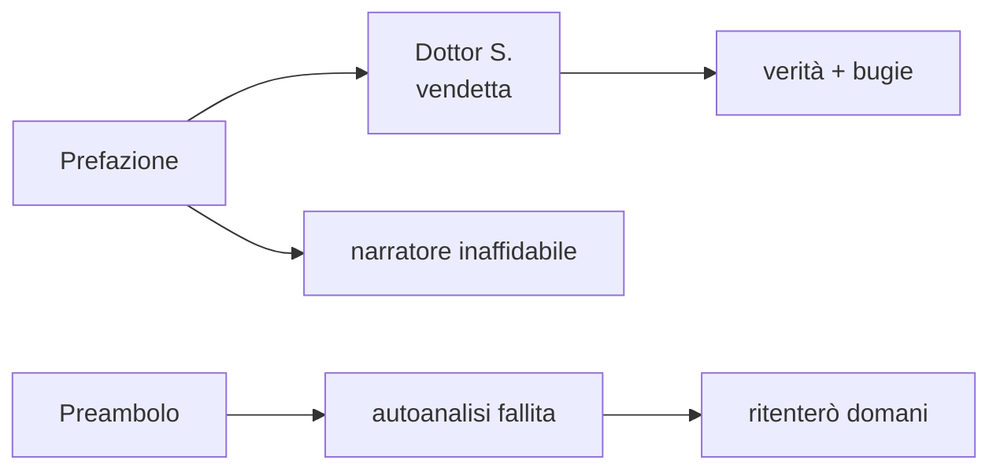
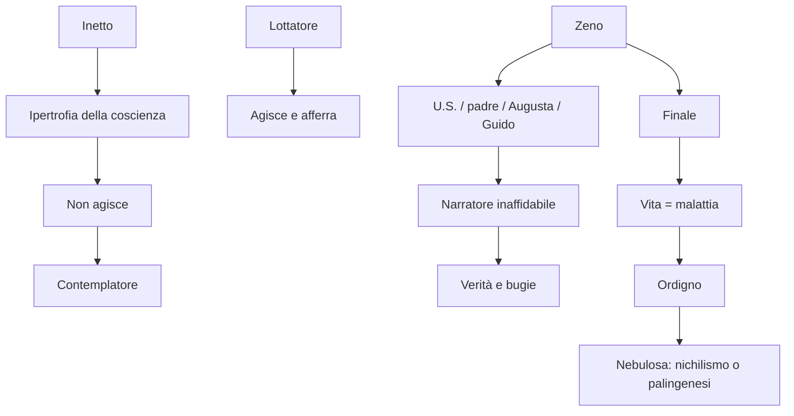

# Italo Svevo — Ripasso veloce

---

## Dati essenziali

**Ettore Schmitz**, pseudonimo **Italo Svevo** · 1861-1928 · Trieste, città mitteleuropea di porto e confine.  
Lingue: dialetto triestino, tedesco, italiano.  
Professione: impiegato di banca, poi industriale Veneziani.  
Scrittura: ossessione, autoanalisi, terapia.  
Joyce: insegnante d'inglese e primo estimatore.  
Freud: psicoanalisi fondamentale come strumento letterario, non come cura efficace. Svevo non crede nella guarigione psicoanalitica, ma usa la psicoanalisi per raccontare inconscio, memoria e autoinganno.

---

## Parole chiave da dire all'interrogazione

| Parola | Spiegazione rapida |
|--------|--------------------|
| **Inetto** | Inadatto alla vita, abulico, incapace di agire con volontà stabile |
| **Ipertrofia della coscienza** | Pensiero eccessivo che blocca l'azione |
| **Lottatori** | Agiscono, afferrano, si adattano alla vita |
| **Contemplatori** | Pensano, rimuginano, osservano, non agiscono |
| **Darwin** | Sfondo culturale: lotta per la sopravvivenza e adattamento |
| **Autoinganno** | Vedere la realtà come si desidera, non com'è |
| **Narratore inaffidabile** | Il racconto è soggettivo, mescola verità e bugie |
| **Malattia** | Non solo individuale: coincide con la vita e con la civiltà moderna |
| **Alienazione** | Estraneità dell'individuo rispetto a sé e alla società |
| **Ordigno** | Tecnica esterna al corpo; simbolo della civiltà malata e distruttiva |
| **Ironia di Zeno** | Distacco che gli permette di guardare la propria malattia e sopravvivere dove Alfonso ed Emilio falliscono |

---

## Tre romanzi

| Romanzo | Protagonista | Nucleo | Esito |
|---------|--------------|--------|-------|
| **Una vita** (1893) | Alfonso Nitti | Inetto, "nulla", non sa afferrare il reale | Suicidio |
| **Senilità** (1898) | Emilio Brentani | Autoinganno, grandezza latente, senilità interiore | Fuga nel sogno |
| **La coscienza di Zeno** (1923) | Zeno Cosini | Inetto ironico, nevrosi, caso, narratore inaffidabile | Successo paradossale + finale apocalittico |

Evoluzione da dire bene: Alfonso è l'inetto tragico, Emilio è l'inetto che si rifugia nell'illusione, Zeno è l'inetto che resta malato ma acquista ironia e consapevolezza.

---

## *Una vita*: ali di gabbiano

**Brano:** "Con le ali di gabbiano ci si nasce".  
**Personaggi:** Alfonso Nitti e Macario.

| Elemento | Da ricordare |
|----------|--------------|
| **Macario / Makarios** | Dal greco: "felice"; rappresenta chi aderisce alla vita |
| **Gabbiani** | Hanno poco cervello ma ali, occhi, stomaco e istinto perfetti per cacciare |
| **Alfonso** | Ha troppa coscienza: pensa e si blocca |
| **Mani** | Nei lottatori afferrano; nei contemplatori sono inabili a tenere |
| **Ali poetiche** | Alfonso può fare voli dell'immaginazione, non azioni efficaci |

Frase chiave: chi non ha le ali necessarie quando nasce non le avrà mai. **Lottatori si nasce, non si diventa.**

---

## *Senilità*: sistema dei personaggi

| Contemplatori | Lottatori |
|---------------|-----------|
| **Emilio Brentani**: velleità letterarie, autoinganno, grandezza latente | **Stefano Balli**: scultore, vitale, capace di godere della vita |
| **Amalia**: sorella di Emilio, vita grigia, amore non corrisposto | **Angiolina**: concreta, sensuale, infedele, non l'angelo immaginato da Emilio |

**Senilità** non significa vecchiaia anagrafica: è vecchiaia interiore, rinuncia, fiacchezza, vita nei pensieri.

---

## *La coscienza di Zeno*: struttura

- **Prefazione** del Dottor S.
- **Preambolo** di Zeno
- blocchi logici, non cronologici: *Il fumo*, *La morte di mio padre*, *Storia del mio matrimonio*, *La moglie e l'amante*, *Storia di un'associazione commerciale*, *Psicanalisi*
- tempo misto della coscienza
- prima persona, monologo interiore, ironia

---

## Prefazione

Il **Dottor S.** pubblica le memorie di Zeno per **vendetta**, perché il paziente ha abbandonato la cura. Non è un medico neutrale: si sente truffato e ricatta Zeno promettendo di dividere i guadagni se tornerà in analisi.

Da ricordare:

- Dottor S. = forse Svevo, Sigmund, o Z allo specchio
- autobiografia scritta, non terapia orale classica
- la cura fallisce, ma produce il romanzo: la psicoanalisi diventa letteratura
- il lettore è avvertito: ci saranno **verità e bugie**
- **transfer**: il paziente proietta sul medico sentimenti inconsci
- **controtransfert**: sentimenti del medico verso il paziente

---

## Preambolo

Zeno vuole ricordare l'infanzia **ab ovo**, dall'origine, ma disobbedisce al medico e tenta l'autoanalisi da solo.

| Immagine | Significato |
|----------|-------------|
| **Occhi presbiti** | Difficoltà di vedere davvero il passato |
| **Dieci lustri** | Circa cinquant'anni lo separano dall'infanzia |
| **Locomotiva in salita** | Peso del vivere, affanni e fatiche |
| **Bambino in fasce** | Chi nasce è già destinato alla malattia del vivere |
| **Ritenterò domani** | Simbolo del rinvio continuo di Zeno |

Tecnica: **monologo interiore**.

---

## Il fumo / U.S.

**U.S. = ultima sigaretta.**

Zeno crede che il fumo sia causa della sua malattia, ma il vizio gli serve anche come alibi: può dare alla sigaretta la colpa della propria incapacità.

Date da ricordare:

- **2 febbraio 1886**: passaggio da legge a chimica, ultima sigaretta
- ritorno alla legge: altra ultima sigaretta
- **9/9/1899**: data simbolica per chiudere il vizio nella bara
- **1/1/1901**: data "musicale" per iniziare una nuova vita

Le pareti piene di date diventano il **cimitero dei buoni propositi**. Ogni ultima sigaretta promette salute e forza, ma sposta solo più avanti la guarigione.

---

## Padre, matrimonio, Guido

| Episodio | Significato |
|----------|-------------|
| **Schiaffo del padre** | Il padre moribondo lascia cadere la mano; Zeno lo interpreta come punizione, ma il gesto può essere involontario |
| **Malfenti** | Padre elettivo, industriale di successo |
| **Ada** | Donna desiderata da Zeno, lo rifiuta |
| **Augusta** | Moglie scelta dopo i rifiuti; incarna la salute |
| **Salute malata** | Augusta è sana perché ha certezze, ma malata perché ignora la malattia della vita |
| **Guido Speier** | Rivale brillante, marito di Ada; Zeno lo invidia e lo detesta |
| **Funerale sbagliato** | Atto mancato: Zeno segue un altro corteo perché inconsciamente rifiuta Guido |

Freud: **atto mancato**, **lapsus** e **sogni** sono emersioni dell'inconscio. L'atto mancato nasce quando l'**Es** supera il controllo dell'**Ego** e del **Super-io**.

---

## Finale: Psicanalisi e apocalisse

Nel finale Zeno rifiuta la psicanalisi: ha capito che la malattia non è solo sua, ma della vita e della civiltà intera.

Frase da ricordare: Svevo non crede nella psicoanalisi come terapia, ma la considera fondamentale come strumento letterario; Zeno capisce che la malattia non si cura perché coincide con la vita stessa.

| Concetto | Spiegazione |
|----------|-------------|
| **Vita = malattia** | La vita procede per crisi e miglioramenti, ma è sempre mortale |
| **Civiltà malata** | L'uomo inquina aria e spazio, soffoca il mondo |
| **Alienazione** | La società borghese e capitalistica allontana l'uomo dalla sua essenza |
| **Animali** | Si adattano modificando il corpo |
| **Uomo occhialuto** | Ha bisogno di strumenti esterni per orientarsi |
| **Ordigni** | Tecnica fuori dal corpo: l'uomo diventa più furbo e più debole |
| **Apocalisse cosmica** | Un esplosivo incomparabile distruggerà la terra |
| **Nebulosa** | La terra torna a uno stato primordiale |
| **Nichilismo** | Distruzione definitiva: la morte è l'unica salute |
| **Palingenesi** | Distruzione come possibile rinascita |

Ultima parola del romanzo: **malattie**.

---

## Mappa finale

---

*Fonti: lezioni del 13/04/2026, 16/04/2026 e parte Svevo del 20/04/2026 — Lingua e letteratura italiana*
