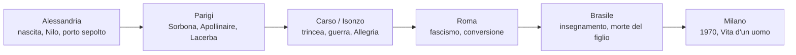
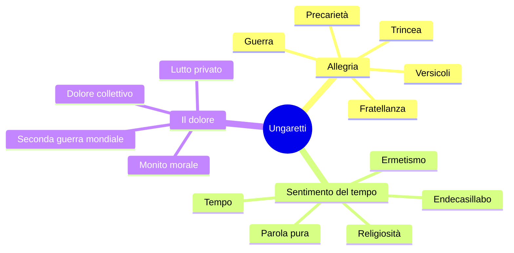
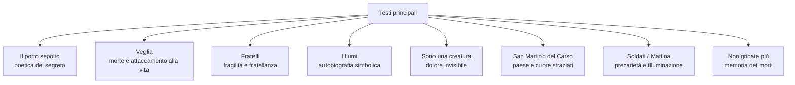
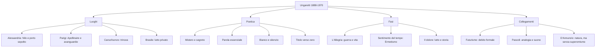

# Giuseppe Ungaretti — Riassunto per la maturità

---

## Coordinate essenziali

Giuseppe Ungaretti (**1888-1970**) nasce ad **Alessandria d'Egitto** da genitori italiani originari dell'area lucchese e muore a **Milano**. La sua poesia si comprende attraverso alcuni luoghi decisivi: Alessandria, Parigi, il Carso e l'Isonzo, Roma, il Brasile. Le parole chiave sono **porto sepolto**, **segreto**, **parola essenziale**, **analogia**, **silenzio**, **fratellanza**.

Le tre fasi principali sono: ***L'Allegria***, legata a guerra e trincea; ***Sentimento del tempo***, vicina all'Ermetismo e alla parola pura; ***Il dolore***, fondata su lutto privato e dolore collettivo.

---

## Date fondamentali

| Anno | Evento |
|------|--------|
| **1888** | Nasce ad **Alessandria d'Egitto** |
| **1912 circa** | Si trasferisce a **Parigi**, studia alla **Sorbona** e incontra le avanguardie |
| **1915** | Pubblica su **Lacerba** e si arruola volontario |
| **1915-1918** | Combatte sul **Carso**, presso l'**Isonzo** |
| **1916** | Esce ***Il porto sepolto*** |
| **1919** | La raccolta confluisce in ***Allegria di naufragi*** |
| **1923** | *Il porto sepolto* esce con presentazione di **Mussolini** |
| **1928** | Matura la **conversione religiosa** |
| **1931** | La prima raccolta assume il titolo definitivo ***L'Allegria*** |
| **Anni Trenta** | Fase di ***Sentimento del tempo***, vicina all'**Ermetismo** |
| **1936-1942** | Insegna letteratura italiana in **Brasile** |
| **1947** | Pubblica ***Il dolore*** |
| **1970** | Muore a **Milano**; l'opera confluisce in ***Vita d'un uomo*** |

---

## 1. Biografia per luoghi

### 1.1 Alessandria d'Egitto: Nilo e porto sepolto

Ungaretti nasce ad **Alessandria d'Egitto**, città portuale e cosmopolita. Il padre muore nei lavori legati a **Suez**; la madre, **fornaia**, gli garantisce comunque studi di alto livello.

Alessandria è importante soprattutto per due immagini poetiche: il **Nilo**, poi centrale in *I fiumi*, e il **porto sepolto**, antico porto sommerso che diventa simbolo della poesia come discesa in una profondità nascosta.

### 1.2 Parigi: Sorbona, avanguardie, Apollinaire

Prima della guerra Ungaretti si trasferisce a **Parigi**, studia alla **Sorbona** e frequenta l'ambiente delle avanguardie. Il riferimento più importante è **Guillaume Apollinaire**, modello di poesia moderna e sperimentale. Dai **calligrammi** Ungaretti ricava l'idea che la pagina non sia uno spazio neutro, ma possa avere valore visivo.

A Parigi incontra anche **Soffici**, **Palazzeschi** e **Papini**. Le prime poesie escono su **Lacerba**, rivista vicina al Futurismo: è un **debito formale**, non ideologico.

### 1.3 Carso e Isonzo: la guerra come rivelazione tragica

Nel **1914-1915** Ungaretti è interventista e, con l'entrata in guerra dell'Italia, si arruola volontario. Combatte sul **Carso**, presso l'**Isonzo**, vivendo direttamente la **trincea**.

La guerra, prima immaginata come evento necessario, si rivela **dolore**, **precarietà**, **orrore**, **fango**, **morte**. Proprio davanti alla morte, però, il poeta scopre un attaccamento disperato alla vita e una nuova **fratellanza**. Molte liriche hanno luogo e data, ma non sono cronache: sono lampi di esperienza concentrati.

### 1.4 Roma, fascismo, conversione, Brasile

Dopo la guerra Ungaretti torna a Parigi e poi si stabilisce a **Roma**. Nel **1923** *Il porto sepolto* esce con presentazione di **Benito Mussolini**, segno della sua vicinanza formale al fascismo. Il dato va ricordato senza semplificazioni: nella fase ermetica l'allontanamento dalla storia viene letto anche come resistenza passiva.

Nel **1928** matura la **conversione religiosa**, importante per *Sentimento del tempo*. Dal **1936** al **1942** vive in **Brasile**, dove insegna letteratura italiana. Qui muore il figlio di nove anni, **Antonietto**: il lutto privato, insieme alla Seconda guerra mondiale, confluisce in ***Il dolore***.

### 1.5 Milano e *Vita d'un uomo*

Ungaretti muore a **Milano** nel **1970**. La produzione confluisce in ***Vita d'un uomo***: la poesia è la forma in cui una vita viene ripercorsa e concentrata.

---

## 2. Vicenda editoriale e fasi poetiche

### 2.1 Da *Il porto sepolto* a *L'Allegria*

La prima raccolta nasce per passaggi successivi.

| Anno | Titolo | Significato |
|------|--------|-------------|
| **1916** | ***Il porto sepolto*** | Primo nucleo nato in trincea |
| **1919** | ***Allegria di naufragi*** | L'allegria nasce dentro il naufragio dell'esistenza |
| **1931** | ***L'Allegria*** | Titolo definitivo della prima grande raccolta |

*Allegria di naufragi* è un titolo ossimorico: il **naufragio** richiama guerra e precarietà; l'**allegria** è l'amore per la vita scoperto quando la vita è minacciata. Nel titolo definitivo resta lo slancio vitale.

### 2.2 Prima fase: *L'Allegria*

La prima fase pone al centro la **guerra**: orrore della trincea, precarietà, attaccamento alla vita, fratellanza, poesia come parola strappata al silenzio. Lo stile usa **versicoli**, **parola-verso**, verso libero, punteggiatura ridotta, titolo come **verso zero**, bianco come **silenzio**, analogie e tracce diaristiche.

### 2.3 Seconda fase: *Sentimento del tempo*

Negli anni Trenta Ungaretti si avvicina all'**Ermetismo**. La parola diventa **pura**, più oscura e meno legata alla storia immediata. Cambia anche la forma: resta l'innovazione, ma torna l'**endecasillabo**. Conversione religiosa e tempo diventano centrali.

### 2.4 Terza fase: *Il dolore*

In ***Il dolore*** convivono il **dolore privato**, legato ai lutti familiari e soprattutto alla morte del figlio, e il **dolore collettivo** della Seconda guerra mondiale. La lingua torna più vicina al parlato, ma conserva intensità simbolica. Il testo chiave è **Non gridate più**.

---

## 3. Poetica: porto sepolto, segreto, parola

### 3.1 Il porto sepolto

*Il porto sepolto* è una **dichiarazione di poetica**. Il porto sommerso di Alessandria rappresenta il mistero profondo dell'esistenza: il poeta scende in profondità, lo sfiora e torna con i suoi canti. La poesia non possiede né spiega razionalmente il segreto della vita; lo avvicina e lo lascia intravedere.

### 3.2 Segreto e impotenza della parola

Ungaretti afferma che la poesia è tale quando porta in sé un **segreto**. La parola però è **impotente**: non dice mai interamente ciò che abbiamo dentro. Per questo la parola ungarettiana è breve, isolata, limata e carica di valore.

### 3.3 Titolo, bianco, silenzio

Il **titolo** funziona spesso come **verso zero**: orienta la lettura e completa il significato. Anche il bianco conta: la parola è suono, lo spazio vuoto è silenzio, e la poesia nasce dal loro contrasto.

---

## 4. Lingua e stile

| Aspetto | Significato |
|---------|-------------|
| **Versicoli** | Versi brevissimi |
| **Parola-verso** | Una parola occupa un verso intero |
| **Verso libero** | Rottura della metrica tradizionale nella prima fase |
| **Punteggiatura ridotta** | Sintassi frantumata, anche per influenza futurista |
| **Titolo come verso zero** | Il titolo completa e orienta il testo |
| **Date e luoghi** | Funzione diaristica, legata all'esperienza concreta |
| **Analogia** | Accostamento di elementi lontani |
| **Fonosimbolismo** | I suoni rafforzano il significato, come le dentali in *Veglia* |
| **Ossimoro** | Unione di opposti, come "nulla d'inesauribile segreto" |
| **Adynaton** | Figura dell'impossibile, centrale in *Non gridate più* |

### 4.1 Futurismo e superamento del Futurismo

Ungaretti risente del Futurismo nella libertà metrica, nella punteggiatura ridotta, nella parola isolata, nello spazio bianco e nei contatti con **Lacerba**. Però se ne distacca ideologicamente: il Futurismo esalta la guerra come **"sola igiene del mondo"**, mentre Ungaretti la rappresenta come dolore, disumanità e precarietà. Formula utile: **debito formale, non adesione ideologica**.

### 4.2 Apollinaire e la pagina moderna

Da **Apollinaire** Ungaretti apprende una concezione moderna della pagina poetica. Non scrive calligrammi in senso stretto, ma usa bianco, pause e disposizione dei versi per dare forza alla parola.

---

## 5. Analisi dei testi

### 5.1 *Il porto sepolto*

**Contesto:** Mariano, 29 giugno 1916, durante la guerra sull'Isonzo.

La poesia è una dichiarazione di poetica. Il porto sepolto è il luogo misterioso dell'essere: il poeta vi arriva, torna con i suoi canti e li consegna agli uomini. Alla fine resta "quel nulla d'inesauribile segreto", ossimoro che mostra come la poesia possa sfiorare il mistero, non possederlo. Da ricordare: titolo come **verso zero**, versi brevi, assenza di punteggiatura, bianco come silenzio.

### 5.2 *Veglia*

Il poeta passa una notte accanto al corpo massacrato di un compagno. La morte più brutale produce la scoperta di un attaccamento fortissimo alla vita. Il lessico è duro: "buttato", "massacrato", "digrignata", "congestione". Le dentali **t** e **d** hanno valore **fonosimbolico**. Il titolo è **verso zero**; le "lettere piene d'amore" sono in antitesi con il cadavere.

### 5.3 *Fratelli*

**Contesto:** Mariano, 15 luglio 1916.

La poesia parte da una domanda militare, ma la parola decisiva è **fratelli**: i soldati non sono numeri di reggimento, ma uomini fragili. "Fratelli" è "tremante nella notte" e accostata a una "foglia appena nata", analogia di vita fragile. La fratellanza è una "involontaria rivolta" contro la logica della guerra.

### 5.4 *I fiumi*

*I fiumi* ripercorre la vita di Ungaretti attraverso i fiumi che l'hanno segnata. Il punto di partenza è l'**Isonzo**, ma in esso confluiscono simbolicamente gli altri fiumi.

| Fiume | Significato |
|-------|-------------|
| **Serchio** | Origini familiari lucchesi |
| **Nilo** | Nascita e infanzia ad Alessandria d'Egitto |
| **Senna** | Formazione parigina e giovinezza |
| **Isonzo** | Guerra, trincea, riconoscimento profondo di sé |

L'"albero mutilato" mostra che anche la natura è ferita dalla guerra. L'immersione nell'Isonzo ha valore rituale: l'**urna d'acqua** richiama la morte, ma l'acqua rigenera. Il poeta si riconosce **"docile fibra dell'universo"**: non domina la natura, si sente parte del tutto. "Corolla di tenebre" è un ossimoro di bellezza e buio.

### 5.5 *Sono una creatura*

Il poeta si paragona a una pietra del San Michele: fredda, dura, prosciugata, refrattaria, disanimata. Il dolore non diventa nemmeno pianto visibile. La conclusione rovescia l'idea comune: "La morte / si sconta / vivendo".

### 5.6 *San Martino del Carso*

La poesia concentra distruzione esterna e interiore. Il paese è ridotto a brandelli; dei compagni resta ancora meno. Il cuore conserva tutte le assenze: "È il mio cuore / il paese più straziato". Da collegare a *Veglia*, *Fratelli* e *Non gridate più*.

### 5.7 *Soldati* e *Mattina*

*Soldati* esprime la precarietà assoluta: i soldati stanno "come d'autunno / sugli alberi / le foglie". *Mattina* è il massimo esempio di concentrazione: "M'illumino / d'immenso", testo-lampo fondato su parola essenziale, illuminazione e bianco.

### 5.8 *Non gridate più*

**Raccolta:** *Il dolore*, 1947.

Il testo nasce dopo la Seconda guerra mondiale e trasforma il dolore storico in monito morale. "Cessate d'uccidere i morti" è un **adynaton**: i morti vengono uccisi moralmente quando si continua l'odio. "Non gridate più" chiede silenzio, unico modo per ascoltare l'"impercettibile sussurro" dei morti. L'erba cresce lieta solo "dove non passa l'uomo": la pace sembra possibile dove non arriva la violenza umana.

---

## 6. Documentario e testimonianza diretta

Il documentario conferma la poetica ungarettiana: poesia come **segreto**, parola **impotente**, testi nati in trincea su materiali di fortuna, lungo lavoro di limatura. Importanti anche **Moammed Sceab / Marcel**, figura dello sradicamento, e il giudizio sulla guerra come **"l'atto più bestiale dell'uomo"**.

---

## 7. Collegamenti

### 7.1 Futurismo

Ungaretti condivide con il Futurismo verso libero, punteggiatura ridotta, parola isolata, pagina visiva, fonosimbolismo e rapporto con **Lacerba**. Se ne distacca però ideologicamente: per lui la guerra è dolore, naufragio e disumanizzazione.

### 7.2 Apollinaire

Apollinaire è il riferimento parigino più importante. Dai calligrammi Ungaretti ricava l'idea moderna della pagina, ma la sua essenzialità nasce dalla trincea, non dal gioco grafico.

### 7.3 Pascoli

Il collegamento con **Pascoli** riguarda analogia, fonosimbolismo, parola simbolica e compresenza di vita e morte. Pascoli parte dal nido e dal lutto familiare; Ungaretti dalla guerra e dalla precarietà assoluta.

### 7.4 D'Annunzio

In *I fiumi* c'è una reminiscenza dannunziana nella fusione con la natura. Però Ungaretti è lontano dal superomismo: non domina, ma si riconosce **"docile fibra dell'universo"**.

### 7.5 Ermetismo

Ungaretti è un riferimento dell'**Ermetismo**, soprattutto in *Sentimento del tempo*: poesia oscura, concentrata, fondata sulla parola pura e su nessi non esplicitati.

### 7.6 Fascismo

Il rapporto con il fascismo va espresso con precisione: Ungaretti fu formalmente vicino al regime e nel 1923 *Il porto sepolto* uscì con presentazione di Mussolini. Tuttavia la fase ermetica viene letta anche come allontanamento dalla storia e resistenza passiva.

---

## 8. Schema finale

