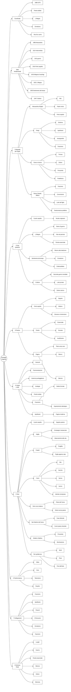

# Schema ramificato — Giuseppe Ungaretti

Schema ricco ma ordinato: segue la sequenza del `riassunto.md`, con rami leggibili anche in bianco e nero.

```mermaid
%%{init: {"theme": "base", "themeVariables": {"primaryColor": "#ffffff", "primaryTextColor": "#000000", "primaryBorderColor": "#000000", "lineColor": "#000000", "secondaryColor": "#f5f5f5", "tertiaryColor": "#ffffff"}}}%%
flowchart LR
    R(("Giuseppe<br/>Ungaretti"))

    R --> C0["Coordinate"]
    R --> D["Date<br/>fondamentali"]
    R --> C1["1 Biografia<br/>per luoghi"]
    R --> C2["2 Fasi<br/>poetiche"]
    R --> C3["3 Poetica"]
    R --> C4["4 Lingua<br/>e stile"]
    R --> C5["5 Testi"]
    R --> C6["6 Testimonianza"]
    R --> C7["7 Collegamenti"]
    R --> C8["8 Schema<br/>finale"]

    C0 --> C0A["1888 1970"]
    C0 --> C0B["Poeta soldato"]
    C0 --> C0C["L'Allegria"]
    C0 --> C0D["Ermetismo"]
    C0 --> C0E["Vita d'un uomo"]

    D --> D1["1888 Alessandria"]
    D --> D2["1914 interventista"]
    D --> D3["1915 guerra"]
    D --> D4["1916 Porto sepolto"]
    D --> D5["1919 Allegria di naufragi"]
    D --> D6["1931 L'Allegria"]
    D --> D7["1933 Sentimento del tempo"]
    D --> D8["1947 Il dolore"]

    C1 --> C1A["Alessandria d'Egitto"]
    C1A --> C1A1["Nilo"]
    C1A --> C1A2["Padre morto"]
    C1A --> C1A3["Porto sepolto"]
    C1 --> C1B["Parigi"]
    C1B --> C1B1["Sorbona"]
    C1B --> C1B2["Apollinaire"]
    C1B --> C1B3["Avanguardie"]
    C1B --> C1B4["Futurismo"]
    C1 --> C1C["Carso e Isonzo"]
    C1C --> C1C1["Trincea"]
    C1C --> C1C2["Dolore"]
    C1C --> C1C3["Precarieta"]
    C1C --> C1C4["Fratellanza"]
    C1 --> C1D["Roma, Brasile,<br/>Milano"]
    C1D --> C1D1["Fascismo"]
    C1D --> C1D2["Conversione"]
    C1D --> C1D3["Lutto del figlio"]
    C1D --> C1D4["Testimonianza pubblica"]

    C2 --> C2A["Il porto sepolto"]
    C2A --> C2A1["Nucleo originario"]
    C2 --> C2B["L'Allegria"]
    C2B --> C2B1["Diario di guerra"]
    C2B --> C2B2["Vita nel pericolo"]
    C2B --> C2B3["Parola essenziale"]
    C2 --> C2C["Sentimento del tempo"]
    C2C --> C2C1["Ritorno alla tradizione"]
    C2C --> C2C2["Ermetismo"]
    C2C --> C2C3["Endecasillabo"]
    C2 --> C2D["Il dolore"]
    C2D --> C2D1["Seconda guerra mondiale"]
    C2D --> C2D2["Lutto privato"]
    C2D --> C2D3["Dolore storico"]

    C3 --> C3A["Porto sepolto"]
    C3A --> C3A1["Segreto"]
    C3A --> C3A2["Mistero"]
    C3A --> C3A3["Discesa e riemersione"]
    C3 --> C3B["Parola"]
    C3B --> C3B1["Essenziale"]
    C3B --> C3B2["Scavata"]
    C3B --> C3B3["Insufficiente"]
    C3 --> C3C["Pagina"]
    C3C --> C3C1["Titolo verso zero"]
    C3C --> C3C2["Bianco"]
    C3C --> C3C3["Silenzio"]

    C4 --> C4A["Versicoli"]
    C4 --> C4B["Frammentazione"]
    C4 --> C4C["Assenza punteggiatura"]
    C4 --> C4D["Analogia"]
    C4 --> C4E["Parola isolata"]
    C4 --> C4F["Futurismo"]
    C4F --> C4F1["Debito formale"]
    C4F --> C4F2["Superamento ideologico"]
    C4 --> C4G["Apollinaire"]
    C4G --> C4G1["Pagina moderna"]

    C5 --> C5A["Il porto sepolto"]
    C5A --> C5A1["Segreto poetico"]
    C5 --> C5B["Veglia"]
    C5B --> C5B1["Compagno massacrato"]
    C5B --> C5B2["Attaccamento alla vita"]
    C5 --> C5C["Fratelli"]
    C5C --> C5C1["Fragilita"]
    C5C --> C5C2["Foglia appena nata"]
    C5 --> C5D["I fiumi"]
    C5D --> C5D1["Nilo"]
    C5D --> C5D2["Serchio"]
    C5D --> C5D3["Senna"]
    C5D --> C5D4["Isonzo"]
    C5D --> C5D5["Identita ricomposta"]
    C5 --> C5E["Sono una creatura"]
    C5E --> C5E1["Pietra del Carso"]
    C5E --> C5E2["Dolore senza pianto"]
    C5 --> C5F["San Martino del Carso"]
    C5F --> C5F1["Case distrutte"]
    C5F --> C5F2["Cuore paese straziato"]
    C5 --> C5G["Soldati e Mattina"]
    C5G --> C5G1["Precarieta"]
    C5G --> C5G2["Illuminazione"]
    C5 --> C5H["Non gridate piu"]
    C5H --> C5H1["Morti"]
    C5H --> C5H2["Pace"]
    C5H --> C5H3["Fine dell'odio"]

    C6 --> C6A["Video"]
    C6 --> C6B["Voce"]
    C6 --> C6C["Televisione"]
    C6 --> C6D["Pasolini"]

    C7 --> C7A["Futurismo"]
    C7 --> C7B["Apollinaire"]
    C7 --> C7C["Pascoli"]
    C7 --> C7D["D'Annunzio"]
    C7 --> C7E["Ermetismo"]
    C7 --> C7F["Fascismo"]

    C8 --> C8A["Luoghi"]
    C8 --> C8B["Guerra"]
    C8 --> C8C["Parola essenziale"]
    C8 --> C8D["Silenzio"]
    C8 --> C8E["Dolore"]
    C8 --> C8F["Memoria"]
```
