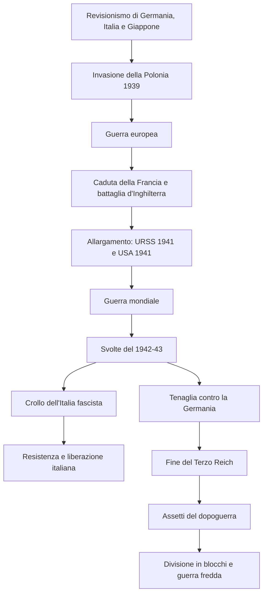

# Scheda studio — Seconda guerra mondiale e inizio della guerra fredda

Appunti riorganizzati per l’orale sui capitoli **3.13, 3.14 e 3.15**: dalla guerra europea del 1939 alla nascita dei blocchi della guerra fredda in Europa.

---

## 1. Quadro generale: che cosa bisogna saper dire all’orale

Tra il **1939** e il **1945** la Seconda guerra mondiale trasformò una crisi europea in un conflitto globale. La guerra nacque dalla volontà di **Germania, Italia e Giappone** di rivedere con la forza gli equilibri internazionali usciti dalla Prima guerra mondiale e dal trattato di Versailles. Fu anche uno scontro tra sistemi politici e ideologici: da una parte le potenze totalitarie e razziste dell’Asse, dall’altra le liberal-democrazie, poi affiancate dall’URSS dopo l’aggressione tedesca.

La guerra fu una **guerra totale** perché coinvolse eserciti, economie, popolazioni civili, città, colonie e ideologie. Non si combatté soltanto sui fronti militari: bombardamenti, occupazioni, deportazioni, lavoro forzato, sterminio degli ebrei e repressioni contro i civili mostrarono che l’intera società era diventata parte del conflitto.

Dopo il 1945 la vittoria contro l’Asse non produsse un mondo pacificato. L’alleanza tra **Stati Uniti** e **Unione Sovietica**, nata per sconfiggere Hitler, si sciolse rapidamente. L’Europa venne divisa in due aree d’influenza contrapposte: il blocco occidentale guidato dagli USA e quello orientale guidato dall’URSS. Da qui nacque la **guerra fredda**, cioè una tensione permanente tra le due superpotenze, senza guerra diretta in Europa ma con forte contrapposizione politica, economica, ideologica e militare.

---

## 2. Cronologia essenziale

| Data / periodo | Evento | Perché è importante |
|---|---|---|
| **1° settembre 1939** | La Germania invade la Polonia | Inizio della Seconda guerra mondiale in Europa |
| **Settembre 1939** | Francia e Regno Unito sostengono la Polonia | Il conflitto diventa europeo |
| **1939-1940** | L’URSS annette Estonia, Lettonia e Lituania | Effetto del piano di spartizione e dell’espansione sovietica |
| **Primavera 1940** | Germania invade Belgio, Olanda e Lussemburgo | Aggiramento della linea Maginot e attacco alla Francia |
| **Giugno 1940** | Caduta di Parigi e divisione della Francia | Nasce la Repubblica di Vichy nel Sud-Est, controllata dai nazisti |
| **10 giugno 1940** | L’Italia entra in guerra contro Francia e Gran Bretagna | Mussolini spera in una guerra breve e in vantaggi territoriali |
| **Estate-autunno 1940** | Battaglia d’Inghilterra | Londra resiste e impedisce lo sbarco tedesco |
| **28 ottobre 1940** | L’Italia attacca la Grecia dall’Albania | Fallimento della “guerra parallela” italiana |
| **Inizio 1941** | Crisi italiana in Nord Africa | Intervento tedesco con Rommel e Afrika Korps |
| **Aprile 1941** | Germania occupa Jugoslavia e Grecia | Hitler deve salvare l’alleato italiano nei Balcani |
| **Estate 1941** | Operazione Barbarossa contro l’URSS | Si rompe la non belligeranza Germania-URSS |
| **Agosto 1941** | Carta Atlantica tra USA e Regno Unito | Base del futuro ordine internazionale |
| **Fine 1941** | Attacco giapponese a Pearl Harbor | Entrano in guerra gli Stati Uniti; il conflitto diventa mondiale |
| **Gennaio 1942** | Conferenza di Wannsee | Avvio sistematico della “soluzione finale” |
| **1942-1943** | El-Alamein, sbarco USA in Marocco e Algeria | Ripiegamento dell’Asse in Africa |
| **Febbraio 1943** | Stalingrado e Guadalcanal | Svolte militari contro Germania e Giappone |
| **5 marzo 1943** | Sciopero degli operai Fiat a Torino | Segno del crollo del consenso interno al fascismo |
| **10 luglio 1943** | Sbarco alleato in Sicilia | L’Italia diventa il punto debole dell’Asse |
| **25 luglio 1943** | Arresto di Mussolini | Crollo politico del fascismo |
| **3 settembre 1943** | Armistizio di Cassibile | Accordo segreto tra governo Badoglio e Alleati |
| **8 settembre 1943** | Annuncio dell’armistizio | Crollo dello Stato italiano e occupazione tedesca |
| **9 settembre 1943** | Nasce il CLN | Coordinamento politico e militare antifascista |
| **12 settembre 1943** | Mussolini liberato dai tedeschi | Nasce la Repubblica Sociale Italiana, dipendente dalla Germania |
| **13 ottobre 1943** | Regno del Sud dichiara guerra alla Germania | L’Italia diventa cobelligerante degli Alleati |
| **Autunno 1943** | Conferenza di Teheran | Si prepara lo sbarco in Normandia e si discute il dopoguerra |
| **4 giugno 1944** | Liberazione di Roma | Sfondamento della Linea Gustav |
| **24 agosto 1944** | Liberazione di Parigi | Avanzata angloamericana in Francia |
| **27 gennaio 1945** | Liberazione di Auschwitz | Emersione piena della realtà dei lager nazisti |
| **Febbraio 1945** | Conferenza di Jalta | I vincitori discutono gli assetti del dopoguerra |
| **23-25 aprile 1945** | Insurrezione generale nel Nord Italia | Fase finale della liberazione italiana |
| **27-28 aprile 1945** | Mussolini catturato e fucilato | Fine politica e simbolica del fascismo repubblicano |
| **2 maggio 1945** | Resa tedesca in Italia | Fine della guerra nella Penisola |
| **Fine aprile-inizio maggio 1945** | Suicidio di Hitler e resa tedesca | Fine del Terzo Reich |
| **Agosto 1945** | Bombe atomiche su Hiroshima e Nagasaki | Collasso finale del Giappone |
| **2 settembre 1945** | Resa giapponese | Fine della Seconda guerra mondiale |
| **1944** | Accordi di Bretton Woods | Nuove istituzioni economiche internazionali |
| **1945** | Conferenza di San Francisco e nascita dell’ONU | Nuovo organismo per la pace internazionale |
| **1947** | GATT e Piano Marshall | Liberalizzazione commerciale e ricostruzione dell’Europa occidentale |
| **1948** | Blocco di Berlino | Prima grande crisi della guerra fredda in Europa |
| **1949** | NATO; nascita di RFT e RDT | Consolidamento del blocco occidentale e divisione tedesca |
| **1950** | CECA | Primo passo dell’integrazione europea occidentale |
| **1953** | Morte di Stalin | Fine della fase più rigida dell’egemonia staliniana in Europa orientale |
| **1955** | Patto di Varsavia; CEE | Risposta sovietica alla NATO e prosecuzione dell’integrazione europea, secondo la cronologia degli appunti |

---

# CAPITOLO 13 — La Seconda guerra mondiale, tempo primo (1939-1941)

## 3. Le cause della guerra

La guerra scoppiò il **1° settembre 1939** con l’attacco tedesco alla **Polonia**, ma le sue radici stavano nel periodo precedente. Il punto centrale è il **revisionismo**: Germania, Italia e Giappone volevano modificare con la forza gli equilibri stabiliti dopo la Prima guerra mondiale.

Le cause principali furono:

- **revisionismo tedesco, italiano e giapponese**: le potenze dell’Asse non accettavano l’ordine internazionale esistente;
- **espansionismo aggressivo**: conquista di territori, risorse, prestigio e aree d’influenza;
- **ideologie totalitarie e razziste**: il nazismo e il fascismo interpretavano la guerra come strumento politico e ideologico;
- **fallimento dell’equilibrio europeo**: le democrazie occidentali non riuscirono a fermare l’aggressività hitleriana prima del 1939;
- **patto segreto Germania-URSS sulla Polonia**: l’invasione tedesca e quella sovietica mostrarono che la Polonia era stata sacrificata a una logica di spartizione.

**Nesso causa-effetto da ricordare:** il trattato di Versailles e l’ordine internazionale del dopoguerra furono percepiti dalle potenze revisioniste come un ostacolo. Hitler, Mussolini e il Giappone trasformarono questa insoddisfazione in politica di conquista. Quando la Germania attaccò la Polonia, Francia e Regno Unito non poterono più limitarsi alla diplomazia e il conflitto si aprì.

## 4. 1939-1940: dalla Polonia alla caduta della Francia

Nel settembre 1939 la **Polonia** fu invasa dalla Germania e dall’URSS. Francia e Regno Unito si schierarono con la Polonia, mentre l’Unione Sovietica, nei mesi successivi, annetté **Estonia, Lettonia e Lituania**.

La Germania proseguì poi verso nord e verso ovest:

1. attaccò i porti della **Norvegia** e la **Danimarca**;
2. nella primavera del 1940 invase **Belgio, Olanda e Lussemburgo**, violandone la neutralità;
3. aggirò la **linea Maginot**, cioè il sistema difensivo francese;
4. nel giugno 1940 occupò **Parigi**.

La Francia fu divisa in due:

- il **Nord-Ovest** venne occupato direttamente dai tedeschi;
- nel **Sud-Est** nacque la **Repubblica di Vichy**, formalmente francese ma controllata dai nazisti.

**Concetto chiave: guerra-lampo.** La strategia tedesca puntava su rapidità, sorpresa e movimento. L’obiettivo era evitare una lunga guerra di logoramento come quella del 1914-1918. Nel 1940 questa strategia funzionò contro la Francia, che crollò rapidamente.

## 5. L’Italia: dalla non belligeranza alla guerra parallela

All’inizio del conflitto l’Italia dichiarò la **non belligeranza**. Non era neutralità piena: significava non entrare subito in guerra, pur restando politicamente legata alla Germania. La scelta dipendeva soprattutto dall’**inadeguatezza militare** italiana: le Forze armate non erano pronte per una guerra moderna.

Il **10 giugno 1940**, però, Mussolini annunciò l’ingresso in guerra contro **Francia** e **Gran Bretagna**. La decisione fu presa mentre la Francia stava crollando. Mussolini sperava di sedersi al tavolo dei vincitori con un costo limitato e di ottenere vantaggi territoriali ed economici.

L’Italia puntò a una **guerra parallela**, cioè a una guerra condotta accanto alla Germania ma con obiettivi autonomi:

- controllo del **Mediterraneo**;
- espansione nei **Balcani**;
- conquista di prestigio internazionale;
- ridimensionamento dell’Impero britannico, indicato dalla propaganda come la “perfida Albione”.

**Nesso causa-effetto:** Mussolini voleva dimostrare che l’Italia fascista era una grande potenza autonoma. In realtà le campagne militari mostrarono l’opposto: l’Italia non era pronta, dipese sempre di più dalla Germania e divenne un peso strategico per Hitler.

## 6. La resistenza britannica e la strategia americana

Dopo la caduta della Francia, la **Gran Bretagna** rimase il principale ostacolo europeo alla Germania. A Londra trovò rifugio anche **Charles de Gaulle**, capo della “Francia Libera”.

Tra estate e autunno 1940 si svolse la **battaglia d’Inghilterra**: Londra e altre città inglesi furono bombardate, ma il primo ministro **Winston Churchill** chiamò la popolazione alla resistenza. L’obiettivo tedesco era preparare lo sbarco, ma la resistenza britannica lo impedì.

Gli **Stati Uniti**, guidati da Roosevelt, non erano ancora entrati direttamente in guerra, ma sostenevano Londra con mezzi e aiuti. Nell’**agosto 1941**, USA e Regno Unito firmarono la **Carta Atlantica**, che indicava alcuni principi del futuro ordine mondiale, tra cui il disarmo dei Paesi aggressori.

**Per l’orale:** la Gran Bretagna è importante perché impedisce a Hitler di chiudere la guerra a ovest. Gli Stati Uniti, prima ancora dell’intervento diretto, iniziano a costruire il quadro politico del dopoguerra.

## 7. I fallimenti militari italiani: Nord Africa, Africa orientale e Balcani

### Nord Africa

L’Italia voleva avanzare dalla **Libia** verso l’**Egitto** per conquistare **Suez**. Suez era fondamentale perché avrebbe permesso di spezzare in due l’Impero britannico e aprire l’accesso ai campi petroliferi del Medio Oriente.

Il generale **Rodolfo Graziani** disponeva di oltre 200.000 uomini, contro circa 30.000 britannici. Tuttavia la superiorità numerica non bastò:

- mancavano camion e carburante;
- i mezzi italiani erano poco adatti alla guerra moderna;
- i carri armati leggeri italiani erano inferiori ai blindati britannici;
- le truppe erano poco motivate e male equipaggiate.

Tra gennaio e febbraio 1941 i britannici bloccarono gli italiani e penetrarono in Libia fino a **Tobruk** e **Bengasi**. Hitler dovette intervenire inviando l’**Afrika Korps**, guidato da **Erwin Rommel**.

### Africa orientale

Nel Corno d’Africa i britannici passarono all’offensiva nel dicembre 1940. In pochi mesi occuparono **Eritrea, Somalia ed Etiopia**; nel maggio 1941 l’Impero italiano d’Africa cessò di esistere.

Questo fu un colpo durissimo per la propaganda fascista: l’impero proclamato pochi anni prima si rivelò fragile e incapace di resistere.

### Balcani e Grecia

Mussolini pianificò l’invasione della **Grecia** dall’**Albania**, già annessa all’Italia. Il **28 ottobre 1940**, anniversario della marcia su Roma, le truppe italiane attaccarono senza informare davvero l’alleato tedesco.

L’offensiva fallì quasi subito:

- il terreno montuoso favorì la difesa greca;
- il clima rese difficili le operazioni;
- i greci passarono al contrattacco;
- gli italiani dovettero difendere l’Albania invece di conquistare rapidamente la Grecia.

Nell’**aprile 1941** intervenne la Wehrmacht: la Germania attaccò **Jugoslavia** e **Grecia**, occupando rapidamente **Belgrado** e **Atene**.

### Conseguenze politiche dei fallimenti italiani

I fallimenti in Nord Africa e nei Balcani ebbero conseguenze profonde:

- mostrarono l’inadeguatezza delle Forze armate italiane;
- rafforzarono la subordinazione dell’Italia alla Germania;
- aumentarono il malcontento nella popolazione;
- diffusero critiche a Mussolini tra militari, corte e settori del fascismo;
- obbligarono Hitler a deviare risorse verso fronti secondari.

**Formula utile per l’orale:** la guerra parallela doveva dimostrare l’autonomia dell’Italia fascista, ma produsse l’effetto contrario: rivelò la debolezza del regime e trasformò l’Italia in satellite militare della Germania.

## 8. L’operazione Barbarossa: la guerra contro l’URSS

Nell’estate del **1941** Hitler ordinò l’invasione dell’**Unione Sovietica**, chiamata **operazione Barbarossa**. Parteciparono anche reparti italiani, il **CSIR**, e altri alleati minori.

All’inizio l’URSS fu colta di sorpresa. I tedeschi avanzarono in profondità:

- **Leningrado** fu assediata;
- **Mosca** fu minacciata;
- l’Armata Rossa subì gravissime perdite.

Tuttavia i sovietici riuscirono a resistere. La guerra venne presentata come **“grande guerra patriottica”**, cioè come difesa della patria dall’invasore nazista.

Nell’inverno **1941-1942** l’avanzata tedesca fu fermata. Contribuirono:

- la resistenza sovietica;
- la tecnica della **terra bruciata**, per privare il nemico di risorse;
- il clima invernale;
- lo spostamento di truppe sovietiche prima impegnate a est.

Da quel momento l’Armata Rossa poté passare al contrattacco.

**Nesso causa-effetto:** attaccando l’URSS, Hitler aprì un fronte immenso. All’inizio ottenne successi rapidi, ma non riuscì a chiudere la campagna prima dell’inverno. La guerra a est divenne una guerra di logoramento che avrebbe consumato le forze tedesche.

## 9. Shoah e sterminio degli ebrei

La persecuzione antiebraica nazista si radicalizzò con l’avanzata tedesca nei territori occupati. In un primo momento gli ebrei furono chiusi in **ghetti** nelle città conquistate. Con l’invasione dell’URSS, la persecuzione assunse sempre più il carattere di **sterminio di massa**.

Durante l’avanzata a est, le forze tedesche identificarono gli ebrei tra i civili e li uccisero:

- prima con fucilazioni;
- poi con l’uso del gas **Zyklon B**;
- infine attraverso un sistema organizzato di deportazione e sterminio.

Nel **gennaio 1942**, alla **Conferenza di Wannsee**, venne decisa l’attuazione sistematica della **“soluzione finale”**. Ai campi di concentramento si aggiunsero i **campi di sterminio**, molti dei quali in Polonia. Il più noto è **Auschwitz**.

Nei lager furono deportati:

- milioni di ebrei dall’Europa occupata;
- rom;
- altri gruppi considerati “inferiori” dal nazismo.

Gli internati abili venivano spesso usati nel **lavoro forzato**; quelli giudicati inabili erano avviati subito alle camere a gas. Secondo gli appunti, gli ebrei sterminati furono tra **5 e 6 milioni**.

**Da dire bene all’orale:** la Shoah non fu un effetto collaterale della guerra, ma un progetto ideologico e politico del nazismo. La guerra rese possibile l’estensione dello sterminio perché mise milioni di persone sotto controllo tedesco e trasformò l’Europa occupata in uno spazio di deportazione.

---

# CAPITOLO 14 — La Seconda guerra mondiale, tempo secondo (1941-1945)

## 10. Pearl Harbor e l’ingresso degli Stati Uniti

Nel 1941 il **Giappone**, dopo la conquista dell’Indocina francese, subì un **embargo** statunitense. Gli USA usarono questa pressione economica per limitare l’espansione giapponese. Il Giappone reagì attaccando la base americana di **Pearl Harbor**, nelle Hawaii, alla fine del 1941.

L’attacco provocò gravi danni alla flotta americana e aprì il fronte del **Pacifico**. Con l’ingresso degli Stati Uniti, la guerra diventò pienamente mondiale. Germania e Italia, alleate del Giappone, dichiararono guerra agli USA.

La Germania avrebbe voluto coinvolgere il Giappone in una manovra contro l’URSS e l’Impero britannico, ma la guerra nel Pacifico impedì questo coordinamento. Nel lungo periodo emerse la superiorità militare e logistica statunitense.

**Concetto chiave:** l’ingresso degli USA cambia la scala della guerra. La capacità produttiva, logistica e militare americana diventa decisiva sia in Europa sia nel Pacifico.

## 11. Le svolte del 1942-1943: Pacifico, Africa, Stalingrado

Tra 1942 e 1943 l’Asse iniziò a subire sconfitte decisive.

### Nel Pacifico

La flotta giapponese fu prima fermata e poi sconfitta a **Guadalcanal** nel febbraio 1943. Da quel momento l’iniziativa passò progressivamente agli Stati Uniti.

### In Africa

Dopo la battaglia di **El-Alamein**, le forze italo-tedesche retrocedettero per centinaia di chilometri e si ritirarono anche dalla Libia. Tra 1942 e 1943 gli americani sbarcarono in **Marocco** e **Algeria**, territori legati al regime di Vichy, e ne presero il controllo.

### A Stalingrado

Sul fronte orientale l’URSS, dopo la vittoria nella battaglia di **Stalingrado** nel febbraio 1943, avviò una controffensiva. La sconfitta colpì anche i soldati italiani impegnati in Russia.

**Nesso causa-effetto:** le sconfitte dell’Asse tra Africa, Pacifico e Russia mostrarono che Germania, Italia e Giappone non riuscivano più a sostenere una guerra globale su più fronti. Per l’Italia, in particolare, Stalingrado e la ritirata di Russia accelerarono il crollo del regime.

## 12. Il crollo del fascismo in Italia

L’Italia fu il primo Paese dell’Asse a crollare. Dal 1942 il **fronte interno** cominciò a sfaldarsi.

Le cause furono:

- sconfitte militari nei **Balcani**, in **Africa** e in **Russia**;
- soldati male equipaggiati e spesso subordinati ai tedeschi;
- bombardamenti alleati su città come **Genova, Torino, Milano** e poi **Roma**;
- fame, paura e sfiducia nella popolazione;
- crisi del rapporto tra monarchia e fascismo.

### La ritirata di Russia

Dopo Stalingrado si diffusero le notizie sulla tragedia dell’**ARMIR**. Secondo gli appunti, durante la ritirata morirono circa **25.000 soldati italiani** e altri **70.000** furono fatti prigionieri. La sconfitta delegittimò il regime: Mussolini non appariva più come il capo vittorioso, ma come il responsabile di una guerra senza senso.

### Gli scioperi e il malcontento

Il **5 marzo 1943** gli operai della Fiat di Torino organizzarono il primo grande sciopero dopo diciotto anni di regime fascista. Fu un segnale decisivo: il consenso non reggeva più e cominciava una nuova opposizione. Non tutti gli italiani erano antifascisti consapevoli, ma molti avevano perso fiducia nel regime e volevano la fine della guerra.

### Lo sbarco in Sicilia

Gli Alleati individuarono l’Italia come il **“ventre molle”** dell’Asse. Il **10 luglio 1943** sbarcarono in **Sicilia**. L’avanzata alleata mostrò l’incapacità dell’esercito italiano e tedesco di difendere l’isola. Molti italiani accolsero gli Alleati non come invasori, ma come liberatori dalla guerra e dal fascismo.

### Il 25 luglio 1943

Nella notte tra il 24 e il 25 luglio 1943 il Gran Consiglio del fascismo approvò l’ordine del giorno di **Dino Grandi**, che restituiva al re il comando supremo delle Forze armate. Vittorio Emanuele III fece arrestare Mussolini e nominò capo del governo **Pietro Badoglio**.

La popolazione sperò che la guerra fosse finita, ma Badoglio dichiarò che **“la guerra continua”**. In realtà il governo cercava di negoziare segretamente con gli Alleati.

## 13. Armistizio, 8 settembre e crollo dello Stato

Il **3 settembre 1943** Badoglio firmò in segreto l’**armistizio di Cassibile** con gli angloamericani. La notizia venne resa pubblica l’**8 settembre 1943**.

L’annuncio fu disastroso perché mancavano ordini chiari:

- il re, il governo e la corte lasciarono Roma e si rifugiarono a **Brindisi**;
- l’esercito rimase senza direttive;
- molti soldati si sbandarono;
- alcuni reparti provarono a resistere ai tedeschi;
- i tedeschi occuparono rapidamente gran parte dell’Italia;
- centinaia di migliaia di militari italiani furono catturati e deportati in Germania.

Un episodio drammatico fu il massacro della **Divisione Acqui** a **Cefalonia**. Altri soldati scelsero invece di unirsi alla Resistenza armata.

**Nesso causa-effetto:** il 25 luglio fece cadere Mussolini, ma non risolse il problema della guerra. L’8 settembre, senza una guida politica e militare chiara, produsse il collasso dello Stato e aprì una nuova fase: occupazione tedesca, guerra civile e guerra di liberazione.

## 14. L’Italia divisa: Regno del Sud, RSI e Resistenza

Dopo l’8 settembre l’Italia si spaccò in due.

| Area | Controllo | Caratteristiche |
|---|---|---|
| **Sud** | Alleati e governo del re | Nasce il **Regno del Sud**, con Badoglio e Vittorio Emanuele III |
| **Centro-Nord** | Germania e fascisti repubblicani | Nasce la **Repubblica Sociale Italiana** o Repubblica di Salò |
| **Linea del fronte** | Prima Linea Gustav, poi Linea Gotica | La Penisola diventa campo di battaglia |

### RSI e Repubblica di Salò

Il **12 settembre 1943** un commando tedesco liberò Mussolini dalla prigionia sul Gran Sasso. Hitler gli impose di guidare un nuovo Stato fascista dipendente dalla Germania: la **Repubblica Sociale Italiana**.

La RSI aveva:

- un esercito guidato da **Rodolfo Graziani**;
- una polizia;
- una burocrazia;
- un nuovo partito, il **Partito Fascista Repubblicano**.

Tuttavia Mussolini aveva pochissimo potere reale. I tedeschi diffidavano degli italiani e consideravano l’Italia un alleato traditore. Nella RSI agirono anche gruppi collaborazionisti responsabili di repressioni e torture contro antifascisti e partigiani.

### Regno del Sud

Il **13 ottobre 1943** il governo Badoglio dichiarò guerra alla Germania e diventò cobelligerante degli Alleati. La monarchia cercava di recuperare credibilità dopo vent’anni di collaborazione con il fascismo. Churchill sostenne questa soluzione anche per timore che il caos italiano favorisse l’espansione comunista nel Mediterraneo.

### CLN e svolta di Salerno

Il **9 settembre 1943** nacque il **Comitato di Liberazione Nazionale**. Riuniva comunisti, socialisti, liberali, Democrazia Cristiana, Partito d’Azione e Partito Democratico del Lavoro. Il suo obiettivo era coordinare la lotta politica e militare contro tedeschi e fascisti.

Nel **1944** Palmiro **Togliatti**, segretario del PCI rientrato dall’URSS, promosse la **svolta di Salerno**: i comunisti accettarono di collaborare temporaneamente con monarchia e Badoglio per concentrare le forze contro il nazismo. Questo compromesso permise ai partiti antifascisti di entrare nel governo nell’aprile 1944.

### Resistenza partigiana

La Resistenza nacque dopo l’8 settembre e fu composta da:

- soldati sbandati;
- antifascisti;
- giovani renitenti alla leva;
- cittadini contrari all’occupazione tedesca.

Vi parteciparono comunisti, cattolici, socialisti, azionisti e liberali. Le **Brigate Garibaldi** furono organizzate dai comunisti. Per alcuni partigiani comunisti la lotta antifascista avrebbe dovuto diventare anche rivoluzione sociale, ma Togliatti cercò di evitare uno scontro diretto con gli Alleati.

**Formula utile:** la Resistenza fu insieme guerra di liberazione contro l’occupazione tedesca e guerra civile tra italiani fascisti e antifascisti.

## 15. La Shoah in Italia

Dopo la nascita della RSI, la persecuzione degli ebrei in Italia peggiorò. La RSI aderì pienamente alla politica razziale nazista, aggravando le leggi razziali del 1938.

I tedeschi organizzarono le deportazioni, ma la polizia italiana collaborò agli arresti e alla raccolta dei deportati.

Luoghi ed eventi da ricordare:

- **Fossoli**, vicino a Carpi: campo di raccolta;
- **Risiera di San Sabba**, a Trieste: campo di detenzione e uccisione con forno crematorio;
- **16 ottobre 1943**: rastrellamento del ghetto di Roma; oltre mille ebrei deportati e pochissimi sopravvissuti;
- circa **10.000 ebrei italiani** uccisi durante la Shoah, secondo gli appunti.

Accanto alla collaborazione fascista e poliziesca, molti italiani, istituzioni cattoliche e religiose aiutarono ebrei a nascondersi e a salvarsi.

**Da collegare al capitolo 13:** lo sterminio in Italia non nasce dal nulla nel 1943. Le leggi razziali del 1938 avevano già escluso e schedato gli ebrei; dopo l’occupazione tedesca e la RSI, quella persecuzione divenne deportazione e morte.

## 16. La guerra in Italia nel 1944-1945

Nel 1944 gli Alleati sfondarono la **Linea Gustav** e liberarono **Roma** il **4 giugno**. Poi avanzarono verso Firenze e il Nord.

Durante la ritirata, tedeschi e fascisti repubblicani compirono stragi contro i civili. Gli appunti ricordano:

- **Sant’Anna di Stazzema**;
- **Marzabotto**;
- **Fosse Ardeatine**.

Queste violenze servivano a colpire i partigiani e terrorizzare la popolazione.

Nell’autunno 1944 l’avanzata alleata si fermò davanti alla **Linea Gotica**, sull’Appennino tosco-emiliano. Il comandante alleato **Alexander** invitò i partigiani a sospendere le grandi operazioni e a passare alla difensiva. Gli Alleati diffidavano dei partigiani, soprattutto comunisti, perché temevano rivoluzioni politiche nel Nord Italia.

L’inverno **1944-1945** fu durissimo: fame, bombardamenti, repressioni nazifasciste.

Nella primavera 1945 riprese l’offensiva finale. Tra **23 e 25 aprile 1945** il CLN proclamò l’insurrezione generale nel Nord. Mussolini tentò di fuggire verso la Svizzera, ma fu catturato vicino a **Dongo** il **27 aprile** e fucilato il giorno seguente con Claretta Petacci e altri gerarchi. Il **2 maggio 1945** le truppe tedesche in Italia si arresero ufficialmente.

## 17. La fine del Terzo Reich

Nel 1943, mentre la Germania era sotto pressione a est e a sud, gli Alleati discussero la strategia comune. Alla **Conferenza di Teheran**, Stalin, Churchill e Roosevelt prepararono l’alleanza bellica contro l’Asse e iniziarono a parlare del dopoguerra.

Da lì maturò il progetto dello **sbarco in Normandia**. L’operazione permise agli angloamericani di avanzare in Francia fino alla liberazione di **Parigi** il **24 agosto 1944**.

Intanto l’Armata Rossa avanzava da est. I sovietici raggiunsero i lager nazisti: **Auschwitz** fu liberato il **27 gennaio 1945**. Nella Polonia liberata, Stalin favorì la nascita di uno Stato-fantoccio subordinato a Mosca.

Nel febbraio 1945, alla **Conferenza di Jalta**, i leader di URSS, USA e Gran Bretagna definirono la spartizione dei territori del Reich e lasciarono ai sovietici mano libera per l’ultima avanzata. Hitler si suicidò nel suo bunker alla fine di aprile 1945; pochi giorni dopo la Germania si arrese.

**Nesso causa-effetto:** la Germania fu schiacciata in una tenaglia: angloamericani da ovest, sovietici da est. La vittoria comune contro Hitler preparò però la futura divisione dell’Europa, perché le zone liberate dagli eserciti vincitori divennero anche zone d’influenza politica.

## 18. La fine del Giappone e della guerra mondiale

Nel Pacifico gli Stati Uniti avanzarono conquistando progressivamente gli arcipelaghi occupati dal Giappone. L’aviazione giapponese utilizzò anche i **kamikaze**, piloti suicidi contro la flotta americana.

Il Giappone subì perdite gravissime e carenze logistiche. Le ultime battaglie decisive furono **Iwo Jima** e **Okinawa**, tra marzo e giugno 1945.

Il nuovo presidente americano **Harry Truman**, succeduto a Roosevelt, decise di usare l’arma prodotta dal **progetto Manhattan**. All’inizio di agosto 1945 due bombe atomiche furono lanciate su **Hiroshima** e **Nagasaki**. Le città furono rase al suolo: gli appunti parlano di circa **130.000 vittime** e **100.000 feriti**.

Il Giappone accettò la resa, firmata il **2 settembre 1945** nella baia di Tokyo. Con questo atto finì la Seconda guerra mondiale.

---

# CAPITOLO 15 — La guerra fredda: lo scontro in Europa (1945-1961)

## 19. Dal dopoguerra al nuovo ordine internazionale

Durante la Seconda guerra mondiale, gli Alleati iniziarono già a discutere il futuro assetto del mondo. Il punto di partenza fu la **Carta Atlantica** del 1941, firmata da Stati Uniti e Regno Unito. Poi le conferenze di **Teheran** e **Jalta** affrontarono sia la strategia militare sia gli equilibri geopolitici del dopoguerra.

Gli Stati Uniti volevano promuovere:

- modello **liberal-democratico**;
- libero scambio;
- ricostruzione economica;
- stabilità monetaria e commerciale.

Per questo nacquero nuove istituzioni internazionali:

| Istituzione / accordo | Anno | Funzione negli appunti |
|---|---:|---|
| **Fondo Monetario Internazionale** | 1944 | Garantire stabilità dei cambi monetari |
| **Banca Mondiale** | 1944 | Sostenere ricostruzione e sviluppo |
| **ONU** | 1945 | Favorire la pace internazionale, con Assemblea generale e Consiglio di Sicurezza |
| **GATT** | 1947 | Ridurre barriere doganali e liberalizzare il commercio |

L’**ONU**, nata con la Conferenza di San Francisco del 1945, aveva un’Assemblea generale e un Consiglio di Sicurezza con cinque membri permanenti e dieci a rotazione.

**Concetto chiave:** gli USA non volevano soltanto vincere la guerra; volevano organizzare un nuovo ordine economico e politico internazionale in cui commercio, stabilità e istituzioni multilaterali riducessero il rischio di nuovi conflitti.

## 20. Perché nasce la guerra fredda

L’alleanza tra USA e URSS era stata un’alleanza di guerra, non una vera convergenza politica. Dopo la sconfitta della Germania emersero subito differenze profonde.

| Stati Uniti | Unione Sovietica |
|---|---|
| Liberal-democrazia | Regimi comunisti nell’Europa orientale |
| Libero scambio | Controllo sovietico sull’Europa orientale |
| Influenza sull’Europa occidentale | Controllo sull’Europa orientale |
| Obiettivo: contenere il comunismo | Obiettivo: sicurezza e area d’influenza a est |

La **guerra fredda** fu quindi una tensione permanente tra due superpotenze. Si chiamò “fredda” perché in Europa non si trasformò in guerra diretta tra USA e URSS, ma produsse divisione politica, propaganda, alleanze militari, crisi internazionali e competizione ideologica.

La linea simbolica di questa divisione fu la **cortina di ferro**, che separava Europa occidentale ed Europa orientale.

## 21. La questione tedesca e Berlino

La Germania fu il primo grande punto di frattura della guerra fredda. Dopo il 1945 il territorio tedesco fu diviso in quattro zone d’occupazione:

- statunitense;
- britannica;
- francese;
- sovietica.

Anche Berlino, pur trovandosi nella zona sovietica, fu divisa tra le potenze vincitrici.

Con l’aumento della tensione tra Est e Ovest, la divisione provvisoria diventò politica. Nel **1949** nacquero:

- **Repubblica Federale Tedesca (RFT)** a ovest;
- **Repubblica Democratica Tedesca (RDT)** a est.

### Il blocco di Berlino

Nel **1948** le potenze occidentali introdussero una nuova moneta, il **marco**, nella loro zona, favorendo la ripresa della Germania occidentale. L’URSS reagì con il **blocco di Berlino**, interrompendo i collegamenti terrestri con Berlino Ovest.

Gli Stati Uniti organizzarono un grande **ponte aereo** per rifornire la città. Alla fine i sovietici dovettero ritirare il blocco.

**Nesso causa-effetto:** la crisi di Berlino mostrò che la Germania non era solo un Paese sconfitto da amministrare, ma il centro della nuova rivalità mondiale. La soluzione non fu la riunificazione, ma la nascita di due Germanie.

## 22. La formazione dei due blocchi

Nel **1949** nacque la **NATO**, alleanza militare occidentale guidata dagli Stati Uniti. Nel **1955** l’URSS rispose con il **Patto di Varsavia**, alleanza militare dei Paesi socialisti dell’Europa orientale.

I due blocchi erano:

| Blocco occidentale | Blocco orientale |
|---|---|
| Guidato dagli Stati Uniti | Guidato dall’URSS |
| Europa occidentale | Europa centro-orientale |
| NATO dal 1949 | Patto di Varsavia dal 1955 |
| Piano Marshall e integrazione economica | Regimi comunisti subordinati a Mosca |

La guerra fredda in Europa fu quindi una struttura stabile: non solo tensione diplomatica, ma divisione militare, politica ed economica del continente.

## 23. L’“impero” sovietico in Europa orientale

Fino alla morte di Stalin nel **1953**, l’URSS consolidò il proprio controllo sull’Europa centro-orientale. In diversi Paesi si affermarono regimi comunisti legati a Mosca.

Esempi dagli appunti:

- **Polonia**: nel 1947 venne imposto un regime sovietizzato;
- **Cecoslovacchia**: nel 1948 i comunisti presero il potere con un colpo di Stato;
- **Albania**: si instaurò un regime comunista legato a Mosca;
- **Jugoslavia**: caso diverso, perché Tito prese progressivamente le distanze dall’URSS e mantenne una linea autonoma.

**Concetto chiave:** l’Europa orientale non fu semplicemente alleata dell’URSS; in molti casi fu subordinata politicamente e militarmente a Mosca. Per questo gli appunti parlano di “impero” sovietico.

## 24. Piano Marshall, contenimento e integrazione europea

Dal **1947** gli Stati Uniti adottarono la strategia del **contenimento**: impedire l’espansione del comunismo in Europa.

Il principale strumento economico fu il **Piano Marshall**, un grande programma di aiuti per la ricostruzione europea. Mise a disposizione circa **13 miliardi di dollari**.

Il Piano Marshall aveva più obiettivi collegati:

- ricostruire l’Europa occidentale;
- favorire la ripresa economica;
- rafforzare il legame con gli Stati Uniti;
- ridurre il rischio che crisi, povertà e instabilità favorissero il comunismo.

Parallelamente iniziò il processo di integrazione europea:

- **CECA** nel 1950;
- **CEE** negli appunti indicata nel 1955.

**Nesso causa-effetto:** gli aiuti economici non furono solo generosità. Servivano a stabilizzare l’Europa occidentale e a inserirla nel blocco statunitense. La ricostruzione economica diventò quindi anche una scelta politica nella guerra fredda.

---

# 25. Collegamenti trasversali utili per l’orale

## Guerra totale e civili

La Seconda guerra mondiale fu totale perché colpì direttamente i civili:

- bombardamenti su Londra e sulle città italiane;
- occupazioni militari;
- deportazioni;
- lavoro forzato;
- stragi nazifasciste;
- Shoah;
- bombe atomiche su Hiroshima e Nagasaki.

Quindi il confine tra fronte e retrovia divenne molto meno netto rispetto alle guerre tradizionali.

## Italia: dalla guerra fascista alla ricostruzione democratica

Il percorso italiano può essere spiegato in quattro passaggi:

1. **1940**: ingresso in guerra per opportunismo e ambizione imperiale;
2. **1940-1941**: fallimento della guerra parallela;
3. **1943**: crollo del fascismo, armistizio e divisione del Paese;
4. **1943-1945**: Resistenza, guerra civile e liberazione.

Il problema lasciato dalla guerra fu ricostruire uno Stato democratico dopo il crollo simultaneo di monarchia, fascismo e unità nazionale.

## Shoah: Europa e Italia

La Shoah va studiata su due livelli:

- **livello europeo**: ghetti, identificazione degli ebrei nei territori occupati, uccisioni immediate, Wannsee, campi di sterminio, Auschwitz;
- **livello italiano**: leggi razziali del 1938, RSI, collaborazione della polizia italiana, Fossoli, Risiera di San Sabba, rastrellamento del ghetto di Roma.

Il collegamento importante è che la persecuzione dei diritti può diventare persecuzione fisica quando uno Stato registra, isola e consegna una minoranza a un apparato di violenza.

## Dalla guerra mondiale alla guerra fredda

Il passaggio 1945-1947 si capisce così:

- gli Alleati vincono insieme contro il nazifascismo;
- però USA e URSS hanno modelli incompatibili;
- l’Europa liberata viene divisa in zone d’influenza;
- la Germania diventa il punto più delicato;
- gli USA usano NATO, Piano Marshall e integrazione economica;
- l’URSS usa controllo politico e Patto di Varsavia.

**Frase pronta:** la guerra fredda nasce dal vuoto di potere lasciato dalla Germania sconfitta e dalla trasformazione di USA e URSS in superpotenze rivali.

## Causa-effetto in sequenza

---

# 26. Parole chiave da saper definire

- **Guerra totale**: conflitto che coinvolge eserciti, economie, civili, propaganda, città e apparati statali.
- **Revisionismo**: volontà di modificare gli equilibri internazionali esistenti, anche con la forza.
- **Guerra-lampo**: strategia tedesca basata su rapidità, sorpresa e movimento per evitare una guerra lunga.
- **Non belligeranza**: scelta italiana del 1939 di non entrare subito in guerra pur restando politicamente vicina alla Germania.
- **Guerra parallela**: tentativo di Mussolini di condurre una guerra autonoma accanto alla Germania.
- **Operazione Barbarossa**: invasione tedesca dell’URSS nell’estate 1941.
- **Terra bruciata**: tecnica difensiva che priva il nemico di risorse durante l’avanzata.
- **Soluzione finale**: progetto nazista di sterminio sistematico degli ebrei europei.
- **Lager**: campi nazisti di concentramento, lavoro forzato o sterminio.
- **RSI**: Repubblica Sociale Italiana, Stato fascista dipendente dalla Germania dopo l’8 settembre.
- **CLN**: Comitato di Liberazione Nazionale, coordinamento dei partiti antifascisti.
- **Svolta di Salerno**: scelta del PCI di collaborare temporaneamente con monarchia e Badoglio contro il nazismo.
- **Resistenza**: lotta armata e politica contro occupazione tedesca e fascismo repubblicano.
- **Cobelligeranza**: situazione del Regno del Sud che combatte contro la Germania al fianco degli Alleati, dopo essere stato nemico fino all’armistizio.
- **Cortina di ferro**: divisione dell’Europa tra blocco occidentale e blocco sovietico.
- **Contenimento**: strategia statunitense per impedire l’espansione del comunismo.
- **Piano Marshall**: aiuti economici americani per la ricostruzione europea e il rafforzamento del blocco occidentale.
- **NATO**: alleanza militare occidentale nata nel 1949.
- **Patto di Varsavia**: alleanza militare sovietica nata nel 1955.

---

# 27. Risposte brevi pronte per interrogazione

## Perché la Seconda guerra mondiale fu una guerra totale?

Fu totale perché coinvolse non solo gli eserciti ma anche civili, economie, città, propaganda e ideologie. I bombardamenti su Londra e sulle città italiane, lo sterminio degli ebrei, le deportazioni, il lavoro forzato, le stragi nazifasciste e le bombe atomiche mostrano che tutta la società fu travolta dalla guerra.

## Perché Mussolini entrò in guerra nel 1940?

Mussolini entrò in guerra il 10 giugno 1940 perché pensava che la Francia fosse ormai sconfitta e che l’Italia potesse ottenere vantaggi territoriali con uno sforzo limitato. Voleva condurre una guerra parallela per rafforzare il prestigio italiano nel Mediterraneo e nei Balcani. In realtà l’Italia era impreparata e i fallimenti militari la resero dipendente dalla Germania.

## Che cosa dimostra il fallimento della guerra parallela?

Dimostra la distanza tra propaganda fascista e realtà militare. L’Italia voleva agire come grande potenza autonoma, ma in Nord Africa, Africa orientale e Grecia mostrò gravi limiti tecnici, logistici e organizzativi. L’intervento tedesco salvò più volte l’alleato italiano, trasformando l’Italia in un satellite del Terzo Reich.

## Perché il 1941 è un anno decisivo?

È decisivo perché la guerra si allarga. Hitler invade l’URSS con l’operazione Barbarossa e, alla fine dell’anno, il Giappone attacca Pearl Harbor provocando l’ingresso degli Stati Uniti. Da quel momento il conflitto non è più solo europeo: diventa mondiale e coinvolge direttamente le due future superpotenze della guerra fredda.

## Perché Stalingrado è una svolta?

Stalingrado è una svolta perché segna la capacità sovietica di fermare e respingere l’esercito tedesco. Dopo la vittoria del febbraio 1943, l’URSS avvia una controffensiva. La sconfitta coinvolge anche i soldati italiani e accelera il crollo militare e politico del fascismo.

## Perché cade il fascismo nel 1943?

Il fascismo cade per l’accumulo di sconfitte militari, bombardamenti, fame, crisi del consenso e sfiducia dei vertici dello Stato. La ritirata di Russia, gli scioperi del marzo 1943 e lo sbarco alleato in Sicilia mostrarono che la guerra era perduta. Il 25 luglio il Gran Consiglio e il re sacrificarono Mussolini per cercare di salvare monarchia e Stato.

## Che cosa succede l’8 settembre 1943?

L’8 settembre viene annunciato l’armistizio firmato con gli Alleati. Poiché il governo non dà ordini chiari e fugge a Brindisi, lo Stato crolla. L’esercito si sbanda, i tedeschi occupano gran parte dell’Italia e catturano molti militari italiani. Inizia una nuova fase: Italia divisa, RSI, occupazione tedesca, Resistenza e guerra civile.

## Perché la Resistenza è anche guerra civile?

È guerra di liberazione perché combatte contro l’occupazione tedesca; è guerra civile perché oppone italiani antifascisti e italiani fascisti della RSI. Coinvolge partigiani di diverse tendenze politiche e contribuisce alla liberazione del Nord, ma avviene in un Paese profondamente diviso.

## Come si collega la Shoah alla guerra?

La guerra permette al nazismo di estendere il proprio controllo su milioni di ebrei europei. Prima ci sono ghetti e persecuzioni; poi, con l’invasione dell’URSS e la Conferenza di Wannsee, lo sterminio diventa sistematico. I lager e i campi di sterminio sono il centro della soluzione finale. In Italia, dopo il 1943, la RSI collabora alle deportazioni.

## Come finisce la guerra in Europa?

La Germania viene stretta tra gli angloamericani da ovest e i sovietici da est. Lo sbarco in Normandia consente la liberazione della Francia, mentre l’Armata Rossa avanza in Europa orientale e arriva fino alla Germania. Hitler si suicida e il Terzo Reich si arrende nella primavera del 1945.

## Come finisce la guerra nel Pacifico?

Gli Stati Uniti avanzano contro il Giappone conquistando gli arcipelaghi occupati e vincendo battaglie durissime come Iwo Jima e Okinawa. Truman decide poi di usare la bomba atomica prodotta dal progetto Manhattan. Dopo Hiroshima e Nagasaki, il Giappone accetta la resa, firmata il 2 settembre 1945.

## Perché nasce la guerra fredda?

Nasce perché, dopo la sconfitta della Germania, USA e URSS non hanno più un nemico comune e mostrano modelli incompatibili. Gli Stati Uniti guidano l’Europa occidentale con democrazia liberale, mercato, Piano Marshall e NATO; l’URSS controlla l’Europa orientale con regimi comunisti e poi con il Patto di Varsavia. L’Europa viene divisa dalla cortina di ferro.

## Perché la Germania è centrale nella guerra fredda?

Perché è il Paese sconfitto al centro dell’Europa e viene diviso in zone d’occupazione. La crisi del blocco di Berlino mostra la tensione tra USA e URSS. Nel 1949 nascono due Stati tedeschi, RFT e RDT, che incarnano la divisione dell’Europa in due blocchi.

## A che cosa serve il Piano Marshall?

Serve a ricostruire l’Europa occidentale con aiuti economici statunitensi, ma anche a contenere il comunismo. Riducendo povertà e instabilità, gli USA rafforzano il legame politico ed economico con i Paesi europei occidentali.

---

# 28. Mini-domande finali per allenarsi

1. Quali furono le cause principali della Seconda guerra mondiale?
2. Perché l’invasione della Polonia provocò l’intervento di Francia e Regno Unito?
3. Che cos’era la guerra-lampo e perché funzionò contro la Francia?
4. Perché la Francia fu divisa dopo la sconfitta del 1940?
5. Che differenza c’è tra neutralità e non belligeranza nel caso italiano?
6. Perché Mussolini parlava di guerra parallela?
7. Quali furono i principali fallimenti italiani tra 1940 e 1941?
8. Perché la campagna di Grecia fu un disastro per l’Italia?
9. In che modo i fallimenti italiani pesarono anche sulla strategia tedesca?
10. Perché la battaglia d’Inghilterra fu importante?
11. Che cos’era la Carta Atlantica e perché guarda già al dopoguerra?
12. Perché l’operazione Barbarossa segnò una svolta?
13. Che ruolo ebbero inverno, terra bruciata e resistenza sovietica nel fermare i tedeschi?
14. Come si passa dalla persecuzione degli ebrei allo sterminio sistematico?
15. Che cosa decise la Conferenza di Wannsee?
16. Perché Pearl Harbor trasformò il conflitto in guerra mondiale?
17. Quali furono le grandi svolte militari del 1942-1943?
18. Perché Stalingrado ebbe conseguenze anche per l’Italia?
19. Quali fattori portarono al crollo del fascismo nel luglio 1943?
20. Perché l’8 settembre viene considerato il crollo dello Stato italiano?
21. Che cos’era la Repubblica Sociale Italiana?
22. Quale ruolo ebbe il CLN?
23. Che cosa fu la svolta di Salerno?
24. In che senso la Resistenza fu insieme guerra di liberazione e guerra civile?
25. Come avvenne la persecuzione degli ebrei in Italia dopo il 1943?
26. Quali furono le principali stragi nazifasciste ricordate negli appunti?
27. Perché lo sbarco in Normandia fu decisivo?
28. Che cosa stabilì la Conferenza di Jalta?
29. Come finì la guerra contro il Giappone?
30. Quali istituzioni internazionali nacquero per organizzare il dopoguerra?
31. Perché l’alleanza tra USA e URSS si ruppe dopo il 1945?
32. Che cosa significa cortina di ferro?
33. Perché Berlino divenne un punto di crisi della guerra fredda?
34. Qual è la differenza tra NATO e Patto di Varsavia?
35. Perché il Piano Marshall è insieme economico e politico?
36. Come si collega la fine della Seconda guerra mondiale alla nascita della guerra fredda?

---

# 29. Schema di ripasso rapidissimo

- **1939**: Germania invade Polonia → inizia la guerra europea.
- **1940**: Francia cade; Gran Bretagna resiste; Italia entra in guerra.
- **1940-1941**: fallisce la guerra parallela italiana in Africa e Balcani.
- **1941**: Hitler invade URSS; Giappone attacca Pearl Harbor; entrano gli USA.
- **1942**: Wannsee e soluzione finale; la guerra diventa anche sterminio sistematico.
- **1943**: Stalingrado, Guadalcanal, crisi dell’Asse; sbarco in Sicilia; 25 luglio; 8 settembre.
- **1943-1945**: Italia divisa tra Regno del Sud e RSI; Resistenza; Shoah in Italia; guerra civile e liberazione.
- **1944-1945**: Normandia, avanzata sovietica, Jalta, fine del Terzo Reich.
- **1945**: Hiroshima, Nagasaki e resa giapponese.
- **Dopoguerra**: ONU, Bretton Woods, GATT, divisione dell’Europa.
- **1947-1955**: contenimento, Piano Marshall, NATO, due Germanie, Patto di Varsavia, inizio stabile della guerra fredda.
