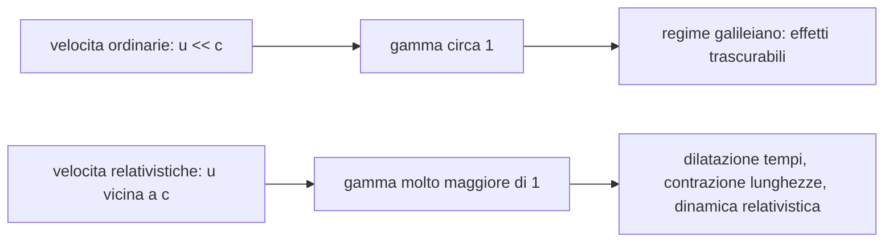

# Appunti completi per la verifica di fisica

> [!summary] Come usare questi appunti
> Questo file ricostruisce tutto il percorso fatto a lezione, nell'ordine in cui gli argomenti sono stati introdotti, ma senza separare meccanicamente per data. L'obiettivo e' studiare: capire il filo logico, sapere cosa dire nella parte teorica, riconoscere gli esercizi tipici e ricordare le indicazioni date dalla prof per la verifica.
>
> Le fonti principali sono le trascrizioni delle lezioni in [`trascrizione-lezioni/`](./trascrizione-lezioni/) e gli appunti da immagini in [`trascrizione-app-giulia.md`](./trascrizione-app-giulia.md). Quando la prof parla di schede su Classroom o slide, lo segnalo, ma non invento pagine del libro se non vengono nominate.

---

## Il problema iniziale: elettromagnetismo contro relativita galileiana

Il percorso parte da una crisi: la fisica classica funziona benissimo per moltissimi fenomeni, ma entra in difficolta quando incontra l'elettromagnetismo di Maxwell. La relativita galileiana dice che, passando da un sistema inerziale a un altro, le leggi della dinamica restano le stesse e le velocita si sommano semplicemente. Se un sistema \(S'\) si muove rispetto a \(S\) con velocita \(u\), allora, in forma elementare:

$$
\vec v = \vec v' + \vec u
$$

Questa idea pero crea un problema con la luce. Dalle equazioni di Maxwell si ricava una velocita della luce nel vuoto:

$$
c = \frac{1}{\sqrt{\varepsilon_0 \mu_0}}
$$

Il punto delicato e' che questa velocita sembra essere una costante fissata dalle proprieta del vuoto, non qualcosa che cambia a seconda dell'osservatore. Se pero si applica la composizione galileiana, un osservatore in moto rispetto alla sorgente dovrebbe misurare una velocita della luce diversa: \(c+u\), \(c-u\), o comunque un valore dipendente dal moto relativo. Qui nasce il conflitto.

La prof ha introdotto anche il problema attraverso la forza di Lorentz: due cariche positive in moto possono essere descritte in due sistemi diversi. Nel sistema della Terra si vedono sia forza elettrica sia forza magnetica; nel sistema solidale con una delle cariche, invece, l'altra carica puo risultare ferma e si vede solo la forza elettrica. Se si usasse la relativita galileiana in modo ingenuo, si otterrebbero accelerazioni diverse nei due sistemi, cosa inaccettabile per una teoria fisica coerente.

> [!important] Punto da saper spiegare in verifica
> Non basta dire "la velocita della luce e' un problema". Bisogna spiegare **perche**: la relativita galileiana prevede la somma ordinaria delle velocita, mentre l'elettromagnetismo porta a una velocita della luce fissata e indipendente dal sistema di riferimento. La relativita ristretta nasce per risolvere questa incompatibilita.

Fonte: [`01-04-26/transcription.txt`](./trascrizione-lezioni/01-04-26/transcription.txt), [`trascrizione-app-giulia.md`](./trascrizione-app-giulia.md).

---

## L'esperimento di Michelson e Morley

Per capire quale teoria descriva meglio la realta, Michelson e Morley cercano di verificare l'esistenza del moto della Terra rispetto all'etere. L'etere era immaginato come il mezzo o sistema privilegiato rispetto al quale la luce avrebbe avuto velocita \(c\). Se la Terra si muove rispetto all'etere con velocita \(\vec u\), allora la velocita della luce misurata sulla Terra dovrebbe combinarsi con \(\vec u\).

L'esperimento usa un interferometro. Una sorgente luminosa manda un fascio verso uno specchio semiriflettente. Una parte del fascio prosegue lungo un braccio, un'altra viene deviata lungo un braccio perpendicolare. Entrambi i raggi vengono riflessi da specchi e poi ricombinati su uno schermo, dove formano una figura di interferenza.

L'idea e' questa: se la Terra si muove rispetto all'etere, i due raggi dovrebbero impiegare tempi diversi nei due bracci, perche il moto terrestre si compone diversamente con il percorso parallelo e perpendicolare. Ruotando l'apparato, la differenza di tempo dovrebbe cambiare e quindi dovrebbe cambiare anche la figura di interferenza.

Il risultato pero non mostra variazioni significative. La prof sottolinea che Michelson e Morley condussero l'esperimento per anni e in condizioni diverse, quindi non si tratta di una prova fatta superficialmente. La mancata osservazione di un effetto netto apre varie possibilita: forse la Terra e' un sistema privilegiato, forse l'esperimento non e' adatto, oppure forse la velocita della luce e' davvero la stessa in ogni sistema inerziale.

Einstein sceglie l'ultima via e costruisce la relativita ristretta.

> [!warning] Per la verifica
> La prof ha detto che **non serve la matematica dell'esperimento di Michelson-Morley**. Serve invece sapere:
> - perche e' stato fatto;
> - cosa cercava di misurare;
> - perche il risultato e' importante;
> - come prepara la strada alla relativita ristretta.

Fonte: [`01-04-26/transcription.txt`](./trascrizione-lezioni/01-04-26/transcription.txt), [`trascrizione-app-giulia.md`](./trascrizione-app-giulia.md).

---

## I due postulati della relativita ristretta

Einstein costruisce la relativita ristretta partendo da due postulati. Un postulato non e' dimostrato dentro la teoria: viene assunto come base e poi si verificano le conseguenze.

Il primo postulato afferma che **le leggi fisiche sono le stesse in tutti i sistemi di riferimento inerziali**. La differenza rispetto a Galileo e' decisiva: non si parla solo delle leggi della dinamica, ma anche dell'elettromagnetismo. In questo modo l'elettromagnetismo viene elevato a teoria valida in ogni sistema inerziale, non da correggere ogni volta che si cambia osservatore.

Il secondo postulato afferma che **la velocita della luce nel vuoto e' la stessa in tutti i sistemi di riferimento inerziali**, indipendentemente dal moto della sorgente o dell'osservatore.

Questi due postulati obbligano a cambiare idee che nella fisica galileiana sembravano ovvie: simultaneita, tempo, lunghezza, quantita di moto, energia.

> [!note] Campo di validita
> La relativita ristretta vale per **sistemi di riferimento inerziali**. Se entrano in gioco sistemi accelerati, il quadro corretto e' la relativita generale. Questo e' importante anche per il paradosso dei gemelli.

Fonte: [`01-04-26/transcription.txt`](./trascrizione-lezioni/01-04-26/transcription.txt).

---

## Simultaneita: il tempo non e' piu assoluto

Nella relativita galileiana il tempo e' assoluto. Se due eventi sono simultanei in un sistema \(S\), allora sono simultanei anche in un sistema \(S'\) in moto rettilineo uniforme rispetto a \(S\). Questa idea funziona nella vita quotidiana perche le velocita ordinarie sono piccolissime rispetto a \(c\).

Einstein cambia la prospettiva partendo da un fatto semplice: la luce ha velocita finita. Se vedo un fulmine lontano, non sto vedendo l'istante esatto in cui e' caduto; sto ricevendo la luce partita prima. Per definire due eventi simultanei bisogna quindi tenere conto della distanza e del tempo di propagazione del segnale luminoso.

Due eventi \(E_1\) ed \(E_2\) possono essere detti simultanei per un osservatore se:

- l'osservatore e' in quiete rispetto agli eventi;
- e' equidistante da \(E_1\) ed \(E_2\);
- riceve i segnali luminosi nello stesso istante.

L'esperimento mentale del treno rende chiara la rottura con Galileo. Un osservatore \(O\) sulla banchina e' equidistante dai punti in cui cadono due fulmini alle estremita del treno e riceve i segnali insieme: per lui i fulmini sono simultanei. L'osservatore \(O'\) sul treno, invece, si muove verso uno dei fronti d'onda e si allontana dall'altro; riceve quindi prima un segnale e poi l'altro. Poiche per lui i punti di caduta sono alle estremita del vagone e quindi equidistanti, conclude che gli eventi non sono simultanei.

La conclusione e' radicale:

$$
\text{la simultaneita e' relativa al sistema di riferimento.}
$$

> [!important] Indicazione della prof
> Per la verifica bisogna sapere che la simultaneita e' relativa. La prof ha pero detto che non chiedera un tema lunghissimo del tipo: "spiega con il treno e i due fulmini perche non sono simultanei". Serve il concetto, non quattro pagine di racconto.

Fonte: [`01-04-26/transcription.txt`](./trascrizione-lezioni/01-04-26/transcription.txt), [`09-05-26/transcription.txt`](./trascrizione-lezioni/09-05-26/transcription.txt).

---

## Dilatazione dei tempi e tempo proprio

Dopo la simultaneita, la prof introduce la relativita del tempo con l'orologio a luce. Immaginiamo un treno che si muove con velocita relativistica \(u\) rispetto alla banchina. Sul treno c'e' una sorgente luminosa che manda un impulso verso uno specchio sul soffitto; il raggio sale, viene riflesso e torna alla sorgente.

Per l'osservatore \(O'\) sul treno, sorgente e specchio sono fermi. Il raggio percorre semplicemente una distanza \(2d\), quindi:

$$
\Delta t_0 = \frac{2d}{c}
$$

Per l'osservatore \(O\) sulla banchina, invece, il treno si muove mentre la luce sale e scende. Il percorso della luce non e' verticale ma obliquo. Usando Pitagora sul tratto di andata:

$$
(c \Delta t_a)^2 = (u \Delta t_a)^2 + d^2
$$

Da cui:

$$
\Delta t_a = \frac{d}{\sqrt{c^2-u^2}}
$$

e quindi, per andata e ritorno:

$$
\Delta t = \frac{2d}{\sqrt{c^2-u^2}}
$$

Raccogliendo \(c^2\) sotto radice:

$$
\Delta t = \frac{2d}{c\sqrt{1-\frac{u^2}{c^2}}}
$$

Poiche \(\frac{2d}{c} = \Delta t_0\), otteniamo:

$$
\Delta t = \frac{\Delta t_0}{\sqrt{1-\frac{u^2}{c^2}}}
$$

Si definisce:

$$
\beta = \frac{u}{c}
$$

e:

$$
\gamma = \frac{1}{\sqrt{1-\beta^2}}
$$

Il risultato finale e':

$$
\Delta t = \gamma \Delta t_0
$$

Il tempo proprio \(\Delta t_0\) e' il tempo misurato dall'osservatore che vede i due eventi avvenire nella stessa posizione spaziale. Nel caso dell'orologio a luce, gli eventi sono partenza e ritorno dell'impulso alla sorgente; chi li vede nello stesso punto e' l'osservatore sul treno.

Poiche \(\gamma \geq 1\), allora:

$$
\Delta t \geq \Delta t_0
$$

Questo significa che il tempo misurato da un osservatore che non vede gli eventi nello stesso punto e' piu lungo: **dilatazione dei tempi**.

> [!error] Errore tipico
> Non bisogna decidere chi misura il tempo proprio chiedendosi "chi si muove?". La domanda giusta e': **chi vede i due eventi nella stessa posizione?**

Fonte: [`08-04-26/transcription.txt`](./trascrizione-lezioni/08-04-26/transcription.txt), [`trascrizione-app-giulia.md`](./trascrizione-app-giulia.md).

---

## Il fattore di Lorentz

Il fattore di Lorentz e':

$$
\gamma = \frac{1}{\sqrt{1-\frac{u^2}{c^2}}}
$$

Il dominio fisico per corpi con massa diversa da zero e':

$$
-c < u < c
$$

Se \(u=0\), allora \(\gamma = 1\). Se \(u\) e' molto minore di \(c\), \(\gamma\) e' vicinissimo a 1 e gli effetti relativistici sono praticamente impercettibili. Se invece \(u\) si avvicina a \(c\), \(\gamma\) cresce molto rapidamente e tende all'infinito.

> [!warning] Errore da evitare in esercizio
> La prof insiste: \(\gamma\) e' **uno fratto la radice**, non solo la radice. Se viene \(\gamma < 1\), c'e' quasi sicuramente un errore.

Fonte: [`08-04-26/transcription.txt`](./trascrizione-lezioni/08-04-26/transcription.txt), [`09-04-26/transcription.txt`](./trascrizione-lezioni/09-04-26/transcription.txt).

---

## Paradosso dei gemelli

Il paradosso dei gemelli non consiste semplicemente nel fatto che due gemelli possano ritrovarsi con eta diverse. Quello, in relativita, e' spiegabile con la dilatazione dei tempi. Il vero paradosso nasce se si prova ad applicare simmetricamente la relativita del moto: se si dice che si muove la navicella, il gemello sulla navicella invecchia meno; ma se si dice che si muove la Terra rispetto alla navicella, sembrerebbe dover invecchiare meno il gemello sulla Terra.

La risoluzione sta nel fatto che il viaggio della navicella non e' tutto in un unico sistema inerziale. La navicella accelera, decelera, cambia direzione. Chi e' sulla navicella puo accorgersi dell'accelerazione attraverso forze apparenti. Quindi la situazione non e' simmetrica come sembrerebbe.

Per gli esercizi semplificati si usa spesso la formula della dilatazione dei tempi, ma la prof ricorda che una trattazione esatta del paradosso richiederebbe la relativita generale o comunque sistemi accelerati.

Fonte: [`08-04-26/transcription.txt`](./trascrizione-lezioni/08-04-26/transcription.txt).

---

## Esercizi su dilatazione dei tempi

La struttura tipica degli esercizi e':

1. identificare i due eventi;
2. capire chi misura il tempo proprio;
3. usare:

$$
\Delta t = \gamma \Delta t_0
$$

Un esempio discusso riguarda un viaggio verso Alfa Centauri. La distanza Terra-Alfa Centauri e' \(4{,}3\) anni luce e la navicella viaggia a \(0{,}95c\). Il tempo nel sistema terrestre e':

$$
\Delta t_{\text{Terra}} = \frac{4{,}3 \text{ anni luce}}{0{,}95c} \approx 4{,}5 \text{ anni}
$$

Questo non e' il tempo proprio, perche' la Terra vede partenza e arrivo in due posizioni diverse. Il tempo proprio e' quello misurato dall'astronauta, perche' nel suo sistema prima la Terra e poi Alfa Centauri passano dalla sua posizione. Quindi:

$$
\Delta t_0 = \frac{\Delta t}{\gamma}
$$

con:

$$
\gamma = \frac{1}{\sqrt{1-0{,}95^2}} \approx 3{,}2
$$

e quindi:

$$
\Delta t_0 \approx \frac{4{,}5}{3{,}2} \approx 1{,}4 \text{ anni}
$$

> [!tip] Consiglio della prof
> Non usare i \(4{,}3\) anni luce come se fossero automaticamente il tempo della navicella. \(4{,}3\) anni e' il tempo che impiegherebbe la luce, non un corpo che viaggia a \(0{,}95c\).

Fonte: [`11-04-26/transcription.txt`](./trascrizione-lezioni/11-04-26/transcription.txt).

---

## Contrazione delle lunghezze e lunghezza propria

La relativita galileiana considerava la lunghezza un invariante: un segmento ha la stessa lunghezza in tutti i sistemi inerziali. In relativita ristretta non e' piu cosi.

La prof introduce il problema con due pali fissi sulla banchina e un treno che passa. La distanza tra i pali puo essere calcolata misurando il tempo che il treno impiega a passare dal primo al secondo palo e moltiplicando per la velocita.

Per l'osservatore \(O\) sulla banchina:

$$
d = u \Delta t
$$

Per l'osservatore \(O'\) sul treno:

$$
d' = u \Delta t_0
$$

Poiche:

$$
\Delta t = \gamma \Delta t_0
$$

si ottiene:

$$
d = \gamma d'
$$

La notazione \(d\), \(d'\) pero puo confondere, quindi si introduce la **lunghezza propria** \(L_0\), cioe la lunghezza misurata dall'osservatore che vede il segmento fermo. La relazione viene scritta:

$$
L = \frac{L_0}{\gamma}
$$

La lunghezza misurata da chi vede il segmento in movimento e' minore della lunghezza propria: **contrazione delle lunghezze**.

> [!important] Dettaglio essenziale
> La contrazione riguarda solo le lunghezze parallele alla direzione del moto. Le dimensioni perpendicolari al moto non si contraggono.

Esempio: se un treno si muove orizzontalmente, la sua lunghezza si contrae per l'osservatore a terra, ma la sua altezza resta uguale. Un quadrato in moto puo essere visto come un rettangolo; una circonferenza puo apparire come un'ellisse.

Fonte: [`09-04-26/transcription.txt`](./trascrizione-lezioni/09-04-26/transcription.txt), [`11-04-26/transcription.txt`](./trascrizione-lezioni/11-04-26/transcription.txt), [`trascrizione-app-giulia.md`](./trascrizione-app-giulia.md).

---

## I muoni come evidenza della relativita ristretta

I muoni sono particelle instabili prodotte nell'alta atmosfera dall'interazione dei raggi cosmici con l'atmosfera. Hanno un tempo di vita medio, misurato nel sistema in cui sono fermi, circa:

$$
\Delta t_0 = 2{,}2 \cdot 10^{-6}\ \text{s}
$$

Se si facesse un calcolo classico, con velocita circa \(0{,}995c\), la distanza percorsa sarebbe:

$$
d = 0{,}995c \cdot 2{,}2 \cdot 10^{-6} \approx 657\ \text{m}
$$

Questa distanza non basterebbe per spiegare perche osserviamo muoni al suolo, visto che si formano molto piu in alto. La spiegazione relativistica e' che il tempo di vita misurato dalla Terra non e' il tempo proprio: per l'osservatore terrestre nascita e decadimento avvengono in posizioni diverse, quindi il tempo e' dilatato.

$$
\Delta t = \gamma \Delta t_0
$$

Con:

$$
\gamma = \frac{1}{\sqrt{1-0{,}995^2}} \approx 10
$$

La distanza percorsa diventa dell'ordine di:

$$
d \approx 0{,}995c \cdot \Delta t_0 \cdot \gamma \approx 6570\ \text{m}
$$

Questo rende comprensibile l'arrivo dei muoni fino al suolo.

> [!note] Per la verifica
> La prof ha citato i muoni tra le schede di Classroom. Sono un esempio importante per collegare teoria e realta sperimentale: non sono solo un esperimento mentale.

Fonte: [`11-04-26/transcription.txt`](./trascrizione-lezioni/11-04-26/transcription.txt), [`trascrizione-app-giulia.md`](./trascrizione-app-giulia.md).

---

## Trasformazioni di Lorentz

Lorentz introduce queste trasformazioni prima del 1905 per conciliare elettromagnetismo e relativita galileiana. Einstein le ricava poi in modo autonomo dai postulati della relativita ristretta, dando loro un significato fisico.

Si considera un sistema \(S'\) in moto con velocita \(u\) lungo l'asse \(x\) positivo rispetto a \(S\). Le origini coincidono a \(t=t'=0\). Le trasformazioni sono:

$$
\begin{cases}
x' = \gamma(x-ut) \\
y' = y \\
z' = z \\
t' = \gamma\left(t - \frac{\beta}{c}x\right)
\end{cases}
$$

dove:

$$
\beta = \frac{u}{c}
\qquad
\gamma = \frac{1}{\sqrt{1-\beta^2}}
$$

Le trasformazioni galileiane erano:

$$
\begin{cases}
x' = x-ut \\
y' = y \\
z' = z \\
t' = t
\end{cases}
$$

Se \(u \ll c\), allora \(\beta \approx 0\) e \(\gamma \approx 1\). Le trasformazioni di Lorentz si riducono a quelle di Galileo. Questo mostra che la relativita galileiana non e' "falsa" in assoluto: e' un caso limite valido per velocita molto piccole rispetto alla luce.

> [!warning] Indicazione esplicita sulla verifica
> Alla domanda sulla prova del 20, la prof ha detto che **non mettera la parte teorica sulle trasformazioni di Lorentz** e non vi fara ricavare le leggi di composizione da esse. Pero le trasformazioni restano lo sfondo teorico da cui nascono le formule usate.

Fonte: [`15-04-26/transcription.txt`](./trascrizione-lezioni/15-04-26/transcription.txt), [`09-05-26/transcription.txt`](./trascrizione-lezioni/09-05-26/transcription.txt).

---

## Composizione relativistica delle velocita

Dalle trasformazioni di Lorentz si ricava la composizione relativistica delle velocita. Se \(S'\) si muove rispetto a \(S\) con velocita \(u\) lungo \(x\), e un corpo ha velocita \(v_x\) in \(S\), allora la sua velocita in \(S'\) e':

$$
v_x' = \frac{v_x-u}{1-\frac{uv_x}{c^2}}
$$

La formula inversa e':

$$
v_x = \frac{v_x' + u}{1+\frac{uv_x'}{c^2}}
$$

Questa formula risolve il problema della luce. Se in \(S'\) un raggio luminoso ha velocita \(c\), in \(S\) si ottiene:

$$
v_x = \frac{c+u}{1+\frac{uc}{c^2}}
= \frac{c+u}{1+\frac{u}{c}}
= c
$$

Quindi chi si muove con velocita \(c\) in un sistema si muove con velocita \(c\) anche nell'altro.

### Come impostare gli esercizi

La prof insiste moltissimo su una procedura precisa:

1. scegliere un asse \(x\) e disegnarlo;
2. assegnare il segno alle velocita in base al verso scelto;
3. decidere quale sistema e' \(S\) e quale e' \(S'\);
4. identificare correttamente \(v\), \(v'\) e \(u\);
5. non buttare via i segni.

> [!danger] Errore grave
> Il segno meno davanti a una velocita ha significato fisico. Non si prende il valore assoluto solo perche "viene negativo". Una velocita negativa indica moto nel verso opposto all'asse scelto.

### Esempio: Picard e La Forge

Due astronavi si muovono verso una base. Si sceglie l'asse \(x\) nel verso del moto. Picard ha velocita:

$$
u = +0{,}806c
$$

La Forge ha velocita:

$$
v = +0{,}906c
$$

La velocita di La Forge rispetto a Picard e':

$$
v' = \frac{0{,}906c-0{,}806c}{1-0{,}906\cdot 0{,}806}
$$

$$
v' \approx +0{,}371c
$$

Se invece La Forge viaggia in direzione opposta, allora:

$$
v = -0{,}906c
$$

e:

$$
v' = \frac{-0{,}906c-(+0{,}806c)}{1-(-0{,}906)(0{,}806)}
$$

Il risultato e' negativo e con modulo minore di \(c\). Il segno indica il verso rispetto all'asse di Picard.

Fonte: [`15-04-26/transcription.txt`](./trascrizione-lezioni/15-04-26/transcription.txt), [`18-04-26/transcription.txt`](./trascrizione-lezioni/18-04-26/transcription.txt), [`trascrizione-app-giulia.md`](./trascrizione-app-giulia.md).

---

## Lunghezze contratte e composizione delle velocita nello stesso esercizio

Un esercizio piu ricco riguarda una sonda lanciata da un'astronave verso un pianeta. L'astronave si muove rispetto al pianeta con velocita \(0{,}445c\). La sonda ha lunghezza propria:

$$
L_0 = 10\ \text{m}
$$

ma l'astronave la misura lunga:

$$
L_A = 7{,}5\ \text{m}
$$

Da:

$$
L_A = \frac{L_0}{\gamma}
$$

si ricava:

$$
\gamma = \frac{L_0}{L_A} = \frac{10}{7{,}5} = 1{,}\overline{3}
$$

Da \(\gamma\) si ricava \(\beta\):

$$
\beta = \sqrt{1-\frac{1}{\gamma^2}}
$$

Questa e' la velocita della sonda rispetto all'astronave. Poi, per trovare la lunghezza vista dal pianeta, serve la velocita della sonda rispetto al pianeta, quindi si usa la composizione relativistica:

$$
v = \frac{v' + u}{1+\frac{v'u}{c^2}}
$$

Infine si ricalcola il \(\gamma\) rispetto al pianeta e si usa:

$$
L_{\text{pianeta}} = \frac{L_0}{\gamma_{\text{pianeta}}}
$$

> [!tip] Consiglio della prof
> Quando devi calcolare una lunghezza contratta, il \(\gamma\) deve essere quello relativo al sistema che sta misurando quella lunghezza. Non basta usare "un gamma qualsiasi": dipende dalla velocita dell'oggetto rispetto all'osservatore considerato.

Fonte: [`18-04-26/transcription.txt`](./trascrizione-lezioni/18-04-26/transcription.txt), [`trascrizione-app-giulia.md`](./trascrizione-app-giulia.md).

---

## Dinamica relativistica: quantita di moto

Nella dinamica classica:

$$
\vec p = m\vec v
$$

In relativita ristretta:

$$
\vec p = \gamma m \vec v
$$

Questo modifica profondamente la dinamica. Quando \(v\) si avvicina a \(c\), \(\gamma\) cresce moltissimo; quindi anche la quantita di moto cresce moltissimo. Per aumentare ulteriormente la velocita servirebbe un impulso sempre piu grande.

L'impulso e':

$$
\Delta \vec p = \vec F \Delta t
$$

Per portare un corpo con massa diversa da zero fino a \(c\), servirebbe una quantita di moto infinita. Questo richiederebbe una forza infinita o un tempo infinito, entrambe situazioni non fisicamente realizzabili. Per questo \(c\) e' una **velocita limite**.

> [!important] Per la verifica
> La prof ha detto che e' importante saper descrivere il grafico di \(\gamma\) e della quantita di moto relativistica in funzione della velocita, soprattutto per spiegare perche \(c\) e' una velocita limite.

Fonte: [`trascrizione-app-giulia.md`](./trascrizione-app-giulia.md), [`09-05-26/transcription.txt`](./trascrizione-lezioni/09-05-26/transcription.txt).

---

## Secondo e terzo principio in relativita

Il primo principio rimane sostanzialmente lo stesso: in assenza di forze risultanti, un corpo mantiene il suo stato di quiete o moto rettilineo uniforme.

Il secondo principio va espresso in termini di quantita di moto:

$$
\vec F = \frac{d\vec p}{dt}
$$

In classica, poiche \(\vec p = m\vec v\), si ottiene:

$$
\vec F = m\vec a
$$

In relativita:

$$
\vec F = \frac{d}{dt}(\gamma m \vec v)
$$

Il risultato non e' semplicemente \(m\vec a\), perche \(\gamma\) dipende dalla velocita. A forza finita, mentre \(v\) si avvicina a \(c\), l'accelerazione deve diminuire: il corpo accelera sempre meno.

Il terzo principio crea un problema concettuale: azione e reazione richiederebbero simultaneita. Ma la simultaneita non e' assoluta. Per questo, in relativita ristretta, il terzo principio non puo essere mantenuto nella stessa forma ingenua della meccanica classica.

> [!note] Indicazione della prof
> Ha detto che i principi della dinamica sono da sapere, non per forza come domanda diretta isolata, ma per capire cosa cambia nella dinamica relativistica.

Fonte: [`trascrizione-app-giulia.md`](./trascrizione-app-giulia.md), [`09-05-26/transcription.txt`](./trascrizione-lezioni/09-05-26/transcription.txt).

---

## Massa ed energia

Einstein arriva all'equivalenza massa-energia ragionando su impulsi luminosi e quantita di moto. L'idea, semplificata, e' questa: in un sistema solidale con una massa \(m\), due impulsi luminosi uguali e contrari arrivano simmetricamente, quindi le quantita di moto si annullano e la massa resta ferma. In un sistema esterno, pero, gli impulsi appaiono obliqui; le componenti verticali si annullano, ma quelle orizzontali si sommano. Sembrerebbe allora che la quantita di moto della massa debba cambiare.

Per evitare l'incongruenza, si deve ammettere che l'energia trasportata dalla radiazione contribuisca alla massa/energia del corpo. La relazione generale per l'energia totale relativistica e':

$$
E = \gamma mc^2
$$

Se il corpo e' fermo, \(v=0\), quindi \(\gamma=1\), e si ottiene l'energia a riposo:

$$
E_0 = mc^2
$$

L'energia cinetica relativistica e':

$$
E_c = E - E_0
$$

cioe:

$$
E_c = \gamma mc^2 - mc^2 = (\gamma - 1)mc^2
$$

Per velocita non relativistiche, questa formula torna compatibile con la formula classica:

$$
E_c = \frac{1}{2}mv^2
$$

> [!important] Cosa sapere per la verifica
> La prof ha detto che la scheda sull'energia e' dettagliata, ma non serve sapere tutti i passaggi matematici. Bisogna pero sapere le formule principali e il significato fisico: un corpo possiede energia anche da fermo, in quanto possiede massa.

Fonte: [`29-04-26/transcription.txt`](./trascrizione-lezioni/29-04-26/transcription.txt), [`trascrizione-app-giulia.md`](./trascrizione-app-giulia.md).

---

## Applicazioni di \(E=mc^2\)

La prof ha richiamato le applicazioni dell'equivalenza massa-energia, soprattutto per collegamenti teorici e storici. Ha citato le reazioni nucleari, il decadimento radioattivo e le bombe atomiche di Hiroshima e Nagasaki come esempi in cui una variazione di massa corrisponde a una grande quantita di energia.

Il punto non e' conoscere nei dettagli tutte le reazioni, ma sapere che \(E=mc^2\) non e' solo una formula famosa: descrive fenomeni reali in cui massa ed energia si trasformano l'una nell'altra.

> [!quote] Indicazione
> Nelle slide/schede di Classroom sull'energia, la prof dice che c'erano esempi di fenomeni fisici che danno credito all'equivalenza massa-energia. Non sono state indicate pagine del libro nelle trascrizioni.

Fonte: [`09-05-26/transcription.txt`](./trascrizione-lezioni/09-05-26/transcription.txt).

---

## Esercizi su energia, quantita di moto e conversioni

Questi esercizi sono tra i piu probabili perche la prof li ha ripresi piu volte.

### Energia a riposo ed energia totale

Per un elettrone:

$$
m_e = 9{,}1 \cdot 10^{-31}\ \text{kg}
$$

L'energia a riposo e':

$$
E_0 = m_ec^2
$$

Con \(c = 3 \cdot 10^8\ \text{m/s}\):

$$
E_0 = 9{,}1 \cdot 10^{-31}(3 \cdot 10^8)^2
$$

$$
E_0 \approx 8{,}19 \cdot 10^{-14}\ \text{J}
$$

Se l'elettrone si muove a \(0{,}80c\), allora:

$$
\gamma = \frac{1}{\sqrt{1-0{,}80^2}} \approx 1{,}67
$$

e:

$$
E = \gamma mc^2 \approx 1{,}36 \cdot 10^{-13}\ \text{J}
$$

La quantita di moto e':

$$
p = \gamma mv
$$

> [!warning] Unita di misura
> L'elettronvolt e il megaelettronvolt sono unita di energia, non di quantita di moto. La quantita di moto resta in \(\text{kg}\cdot \text{m/s}\), salvo formule avanzate non trattate.

### Conversione elettronvolt

Da sapere:

$$
1\ \text{eV} = 1{,}6 \cdot 10^{-19}\ \text{J}
$$

e:

$$
1\ \text{MeV} = 10^6\ \text{eV}
$$

Quindi:

$$
1\ \text{MeV} = 1{,}6 \cdot 10^{-13}\ \text{J}
$$

### Da energia cinetica a velocita

Se e' data l'energia cinetica, ad esempio:

$$
E_c = 1{,}50\ \text{MeV}
$$

si usa:

$$
E_c = (\gamma - 1)mc^2
$$

Da cui:

$$
\gamma = \frac{E_c}{mc^2} + 1
$$

Poi si ricava \(\beta\):

$$
\gamma = \frac{1}{\sqrt{1-\beta^2}}
$$

quindi:

$$
\beta = \sqrt{1-\frac{1}{\gamma^2}}
$$

Infine:

$$
v = \beta c
$$

### Energia totale doppia dell'energia a riposo

Se un protone ha energia totale doppia dell'energia a riposo:

$$
E = 2E_0
$$

allora:

$$
\gamma mc^2 = 2mc^2
$$

quindi:

$$
\gamma = 2
$$

Da \(\gamma\) si ricava \(\beta\) e quindi la velocita. L'energia cinetica e':

$$
E_c = (\gamma -1)mc^2 = mc^2
$$

Fonte: [`29-04-26/transcription.txt`](./trascrizione-lezioni/29-04-26/transcription.txt), [`07-05-26/transcription.txt`](./trascrizione-lezioni/07-05-26/transcription.txt), [`09-05-26/transcription.txt`](./trascrizione-lezioni/09-05-26/transcription.txt).

---

## Differenza di potenziale e lavoro della forza elettrica

Un tipo di esercizio discusso riguarda un elettrone accelerato da una velocita a un'altra, oppure da fermo fino a una certa energia cinetica. La relazione da usare non e' la cinematica del moto uniformemente accelerato, perche in regime relativistico l'accelerazione non resta costante anche se la forza e' costante.

La base e':

$$
L = \Delta E_c
$$

Per la forza elettrica:

$$
L = -q\Delta V
$$

Spesso negli esercizi si usa il valore assoluto:

$$
\Delta E_c = |q|\,|\Delta V|
$$

Quindi:

$$
|\Delta V| = \frac{\Delta E_c}{|q|}
$$

> [!tip] Come non confondersi
> Se l'energia cinetica e' in eV e la carica e' quella elementare, il calcolo e' costruito apposta per essere semplice. Pero la prof consiglia spesso di convertire in Joule per evitare confusione.

Fonte: [`07-05-26/transcription.txt`](./trascrizione-lezioni/07-05-26/transcription.txt), [`09-05-26/transcription.txt`](./trascrizione-lezioni/09-05-26/transcription.txt).

---

## Campo magnetico e raggio della traiettoria

La prof ha detto che all'esame/verifica potrebbe comparire una domanda in cui una particella entra in una regione con campo magnetico perpendicolare alla velocita. Se \(\vec v \perp \vec B\), la traiettoria e' circolare.

La forza di Lorentz magnetica vale:

$$
F_L = |q|vB
$$

perche \(\sin 90^\circ = 1\).

Questa forza e' centripeta. In regime relativistico si usa:

$$
F_c = \gamma m \frac{v^2}{r}
$$

Uguagliando:

$$
|q|vB = \gamma m \frac{v^2}{r}
$$

Da cui:

$$
r = \frac{\gamma mv}{|q|B}
$$

cioe:

$$
r = \frac{p}{|q|B}
$$

visto che \(p=\gamma mv\).

Fonte: [`09-05-26/transcription.txt`](./trascrizione-lezioni/09-05-26/transcription.txt).

---

## Effetto fotoelettrico: la crisi della fisica classica

Dopo la relativita, la prof introduce la fisica moderna attraverso l'effetto fotoelettrico. L'effetto fotoelettrico consiste nell'emissione di elettroni da parte di una lastra conduttrice colpita da radiazione elettromagnetica.

L'apparato sperimentale e' un tubo a vuoto con due piastre. La radiazione entra e colpisce una piastra metallica; se riesce a estrarre elettroni, questi vengono accelerati o frenati da un campo elettrico tra le piastre. Un amperometro misura la corrente, cioe il passaggio degli elettroni nel circuito.

Classicamente, la radiazione e' un'onda che trasporta energia. Se l'energia assorbita da un elettrone e' sufficiente a vincere il legame col nucleo/metallo, l'elettrone esce. Questa parte non e' strana. I problemi nascono dai risultati sperimentali.

### Prima osservazione problematica: intensita e potenziale di arresto

Se si aumenta la differenza di potenziale in modo favorevole, sempre piu elettroni vengono raccolti e la corrente aumenta. A un certo punto pero si raggiunge una corrente di saturazione: tutti gli elettroni estratti vengono raccolti, quindi aumentare ancora il campo non aumenta la corrente.

Se invece si inverte il campo, gli elettroni vengono frenati. Quelli con poca energia cinetica vengono fermati prima; quelli piu energetici riescono ancora ad arrivare all'altra piastra. Esiste un potenziale di arresto \(\Delta V_0\) che ferma anche gli elettroni piu energetici, quindi la corrente diventa zero.

La fisica classica prevederebbe: se aumento l'intensita della radiazione, aumento l'energia trasportata dall'onda, quindi gli elettroni dovrebbero uscire con energia cinetica maggiore. Per fermarli servirebbe un potenziale di arresto maggiore.

Ma sperimentalmente:

$$
\text{aumentando l'intensita, } \Delta V_0 \text{ non cambia}
$$

Cambia la corrente di saturazione, perche escono piu elettroni, ma non cambia l'energia massima con cui escono.

### Seconda osservazione problematica: frequenza di soglia

Gli elettroni escono solo se la frequenza della radiazione e' maggiore o uguale a una frequenza minima:

$$
f \geq f_0
$$

Se:

$$
f < f_0
$$

non escono elettroni, anche illuminando la lastra per un tempo lunghissimo. Questo e' inspiegabile classicamente, perche un'onda dovrebbe poter trasferire energia poco alla volta; dopo abbastanza tempo, l'elettrone dovrebbe accumulare energia sufficiente. Ma non succede.

> [!important] I due grafici da sapere
> La prof ha detto che i due grafici dell'effetto fotoelettrico sono fondamentali:
>
> 1. corrente \(I\) in funzione di \(\Delta V\), con corrente di saturazione e potenziale di arresto;
> 2. energia cinetica massima o potenziale di arresto in funzione della frequenza, con frequenza di soglia \(f_0\).

Fonte: [`06-05-26/transcription.txt`](./trascrizione-lezioni/06-05-26/transcription.txt), [`07-05-26/transcription.txt`](./trascrizione-lezioni/07-05-26/transcription.txt), [`trascrizione-app-giulia.md`](./trascrizione-app-giulia.md).

---

## Il modello a fotoni di Einstein

Einstein riprende l'ipotesi di Planck: l'energia, a livello microscopico, non viene scambiata in modo continuo, ma in pacchetti. Per la radiazione questi pacchetti sono i fotoni.

Un fotone:

- ha massa nulla;
- si muove sempre a velocita \(c\);
- trasporta energia;
- trasporta quantita di moto;
- ha energia:

$$
E = hf
$$

dove \(h\) e' la costante di Planck.

La quantita di moto del fotone e' legata all'energia da:

$$
p = \frac{E}{c}
$$

Ogni elettrone interagisce con un solo fotone. Questa frase e' fondamentale per capire perche l'intensita non cambia l'energia cinetica massima.

Se un elettrone assorbe un fotone, l'energia del fotone viene usata in parte per uscire dal metallo e in parte diventa energia cinetica:

$$
hf = W_0 + E_{c,\max}
$$

Il lavoro di estrazione \(W_0\) e' l'energia minima necessaria per estrarre gli elettroni piu esterni:

$$
W_0 = hf_0
$$

Quindi:

$$
E_{c,\max} = hf - hf_0
$$

Poiche il potenziale di arresto ferma gli elettroni piu energetici:

$$
E_{c,\max} = |q_e|\Delta V_0
$$

Da cui:

$$
|q_e|\Delta V_0 = hf - hf_0
$$

Se aumento l'intensita ma tengo fissa la frequenza, mando piu fotoni, ma ogni fotone ha la stessa energia \(hf\). Quindi possono uscire piu elettroni, ma non con energia cinetica maggiore. Per questo il potenziale di arresto non cambia.

> [!summary] Risoluzione delle anomalie
> - La frequenza decide l'energia del singolo fotone.
> - L'intensita decide quanti fotoni arrivano.
> - Se \(f<f_0\), nessun fotone ha energia sufficiente a estrarre un elettrone.
> - Se \(f\geq f_0\), gli elettroni possono uscire subito.

Fonte: [`07-05-26/transcription.txt`](./trascrizione-lezioni/07-05-26/transcription.txt), [`trascrizione-app-giulia.md`](./trascrizione-app-giulia.md).

---

## Dualismo onda-corpuscolo

L'effetto fotoelettrico obbliga a recuperare una descrizione corpuscolare della radiazione, ma non cancella il modello ondulatorio. La luce continua a comportarsi come onda in fenomeni come interferenza e diffrazione, ma in fenomeni microscopici come l'effetto fotoelettrico si comporta come un insieme di corpuscoli, i fotoni.

La prof ha sottolineato che il dualismo non riguarda solo la luce. Anche cio che pensiamo come particella puo comportarsi come onda. Un fascio di elettroni, se inviato contro un reticolo cristallino o attraverso strutture con distanze confrontabili con la lunghezza d'onda associata agli elettroni, puo produrre figure di diffrazione simili a quelle della luce.

Il dualismo onda-corpuscolo e' quindi reciproco:

$$
\text{onda} \leftrightarrow \text{corpuscolo}
$$

Non significa che in certi casi la luce "e' solo onda" e in altri "e' solo particella" in modo assoluto. Significa che a seconda dell'esperimento alcuni aspetti sono dominanti e altri trascurabili.

> [!note] Estensione teorica
> La prof ha accennato che da qui nasce la meccanica quantistica, con energia quantizzata, elettroni come onde stazionarie negli atomi e principio di indeterminazione di Heisenberg. Non ha sviluppato tutto per mancanza di tempo.

Fonte: [`09-05-26/transcription.txt`](./trascrizione-lezioni/09-05-26/transcription.txt).

---

## Cosa ha detto la prof sulla verifica

La verifica viene indicata come **prova del 20**. Le indicazioni esplicite sono queste.

La parte teorica sulle trasformazioni di Lorentz non viene messa come derivazione. La prof ha detto: non perdera tempo a far ricavare le leggi di composizione dalla relativita. Questo pero non significa che la composizione delle velocita non serva: serve eccome negli esercizi.

La simultaneita va saputa come concetto: e' relativa. Non sembra voler chiedere una spiegazione lunga dell'esperimento del treno e dei fulmini.

Gli argomenti teorici davvero importanti sono:

- postulati della relativita ristretta;
- sistemi inerziali;
- rottura con la relativita galileiana;
- problema della velocita della luce tra elettromagnetismo e Galileo;
- Michelson-Morley senza matematica;
- dilatazione del tempo e tempo proprio;
- contrazione delle lunghezze e lunghezza propria;
- fattore \(\gamma\);
- composizione relativistica delle velocita;
- quantita di moto relativistica;
- \(c\) come velocita limite;
- massa-energia;
- effetto fotoelettrico;
- dualismo onda-corpuscolo.

Ha detto anche che le schede su Classroom su gemelli, muoni ed energia possono aiutare. Sull'energia non serve conoscere ogni passaggio matematico, ma bisogna saper usare e interpretare le formule.

La prof ha insistito sugli esercizi: se non li fate, poi non potete dire che non siete stati allenati. Gli esercizi piu coerenti con quello che ha ripassato sono:

- calcolare \(\gamma\) da una velocita;
- calcolare velocita da \(\gamma\);
- usare \(E_c=(\gamma-1)mc^2\);
- usare \(E=\gamma mc^2\);
- usare \(E_0=mc^2\);
- convertire eV/MeV in Joule;
- calcolare \(p=\gamma mv\);
- usare lavoro elettrico e differenza di potenziale;
- usare forza di Lorentz e raggio di moto circolare;
- comporre velocita relativistiche con segni corretti.

Fonte: [`09-05-26/transcription.txt`](./trascrizione-lezioni/09-05-26/transcription.txt).

---

## Formulario ragionato

> [!info] Questo formulario non sostituisce la teoria
> La prof sembra puntare molto sul capire quale formula usare e in quale sistema di riferimento, non sul buttare formule a caso.

### Fattori relativistici

$$
\beta = \frac{v}{c}
$$

$$
\gamma = \frac{1}{\sqrt{1-\beta^2}}
$$

### Tempo

$$
\Delta t = \gamma \Delta t_0
$$

\(\Delta t_0\): tempo proprio, misurato da chi vede i due eventi nello stesso punto.

### Lunghezza

$$
L = \frac{L_0}{\gamma}
$$

\(L_0\): lunghezza propria, misurata da chi vede il segmento fermo.

### Composizione velocita

$$
v' = \frac{v-u}{1-\frac{uv}{c^2}}
$$

$$
v = \frac{v'+u}{1+\frac{uv'}{c^2}}
$$

### Quantita di moto

$$
p = \gamma mv
$$

### Energia

$$
E_0 = mc^2
$$

$$
E = \gamma mc^2
$$

$$
E_c = (\gamma - 1)mc^2
$$

### Lavoro elettrico

$$
\Delta E_c = |q|\Delta V
$$

### Fotoni

$$
E = hf
$$

$$
p = \frac{E}{c}
$$

### Fotoelettrico

$$
W_0 = hf_0
$$

$$
E_{c,\max} = hf - hf_0
$$

$$
E_{c,\max} = |q_e|\Delta V_0
$$

### Campo magnetico

$$
F_L = |q|vB
$$

se \(\vec v \perp \vec B\):

$$
r = \frac{\gamma mv}{|q|B}
$$

---

## Metodo di studio consigliato

Per studiare bene, conviene seguire il filo della crisi e non memorizzare a blocchi isolati. La relativita ristretta nasce per sistemare il conflitto tra Galileo e Maxwell. Da li cadono simultaneita assoluta, tempo assoluto e lunghezza assoluta. Poi cambiano quantita di moto ed energia, fino a \(E=mc^2\). Infine, con l'effetto fotoelettrico, anche l'idea classica di energia continua entra in crisi e nasce il modello a fotoni.

Un buon modo per ripassare e' provare a rispondere a voce a queste domande:

1. Perche Michelson-Morley e' importante anche se non "vede" l'etere?
2. Cosa dicono i due postulati di Einstein?
3. Perche due eventi simultanei per un osservatore possono non esserlo per un altro?
4. Chi misura il tempo proprio?
5. Chi misura la lunghezza propria?
6. Perche \(c\) e' una velocita limite?
7. Cosa cambia tra \(p=mv\) e \(p=\gamma mv\)?
8. Che differenza c'e' tra \(E_0\), \(E\), \(E_c\)?
9. Perche l'intensita non cambia il potenziale di arresto?
10. Perche sotto \(f_0\) non escono elettroni?
11. Cosa significa dualismo onda-corpuscolo?

Se sai rispondere a queste domande con frasi complete e sai fare gli esercizi base con \(\gamma\), energia, quantita di moto e potenziale, sei allineato con quello che la prof ha detto di voler verificare.

