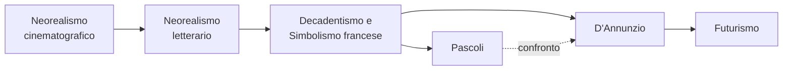

# Indice schemi di studio — Italiano (2026)

> **Programma coperto**: dal Neorealismo cinematografico al Futurismo
> **Nota prof**: "Neorealismo cinematografico e letterario, Simbolismo francese, Decadentismo, Pascoli e D'Annunzio. Studiare sugli appunti e sul libro il Futurismo (testi e Contro i professori su Classroom)"

---

## Come navigare

Ogni argomento ha la sua cartella con **3 livelli di profondità**:

| File | Cosa contiene | Quando usarlo |
|---|---|---|
| `mega-schema.md` | Tutto: analisi verso per verso, aneddoti della prof, mermaid, Q&A, glossario | Studio completo, prima lettura |
| `riassunto.md` | Contenuti condensati (~50%), versi chiave con commento sintetico | Studio efficiente, seconda passata |
| `ripasso.md` | Solo l'essenziale: bullet point, tabelle sinottiche, concetti chiave | Ripasso veloce prima dell'esame |

**Percorso consigliato**: mega-schema (capire tutto) → riassunto (consolidare) → ripasso (verificare di ricordare)

---

## Mappa degli argomenti

> Nota: l'ordine cronologico letterario è Decadentismo/Simbolismo → Pascoli/D'Annunzio → Futurismo → Neorealismo, ma in classe sono stati trattati partendo dal Neorealismo (più vicino a noi) per poi tornare indietro.

---

## Le 6 cartelle

### 1. `neorealismo-cinematografico/`

| File | Dimensione |
|---|---|
| mega-schema.md | 49.561 byte |
| riassunto.md | 29.293 byte |
| ripasso.md | 13.389 byte |

**Lezioni fonte** (trascrizioni):
- 18-12-25 — Introduzione al Neorealismo, collegamento Verga-Visconti *(solo parte finale)*
- 08-01-26 — Caratteristiche, Ossessione di Visconti
- 12-01-26 — Rossellini: Roma città aperta, Paisà
- 13-01-26 — Rossellini: Germania anno zero; De Sica: Ladri di biciclette *(⚠ no trascrizione, integrata da appunti manuali + mega-schema Verga esistente)*
- 22-01-26 — De Sica: Ladri di biciclette (clip), Miracolo a Milano, fine del Neorealismo *(solo prima metà)*
- 30-01-26 — Interrogazioni orali sul Neorealismo cinematografico *(solo parti pertinenti)*
- 03-03-26 — Interrogazioni orali *(solo parti pertinenti)*

**Contenuto**: Visconti (Ossessione, La terra trema), Rossellini (Trilogia della guerra), De Sica (Ladri di biciclette, Miracolo a Milano), caratteristiche del movimento, fine del Neorealismo.

---

### 2. `neorealismo-letterario/`

| File | Dimensione |
|---|---|
| mega-schema.md | 49.259 byte |
| riassunto.md | 18.845 byte |
| ripasso.md | 7.155 byte |

**Lezioni fonte**:
- 22-01-26 — Transizione cinema→letteratura, Calvino Prefazione del '64 *(solo seconda metà)*
- 26-01-26 — Calvino realismo fiabesco, Vittorini Conversazione in Sicilia
- 27-01-26 — Calvino "La solitudine di Pin", metodo Tipologia A
- 29-01-26 — Pavese: vita, Paesi tuoi, La casa in collina
- 30-01-26 — Interrogazioni orali *(solo parti letterarie)*
- 02-02-26 — Fenoglio: biografia, Una questione privata
- 09-02-26 — Correzione verifica, ripasso, interrogazioni

**Contenuto**: Calvino (Il sentiero dei nidi di ragno, Prefazione '64), Vittorini (Conversazione in Sicilia), Pavese (Paesi tuoi, La casa in collina), Fenoglio (Una questione privata), Viganò (L'Agnese va a morire).

---

### 3. `decadentismo-simbolismo/`

| File | Dimensione |
|---|---|
| mega-schema.md | 32.330 byte |
| riassunto.md | 18.688 byte |
| ripasso.md | 9.445 byte |

**Lezioni fonte**:
- 12-02-26 — Lezione unica: Decadentismo, Baudelaire, Verlaine, Rimbaud

**Contenuto**: Caratteri generali del Decadentismo, Baudelaire (La caduta dell'aureola, L'albatro, Corrispondenze), Verlaine (Languore, L'arte poetica), Rimbaud (Lettera del veggente, Vocali). Analisi verso per verso di ogni poesia.

---

### 4. `pascoli/`

| File | Dimensione |
|---|---|
| mega-schema.md | 87.695 byte |
| riassunto.md | 42.062 byte |
| ripasso.md | 22.715 byte |

**Lezioni fonte**:
- 16-02-26 — Introduzione Pascoli e D'Annunzio, biografia Pascoli
- 17-02-26 — Biografia (Andreoli), poetica del Fanciullino
- 23-02-26 — Fanciullino punti cardine, poetica, stile, Arano
- 24-02-26 — Lavandare, X Agosto
- 26-02-26 — Temporale, L'assiuolo (+ Santagata "Un piccolo io"), Canti di Castelvecchio, Il gelsomino notturno, La tovaglia
- 02-03-26 — Nebbia, interrogazioni

**Contenuto**: Biografia completa (+ interpretazione Andreoli), poetica del Fanciullino, lingua e stile (Contini, fonosimbolismo), Myricae (Arano, Lavandare, X Agosto, Temporale, L'assiuolo, Nebbia), Canti di Castelvecchio (Il gelsomino notturno, La tovaglia). Tutte le poesie analizzate verso per verso.

---

### 5. `dannunzio/`

| File | Dimensione |
|---|---|
| mega-schema.md | 62.319 byte |
| riassunto.md | 39.450 byte |
| ripasso.md | 20.745 byte |

**Lezioni fonte**:
- 03-03-26 — Introduzione biografia e poetica *(+ interrogazioni)*
- 05-03-26 — Biografia, poetica, Estetismo, intro Il Piacere
- 09-03-26 — Poetica, Canta la gioia! (Canto novo)
- 10-03-26 — Il Piacere: Andrea Sperelli, "Quel nome!"
- 12-03-26 — La pioggia nel pineto, Stabat nuda aestas, Santagata "Il gigantismo dell'io", documentario L'amante guerriero
- 16-03-26 — Intro La sera fiesolana, compiti
- 17-03-26 — La sera fiesolana *(solo parte D'Annunzio, poi Futurismo)*

**Contenuto**: Biografia (vita inimitabile, donne, Fiume, Vittoriale), poetica (Estetismo, superomismo, panismo), Il Piacere (Andrea Sperelli), Alcyone (La pioggia nel pineto, Stabat nuda aestas, La sera fiesolana), Canto novo (Canta la gioia!). Confronto con Pascoli.

---

### 6. `futurismo/`

| File | Dimensione |
|---|---|
| mega-schema.md | 31.924 byte |
| riassunto.md | 11.129 byte |
| ripasso.md | 5.080 byte |

**Lezioni fonte**:
- 17-03-26 — Contesto storico e poetica del Futurismo *(solo parte finale della lezione)*
- 31-03-26 — Manifesto del Futurismo, Manifesto tecnico, Marinetti (Marcia futurista, Contro i professori), Govoni (Il palombaro)

> ⚠ **La prof indica di studiare anche "testi e Contro i professori su Classroom"** — materiale aggiuntivo non coperto da queste trascrizioni.

---

## Come sono stati creati

1. Le **trascrizioni** delle lezioni sono state generate localmente con Gemini API da registrazioni audio
2. I **mega-schemi** sono stati generati da subagent AI che hanno letto le trascrizioni grezze (mai gli schemi singoli auto-generati, di qualità inferiore), sintetizzando più lezioni per argomento
3. Per la lezione **13-01-26** (senza trascrizione audio), sono stati usati appunti manuali + sezioni pertinenti del mega-schema preesistente su Verga
4. I **riassunti** (~50%) e i **ripassi** (~30%) sono stati generati condensando i mega-schemi
5. La lezione **26-02-26** è stata integrata successivamente quando la trascrizione è diventata disponibile

---

## Riepilogo dimensioni

| Cartella | Mega-schema | Riassunto | Ripasso | Totale |
|---|---:|---:|---:|---:|
| neorealismo-cinematografico | 49.561 | 29.293 | 13.389 | 92.243 |
| neorealismo-letterario | 49.259 | 18.845 | 7.155 | 75.259 |
| decadentismo-simbolismo | 32.330 | 18.688 | 9.445 | 60.463 |
| pascoli | 87.695 | 42.062 | 22.715 | 152.472 |
| dannunzio | 62.319 | 39.450 | 20.745 | 122.514 |
| futurismo | 31.924 | 11.129 | 5.080 | 48.133 |
| **Totale** | **313.088** | **159.467** | **78.529** | **551.084** |
