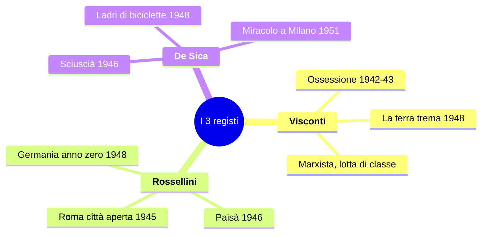
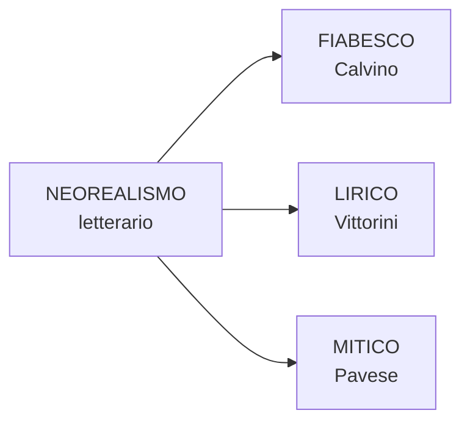
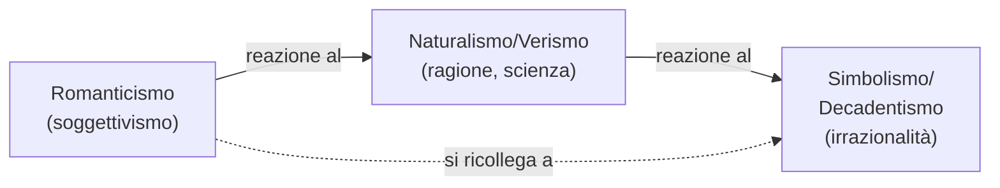
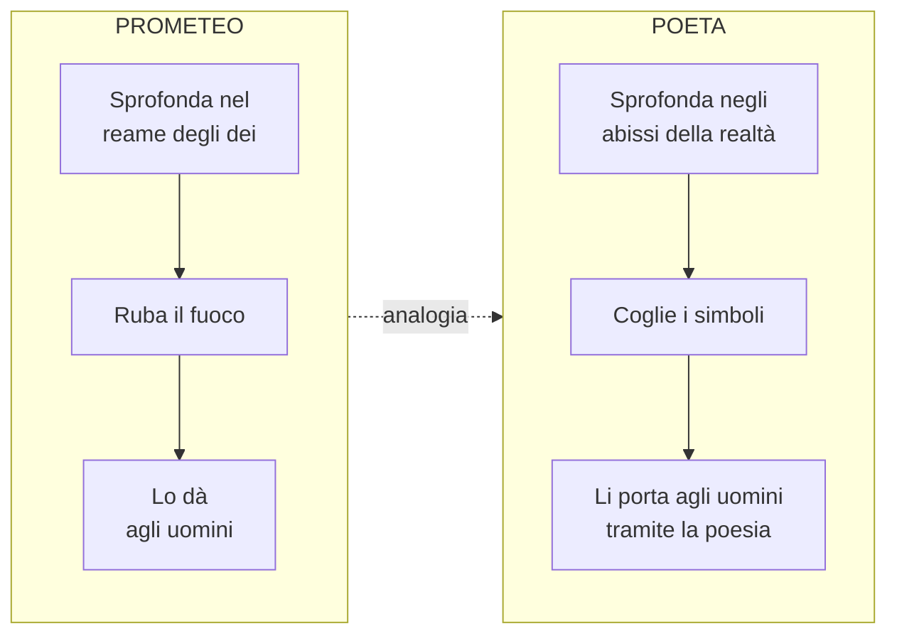
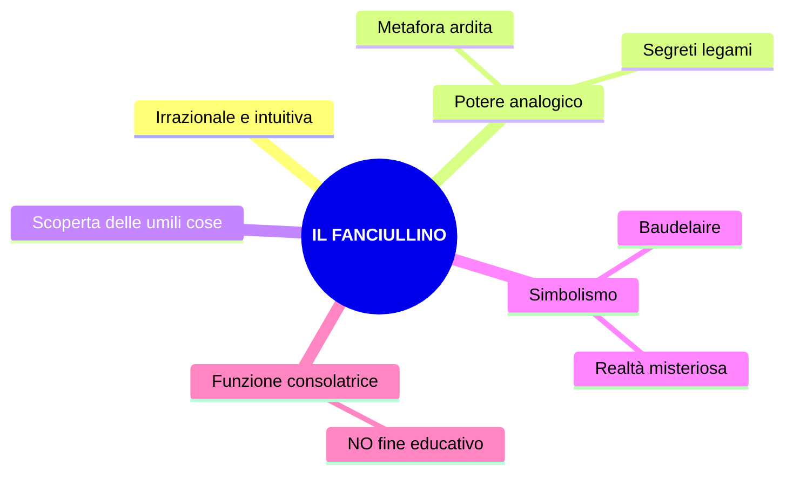
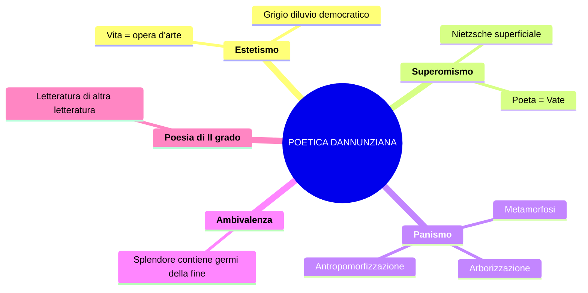
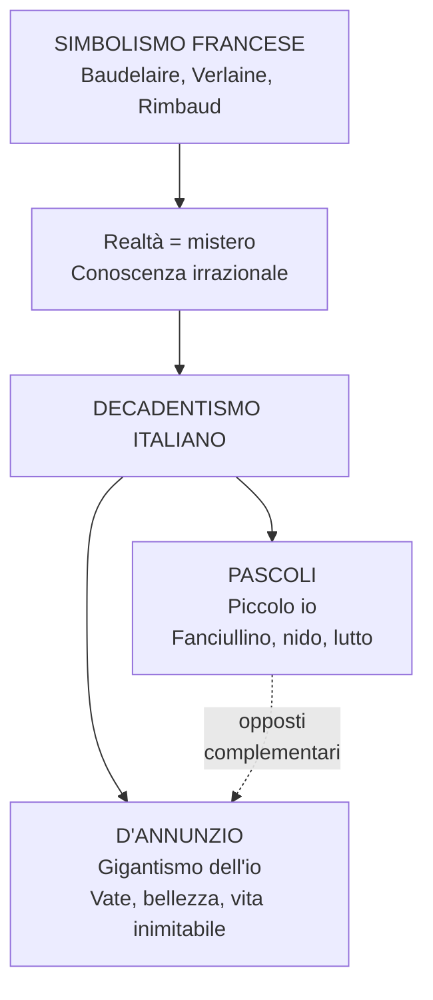

# SOPRAVVIVENZA: Italiano in 1 Ora

> Tutto il programma ESCLUSO il Futurismo.
> Ordine: come li ha spiegati la prof in classe.
> Le parti con **!!!** = la prof le chiede SEMPRE / ha detto "imparatelo".

---

## BLOCCO 1 — NEOREALISMO CINEMATOGRAFICO (10 min)

### Cos'è

- Corrente **prima di tutto cinematografica**, poi letteraria
- Italia, anni **'40-'50** (Fascismo -> Guerra -> Dopoguerra)
- Mostra la **realtà così com'è**, senza filtri
- "Neo" = **nuovo sguardo** che rifiuta l'ideologia nazifascista
- NON è un semplice ritorno al realismo ottocentesco: nasce dall'**urgenza storica** della guerra e della Resistenza

> Pasolini: *"Il primo atto di coscienza critica, dal punto di vista politico e ideologico, che l'Italia ha avuto di sé stessa."*

### Cinema fascista vs neorealista — impara i contrasti

| Fascista | Neorealista |
|---|---|
| Propaganda, evasione | Denuncia, impegno civile |
| Italia prospera, fasulla | Italia misera, autentica |
| Cinecittà, teatri di posa | Strade reali, esterni |
| Eroi, kolossal, comandanti | Disoccupati, bambini, folla |
| Attori professionisti | Attori **non professionisti** |
| **Verticalità** (templi, colonne) | **Orizzontalità** (strade, campagne, valli) |

- **Telefoni bianchi** = cinema disimpegnato, sentimentale, d'evasione -> **rifiutato** dal Neorealismo
- **Istituto Luce** e **Cinecittà** fondati da Mussolini per propaganda

### !!! 7 caratteristiche del cinema neorealista

1. Attori **non professionisti** (presi dalla strada)
2. **Scenografie reali** (rifiuto dei teatri di posa)
3. Centralità della **folla** e dei **bambini** (inversione dei ruoli)
4. **Paesaggi orizzontali** (vs verticalità fascista)
5. Cinema dell'**impegno** (denuncia miseria, disoccupazione, guerra)
6. **Voce a chi non l'ha mai avuta** (pescatori, donne, bambini)
7. **Visione documentaria** della realtà

Registi **tutti di sinistra** (marxisti, gramsciani). Cinema **antiborghese**, al servizio degli umili.

> Pasolini: *"Quasi tutte le opere neorealistiche si fondano sull'idea che il futuro sarà migliore."*

### I 3 registi — scheda sinottica

| Regista | Chi è | Film principali | Cifra |
|---|---|---|---|
| **Visconti** | Aristocratico milanese, marxista | *Ossessione* (1942-43), *La terra trema* (1948) | Lotta di classe, Verga al cinema |
| **Rossellini** | Padre di Isabella R., marito di Ingrid Bergman | *Roma città aperta* (1945), *Paisà* (1946), *Germania anno zero* (1948) | Trilogia della guerra |
| **De Sica** | Attore/regista, padre di Christian De Sica | *Sciuscià* (1946), *Ladri di biciclette* (1948), *Miracolo a Milano* (1951) | Bambini protagonisti |

De Sica: **apripista per Spielberg e Scorsese** (cit. prof).

### Film per film — punti chiave

**VISCONTI — *Ossessione* (1942-43)**: **Anticipatore** del Neorealismo. Noir. Giovanna + vagabondo Gino uccidono il marito Bragana. Lungo il Po, campagna emiliana. **Bragana** = perfetto uomo fascista (maschilista, autoritario). Film **dissacratorio** del sacro valore della **famiglia** (pilastro del fascismo). Sala a Salsomaggiore **esorcizzata con l'acqua santa**. Prodotto **a spese di Visconti** (venduti gioielli, cavalli, scuderie).

**VISCONTI — *La terra trema* (1948)**: Da ***I Malavoglia*** di **Verga**. Attori **non professionisti** (i veri pescatori di Aci Trezza). **Dialetto siciliano stretto**. Famiglia Valastro, pescatori vs grossisti. Didascalia: *"I fatti rappresentati in questo film accadono in Italia, dove uomini sfruttano altri uomini."* Seconda didascalia: *"La lingua italiana non è in Sicilia la lingua dei poveri."*

!!! **Verga vs Visconti** — differenza cruciale:

| Verga (*I Malavoglia*) | Visconti (*La terra trema*) |
|---|---|
| Ideologia **conservatrice** | Ideologia **progressista**, marxista |
| Pessimismo, **immobilismo** | Auspicio di **riscatto del proletariato** |
| **Non interviene**, non giudica | **Denuncia** lo sfruttamento |
| Nessuna speranza (chi tenta = illuso) | **Lotta di classe** per un futuro migliore |

**ROSSELLINI — *Roma città aperta* (1945)**: Anna Magnani (Pina), Aldo Fabrizi (Don Pietro). Pina uccisa nella retata; Don Pietro si sacrifica; figlio Romoletto assiste. **Antifascismo trasversale**: comunisti + cattolici nel CLN. Scena iconica: **morte di Pina** -> caduta di Magnani **NON prevista**, tenuta dal regista. Comparse = persone che avevano **vissuto l'occupazione** fino a pochi mesi prima.

**ROSSELLINI — *Paisà* (1946)**: Film **ad episodi**, dalla Sicilia al Po. "Paisà" = "paesano". Ep. finale "Inverno 1944": **Valli di Comacchio**. Resistenza in paesaggio **piatto e atipico** (non montagna). Modello per *L'Agnese va a morire* di Montaldo (romanzo di Viganò).

**ROSSELLINI — *Germania anno zero* (1948)**: Berlino in macerie (reali). **Edmund** (ragazzino) scava fosse per i morti. Ex maestro nazista gli insegna la **legge del più forte** -> Edmund **avvelena il padre** -> maestro lo rifiuta -> **si suicida**. Significato: ideologia nazista continua a fare vittime = **fine dell'innocenza**.

**DE SICA — !!! *Ladri di biciclette* (1948)**: Attori non professionisti. **Antonio Ricci** (disoccupato) + figlio **Bruno**. Trama: trova lavoro attacchino -> moglie impegna **lenzuola** per la bicicletta -> bicicletta **rubata** il primo giorno -> pellegrinaggio padre-figlio per Roma -> **inversione dei ruoli** (Bruno più maturo) -> Ricci tenta di **rubarne un'altra** -> quasi **linciato** -> salvato dal **pianto di Bruno** -> finale mano nella mano nella folla. **Bicicletta = dignità del lavoro**. La miseria degrada l'uomo (vittima -> carnefice). Anche Bruno lavora: fa il benzinaio.

**DE SICA — *Miracolo a Milano* (1951)** = **FINE SIMBOLICA del Neorealismo**: i poveri in Piazza Duomo **volano via su scope magiche** -> "dove ogni giorno sia davvero un buon giorno". Apertura a sogno e fantasia -> **rompe il patto neorealista** con la realtà.

### Cronologia

| Anno | Film | Fase |
|---|---|---|
| 1942-43 | *Ossessione* (Visconti) | **Anticipazione** |
| 1945 | *Roma città aperta* (Rossellini) | |
| 1946 | *Paisà* / *Sciuscià* | |
| 1948 | *La terra trema* / *Germania anno zero* / *Ladri di biciclette* | **Apogeo** |
| 1951 | *Miracolo a Milano* (De Sica) | **Fine simbolica** |

Durata in senso stretto: circa **un decennio** (1942-1951).

### Pasolini è il Neorealismo

Recupera: umili, attori non professionisti, realtà senza filtri. Aggiunge: **afflato lirico-poetico**, ricerca stilistica, musica classica su realtà squallida. **NON è propriamente neorealista** -> vuole inventare un linguaggio. Primo film: *Accattone* (1961), quasi vent'anni dopo.

---

## BLOCCO 2 — NEOREALISMO LETTERARIO (8 min)

### Definizione

- !!! **"Non fu una scuola"** (Calvino, Prefazione '64) — nessuna regola codificata
- Confini più sfumati del cinema; ogni autore lo declina diversamente
- Carlo Bo: *"tanti neorealismi quanti sono i narratori"*

**5 obiettivi**: (1) problemi reali del Paese, (2) dialogo col pubblico (vs Ermetismo elitario), (3) rifiuto del classicismo -> privilegio ai contenuti, (4) antifascismo, (5) lingua verso il parlato e i dialetti.

**Triade dei modelli** (Calvino): *I Malavoglia* (Verga) + *Paesi tuoi* (Pavese, 1941) + *Conversazione in Sicilia* (Vittorini, 1941)

### Prefazione del '64 di Calvino — concetti chiave

- Libro come prodotto **collettivo** (clima generale, tensione morale)
- Esplosione letteraria = fatto fisiologico, esistenziale, collettivo
- Rapporto scrittore-pubblico **paritario** (vs Ermetismo distante)
- **"Smania di raccontare"**: forza interiore post-liberazione
- Non documentare, ma **esprimere** (*ex-premo* = ciò che preme da dentro e deve uscire)
- **"Non fu una scuola"** — voci periferiche, scoperta delle diverse Italie
- Affrontare la Resistenza **"di scorcio"** (tangenzialmente, tramite Pin bambino, per evitare retorica)

### I 5 autori

**CALVINO — *Il sentiero dei nidi di ragno* (1947)**:
- **Pin**: ragazzino orfano, troppo maturo per i bambini, estraneo agli adulti -> **solitudine**
- Ruba una pistola a un tedesco -> la pistola = **oggetto magico** (fiabesco)
- Sentiero, bosco, luogo segreto = **topoi fiabeschi**
- !!! **Realismo fiabesco**: realtà della Resistenza filtrata dallo sguardo infantile
- !!! **Scelta antiagiografica** ("ve lo chiederò all'esame"): evitare la "santificazione", mostrare incertezze e fragilità della lotta partigiana
- Metafora: *"nebbia di solitudine che ti si condensa nel petto"*

**VITTORINI — *Conversazione in Sicilia* (1941)**:
- Silvestro Ferrauto torna in Sicilia dalla madre. **Realismo lirico**: mito + storia, allitterazioni, ripetizioni
- Incipit: **"astratti furori"** = rabbia profonda ma non direzionata, inerzia, accidia
- "Giornali squillanti" = **sinestesia**; "scarpe rotte" = povertà
- !!! **Polemica con Togliatti**: l'arte **NON deve "suonare il piffero della rivoluzione"**
- Con Pavese: antologia *Americana* (1941, censurata)
- Fonda **Il Politecnico** (1945): rivista per svecchiare la cultura

**PAVESE — *La casa in collina* (1948, capolavoro)**:
- Santo Stefano Belbo (Langhe), traduttore di *Moby Dick*, editore Einaudi
- **NON partecipa alla Resistenza** -> senso di colpa -> iscrizione PCI 1948
- Corrado (= Pavese): intellettuale inerte, si rifugia in collina durante la guerra
- Temi: città (alienazione) vs campagna (radici/mito); collina = isolamento; infanzia come età mitica
- !!! **"Ogni guerra è una guerra civile: ogni caduto somiglia a chi resta, e gliene chiede ragione."** (la prof: "vi prego di tenere a mente")
- Doppio significato: (1) storico — Resistenza = italiani vs italiani; (2) universale — compassione per il nemico
- **Suicidio**: estate 1950, Hotel Roma, Torino, a 42 anni
- *Paesi tuoi* (1941): morte di Gisella = sacrificio rituale; barbarie senza idealizzazione
- *La luna e i falò* (1950): Anguilla torna nelle Langhe; falò rituali -> falò di distruzione

**FENOGLIO — *Una questione privata***:
- **Milton**: partigiano ossessionato dal dubbio che Fulvia ami Giorgio
- La questione privata invade e cancella tutto il resto (guerra, libertà, compagni)
- Milton è povero, timido, intellettuale (poesia di Yeats in tasca)
- **"Crepassi... creperei"** = poliptoto: morire a 30 anni = morire vecchi in guerra

**VIGANO — *L'Agnese va a morire* (1949)**:
- Contadina analfabeta -> staffetta partigiana dopo deportazione del marito e uccisione del gatto
- Mossa da **emozioni** (rabbia, vendetta), **NON da ideologia**
- !!! **NON è una figura femminile di rottura** (donna materna, prudente — "va detto esplicitamente" cit. prof)

### Le 3 declinazioni del realismo

### Neorealismo vs Ermetismo

| Ermetismo (anni '30) | Neorealismo (anni '40-'50) |
|---|---|
| Linguaggio oscuro, levigato | Parlato, dialettale |
| Pubblico: elite | Pubblico: popolo |
| Temi astratti | Temi reali |
| Rapporto scrittore-pubblico distante | Paritario |

---

## BLOCCO 3 — DECADENTISMO E SIMBOLISMO (8 min)

### Coordinate

- **Quando**: anni **80 dell'800** ("scrivetelo" cit. prof)
- **Dove**: Francia
- **Nome**: da *Languore* di Verlaine: "Sono l'impero alla fine della **decadenza**"
- **Corrente madre**: **Simbolismo francese** -> da cui nasce il **Decadentismo italiano**
- !!! **Discontinuità** netta con Naturalismo/Verismo ("in continuità è la risposta SBAGLIATA" cit. prof)
- Ricollegamento ideale al **Romanticismo** (soggettivismo, senso di fine e morte)

### !!! Naturalismo vs Decadentismo

| Naturalismo / Verismo | Simbolismo / Decadentismo |
|---|---|
| Ragione e scienza | **Irrazionalità**, intuizione, illuminazione |
| Realtà conoscibile, oggettiva | Realtà **misteriosa, illusoria, complessa** |
| Linguaggio fedele al reale ("come una fotografia") | Linguaggio **allusivo, simbolico, evocativo** |
| Parola rispecchia il reale | Parola **suggerisce** (solo la sfumatura) |
| Positivismo | **Rifiuto del positivismo** |

### 5 caratteri fondamentali

1. **Sfiducia nella scienza** ("la scienza non spiega la realtà")
2. **Soggettivismo** e individualismo
3. **Rivalutazione dell'irrazionalità**: intuizione, illuminazione, ampliamento dei sensi
4. **Senso di fine e di morte**, del mistero che domina la vita
5. **Esclusione dalla società borghese** ("tutta volta all'utile, al profitto")

### La realtà = trama di simboli

Realtà misteriosa -> da **decifrare** non con la ragione, ma con **intuizione** e **ampliamento dei sensi** (droghe: oppio, assenzio; esperienze estreme; poesia). *Fenomenico* (gr. *phainomai* = apparire) = ciò che si vede. I simbolisti cercano ciò che sta **sotto**.

### I 3 Poeti Maledetti

"Maledetti" = esistenza al di fuori dei canoni borghesi.

#### BAUDELAIRE — il padre

!!! **"Caduta dell'aureola"** (da *Lo Spleen di Parigi*) — DA SAPERE A MEMORIA come concetto:
- Spleen = malinconia, tristezza, noia
- Scena: poeta e uomo qualunque in un **bordello**
- L'**aureola** (= sacralità del poeta) cade nella **fanghiglia del macadam**
- Il poeta **NON la raccoglie** -> rivendica la **marginalità** con orgoglio
- "Qualche poeta spregevole la raccatterà" senza capire la condizione autentica
- Doppio atteggiamento: **critico** verso la società + **orgoglioso** della marginalità

**"L'Albatro"**: il poeta = albatro. In volo: **maestoso**, domina i cieli. A terra: **goffo, ridicolo**, ali = impaccio. I marinai lo deridono = uomini comuni. "Sta con l'uragano e ride degli arcieri". **"Esule in terra"**.
- !!! **3 espressioni metaforiche** ("le dovete imparare"): **"Re dell'azzurro"**, **"Viaggiatore alato"**, **"Principe delle nubi"**
- **"Ali di gigante"** = immaginazione, arte -> nella dimensione terrena diventano impedimento

**"Corrispondenze"** (da *I fiori del male*, 1857) — TESTO MANIFESTO:
- Natura = **tempio** con "pilastri vivi" che mormorano "indistinte parole"
- L'uomo passa tra **"foreste di simboli"** che lo osservano con sguardi familiari
- **"I profumi, i colori e i suoni si rispondono"** -> tutti i dati sensoriali tendono a un'**unità misteriosa**
- Figura retorica centrale: **SINESTESIA** (fusione di sensi diversi, non spiegabile razionalmente)
  - "Profumi freschi come la carne d'un bambino" -> olfatto + **tatto**
  - "dolci come l'oboe" -> olfatto + **udito**
  - "verdi come i prati" -> olfatto + **vista**

#### VERLAINE — la musica

- Vita sregolata: alcolismo dai 18 anni, relazione con Rimbaud, gli spara, 2 anni di carcere
- !!! **"De la musique avant toute chose"** = musica sopra ogni cosa
- !!! **"Sol la sfumatura"** ("scrivetelo"): la parola deve **suggerire**, non delineare = solo **allusione**
- **"Prendi l'eloquenza e torcile il collo"** = uccidi l'arte del bel parlare
- **Rifiuto della rima** ("morte della poesia"): "suona vuota e falsa sotto la lima"
- **"Musica ancora e sempre! Tutto il resto è letteratura"** = il canone è un mondo morto, da superare

#### RIMBAUD — il veggente

- Nato 1854, ribelle, vagabonda per l'Europa, mercante di pelli e caffè, muore a **37 anni** (1891)
- !!! **"Io è un altro"** (*Je est un autre*): l'identità non è univoca, è **caos** (diverso dal soggettivismo romantico di Leopardi)
- !!! **"Farsi veggente"**: il poeta vede ciò che all'uomo comune è negato -> dimensione della **profezia**
- **"Lungo, immenso e ragionato disordine di tutti i sensi"**: il metodo per diventare veggente
- !!! **"Ladro di fuoco"** = analogia con **Prometeo**:

*Vocali*: A=nera, E=bianca, I=rossa, U=verde, O=blu. Associazione suoni-colori in libertà, fitta trama di **sinestesie**.

---

## BLOCCO 4 — PASCOLI (14 min) — argomento PIÙ GROSSO

### Biografia — cose da sapere

| Cosa | Quando |
|---|---|
| Nasce a **San Mauro di Romagna** | 1855 |
| **Padre assassinato** (10 agosto, colpo di fucile, impuniti) | 1867 |
| Morte della **madre** | 1868 |
| Università a **Bologna**, allievo di **Carducci** | 1873 |
| ***Myricae*** (1a ed., dedicata al padre) | 1891 |
| **Anno terribile** (matrimonio di Ida -> "tradimento") | 1895 |
| Casa di **Castelvecchio di Barga** con Mariù | 1902 |
| Succede a Carducci a Bologna | 1905 |
| Morte per **cirrosi epatica** (= alcolismo) | 1912 |

- **Ruggero Pascoli**: amministratore della tenuta "La Torre" dei Torlonia -> assassinato da sicari, colpevoli **MAI puniti**
- L'anno dopo muore la madre; poi una sorella e un fratello
- **TUTTA la produzione** = rielaborazione del lutto per il padre
- **Nido familiare** con le sorelle -> resistenza al mondo esterno
- Matrimonio di Ida (1895) = anno terribile -> resta con **Mariù** (presenza ossessiva)
- Politica: socialismo (Andrea Costa) -> poi nazionalismo; NON partecipa attivamente

### Andreoli — il "caso clinico"

- **Trauma**: morte del padre = frattura senza giustizia, del tutto inaspettata
- **Alcolismo**: lettera a Maria ("testa piena di cognac"); fotografie (addome tipico); cirrosi epatica
- **Rapporto morboso con le sorelle**: Mariù = gelosia ossessiva (filo al piede di notte); il **cane Gulì** = "figlio di coppia sterile"
- **Cirrosi epatica**: causa della morte, diagnosi **taciuta** all'epoca
- **Rivalutazione**: NON il poeta del bozzetto sereno -> vicino ai **poeti maledetti** per inquietudini
- D'Annunzio: *"Il più grande e originale poeta apparso in Italia dopo il Petrarca"*

### !!! Il Fanciullino (1897) — dichiarazione di poetica

Dentro di noi c'è un **fanciullino** che conserva la **meraviglia** che l'adulto perde.

> *"Noi ingrossiamo e arrugginiamo la voce, ed egli fa sentire il suo **tinnulo squillo** come di campanello."*

"Tinnulo squillo" = **fonosimbolismo** (suono -> significato). Adulto = voce roca. Fanciullino = squillo limpido.

> *"Il nuovo non si inventa, si scopre."*

> *"Il poeta è poeta, non oratore o predicatore, non filosofo, non istorico, non maestro."*

**5 punti cardine**:
1. Poesia = **irrazionale, intuitiva** (coerente col Decadentismo)
2. **Potere analogico** -> metafora ardita, segreti legami tra le cose
3. Poesia = **scoperta** delle **umili cose**
4. **Simbolismo** -> realtà misteriosa, simboli da decifrare (Baudelaire)
5. **Funzione consolatrice** — nessun fine educativo deliberato; valori emergono naturalmente

!!! **vs Leopardi**: fanciullino Pascoli = **ferito, angosciato, ripiegato**; fanciullo Leopardi = **vitale, energico, immaginativo**. Il fanciullino di Pascoli è un **rimpianto**, dimensione perduta.

### Lingua e stile

- Pascoli e D'Annunzio = **fondatori della poesia del Novecento** (Mengaldo)
- Contini: **"rivoluzionario nella tradizione"**; Pasolini: incide sulle sperimentazioni del '900
- **Plurilinguismo**: basso/colloquiale + tecnico-botanico (*viburni, marra, porche, maggese, tamerici*) + dialettale + latino
- **3 categorie di Contini**: Pre-grammaticale (onomatopee, fonosimbolismo) | Grammaticale (tradizione) | Post-grammaticale (tecnicismi botanici)
- **Fonosimbolismo**: il suono allude a un significato simbolico — "chiu" (U accentata) = angoscia/lutto; "viburni" (U, O) = oscurità; "tinnulo squillo" = purezza del fanciullino
- **Ampliamento della valenza semantica**: "fosse" = fossati + tombe; "urna" = calice del fiore + urna cineraria + grembo
- !!! La poesia pascoliana **NON è bozzetto naturalistico** ma **fitta trama di riferimenti simbolici** (cit. prof)
- Verso **franto**, frammentato: lineette, parentesi nei versi, variabilità d'interpunzione

### Le 2 raccolte — !!! DISTINGUILE SEMPRE

| *Myricae* (1891) | *Canti di Castelvecchio* (1903) |
|---|---|
| Tamerici = piccole cose, umili | Continuazione di Myricae |
| Dedicata al padre | Campagna **toscana** (Garfagnana) |
| Forma: **madrigale** (2 terzine + 1 quartina) | Ciclo delle stagioni |
| | Cari morti **ossessivi** |
| | Tema nuovo: **Eros e Thanatos** |

La **nebbia** è elemento ricorrente in **entrambe**.

### Poesie — analisi per l'interrogazione

**ARANO (Myricae)**: Scena di aratura autunnale, madrigale, endecasillabi. "Roggio nel filare / qualche pampano brilla" = **anastrofe** (roggio = rosso, concorda con pampano, non filare). "Marra **paziente**" = **enallage/ipallage** (paziente = il contadino, non la zappa). "Pa-zi-en-te" = **dieresi** per mantenere l'endecasillabo. "Il suo sottil tintinno come d'oro" = **allitterazione** (siepi, s'ode, suo, sottil) + **sinestesia** (udito + vista). Schema: VISIVO (nebbia) -> UDITIVO (monotonia) -> UDITIVO luminoso (speranza).

**LAVANDARE (Myricae)**: Solitudine, abbandono. **Struttura circolare** (aratro -> aratro). "Mezzo grigio e mezzo nero" = campo **a metà arato**. Aratro senza buoi = **solitudine**. "Sciabordare" e "tonfi" = **onomatopee**. "Nevica la frasca" = usato transitivamente -> **licenza poetica**. "Come l'aratro in mezzo alla maggese" = maggese (campo incolto) = **abbandono**.

**!!! X AGOSTO (Myricae)** — poesia più "costruita":
**Parallelismo simmetrico** rondine <-> padre:

| Rondine | Padre |
|---|---|
| Ritornava al **tetto** (metonimia) | Tornava al **nido** (famiglia) |
| L'uccisero | L'uccisero |
| Portava un **insetto** | Portava **due bambole** in dono |
| Come in **croce**, tende il verme al cielo | Immobile, **addita** le bambole al cielo |
| Il nido **pigola** sempre più piano | Casa **romita**, attesa vana |

- "Cadde tra spini [...] come in croce" -> rimando alla **Passione di Cristo** (sacrificio). Pascoli NON è credente ma recupera l'immagine cristologica
- "Resto negli aperti occhi un grido" = **sinestesia** (uditivo/visivo)
- "Quest'**atomo opaco del male**" = **perifrasi** per la Terra: *atomo* (piccolezza), *opaco* (senza luce), *del male* (dolore)
- Stelle cadenti = **pianto del cielo**; cielo indifferente (come Leopardi)
- **Struttura circolare**: "pianto di stelle" riprende la strofa 1

**TEMPORALE (Myricae)**: "Un bubbolio lontano..." = **onomatopea pregrammaticale** (Contini) + **reticenza**. Contrasti cromatici: rosso / nero / bianco. "Tra il nero un casolare: un'ala di gabbiano" = **analogia** tipicamente pascoliana (somiglianza intuitiva). Casolare = **protezione** (nido); ala = **leggerezza**.

**!!! L'ASSIUOLO (Myricae)** — studiare saggio **Santagata "Un piccolo io"** (materiale d'esame!):
**Climax ascendente**: chiu = **voce** (str. 1) -> **singulto** (str. 2) -> **pianto di morte** (str. 3)
- "nuotava in un'alba di perla" = **analogia**; mandorlo e melo "parevano ergersi" = **personificazione**
- "soffi di lampi" = **sinestesia** (udito + vista); "nero di nubi" = **fonosimbolismo** (N + vocali cupe)
- "sentivo... sentivo... sentivo" = **anafora**; i primi due = percezione sensoriale, il terzo = **dimensione interiore**
- "com'èco d'un grido che fu" = rimando alla **morte del padre**
- "finissimi sistri d'argento" = **sistri** = strumenti del **culto dei morti** egizio (Iside/Osiride); fonosimbolismo (suono sottile per le molte "i")
- "invisibili porte / che forse non s'aprono più" = porte dell'**aldila**; interrogativa in parentetica = innovazione del Novecento

**!!! IL GELSOMINO NOTTURNO (Canti di Castelvecchio)** — **Eros e Thanatos**:
- Poesia d'occasione per le nozze di Gabriele Briganti. Pascoli osserva **dall'esterno** la prima notte di nozze -> **voyeuristico** (paura + curiosità, dimensione infantile)
- "E s'aprono i fiori notturni / nell'ora che penso ai miei cari" -> Eros e Thanatos fin dall'inizio: fiore (vita) + miei cari (= **morti**)
- "Sotto l'ali dormono i nidi, come gli occhi sotto le ciglia" = **similitudine** bellissima
- "odore di fragole rosse" = **sinestesia** (olfatto + vista)
- "Nasce l'erba sopra le fosse" = **ampliamento semantico** (fossati + **tombe** -> vita e morte simultanee)
- "La Chioccetta per l'aia azzurra va col suo pigolio di stelle" = immagine tra le più belle del '900. Chioccetta = **Pleiadi**; aia azzurra = cielo; "pigolio di stelle" = **sinestesia** (udito + vista)
- "brilla al primo piano: s'è spento..." = **reticenza** -> unione degli sposi
- "l'urna molle e segreta" = **3 significati**: calice del fiore / urna cineraria / **grembo della sposa** -> Eros e Thanatos insieme. Petali "gualciti" = componente di **violenza sottile** nell'Eros

**NEBBIA (Canti di Castelvecchio)**: Anafora "Nascondi le cose lontane" in ogni strofa. Nebbia = **muro protettivo** (ma anche ostacolo).
- !!! **Siepe Pascoli vs Leopardi**: Leopardi (*L'Infinito*) = stimola l'immaginazione, va **OLTRE**; Pascoli (*Nebbia*) = **protegge**, delimita il nido. Funzione **opposta**.
- "Valeriane" = pianta del sonno -> pace
- "Don don" = onomatopea; campane a morto; la fine = **nulla eterno** (Foscolo)
- **Cipresso** = morte; **cane** = custode degli affetti (Gulì)

**LA TOVAGLIA (Canti di Castelvecchio)**: Superstizione contadina rovesciata. Bambina: i morti = "i **tristi**, i **pallidi** morti" (minacciosi). Donna adulta: i morti = "i **buoni**, i **poveri** morti" (consolatori). La donna = **alter ego di Pascoli**: i morti sono **più vivi dei vivi**. "Bevono lacrime amare" -> nessuna consolazione cristiana. "Pane? sì, pane si chiama" -> i ricordi si soffermano su **cose materiali**. "La casa **regge**" = l'**azdora** (dialetto romagnolo).

---

## BLOCCO 5 — D'ANNUNZIO (14 min) — argomento PIÙ GROSSO

### Biografia — timeline

- **1863**: nasce a **Pescara** (Abruzzo)
- **1879**: pubblica *Primo vere* (prima raccolta)
- **1881**: si trasferisce a **Roma**, si iscrive a Lettere
- **1883**: sposa **Maria Hardouin di Gallese** (fuga d'amore orchestrata coi giornali)
- **1889**: pubblica ***Il Piacere*** — romanzo cardine dell'estetismo
- **1894**: incontra **Eleonora Duse** a Venezia — l'amore più celebre
- **1900**: pubblica *Il Fuoco* — ritrae la Duse umiliata. Lei: "Ti perdono tutto, perché ho amato"
- **1903**: pubblica ***Alcyone*** — raccolta poetica più importante
- **1910**: fugge a **Parigi** per debiti insostenibili
- **1914**: didascalie per ***Cabiria*** (colossal cinematografico)
- **1916**: ferito all'occhio -> !!! **"l'Orbo Veggente"** (ossimoro: pur ferito, vede ciò che gli altri non vedono)
- **1918**: **Beffa di Buccari** (3 motoscafi MAS, siluri + bottigliette tricolori); **Volo su Vienna** (390.000 volantini, impatto mediatico enorme)
- **1919**: conia **"vittoria mutilata"**; **occupa Fiume** con legionari; Marinetti tra i primi ad arrivare
- **1920**: **Carta del Carnaro**; **Natale di Sangue** (24 dicembre, l'esercito italiano bombarda, ~50 vittime)
- **1921-1938**: **Vittoriale** (Gardone Riviera, Lago di Garda), "splendido isolamento"
- **1938**: muore di emorragia cerebrale al tavolo da lavoro

**MAS** = **Memento Audere Semper** = Ricorda di osare sempre.

### Rapporto col fascismo

> **Mussolini**: *"D'Annunzio è come un **dente guasto**: o lo si estirpa o lo si copre d'oro."*

Il fascismo prende da lui: riti, motti ("**Eia Eia Alalà**", MAS), saluto fascista — tutta la componente teatrale. D'Annunzio accetta gratificazioni (presidente Accademia d'Italia 1937) ma mantiene **distacco**. Non condivide conciliazione né alleanza con la Germania. Sorvegliato dall'emissario Rizzo.

### "Primo influencer della storia"

Inventa nomi commerciali: **La Rinascente**, penna **Aurora**, liquore **Aurum**, la parola **automobile** (al femminile). Cinema: didascalie per *Cabiria* (1914). Gossip: da notizie inventate pur di far parlare di sé ("un po' come Fabrizio Corona, ma più colto" cit. prof).

### !!! Poetica — i concetti chiave

| Concetto | Significato |
|---|---|
| **Estetismo** | **Vita = opera d'arte**; rifiuto della democrazia ("grigio diluvio democratico"); ideale aristocratico; vivere inimitabile |
| **Superomismo** | Da **Nietzsche** (interpretazione **superficiale**); il poeta è **Vate** che rivela il senso dell'esistenza; rovesciare l'impotenza in onnipotenza |
| **Panismo** | **Fusione estatica** poeta-natura tramite **metamorfosi** |
| **Vitalismo** | Adesione totale alla vita, al di là del bene e del male |
| **Ambivalenza** | Nel momento di massimo splendore si annidano i germi della **fine** |
| **Poesia di II grado** | Letteratura fatta di altra letteratura (citazioni da San Francesco, lirica provenzale, Leopardi, Baudelaire, mitologia) |

!!! **3 parole-chiave del panismo** (la prof insiste): **METAMORFOSI**, **ARBORIZZAZIONE dell'essere umano**, **ANTROPOMORFIZZAZIONE della natura**

### Il Piacere (1889) — punti essenziali

- **Andrea Sperelli** = alter ego di D'Annunzio = !!! **"il Dorian Gray italiano"** (cit. prof)
- Ama Elena Muti (passione sensuale) -> lei lo abbandona per un lord
- Si lega a Maria Ferres (amore puro)
- **Lapsus**: pronuncia "Elena" con Maria -> Maria fugge -> **fallimento esistenziale** dell'esteta
- Roma **barocca** dei Papi (splendore che prelude alla decadenza = ambivalenza)
- !!! **"Bisogna fare la propria vita come si fa un'opera d'arte"**
- ***Habere non haberi***: possedere, non essere posseduti
- "Il seme del **sofisma**": gusto per la parola vuota -> autoinganno
- Linguaggio forbito, raffinato, aulico — in linea con i contenuti

### Le fasi della narrativa

| Fase | Opera | Cosa sapere |
|---|---|---|
| Verista | *Novelle della Pescara* | Gusto per il primitivo, barbarico; Abruzzo |
| Estetismo | ***Il Piacere*** (1889) | Sperelli, vita=opera d'arte |
| Bontà | *Giovanni Episcopo*, *L'Innocente* | Sapere titoli e ragione della definizione |
| Superomismo | *Le vergini delle rocce*, *Il Fuoco* | Duse umiliata; brano "Uomini superiori" p.315 |
| Intima | ***Notturno*** (1916) | Scritto su striscioline di carta, convalescenza |

### Poesie

**!!! LA PIOGGIA NEL PINETO (Alcyone, 1903)** — la lirica PIÙ CELEBRE:
- **Fusione panica** uomo-natura sotto la pioggia; **Ermione** = trasfigurazione mitologica di **Eleonora Duse**; pineta della **Versilia**, estate
- **"Taci."** = apostrofe d'apertura; invito al silenzio
- "non odo parole che dici umane; ma odo parole più nuove che **parlano** gocciole e foglie" = parla la natura
- "piove su le **tamerici** salmastre" -> arbusti delle dune (= *Myricae* di Pascoli!)
- "piove su i mirti **divini**" -> sacri a **Venere** (dea della passione)
- "piove su i nostri volti **silvani**" -> da *silva* = selva: i volti diventano del bosco -> inizio **metamorfosi**
- "i **freschi** pensieri" = **sinestesia**
- "la **favola bella** che ieri t'illuse, che oggi m'illude" = l'amore, l'illusione amorosa
- "il pino ha un suono, **e** il mirto altro suono, **e** il ginepro" = **polisindeto**; gocce = dita -> **antropomorfizzazione**
- "**immersi** noi siam nello **spirto silvestre**, d'**arborea vita** viventi" = **arborizzazione**
- "il tuo volto **ebro** è molle come una **foglia**" (ebro = inebriato)
- "o **creatura terrestre** che hai nome Ermione" = nata dalla terra
- "**crosciare** l'argentea pioggia che **monda**" = purifica come rito mistico; "crosciare/croscio" = **poliptoto**
- "non bianca ma quasi fatta **virente**, par da **scorza** tu esca" = virente (verdeggiante), uscire dalla corteccia -> **fusione panica** (cfr. **Apollo e Dafne** di Bernini)
- "il **verde vigor** rude ci allaccia i malleoli" = **allitterazione** v-v; vegetazione impedisce il movimento
- "la favola bella che ieri **m'illuse**, che oggi **t'illude**" = pronomi **invertiti** -> **scambio di identità** per la fusione
- Montale scrive una **parodia** nel 1971 (*Piove*)

**LA SERA FIESOLANA (Alcyone)**: Fiesole, campagna toscana; **primavera**; 3 strofe + ritornello francescano; nessun nucleo narrativo.
- "parole **fresche** come il frusciò che fan le foglie" = **sinestesia** + **allitterazione** della F
- Il contadino che s'attarda = **reminiscenza leopardiana** (*Il sabato del villaggio*)
- **14 versi = 1 unico periodo** -> padronanza dell'**ipotassi**
- !!! "**Laudata sii** per lo tuo viso di perla, o sera" = dal **Cantico delle Creature** di San Francesco -> recupero **estetico NON religioso**
- "i tuoi **grandi umidi occhi** ove si tace l'acqua del cielo" = sera = figura femminile sensuale
- "la pioggia che **bruiva**" = francesismo, **onomatopea**
- "i pini dai novelli **rosei diti**" = gemme come dita -> **antropomorfizzazione**
- "i **fratelli olivi**" = dalla **lauda francescana**
- "**Io ti dirò** verso quali reami..." = promessa di **rivelazione** che **non arriva mai** -> il poeta-veggente suggerisce ma non svela
- "le colline s'incurvino come **labbra** c'è un divieto chiuda" = **similitudine sensuale**
- "**Laudata sii per la tua pura morte, o sera**" = conclusione del giorno -> stelle

**STABAT NUDA AESTAS (Alcyone)**: Titolo = "L'estate giaceva nuda"; caccia amorosa all'Estate **personificata** come divinità femminile.
- "estuava l'aere" = l'aria ribolliva; sensi evocati: VISTA (vampa), UDITO (cicale, ruscelli), OLFATTO (sentore del colubro/serpente)
- "capei **fulvi** nell'**argento palladio**" = fulvi (biondo-rosso); foglie degli ulivi sacri ad Atena/Pallade
- "**Immensa** apparve, **immensa** nudità" = la figura occupa l'intero orizzonte; congiungimento suggerito, non esplicitato
- Saggio di Santagata: **"Il gigantismo dell'io"**

**CANTA LA GIOIA (da *Canto Novo*)**: Esaltazione del vitalismo e dell'edonismo.
- "Canta l'immensa gioia di vivere, d'esser forte, d'esser giovane, di mordere i frutti terrestri con saldi e bianchi denti voraci" = **vitalismo**, sensualità
- "ogni **fuggevole** forma, ogni grazia caduca, ogni apparenza nell'ora breve" = **ambivalenza**: la gioia porta in sé la consapevolezza della **caducità**
- "E un misero schiavo colui / che del dolore fa sua veste" = **volontà di potenza**
- "A te la gioia, **ospite**" = **senhal** dalla lirica provenzale (per celare l'identità dell'amata)
- Da "magnifica donatrice" a "**invincibile creatrice**" / "**trasfigurata**" = **crescendo** dalla dimensione terrena alla divina

---

## BLOCCO 6 — CONFRONTO PASCOLI-D'ANNUNZIO (4 min) — !!! FONDAMENTALE PER L'ESAME

Santagata: Pascoli = **"un piccolo io"**; D'Annunzio = **"il gigantismo dell'io"**

| | **PASCOLI** | **D'ANNUNZIO** |
|---|---|---|
| Poeta = | Fanciullino | Vate / Superuomo |
| L'io | Piccolo | Gigantesco |
| Tono | Intimo, malinconico, dimesso | Magniloquente, sensuale, celebrativo |
| Natura | Nido, rifugio; mistero | Fusione panica; corpo da possedere |
| Eros | **Escluso** (Gelsomino: guarda da fuori) | **Protagonista** (si congiunge con l'Estate) |
| Morte | Presenza costante e ossessiva | L'altra faccia del vitalismo |
| Linguaggio | Fonosimbolismo, onomatopee, pregrammaticale | Aulico, erudito, musicale, di II grado |
| Immagini | Rondine che cade, aratro, assiuolo, pianto del cielo | Frutti addentati, amplesso con l'Estate, pioggia-dita |
| Rapporto col Decadentismo | Simbolismo, analogia, vaghezza | Estetismo, superomismo, panismo |
| Rapporto col pubblico | Distante, appartato | Teatrale, mediatico, influencer |
| Vita | Ritirata, domestica, nido | Vita inimitabile, impresa di Fiume, Duse |
| **IN COMUNE** | Sfiducia nella scienza, realtà = mistero, conoscenza irrazionale, **fondatori della poesia del '900** (Mengaldo) |

---

## CHEAT SHEET FINALE — se hai 5 minuti prima di entrare

**Neorealismo cinema**: attori non professionisti, scenografie reali, folla/bambini, orizzontalità, impegno, marxismo. Visconti (Ossessione=anticipatore, dissacra famiglia; La terra trema=Verga marxista, "uomini sfruttano altri uomini"). Rossellini (Roma città aperta=morte Magnani non prevista; Paisà=Comacchio; Germania anno zero=Edmund si suicida). De Sica (Ladri di biciclette=bicicletta dignità del lavoro, inversione ruoli padre-figlio; Miracolo a Milano=fine, scope magiche). Verismo conservatore vs Neorealismo progressista. Pasolini NON è neorealista.

**Neorealismo letterario**: "non fu una scuola" (Calvino). Calvino (realismo fiabesco, scelta antiagiografica — "ve lo chiederò"). Vittorini (realismo lirico, "astratti furori", no piffero della rivoluzione). Pavese (ogni guerra è guerra civile — "vi prego di tenere a mente"; NON partecipa; suicidio 1950). Fenoglio (questione privata invade tutto). Viganò (emozioni non ideologia; NON figura di rottura). Tre declinazioni: fiabesco/lirico/mitico.

**Decadentismo**: anni 80 dell'800, Francia, NON in continuità col Naturalismo. Realtà = mistero da decifrare con irrazionalità. Baudelaire (caduta aureola=perdita sacralità; albatro=re dell'azzurro/viaggiatore alato/principe delle nubi; corrispondenze=foreste di simboli, sinestesia). Verlaine (musica sopra ogni cosa, sol la sfumatura, torcile il collo). Rimbaud (io è un altro, farsi veggente, ladro di fuoco=Prometeo).

**Pascoli**: morte del padre = TUTTO. Andreoli: caso clinico (alcolismo, Mariù, cirrosi). Fanciullino (5 punti: irrazionale, analogico, scoperta umili cose, simbolismo, consolatrice; vs Leopardi: ferito vs vitale). Fonosimbolismo. 3 categorie Contini (pre/grammaticale/post). NON bozzetti naturalistici. Myricae vs Canti di Castelvecchio (Eros e Thanatos). X Agosto (parallelismo rondine-padre, atomo opaco del male). Assiuolo (climax voce->singulto->pianto, sistri=culto dei morti). Gelsomino (urna=3 significati, voyeurismo). Nebbia (siepe OPPOSTA a Leopardi). Tovaglia (morti consolatori).

**D'Annunzio**: vita inimitabile, primo influencer. Estetismo (vita=opera d'arte, "grigio diluvio democratico"). Superomismo (Nietzsche superficiale). Panismo (metamorfosi+arborizzazione+antropomorfizzazione). Ambivalenza (splendore contiene germi della fine). Poesia di II grado. Il Piacere (Sperelli=Dorian Gray italiano, lapsus Elena/Maria, "fare la vita come opera d'arte"). Pioggia nel pineto (fusione panica, Ermione=Duse, favola bella, pronomi invertiti, scorza=Bernini). Sera fiesolana (Laudata sii=San Francesco estetico NON religioso, rivelazione che non arriva). Stabat nuda (gigantismo dell'io). Orbo Veggente. Fiume, Beffa di Buccari, MAS=Memento Audere Semper. Rapporto ambiguo col fascismo ("dente guasto").

**Pascoli vs D'Annunzio**: piccolo io vs gigantismo; fanciullino vs Vate; Eros escluso vs Eros protagonista; nido vs fusione panica; stessa matrice decadente, esiti opposti; fondatori poesia '900 (Mengaldo).
