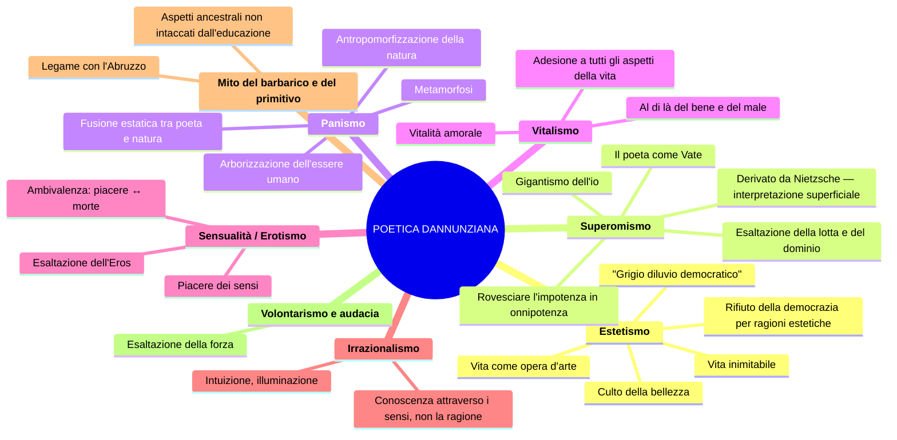
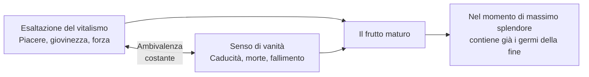
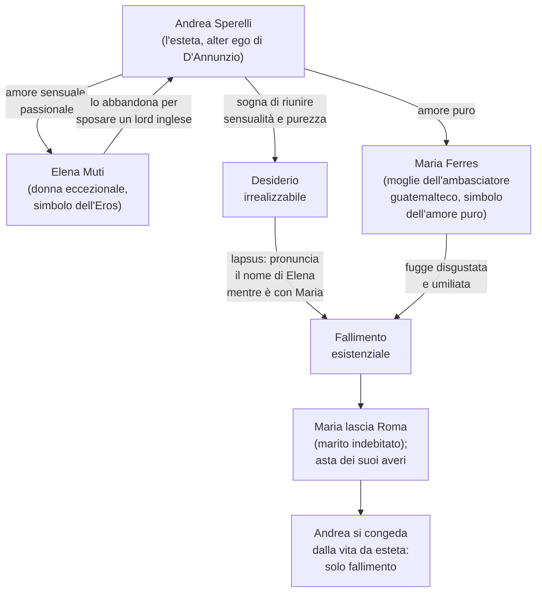
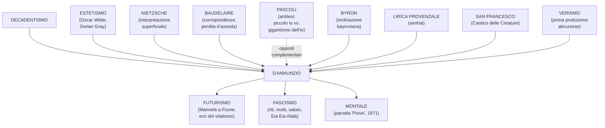

# MEGA-SCHEMA: Gabriele D'Annunzio

> **Fonti**: Lezioni del 03/03/26, 05/03/26, 09/03/26, 10/03/26, 12/03/26, 16/03/26, 17/03/26
> **Docente**: Prof.ssa di Italiano
> **Finalità**: Preparazione esame di maturità — Lingua e Letteratura Italiana

---

## Indice

1. [Biografia](#1-biografia)
2. [La poetica composita](#2-la-poetica-composita)
3. [Il Vittoriale degli Italiani](#3-il-vittoriale-degli-italiani)
4. [D'Annunzio prosatore — I romanzi](#4-dannunzio-prosatore--i-romanzi)
5. [D'Annunzio poeta — Le Laudi e Alcyone](#5-dannunzio-poeta--le-laudi-e-alcyone)
6. [Analisi testi poetici](#6-analisi-testi-poetici)
7. [D'Annunzio e il contesto storico-culturale](#7-dannunzio-e-il-contesto-storico-culturale)
8. [Confronti e collegamenti](#8-confronti-e-collegamenti)
9. [Q&A — Domande reali dalle interrogazioni](#9-qa--domande-reali-dalle-interrogazioni)
10. [Lacune esplicite e compiti assegnati](#10-lacune-esplicite-e-compiti-assegnati)

---

## 1. Biografia

### 1.1 Timeline biografica

```mermaid
timeline
    title Vita di Gabriele D'Annunzio (1863–1938)
    section Giovinezza
        1863 : Nasce a Pescara, Abruzzo
        1874 : Studi liceali al Liceo Cicognini di Prato
        1879 : Pubblica "Primo vere" (prima raccolta poetica)
    section Periodo romano (1881–1891)
        1881 : Si trasferisce a Roma, si iscrive a Lettere e Filosofia
        1883 : Sposa la duchessina Maria Hardouin di Gallese (fuga d'amore a Firenze)
             : Pubblica su "Cronaca Bizantina" e "La Tribuna"
        1889 : Pubblica "Il Piacere" (romanzo)
    section Periodo napoletano e toscano
        1891 : Pubblica "L'Innocente", "Elegie romane"
             : Relazione con la principessa Maria Gravina
        1894 : Primo incontro con Eleonora Duse a Venezia
        1897 : Si ritira alla Capponcina (villa toscana vicino Firenze)
        1900 : Pubblica "Il Fuoco" (romanzo)
        1903 : Pubblica "Alcyone" (terzo libro delle Laudi)
        1904 : "La figlia di Iorio" (opera teatrale)
    section Esilio francese (1910–1915)
        1910 : Fugge a Parigi per sfuggire ai creditori
             : Collabora con Debussy per "Le Martyre de Saint Sébastien"
        1914 : Scrive didascalie per "Cabiria" (cinema)
    section La Grande Guerra
        1915 : Rientra in Italia, si schiera con gli interventisti
             : Discorsi infuocati a Roma, "Orazione per la Sagra dei Mille" a Quarto
        1916 : Ferito all'occhio destro in incidente aereo
             : Si definisce "l'Orbo Veggente", compone il "Notturno"
        1918 : Beffa di Buccari (febbraio), Volo su Vienna (agosto)
    section Dopoguerra e Fiume
        1919 : Conia l'espressione "vittoria mutilata"
             : 12 settembre — occupa Fiume con un gruppo di legionari
        1920 : Carta del Carnaro (con Alceste De Ambris)
             : "Natale di Sangue" (24 dicembre) — l'esercito italiano bombarda Fiume
    section Il Vittoriale (1921–1938)
        1921 : Si stabilisce a Gardone Riviera, Lago di Garda
        1922 : "Volo d'arcangelo" — cade da una finestra (13 agosto)
             : Marcia su Roma di Mussolini (ottobre)
        1937 : Nominato presidente dell'Accademia d'Italia
        1938 : Muore di emorragia cerebrale il 1° marzo, al tavolo da lavoro
```

### 1.2 Dati essenziali

| Dato | Dettaglio |
|------|-----------|
| **Nascita** | 1863, Pescara (Abruzzo) — borgo di ~4.000 abitanti, ex Regno delle Due Sicilie |
| **Aspetto fisico** | Alto 1,64 m; naso pronunciato, fronte alta, occhi grigi acuti, barba e baffetti biondi, colorito pallido |
| **Famiglia** | Padre: Francesco Paolo (rapporto conflittuale); Madre: Luisa de Benedictis; tre sorelle che lo trattano «come un principe» |
| **Eredità paterna** | «La potenza, l'impeto, la sensualità, la crudeltà, la prodigalità, l'amore dei cani e dei cavalli, quel bel profumo delle donne e dei frutti, il piacere dello sperpero» |
| **Liceo Cicognini** | Lo definì: «**Un gran serraglio di cani**, istituito per isterilire e inaridire le più fervide sementi» |
| **Morte** | 1° marzo 1938 — emorragia cerebrale, trovato col capo riverso sulla scrivania al Vittoriale |

### 1.3 Le relazioni sentimentali

| Donna | Periodo | Note della prof |
|-------|---------|-----------------|
| **Maria Hardouin di Gallese** | 1883– | Duchessina diciannovenne; fuga d'amore a Firenze organizzata ad arte con i giornali avvertiti da D'Annunzio; tre figli |
| **Principessa Maria Gravina** | ~1891 | Relazione durante il periodo napoletano; ha una figlia, Renata detta "Cicciuzza", che D'Annunzio ama molto — a differenza dei figli maschi |
| **Eleonora Duse** | 1894–~1904 | L'amore più celebre del vate; attrice drammatica di fama internazionale; D'Annunzio la chiamava "Ghisola" / "Anadiomene"; lei finanzia le sue opere teatrali, lui la ritrae umiliata ne *Il Fuoco*; lei brucia le lettere di lui; la Duse: «Ti perdono di avermi sfruttata, rovinata, umiliata. Ti perdono tutto, perché ho amato» |
| **Alessandra Starabba di Rudinì** | ~1904 | Causa della rottura con la Duse (la "forcina" nel letto); dopo D'Annunzio si chiude in convento |
| **Romaine Brooks** | ~1909 | Attrice americana, nota per «l'esibito lesbismo»; fattezze efebiche che ispirano *Le Martyre de Saint Sébastien* |
| **Luisa Baccara** | 1920–1938 | Pianista, compagna al Vittoriale |
| *Altre* | Al Vittoriale | Numerose amanti con nomi rinascimentali; governante Aélis sceglieva le "badantesse"; sessualità maniacale negli ultimi anni |

> [!WARNING] Commento della prof
> «Ragazze, non prendete esempio da questo.» (a proposito della Duse che perdona tutto)

### 1.4 D'Annunzio "primo influencer della storia"

La prof insiste molto su questo aspetto — D'Annunzio come **personaggio mediatico** ante litteram:

- **Detta le mode** e influenza i costumi della società italiana
- **Inventa nomi commerciali**: La Rinascente (grandi magazzini), penna **Aurora**, liquore **Aurum**, la parola **automobile** (declinata al femminile)
- **Sensibilità pubblicitaria**: viene pagato dalle aziende per "battezzare" i prodotti
- **Cinema**: scrive le didascalie per ***Cabiria*** (1914), colossal cinematografico — capisce le potenzialità della "settima arte" appena nata (1895)
- **Gossip**: dà notizie inventate pur di far parlare di sé — «un po' come Fabrizio Corona, ma un po' più colto il buon Gabriele» (cit. prof)
- **Sull'automobile**: «L'automobile è femminile. Questa ha la grazia, la snellezza, la vivacità di una seduttrice; ha inoltre una virtù ignota alle donne: la perfetta obbedienza.»

### 1.5 Le imprese belliche

#### Beffa di Buccari (10-11 febbraio 1918)

Tre motoscafi **MAS** penetrano nella baia di Buccari (costa croata). Lanciano sei siluri contro piroscafi austriaci — solo uno esplode (navi protette da reti anti-siluranti). D'Annunzio lascia **tre bottigliette** con messaggi su nastro tricolore:

> «Contro la cautissima flotta austriaca [...] sono venuti col ferro e col fuoco a scuotere la prudenza nel suo più comodo rifugio i marinai d'Italia, che si ridono di ogni sorte di reti e di sbarre, pronti sempre a **osare l'inosabile**.»

**MAS** = acronimo di **"Memento Audere Semper"** = *Ricorda di osare sempre*. La prof sottolinea: «poi la Decima MAS era un battaglione fascista — questi motti sono ripresi dal fascismo».

#### Volo su Vienna (9 agosto 1918)

- 11 aerei partono dal campo di San Pelagio (Padova)
- Solo 7 raggiungono Vienna
- D'Annunzio sgancia **390.000 volantini** in italiano e tedesco
- «Irrilevante dal punto di vista militare, ma di enormi conseguenze morali» — finisce sulle prime pagine di tutti i giornali del mondo

#### Presa di Fiume (12 settembre 1919)

- D'Annunzio alla testa di un gruppo di legionari occupa la città
- Fonda la **Reggenza Italiana del Carnaro** con la **Carta del Carnaro** (scritta con Alceste De Ambris)
- Partecipano anche i **futuristi** (Marinetti tra i primi a raggiungere Fiume)
- «Ha rischiato veramente di far scoppiare di nuovo un altro conflitto mondiale» (cit. prof)
- Finisce col **Natale di Sangue** (24 dicembre 1920): dalla nave Andrea Doria parte un colpo di cannone che colpisce la residenza del poeta; ~50 vittime

### 1.6 Rapporti con Mussolini e il fascismo

> **Mussolini su D'Annunzio**: «D'Annunzio è come un **dente guasto**: o lo si estirpa o lo si copre d'oro.»

| Aspetto | Dettaglio |
|---------|-----------|
| **Posizione politica** | Prima nella **Destra**, poi con un voltafaccia («Vado verso la vita») passa alla **Sinistra** |
| **Il fascismo attinge da D'Annunzio** | Riti, miti, motti ("Eia Eia Alalà", "Memento Audere Semper"), saluto fascista — tutta la componente teatrale e rituale |
| **Rapporto ambiguo** | D'Annunzio accetta le gratificazioni del regime (presidente dell'Accademia d'Italia, 1937) ma mantiene atteggiamento distaccato; non condivide la conciliazione né l'alleanza con la Germania |
| **Relegato al Vittoriale** | Il fascismo lo relega a uno «splendido isolamento»; lo fa sorvegliare dall'emissario Antonio Rizzo |
| **Volo d'arcangelo** (1922) | Cade da una finestra poco prima di un incontro che avrebbe riunito Nitti e Mussolini — ipotesi: incidente causato da gelosia (Jolanda/Luisa Baccara) |

### 1.7 Gli ultimi anni

- **Cocaina** ("la polvere folle"): tossicodipendente dopo Fiume
- Sessualità maniacale; feticismo di giovinezza
- Deperimento fisico; isolamento nella Prioria
- Scrive il *Libro segreto* — «il suo unico vero amaro tentativo autobiografico»
- Ultime parole scritte: «Ora che so al fine quale sia la vera essenza dell'arte, ora che io posseggo la compiuta maestria, ora non ho se non il mattino di domani per esprimermi.»

---

## 2. La poetica composita

### 2.1 Mappa della poetica

### 2.2 L'estetismo

> **Definizione della prof**: «Corrente di gusto che riconosce l'equazione **vita = opera d'arte**»

**Come si realizza l'equivalenza vita–opera d'arte?**

1. **Rifiuto della democrazia** per motivi di ordine estetico: la democrazia sommerge le cose belle
2. **Ideale aristocratico, elitario** — non democratico
3. **Esaltazione del piacere** sensuale — la bellezza che si ricava dai sensi
4. **Vivere inimitabile** — vita fuori dal comune, lontana dalla quotidianità e dalla monotonia
5. **Attivismo politico**: teorizza il diritto di dominio dell'aristocrazia sul **grigiore borghese**

> La prof: «La borghesia è sinonimo di democrazia, di uguaglianza. D'Annunzio la disprezza perché l'uomo comune distrugge le cose belle, non è all'altezza rispetto a un ideale aristocratico, elitario, dei pochi che sanno apprezzare e produrre bellezza.»

### 2.3 Il superomismo

- Derivato dalla lettura di **Nietzsche**, di cui D'Annunzio dà un'**interpretazione piuttosto superficiale**
- La prof avverte: «Quando studierete Nietzsche vi accorgerete che la figura dell'oltreuomo è più complessa di questa interpretazione»
- Il poeta è un **superuomo** che si erge al di sopra dell'uomo comune
- Ha il compito di **rivelare alle folle il vero significato dell'esistenza**
- Deve **rovesciare l'impotenza in onnipotenza** attraverso l'esaltazione della lotta e del dominio

> **"L'Orbo Veggente"**: ossimoro autoattribuito dopo la ferita all'occhio — «pur ferito, conserva la capacità di vedere ciò che gli altri non vedono» → esprime il suo superomismo

### 2.4 Il panismo

> **Definizione**: dal greco *pas, pasa, pan* = "tutto" (come in Pangea, panteismo, pangermanesimo)

**Panismo** = **fusione estatica tra il poeta e la natura**, che si manifesta in un processo di **metamorfosi**:

| Processo | Significato | Esempio |
|----------|-------------|---------|
| **Arborizzazione dell'essere umano** | L'uomo/la donna si trasforma in albero/pianta | «Par da scorza tu esca» (*La pioggia nel pineto*) |
| **Antropomorfizzazione della natura** | La natura assume tratti umani | Le gocce di pioggia come «innumerevoli dita» che suonano strumenti diversi |

> **Tre parole-chiave** (la prof insiste): **metamorfosi**, **arborizzazione dell'essere umano**, **antropomorfizzazione della natura**

### 2.5 Il gigantismo dell'io vs. il piccolo io pascoliano

La prof cita il critico **Sant'Agata**:

| | Pascoli | D'Annunzio |
|---|---------|------------|
| **Definizione di Sant'Agata** | "Un piccolo io" | "Il **gigantismo dell'io**" |
| **Il poeta è...** | Il fanciullino — voce ingenua, pura, innocente | Il Vate — superuomo che vive esperienze fuori dal comune |
| **Rispetto all'Eros** | Escluso (es. *Gelsomino notturno*) | Protagonista — si congiunge con l'Estate personificata (*Stabat nuda Aestas*) |
| **Tono** | Intimo, malinconico, dimesso | Magniloquente, sensuale, celebrativo |

### 2.6 L'ambivalenza fondamentale

La prof sottolinea più volte una **tensione irrisolta** in tutta l'opera dannunziana:

> «Molto spesso la poesia dannunziana presenta questa ambivalenza: da una parte l'esaltazione del piacere nel momento in cui il frutto è più maturo, ma proprio in quel momento il frutto maturo contiene già i germi che lo porteranno alla fine.»

Esempi:
- *Canta la gioia*: «ogni fuggevole forma, ogni grazia caduca, ogni apparenza nell'ora breve»
- *La pioggia nel pineto*: «la favola bella che ieri t'illuse, che oggi m'illude»
- *Il Piacere*: l'esteta Andrea Sperelli finisce nel fallimento esistenziale
- La Roma **barocca**: massimo splendore artistico che prelude alla **decadenza**

### 2.7 Poesia di secondo grado

> «La **poesia dannunziana è poesia di secondo grado**, cioè è letteratura fatta di altra letteratura, che si nutre di altra letteratura attraverso citazioni, scelte stilistiche, recuperi, rielaborazioni.»

Esempi di recuperi:
- **Senhal** dalla lirica provenzale (*Canta la gioia*: l'amata chiamata "Ospite")
- **Laudata sii** dal *Cantico delle Creature* di San Francesco (*La sera fiesolana*)
- Reminiscenze **leopardiane** ne *La sera fiesolana* (il contadino che s'attarda)
- Riferimenti a **Byron**, al mondo **classico**, alla mitologia greca

---

## 3. Il Vittoriale degli Italiani

### 3.1 Informazioni generali

| Dato | Dettaglio |
|------|-----------|
| **Ubicazione** | Gardone Riviera, Lago di Garda (riva bresciana) |
| **Periodo** | 1921–1938 |
| **Origine** | Vecchia cascina di campagna settecentesca, affitto iniziale di 600 lire/mese |
| **Dimensioni finali** | Quasi 10 ettari, 6.000 m² coperti |
| **Architetto** | Gian Carlo Maroni («maestro delle pietre vive») — sepolto nel mausoleo insieme a D'Annunzio |
| **Oggi** | Monumento nazionale, museo visitabile, anfiteatro per concerti estivi |

### 3.2 Le stanze principali

> D'Annunzio sulla sua casa: «Non soltanto ogni stanza da me studiosamente composta, ma ogni oggetto da me scelto e raccolto fu sempre per me un modo di espressione, fu sempre per me un modo di rivelazione spirituale, come uno dei miei poemi.»

| Stanza | Caratteristiche |
|--------|----------------|
| **Vestibolo** | Ingresso con colonna di marmo sormontata da cesta di **melograne** — simbolo di fecondità e sensualità |
| **Stanza del Mascheraio** | *Horror vacui*: tendaggi, arazzi, tappeti — nessun centimetro libero; accostamento **kitsch** di pezzi pregiati e di scarso valore. Specchio con scritta per Mussolini: «Ricordati che tu sei vetro e contro l'acciaio» |
| **Lo Studiolo** | Soffitto basso, luogo di raccoglimento per scrivere; sulla porta la **mano del monco** in gesso (= D'Annunzio risponde solo a chi vuole) |
| **Sala del Mappamondo** | Biblioteca con organo, mappamondo, galeone veneziano, busti di Dante e altri scrittori |
| **L'Officina** | Lo studio dove lavorava — «il cuore del Vittoriale»; dizionari, enciclopedie, strumenti di lavoro |
| **Stanza della Cheli** | Sala da pranzo con smalti dai colori forti; sulla tavola la **Cheli** — tartaruga in bronzo (morta per indigestione → monito per gli ospiti a essere parsimoniosi) |
| **Stanza del Lebroso / Zambra del Misello** | Luogo di raccoglimento e preghiera; San Sebastiano, letto monacale — commistione sacro/profano (il sacro recuperato per il suo valore **estetico**, non religioso) |
| **Bagno Blu** | ~900 oggetti disseminati; tappeto persiano usato per l'elioterapia — «prendeva il sole nudo su un tappeto persiano sulle rive del lago» |

### 3.3 Il giardino e i cimeli

- **Anfiteatro** — segue l'andamento naturale del terreno, affacciato sul Lago di Garda
- **Levrieri** sepolti in varie aree del giardino
- **Aeroplano** del volo su Vienna
- **MAS** della Beffa di Buccari
- **Nave Puglia** — la prora incastonata su un poggio
- **Area mausoleo** — sepoltura di D'Annunzio e dell'architetto Maroni

> La prof: «Se non ci siete mai andati, andateci perché è una gita bellissima. È sul Lago di Garda, quindi anche dal punto di vista del paesaggio è bellissimo.»

---

## 4. D'Annunzio prosatore — I romanzi

### 4.1 Le fasi della narrativa dannunziana

| Fase | Opera/e chiave | Caratteristiche |
|------|---------------|-----------------|
| **Fase verista** | *Novelle della Pescara* | Legame col Verismo; gusto per il primitivo, il barbarico; terra aspra dell'Abruzzo |
| **Fase dell'estetismo** | ***Il Piacere*** (1889) | Andrea Sperelli = alter ego di D'Annunzio = l'esteta per eccellenza; la vita come opera d'arte |
| **Fase della bontà** | *Giovanni Episcopo*, *L'Innocente* | (studiare titoli e ragione della definizione dal libro) |
| **Fase superomistica** | ***Le vergini delle rocce***, ***Il Fuoco*** | Superomismo in prosa |
| **Fase intima** | ***Notturno*** | Riflessioni su vita, morte, amore, bellezza — scritto su striscioline di carta durante la convalescenza per l'occhio ferito |

> **Compito della prof**: «Le pagine sono 402-407 del libro; studiare le fasi come le presenta il libro»

### 4.2 *Il Piacere* (1889) — Analisi approfondita

#### Trama

La vicenda è «estremamente esile» — un **intreccio amoroso**:

#### Lo sfondo: Roma barocca

Non la Roma dei Cesari (fori imperiali, Colosseo), ma la **Roma dei Papi** — la Roma **barocca** del Seicento:

> «Egli avrebbe dato tutto il Colosseo per la Villa Medici, il Campo Vaccino per la Piazza di Spagna, l'Arco di Tito per la fontanella delle Tartarughe.»

**Perché il Barocco?** Perché è identificato con l'epoca di maggiore **splendore** artistico (ricchezza di ornamenti), che però prelude alla **decadenza** → stessa ambivalenza di tutta l'opera dannunziana.

#### Analisi del ritratto di Andrea Sperelli (pp. 408+)

**Verso per verso / passo per passo:**

| Passo | Testo | Commento della prof |
|-------|-------|---------------------|
| Presentazione | «Il conte Andrea Sperelli Fieschi d'Ugenta, unico erede» | Già il nome dice: siamo di fronte a un **nobile** |
| Stirpe | «l'ideal tipo del giovine signore italiano [...] l'ultimo discendente d'una razza intellettuale» | Appartiene **geneticamente** a una stirpe eccezionale di intellettuali e artisti |
| Educazione | «nutrita di studii varii e profondi, parve prodigiosa [...] senza restrizioni e costrizioni di pedagoghi» | Educazione esclusiva: cresce con il padre, senza educazione tradizionale (che porta all'**omologazione** e all'indifferenza per il bello) |
| Il padre | «il gusto delle cose d'arte, il culto passionato della bellezza, il paradossale disprezzo de' pregiudizi, l'avidità del piacere» | Qui c'è **tutto** Andrea Sperelli |
| Il padre (2) | «una scienza profonda della vita voluttuosa [...] e insieme una certa inclinazione bayroniana al romanticismo fantastico» | Duplice tendenza: soddisfacimento dei piaceri + vagheggiamento estetico |
| Educazione viva | «fatta non tanto sui libri quanto in cospetto delle realtà umane» | Esperienza diretta del mondo |
| La distruzione morale | «l'espansione di quella sua forza era la distruzione in lui di un'altra forza: della forza morale» | **Altra faccia della medaglia**: la ricerca del piacere distrugge il discernimento morale |
| Sazietà | «la sua vita era la riduzion progressiva delle sue facoltà [...] il circolo gli si restringeva sempre più» | Lo sperimentare porta a una **sazietà** dei piaceri |
| **MASSIMA FONDAMENTALE** | «**Bisogna fare la propria vita come si fa un'opera d'arte**» | Principio dell'esteta — da sottolineare |
| Superiorità | «La superiorità vera è tutta qui» | Tensione verso il **superomismo** |
| *Habere non haberi* | Possedere, non essere posseduti | Non lasciarsi possedere dalle convenzioni, dal conformismo, dall'omologazione |
| Il rimpianto | «il rimpianto è il vano pascolo d'uno spirito disoccupato» | Chi vive appieno non rimugina sul passato |
| Il sofisma | «Un altro seme paterno aveva perfidamente fruttificato: il seme del **sofisma**» | Gusto per la parola vuota — D'Annunzio apprezza l'uso della parola al punto di **autoingannarsi** |
| L'autoinganno | «la menzogna non tanto verso gli altri quanto verso se stesso divenne un abito» | Andrea si autoinganna sulla propria felicità, sul godimento del piacere, sulla propria eccezionalità |

#### Il linguaggio de *Il Piacere*

La prof chiede: «Siamo nello stesso anno di *Mastro-don Gesualdo* (1889). Vi sembra vicina o distante la lingua di Verga?»

| Caratteristica | Dettaglio |
|---------------|-----------|
| **Linguaggio forbito, raffinato, aulico** | Termini ricercati, scelti per la loro musicalità |
| **Andamento sintattico elegante** | Alternanza di ipotassi e paratassi |
| **Prosa erudita** | Riferimenti continui ad arte, storia, storia dell'arte |
| **In linea con i contenuti** | Il linguaggio rispecchia il mondo di cui parla |

---

## 5. D'Annunzio poeta — Le Laudi e Alcyone

### 5.1 Struttura

Le **Laudi** sono una grande raccolta poetica. Il terzo libro si intitola **Alcyone** (1903) — è la raccolta poetica più celebre e importante di D'Annunzio. Risale al periodo toscano della Capponcina, con la Duse.

### 5.2 Testi analizzati in classe

| Testo | Raccolta | Situazione | Temi principali |
|-------|----------|------------|-----------------|
| **Canta la gioia** | *Canto Novo* (prima produzione) | Invocazione alla gioia e all'amata ("Ospite") | Vitalismo, edonismo, esaltazione dei sensi, senhal, ambivalenza gioia/morte |
| **La pioggia nel pineto** | *Alcyone* (1903) | Passeggiata nella pineta versiliese con Ermione (= Duse) sotto la pioggia | Panismo, metamorfosi, musicalità, fonosimbolismo — la lirica **più celebre** |
| **Stabat nuda Aestas** | *Alcyone* (1903) | L'io lirico insegue l'Estate personificata in una "caccia amorosa" | Gigantismo dell'io, erotismo, sensualità, antropomorfizzazione |
| **La sera fiesolana** | *Alcyone* (1903) | Sera nella campagna toscana (Fiesole); libero affiorare di immagini senza nucleo narrativo | Panismo, smaterializzazione, lauda francescana, sinestesia, reminiscenze leopardiane |

### 5.3 Caratteristiche stilistiche della poesia dannunziana

| Elemento | Descrizione |
|----------|-------------|
| **Fonosimbolismo** | Il significante assume un significato autonomo |
| **Musicalità** | Allitterazioni, assonanze, consonanze, rime interne |
| **Onomatopea** | "Crepitìo", "crosciare", "bruiva" |
| **Linguaggio aulico** | Termini ricercati: "aulenti" (profumate), "estuava" (ribolliva), "virente" (verdeggiante), "cerule" (azzurre), "fulvi" (rossastri) |
| **Termini botanici** | Tamerici, mirti, ginepri, ginestre, gelsi, leandri, olmi |
| **Gusto per l'elencazione** | Polisindeto frequente |
| **Ipotassi raffinata** | Periodi lunghissimi (es. 14 versi = 1 periodo ne *La sera fiesolana*) |
| **Poesia di secondo grado** | Citazioni, recuperi dalla tradizione (lirica provenzale, San Francesco, Leopardi, Baudelaire) |

---

## 6. Analisi testi poetici

### 6.1 *Canta la gioia* (da *Canto Novo*)

#### Testo integrale

> Io voglio cingerti di tutti i fiori
> perché tu celebri la gioia, la gioia, la gioia,
> questa magnifica donatrice.
>
> **Canta l'immensa gioia di vivere**,
> d'esser forte, d'esser giovane,
> di mordere i frutti terrestri
> con saldi e bianchi denti voraci,
> di porre le mani audaci e cupide
> su ogni dolce cosa tangibile,
> di tender l'arco su ogni preda novella
> che il desio miri,
> e di ascoltar tutte le musiche,
> e di guardar con occhi fiammei
> il volto divino del mondo,
> come l'amante guarda l'amata,
> e di adorare ogni fuggevole forma,
> ogni segno vago, ogni immagine vanante,
> ogni grazia caduca,
> ogni apparenza nell'ora breve.
>
> Canta la gioia! Lungi dall'anima nostra
> il dolore, veste cineria.
> È un misero schiavo colui
> che del dolore fa sua veste.
>
> A te la gioia, ospite,
> io voglio vestirti della più rossa porpora
> s'io debba pur tingere il tuo bisso
> nel sangue delle mie vene.
>
> Di tutti i fiori io voglio cingerti
> trasfigurata,
> perché tu celebri la gioia, la gioia, la gioia,
> questa invincibile creatrice.

#### Analisi verso per verso

| Versi | Testo | Analisi della prof |
|-------|-------|---------------------|
| 1-3 | «Io voglio cingerti di tutti i fiori / perché tu celebri la gioia» | **Apostrofe** iniziale. Il "tu" = potrebbe essere la gioia stessa oppure **l'amata**. L'immagine dei fiori rimanda a primavera, rinascita, esaltazione dei sensi |
| 4-5 | «Canta l'immensa gioia di vivere / d'esser forte, d'esser giovane» | **Ideale estetico** di D'Annunzio: gioia di vivere, forza, giovinezza — «i deboli risultano peso morto» |
| 6-7 | «di mordere i frutti terrestri / con saldi e bianchi denti voraci» | Immagine sensuale di **vitalismo** — dimensione erotica, «addentare i frutti con denti affamati» |
| 8-9 | «di porre le mani audaci e cupide / su ogni dolce cosa tangibile» | Esaltazione del **tatto**, del possedere ciò che si desidera |
| 10-11 | «di tender l'arco su ogni preda novella / che il desio miri» | **Caccia amorosa** — sensualità mescolata ad aggressività |
| 12 | «e di ascoltar tutte le musiche» | Esaltazione dell'**udito** |
| 13-15 | «e di guardar con occhi fiammei / il volto divino del mondo / come l'amante guarda l'amata» | «Il volto divino del mondo»: la **vita terrestre come una divinità** da ammirare |
| 16-18 | «ogni fuggevole forma / ogni segno vago, ogni immagine vanante / ogni grazia caduca, ogni apparenza nell'ora breve» | Qui si **incrina** qualcosa: riflessione indiretta sulla **brevità della vita**, sul tempo, sulla morte. L'**ambivalenza** tipica |
| 19-20 | «Lungi dall'anima nostra / il dolore, veste cineria» | Alle immagini visivamente accese (fiori, occhi fiammei) si oppone la **veste grigia del dolore** |
| 21-22 | «È un misero schiavo colui / che del dolore fa sua veste» | Celebrazione della **forza**, **coraggio**, **audacia**; condanna di chi si abbandona al dolore → **volontà di potenza** |
| 23 | «A te la gioia, ospite» | **"Ospite"** = **senhal** (dalla lirica provenzale) — espediente per non rivelare l'identità dell'amata. D'Annunzio lo recupera con **gusto arcaizzante** |
| 24-26 | «io voglio vestirti della più rossa porpora / s'io debba pur tingere il tuo bisso / nel sangue delle mie vene» | Rosso = colore della **passione**, del sangue, della sofferenza. «A costo di tingere il lino del tuo vestito nel sangue delle mie vene» — immagine potente |
| 27-31 | «Di tutti i fiori io voglio cingerti / trasfigurata [...] questa invincibile creatrice» | **Trasfigurata** = dimensione non più terrena ma divina. Da "magnifica donatrice" a "**invincibile creatrice**" — crescendo |

### 6.2 *La pioggia nel pineto* (da *Alcyone*, 1903)

#### Informazioni generali

- **La lirica più celebre di D'Annunzio**, la più nota
- Fa parte di **Alcyone**, terzo libro delle **Laudi** (1902-1903)
- Situazione: vagare dell'io lirico senza meta con la donna amata — **Ermione** (trasfigurazione mitologica di Eleonora Duse)
- Ambientazione: pineta della **Versilia**, estate
- «Anche Jovanotti ha fatto una sua "Piove" che omaggia il ritmo della poesia dannunziana» (cit. prof)
- **Montale** nel 1971 scrive una **parodia** intitolata *Piove* (condivisa su Classroom)

#### Struttura e caratteristiche

| Aspetto | Dettaglio |
|---------|-----------|
| **Trama musicale** | Tutto il componimento è costituito dalla trama musicale del ritmo della pioggia che cade incessante |
| **Obiettivo ritmico** | D'Annunzio mira a **riprodurre il rumore della pioggia** attraverso il ritmo, gli accenti tonici, le parole |
| **Fase poetica** | **Superomistica** — l'io lirico con la donna vive un'esperienza fuori dal comune |
| **Metamorfosi** | Esempio supremo di **panismo**: antropomorfizzazione della natura + arborizzazione della donna |
| **Stile** | Fonosimbolismo, musicalità (allitterazioni, assonanze, consonanze, rime interne), onomatopee |

#### Testo e analisi verso per verso

##### STROFA I

> **Taci.** Su le soglie del bosco non odo parole che dici umane; ma odo parole più nuove che parlano gocciole e foglie lontane. Ascolta. Piove dalle nuvole sparse. Piove su le tamerici salmastre ed arse, piove su i pini scagliosi ed irti, piove su i mirti divini, su le ginestre fulgenti di fiori accolti, su i ginepri folti di coccole aulenti, piove su i nostri vòlti silvani, piove su le nostre mani ignude, su i nostri vestimenti leggieri, su i freschi pensieri che l'anima schiude novella, su la favola bella che ieri t'illuse, che oggi m'illude, o Ermione.

| Verso/Passo | Analisi della prof |
|-------------|---------------------|
| **«Taci»** | **Apostrofe** d'apertura. Rivolto ad **Ermione** e anche al lettore, che viene «assorbito» nella situazione |
| «non odo parole che dici umane» | Primo elemento sensoriale: l'**udito**. Dimensione di silenzio, estraniamento, sospensione |
| «ma odo parole più nuove / che parlano gocciole e foglie» | «Parlano» usato in senso transitivo (licenza poetica) = "pronunciano", "sussurrano". A parlare non sono presenze umane ma **foglie e gocce** |
| **«lontane»** | Parola-verso isolata → senso di **indeterminato, vago, indefinito** |
| **«Ascolta»** | Dopo l'invito al silenzio, invito a prestare attenzione |
| «Piove dalle nuvole sparse» | Ripresa insistente di «piove» → trama musicale, tessitura fonetica |
| «tamerici salmastre ed arse» | **Tamerici** = arbusti sulle dune sabbiose (→ *Myricae* di Pascoli!). **Allitterazione della S**. "Salmastre" = impregnate di sale marino; "arse" = secche, bruciate dal sole |
| «pini scagliosi ed irti» | Scorze ruvide ("scagliosi") e foglie aghiformi ("irti") |
| «mirti **divini**» | Il mirto è pianta **sacra a Venere** (dea della passione e dell'amore) |
| «ginestre **fulgenti**» | Fulgenti = splendenti (da fulgore = luce improvvisa) |
| «coccole **aulenti**» | Coccole = bacche; aulenti = **profumate** |
| «i nostri vòlti **silvani**» | Da *silva* (lat.) = selva, bosco → i volti **del bosco**: inizia il processo di **metamorfosi** |
| «le nostre mani **ignude** [...] vestimenti **leggieri**» | Dimensione dell'**Eros**, della passione |
| «i **freschi** pensieri» | **Sinestesia**: aggettivo sensoriale (tattile) applicato a concetto astratto |
| «la **favola bella** che ieri t'illuse, che oggi m'illude» | La favola bella = **l'amore**, l'illusione amorosa tra i due — fatta di illusioni |

##### STROFA II

> Odi? La pioggia cade su la solitaria verdura con un crepitìo che dura e varia nell'aria secondo le fronde più rade, men rade. Ascolta. Risponde al pianto il canto delle cicale che il pianto australe non impaura, né il ciel cinerino. E il pino ha un suono, e il mirto altro suono, e il ginepro altro ancóra, strumenti diversi sotto innumerevoli dita. E immersi noi siam nello spirto silvestre, d'arborea vita viventi; e il tuo volto ebro è molle di pioggia come una foglia, e le tue chiome auliscono come le chiare ginestre, o creatura terrestre che hai nome Ermione.

| Verso/Passo | Analisi della prof |
|-------------|---------------------|
| **«Odi?»** | Sfera sensoriale uditiva, stavolta in forma **interrogativa** |
| «verdura» | = **vegetazione** |
| «**crepitìo**» | **Onomatopea** — il suono della pioggia |
| «che dura e varia nell'aria / secondo le fronde più rade, men rade» | Il crepitio cambia a seconda che la pioggia cada sulla vegetazione più folta o meno folta — D'Annunzio registra tutte le **oscillazioni sonore** |
| «Risponde al **pianto** il **canto** delle cicale» | "Pianto" = la pioggia |
| «il pianto **australe**» | La pioggia portata dall'**austro** (il vento) |
| «E il pino ha un suono, **e** il mirto altro suono, **e** il ginepro altro ancora» | **Polisindeto** (e, e, e) |
| «strumenti diversi sotto **innumerevoli dita**» | Le gocce di pioggia = **dita** che suonano strumenti diversi → **antropomorfizzazione della natura** |
| «**immersi** noi siam nello **spirto silvestre**» | L'io lirico e la donna partecipano della più intima sostanza della natura |
| «d'**arborea vita** viventi» | **Arborizzazione** dell'io lirico e della donna amata — «vivono lo spirito boschivo» |
| «il tuo volto **ebro**» | Inebriato, in una sorta di **estasi** |
| «è molle di pioggia **come una foglia**» | **Similitudine** — dimensione sensuale |
| «le tue chiome **auliscono**» | = profumano (da "aulenti") |
| «o **creatura terrestre** che hai nome Ermione» | "Terrestre" = nata dalla terra, al pari di una pianta |

##### STROFA III

> Ascolta, ascolta. L'accordo delle aeree cicale a poco a poco più sordo si fa sotto il pianto che cresce; ma un canto vi si mesce più roco che di laggiù sale, dall'umida ombra remota. Più sordo e più fioco s'allenta, si spegne. Sola una nota ancor trema, si spegne, risorge, trema, si spegne. Non s'ode voce del mare. Or s'ode su tutta la fronda crosciare l'argentea pioggia che monda, il croscio che varia secondo la fronda più folta, men folta. Ascolta. La figlia dell'aria è muta; ma la figlia del limo lontana, la rana, canta nell'ombra più fonda, chi sa dove, chi sa dove! E piove su le tue ciglia, Ermione.

| Verso/Passo | Analisi della prof |
|-------------|---------------------|
| «**aeree** cicale» | Immagine di **leggerezza** bellissima — il suono viene dall'alto |
| «più **sordo** si fa» | Aggettivo che dal punto di vista fonetico riproduce un **suono ovattato** → **perfetta corrispondenza significante-significato** |
| «un canto vi si mesce più **roco**» | Al canto ovattato delle cicale si mescola quello più roco della rana, da uno stagno nell'oscurità |
| «s'allenta, si spegne [...] trema, si spegne» | Progressivo spegnimento del suono |
| «Non s'ode **voce** del mare» | Il mare è **personificato** — ha una "voce" → antropomorfizzazione |
| «**crosciare** l'argentea pioggia» | **Crosciare** = verbo **onomatopeico** |
| «l'**argentea** pioggia che **monda**» | Argentea = argentina, cristallina (riferito sia al **colore** trasparente della pioggia sia al **suono** cristallino). "Monda" = **purifica** — come un rito mistico |
| «crosciare / croscio» | **Poliptoto** |
| «La **figlia dell'aria** è muta» | Bellissima **metafora**: la figlia dell'aria = la **cicala** |
| «la **figlia del limo** [...] la rana» | La figlia del fango = la **rana** |
| «chi sa dove, chi sa dove» | Favolosa lontananza, indeterminatezza |

##### STROFA IV

> Piove su le tue ciglia nere sì che par tu pianga ma di piacere; non bianca ma quasi fatta virente, par da scorza tu esca. E tutta la vita è in noi fresca aulente, il cuor nel petto è come pesca intatta, tra le palpebre gli occhi son come polle tra l'erbe, i denti negli alveoli son come mandorle acerbe. E andiam di fratta in fratta, or congiunti or disciolti (e il verde vigor rude ci allaccia i malleoli c'intrica i ginocchi) chi sa dove, chi sa dove! E piove su i nostri vòlti silvani, piove su le nostre mani ignude, su i nostri vestimenti leggieri, su i freschi pensieri che l'anima schiude novella, su la favola bella che ieri m'illuse, che oggi t'illude, o Ermione.

| Verso/Passo | Analisi della prof |
|-------------|---------------------|
| «Piove su le tue ciglia **nere**» | Esaltazione della **vitalità**, della giovinezza |
| «par tu pianga ma di **piacere**» | **Estasi** — pianto di piacere |
| «non bianca ma quasi fatta **virente**» | Virente = **verdeggiante** come il bosco |
| «par da **scorza** tu esca» | Sembra uscire dalla **corteccia** degli alberi → **fusione panica** con la natura, arborizzazione di Ermione |
| | La prof fa il parallelo con **Apollo e Dafne** di Bernini — la metamorfosi di Dafne in alloro |
| «il cuor nel petto è come **pesca intatta**» | **Similitudine**: frutto = freschezza, vigore |
| «gli occhi son come **polle** tra l'erbe» | Polle = vene d'acqua sorgiva |
| «i denti [...] son come **mandorle acerbe**» | Mandorle acerbe = bianche → immagine sensuale |
| «di **fratta** in fratta» | Da cespuglio a cespuglio |
| «il **verde vigor** rude» | **Allitterazione** (v-v). Il verde vigor = gli intrecci della vegetazione |
| «ci allaccia i **malleoli**, c'intrica i ginocchi» | La vegetazione impedisce il movimento — malleoli = alle **caviglie** |
| «la favola bella che ieri **m'illuse**, che oggi **t'illude**» | Nota: il pronome si è **invertito** rispetto alla strofa I (là era «t'illuse / m'illude»). La fusione panica ha portato a uno scambio di identità |

### 6.3 *Stabat nuda Aestas* (da *Alcyone*, 1903)

#### Informazioni generali

- Titolo latino: «**L'estate giaceva nuda**» (la prof: *ae* si legge *e* in latino)
- *Aestas* con la maiuscola: è un nome proprio, l'Estate **personificata**, una sorta di divinità
- L'analisi dettagliata è nel saggio di **Sant'Agata** condiviso su WhatsApp (da studiare bene — ha confronto con Pascoli e riferimenti al mondo classico)
- Nella prova di verifica del libro: p. 423

#### Testo integrale

> Primamente intravidi il suo piè stretto
> scorrere su per gli aghi arsi dei pini
> ove esalava l'aere con grande
> tremito, quasi bianca vampa infusa.
> Le cicale si tacquero. Più rochi
> si fecero i ruscelli. Copiosa
> la resina gemette giù pei fusti.
> Riconobbi il colubro dal sentore.
>
> Nel bosco degli ulivi la raggiunsi.
> Scorsi l'ombre cerule dei rami
> su la schiena falcata; e i capei fulvi
> nell'argento palladio trasvolare
> senza suono. Più lunge nella stoppia
> l'allodola balzò dal solco raso.
> La chiamò per nome in cielo.
> Allora anch'io per nome la chiamai.
>
> Tra i leandri la vidi che si volse.
> Come in bronzo emessa nel falasco
> entrò, che rinchiudeasi strepitoso.
> Più lunge verso il lido tra la paglia
> marina il piede le si torse in fallo.
> Distesa cadde tra le sabbie e l'acque.
> Il Ponente schiumò ne' suoi capegli.
> Immensa apparve, immensa nudità.

#### Analisi verso per verso

| Verso | Testo | Analisi della prof |
|-------|-------|---------------------|
| 1-2 | «Primamente intravidi il suo **piè stretto** / scorrere su per gli **aghi arsi** dei pini» | Per prima cosa vede il piede sottile — **percorrere** i sentieri ricoperti di aghi secchi dei pini. Echi con *La pioggia nel pineto*: pineta, dimensione boschiva, aridità estiva |
| 3-4 | «ove **estuava** l'aere con grande / tremito, quasi bianca vampa infusa» | **Estuava** = verbo molto colto, da "estate" — l'aria **ribolliva**. Il "tremito" evoca il **tremolio dell'aria** nell'afa torrida (quando è impossibile mettere a fuoco). «L'aria ardeva tremando come una bianca fiamma diffusa» |
| 5 | «Le **cicale** si tacquero» | L'atmosfera è così afosa che **anche le cicale tacciono** (eco della *Pioggia*) |
| 6 | «Più **rochi** si fecero i ruscelli» | Dato **uditivo**: i ruscelli si fanno più silenziosi |
| 6-7 | «**Copiosa** la resina **gemette** giù pei fusti» | Abbondante la resina **stillò** per i tronchi — l'unico suono evocato |
| 8 | «Riconobbi il **colubro** dal **sentore**» | Colubro = serpente. Sentore = **odore** |
| | | **Sensi evocati nella prima strofa**: VISTA (vampa), UDITO (cicale, ruscelli, resina), OLFATTO (sentore) |
| 9 | «Nel **bosco degli ulivi** la raggiunsi» | Il bosco degli ulivi evoca il **Getsemani** (immagine sacra recuperata in chiave **estetica**, non religiosa) |
| 10 | «Scorsi l'ombre **cerule** dei rami / su la schiena **falcata**» | Cerule = azzurre; falcata = inarcata come una falce |
| 11-12 | «i capei **fulvi** / nell'**argento palladio** trasvolare» | Fulvi = tra il biondo e il rosso. Argento palladio = le foglie degli ulivi hanno un'**iridescenza grigia quasi metallica**; "palladio" = sacri ad **Atena/Pallade** → gli ulivi si caricano di **valore mitologico** |
| 12-13 | «senza suono» | Domina il **silenzio** — condizione che precede il disvelamento di un miracolo, un'apparizione → sospensione |
| 13-14 | «l'**allodola** balzò dal solco raso» | Il solco raso = il campo **falciato** |
| 15 | «La chiamò per nome in cielo» | La figura ha familiarità con le creature della natura |
| 16 | «Allora **anch'io** per nome la chiamai» | Interviene l'io lirico |
| 17 | «Tra i **leandri** la vidi che si volse» | Leandri = oleandri |
| 18-19 | «Come in bronzo emessa nel **falasco** / entrò, che rinchiudeasi **strepitoso**» | Falasco = canna palustre. Si rinchiudevano producendo un forte suono (canne secche → suono stridente) |
| 20-21 | «il piede le si **torse in fallo**» | Inciampò |
| 22 | «**Distesa** cadde tra le sabbie e l'acque» | Cadde distesa |
| 23 | «Il **Ponente** schiumò ne' suoi capegli» | Il vento di ponente impregnò di schiuma i capelli |
| 24 | «**Immensa** apparve, **immensa** nudità» | La figura femminile occupa tutto l'orizzonte — il congiungimento «non è esplicitato ma suggerito, lasciato intendere» |

> **Compito**: sottolineare tutti gli elementi che risuonano familiari rispetto a *La pioggia nel pineto* (cicale, resina, fusti, pineta, dimensione sensoriale...)

### 6.4 *La sera fiesolana* (da *Alcyone*, 1903)

#### Informazioni generali

| Aspetto | Dettaglio |
|---------|-----------|
| **Ambientazione** | Fiesole, campagna toscana |
| **Stagione** | **Primavera** (diversamente dalla *Pioggia nel pineto* = estate) |
| **Struttura** | Tre strofe + ritornello francescano |
| **Nucleo narrativo** | Non c'è un centro narrativo preciso — «libero affiorare di immagini paesaggistiche, di estasi amorosa e poetica» |
| **Donna amata** | Sempre suggerita come Eleonora Duse |

#### Strofa I — Analisi verso per verso

> Le mie parole siano per te nella sera
> fresche come il fruscio che fan le foglie
> del gelso nella man di chi le coglie
> silenzioso, e s'attarda all'opra lenta
> su l'alta scala che s'annera,
> contro il fusto che s'argenta
> con le sue rame spoglie
> mentre la Luna è prossima alle soglie
> cerule e par che innanzi a sé distenda un velo
> ove il nostro sogno si giace,
> e par che la campagna già si senta
> da lei sommersa nel notturno gelo
> e da lei beva la sperata pace
> senza vederla.

| Verso/Passo | Analisi della prof |
|-------------|---------------------|
| «Le mie parole [...] **fresche** come il fruscio» | **Sinestesia**: alle parole è associato l'aggettivo "fresche" (da sfera tattile ad astratto) |
| «fresche, fruscio, fan, foglie» | **Allitterazione** della F — tessitura fonica |
| «del **gelso** nella man di chi le coglie» | Le foglie del gelso diventano **fruscio** → un elemento concreto perde consistenza e diventa **sensazione** = **smaterializzazione** |
| «s'attarda all'**opra lenta** / su l'alta scala che s'annera» | Il contadino che s'attarda → **reminiscenza leopardiana** (cit. studente: *Il sabato del villaggio*) |
| «il fusto che **s'argenta**» | L'albero diventa color argento col calare delle tenebre |
| «il nostro **sogno** si giace» | Ricorda la «**favola bella**» della *Pioggia nel pineto* = illusione dell'amore |
| «la campagna [...] sommersa nel notturno gelo / da lei beva la **sperata pace**» | La pace desiderata dopo il giorno. Immagini eteree, sensuali |
| *Nota strutturale* | **14 versi = 1 unico periodo** → padronanza dell'**ipotassi** |
| *Tono* | Solo **suggestioni** paesaggistiche senza nucleo narrativo: passaggio giorno-sera, vita della campagna, calare della luna |

#### Ritornello (dopo strofa I)

> **Laudata sii per lo tuo viso di perla, o sera, e per i tuoi grandi umidi occhi ove si tace l'acqua del cielo.**

| Elemento | Analisi della prof |
|----------|---------------------|
| «**Laudata sii**» | Riferimento esplicito al **Cantico delle Creature** di San Francesco (1220, volgare umbro, primo testo della letteratura italiana, genere della **lauda**) |
| | Il recupero **non** avviene per il valore religioso, ma per il valore **estetico e musicale** |
| «**viso di perla**» | La sera **personificata** come figura femminile; "di perla" → luce pallida lunare |
| «**grandi umidi occhi** ove si tace l'acqua del cielo» | Occhi umidi = cielo carico di pioggia che però non si riversa. La sera = figura femminile carica di **sensualità** |
| | **Ribaltamento** rispetto a San Francesco: là lode al creatore, qui esaltazione estetica e sensuale |

#### Strofa II — Analisi

> Dolci le mie parole nella sera
> ti sien come la pioggia che bruiva,
> tepida e fuggitiva,
> commiato lagrimoso della primavera
> sui gelsi, sugli olmi e sulle viti
> e sui pini dai novelli rosei diti
> che giocano con l'aura che si perde
> e sul grano che non è biondo ancora
> e non è verde
> e sul fieno che già patì la falce
> e trascolora
> e sugli olivi, sui fratelli olivi
> che fan di santità pallidi i clivi
> e sorridenti.

| Verso/Passo | Analisi della prof |
|-------------|---------------------|
| «**Dolci** le mie parole» | Nella I strofa erano "fresche", ora "dolci" — variazione sensoriale |
| «la pioggia che **bruiva**» | **Bruiva** = francesismo / provenzalismo, dal verbo *bruire* = mormorare, crepitare → verbo **onomatopeico** |
| «tepida e **fuggitiva**» | Tepida e passeggera |
| «**commiato** lagrimoso della primavera» | Saluto alla primavera che cede il posto all'estate |
| «i pini dai novelli **rosei diti**» | I pini hanno nuove gemme come **dita rosee** → **antropomorfizzazione della natura** |
| «che giocano con l'**aura** che si perde» | Aura = brezza |
| «sul grano che **non è biondo ancora e non è verde**» | Non ancora maturo ma non più verde |
| «il fieno che già **patì la falce** / e **trascolora**» | Già falciato, ingiallisce, si secca |
| «i **fratelli olivi**» | Recupero dalla lauda francescana — «fratelli» è il modo di San Francesco |
| «che fan di santità **pallidi** i clivi» | Le foglie dell'ulivo hanno colore argenteo → fanno **impallidire** i colli verdi |
| «pallidi i clivi e sorridenti» | **Iperbato/anastrofe** — ordine inconsueto delle parole |
| **Polisindeto** | «e, e, e, e, e» — elencazione di tutti gli elementi della campagna |

#### Ritornello (dopo strofa II)

> **Laudata sii per le tue vesti aulenti, o sera, e pel cinto che ti cinge come il salce il fien che odora.**

| Elemento | Analisi |
|----------|---------|
| «vesti **aulenti**» | Profumate — aggettivo ricercato, già visto nella *Pioggia nel pineto* |
| «il **cinto** che ti cinge come il **salce** il fien» | La cintura della sera = come il salice che lega le fascine di fieno (immagine contadina) |

#### Strofa III — Analisi

> Io ti dirò verso quali reami
> d'amor ci chiami il fiume, le cui fonti
> eterne all'ombra degli antichi rami
> parlano nel mistero sacro dei monti;
> e ti dirò per qual segreto
> le colline su i limpidi orizzonti
> s'incurvino come labbra che un divieto
> chiuda, e perché la volontà di dire
> le faccia belle oltre ogni uman desire
> e nel silenzio lor sempre novelle
> consolatrici, sì che paia che ogni sera
> l'anima le possa amar d'amor più forte.

| Verso/Passo | Analisi della prof |
|-------------|---------------------|
| «**Io ti dirò, io ti dirò**» | Si apre su una promessa di **rivelazione** — il poeta-veggente sembra sul punto di svelare il significato delle cose, i misteri della natura. Ma **la rivelazione non arriva mai** → diventa un mito, un prodigio da aspettare |
| «le cui fonti [...] **parlano** nel mistero sacro dei monti» | L'acqua del fiume mormora parole di una dimensione **divina** |
| | Rimando a **Baudelaire**: concezione della natura misteriosa, fatta di **segrete corrispondenze** — testo cardine del Decadentismo |
| «le **colline** [...] s'incurvino come **labbra**» | **Similitudine sensuale**: colline = labbra femminili |
| «che un **divieto** chiuda» | In procinto di rivelare un segreto che però è **taciuto** |
| «la volontà di dire le faccia **belle** oltre ogni uman desire» | Il desiderio di svelare il segreto le rende belle oltre il desiderio umano → atmosfera tra l'umano, il divino e il mitico |
| «amar d'**amor** più forte» | **Annominazione** (amar / amor: parole derivanti dalla stessa radice) |

#### Ritornello finale

> **Laudata sii per la tua pura morte, o sera, e per l'attesa che in te fa palpitar le prime stelle.**

Conclusione del giorno → comparire delle stelle.

---

## 7. D'Annunzio e il contesto storico-culturale

### 7.1 Relazioni con movimenti e autori

### 7.2 D'Annunzio e il Futurismo

La prof stabilisce un collegamento esplicito:

- I **futuristi** partecipano all'impresa di Fiume (Marinetti tra i primi ad arrivare)
- D'Annunzio anticipa temi futuristi: vitalismo, audacia, esaltazione della forza, modernità
- Ma D'Annunzio guarda anche al **passato** (poesia di secondo grado) — i futuristi vogliono **distruggerlo**
- D'Annunzio inventa la parola "automobile" → i futuristi ne fanno un mito

### 7.3 D'Annunzio e Ungaretti

> «D'Annunzio considera l'aspetto eroico, grandioso, glorioso della guerra, mentre tutto l'aspetto distruttivo, della sofferenza, del dolore, della solitudine della Prima Guerra Mondiale — chi è il poeta? **È sicuramente Ungaretti**, che scrive dalla trincea.»

Nota: anche Ungaretti si arruola volontariamente (interventista all'inizio), poi si rende conto dell'aberrazione.

### 7.4 D'Annunzio e *Il ritratto di Dorian Gray*

> «Andrea Sperelli è il Dorian Gray italiano» (cit. prof)

Collegamento atteso all'esame: *Il Piacere* ↔ *Il ritratto di Dorian Gray* di Oscar Wilde (entrambi espressione dell'**estetismo**; studiato in letteratura inglese).

---

## 8. Confronti e collegamenti

### 8.1 Tabella sinottica per l'esame

| Tema | D'Annunzio | Collegamento |
|------|-----------|--------------|
| **Estetismo** | *Il Piacere*, Andrea Sperelli | Oscar Wilde, *Il ritratto di Dorian Gray* (letteratura inglese) |
| **Superuomo** | Interpretazione superficiale di Nietzsche | Nietzsche (filosofia) — oltreuomo è cosa diversa |
| **Nazionalismo** | Vittoria mutilata, Fiume, interventismo | Storia: nazionalismo, irredentismo, marcia su Roma |
| **Guerra** | Aspetto eroico e glorioso | Ungaretti: aspetto distruttivo e del dolore |
| **Rapporto col fascismo** | Ambiguo; riti/motti ripresi dal fascismo | Mussolini, Accademia d'Italia, Eia Eia Alalà |
| **Decadentismo** | Vate, culto della bellezza, sensualità | Baudelaire, Corrispondenze, Simbolismo francese |
| **Poesia e natura** | Panismo, fusione estatica | Pascoli: piccolo io, fanciullino (antitesi) |
| **Roma barocca** | Sfondo de *Il Piacere* — splendore → decadenza | Storia dell'arte: Barocco, Bernini, Borromini |
| **Metamorfosi** | Arborizzazione in *La pioggia nel pineto* | Bernini, *Apollo e Dafne* (storia dell'arte) |
| **Cinema** | Didascalie per *Cabiria* (1914) | Settima arte, cinema muto |
| **Primo influencer** | Mode, pubblicità, gossip | Modernità, comunicazione di massa |
| **Lauda** | Ripresa del *Cantico delle Creature* in chiave estetica | San Francesco, 1220, poesia religiosa |
| **Verismo** | Prima produzione (Abruzzo, *Novelle della Pescara*) | Verga, Naturalismo |
| **Futurismo** | Anticipazioni: vitalismo, audacia, modernità | Marinetti, avanguardie |

### 8.2 Confronto Pascoli–D'Annunzio (fondamentale per l'esame)

| Aspetto | Pascoli | D'Annunzio |
|---------|---------|------------|
| **L'io** | Piccolo io | Gigantismo dell'io |
| **Il poeta è** | Il fanciullino | Il Vate, il superuomo |
| **Tono** | Intimo, malinconico | Magniloquente, celebrativo |
| **Natura** | Nido, rifugio; natura come mistero | Fusione panica; natura come corpo da possedere |
| **Eros** | Escluso (es. *Gelsomino notturno*) | Protagonista assoluto |
| **Morte** | Presenza costante e ossessiva | L'altra faccia del vitalismo |
| **Linguaggio** | Fonosimbolismo, onomatopee, pre-grammaticale | Aulico, erudito, musicale, di secondo grado |
| **Immagini** | Rondine che cade, aratro, assiuolo, pianto del cielo | Frutti addentati, amplesso con l'estate, pioggia-dita, foresta-cattedrale |
| **Rapporto col Decadentismo** | Simbolismo, analogia, vaghezza | Estetismo, superomismo, panismo |
| **Rapporto col pubblico** | Distante, appartato | Teatrale, mediatico, influencer |

---

## 9. Q&A — Domande reali dalle interrogazioni

Dalla lezione del 03/03/26 emergono domande poste durante interrogazioni (su Verga/Neorealismo, non su D'Annunzio). Tuttavia, dalla struttura delle lezioni si possono estrapolare le **domande-tipo** che la prof pone e potrebbe porre su D'Annunzio:

### Domande sulla biografia e il contesto
1. **Quali sono le fasi della vita di D'Annunzio?** (Pescara → Roma → Napoli → Toscana → Parigi → Guerra → Fiume → Vittoriale)
2. **Perché D'Annunzio va in Francia?** (Debiti insostenibili; lui lo definisce "esilio volontario" attribuendovi un'aura di sacralità)
3. **Cos'è la "vittoria mutilata"?** (Espressione coniata da D'Annunzio per indicare che l'Italia non ottenne tutti i territori promessi)
4. **Cos'è la Beffa di Buccari? Cosa significa MAS?** (Memento Audere Semper = Ricorda di osare sempre)
5. **Quali sono i rapporti tra D'Annunzio e il fascismo?** (Ambigui: il fascismo attinge da lui riti e motti, lui accetta gratificazioni ma mantiene distanza)
6. **Perché D'Annunzio è definito "il primo influencer della storia"?** (Mode, pubblicità, gossip, cinema)

### Domande sulla poetica
7. **Cos'è l'estetismo? Come si realizza?** (Equazione vita = opera d'arte; rifiuto della democrazia per ragioni estetiche; ideale aristocratico)
8. **Cos'è il panismo?** (Fusione estatica poeta-natura; tre parole: metamorfosi, arborizzazione, antropomorfizzazione)
9. **Da chi deriva il superomismo e con quale differenza?** (Da Nietzsche, ma interpretazione superficiale)
10. **Cos'è la "poesia di secondo grado"?** (Letteratura fatta di altra letteratura)
11. **Qual è l'ambivalenza fondamentale dell'opera dannunziana?** (Vitalismo ↔ senso di vanità/morte)

### Domande sui testi
12. **Qual è la lirica più celebre di D'Annunzio?** (*La pioggia nel pineto*)
13. **Chi è Ermione?** (Trasfigurazione mitologica di Eleonora Duse)
14. **Cos'è il "senhal" in *Canta la gioia*?** ("Ospite" — dalla lirica provenzale, per non rivelare l'identità dell'amata)
15. **Che rapporto c'è tra *La sera fiesolana* e San Francesco?** (Ripresa del ritornello del *Cantico delle Creature* in chiave estetica, non religiosa)
16. **Chi è Andrea Sperelli e a quale altra opera si può collegare?** (Alter ego di D'Annunzio; collegamento con Dorian Gray di Wilde)

### Domande di collegamento
17. **Confronto tra Pascoli e D'Annunzio** (Piccolo io vs. gigantismo dell'io; fanciullino vs. Vate)
18. **D'Annunzio e Ungaretti sulla guerra** (Aspetto eroico vs. aspetto distruttivo)
19. **Collegamento estetismo italiano e inglese** (*Il Piacere* ↔ *Il ritratto di Dorian Gray*)

---

## 10. Lacune esplicite e compiti assegnati

### 10.1 Documentario "L'amante guerriero" (Rai Storia)

| Sessione | Minuti visti | Contenuto |
|----------|-------------|-----------|
| Lezione 05/03 | 0:00–8:15 | Introduzione, Vittoriale, Officina, atto di donazione, nascita, Cicognini |
| Lezione 09/03 | 8:15–27:00 | Roma, *Il Piacere*, Eleonora Duse, Capponcina, esilio a Parigi, *Le Martyre de Saint Sébastien*, Debussy, nazionalismo, *La Nave* |
| Lezione 10/03 | 27:00–~45:00 | Interventismo, imprese belliche (volo su Trieste, Beffa di Buccari, volo su Vienna, Fiume) |
| Lezione 12/03 | ~45:00–fine | Vittoriale, rapporti con Mussolini, ultimi anni, cocaina, morte |

### 10.2 Compiti assegnati dalla prof

| Data | Compito | Stato |
|------|---------|-------|
| 05/03 | Studiare sul libro la biografia e la poetica (estetismo) | Da fare |
| 09/03 | Studiare sugli appunti e sul libro: poetica, fase dell'estetismo, prima produzione poetica | Da fare |
| 09/03 | Leggere la presentazione di Andrea Sperelli da *Il Piacere* | Fatto in classe |
| 10/03 | Leggere il brano *Quel nome* (pp. 412-420 con analisi) — l'equivoco che segna il fallimento dell'esteta | Da fare autonomamente |
| 10/03 | Studiare le fasi della narrativa dannunziana (pp. 402-407) | Da fare |
| 12/03 | Studiare Alcyone | Da fare |
| 12/03 | Leggere analisi di Sant'Agata su *Stabat nuda Aestas* (condivisa su WhatsApp) — ha confronto con Pascoli | **Fondamentale** |
| 16/03 | Leggere brano da *Le vergini delle rocce* p. 315 ("Uomini superiori") con analisi | Da fare |
| 16/03 | Sul libro: trama e personaggi di *Il Fuoco* e *Le vergini delle rocce* — metterli in relazione con *Il Piacere* | Da fare |
| 16/03 | La parodia di Montale, *Piove* (1971) — condivisa su Classroom | Da leggere |

### 10.3 Testi da studiare autonomamente

- [ ] ***Quel nome*** (pp. 412-420): il lapsus di Andrea Sperelli (pronuncia il nome di Elena con Maria)
- [ ] ***Le vergini delle rocce*** — brano "Uomini superiori" (p. 315): fase **superomistica** in prosa
- [ ] ***Il Fuoco*** — trama, personaggi (dal libro, parte generale)
- [ ] Analisi di **Sant'Agata** su *Stabat nuda Aestas* (WhatsApp) — include confronto con Pascoli e riferimenti classici
- [ ] **Montale**, *Piove* (1971) — parodia de *La pioggia nel pineto* (su Classroom)
- [ ] Cercare informazioni sulla **Beffa di Buccari** nel libro di testo

### 10.4 Riferimenti non approfonditi in classe

| Riferimento | Nota |
|------------|------|
| *Il Notturno* | Citato più volte ma non letto in classe; la prof ne ha dato le coordinate generali |
| *La figlia di Iorio* | Opera teatrale citata di sfuggita |
| *Giovanni Episcopo* / *L'Innocente* | Fase della "bontà" — da sapere titoli e motivazione della definizione |
| La produzione teatrale abruzzese | «Storie di passioni primitive, ancestrali» — non approfondita |
| Il periodo napoletano | Solo accennato |
| Nietzsche (superuomo vs. oltreuomo) | «Quando lo studierete in filosofia capirete la differenza» |

---

> [!NOTE] Nota sulla preparazione all'esame
> La prof ha sottolineato più volte:
> - «**Italiano è una materia da cui non si scappa**»
> - All'esame, «oltre l'italiano c'è anche storia» — quindi inserire D'Annunzio nel contesto storico (nazionalismo, interventismo, fascismo)
> - Collegamento atteso: *Il Piacere* ↔ *Il ritratto di Dorian Gray* (letteratura inglese)
> - I tre romanzi (*Il Piacere*, *Il Fuoco*, *Le vergini delle rocce*) vanno messi in relazione tra loro
> - «Lo studiatone finale non è mai particolarmente [efficace]» — prepararsi con anticipo
