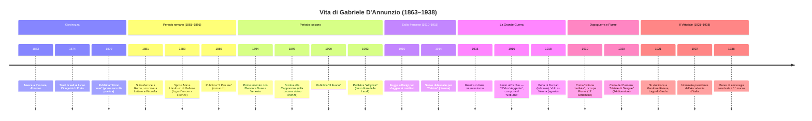
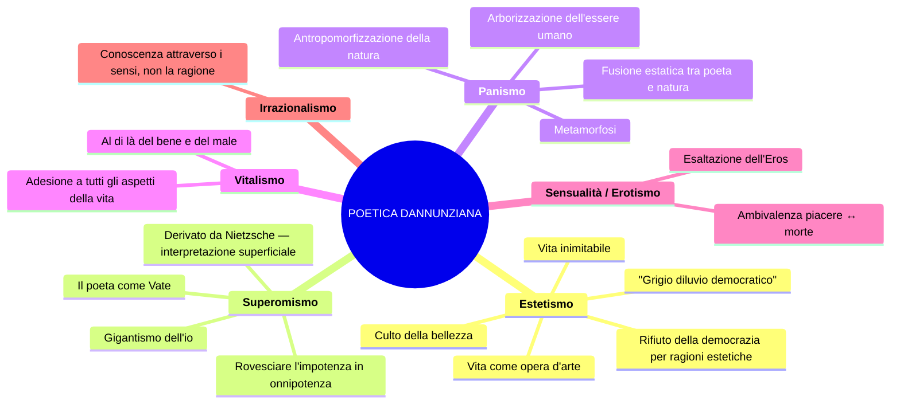
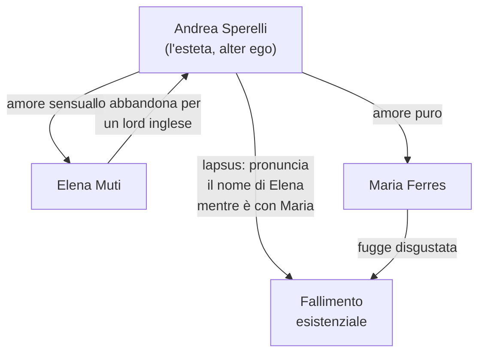
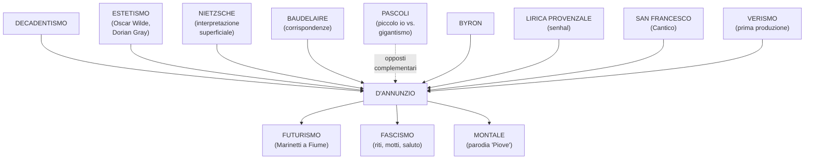

# RIASSUNTO: Gabriele D'Annunzio

> **Fonti**: Lezioni del 03/03/26, 05/03/26, 09/03/26, 10/03/26, 12/03/26, 16/03/26, 17/03/26
> **Docente**: Prof.ssa di Italiano
> **Finalità**: Preparazione esame di maturità — Lingua e Letteratura Italiana

---

## Indice

1. [Biografia](#1-biografia)
2. [La poetica composita](#2-la-poetica-composita)
3. [Il Vittoriale degli Italiani](#3-il-vittoriale-degli-italiani)
4. [D'Annunzio prosatore — I romanzi](#4-dannunzio-prosatore--i-romanzi)
5. [D'Annunzio poeta — Le Laudi e Alcyone](#5-dannunzio-poeta--le-laudi-e-alcyone)
6. [Analisi testi poetici](#6-analisi-testi-poetici)
7. [Contesto storico-culturale e confronti](#7-contesto-storico-culturale-e-confronti)
8. [Q&A — Domande-tipo](#8-qa--domande-tipo)
9. [Lacune esplicite e compiti assegnati](#9-lacune-esplicite-e-compiti-assegnati)

---

## 1. Biografia

### 1.1 Timeline biografica

### 1.2 Dati essenziali

| Dato | Dettaglio |
|------|-----------|
| **Nascita** | 1863, Pescara (Abruzzo) — borgo di ~4.000 abitanti, ex Regno delle Due Sicilie |
| **Aspetto fisico** | Alto 1,64 m; naso pronunciato, fronte alta, occhi grigi acuti, barba e baffetti biondi |
| **Famiglia** | Padre: Francesco Paolo (rapporto conflittuale); Madre: Luisa de Benedictis; tre sorelle che lo trattano «come un principe» |
| **Eredità paterna** | «La potenza, l'impeto, la sensualità, la crudeltà, la prodigalità, l'amore dei cani e dei cavalli» |
| **Liceo Cicognini** | Lo definì: «**Un gran serraglio di cani**, istituito per isterilire e inaridire le più fervide sementi» |
| **Morte** | 1° marzo 1938 — emorragia cerebrale, trovato col capo riverso sulla scrivania al Vittoriale |

### 1.3 Le relazioni sentimentali

| Donna | Periodo | Note |
|-------|---------|------|
| **Maria Hardouin di Gallese** | 1883– | Duchessina diciannovenne; fuga d'amore a Firenze organizzata ad arte con i giornali avvertiti da D'Annunzio; tre figli |
| **Principessa Maria Gravina** | ~1891 | Relazione durante il periodo napoletano; figlia Renata detta "Cicciuzza", l'unica che D'Annunzio ama davvero |
| **Eleonora Duse** | 1894–~1904 | L'amore più celebre del vate; attrice di fama internazionale; D'Annunzio la chiamava "Ghisola" / "Anadiomene"; lei finanzia le opere teatrali, lui la ritrae umiliata ne *Il Fuoco*; la Duse: «Ti perdono di avermi sfruttata, rovinata, umiliata. Ti perdono tutto, perché ho amato» |
| **Alessandra Starabba di Rudinì** | ~1904 | Causa della rottura con la Duse (la "forcina" nel letto); dopo D'Annunzio si chiude in convento |
| **Romaine Brooks** | ~1909 | Fattezze efebiche che ispirano *Le Martyre de Saint Sébastien* |
| **Luisa Baccara** | 1920–1938 | Pianista, compagna al Vittoriale |

> [!WARNING] Commento della prof
> «Ragazze, non prendete esempio da questo.» (a proposito della Duse che perdona tutto)

### 1.4 D'Annunzio "primo influencer della storia"

La prof insiste molto su questo aspetto — D'Annunzio come **personaggio mediatico** ante litteram:

- **Detta le mode** e influenza i costumi della società italiana
- **Inventa nomi commerciali**: La Rinascente, penna **Aurora**, liquore **Aurum**, la parola **automobile** (declinata al femminile)
- **Sensibilità pubblicitaria**: viene pagato dalle aziende per "battezzare" i prodotti
- **Cinema**: scrive le didascalie per ***Cabiria*** (1914), colossal cinematografico — capisce le potenzialità della "settima arte"
- **Gossip**: dà notizie inventate pur di far parlare di sé — «un po' come Fabrizio Corona, ma un po' più colto il buon Gabriele» (cit. prof)
- **Sull'automobile**: «L'automobile è femminile. Questa ha la grazia, la snellezza, la vivacità di una seduttrice; ha inoltre una virtù ignota alle donne: la perfetta obbedienza.»

### 1.5 Le imprese belliche

#### Beffa di Buccari (10-11 febbraio 1918)

Tre motoscafi **MAS** penetrano nella baia di Buccari (costa croata). Lanciano sei siluri contro piroscafi austriaci — solo uno esplode. D'Annunzio lascia **tre bottigliette** con messaggi su nastro tricolore:

> «Contro la cautissima flotta austriaca [...] sono venuti col ferro e col fuoco a scuotere la prudenza nel suo più comodo rifugio i marinai d'Italia, che si ridono di ogni sorte di reti e di sbarre, pronti sempre a **osare l'inosabile**.»

**MAS** = **"Memento Audere Semper"** = *Ricorda di osare sempre*. «Poi la Decima MAS era un battaglione fascista — questi motti sono ripresi dal fascismo» (cit. prof).

#### Volo su Vienna (9 agosto 1918)

- 11 aerei partono dal campo di San Pelagio (Padova), solo 7 raggiungono Vienna
- D'Annunzio sgancia **390.000 volantini** in italiano e tedesco
- «Irrilevante dal punto di vista militare, ma di enormi conseguenze morali» — finisce sulle prime pagine di tutti i giornali

#### Presa di Fiume (12 settembre 1919)

- D'Annunzio alla testa di un gruppo di legionari occupa la città
- Fonda la **Reggenza Italiana del Carnaro** con la **Carta del Carnaro** (scritta con Alceste De Ambris)
- Partecipano anche i **futuristi** (Marinetti tra i primi a raggiungere Fiume)
- «Ha rischiato veramente di far scoppiare di nuovo un altro conflitto mondiale» (cit. prof)
- Finisce col **Natale di Sangue** (24 dicembre 1920): dalla nave Andrea Doria parte un colpo di cannone; ~50 vittime

### 1.6 Rapporti con Mussolini e il fascismo

> **Mussolini su D'Annunzio**: «D'Annunzio è come un **dente guasto**: o lo si estirpa o lo si copre d'oro.»

| Aspetto | Dettaglio |
|---------|-----------|
| **Posizione politica** | Prima nella Destra, poi con un voltafaccia («Vado verso la vita») passa alla Sinistra |
| **Il fascismo attinge da D'Annunzio** | Riti, miti, motti ("Eia Eia Alalà", "Memento Audere Semper"), saluto fascista — tutta la componente teatrale e rituale |
| **Rapporto ambiguo** | Accetta le gratificazioni del regime (presidente Accademia d'Italia, 1937) ma mantiene distacco; non condivide conciliazione né alleanza con la Germania |
| **Relegato al Vittoriale** | Il fascismo lo relega a uno «splendido isolamento»; lo fa sorvegliare dall'emissario Antonio Rizzo |
| **Volo d'arcangelo** (1922) | Cade da una finestra poco prima di un incontro Nitti–Mussolini — ipotesi: incidente causato da gelosia |

### 1.7 Gli ultimi anni

- **Cocaina** ("la polvere folle"): tossicodipendente dopo Fiume
- Sessualità maniacale; feticismo di giovinezza
- Deperimento fisico; isolamento nella Prioria
- Scrive il *Libro segreto* — «il suo unico vero amaro tentativo autobiografico»
- Ultime parole scritte: «Ora che so al fine quale sia la vera essenza dell'arte, ora che io posseggo la compiuta maestria, ora non ho se non il mattino di domani per esprimermi.»

---

## 2. La poetica composita

### 2.1 Mappa della poetica

### 2.2 L'estetismo

> **Definizione della prof**: «Corrente di gusto che riconosce l'equazione **vita = opera d'arte**»

**Come si realizza l'equivalenza vita–opera d'arte?**

1. **Rifiuto della democrazia** per motivi di ordine estetico: la democrazia sommerge le cose belle
2. **Ideale aristocratico, elitario** — non democratico
3. **Esaltazione del piacere** sensuale — la bellezza che si ricava dai sensi
4. **Vivere inimitabile** — vita fuori dal comune, lontana dalla monotonia
5. **Attivismo politico**: teorizza il diritto di dominio dell'aristocrazia sul **grigiore borghese**

> La prof: «La borghesia è sinonimo di democrazia, di uguaglianza. D'Annunzio la disprezza perché l'uomo comune distrugge le cose belle, non è all'altezza rispetto a un ideale aristocratico, elitario.»

### 2.3 Il superomismo

- Derivato dalla lettura di **Nietzsche**, di cui D'Annunzio dà un'**interpretazione piuttosto superficiale**
- La prof avverte: «Quando studierete Nietzsche vi accorgerete che la figura dell'oltreuomo è più complessa di questa interpretazione»
- Il poeta è un **superuomo** che si erge al di sopra dell'uomo comune
- Ha il compito di **rivelare alle folle il vero significato dell'esistenza**
- Deve **rovesciare l'impotenza in onnipotenza** attraverso l'esaltazione della lotta e del dominio

> **"L'Orbo Veggente"**: ossimoro autoattribuito dopo la ferita all'occhio — «pur ferito, conserva la capacità di vedere ciò che gli altri non vedono» → esprime il suo superomismo

### 2.4 Il panismo

> **Definizione**: dal greco *pas, pasa, pan* = "tutto" (come in Pangea, panteismo)

**Panismo** = **fusione estatica tra il poeta e la natura**, che si manifesta in un processo di **metamorfosi**:

| Processo | Significato | Esempio |
|----------|-------------|---------|
| **Arborizzazione dell'essere umano** | L'uomo/la donna si trasforma in albero/pianta | «Par da scorza tu esca» (*La pioggia nel pineto*) |
| **Antropomorfizzazione della natura** | La natura assume tratti umani | Le gocce di pioggia come «innumerevoli dita» che suonano strumenti diversi |

> **Tre parole-chiave** (la prof insiste): **metamorfosi**, **arborizzazione dell'essere umano**, **antropomorfizzazione della natura**

### 2.5 Il gigantismo dell'io vs. il piccolo io pascoliano

La prof cita il critico **Sant'Agata**:

| | Pascoli | D'Annunzio |
|---|---------|------------|
| **Definizione di Sant'Agata** | "Un piccolo io" | "Il **gigantismo dell'io**" |
| **Il poeta è...** | Il fanciullino — voce ingenua, pura | Il Vate — superuomo che vive esperienze fuori dal comune |
| **Rispetto all'Eros** | Escluso (es. *Gelsomino notturno*) | Protagonista — si congiunge con l'Estate personificata (*Stabat nuda Aestas*) |
| **Tono** | Intimo, malinconico, dimesso | Magniloquente, sensuale, celebrativo |

### 2.6 L'ambivalenza fondamentale

La prof sottolinea più volte una **tensione irrisolta** in tutta l'opera dannunziana:

> «Molto spesso la poesia dannunziana presenta questa ambivalenza: da una parte l'esaltazione del piacere nel momento in cui il frutto è più maturo, ma proprio in quel momento il frutto maturo contiene già i germi che lo porteranno alla fine.»

Esempi:
- *Canta la gioia*: «ogni fuggevole forma, ogni grazia caduca, ogni apparenza nell'ora breve»
- *La pioggia nel pineto*: «la favola bella che ieri t'illuse, che oggi m'illude»
- *Il Piacere*: l'esteta Andrea Sperelli finisce nel fallimento esistenziale
- La Roma **barocca**: massimo splendore artistico che prelude alla **decadenza**

### 2.7 Poesia di secondo grado

> «La **poesia dannunziana è poesia di secondo grado**, cioè è letteratura fatta di altra letteratura, che si nutre di altra letteratura attraverso citazioni, scelte stilistiche, recuperi, rielaborazioni.»

Esempi di recuperi:
- **Senhal** dalla lirica provenzale (*Canta la gioia*: l'amata chiamata "Ospite")
- **Laudata sii** dal *Cantico delle Creature* di San Francesco (*La sera fiesolana*)
- Reminiscenze **leopardiane** ne *La sera fiesolana* (il contadino che s'attarda)
- Riferimenti a **Byron**, al mondo **classico**, alla mitologia greca

---

## 3. Il Vittoriale degli Italiani

### 3.1 Informazioni generali

| Dato | Dettaglio |
|------|-----------|
| **Ubicazione** | Gardone Riviera, Lago di Garda (riva bresciana) |
| **Periodo** | 1921–1938 |
| **Origine** | Vecchia cascina settecentesca, affitto iniziale di 600 lire/mese |
| **Dimensioni finali** | Quasi 10 ettari, 6.000 m² coperti |
| **Architetto** | Gian Carlo Maroni («maestro delle pietre vive») — sepolto nel mausoleo insieme a D'Annunzio |
| **Oggi** | Monumento nazionale, museo visitabile, anfiteatro per concerti estivi |

> D'Annunzio sulla sua casa: «Non soltanto ogni stanza da me studiosamente composta, ma ogni oggetto da me scelto e raccolto fu sempre per me un modo di espressione, fu sempre per me un modo di rivelazione spirituale, come uno dei miei poemi.»

### 3.2 Le stanze principali

| Stanza | Caratteristiche |
|--------|----------------|
| **Vestibolo** | Colonna di marmo con cesta di **melograne** — simbolo di fecondità e sensualità |
| **Stanza del Mascheraio** | *Horror vacui*: tendaggi, arazzi, nessun centimetro libero; accostamento **kitsch**. Specchio con scritta per Mussolini: «Ricordati che tu sei vetro e contro l'acciaio» |
| **Lo Studiolo** | Soffitto basso, raccoglimento; sulla porta la **mano del monco** in gesso |
| **Sala del Mappamondo** | Biblioteca con organo, mappamondo, galeone veneziano, busti di Dante |
| **L'Officina** | Lo studio dove lavorava — «il cuore del Vittoriale» |
| **Stanza della Cheli** | Sala da pranzo; sulla tavola la **Cheli** — tartaruga in bronzo (morta per indigestione → monito per gli ospiti) |
| **Stanza del Lebroso** | Raccoglimento e preghiera; San Sebastiano, letto monacale — commistione sacro/profano (sacro recuperato per valore **estetico**) |
| **Bagno Blu** | ~900 oggetti disseminati; tappeto persiano per l'elioterapia |

### 3.3 Il giardino e i cimeli

- **Anfiteatro** affacciato sul Lago di Garda
- **Aeroplano** del volo su Vienna
- **MAS** della Beffa di Buccari
- **Nave Puglia** — la prora incastonata su un poggio
- **Area mausoleo** — sepoltura di D'Annunzio e Maroni

---

## 4. D'Annunzio prosatore — I romanzi

### 4.1 Le fasi della narrativa dannunziana

| Fase | Opera/e chiave | Caratteristiche |
|------|---------------|-----------------|
| **Fase verista** | *Novelle della Pescara* | Legame col Verismo; gusto per il primitivo, il barbarico; terra aspra dell'Abruzzo |
| **Fase dell'estetismo** | ***Il Piacere*** (1889) | Andrea Sperelli = alter ego = l'esteta per eccellenza; la vita come opera d'arte |
| **Fase della bontà** | *Giovanni Episcopo*, *L'Innocente* | (studiare titoli e ragione della definizione dal libro) |
| **Fase superomistica** | ***Le vergini delle rocce***, ***Il Fuoco*** | Superomismo in prosa |
| **Fase intima** | ***Notturno*** | Scritto su striscioline di carta durante la convalescenza per l'occhio ferito |

### 4.2 *Il Piacere* (1889) — Analisi approfondita

#### Trama

La vicenda è «estremamente esile» — un **intreccio amoroso**:

#### Lo sfondo: Roma barocca

Non la Roma dei Cesari, ma la **Roma dei Papi** — la Roma **barocca** del Seicento:

> «Egli avrebbe dato tutto il Colosseo per la Villa Medici, il Campo Vaccino per la Piazza di Spagna, l'Arco di Tito per la fontanella delle Tartarughe.»

**Perché il Barocco?** Perché è identificato con l'epoca di maggiore **splendore** artistico (ricchezza di ornamenti), che però prelude alla **decadenza** → stessa ambivalenza di tutta l'opera dannunziana.

#### Analisi del ritratto di Andrea Sperelli

| Passo | Testo | Commento della prof |
|-------|-------|---------------------|
| Presentazione | «Il conte Andrea Sperelli Fieschi d'Ugenta, unico erede» | Già il nome dice: siamo di fronte a un **nobile** |
| Stirpe | «l'ultimo discendente d'una razza intellettuale» | Appartiene **geneticamente** a una stirpe eccezionale |
| Educazione | «nutrita di studii varii e profondi [...] senza restrizioni e costrizioni di pedagoghi» | Educazione esclusiva, senza educazione tradizionale (che porta all'**omologazione**) |
| Il padre | «il gusto delle cose d'arte, il culto passionato della bellezza, il paradossale disprezzo de' pregiudizi, l'avidità del piacere» | Qui c'è **tutto** Andrea Sperelli |
| Il padre (2) | «una scienza profonda della vita voluttuosa [...] e insieme una certa inclinazione bayroniana» | Duplice tendenza: soddisfacimento dei piaceri + vagheggiamento estetico |
| La distruzione | «l'espansione di quella sua forza era la distruzione in lui di un'altra forza: della forza morale» | La ricerca del piacere distrugge il discernimento morale |
| Sazietà | «la sua vita era la riduzion progressiva delle sue facoltà [...] il circolo gli si restringeva» | Lo sperimentare porta a una **sazietà** dei piaceri |
| **MASSIMA** | «**Bisogna fare la propria vita come si fa un'opera d'arte**» | Il principio dell'esteta — da sottolineare |
| Superiorità | *Habere non haberi* | Possedere, non essere posseduti dalle convenzioni |
| Il sofisma | «Un altro seme paterno aveva perfidamente fruttificato: il seme del **sofisma**» | Gusto per la parola vuota → autoinganno |
| L'autoinganno | «la menzogna non tanto verso gli altri quanto verso se stesso divenne un abito» | Andrea si autoinganna sulla propria felicità |

#### Il linguaggio de *Il Piacere*

| Caratteristica | Dettaglio |
|---------------|-----------|
| **Linguaggio forbito, raffinato, aulico** | Termini ricercati, scelti per la loro musicalità |
| **Andamento sintattico elegante** | Alternanza di ipotassi e paratassi |
| **Prosa erudita** | Riferimenti continui ad arte, storia |
| **In linea con i contenuti** | Il linguaggio rispecchia il mondo di cui parla |

---

## 5. D'Annunzio poeta — Le Laudi e Alcyone

Le **Laudi** sono una grande raccolta poetica. Il terzo libro si intitola **Alcyone** (1903) — la raccolta più celebre e importante. Periodo toscano della Capponcina, con la Duse.

### 5.1 Testi analizzati in classe

| Testo | Raccolta | Situazione | Temi principali |
|-------|----------|------------|-----------------|
| **Canta la gioia** | *Canto Novo* | Invocazione alla gioia e all'amata ("Ospite") | Vitalismo, edonismo, senhal, ambivalenza gioia/morte |
| **La pioggia nel pineto** | *Alcyone* | Passeggiata con Ermione (= Duse) sotto la pioggia | Panismo, metamorfosi, fonosimbolismo — la lirica **più celebre** |
| **Stabat nuda Aestas** | *Alcyone* | L'io lirico insegue l'Estate personificata | Gigantismo dell'io, erotismo, antropomorfizzazione |
| **La sera fiesolana** | *Alcyone* | Sera nella campagna toscana (Fiesole) | Panismo, smaterializzazione, lauda francescana, sinestesia |

### 5.2 Caratteristiche stilistiche

| Elemento | Descrizione |
|----------|-------------|
| **Fonosimbolismo** | Il significante assume un significato autonomo |
| **Musicalità** | Allitterazioni, assonanze, consonanze, rime interne |
| **Onomatopea** | "Crepitìo", "crosciare", "bruiva" |
| **Linguaggio aulico** | "aulenti" (profumate), "estuava" (ribolliva), "virente" (verdeggiante), "cerule" (azzurre), "fulvi" (rossastri) |
| **Termini botanici** | Tamerici, mirti, ginepri, ginestre, gelsi, leandri, olmi |
| **Gusto per l'elencazione** | Polisindeto frequente |
| **Ipotassi raffinata** | Periodi lunghissimi (es. 14 versi = 1 periodo ne *La sera fiesolana*) |
| **Poesia di secondo grado** | Citazioni dalla tradizione (lirica provenzale, San Francesco, Leopardi, Baudelaire) |

---

## 6. Analisi testi poetici

### 6.1 *Canta la gioia* (da *Canto Novo*)

#### Testo integrale

> Io voglio cingerti di tutti i fiori
> perché tu celebri la gioia, la gioia, la gioia,
> questa magnifica donatrice.
>
> **Canta l'immensa gioia di vivere**,
> d'esser forte, d'esser giovane,
> di mordere i frutti terrestri
> con saldi e bianchi denti voraci,
> di porre le mani audaci e cupide
> su ogni dolce cosa tangibile,
> di tender l'arco su ogni preda novella
> che il desio miri [...]
>
> ogni fuggevole forma,
> ogni segno vago, ogni immagine vanante,
> ogni grazia caduca,
> ogni apparenza nell'ora breve.
>
> Canta la gioia! Lungi dall'anima nostra
> il dolore, veste cineria.
> È un misero schiavo colui
> che del dolore fa sua veste.
>
> A te la gioia, ospite,
> io voglio vestirti della più rossa porpora
> s'io debba pur tingere il tuo bisso
> nel sangue delle mie vene.
>
> Di tutti i fiori io voglio cingerti
> trasfigurata,
> perché tu celebri la gioia, la gioia, la gioia,
> questa invincibile creatrice.

#### Analisi passaggi chiave

| Versi | Testo | Analisi |
|-------|-------|---------|
| 4-7 | «Canta l'immensa gioia di vivere / d'esser forte, d'esser giovane / di mordere i frutti terrestri / con saldi e bianchi denti voraci» | Ideale estetico: gioia, forza, giovinezza. Immagine sensuale di **vitalismo** — addentare i frutti con denti affamati |
| 8-9 | «di porre le mani audaci e cupide / su ogni dolce cosa tangibile» | Esaltazione del **tatto**, del possedere ciò che si desidera |
| 10-11 | «di tender l'arco su ogni preda novella / che il desio miri» | **Caccia amorosa** — sensualità mescolata ad aggressività |
| 16-18 | «ogni fuggevole forma / ogni segno vago, ogni immagine vanante / ogni grazia caduca» | Qui si **incrina** qualcosa: riflessione sulla **brevità della vita**, l'**ambivalenza** tipica |
| 21-22 | «È un misero schiavo colui / che del dolore fa sua veste» | **Volontà di potenza**: condanna di chi si abbandona al dolore |
| 23 | «A te la gioia, **ospite**» | **Senhal** dalla lirica provenzale — per non rivelare l'identità dell'amata |
| 24-26 | «io voglio vestirti della più rossa porpora / s'io debba pur tingere il tuo bisso / nel sangue delle mie vene» | Rosso = passione, sangue. «A costo di tingere il lino nel sangue delle mie vene» |
| 27-31 | «Di tutti i fiori io voglio cingerti / **trasfigurata** [...] questa **invincibile creatrice**» | Da "magnifica donatrice" a "invincibile creatrice" — **crescendo**. "Trasfigurata" = dimensione divina |

### 6.2 *La pioggia nel pineto* (da *Alcyone*, 1903)

#### Informazioni generali

- **La lirica più celebre di D'Annunzio**
- Situazione: vagare con la donna amata — **Ermione** (trasfigurazione mitologica di Eleonora Duse)
- Ambientazione: pineta della **Versilia**, estate
- D'Annunzio mira a **riprodurre il rumore della pioggia** attraverso ritmo e parole
- **Montale** nel 1971 scrive una **parodia** intitolata *Piove*

#### Strofa I — passaggi chiave

> **Taci.** Su le soglie del bosco non odo parole che dici umane; ma odo parole più nuove che parlano gocciole e foglie lontane.

Apostrofe d'apertura. A parlare non sono presenze umane ma foglie e gocce. **«lontane»** = parola-verso isolata → senso di indeterminato.

> piove su le tamerici salmastre ed arse [...] piove su i mirti **divini** [...] su i ginepri folti di coccole **aulenti**

**Tamerici** = arbusti sulle dune (→ *Myricae* di Pascoli!). Mirti sacri a **Venere**. Coccole **aulenti** = bacche profumate.

> piove su i nostri vòlti **silvani** [...] su i nostri vestimenti **leggieri** [...] su la **favola bella** che ieri t'illuse, che oggi m'illude, o Ermione.

"Silvani" (da *silva*): volti del bosco — inizio della **metamorfosi**. «I **freschi** pensieri» = **sinestesia**. La favola bella = l'amore, l'illusione amorosa.

#### Strofa II — passaggi chiave

> E il pino ha un suono, **e** il mirto altro suono, **e** il ginepro altro ancóra, strumenti diversi sotto **innumerevoli dita**.

**Polisindeto**. Gocce = dita che suonano strumenti → **antropomorfizzazione della natura**.

> E **immersi** noi siam nello **spirto silvestre**, d'**arborea vita** viventi

**Arborizzazione** dell'io lirico e della donna amata — «vivono lo spirito boschivo».

> il tuo volto **ebro** è molle di pioggia come una **foglia** [...] o **creatura terrestre** che hai nome Ermione.

"Ebro" = inebriato, in estasi. "Terrestre" = nata dalla terra, al pari di una pianta.

#### Strofa III — passaggi chiave

> «**crosciare** l'argentea pioggia che **monda**»

"Argentea" = cristallina (colore + suono). "Monda" = **purifica** come un rito mistico. "Crosciare / croscio" = **poliptoto**.

> La **figlia dell'aria** è muta [...] la **figlia del limo** [...] la rana, canta nell'ombra più fonda, **chi sa dove, chi sa dove!**

Cicala = figlia dell'aria; rana = figlia del fango. Favolosa lontananza, indeterminatezza.

#### Strofa IV — passaggi chiave

> non bianca ma quasi fatta **virente**, par da **scorza** tu esca.

Virente = verdeggiante. Sembra uscire dalla corteccia → **fusione panica**, arborizzazione di Ermione. Parallelo con **Apollo e Dafne** di Bernini.

> il cuor nel petto è come **pesca intatta** [...] gli occhi son come **polle** tra l'erbe [...] i denti son come **mandorle acerbe**

Similitudini vegetali: freschezza, vigore, sensualità.

> il **verde vigor** rude ci allaccia i **malleoli** c'intrica i ginocchi

**Allitterazione** (v-v). La vegetazione impedisce il movimento.

> la favola bella che ieri **m'illuse**, che oggi **t'illude**, o Ermione.

Pronome **invertito** rispetto alla strofa I. La fusione panica ha portato a uno **scambio di identità**.

### 6.3 *Stabat nuda Aestas* (da *Alcyone*, 1903)

- Titolo: «**L'estate giaceva nuda**» (*ae* → *e* in latino). *Aestas* con la maiuscola: l'Estate **personificata**
- L'analisi dettagliata è nel saggio di **Sant'Agata** (da studiare — confronto con Pascoli)

#### Testo integrale

> Primamente intravidi il suo piè stretto / scorrere su per gli aghi arsi dei pini / ove esalava l'aere con grande / tremito, quasi bianca vampa infusa. / Le cicale si tacquero. Più rochi / si fecero i ruscelli. Copiosa / la resina gemette giù pei fusti. / Riconobbi il colubro dal sentore.
>
> Nel bosco degli ulivi la raggiunsi. / Scorsi l'ombre cerule dei rami / su la schiena falcata; e i capei fulvi / nell'argento palladio trasvolare / senza suono. [...]
>
> Tra i leandri la vidi che si volse. [...] / Distesa cadde tra le sabbie e l'acque. / Il Ponente schiumò ne' suoi capegli. / Immensa apparve, immensa nudità.

#### Analisi passaggi chiave

| Verso | Testo | Analisi |
|-------|-------|---------|
| 1-4 | «piè stretto / aghi arsi / estuava l'aere / bianca vampa infusa» | "Estuava" = ribolliva (da "estate"). Tremolio dell'aria nell'afa torrida |
| 5-7 | «Le cicale si tacquero. Più rochi si fecero i ruscelli. Copiosa la resina gemette» | Sensi: VISTA (vampa), UDITO (cicale, ruscelli), OLFATTO (sentore del serpente) |
| 10-12 | «ombre cerule / schiena falcata / capei fulvi nell'argento palladio» | Cerule = azzurre; fulvi = biondo-rosso. "Argento palladio" = foglie degli ulivi sacri ad **Atena/Pallade** → valore mitologico |
| 12-13 | «senza suono» | Domina il **silenzio** — sospensione che precede un disvelamento |
| 24 | «**Immensa** apparve, **immensa** nudità» | La figura femminile occupa tutto l'orizzonte — congiungimento suggerito, non esplicitato |

### 6.4 *La sera fiesolana* (da *Alcyone*, 1903)

Ambientazione: Fiesole, campagna toscana. Stagione: **primavera**. Struttura: tre strofe + ritornello francescano. Nessun nucleo narrativo: «libero affiorare di immagini paesaggistiche, di estasi amorosa e poetica».

#### Strofa I — passaggi chiave

> Le mie parole siano per te nella sera / **fresche** come il fruscio che fan le foglie / del gelso nella man di chi le coglie / silenzioso, e s'attarda all'opra lenta / su l'alta scala che s'annera [...]

**Sinestesia** (parole + "fresche"). **Allitterazione** della F (fresche, fruscio, fan, foglie). Le foglie del gelso diventano **fruscio** → smaterializzazione del concreto in sensazione. Il contadino che s'attarda → **reminiscenza leopardiana** (*Il sabato del villaggio*). **14 versi = 1 unico periodo** → padronanza dell'ipotassi.

#### Ritornello (dopo strofa I)

> **Laudata sii per lo tuo viso di perla, o sera, e per i tuoi grandi umidi occhi ove si tace l'acqua del cielo.**

Riferimento al **Cantico delle Creature** di San Francesco (1220). Recupero **non** per valore religioso, ma per valore **estetico e musicale**. La sera **personificata** come figura femminile sensuale: «grandi umidi occhi» = cielo carico di pioggia.

#### Strofa II — passaggi chiave

> la pioggia che **bruiva**, tepida e fuggitiva, commiato lagrimoso della primavera

**Bruiva** = francesismo/provenzalismo, verbo onomatopeico (mormorare).

> i pini dai novelli **rosei diti** [...] i **fratelli olivi** che fan di santità pallidi i clivi

"Rosei diti" = nuove gemme come dita rosee → **antropomorfizzazione**. "Fratelli olivi" = recupero dalla lauda francescana.

#### Strofa III — passaggi chiave

> **Io ti dirò** verso quali reami d'amor ci chiami il fiume [...]
> le colline [...] s'incurvino come **labbra** che un divieto chiuda

Promessa di **rivelazione** — il poeta-veggente sembra sul punto di svelare i misteri. Ma **la rivelazione non arriva mai**. "Colline = labbra" = **similitudine sensuale**. Rimando a **Baudelaire**: natura fatta di segrete corrispondenze.

#### Ritornello finale

> **Laudata sii per la tua pura morte, o sera, e per l'attesa che in te fa palpitar le prime stelle.**

Conclusione del giorno → comparire delle stelle.

---

## 7. Contesto storico-culturale e confronti

### 7.1 Relazioni con movimenti e autori

### 7.2 D'Annunzio e il Futurismo

- I **futuristi** partecipano all'impresa di Fiume (Marinetti tra i primi ad arrivare)
- D'Annunzio anticipa temi futuristi: vitalismo, audacia, esaltazione della forza, modernità
- Ma D'Annunzio guarda anche al **passato** (poesia di secondo grado) — i futuristi vogliono **distruggerlo**
- D'Annunzio inventa la parola "automobile" → i futuristi ne fanno un mito

### 7.3 D'Annunzio e Ungaretti

> «D'Annunzio considera l'aspetto eroico, grandioso, glorioso della guerra, mentre tutto l'aspetto distruttivo, della sofferenza, del dolore — chi è il poeta? **È sicuramente Ungaretti**, che scrive dalla trincea.»

### 7.4 D'Annunzio e *Il ritratto di Dorian Gray*

> «Andrea Sperelli è il Dorian Gray italiano» (cit. prof)

Collegamento atteso all'esame: *Il Piacere* ↔ *Il ritratto di Dorian Gray* di Oscar Wilde (entrambi espressione dell'**estetismo**).

### 7.5 Confronto Pascoli–D'Annunzio (fondamentale per l'esame)

| Aspetto | Pascoli | D'Annunzio |
|---------|---------|------------|
| **L'io** | Piccolo io | Gigantismo dell'io |
| **Il poeta è** | Il fanciullino | Il Vate, il superuomo |
| **Tono** | Intimo, malinconico | Magniloquente, celebrativo |
| **Natura** | Nido, rifugio; natura come mistero | Fusione panica; natura come corpo da possedere |
| **Eros** | Escluso (es. *Gelsomino notturno*) | Protagonista assoluto |
| **Morte** | Presenza costante e ossessiva | L'altra faccia del vitalismo |
| **Linguaggio** | Fonosimbolismo, onomatopee, pre-grammaticale | Aulico, erudito, musicale, di secondo grado |
| **Immagini** | Rondine che cade, aratro, assiuolo | Frutti addentati, amplesso con l'estate, pioggia-dita |
| **Rapporto col Decadentismo** | Simbolismo, analogia, vaghezza | Estetismo, superomismo, panismo |
| **Rapporto col pubblico** | Distante, appartato | Teatrale, mediatico, influencer |

### 7.6 Tabella sinottica per l'esame

| Tema | D'Annunzio | Collegamento |
|------|-----------|--------------|
| **Estetismo** | *Il Piacere*, Andrea Sperelli | Oscar Wilde, *Il ritratto di Dorian Gray* |
| **Superuomo** | Interpretazione di Nietzsche | Nietzsche (filosofia): oltreuomo è diverso |
| **Nazionalismo** | Vittoria mutilata, Fiume, interventismo | Storia: nazionalismo, irredentismo, marcia su Roma |
| **Guerra** | Aspetto eroico e glorioso | Ungaretti: aspetto distruttivo |
| **Rapporto col fascismo** | Ambiguo; riti/motti ripresi | Mussolini, Accademia d'Italia |
| **Decadentismo** | Vate, culto della bellezza | Baudelaire, Simbolismo francese |
| **Poesia e natura** | Panismo, fusione estatica | Pascoli: piccolo io (antitesi) |
| **Roma barocca** | Sfondo de *Il Piacere* | Storia dell'arte: Barocco, Bernini |
| **Metamorfosi** | Arborizzazione (*La pioggia*) | Bernini, *Apollo e Dafne* |
| **Cinema** | Didascalie per *Cabiria* (1914) | Settima arte, cinema muto |
| **Lauda** | Ripresa del *Cantico* in chiave estetica | San Francesco, 1220 |
| **Verismo** | Prima produzione abruzzese | Verga, Naturalismo |
| **Futurismo** | Anticipazioni: vitalismo, audacia | Marinetti, avanguardie |

---

## 8. Q&A — Domande-tipo

### Domande sulla biografia e il contesto
1. **Quali sono le fasi della vita di D'Annunzio?** Pescara → Roma → Napoli → Toscana → Parigi → Guerra → Fiume → Vittoriale
2. **Perché D'Annunzio va in Francia?** Debiti insostenibili; lui lo definisce "esilio volontario" attribuendovi un'aura di sacralità
3. **Cos'è la "vittoria mutilata"?** Espressione coniata da D'Annunzio: l'Italia non ottenne tutti i territori promessi
4. **Cos'è la Beffa di Buccari? Cosa significa MAS?** Memento Audere Semper = Ricorda di osare sempre
5. **Rapporti con il fascismo?** Ambigui: il fascismo attinge riti e motti, lui accetta gratificazioni ma mantiene distanza
6. **Perché è definito "il primo influencer"?** Mode, pubblicità, gossip, cinema

### Domande sulla poetica
7. **Cos'è l'estetismo? Come si realizza?** Equazione vita = opera d'arte; rifiuto della democrazia per ragioni estetiche; ideale aristocratico
8. **Cos'è il panismo?** Fusione estatica poeta-natura; tre parole: metamorfosi, arborizzazione, antropomorfizzazione
9. **Da chi deriva il superomismo e con quale differenza?** Da Nietzsche, ma interpretazione superficiale
10. **Cos'è la "poesia di secondo grado"?** Letteratura fatta di altra letteratura
11. **L'ambivalenza fondamentale?** Vitalismo ↔ senso di vanità/morte

### Domande sui testi
12. **Qual è la lirica più celebre?** *La pioggia nel pineto*
13. **Chi è Ermione?** Trasfigurazione mitologica di Eleonora Duse
14. **Cos'è il "senhal" in *Canta la gioia*?** "Ospite" — dalla lirica provenzale
15. **Rapporto tra *La sera fiesolana* e San Francesco?** Ripresa del *Cantico* in chiave estetica, non religiosa
16. **Chi è Andrea Sperelli?** Alter ego di D'Annunzio; collegamento con Dorian Gray

### Domande di collegamento
17. **Confronto Pascoli–D'Annunzio** — Piccolo io vs. gigantismo dell'io; fanciullino vs. Vate
18. **D'Annunzio e Ungaretti sulla guerra** — Aspetto eroico vs. distruttivo
19. **Estetismo italiano e inglese** — *Il Piacere* ↔ *Il ritratto di Dorian Gray*

---

## 9. Lacune esplicite e compiti assegnati

### 9.1 Compiti assegnati dalla prof

| Data | Compito | Stato |
|------|---------|-------|
| 05/03 | Studiare sul libro la biografia e la poetica (estetismo) | Da fare |
| 09/03 | Studiare sugli appunti e sul libro: poetica, estetismo, prima produzione | Da fare |
| 10/03 | Leggere *Quel nome* (pp. 412-420) — l'equivoco che segna il fallimento dell'esteta | Da fare |
| 10/03 | Studiare le fasi della narrativa (pp. 402-407) | Da fare |
| 12/03 | Studiare Alcyone | Da fare |
| 12/03 | Leggere analisi di Sant'Agata su *Stabat nuda Aestas* (WhatsApp) | **Fondamentale** |
| 16/03 | Leggere brano da *Le vergini delle rocce* p. 315 ("Uomini superiori") | Da fare |
| 16/03 | Trama e personaggi di *Il Fuoco* e *Le vergini delle rocce* — relazione con *Il Piacere* | Da fare |
| 16/03 | La parodia di Montale, *Piove* (1971) — su Classroom | Da leggere |

### 9.2 Testi da studiare autonomamente

- [ ] ***Quel nome*** (pp. 412-420): il lapsus di Sperelli (pronuncia il nome di Elena con Maria)
- [ ] ***Le vergini delle rocce*** — brano "Uomini superiori" (p. 315): fase superomistica in prosa
- [ ] ***Il Fuoco*** — trama, personaggi (dal libro)
- [ ] Analisi di **Sant'Agata** su *Stabat nuda Aestas* (WhatsApp) — include confronto con Pascoli e riferimenti classici
- [ ] **Montale**, *Piove* (1971) — parodia de *La pioggia nel pineto* (su Classroom)
- [ ] Cercare informazioni sulla **Beffa di Buccari** nel libro

### 9.3 Riferimenti non approfonditi in classe

| Riferimento | Nota |
|------------|------|
| *Il Notturno* | Citato più volte ma non letto; coordinate generali |
| *La figlia di Iorio* | Opera teatrale citata di sfuggita |
| *Giovanni Episcopo* / *L'Innocente* | Fase della "bontà" — sapere titoli e motivazione |
| La produzione teatrale abruzzese | «Storie di passioni primitive, ancestrali» — non approfondita |
| Nietzsche (superuomo vs. oltreuomo) | «Quando lo studierete in filosofia capirete la differenza» |

---

> [!NOTE] Nota sulla preparazione all'esame
> La prof ha sottolineato più volte:
> - «**Italiano è una materia da cui non si scappa**»
> - All'esame, «oltre l'italiano c'è anche storia» — inserire D'Annunzio nel contesto storico (nazionalismo, interventismo, fascismo)
> - Collegamento atteso: *Il Piacere* ↔ *Il ritratto di Dorian Gray* (letteratura inglese)
> - I tre romanzi (*Il Piacere*, *Il Fuoco*, *Le vergini delle rocce*) vanno messi in relazione tra loro
> - «Lo studiatone finale non è mai particolarmente efficace» — prepararsi con anticipo
