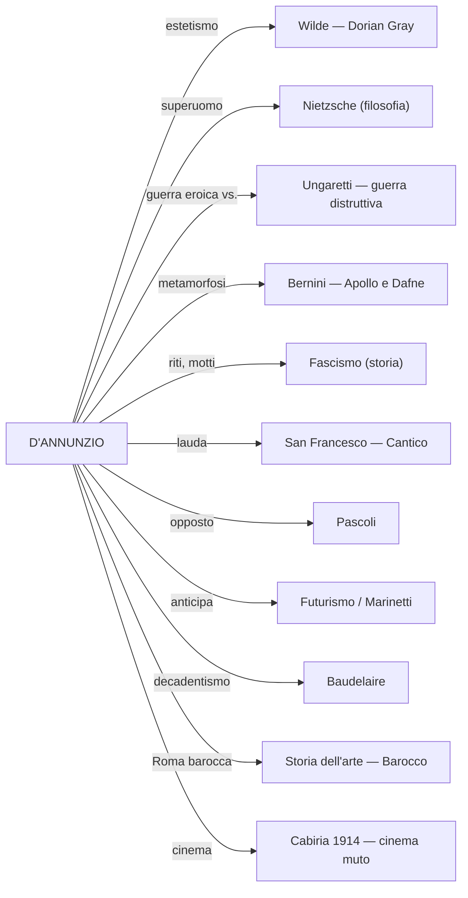

# RIPASSO VELOCE: Gabriele D'Annunzio

> Maturità — Lingua e Letteratura Italiana
> Fonti: Lezioni del 03/03/26, 05/03/26, 09/03/26, 10/03/26, 12/03/26, 16/03/26, 17/03/26

---

## 1. Biografia — Timeline essenziale

- **1863**: nasce a **Pescara** (Abruzzo), borgo di ~4.000 abitanti
- **1874**: Liceo Cicognini di Prato — lo definirà «un gran serraglio di cani»
- **1879**: pubblica *Primo vere* (prima raccolta poetica)
- **1881**: si trasferisce a **Roma**, si iscrive a Lettere e Filosofia
- **1883**: sposa **Maria Hardouin di Gallese** — fuga d'amore orchestrata coi giornali; tre figli
- **1889**: pubblica ***Il Piacere*** — romanzo cardine dell'estetismo
- **1891**: pubblica *L'Innocente*, *Elegie romane*; relazione con la principessa **Maria Gravina** (figlia Renata "Cicciuzza")
- **1894**: incontra **Eleonora Duse** a Venezia — l'amore più celebre
- **1897**: si ritira alla **Capponcina** (villa toscana vicino Firenze)
- **1900**: pubblica ***Il Fuoco*** — ritrae la Duse umiliata
- **1903**: pubblica ***Alcyone*** (terzo libro delle Laudi) — raccolta poetica più importante
- **~1904**: rottura con la Duse (la "forcina" di Alessandra Starabba di Rudinì)
- **1910**: fugge a **Parigi** per debiti insostenibili; collabora con **Debussy** per *Le Martyre de Saint Sébastien*
- **1914**: scrive le didascalie per ***Cabiria*** (colossal cinematografico)
- **1915**: rientra in Italia; **interventismo** acceso; discorsi a Roma, "Orazione per la Sagra dei Mille" a Quarto
- **1916**: ferito all'occhio destro in incidente aereo → si definisce **"l'Orbo Veggente"** (ossimoro); compone il ***Notturno*** su striscioline di carta
- **1918**: **Beffa di Buccari** (febbraio) — 3 motoscafi MAS, siluri + bottigliette con messaggi tricolori; **Volo su Vienna** (9 agosto) — 390.000 volantini, irrilevante militarmente, enorme impatto mediatico
- **1919**: conia **"vittoria mutilata"**; **occupa Fiume** (12 settembre) con un gruppo di legionari; Marinetti tra i primi ad arrivare
- **1920**: **Carta del Carnaro** (con Alceste De Ambris); **Natale di Sangue** (24 dicembre) — l'esercito italiano bombarda Fiume, ~50 vittime
- **1921**: si stabilisce al **Vittoriale** (Gardone Riviera, Lago di Garda)
- **1922**: **"Volo d'arcangelo"** — cade da una finestra (ipotesi: gelosia)
- **1937**: nominato presidente dell'**Accademia d'Italia**
- **1938**: muore di **emorragia cerebrale** il 1° marzo, al tavolo da lavoro

### Eleonora Duse — la relazione chiave

- Attrice drammatica di fama internazionale
- D'Annunzio la chiamava "Ghisola" / "Anadiomene"
- Lei finanzia le sue opere teatrali; lui la ritrae umiliata ne *Il Fuoco*
- Lei brucia le lettere di lui
- La Duse: «Ti perdono di avermi sfruttata, rovinata, umiliata. Ti perdono tutto, perché ho amato»

### Rapporti con Mussolini e il fascismo

> **Mussolini**: «D'Annunzio è come un **dente guasto**: o lo si estirpa o lo si copre d'oro.»

- Il fascismo attinge da D'Annunzio: riti, motti ("**Eia Eia Alalà**", "**Memento Audere Semper**"), saluto fascista — tutta la componente teatrale
- D'Annunzio accetta le gratificazioni (presidente Accademia d'Italia) ma mantiene **distacco**
- Non condivide la conciliazione né l'alleanza con la Germania
- Relegato al Vittoriale in uno «**splendido isolamento**», sorvegliato dall'emissario Rizzo

### "Primo influencer della storia"

- **Inventa nomi commerciali**: La Rinascente, penna Aurora, liquore Aurum, la parola **automobile** (al femminile)
- **Cinema**: didascalie per *Cabiria* (1914) — capisce le potenzialità della "settima arte"
- **Gossip**: dà notizie inventate pur di far parlare di sé
- **Sensibilità pubblicitaria**: pagato dalle aziende per "battezzare" prodotti

### Ultimi anni

- **Cocaina** ("la polvere folle"): tossicodipendente dopo Fiume
- Sessualità maniacale; deperimento fisico; isolamento nella Prioria
- Scrive il *Libro segreto* — «il suo unico vero amaro tentativo autobiografico»
- Ultime parole: «Ora che so al fine quale sia la vera essenza dell'arte [...] ora non ho se non il mattino di domani per esprimermi.»

---

## 2. Poetica — Concetti essenziali

| Concetto | In breve |
|----------|----------|
| **Estetismo** | **Vita = opera d'arte**; rifiuto della democrazia per ragioni estetiche («grigio diluvio democratico»); ideale aristocratico; vivere inimitabile; diritto di dominio sul grigiore borghese |
| **Superomismo** | Da **Nietzsche** (interpretazione **superficiale** — l'oltreuomo è più complesso); il poeta è **Vate** che rivela il senso dell'esistenza; rovesciare l'impotenza in onnipotenza |
| **Panismo** | **Fusione estatica** poeta-natura tramite **metamorfosi**: arborizzazione dell'uomo + antropomorfizzazione della natura. Dal greco *pan* = "tutto" |
| **Vitalismo** | Adesione totale alla vita, al di là del bene e del male |
| **Sensualità** | Esaltazione dell'Eros; piacere dei sensi; ambivalenza piacere ↔ morte |
| **Irrazionalismo** | Conoscenza attraverso i sensi, non la ragione |
| **Ambivalenza** | Piacere ↔ morte: **nel momento di massimo splendore si annidano i germi della fine** |
| **Poesia di II grado** | Letteratura fatta di altra letteratura (citazioni da San Francesco, lirica provenzale, Leopardi, Baudelaire, Byron, mitologia greca) |

**Tre parole-chiave del panismo** (la prof insiste): **metamorfosi**, **arborizzazione dell'essere umano**, **antropomorfizzazione della natura**

**"L'Orbo Veggente"**: ossimoro autoattribuito dopo la ferita all'occhio — pur ferito, vede ciò che gli altri non vedono → esprime il superomismo

---

## 3. Il Vittoriale degli Italiani

| Dato | Dettaglio |
|------|-----------|
| **Ubicazione** | Gardone Riviera, Lago di Garda |
| **Periodo** | 1921–1938 |
| **Architetto** | Gian Carlo Maroni — sepolto nel mausoleo insieme a D'Annunzio |
| **Dimensioni** | Quasi 10 ettari, 6.000 m² coperti |
| **Oggi** | Monumento nazionale, museo visitabile |

**Stanze chiave**: Stanza del Mascheraio (*horror vacui*, specchio per Mussolini: «Ricordati che tu sei vetro e contro l'acciaio»); Stanza della Cheli (tartaruga bronzea morta per indigestione → monito); Stanza del Lebroso (commistione sacro/profano: sacro recuperato per valore **estetico**).

**Cimeli**: aeroplano del volo su Vienna, MAS della Beffa di Buccari, nave Puglia.

---

## 4. Opere principali

### Romanzi — Le fasi

| Opera | Anno | Fase | Cosa sapere |
|-------|------|------|-------------|
| *Novelle della Pescara* | — | **Verista** | Gusto per il primitivo, il barbarico; Abruzzo |
| ***Il Piacere*** | 1889 | **Estetismo** | Andrea Sperelli (alter ego); Roma barocca; lapsus Elena/Maria → fallimento |
| *Giovanni Episcopo*, *L'Innocente* | 1891 | **Bontà** | Sapere titoli e ragione della definizione |
| ***Le vergini delle rocce*** | 1895 | **Superomismo** | Brano "Uomini superiori" (p. 315) |
| ***Il Fuoco*** | 1900 | **Superomismo** | Ritrae la Duse umiliata |
| ***Notturno*** | 1916 | **Intima** | Scritto su striscioline di carta, convalescenza per l'occhio ferito |

### *Il Piacere* (1889) — Punti essenziali

- **Trama**: Andrea Sperelli ama Elena Muti (passione sensuale), che lo abbandona per un lord. Si lega a Maria Ferres (amore puro). **Lapsus**: pronuncia il nome di Elena con Maria → Maria fugge → **fallimento esistenziale** dell'esteta
- **Sfondo**: Roma **barocca** (non dei Cesari ma dei Papi) — splendore che prelude alla decadenza → l'ambivalenza dannunziana
- **Massima fondamentale**: «**Bisogna fare la propria vita come si fa un'opera d'arte**»
- ***Habere non haberi***: possedere, non essere posseduti
- **Il seme del sofisma**: gusto per la parola vuota → autoinganno
- **Linguaggio**: forbito, raffinato, aulico, erudito — in linea con i contenuti
- Collegamento: **Andrea Sperelli = Dorian Gray italiano** (cit. prof)

### Poesia — Alcyone (1903)

Terzo libro delle **Laudi**, il più importante. Periodo toscano della Capponcina, con la Duse.

**Caratteristiche stilistiche**: fonosimbolismo; musicalità (allitterazioni, assonanze, rime interne); onomatopea ("crepitìo", "crosciare", "bruiva"); linguaggio aulico ("aulenti", "estuava", "virente", "cerule", "fulvi"); termini botanici; polisindeto; ipotassi raffinata; poesia di secondo grado.

---

## 5. Testi — Tema + Passaggi chiave + Significato

### *Canta la gioia* (da *Canto Novo*)

- **Tema**: esaltazione della gioia di vivere, della forza e della giovinezza
- **Passaggi chiave**:
  - «**Canta l'immensa gioia di vivere**, / d'esser forte, d'esser giovane, / di mordere i frutti terrestri / con saldi e bianchi denti voraci» → **vitalismo**, sensualità; i deboli sono «peso morto»
  - «di porre le mani audaci e cupide / su ogni dolce cosa tangibile» → esaltazione del **tatto**, del possedere
  - «di tender l'arco su ogni preda novella» → **caccia amorosa**, sensualità + aggressività
  - «**ogni fuggevole forma**, ogni grazia caduca, ogni apparenza nell'ora breve» → **ambivalenza**: la gioia porta in sé la consapevolezza della **caducità**
  - «È un misero schiavo colui / che del dolore fa sua veste» → **volontà di potenza**, condanna di chi si abbandona al dolore
  - «A te la gioia, **ospite**» → **senhal** dalla lirica provenzale (per celare l'identità dell'amata)
  - «io voglio vestirti della più rossa porpora / s'io debba pur tingere il tuo bisso / nel sangue delle mie vene» → rosso = passione, sangue, sofferenza
  - Da «magnifica donatrice» a «**invincibile creatrice**» / «**trasfigurata**» → **crescendo**, dalla dimensione terrena alla dimensione divina
- **Significato**: inno al vitalismo e all'edonismo, ma incrinato dalla coscienza della brevità della vita

### *La pioggia nel pineto* (da *Alcyone*, 1903)

- **Tema**: fusione panica tra uomo e natura sotto la pioggia
- **Info**: la lirica **più celebre**; ambientazione: pineta della **Versilia**, estate; **Ermione** = trasfigurazione mitologica di **Eleonora Duse**; Montale scrive una **parodia** nel 1971 (*Piove*)
- **Passaggi chiave**:
  - **«Taci.»** → apostrofe d'apertura; invito al silenzio
  - «non odo parole che dici umane; ma odo parole più nuove che **parlano** gocciole e foglie» → parla la natura, non l'uomo
  - «piove su le **tamerici** salmastre ed arse» → arbusti delle dune (→ *Myricae* di Pascoli!)
  - «piove su i mirti **divini**» → sacri a **Venere** (dea della passione)
  - «piove su i nostri vòlti **silvani**» → da *silva* = selva: i volti diventano **del bosco** → inizio della **metamorfosi**
  - «i **freschi** pensieri» → **sinestesia** (aggettivo tattile + concetto astratto)
  - «su la **favola bella** che ieri t'illuse, che oggi m'illude» → la favola bella = **l'amore**, l'illusione amorosa
  - «il pino ha un suono, **e** il mirto altro suono, **e** il ginepro altro ancóra, strumenti diversi sotto **innumerevoli dita**» → **polisindeto**; gocce = dita → **antropomorfizzazione della natura**
  - «**immersi** noi siam nello **spirto silvestre**, d'**arborea vita** viventi» → **arborizzazione** dell'io lirico e della donna
  - «il tuo volto **ebro** è molle come una **foglia**» → inebriato, in estasi; **similitudine**
  - «o **creatura terrestre** che hai nome Ermione» → nata dalla terra, come una pianta
  - «**crosciare** l'argentea pioggia che **monda**» → "argentea" = cristallina; "monda" = **purifica** come rito mistico; "crosciare/croscio" = **poliptoto**
  - «La **figlia dell'aria** è muta [...] la **figlia del limo** [...] la rana» → cicala = figlia dell'aria; rana = figlia del fango
  - «non bianca ma quasi fatta **virente**, par da **scorza** tu esca» → virente = verdeggiante; uscire dalla corteccia → **fusione panica** (parallelo con **Apollo e Dafne** di Bernini)
  - «il cuor è come **pesca intatta**, gli occhi come **polle**, i denti come **mandorle acerbe**» → similitudini vegetali, sensualità
  - «il **verde vigor** rude ci allaccia i malleoli» → **allitterazione** v-v; la vegetazione impedisce il movimento
  - «la favola bella che ieri **m'illuse**, che oggi **t'illude**» → pronomi **invertiti** rispetto alla strofa I → **scambio di identità** per la fusione panica
- **Significato**: esempio supremo di panismo; la pioggia come musica che accompagna la metamorfosi; l'amore come "favola bella" = illusione

### *Stabat nuda Aestas* (da *Alcyone*, 1903)

- **Tema**: caccia amorosa all'Estate personificata come divinità femminile
- **Info**: titolo = «L'estate giaceva nuda»; *Aestas* con la maiuscola = nome proprio; studiare saggio di **Sant'Agata** (WhatsApp)
- **Passaggi chiave**:
  - «**estuava** l'aere con grande tremito, quasi bianca vampa infusa» → l'aria **ribolliva** (tremolio nell'afa)
  - «Le **cicale** si tacquero. Più **rochi** si fecero i ruscelli» → silenzio dell'afa estrema
  - «**Copiosa** la resina **gemette** giù pei fusti» → l'unico suono evocato
  - «Riconobbi il **colubro** dal **sentore**» → serpente riconosciuto dall'odore
  - Sensi evocati: **VISTA** (vampa), **UDITO** (cicale, ruscelli), **OLFATTO** (sentore)
  - «i capei **fulvi** nell'**argento palladio** trasvolare» → fulvi = biondo-rosso; foglie degli ulivi sacri ad **Atena/Pallade** → valore mitologico
  - «**senza suono**» → silenzio = sospensione che precede un disvelamento
  - «**Immensa** apparve, **immensa** nudità» → la figura occupa l'intero orizzonte; congiungimento suggerito, non esplicitato
- **Significato**: gigantismo dell'io — il poeta insegue e possiede l'Estate stessa; sensorialità totale

### *La sera fiesolana* (da *Alcyone*, 1903)

- **Tema**: contemplazione della sera primaverile nella campagna toscana
- **Info**: Fiesole; **primavera** (≠ *Pioggia* = estate); tre strofe + ritornello francescano; nessun nucleo narrativo
- **Passaggi chiave**:
  - «**fresche** come il fruscio che fan le foglie» → **sinestesia** (parole + "fresche") + **allitterazione** della F
  - «del **gelso** nella man di chi le coglie» → il fruscio = **smaterializzazione** del concreto in sensazione
  - «s'attarda all'**opra lenta**» → il contadino → **reminiscenza leopardiana** (*Il sabato del villaggio*)
  - **14 versi = 1 unico periodo** → padronanza dell'**ipotassi**
  - «**Laudata sii** per lo tuo viso di perla, o sera» → dal **Cantico delle Creature** di San Francesco — recupero **estetico**, non religioso
  - «i tuoi **grandi umidi occhi** ove si tace l'acqua del cielo» → sera = figura femminile sensuale; occhi umidi = cielo carico di pioggia
  - «la pioggia che **bruiva**» → francesismo/provenzalismo, **onomatopea** (mormorare)
  - «i pini dai novelli **rosei diti**» → gemme come dita rosee → **antropomorfizzazione**
  - «i **fratelli olivi**» → recupero dalla **lauda francescana**
  - «**Io ti dirò** verso quali reami...» → promessa di **rivelazione** che **non arriva mai** → il poeta-veggente suggerisce ma non svela
  - «le **colline** [...] s'incurvino come **labbra** che un divieto chiuda» → **similitudine sensuale**: colline = labbra; segreto taciuto
  - Rimando a **Baudelaire**: natura fatta di **segrete corrispondenze**
  - «**Laudata sii per la tua pura morte, o sera**» → conclusione del giorno → stelle
- **Significato**: libero affiorare di immagini senza trama; smaterializzazione del reale in sensazione; sacro recuperato per estetica

---

## 6. Confronto Pascoli–D'Annunzio (fondamentale per l'esame)

La prof cita il critico **Sant'Agata**: Pascoli = "un piccolo io"; D'Annunzio = "il **gigantismo dell'io**".

| Aspetto | **Pascoli** | **D'Annunzio** |
|---------|---------|------------|
| **L'io** | Piccolo io | Gigantismo dell'io |
| **Poeta =** | Fanciullino — voce ingenua, pura | Vate — superuomo, esperienze fuori dal comune |
| **Tono** | Intimo, malinconico, dimesso | Magniloquente, sensuale, celebrativo |
| **Natura** | Nido, rifugio; natura come mistero | Fusione panica; natura come corpo da possedere |
| **Eros** | Escluso (es. *Gelsomino notturno*) | Protagonista assoluto (si congiunge con l'Estate) |
| **Morte** | Presenza costante e ossessiva | L'altra faccia del vitalismo |
| **Linguaggio** | Fonosimbolismo, onomatopee, pre-grammaticale | Aulico, erudito, musicale, di secondo grado |
| **Immagini** | Rondine che cade, aratro, assiuolo, pianto del cielo | Frutti addentati, amplesso con l'estate, pioggia-dita |
| **Rapporto col Decadentismo** | Simbolismo, analogia, vaghezza | Estetismo, superomismo, panismo |
| **Rapporto col pubblico** | Distante, appartato | Teatrale, mediatico, influencer |

---

## 7. Collegamenti per l'esame

| Tema | D'Annunzio | Collegamento |
|------|-----------|--------------|
| **Estetismo** | *Il Piacere*, Sperelli | Wilde, *Il ritratto di Dorian Gray* (lett. inglese) |
| **Superuomo** | Interpretazione di Nietzsche | Filosofia: oltreuomo ≠ superuomo |
| **Nazionalismo** | Vittoria mutilata, Fiume, interventismo | Storia: nazionalismo, irredentismo, marcia su Roma |
| **Guerra** | Aspetto eroico e glorioso | Ungaretti: aspetto distruttivo (scrive dalla trincea) |
| **Fascismo** | Riti/motti ripresi dal regime | Mussolini, Accademia d'Italia, Eia Eia Alalà |
| **Decadentismo** | Vate, culto della bellezza | Baudelaire, Corrispondenze, Simbolismo francese |
| **Poesia e natura** | Panismo, fusione estatica | Pascoli: piccolo io, fanciullino (antitesi) |
| **Roma barocca** | Sfondo de *Il Piacere* — splendore → decadenza | Storia dell'arte: Barocco, Bernini, Borromini |
| **Metamorfosi** | Arborizzazione (*La pioggia nel pineto*) | Bernini, *Apollo e Dafne* |
| **Cinema** | Didascalie per *Cabiria* (1914) | Settima arte, cinema muto |
| **Lauda** | Ripresa del *Cantico* in chiave estetica | San Francesco, 1220 |
| **Verismo** | Prima produzione abruzzese | Verga, Naturalismo |
| **Futurismo** | Anticipazioni: vitalismo, audacia, modernità | Marinetti, avanguardie |

---

## 8. Q&A rapido

| Domanda | Risposta |
|---------|----------|
| Fasi della vita? | Pescara → Roma → Toscana → Parigi → Guerra → Fiume → Vittoriale |
| Perché va in Francia? | Debiti insostenibili |
| Cos'è la "vittoria mutilata"? | L'Italia non ottenne tutti i territori promessi |
| Cos'è MAS? | Memento Audere Semper = Ricorda di osare sempre |
| Rapporti col fascismo? | Ambigui: il fascismo attinge riti e motti, lui accetta gratificazioni ma mantiene distanza |
| Cos'è l'estetismo? | Vita = opera d'arte; rifiuto della democrazia per ragioni estetiche |
| Cos'è il panismo? | Fusione poeta-natura; tre parole: metamorfosi, arborizzazione, antropomorfizzazione |
| Superomismo da chi? | Nietzsche, interpretazione superficiale |
| Poesia di II grado? | Letteratura fatta di altra letteratura |
| Ambivalenza? | Vitalismo ↔ vanità/morte |
| Lirica più celebre? | *La pioggia nel pineto* |
| Chi è Ermione? | Trasfigurazione mitologica della Duse |
| Cos'è il senhal? | "Ospite" in *Canta la gioia* — dalla lirica provenzale |
| *La sera fiesolana* e San Francesco? | Ripresa del *Cantico* in chiave estetica, non religiosa |
| Chi è Andrea Sperelli? | Alter ego di D'Annunzio; il Dorian Gray italiano |
| Pascoli vs D'Annunzio? | Piccolo io vs. gigantismo; fanciullino vs. Vate |
| D'Annunzio e Ungaretti? | Stessa guerra: eroica vs. distruttiva |
| Estetismo ita/ingl? | *Il Piacere* ↔ *Il ritratto di Dorian Gray* |

---

## 9. Lacune da colmare

- [ ] *Quel nome* (pp. 412-420): lapsus di Sperelli (Elena/Maria)
- [ ] *Le vergini delle rocce* — "Uomini superiori" (p. 315): fase superomistica
- [ ] *Il Fuoco* — trama e personaggi (dal libro); relazione con *Il Piacere*
- [ ] Analisi di **Sant'Agata** su *Stabat nuda Aestas* (WhatsApp) — confronto con Pascoli
- [ ] **Montale**, *Piove* (1971) — parodia de *La pioggia nel pineto* (Classroom)
- [ ] **Beffa di Buccari** nel libro di testo
- [ ] *Giovanni Episcopo* / *L'Innocente* — fase della "bontà": titoli e motivazione
- [ ] *Il Notturno* — citato ma non letto in classe
