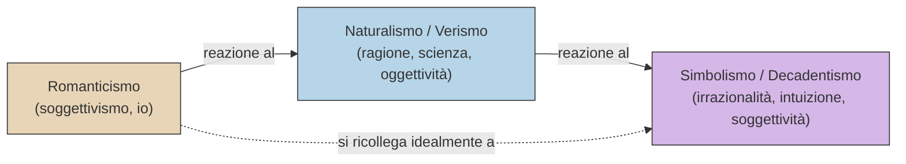
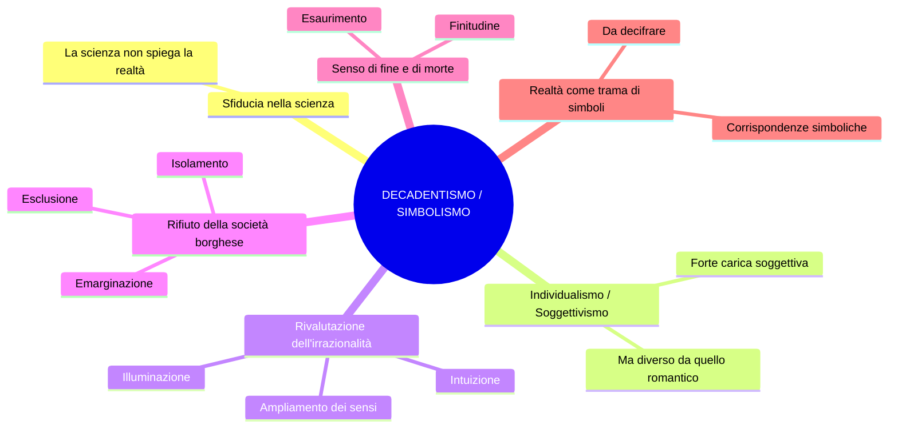
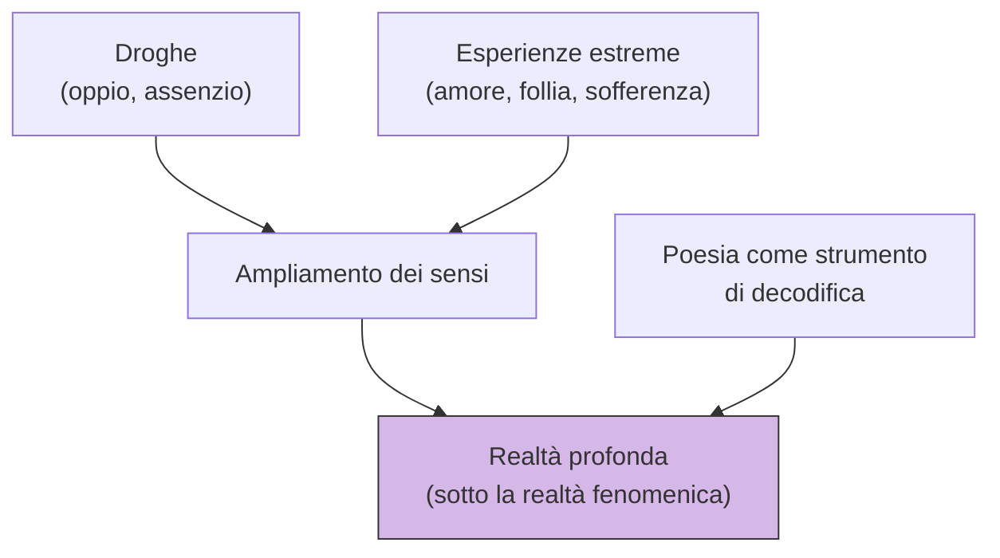
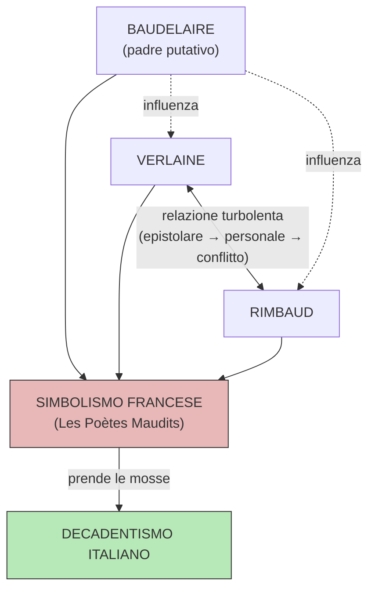
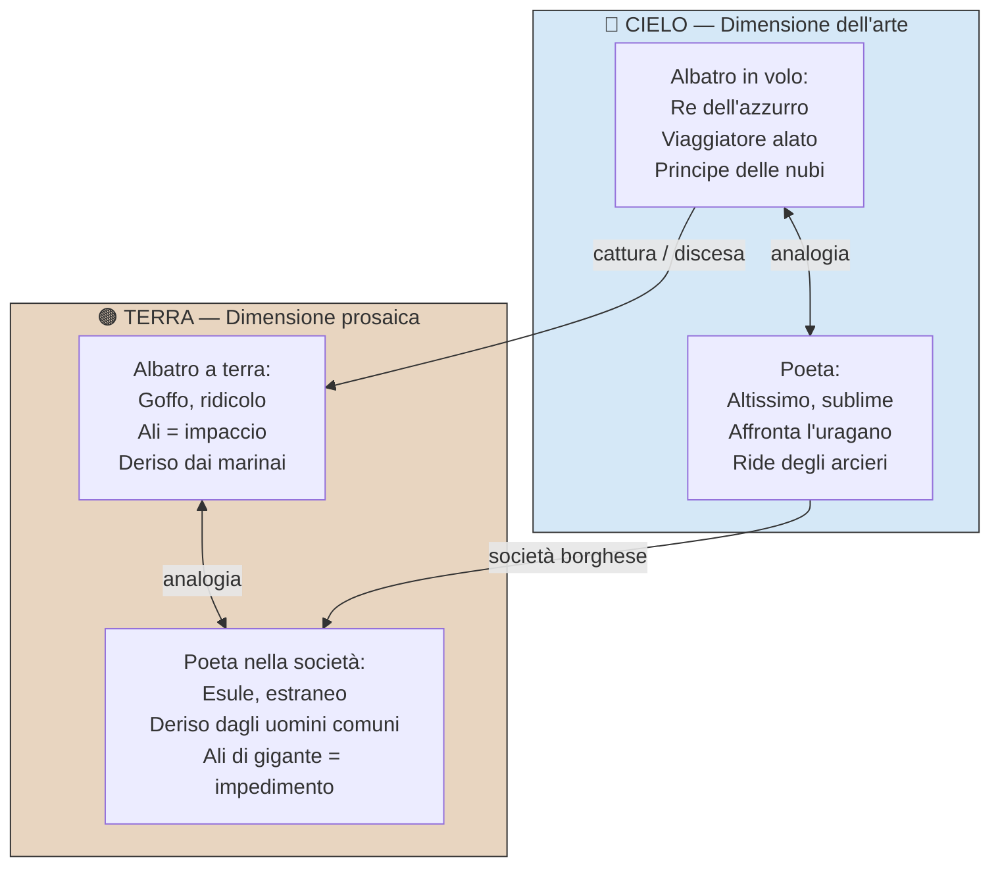
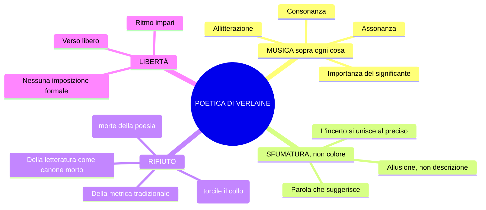
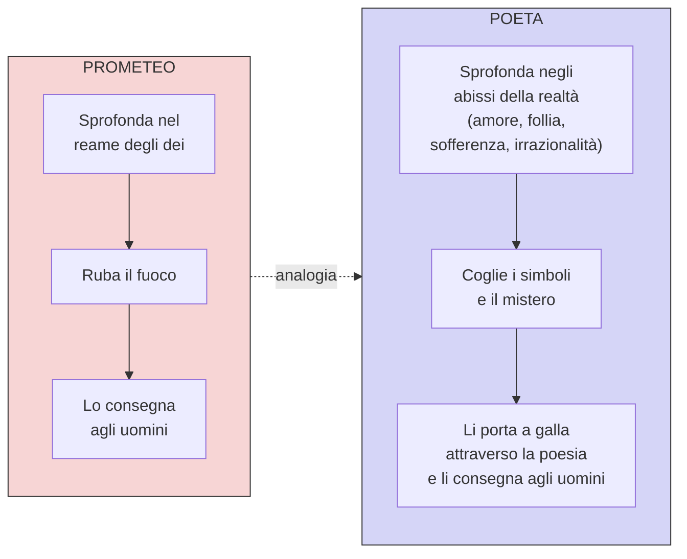
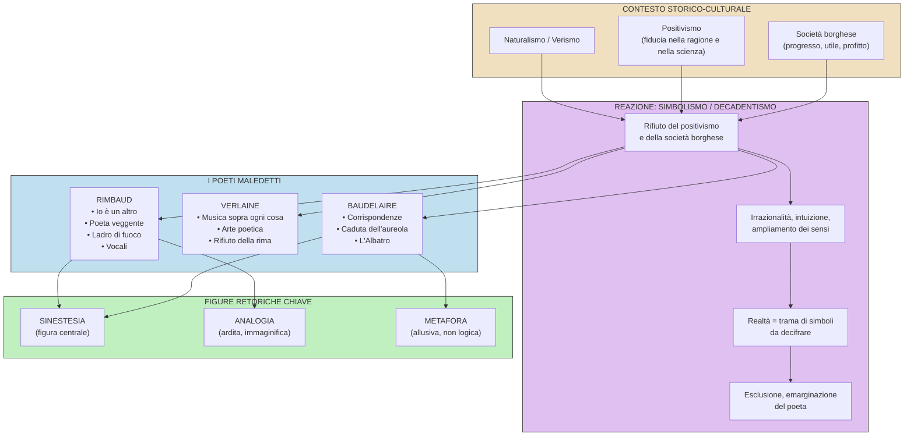

# Decadentismo e Simbolismo Francese

> **Mega-schema di studio** — Lingua e Letteratura Italiana
> **Fonte**: Lezione del 12-02-26
> **Argomento**: Decadentismo, Simbolismo francese, Poeti maledetti (Baudelaire, Verlaine, Rimbaud)

---

## 1. Quadro storico-letterario

### 1.1 Coordinate temporali e geografiche

| | Dettaglio |
|---|---|
| **Periodo** | Anni **80 dell'800** (la prof specifica: "e questo scrivetelo") |
| **Luogo d'origine** | Francia |
| **Corrente madre** | **Simbolismo francese** → da cui nasce il **Decadentismo italiano** |
| **Nome** | Deriva dalla lirica *Languore* di Verlaine: "Sono l'impero alla fine della **decadenza**" |

### 1.2 Rapporto con le correnti precedenti

> **Domanda della prof**: "Questi versi esprimono concetti in continuità o in discontinuità con il Naturalismo e il Verismo?"
> **Risposta**: In **discontinuità** (la prof precisa: "In continuità è la risposta sbagliata")

> **Osservazione della prof**: Il Decadentismo si ricollega idealmente al **Romanticismo** per la "spinta soggettiva, dell'io" e l'"attenzione al senso di fine, della morte, che è il mistero che domina la vita".

### 1.3 Opposizione Naturalismo vs. Simbolismo/Decadentismo

| | Naturalismo / Verismo | Simbolismo / Decadentismo |
|---|---|---|
| **Strumento di conoscenza** | Ragione e scienza | **Irrazionalità**, intuizione, illuminazione |
| **Concezione della realtà** | Conoscibile, fenomenica, oggettiva | **Misteriosa, illusoria, complessa** |
| **Linguaggio** | Fedele alla cosa, "come una fotografia" | **Allusivo, simbolico, evocativo** |
| **Funzione della parola** | Rispecchiare il reale | **Suggerire**, evocare (solo la sfumatura) |
| **Modello** | Il romanzo sperimentale (Zola) | La poesia come profezia e decodifica del mistero |
| **Metrica** | Rispetto delle convenzioni | Rifiuto della metrica tradizionale, verso libero |
| **Posizione filosofica** | Positivismo | **Rifiuto del positivismo** |

---

## 2. I caratteri fondamentali del Decadentismo/Simbolismo

**Punti chiave dettati dalla prof** (in ordine):

1. **Sfiducia nella scienza**: "Questi intellettuali ci dicono che la scienza non spiega la realtà"
2. **Forte carica soggettiva** e individualismo
3. **Rivalutazione dell'irrazionalità**
4. **Senso di fine, della morte**, del mistero che domina la vita
5. **Esclusione e emarginazione**: i poeti rivendicano il loro isolamento rispetto alla società borghese "tutta volta all'utile, al profitto, e disinteressata a ciò che non produce un utile, cioè all'arte, alla poesia"

---

## 3. La realtà secondo i simbolisti

> Secondo questi autori la realtà è **misteriosa**, **illusoria** e **complessa**.
> Dunque, se la realtà è misteriosa vuol dire che è da **decifrare**.

La realtà è una **trama di corrispondenze simboliche**: è fatta di **simboli** che devono essere decifrati non attraverso la ragione, ma attraverso l'**intuizione** e l'**ampliamento dei sensi**.

### Come si accede al mistero della realtà?

> **Nota della prof**: La realtà **fenomenica** (dal greco *phainomai* = apparire) è quella che si vede. I poeti simbolisti indagano "quello che c'è sotto la realtà, cioè tutta una dimensione che non si vede".

---

## 4. I Poeti Maledetti (*Les Poètes Maudits*)

### 4.1 Chi sono

| Poeta | Ruolo | Note |
|---|---|---|
| **Charles Baudelaire** | "Padre putativo", generazione precedente | Precursore, autore fondamentale |
| **Paul Verlaine** | Protagonista del simbolismo, conia il termine | Vita sregolata, alcolismo |
| **Arthur Rimbaud** | Il più giovane e ribelle | Vita raminga, morto a 37 anni |

> **Perché "maledetti"?** Perché conducono "un'esistenza al di fuori dei canoni borghesi" e confidano nel fatto che "la realtà sia conoscibile attraverso un **ampliamento dei sensi**, attraverso un ampliamento delle funzioni psichiche" — realizzato anche attraverso l'uso di **droghe** (oppio, assenzio).

---

## 5. Charles Baudelaire

### 5.1 Opera principale: *I fiori del male* (*Les Fleurs du mal*, 1857)

Raccolta "celeberrima" (parola della prof) che contiene il testo-manifesto della concezione simbolista della realtà.

---

### 5.2 Analisi di *Corrispondenze* (*Correspondances*)

> **Contesto**: Testo che "rappresenta più di tutti la concezione che della realtà propongono i poeti simbolisti".
> Contenuto in *I fiori del male* (1857). Testo in traduzione.

#### Testo integrale (in traduzione)

> La Natura è un tempio dove pilastri vivi
> mormorano a tratti indistinte parole;
> l'uomo passa lì tra foreste di simboli
> che lo osservano con sguardi familiari.
>
> Come echi che a lungo e da lontano
> tendono a una profonda, tenebrosa unità,
> grande come le tenebre o la luce,
> i profumi, i colori e i suoni si rispondono.
>
> Profumi freschi come la carne d'un bambino,
> dolci come l'oboe, verdi come i prati,
> e altri d'una corrotta, trionfante ricchezza,
>
> con tutta l'espansione delle cose infinite:
> l'ambra e il muschio, l'incenso e il benzoino,
> che cantano il trasporto della mente e dei sensi.

#### Analisi verso per verso (spiegazione della prof)

**vv. 1-2: "La Natura è un tempio dove pilastri vivi / mormorano a tratti indistinte parole"**

- **Natura** con la N maiuscola = sinonimo di **realtà**
- La realtà è assimilata all'immagine di un **tempio**
- I "pilastri vivi" mormorano = la realtà "sembra parlare al pari dell'uomo, ma sussurrando parole indistinte, cioè parole **non comprensibili**"

**v. 3: "l'uomo passa lì tra foreste di simboli"**

- "Foreste di simboli" rimanda ai "pilastri vivi" → evocano **alberi**
- La realtà è una **trama di simboli**

**v. 4: "che lo osservano con sguardi familiari"**

- I simboli "lo riconoscono come una parte di loro" → l'uomo **fa parte** della realtà simbolica

**vv. 5-8: "Come echi che a lungo e da lontano / tendono a una profonda, tenebrosa unità..."**

- Inizia una **similitudine**
- Le "indistinte parole" tendono a una **unità** che però è **misteriosa** ("tenebrosa")
- "i profumi, i colori e i suoni si rispondono": tutti i **dati sensoriali** tendono a un'**unità**

**vv. 9-10: "Profumi freschi come la carne d'un bambino, / dolci come l'oboe, verdi come i prati"**

| Espressione | Dato sensoriale 1 | Dato sensoriale 2 | Figura retorica |
|---|---|---|---|
| "Profumi freschi come la carne d'un bambino" | Olfattivo (profumo) | **Tattile** (carne) | **Sinestesia** + similitudine |
| "dolci come l'oboe" | Olfattivo (profumo) | **Uditivo** (oboe) | **Sinestesia** + similitudine |
| "verdi come i prati" | Olfattivo (profumo) | **Visivo** (verde) | **Sinestesia** + similitudine |

**vv. 11-14: "e altri d'una corrotta, trionfante ricchezza... che cantano il trasporto della mente e dei sensi"**

- L'ambra, il muschio, l'incenso e il **benzoino** (= "una resina profumata", spiega la prof) "cantano il trasporto della mente e dei sensi"

#### Figura retorica centrale: la SINESTESIA

> **Domanda della prof**: "Si può spiegare razionalmente la sinestesia?"
> **Risposta**: No. È una figura **evocativa**, allusiva, che "non presenta un nesso causa-effetto".

> **Sintesi della prof**: "È attraverso l'ampliamento delle percezioni sensoriali, che qui vedete sono così insistite, che è possibile accedere al **mistero della realtà** che è costituita da simboli che devono essere decifrati."

---

### 5.3 *Lo Spleen di Parigi* — La caduta dell'aureola

> **Formato**: Testo in **prosa**
> **Titolo**: *Lo Spleen di Parigi*
> **Spleen** (S-P-L-E-E-N): parola inglese che indica "uno stato di malinconia, tristezza, noia" (definizione della prof: "per adesso fermiamoci qui")

> ⚠️ **DA IMPARARE A MEMORIA** (indicazione esplicita della prof): l'espressione **"caduta dell'aureola"**

#### Contenuto

La scena: **dialogo tra un poeta e un uomo qualunque** che si ritrovano in un **bordello** mentre il poeta si ubriaca.

| Elemento | Significato simbolico |
|---|---|
| **Aureola** | Segno della **sacralità** del poeta (come per santi e angeli) |
| **Caduta dell'aureola** | Il poeta ha **perso la sua sacralità**, è diventato un uomo comune |
| **Il Parnaso** | Monte dell'antica Grecia, **sacro alla poesia** |
| **Nettare degli dei / Ambrosia** | Il nutrimento più alto, che si converrebbe a un poeta |
| **Il bordello** | Luogo dell'abiezione, del degrado |
| **Boulevard, cavalli, carrozze** | Contesto urbano, vita **frenetica, alienante, caotica** di Parigi |
| **Fanghiglia del macadam** | Il fango in cui finisce l'aureola — la sacralità del poeta |

#### Passaggi chiave del testo (letti dalla prof)

> "Ehi, ma come? Voi qui, carissimo? Voi in un posto malfamato? Voi, il degustatore di quintessenze? Voi, il divoratore di ambrosia? Sul serio, c'è di che stupirsi"

→ L'uomo qualunque si stupisce di trovare il poeta in un luogo così basso.

> "la mia aureola, a un movimento brusco, mi è scivolata di testa nella fanghiglia del macadam"

→ **L'aureola è scivolata nel fango** durante la vita frenetica della città.

> "Non ho avuto il coraggio di raccoglierla [...] Ora posso andarmene in giro in incognito"

→ Il poeta **rivendica con orgoglio** la sua posizione di marginalità.

> "immagino con gioia che qualche poeta spregevole la raccatterà e impudente se ne acconcerà la testa"

- **Domanda della prof**: "Avete capito questo passaggio?"
- **Risposta dello studente (Francesco)**: Ironicamente risponde che qualcuno la troverà
- **Spiegazione della prof**: "**Ironicamente** risponde che la troverà qualche poeta che se ne approprierà e si farà un capo, pregiandosi di questo titolo senza rendersi conto invece di quale sia ora la condizione autentica del poeta"

#### Doppio atteggiamento di Baudelaire

1. **Critico** nei confronti della "vacuità della società contemporanea, della vita cittadina che è disumana, che è alienante"
2. **Orgoglioso** della propria marginalità

---

### 5.4 Analisi de *L'Albatro* (*L'Albatros*)

> **Riferimento libro**: pagina 35 del libro A
> **Nota della prof**: "Forse l'avete letto alle medie, al biennio"

> **Significato centrale**: L'albatro "raffigura simbolicamente l'immagine, l'essenza del **nuovo poeta**, dell'intellettuale moderno, che è **ridicolo** nella vita di tutti i giorni e invece **altissimo** quando si alza nei cieli dell'arte"

#### Testo integrale (traduzione letta dalla prof)

> Spesso, per divertirsi, i marinai
> prendono degli albatri, grandi uccelli dei mari,
> indolenti compagni di viaggio delle navi
> in lieve corsa sugli abissi amari.
>
> L'hanno appena posato sulla tolda,
> e già il re dell'azzurro, maldestro e vergognoso,
> pietosamente accanto a sé trascina,
> come fossero remi, le grandi ali bianche.
>
> Com'è fiacco e sinistro il viaggiatore alato
> e comico e brutto, lui prima così bello.
> Chi gli mette una pipa sotto il becco,
> chi imita zoppicando lo storpio che volava.
>
> Il poeta è come lui, principe delle nubi
> che sta con l'uragano e ride degli arcieri.
> Esule in terra tra gli scherni,
> non lo lasciano camminare le sue ali di gigante.

#### Analisi verso per verso

**vv. 1-4: "Spesso, per divertirsi, i marinai / prendono degli albatri..."**

- **Indolenti** = "quasi svogliati compagni di viaggio, che seguono il corso della navigazione abbandonandosi al cammino" (parafrasi della prof)

**vv. 5-8: "L'hanno appena posato sulla tolda..."**

- **Soggetto di "l'hanno posato"**: i marinai (la prof lo chiede esplicitamente)
- **Tolda** = il ponte scoperto della nave
- **"Il re dell'azzurro"** = espressione **metaforica** per l'albatro che, quando è libero in volo, **domina i cieli**
- A terra: risulta **goffo e ridicolo**
- Le grandi ali bianche = a terra diventano un **impaccio** (risposta degli studenti, confermata dalla prof)

**vv. 9-12: "Com'è fiacco e sinistro il viaggiatore alato..."**

- **"Viaggiatore alato"** = seconda espressione metaforica (la prof: "queste ve le sottolineo perché le dovete imparare")
- Il passaggio da maestoso (in aria) a ridicolo (a terra) — confermato dalla prof: "Benissimo"
- "Chi gli mette una pipa sotto il becco, chi imita zoppicando" = **dimensione dello scherno**
- I marinai = metafora degli **uomini comuni** che "non riconoscono il valore del poeta. E anzi, non solo non lo riconoscono, ma lo deridono"

**vv. 13-16: "Il poeta è come lui, principe delle nubi..."**

- **"Principe delle nubi"** = terza espressione metaforica (insieme a "re dell'azzurro" e "viaggiatore alato")

> ⚠️ **DA IMPARARE**: Le tre espressioni metaforiche per il poeta/albatro:
> 1. **Re dell'azzurro**
> 2. **Viaggiatore alato**
> 3. **Principe delle nubi**

- "che sta con l'uragano e ride degli arcieri": il poeta è "abituato ad affrontare l'uragano, cioè a misurarsi con tutto ciò che è disturbante, tutto ciò che significa inquietudine, oscurità, mistero. E ride degli arcieri: si fa beffe di coloro che lo vogliono colpire"

- **"Esule"** = parola chiave. Il poeta si riconosce come un **estraneo sulla terra**

- **"Ali di gigante"** = "ali dell'immaginazione, dell'intelletto, dell'arte, della poesia" che "non gli consentono di rimanere in una dimensione bassa, terrena, perché quella che gli appartiene è quella alta, elevata, del cielo"

#### Schema interpretativo dell'Albatro

> **Messaggio centrale** (parole della prof): "Il poeta, come l'albatro, deve coltivare le altezze sublimi dell'arte e non invece il mondo prosastico del consumo, del guadagno, dell'utile, della fretta, del caos. [...] Perché per natura il poeta è un'altra cosa."

---

## 6. Paul Verlaine

### 6.1 Biografia essenziale

| Evento | Dettaglio |
|---|---|
| **18 anni** | Inizia a bere, contrae il vizio dell'**alcolismo** ("diventerà la sua rovina") |
| **Trasferimento** | Dalla provincia a **Parigi**, frequenta scrittori e poeti |
| **~30 anni** | Si sposa con una diciassettenne, ha un figlio |
| **Corrispondenza** | Intrattiene un rapporto epistolare con il giovane **Arthur Rimbaud** |
| **Relazione con Rimbaud** | Rimbaud lo raggiunge a Parigi; relazione "molto appassionata" che "distrugge la vita familiare di Verlaine" |
| **Conflitto** | "Verlaine cerca persino di uccidere Rimbaud sparandogli" |
| **Condanna** | **Due anni di reclusione** |
| **Opere** | Entrano nell'antologia de *I Poeti Maledetti* (*Les Poètes Maudits*) — "pietre miliari della storia della poesia contemporanea" |

> **Sintesi della prof**: "Una vita all'insegna della **sregolatezza**"

### 6.2 Poetica: la musicalità del verso

> **Principio fondamentale**: "*De la musique avant toute chose*" — **"La musica sopra ogni cosa"**

- La musica ha un **linguaggio universale** e "si sottrae ai contenuti, ma parla a tutti"
- Importanza del **significante**, del **suono**
- Figure retoriche predilette: **allitterazione, assonanza, consonanza** (figure del suono)
- **Rifiuto della rima**: "Dice che la rima è la morte della poesia" — perché "ingabbia la poesia"
- **Rifiuto della metrica** e della tradizione

### 6.3 Analisi di *Arte poetica* (*Ars Poetica*, 1874)

> **Definizione**: "Manifesto letterario" di Verlaine

#### Versi chiave letti dalla prof con interpretazione

**"Musica sopra ogni cosa"**
→ Apertura della poesia-manifesto con una **dichiarazione di poetica**

**"E perciò preferisci il ritmo impari, / più vago e solubile nell'aria, / senza nulla che pesi o che posi"**
→ Preferenza per il ritmo dispari, leggero, libero

**"È necessario poi che tu non scelga / le tue parole senza qualche svista: / nulla di più caro della canzone grigia, / dove l'incerto si unisce al preciso"**
→ La poesia deve mantenere una dimensione di **incertezza**, di **indeterminatezza**

**"Perché vogliamo ancora la sfumatura, / non il colore, sol la sfumatura"**

> ⚠️ **DA SCRIVERE** (indicazione esplicita della prof): "Vogliamo solo la sfumatura"

> **Spiegazione della prof**: "La parola poetica deve suggerire, non delineare. Siamo ad anni luce dal Naturalismo, in cui la parola deve essere fedele alla cosa, la deve rispecchiare come una fotografia. Qui il poeta dice che vuole solo la sfumatura, cioè solo l'**allusione**."

**"Prendi l'eloquenza e torcile il collo"**
→ "Uccidila": l'arte del bel parlare nel corso dei secoli "si è definita come una costruzione, uno schema da seguire. Qui domina la volontà di essere liberi da imposizioni"

**"Oh, chi dirà i torti della rima? / [...] quel gioiello da un soldo / che suona vuoto e falso sotto la lima?"**
→ La rima suona "**vuota e falsa** sotto la lima"
→ **Lima** = riferimento al *labor limae* (espressione latina che indica "le rifiniture, l'elaborazione del testo dal punto di vista stilistico" — definizione data dallo studente e confermata dalla prof)

**"Musica ancora e sempre! E tutto il resto è letteratura"**
→ "Tutto il resto è quello che è stato conosciuto, apprezzato, che è entrato nel canone e dunque appartiene a un **mondo morto, passato, che deve essere superato**"

#### Mappa della poetica di Verlaine

---

## 7. Arthur Rimbaud

### 7.1 Biografia essenziale

| Evento | Dettaglio |
|---|---|
| **Nascita** | **1854** |
| **Gioventù** | "Fin da giovane un ragazzo **ribelle**" |
| **Prove poetiche** | Invia i suoi versi a Paul Verlaine |
| **Relazione con Verlaine** | Relazione "turbolenta", vivono di espedienti, chiedono soldi alla madre di Verlaine |
| **Dopo la rottura** | Lite, ferimento (Verlaine gli spara), Rimbaud inizia a **vagabondare a piedi per l'Europa** |
| **Olanda** | Si arruola nell'esercito coloniale, poi **diserta** |
| **Varie** | Lavora in un circo, arriva fino in **Norvegia**, si trasferisce a **Cipro** (capo cantiere) |
| **1880** | Si trasforma in **mercante di pelli e di caffè** |
| **1891** | Violenti dolori al ginocchio → cancro → **amputazione della gamba** |
| **Morte** | Qualche mese dopo, a **Marsiglia**, nel **1891**, a **37 anni** |

> **Commento della prof**: "Questo per dirvi cosa? Per descrivervi una vita assolutamente **sregolata e raminga**"

### 7.2 Poetica: la Lettera del Veggente

> **Formato**: Testo in **prosa**, dichiarazione di poetica

#### "Io è un altro" (*Je est un autre*)

> **Spiegazione della prof**: "Questo non è il soggettivismo, l'individualismo romantico di Leopardi. Quando Leopardi parla del suo dolore, dice 'io', è il suo, poi si carica di una valenza universale. Qui c'è sempre l'io, ma Rimbaud dice 'io è un altro'."

**Significato**: "L'identità non è univoca, monolitica; sta dicendo che l'identità sua, di ciascuno, è **caos**."

#### Il poeta come Veggente

> "Io dico che bisogna esser **veggente**, farsi veggente"

- Il veggente = "colui che vede ciò che all'uomo comune è negato"
- Il poeta si muove nella dimensione della **profezia** "in cui tutto può essere rivelato e che può risultare vero e falso nello stesso tempo"
- "Il poeta coglie nella realtà e negli uomini ciò che altri non vedono"

#### Come si fa a farsi veggente?

> "Il poeta si fa veggente mediante un **'lungo, immenso e ragionato disordine di tutti i sensi'**"

- Attraverso il **disordine di tutti i sensi**: "tutte le forme d'amore, di sofferenza, di pazzia"
- "Egli cerca se stesso e riesce così a giungere all'ignoto, poiché ha coltivato la sua anima, già ricca più di qualsiasi altra"

#### Il poeta come "ladro di fuoco" (analogia con Prometeo)

> ⚠️ **Concetto spiegato due volte dalla prof** (uno studente chiede di ripetere)

> **Spiegazione della prof (seconda volta, più chiara)**: "**Ladro di fuoco** vuol dire che il poeta non esita a calarsi in tutte le esperienze del dolore, dell'amore, della pazzia, non esita a calarsi nell'abisso della realtà, anche nelle sue parti più inquietanti. E in questo modo attinge a una verità, coglie i simboli della realtà e ne porta il significato agli uomini, così come Prometeo ha rubato il fuoco agli dei per consegnarlo agli uomini."

### 7.3 Analisi di *Vocali* (*Voyelles*)

> **Riferimento libro**: pagina 146 (circa)
> **Nota della prof**: "L'avete letto alle medie o alle elementari?"

> **Principio**: "Il poeta associa suoni e colori in assoluta libertà, quasi a riprodurre attraverso la poesia il linguaggio profondo e misterioso della realtà"

#### Testo letto dalla prof con analisi

**"A nera, E bianca, I rossa, U verde, O blu"**

→ Il poeta **associa il suono di una vocale a un colore** (la prof chiede: "È vero che la O è blu? Riuscite a immaginarvela?" — segue discussione tra studenti)

#### Schema delle associazioni vocale → colore → immagini

| Vocale | Colore | Immagini associate | Note |
|---|---|---|---|
| **A** | **Nera** | "nero vello al corpo delle mosche lucenti che ronzano al di sopra dei crudeli **fetori**, golfi d'ombra" | Analogia "molto ardita" (prof): associata al corpo nero delle mosche e a un odore sgradevole, repellente |
| **E** | **Bianca** | "candori di vapori e di tende, lance di ghiaccio, brividi di **umbelle** (= chioma del fiore), bianchi re" | Immagini di candore e purezza |
| **I** | **Rossa** | "porpore, rigurgito di sangue, labbra belle che ridono di collera, di ebrezza penitente" | Sangue, labbra, collera, ebrezza |
| **U** | **Verde** | "cicli, vibrazioni sacre dei mari viridi, quiete di bestie al pascolo, ampie rughe che alle fronti studiose imprime l'alchimia" | Quiete, natura, studio |
| **O** | **Blu** | "la suprema **tuba** (= tromba), piena di stridi strani, silenzi attraversati dagli angeli e dai mondi. O, l'omega e il raggio violetto dei suoi occhi" | Dimensione cosmica, trascendente |

> **Commento finale della prof**: "Noi la possiamo afferrare razionalmente questa poesia? Eh, insomma. È tutta basata su aspetti fonetici, musicali e sugli aspetti **sinestetici** della realtà. Sono questi i simboli di cui parlano i poeti maledetti che devono essere decifrati attraverso la poesia."

→ Fitta trama di **sinestesie** con associazioni "fantasiose, immaginifiche".

---

## 8. Mappa concettuale complessiva

---

## 9. Domande emerse in classe (Q&A)

| Domanda / Interazione | Risposta della prof |
|---|---|
| "Questi versi sono in continuità con il Naturalismo?" (Lorenzo) | "In continuità è la **risposta sbagliata**" — sono in netta discontinuità |
| "Come si conosce la realtà se non con la ragione?" — "La fede?" | "Ma manco per niente" |
| "L'edonismo?" | "No, anche se c'è una certa dose di ricerca dell'assoluto" → La risposta è l'**irrazionalità** |
| "La sinestesia si può spiegare razionalmente?" | No, è una figura **evocativa**, senza nesso causa-effetto |
| "Verlaine amava le rime?" | "Dice che la rima è la **morte della poesia**" perché ingabbia |
| "Può ripetere la parte del ladro di fuoco?" | La prof ripete l'analogia Prometeo/poeta (vedi sezione 7.2) |

### Interrogazione del 09/04/26 — Ripasso simbolismo e decadentismo

*(Estratto dalle interrogazioni orali in classe — parte finale della lezione)*

**D: Quali sono i caratteri che accomunano i poeti maledetti?**
**R** (studente, valutata positivamente dalla prof): I poeti maledetti rientrano nel Decadentismo, corrente che rifiuta la fiducia nella scienza e nello scientismo del Positivismo. In particolare Baudelaire, Verlaine e Rimbaud sono simbolisti francesi. Il Simbolismo sostiene che il significato vero delle cose non è indagabile dalla scienza, ma è ritrovabile tramite **intuizioni, sensazioni e simboli**. Il manifesto del simbolismo è *Art poétique* di Verlaine: la musica deve stare al centro, la letteratura deve «storcere il collo all'eloquenza».

**D: Perché si chiamano «poeti maledetti» (*poètes maudits*)?**
**R**: Perché sono poeti isolati dalla società, contro il Positivismo. Non solo si sentono isolati, ma rivendicano attivamente questo isolamento — vogliono frequentare i **luoghi malfamati** e dell'**abiezione** per vivere tutta la gamma delle sensazioni possibili. Baudelaire in *Lo Spleen di Parigi* dichiara di essere stufo del Parnaso e ha «perso l'aureola nel fango di Parigi». Attraverso questa immagine: il poeta non è più una divinità ma un uomo comune, la sua arte non è più riconosciuta.

**D: Come si esprime a livello poetico il senso di esclusione del poeta? Che opera di Baudelaire lo esprime al massimo grado?**
**R**: ***L'albatro*** (1859). La figura del poeta viene paragonata a quella dell'albatro: maestoso in volo (le ali = la genialità), ma goffo e deriso sulla terra. Così il poeta sulla terra viene deriso dagli uomini e non capito.

**D: Quali sono i due autori del Decadentismo italiano e come si distinguono?**
**R**: Giovanni Pascoli e Gabriele D'Annunzio. Partono dalla stessa matrice (la realtà è conoscibile solo tramite irrazionalità e intuizione; la realtà è misteriosa, elusiva) ma arrivano a esiti molto diversi:
- *Ideologie*: Pascoli inizialmente socialista (poi nazionalismo); D'Annunzio nazionalista, immagine eroica di sé, egocentrico
- *Figura del poeta*: Pascoli = **fanciullino** (voce bambina interiore, si meraviglia del quotidiano); D'Annunzio = **vate/esteta** (guida spirituale con capacità sovrumane)

**D: Prima raccolta di Pascoli e suoi temi?**
**R**: ***Myricae*** (dal latino *myricae* = tamerici, da un verso di Virgilio, *Bucoliche*). Pianta umile che nasce in luoghi sabbiosi → metafora delle piccole cose quotidiane che destano meraviglia agli occhi del fanciullino. Opere chiave: *X Agosto* (morte del padre), *L'assiuolo*.

**D: Di *X Agosto*, struttura e temi principali?**
**R**: Il giorno di San Lorenzo (10 agosto), le stelle cadenti = pianto del cielo. Una rondine viene uccisa mentre porta cibo alle rondinelle → associata alla figura di Cristo. La morte del padre di Pascoli è il trauma centrale della sua vita.

---

## 10. Espressioni e concetti da sapere a memoria

| Espressione | Autore | Significato |
|---|---|---|
| **"Caduta dell'aureola"** | Baudelaire | Il poeta ha perso la sua sacralità nella società moderna — **DA IMPARARE A MEMORIA** (indicazione esplicita della prof) |
| **"Re dell'azzurro"** | Baudelaire | Metafora per il poeta/albatro libero in volo |
| **"Viaggiatore alato"** | Baudelaire | Idem — la prof: "le dovete imparare" |
| **"Principe delle nubi"** | Baudelaire | Idem |
| **"Esule in terra"** | Baudelaire | Il poeta è un estraneo sulla terra |
| **"Ali di gigante"** | Baudelaire | L'immaginazione/arte che impedisce di vivere nella dimensione terrena |
| **"De la musique avant toute chose"** | Verlaine | "La musica sopra ogni cosa" |
| **"Sol la sfumatura"** | Verlaine | La parola deve suggerire, non delineare — la prof: "scrivetelo" |
| **"Prendi l'eloquenza e torcile il collo"** | Verlaine | Uccidi l'arte del bel parlare tradizionale |
| **"Io è un altro"** | Rimbaud | L'identità è caos, non univoca |
| **"Farsi veggente"** | Rimbaud | Il poeta vede ciò che è negato all'uomo comune |
| **"Lungo, immenso e ragionato disordine di tutti i sensi"** | Rimbaud | Il metodo per diventare veggente |
| **"Ladro di fuoco"** | Rimbaud | Analogia con Prometeo: il poeta ruba la verità dal mistero e la porta agli uomini |

---

## 11. Glossario

| Termine | Definizione (dalla lezione) |
|---|---|
| **Fenomeno** | Dal greco *phainomai* = apparire. La realtà fenomenica è "quella che si vede" |
| **Spleen** | Parola inglese: stato di malinconia, tristezza, noia |
| **Parnaso** | Monte dell'antica Grecia, sacro alla poesia |
| **Ambrosia / Nettare degli dei** | Il nutrimento più alto, che si converrebbe a un poeta |
| **Tolda** | Il ponte scoperto di una nave |
| **Sinestesia** | Figura retorica che fonde ambiti sensoriali diversi; non è spiegabile razionalmente |
| **Acrostico** | Componimento in versi (dalla prof: "qualcuno fa la settimana enigmistica, spero") |
| **Umbelle** | "La chioma del fiore" (definizione data dalla prof durante lettura di *Vocali*) |
| **Benzoino** | "Una resina profumata" |
| **Tuba** | "La tromba" (strumento musicale) |
| **Labor limae** | Espressione latina: le rifiniture, l'elaborazione del testo dal punto di vista stilistico |
| **Macadam** | Tipo di pavimentazione stradale (contesto: dove cade l'aureola) |

---

## 12. Lacune e segnalazioni

> ⚠️ **ATTENZIONE**: Questo schema si basa su **UNA SOLA lezione**. I seguenti aspetti risultano **incompleti o assenti** e richiedono integrazione:

### Argomenti non trattati o solo accennati
- **Decadentismo italiano**: la prof dice che "dal simbolismo prende le mosse il decadentismo italiano" ma **non tratta gli autori italiani** (D'Annunzio, Pascoli, Fogazzaro, etc.)
- **Lirica *Languore* di Verlaine**: citata come origine del nome "Decadentismo" ma **non analizzata** nel dettaglio (solo i primi versi)
- **Contesto storico-sociale**: accennato rapidamente, manca un approfondimento sulla crisi di fine secolo
- **Rapporto con il Romanticismo**: citato come collegamento ma non sviluppato
- ***I fiori del male***: citata solo *Corrispondenze*, la raccolta merita studio più ampio
- **Rimbaud — *Una stagione all'inferno* e *Illuminazioni***: non menzionati
- **Stéphane Mallarmé**: non menzionato (altro grande simbolista francese)

### Riferimenti a Classroom / compiti / verifiche
- La prof menziona un **test di analisi del testo** (alla quarta ora): "Test di analisi del testo, va bene?"
- Riferimento a un **tema di italiano** che uno studente chiede — la prof risponde: "Bisogna che tu me lo ricordi la prossima volta"
- Prossime lezioni: non più lunedì e martedì ("saremo a Bussoleno"), ripresa da **giovedì**
- La prof chiede: "C'è qualcuno che si offre in italiano?" → possibile interrogazione imminente

### Testi da studiare sul libro
- ***Corrispondenze*** di Baudelaire — presente sul libro
- ***L'Albatro*** di Baudelaire — **pagina 35, libro A** (la prof: "provate a fare l'analisi")
- ***Lettera del Veggente*** di Rimbaud — **pagina 146** circa
- ***Vocali*** di Rimbaud — presente sul libro (pagina 146 circa)
- ***L'Impero alla fine della decadenza*** (Verlaine, *Languore*) — uno studente conferma che c'è sul libro
- ***Arte poetica*** di Verlaine — da verificare sul libro

---

> *Schema generato dalla lezione del 12-02-26. Verificare sempre sul libro di testo per i testi integrali e le note critiche.*
