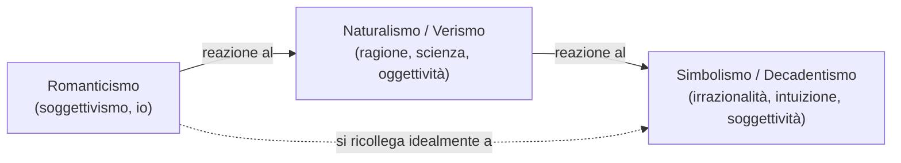
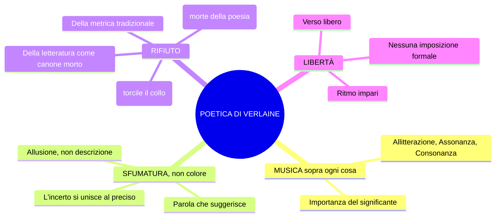
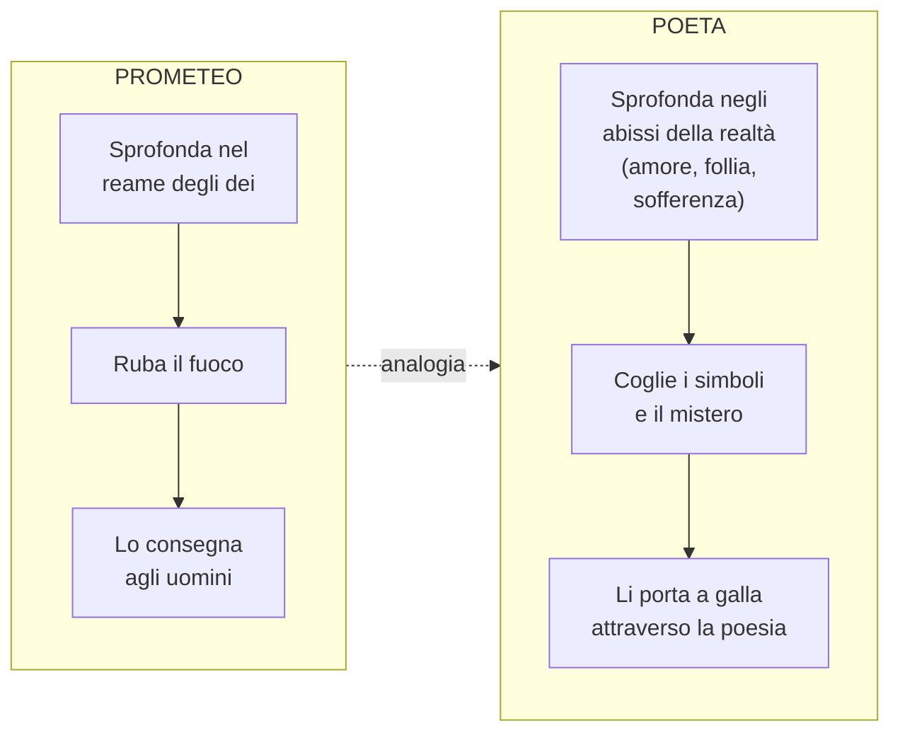

# Decadentismo e Simbolismo Francese — Riassunto

> **Fonte**: Lezione del 12-02-26
> **Argomento**: Decadentismo, Simbolismo francese, Poeti maledetti (Baudelaire, Verlaine, Rimbaud)

---

## 1. Quadro storico-letterario

### 1.1 Coordinate temporali e geografiche

| | Dettaglio |
|---|---|
| **Periodo** | Anni **80 dell'800** ("e questo scrivetelo") |
| **Luogo d'origine** | Francia |
| **Corrente madre** | **Simbolismo francese** → da cui nasce il **Decadentismo italiano** |
| **Nome** | Da *Languore* di Verlaine: "Sono l'impero alla fine della **decadenza**" |

### 1.2 Rapporto con le correnti precedenti

Il Decadentismo è in netta **discontinuità** con Naturalismo e Verismo ("In continuità è la risposta sbagliata"), ma si ricollega idealmente al **Romanticismo** per la "spinta soggettiva, dell'io" e l'"attenzione al senso di fine, della morte, che è il mistero che domina la vita".

### 1.3 Naturalismo vs. Simbolismo/Decadentismo

| | Naturalismo / Verismo | Simbolismo / Decadentismo |
|---|---|---|
| **Strumento di conoscenza** | Ragione e scienza | **Irrazionalità**, intuizione, illuminazione |
| **Concezione della realtà** | Conoscibile, fenomenica, oggettiva | **Misteriosa, illusoria, complessa** |
| **Linguaggio** | Fedele alla cosa, "come una fotografia" | **Allusivo, simbolico, evocativo** |
| **Funzione della parola** | Rispecchiare il reale | **Suggerire**, evocare (solo la sfumatura) |
| **Modello** | Il romanzo sperimentale (Zola) | La poesia come profezia e decodifica del mistero |
| **Metrica** | Rispetto delle convenzioni | Rifiuto della metrica tradizionale, verso libero |
| **Posizione filosofica** | Positivismo | **Rifiuto del positivismo** |

---

## 2. Caratteri fondamentali del Decadentismo/Simbolismo

1. **Sfiducia nella scienza**: "Questi intellettuali ci dicono che la scienza non spiega la realtà"
2. **Forte carica soggettiva** e individualismo (ma diverso da quello romantico)
3. **Rivalutazione dell'irrazionalità**: intuizione, illuminazione, ampliamento dei sensi
4. **Senso di fine, della morte**, del mistero che domina la vita
5. **Esclusione e emarginazione**: i poeti rivendicano il loro isolamento rispetto alla società borghese "tutta volta all'utile, al profitto, e disinteressata a ciò che non produce un utile, cioè all'arte, alla poesia"

---

## 3. La realtà secondo i simbolisti

La realtà è **misteriosa**, **illusoria** e **complessa** → dunque è da **decifrare**. È una **trama di corrispondenze simboliche**: fatta di **simboli** che devono essere decifrati non attraverso la ragione, ma attraverso l'**intuizione** e l'**ampliamento dei sensi**.

**Come si accede al mistero della realtà?**
- **Droghe** (oppio, assenzio)
- **Esperienze estreme** (amore, follia, sofferenza)
- La **poesia come strumento di decodifica**

> La realtà **fenomenica** (dal greco *phainomai* = apparire) è quella che si vede. I poeti simbolisti indagano "quello che c'è sotto la realtà, cioè tutta una dimensione che non si vede".

---

## 4. I Poeti Maledetti (*Les Poètes Maudits*)

| Poeta | Ruolo | Note |
|---|---|---|
| **Charles Baudelaire** | "Padre putativo", generazione precedente | Precursore, autore fondamentale |
| **Paul Verlaine** | Protagonista del simbolismo, conia il termine | Vita sregolata, alcolismo |
| **Arthur Rimbaud** | Il più giovane e ribelle | Vita raminga, morto a 37 anni |

**Perché "maledetti"?** Conducono "un'esistenza al di fuori dei canoni borghesi" e confidano nel fatto che "la realtà sia conoscibile attraverso un **ampliamento dei sensi**, attraverso un ampliamento delle funzioni psichiche" — anche attraverso l'uso di **droghe** (oppio, assenzio).

---

## 5. Charles Baudelaire

### 5.1 *Corrispondenze* (da *I fiori del male*, 1857)

Raccolta "celeberrima" contenente il testo-manifesto della concezione simbolista della realtà.

> La Natura è un tempio dove pilastri vivi
> mormorano a tratti indistinte parole;
> l'uomo passa lì tra **foreste di simboli**
> che lo osservano con sguardi familiari.
>
> Come echi che a lungo e da lontano
> tendono a una profonda, tenebrosa unità,
> grande come le tenebre o la luce,
> **i profumi, i colori e i suoni si rispondono**.
>
> Profumi freschi come la carne d'un bambino,
> dolci come l'oboe, verdi come i prati,
> e altri d'una corrotta, trionfante ricchezza,
>
> con tutta l'espansione delle cose infinite:
> l'ambra e il muschio, l'incenso e il benzoino,
> che cantano il trasporto della mente e dei sensi.

**Analisi dei punti chiave**:

- **Natura** (N maiuscola) = sinonimo di **realtà**, assimilata all'immagine di un **tempio**
- "Pilastri vivi" mormorano parole **non comprensibili** → la realtà parla all'uomo, ma in modo indistinto, da decifrare
- **"Foreste di simboli"** → i "pilastri vivi" evocano alberi; la realtà è una **trama di simboli**
- I simboli "lo osservano con sguardi familiari": l'uomo **fa parte** della realtà simbolica
- Le "indistinte parole" tendono a un'**unità** che però è **misteriosa** ("tenebrosa")
- **"I profumi, i colori e i suoni si rispondono"**: tutti i dati sensoriali tendono a un'**unità**

**Figura retorica centrale: la SINESTESIA**

| Espressione | Dato sensoriale 1 | Dato sensoriale 2 | Figura retorica |
|---|---|---|---|
| "Profumi freschi come la carne d'un bambino" | Olfattivo (profumo) | **Tattile** (carne) | **Sinestesia** + similitudine |
| "dolci come l'oboe" | Olfattivo (profumo) | **Uditivo** (oboe) | **Sinestesia** + similitudine |
| "verdi come i prati" | Olfattivo (profumo) | **Visivo** (verde) | **Sinestesia** + similitudine |

La sinestesia **non si spiega razionalmente**: è una figura **evocativa**, allusiva, "che non presenta un nesso causa-effetto". È attraverso l'ampliamento delle percezioni sensoriali che è possibile accedere al **mistero della realtà**.

### 5.2 *La caduta dell'aureola* (da *Lo Spleen di Parigi*)

**Spleen** (S-P-L-E-E-N) = parola inglese che indica "uno stato di malinconia, tristezza, noia".

> ⚠️ **DA IMPARARE A MEMORIA** (indicazione esplicita della prof): l'espressione **"caduta dell'aureola"**

**Contenuto**: Dialogo tra un **poeta** e un **uomo qualunque** che si ritrovano in un **bordello** mentre il poeta si ubriaca.

| Elemento | Significato simbolico |
|---|---|
| **Aureola** | Segno della **sacralità** del poeta (come per santi e angeli) |
| **Caduta dell'aureola** | Il poeta ha **perso la sua sacralità**, è diventato un uomo comune |
| **Il Parnaso** | Monte dell'antica Grecia, **sacro alla poesia** |
| **Il bordello** | Luogo dell'abiezione, del degrado |
| **Boulevard, cavalli, carrozze** | Contesto urbano, vita **frenetica, alienante, caotica** di Parigi |
| **Fanghiglia del macadam** | Il fango in cui finisce l'aureola — la sacralità del poeta |

Passaggi chiave: l'aureola è scivolata "nella fanghiglia del macadam" durante la vita frenetica della città; il poeta **non la raccoglie** e rivendica con orgoglio la sua marginalità; ironicamente, "qualche poeta spregevole la raccatterà e impudente se ne acconcerà la testa" — senza capire la condizione autentica del poeta.

**Doppio atteggiamento di Baudelaire**: (1) **critico** verso "la vacuità della società contemporanea, della vita cittadina che è disumana, che è alienante"; (2) **orgoglioso** della propria marginalità.

### 5.3 *L'Albatro*

L'albatro "raffigura simbolicamente l'immagine, l'essenza del **nuovo poeta**, dell'intellettuale moderno, che è **ridicolo** nella vita di tutti i giorni e invece **altissimo** quando si alza nei cieli dell'arte".

Versi chiave:

> L'hanno appena posato sulla tolda,
> e già il **re dell'azzurro**, maldestro e vergognoso,
> pietosamente accanto a sé trascina,
> come fossero remi, le grandi ali bianche.
>
> [...]
>
> Il poeta è come lui, **principe delle nubi**
> che sta con l'uragano e ride degli arcieri.
> **Esule in terra** tra gli scherni,
> non lo lasciano camminare le sue **ali di gigante**.

> ⚠️ **DA IMPARARE**: Le tre espressioni metaforiche per il poeta/albatro:
> 1. **Re dell'azzurro**
> 2. **Viaggiatore alato**
> 3. **Principe delle nubi**

**Analisi dei punti chiave**:
- **Tolda** = il ponte scoperto della nave
- **"Re dell'azzurro"** = espressione metaforica per l'albatro che, in volo, **domina i cieli**; a terra risulta **goffo e ridicolo**
- Le grandi ali bianche a terra diventano un **impaccio**
- I marinai lo deridono ("chi gli mette una pipa sotto il becco, chi imita zoppicando") = metafora degli **uomini comuni** che non riconoscono il valore del poeta e lo deridono
- **"Sta con l'uragano e ride degli arcieri"**: il poeta affronta ciò che è disturbante, inquietante, misterioso; si fa beffe di chi lo vuole colpire
- **"Esule"**: parola chiave — il poeta è un **estraneo sulla terra**
- **"Ali di gigante"** = "ali dell'immaginazione, dell'intelletto, dell'arte, della poesia" che non gli consentono di vivere nella dimensione terrena

| Dimensione | Albatro | Poeta |
|---|---|---|
| **Cielo** (arte) | Maestoso, domina i cieli | Sublime, affronta l'uragano, ride degli arcieri |
| **Terra** (società) | Goffo, ridicolo, ali = impaccio, deriso | Esule, estraneo, ali di gigante = impedimento, deriso |

> **Messaggio centrale**: "Il poeta, come l'albatro, deve coltivare le altezze sublimi dell'arte e non il mondo prosastico del consumo, del guadagno, dell'utile. Perché per natura il poeta è un'altra cosa."

---

## 6. Paul Verlaine

### 6.1 Biografia essenziale

Dall'età di 18 anni inizia a bere (alcolismo "diventerà la sua rovina"). Si trasferisce dalla provincia a Parigi. Si sposa con una diciassettenne, ha un figlio. Intrattiene un rapporto epistolare con il giovane Rimbaud, che lo raggiunge a Parigi: relazione "molto appassionata" che "distrugge la vita familiare di Verlaine". Cerca di uccidere Rimbaud sparandogli → **due anni di reclusione**. "Una vita all'insegna della sregolatezza."

### 6.2 Poetica: la musicalità del verso

> **Principio fondamentale**: "*De la musique avant toute chose*" — **"La musica sopra ogni cosa"**

- La musica ha un **linguaggio universale**, "si sottrae ai contenuti, ma parla a tutti"
- Importanza del **significante**, del **suono**
- Figure retoriche predilette: **allitterazione, assonanza, consonanza** (figure del suono)
- **Rifiuto della rima**: "Dice che la rima è la morte della poesia" — perché "ingabbia la poesia"
- **Rifiuto della metrica** e della tradizione

### 6.3 *Arte poetica* (1874) — versi chiave con interpretazione

**"Musica sopra ogni cosa"** → dichiarazione di poetica

**"E perciò preferisci il ritmo impari, / più vago e solubile nell'aria, / senza nulla che pesi o che posi"** → preferenza per il ritmo dispari, leggero, libero

**"Nulla di più caro della canzone grigia, / dove l'incerto si unisce al preciso"** → la poesia deve mantenere una dimensione di **incertezza** e **indeterminatezza**

**"Vogliamo ancora la sfumatura, / non il colore, sol la sfumatura"**
> ⚠️ **DA SCRIVERE** (indicazione della prof): "La parola poetica deve suggerire, non delineare. Siamo ad anni luce dal Naturalismo. Il poeta vuole solo la sfumatura, cioè solo l'**allusione**."

**"Prendi l'eloquenza e torcile il collo"** → "Uccidila": l'arte del bel parlare "si è definita come uno schema da seguire. Qui domina la volontà di essere liberi da imposizioni"

**"Oh, chi dirà i torti della rima? [...] quel gioiello da un soldo / che suona vuoto e falso sotto la lima?"** → la rima suona "**vuota e falsa** sotto la lima" (*labor limae* = le rifiniture, l'elaborazione stilistica del testo)

**"Musica ancora e sempre! E tutto il resto è letteratura"** → "Tutto il resto è quello che appartiene a un **mondo morto, passato, che deve essere superato**"

---

## 7. Arthur Rimbaud

### 7.1 Biografia essenziale

Nato nel **1854**, fin da giovane "un ragazzo **ribelle**". Invia i suoi versi a Verlaine; relazione turbolenta (Verlaine gli spara → ferimento). Rimbaud inizia a vagabondare a piedi per l'Europa: si arruola nell'esercito coloniale olandese e poi **diserta**, lavora in un circo, arriva fino in Norvegia, si trasferisce a Cipro (capo cantiere). Nel 1880 diventa **mercante di pelli e di caffè**. Nel 1891: cancro, amputazione della gamba, morte a **Marsiglia** a **37 anni**. "Una vita assolutamente sregolata e raminga."

### 7.2 Poetica: la Lettera del Veggente

#### "Io è un altro" (*Je est un autre*)

Non è il soggettivismo romantico di Leopardi (quando Leopardi dice "io", è il suo dolore che poi si carica di valenza universale). Rimbaud dice: "L'identità non è univoca, monolitica; l'identità è **caos**."

#### Il poeta come Veggente

> "Io dico che bisogna esser **veggente**, farsi veggente"

- Il veggente = "colui che vede ciò che all'uomo comune è negato"
- Il poeta si muove nella dimensione della **profezia**, "in cui tutto può essere rivelato"
- Come si fa? Mediante un **"lungo, immenso e ragionato disordine di tutti i sensi"**: "tutte le forme d'amore, di sofferenza, di pazzia"

#### Il poeta come "ladro di fuoco" (analogia con Prometeo)

> "Il poeta non esita a calarsi in tutte le esperienze del dolore, dell'amore, della pazzia, non esita a calarsi nell'abisso della realtà. E in questo modo attinge a una verità, coglie i simboli della realtà e ne porta il significato agli uomini, così come Prometeo ha rubato il fuoco agli dei per consegnarlo agli uomini."

### 7.3 *Vocali* (*Voyelles*)

Il poeta associa suoni e colori in assoluta libertà, "quasi a riprodurre attraverso la poesia il linguaggio profondo e misterioso della realtà".

**"A nera, E bianca, I rossa, U verde, O blu"** → associazione suono-colore.

| Vocale | Colore | Immagini associate |
|---|---|---|
| **A** | **Nera** | "nero vello al corpo delle mosche lucenti", crudeli fetori, golfi d'ombra |
| **E** | **Bianca** | Candori di vapori, lance di ghiaccio, brividi di umbelle (= chioma del fiore), bianchi re |
| **I** | **Rossa** | Porpore, rigurgito di sangue, labbra belle, collera, ebrezza penitente |
| **U** | **Verde** | Vibrazioni sacre dei mari, quiete di bestie al pascolo, rughe di fronti studiose |
| **O** | **Blu** | La suprema tuba (= tromba), silenzi attraversati dagli angeli, omega, raggio violetto |

Fitta trama di **sinestesie** con associazioni "fantasiose, immaginifiche". Non afferrabile razionalmente: "È tutta basata su aspetti fonetici, musicali e sugli aspetti **sinestetici** della realtà."

---

## 8. Espressioni e concetti da sapere a memoria

| Espressione | Autore | Significato |
|---|---|---|
| **"Caduta dell'aureola"** | Baudelaire | Perdita della sacralità del poeta nella società moderna — **DA IMPARARE A MEMORIA** |
| **"Re dell'azzurro"** | Baudelaire | Metafora per il poeta/albatro libero in volo |
| **"Viaggiatore alato"** | Baudelaire | Idem — "le dovete imparare" |
| **"Principe delle nubi"** | Baudelaire | Idem |
| **"Esule in terra"** | Baudelaire | Il poeta è un estraneo sulla terra |
| **"Ali di gigante"** | Baudelaire | L'immaginazione/arte che impedisce la dimensione terrena |
| **"De la musique avant toute chose"** | Verlaine | "La musica sopra ogni cosa" |
| **"Sol la sfumatura"** | Verlaine | La parola deve suggerire, non delineare — "scrivetelo" |
| **"Prendi l'eloquenza e torcile il collo"** | Verlaine | Uccidi l'arte del bel parlare tradizionale |
| **"Io è un altro"** | Rimbaud | L'identità è caos, non univoca |
| **"Farsi veggente"** | Rimbaud | Il poeta vede ciò che è negato all'uomo comune |
| **"Lungo, immenso e ragionato disordine di tutti i sensi"** | Rimbaud | Il metodo per diventare veggente |
| **"Ladro di fuoco"** | Rimbaud | Analogia con Prometeo: ruba la verità dal mistero e la porta agli uomini |

---

## 9. Glossario essenziale

| Termine | Definizione |
|---|---|
| **Fenomeno** | Dal greco *phainomai* = apparire. La realtà fenomenica è "quella che si vede" |
| **Spleen** | Parola inglese: stato di malinconia, tristezza, noia |
| **Parnaso** | Monte dell'antica Grecia, sacro alla poesia |
| **Sinestesia** | Figura retorica che fonde ambiti sensoriali diversi; non spiegabile razionalmente |
| **Tolda** | Il ponte scoperto di una nave |
| **Umbelle** | "La chioma del fiore" |
| **Benzoino** | "Una resina profumata" |
| **Tuba** | "La tromba" (strumento musicale) |
| **Labor limae** | Espressione latina: le rifiniture, l'elaborazione del testo dal punto di vista stilistico |
| **Macadam** | Tipo di pavimentazione stradale (dove cade l'aureola) |

---

## 10. Lacune e segnalazioni

> ⚠️ Schema basato su **una sola lezione**. Aspetti incompleti o assenti:

- **Decadentismo italiano**: non trattati gli autori (D'Annunzio, Pascoli, Fogazzaro, ecc.)
- **Lirica *Languore* di Verlaine**: citata come origine del nome ma non analizzata
- **Contesto storico-sociale**: manca approfondimento sulla crisi di fine secolo
- **Rapporto con il Romanticismo**: citato ma non sviluppato
- ***I fiori del male***: analizzata solo *Corrispondenze*, la raccolta merita studio più ampio
- **Rimbaud**: non menzionati *Una stagione all'inferno* e *Illuminazioni*
- **Stéphane Mallarmé**: non menzionato

**Testi da studiare sul libro**: *Corrispondenze*, *L'Albatro* (p. 35, libro A), *Lettera del Veggente* (p. ~146), *Vocali* (p. ~146), *Languore*, *Arte poetica*.

---

> *Riassunto dalla lezione del 12-02-26. Verificare sempre sul libro di testo per i testi integrali e le note critiche.*
