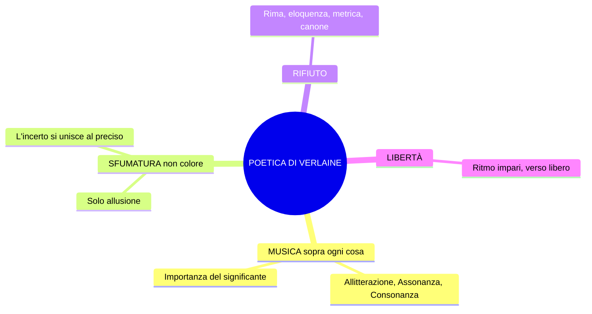

# Decadentismo e Simbolismo — Ripasso veloce

> Lezione 12-02-26 | Baudelaire, Verlaine, Rimbaud

---

## Coordinate

- **Quando**: anni **80 dell'800**
- **Dove**: Francia
- **Nome**: da *Languore* di Verlaine → "Sono l'impero alla fine della **decadenza**"
- **Corrente madre**: **Simbolismo francese** → da cui nasce il **Decadentismo italiano**
- **Discontinuità** netta con Naturalismo/Verismo ("in continuità è la risposta sbagliata")
- Ricollegamento ideale al **Romanticismo** (spinta soggettiva, senso di fine e di morte)

---

## Naturalismo vs. Simbolismo/Decadentismo

| | Naturalismo / Verismo | Simbolismo / Decadentismo |
|---|---|---|
| **Strumento** | Ragione e scienza | **Irrazionalità**, intuizione, illuminazione |
| **Realtà** | Conoscibile, fenomenica, oggettiva | **Misteriosa, illusoria, complessa** |
| **Linguaggio** | Fedele alla cosa ("come una fotografia") | **Allusivo, simbolico, evocativo** |
| **Parola** | Rispecchia il reale | **Suggerisce** (solo la sfumatura) |
| **Modello** | Romanzo sperimentale (Zola) | Poesia come profezia e decodifica |
| **Metrica** | Rispetto delle convenzioni | Verso libero, rifiuto della tradizione |
| **Filosofia** | Positivismo | **Rifiuto del positivismo** |

---

## 5 caratteri fondamentali

1. **Sfiducia nella scienza**: "la scienza non spiega la realtà"
2. **Soggettivismo** e individualismo (ma diverso da quello romantico)
3. **Rivalutazione dell'irrazionalità**: intuizione, illuminazione, ampliamento dei sensi
4. **Senso di fine e di morte**, del mistero che domina la vita
5. **Esclusione/emarginazione** dalla società borghese ("tutta volta all'utile, al profitto")

---

## Realtà = trama di simboli

- Realtà **misteriosa, illusoria, complessa** → da **decifrare**
- Non con la ragione, ma con **intuizione** e **ampliamento dei sensi**
- Mezzi: **droghe** (oppio, assenzio), **esperienze estreme** (amore, follia, sofferenza), **poesia**
- *Fenomenico* (gr. *phainomai* = apparire) = ciò che si vede. I simbolisti cercano ciò che sta **sotto** la realtà fenomenica

---

## I Poeti Maledetti (*Les Poètes Maudits*)

| Poeta | Ruolo chiave |
|---|---|
| **Baudelaire** | "Padre putativo", precursore fondamentale |
| **Verlaine** | Conia il termine "decadenza", poetica della musicalità |
| **Rimbaud** | Il più giovane e ribelle, morto a 37 anni |

"Maledetti" = esistenza al di fuori dei canoni borghesi, ampliamento dei sensi anche con droghe (oppio, assenzio).

---

## Baudelaire

### *Corrispondenze* (da *I fiori del male*, 1857) — testo-manifesto

- **Natura = tempio** con "pilastri vivi" che mormorano "indistinte parole" → la realtà parla, ma va decifrata
- L'uomo passa tra **"foreste di simboli"** che lo osservano con sguardi familiari
- **"I profumi, i colori e i suoni si rispondono"** → tutti i dati sensoriali tendono a un'**unità misteriosa** ("tenebrosa")
- Figura retorica centrale: **SINESTESIA** (non spiegabile razionalmente, evocativa, senza nesso causa-effetto)
  - "Profumi freschi come la carne d'un bambino" → olfatto + **tatto**
  - "dolci come l'oboe" → olfatto + **udito**
  - "verdi come i prati" → olfatto + **vista**
- È attraverso l'ampliamento delle percezioni sensoriali che si accede al **mistero della realtà**

### *La caduta dell'aureola* (da *Lo Spleen di Parigi*)

- **Spleen** = malinconia, tristezza, noia
- ⚠️ **DA IMPARARE A MEMORIA**: **"caduta dell'aureola"**
- Scena: poeta e uomo qualunque in un **bordello**
- **Aureola** (sacralità del poeta) cade nella **fanghiglia del macadam** durante la vita frenetica di Parigi
- Il poeta **non la raccoglie** → rivendica con orgoglio la marginalità
- Ironicamente: "qualche poeta spregevole" la raccatterà senza capire la condizione autentica del poeta
- Doppio atteggiamento: **critico** verso la società; **orgoglioso** della marginalità

| Simbolo | Significato |
|---|---|
| Aureola | Sacralità del poeta |
| Bordello | Abiezione, degrado |
| Fanghiglia del macadam | Dove finisce la sacralità |
| Boulevard, carrozze | Vita frenetica, alienante, caotica |

### *L'Albatro*

- Albatro = il **nuovo poeta**: **ridicolo** a terra, **altissimo** in volo
- In volo: maestoso, domina i cieli → a terra: goffo, ridicolo, ali = impaccio
- Marinai che lo deridono = **uomini comuni** che non riconoscono il valore del poeta
- **"Sta con l'uragano e ride degli arcieri"**: affronta l'inquietudine, si fa beffe di chi lo attacca
- **"Esule in terra"**: il poeta è un estraneo
- **"Ali di gigante"**: immaginazione, arte → nella dimensione terrena diventano impedimento

> ⚠️ **DA IMPARARE** — 3 espressioni metaforiche:
> 1. **Re dell'azzurro**
> 2. **Viaggiatore alato**
> 3. **Principe delle nubi**

---

## Verlaine

- Vita sregolata: alcolismo dai 18 anni, relazione turbolenta con Rimbaud, gli spara, 2 anni di carcere

### Poetica (*Arte poetica*, 1874 — manifesto letterario)

- **"De la musique avant toute chose"** — musica sopra ogni cosa
- Importanza del **significante/suono**: **allitterazione, assonanza, consonanza**
- Ritmo impari, "più vago e solubile nell'aria" → libertà ritmica
- "L'incerto si unisce al preciso" → dimensione di **indeterminatezza**
- ⚠️ **"Sol la sfumatura"** ("scrivetelo"): la parola deve **suggerire**, non delineare = solo **allusione**
- **"Prendi l'eloquenza e torcile il collo"** = uccidi l'arte del bel parlare, libertà da imposizioni
- **Rifiuto della rima** ("morte della poesia"): "suona vuota e falsa sotto la lima" (*labor limae* = rifiniture stilistiche)
- **"Musica ancora e sempre! Tutto il resto è letteratura"** = il canone è un **mondo morto**, da superare

---

## Rimbaud

- Nato 1854, ribelle, vagabonda per l'Europa, mercante di pelli e caffè, muore a **37 anni** (1891, Marsiglia). "Vita assolutamente sregolata e raminga."

### Poetica (Lettera del Veggente — testo in prosa)

- **"Io è un altro"** (*Je est un autre*): l'identità non è univoca, è **caos** (≠ soggettivismo romantico di Leopardi)
- **"Farsi veggente"**: il poeta vede ciò che all'uomo comune è negato → dimensione della **profezia**
- **"Lungo, immenso e ragionato disordine di tutti i sensi"**: il metodo per diventare veggente (amore, sofferenza, pazzia)
- **"Ladro di fuoco"** = analogia con **Prometeo**:
  - Prometeo: sprofonda nel reame degli dei → ruba il fuoco → lo dà agli uomini
  - Poeta: sprofonda negli abissi della realtà → coglie i simboli → li porta agli uomini tramite la poesia

### *Vocali* (*Voyelles*)

Associazione suoni-colori in assoluta libertà → linguaggio misterioso della realtà.

| Vocale | Colore | Immagini chiave |
|---|---|---|
| **A** | **Nera** | Mosche lucenti, crudeli fetori, golfi d'ombra |
| **E** | **Bianca** | Vapori, lance di ghiaccio, umbelle, bianchi re |
| **I** | **Rossa** | Sangue, labbra, collera, ebrezza |
| **U** | **Verde** | Mari, bestie al pascolo, fronti studiose |
| **O** | **Blu** | Tuba, silenzi, angeli, omega |

→ Fitta trama di **sinestesie**, "fantasiose, immaginifiche", non afferrabile razionalmente.

---

## Espressioni da memorizzare

| Espressione | Autore | Significato |
|---|---|---|
| **"Caduta dell'aureola"** ⚠️ | Baudelaire | Perdita della sacralità del poeta |
| **"Re dell'azzurro"** | Baudelaire | Metafora per il poeta in volo |
| **"Viaggiatore alato"** | Baudelaire | Idem |
| **"Principe delle nubi"** | Baudelaire | Idem |
| **"Esule in terra"** | Baudelaire | Poeta estraneo sulla terra |
| **"Ali di gigante"** | Baudelaire | Arte = impedimento nella dimensione terrena |
| **"De la musique avant toute chose"** | Verlaine | Musica sopra ogni cosa |
| **"Sol la sfumatura"** | Verlaine | La parola suggerisce, non delinea |
| **"Prendi l'eloquenza e torcile il collo"** | Verlaine | Uccidi il bel parlare |
| **"Io è un altro"** | Rimbaud | Identità = caos |
| **"Farsi veggente"** | Rimbaud | Vedere ciò che è negato all'uomo comune |
| **"Lungo, immenso e ragionato disordine di tutti i sensi"** | Rimbaud | Metodo per farsi veggente |
| **"Ladro di fuoco"** | Rimbaud | Analogia con Prometeo |

---

## Glossario minimo

| Termine | Definizione |
|---|---|
| **Fenomeno** | Gr. *phainomai* = apparire. Realtà fenomenica = quella che si vede |
| **Spleen** | Malinconia, tristezza, noia |
| **Sinestesia** | Fusione di ambiti sensoriali diversi; non spiegabile razionalmente |
| **Parnaso** | Monte sacro alla poesia |
| **Labor limae** | Lat.: rifiniture e elaborazione stilistica del testo |
| **Macadam** | Pavimentazione stradale (dove cade l'aureola) |

---

## Lacune (da integrare)

- Decadentismo **italiano** (D'Annunzio, Pascoli, Fogazzaro) non trattato
- *Languore* di Verlaine: solo accennata
- Mallarmé: non menzionato
- Di Rimbaud mancano *Una stagione all'inferno* e *Illuminazioni*
- Contesto storico-sociale: non approfondito

**Testi da studiare sul libro**: *Corrispondenze*, *L'Albatro* (p. 35, libro A), *Lettera del Veggente* (p. ~146), *Vocali* (p. ~146), *Languore*, *Arte poetica*.

---

> *Ripasso dalla lezione del 12-02-26. Verificare sempre sul libro di testo.*
