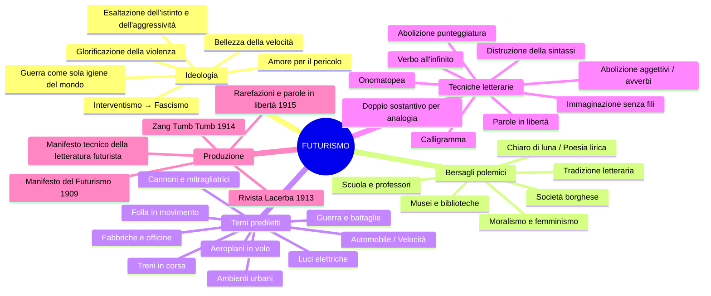
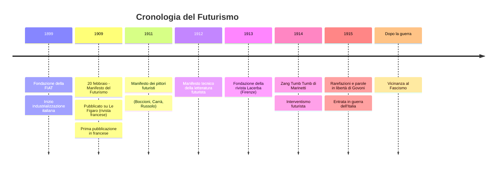
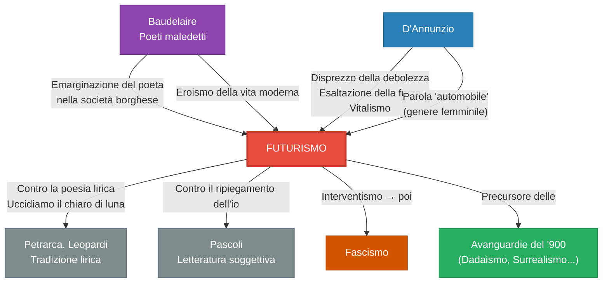
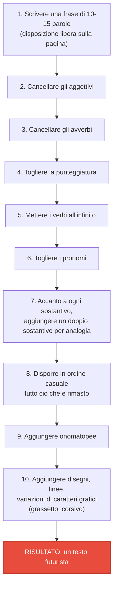

# Il Futurismo — Mega-Schema di Studio

> **Fonti**: Lezione del 17/03/26 (parte sul Futurismo) + Lezione del 31/03/26 (intera)
> **Docente**: appunti dalla Prof
> **Scopo**: preparazione esame di Italiano

> [!WARNING] Materiale aggiuntivo
> La prof ha indicato: **"Studiare sugli appunti e sul libro il Futurismo (testi e *Contro i professori* su Classroom)"**.
> Il testo *Contro i professori* di Marinetti è stato condiviso su **Google Classroom** ed è da leggere obbligatoriamente. Non è trattato a lezione, ma va studiato autonomamente.

---

## 1. Inquadramento generale

### 1.1 Definizione e collocazione storica

Il **Futurismo** è il **primo movimento d'avanguardia** che si sviluppa in Italia, tra il **primo e il secondo decennio del Novecento** (ca. 1909–1920).

| Aspetto | Dettaglio |
|---|---|
| **Natura** | Movimento d'avanguardia globale (non solo letterario) |
| **Periodo** | Primo-secondo decennio del '900 |
| **Luogo d'origine** | Italia |
| **Fondatore** | Filippo Tommaso **Marinetti** |
| **Data fondativa** | 20 febbraio **1909** (pubblicazione del *Manifesto del Futurismo*) |
| **Rivista di riferimento** | ***Lacerba*** (Firenze, dal 1913) |
| **Principali esponenti** | Marinetti (letteratura), Boccioni e Carrà (pittura/scultura), Russolo, Balla, Govoni |

### 1.2 Etimologia di "avanguardia"

La parola **avanguardia** appartiene al **lessico militare**: indica i soldati che **precedono la guardia**, cioè quelli che vanno in **avanscoperta**, che entrano in un territorio prima degli altri.

> **Osservazione della prof**: Il termine militare non è casuale — il Futurismo ha un'anima bellicosa e aggressiva fin dalla scelta del nome con cui si definisce.

### 1.3 Obiettivo fondamentale

Il Futurismo si propone di **innovare radicalmente**, di dire qualcosa di **nuovo**, in un rapporto **polemico con il passato**. È un movimento di **contestazione non solo letteraria, ma globale**: investe letteratura, arte, teatro, musica, perfino la cucina.

---

## 2. Contesto storico-culturale

### 2.1 La società borghese come bersaglio

La contestazione futurista è indirizzata alla **società borghese**, accusata di essere:

- **Indifferente** nei confronti dell'arte
- **Repressiva** verso la cultura
- Incapace di apprezzare e valorizzare il ruolo dell'artista

> **Collegamento con i poeti maledetti** (osservazione della prof): Questo tema era già presente nei *poètes maudits*. Baudelaire con *La perdita d'aureola* e *L'albatros* esprimeva lo stesso sentimento di **emarginazione del poeta** in una società borghese indifferente.

### 2.2 La modernità come orizzonte

I futuristi sono attratti dalla **modernità**, intesa come:

- **Progresso tecnologico**
- **Urbanizzazione**
- **Industrializzazione nascente**

> **Nota storica della prof**: L'Italia all'inizio del '900 è un paese ancora **prevalentemente agricolo**, ma sta prendendo avvio il processo di industrializzazione. Nel **1899** viene fondata la **FIAT**, una delle più grandi industrie automobilistiche.

### 2.3 Il mito dell'automobile

L'**automobile** è il simbolo per eccellenza della modernità futurista. All'inizio del '900 **non era alla portata di tutti** — era un bene di lusso per pochi, guardato con grande ammirazione. Diventa accessibile in Italia solo negli anni '50-'60.

> **Aneddoto della prof su D'Annunzio**: La parola "automobile" fu inventata da **D'Annunzio**, il quale decise che fosse di genere **femminile**, con questa motivazione:
>
> *«L'automobile è femminile. Questa ha la grazia, la snellezza, la vivacità di una seduttrice; ha inoltre una virtù ignota alle donne: la perfetta obbedienza. Ma per contro, delle donne ha la disinvolta levità nel superare ogni scabrezza.»*
>
> — Commento della prof: è un'interpretazione «suggestiva, ovviamente piuttosto provocatoria e **misogina**, come era nello stile di D'Annunzio».

### 2.4 L'"eroismo della vita moderna" (Baudelaire)

La letteratura italiana abbandona con il Futurismo l'**idillio**, il **mito della condizione agreste** e le **tematiche naturalistiche**, perché irrompe la modernità — ciò che Baudelaire chiamava l'**eroismo della vita moderna**:

- La vita cittadina
- Il traffico dei boulevard
- Le luci delle fabbriche
- I macchinari delle industrie
- L'elettricità

---

## 3. Mappa concettuale del Futurismo

---

## 4. Ideologia futurista

### 4.1 La glorificazione della guerra

L'ideologia sottesa al Futurismo è la **glorificazione della guerra**. La guerra è interpretata come manifestazione della forza che spazza via la debolezza e l'umiltà.

> [!IMPORTANT] Formula da ricordare (la prof ci tiene molto)
> I futuristi definiscono la guerra come la **«sola igiene del mondo»**.
> Citazione testuale della prof: *«Questo scrivetelo, imprimetevelo nella mente.»*

### 4.2 Temi e valori esaltati

| Valore esaltato | Contrario rifiutato |
|---|---|
| Dinamismo, movimento | Immobilismo, staticità |
| Velocità | Lentezza, contemplazione |
| Aggressività, coraggio | Debolezza, umiltà, viltà |
| Istinto, impulsività | Ragione, mediazione, cultura |
| Guerra, lotta | Pace, moralismo |
| Modernità, macchina | Tradizione, natura |
| Pericolo, temerità | Prudenza, sicurezza |

### 4.3 Esaltazione dell'istinto e dell'aggressività

I futuristi esaltano l'**istinto** e l'**aggressività**. Le **serate futuriste** finivano sempre «a bottigliate, a cazzotti» (espressione della prof) — un'**iconoclastia** programmatica.

### 4.4 Posizione politica

I futuristi, operanti tra il **1909 e il 1912** circa, si schierano come **interventisti** negli anni precedenti alla Prima Guerra Mondiale, e successivamente saranno **vicini al fascismo**.

> **Collegamento con D'Annunzio** (osservazione della prof): Si trova un'eco della poetica dannunziana nel Futurismo — il disprezzo per la debolezza, l'esaltazione della forza e dell'azione, l'interventismo.

---

## 5. Rapporto con il passato: la sconsacrazione

### 5.1 "Bruciamo i musei"

Una delle frasi più celebri di Marinetti:

> *«Bruciamo i musei»*

Perché i musei contengono il passato che **non ha più niente da dire al presente**. **Museificare** le opere significa **ucciderle**: l'opera futurista deve essere **dinamica**, esprimere **dinamismo e movimento**, non immobilismo.

### 5.2 "Uccidiamo il chiaro di luna"

> *«Uccidiamo il chiaro di luna»*

Il **chiaro di luna** è simbolo dell'intera tradizione poetica italiana da **Petrarca** in poi, passando per **Leopardi**. Ucciderlo significa rifiutare tutta la poesia lirica, intimista, contemplativa.

### 5.3 L'arte come merce riproducibile

Per i futuristi, l'opera d'arte **non è più irripetibile, bensì riproducibile**. Le tecniche per rendere l'arte riproducibile sono:

- **Tipografia**
- **Stampa**
- **Fotografia**

> **Osservazione della prof**: «Ciò che non diventa merce merita di andare distrutto.» — Questo è il principio radicale dell'estetica futurista.

### 5.4 L'artista nella società capitalistica

L'artista si scopre **antagonista della classe dominante** (la borghesia). La prof usa tre aggettivi chiave:

> **Disgustato, declassato, disoccupato.**

Con la nuova società capitalistico-industriale si conclude il **mito della beata solitudine dell'artista**: l'artista partecipa al **processo produttivo** e accetta le **regole del mercato**.

### 5.5 Contro la scuola e i professori

Marinetti considera la scuola e i professori **da eliminare**, perché:

- Sono portatori di un **sapere obsoleto, superato**
- La scuola costringe gli studenti a conoscenze del passato ed è «come un carcere»

La scuola ideale di Marinetti: una scuola che **tempri lo spirito e il corpo**, in cui gli studenti affrontino prove difficili, incendi — non una scuola dello sport, ma qualcosa di **più aggressivo**, legato alla guerra, alla lotta, alle risse.

> **Commento di uno studente**: «Una scuola che sopprime il pensiero critico e superiore.»
> La prof annuisce.

> [!WARNING] Testo da studiare su Classroom
> Il testo ***Contro i professori*** di Marinetti è stato condiviso dalla prof su **Google Classroom**. Va letto e studiato autonomamente. Non è stato analizzato in classe.

---

## 6. Timeline del Futurismo

---

## 7. I Manifesti — Analisi dettagliata

### 7.1 Il *Manifesto del Futurismo* (1909)

| Dato | Dettaglio |
|---|---|
| **Titolo** | *Manifesto del Futurismo* |
| **Data** | **20 febbraio 1909** (data richiesta dalla prof) |
| **Luogo di pubblicazione** | ***Le Figaro***, rivista francese |
| **Lingua originale** | Francese (poi tradotto in italiano) |
| **Autore** | Filippo Tommaso Marinetti |
| **Contenuto** | Principi **generali** del movimento futurista |
| **Struttura** | Suddiviso in **punti** — elencazione dei principi fondamentali |

#### Analisi passo per passo dei principi

**Punto 1 — Amore del pericolo ed energia**

> *«Noi vogliamo cantare l'amor del pericolo, l'abitudine all'energia e alla temerità.»*

- **Temerità** = coraggio che si avvicina alla sfrontatezza (definizione della prof)
- Programma: l'arte deve esprimere audacia, non contemplazione

**Punto 2 — Coraggio, audacia, ribellione**

> *«Il coraggio, l'audacia, la ribellione saranno elementi essenziali della nostra poesia.»*

- **Commento della prof**: «Vedete la lontananza, la frattura rispetto al passato. Il passato cos'abbiamo, se pensiamo anche solo a Pascoli e prima a Leopardi? C'abbiamo il ripiegamento dell'io, la letteratura della soggettività.»
- Frattura totale: dalla poesia intimista alla poesia dell'azione

**Punto 3 — Contro l'immobilità, per il movimento aggressivo**

> *«La letteratura esaltò fino ad oggi l'immobilità pensosa, l'estasi e il sonno. Noi vogliamo esaltare il movimento aggressivo, l'insonnia febbrile, il passo di corsa, il salto mortale, lo schiaffo e il pugno.»*

- **Analisi retorica della prof**:
  - **Elencazione** assimilabile a un **climax ascendente** (dal passo di corsa → al pugno)
  - Stile quasi **militaresco**, molto ritmato
  - Ricorso all'**asindeto** (uso della punteggiatura al posto della congiunzione) che conferisce il ritmo marziale

**Punto 4 — La bellezza della velocità**

> *«Noi affermiamo che la magnificenza del mondo si è arricchita di una bellezza nuova: la bellezza della velocità.»*

- Celebrazione della **modernità** e dell'**innovazione tecnologica**
- La velocità come valore estetico supremo

**Punto 5 — L'uomo al volante**

> *«Noi vogliamo inneggiare all'uomo che tiene il volante, la cui asta attraversa la terra, lanciata a corsa essa pure sul circuito della sua orbita.»*

- Riferimento diretto all'**automobile**
- Descrizione dell'auto con **solennità** quasi epica

**Punto 6 — Ardore e fervore**

> *«Bisogna che il poeta si prodighi con ardore, sfarzo e magnificenza per aumentare l'entusiastico fervore degli elementi primordiali.»*

- Solennità nel celebrare il **vitalismo** e l'**energia**

**Punto 7 — L'opera aggressiva**

> *«Non vi è più bellezza se non nella lotta. **Nessuna opera che non abbia un carattere aggressivo può essere un capolavoro.**»*

> [!IMPORTANT] Concetto chiave (la prof lo ripete due volte per enfasi)
> Se nessuna opera senza carattere aggressivo è capolavoro, allora **tutti i capolavori riconosciuti del periodo precedente** — da Petrarca in poi — sono automaticamente scartati.

**Punto 8 — Privilegio di vivere nel presente**

> *«Noi siamo sul patrimonio estremo dei secoli [...] poiché abbiamo già creata l'eterna velocità onnipresente.»*

- I futuristi si sentono **privilegiati** a vivere nel loro tempo
- Il tempo presente è considerato **superiore a tutte le epoche precedenti**
- **Commento della prof**: Hanno sostituito al **Dio tradizionale** un **nuovo Dio**: quello della modernità

**Punto 9 — Guerra, militarismo, distruzione**

> *«Noi vogliamo glorificare la guerra — sola igiene del mondo — il militarismo, il patriottismo, il gesto distruttore.»*

- **Ritmo quasi marziale** nelle affermazioni (osservazione della prof)

**Punto 10 — Distruzione dei musei e delle biblioteche**

> *«Noi vogliamo distruggere i musei, le biblioteche, le accademie d'ogni specie e combattere contro il moralismo, il femminismo e contro ogni viltà opportunistica o utilitaria.»*

- Bersagli: musei, biblioteche, accademie, moralismo, femminismo
- **Anti-femminismo** esplicito

**Punto 11 — Conclusione: le locomotive e gli aeroplani**

> *«Noi canteremo le locomotive dall'ampio petto [...] il volo scivolante degli aeroplani. Ed è dall'Italia che lanciamo questo manifesto di violenza travolgente e incendiaria, col quale fondiamo oggi il Futurismo.»*

- La **locomotiva** è **personificata** («dall'ampio petto») ed elevata a livello quasi eroico
- **«Violenza travolgente e incendiaria»** — la prof nota la bellezza dell'aggettivo *incendiaria*
- Orgoglio nazionale: il manifesto è lanciato **dall'Italia**

---

### 7.2 Il *Manifesto tecnico della letteratura futurista* (1912)

| Dato | Dettaglio |
|---|---|
| **Titolo** | *Manifesto tecnico della letteratura futurista* |
| **Contenuto** | Principi specifici per la **letteratura** futurista |
| **Valore** | Insieme al *Manifesto del Futurismo*, rappresenta la produzione di **maggior pregio letterario** del movimento |

#### Analisi passo per passo dei principi

**Principio 1 — Distruzione della sintassi e parole in libertà**

> *«Bisogna distruggere la sintassi, disponendo i sostantivi a caso, come nascono.»*

- **Etimologia** (spiegata dalla prof): *sintassi* viene dal greco **σύν-τάσσειν** (*syn-tassein*) = "ordinare insieme"
- La sintassi rappresenta tutte le **regole convenzionali del linguaggio**
- I sostantivi devono essere disposti **a caso**
- Questo principio si chiama **paroliberismo**: le **parole in libertà**

> [!IMPORTANT] Termine da ricordare
> **Paroliberismo** = parole in libertà. È il termine tecnico per la pratica futurista di liberare le parole da ogni vincolo sintattico.

**Principio 2 — Verbo all'infinito**

> *«Si deve usare il verbo all'infinito, perché si adatti elasticamente al sostantivo e non lo sottoponga all'io dello scrittore che osserva o immagina. Il verbo all'infinito può solo dare il senso della continuità della vita e l'elasticità dell'intuizione che la percepisce.»*

**Perché il verbo all'infinito?** (La prof chiede agli studenti di ragionare e poi integra):

1. È **senza persona** → **elimina la soggettività**, che i futuristi vogliono superare
2. Si colloca in una **dimensione più astratta** → richiama la **velocità** perché non è impedito dal pronome / dalla persona che compie l'azione
3. Esprime **continuità** e **dinamismo**
4. È un **modo indefinito** → non è sottoposto alla «prigione dell'io»

**Principio 3 — Abolizione dell'aggettivo**

> *«Si deve abolire l'aggettivo, perché il sostantivo nudo conservi il suo colore essenziale. L'aggettivo, avendo in sé un carattere di sfumatura, è incompatibile con la nostra visione dinamica, poiché suppone una sosta, una meditazione.»*

- L'aggettivo **rallenta la comunicazione**
- Presuppone una **sosta** (incompatibile con il dinamismo)
- Il sostantivo "nudo" conserva il suo **colore essenziale**

**Principio 4 — Abolizione dell'avverbio**

> *«Si deve abolire l'avverbio, vecchia fibbia che tiene unite l'una all'altra le parole. L'avverbio conserva alla frase una fastidiosa unità di tono.»*

- L'avverbio è una «vecchia fibbia» → immagine di qualcosa che tiene immobile, che blocca

**Principio 5 — Il doppio sostantivo per analogia**

> *«Ogni sostantivo deve avere il suo doppio, cioè il sostantivo deve essere seguito, senza congiunzione, dal sostantivo a cui è legato per analogia.»*

**Esempi dal manifesto**:

| Primo sostantivo | Secondo sostantivo (analogia) |
|---|---|
| Uomo | torpediniera |
| Donna | golfo |
| Folla | risacca |
| Piazza | imbuto |
| Porta | rubinetto |

> **Osservazione della prof**: «Voi riuscite a cogliere il nesso tra questi due sostantivi accoppiati? No. Perché le analogie futuriste sono molto fantasiose — è molto difficile cogliere il nesso.»

L'**analogia** è una delle **figure retoriche più frequenti** nella produzione futurista.

> **Nota radicale**: Marinetti arriverà a dire qualcosa di ancor **più radicale**: del doppio sostantivo per analogia, **eliminare il primo e lasciare solo il secondo**. Così il testo diventa ancora più criptico e indecifrabile.

**Principio 6 — Abolizione della punteggiatura**

> *«Essendo soppressi gli aggettivi, gli avverbi e le congiunzioni, la punteggiatura è naturalmente annullata nella continuità varia di uno stile vivo che si crea da sé, senza le soste assurde delle virgole e dei punti.»*

- Battuta della prof: «Chi di voi non ha mai pensato che le soste delle virgole e dei punti siano assurde, vero?» (rivolta agli studenti che non usano la punteggiatura)

**Principio 7 — Il maximum di disordine**

> *«Siccome ogni specie di ordine è fatalmente un prodotto dell'intelligenza cauta e guardinga, bisogna orchestrare le immagini disponendole secondo un maximum di disordine.»*

- L'**ordine** rappresenta una **gabbia**
- I futuristi le gabbie vogliono **distruggerle**

**Principio 8 — Distruggere l'io**

> *«Distruggere nella letteratura l'io. L'uomo completamente avariato dalla biblioteca e dal museo [...]»*

- La cultura e l'educazione **guastano l'uomo** perché lo allontanano dall'**istinto**, dall'**impulsività**, dall'**energeticità**

**Principio 9 — L'immaginazione senza fili**

> *«Noi inventeremo insieme ciò che io chiamo l'immaginazione senza fili.»*

> [!IMPORTANT] Termine da ricordare (la prof insiste)
> **Immaginazione senza fili**: citazione testuale della prof: *«Segnatelo, imparatelo e ditelo tutte le volte che si parla di futurismo.»*
> Indica un'immaginazione **libera da ogni vincolo logico**, che procede per analogie e associazioni spontanee, senza la mediazione della razionalità.

---

### 7.3 Tabella riassuntiva: cosa abolire e perché

| Elemento abolito | Motivazione |
|---|---|
| **Sintassi** | Ordina e ingabbia le parole |
| **Aggettivo** | Rallenta, suppone una sosta/meditazione |
| **Avverbio** | "Vecchia fibbia" che blocca le parole |
| **Punteggiatura** | Crea "soste assurde" nel flusso del testo |
| **Verbi coniugati** | Imprigionano il testo nell'io e nel tempo; usare solo l'infinito |
| **L'io** | L'uomo è "avariato" dalla cultura |
| **Ordine** | Prodotto dell'intelligenza cauta; serve il "maximum di disordine" |

---

## 8. Relazioni con altri movimenti e autori

---

## 9. La produzione letteraria futurista

### 9.1 Filippo Tommaso Marinetti

Marinetti è l'**animatore del gruppo** futurista, il **punto teorico e organizzatore culturale**.

#### *Zang Tumb Tumb* (1914)

| Dato | Dettaglio |
|---|---|
| **Autore** | Marinetti |
| **Anno** | 1914 |
| **Genere** | Poesia / Prosa sperimentale |
| **Contenuto** | Descrizione **fonosimbolica** di un episodio della **guerra d'Africa** |
| **Titolo** | Costituito da un'**onomatopea** |

#### Analisi di "Marcia futurista" (da *Zang Tumb Tumb*)

Sottotitolo: **"Parole in libertà"**, cantata per la prima volta da Marinetti nella galleria futurista di Roma.

**Testo** (letto ad alta voce in classe dagli studenti):

> *Iró iró iró, pic pic, iró iró iró, pac pac. Ma-ga-la, ma-ga-la. Ran ran ran za, ran ran ran za. Fi, casmi bi, fi, casmi bi, fi, zanna tutu, fi, zanna tutu. Fi, zanna tutu, fi, tutu. Iró iró iró, pac pac.*

**Analisi degli espedienti retorici** (dalla prof):

1. **Onomatopea propria**: riproduce i suoni della guerra, in particolare di una **marcia militare**
2. **Ripetizione**: crea il ritmo della marcia
3. **Simultaneità di percezioni**: resa attraverso i **caratteri tipografici**:
   - Il **grassetto** che si amplifica → corrisponde a un **ampliamento della voce**
   - Gli **spazi bianchi** → esprimono il **silenzio** in rapporto al suono
   - La **distanza tra le lettere** → produce il ritmo della marcia che si **intensifica** o si **affievolisce**
4. **Lettere ripetute** all'interno delle parole (es. «vibraaaare») → riproduzione fonosimbolica del suono prolungato
5. **Segni grafici**: linee verticali e altre forme
6. **Segni algebrici**: +, −, ÷, parentesi
7. **Disegni** inseriti nel testo

#### Il calligramma in Marinetti

All'interno di *Zang Tumb Tumb* si trovano elementi in cui le **parole riproducono il disegno dell'oggetto a cui si riferiscono** (es. «il pallone frenato turco»).

> **Definizione della prof**: Il **calligramma** è una composizione in cui le parole scritte **riproducono un'immagine** — in questo caso, l'immagine del contenuto a cui si riferiscono.
>
> **Riferimento**: *Il pleut* di **Apollinaire** — esempio celebre di calligramma (studiato al biennio). *«Il pleut des voix de femmes...»*

> **Domanda di uno studente**: «Ma il calligramma è quando le parole scritte riproducono un'immagine qualsiasi o l'immagine a cui si riferiscono?»
> **Risposta della prof**: «Il calligramma riproduce un'immagine attraverso le parole; in questo caso l'immagine del contenuto a cui si riferisce.»

#### La fotografia alterata di Marinetti

La prof mostra una fotografia di Marinetti volutamente **alterata** per riprodurre il **movimento** e il **dinamismo**: la fotografia (di per sé monodimensionale e statica) viene manipolata per esprimere i principi futuristi.

---

### 9.2 Corrado Govoni (1884–1965)

#### *Rarefazioni e parole in libertà* (1915)

Esempio di **poesia visiva** futurista.

**Esempio analizzato in classe**:

> *«bucato + bagno + ballo = primo amore»*
> *«Sole», «schiuma», «onde», «mare»*
> Sotto il disegno dell'andamento ondulatorio del mare: una serie di **"m"** che ne riproducono visivamente l'andamento.

**Caratteristiche**:
- **Percezione simultanea**: evocazione di immagini e suoni insieme
- I suoni sono evocati **attraverso le immagini** (disegni, segni tipografici, disposizione delle parole)
- Uso di **segni algebrici** (+, =) per creare relazioni tra parole

#### *Il palombaro* (da *Rarefazioni e parole in libertà*, 1915)

> **Nota della prof**: «Avete anche sul vostro libro.»

Riproduce la vita e il **fermento della vita sottomarina** attraverso:
- Disegni
- Caratteri tipografici
- Analogie

**Analogie analizzate in classe**:

| Immagine | Testo analogico | Spiegazione |
|---|---|---|
| **Medusa** | *«medusa ombrello dimenticante»* | Analogia abbastanza intuibile: la forma della medusa ricorda un ombrello |
| **Attinia** (pianta acquatica) | *«ceppo insanguinato dove lasciarono i capelli serpentine le sirene decapitate»* | L'attinia con le sue alghe rosse e le foglie verdi che si muovono sott'acqua ricorda, con il suo andamento ondulatorio e flessibile, i **capelli serpentini delle sirene decapitate** — immagine fantasiosa e analogica |

---

## 10. La pittura e la scultura futurista

### 10.1 Il Manifesto dei pittori futuristi (1911)

Composto da **Boccioni**, **Carrà** e **Russolo** nel 1911.

> **Nota della prof**: «Non lo leggiamo perché non abbiamo tempo.»

### 10.2 Opere citate in classe

| Opera | Autore | Caratteristiche |
|---|---|---|
| ***Dinamismo di un cane al guinzaglio*** | **Giacomo Balla** | Il **movimento** è riprodotto dalle zampe del cagnolino in rapida sequenza, collegato al movimento della lunga gonna della dama. Tecnica ingegnosa per rappresentare il movimento in un'immagine statica. |
| ***Forme uniche della continuità nello spazio*** | **Umberto Boccioni** | Scultura in **bronzo** (materiale pesante) che riproduce il **dinamismo** e il **movimento** attraverso linee fluide. Si trova anche sui **venti centesimi** di euro. |

> **Commento della prof**: «Attraverso un materiale pesante come il bronzo, cosa fa Boccioni? Riproduce il dinamismo, il movimento, attraverso queste linee. Ingegnoso, no? Per rappresentare il movimento in un'immagine che di fatto è statica.»

---

## 11. L'esercizio pratico in classe (17/03/26)

La prof ha fatto eseguire alla classe un **esercizio di scrittura futurista** prima di spiegare il movimento, per farne comprendere i principi dall'interno:

> **Commento della prof**: «Siamo partiti da una prova pratica di quelli che sono i principi del Futurismo in letteratura.»

---

## 12. Riepilogo figure retoriche e tecniche futuriste

| Tecnica / Figura | Definizione | Esempio / Uso |
|---|---|---|
| **Paroliberismo** | Parole in libertà, svincolate dalla sintassi | Principio fondamentale del manifesto tecnico |
| **Immaginazione senza fili** | Immaginazione libera da vincoli logici | Associazioni per analogia spontanee |
| **Analogia** (doppio sostantivo) | Accostamento di due sostantivi senza congiunzione | Uomo-torpediniera, donna-golfo, folla-risacca |
| **Onomatopea propria** | Parola che riproduce il suono a cui si riferisce | Zang Tumb Tumb, iró iró, pac pac |
| **Calligramma** | Parole disposte a formare un'immagine visiva | Il pallone frenato turco, le "m" del mare |
| **Asindeto** | Eliminazione delle congiunzioni, sostituite da punteggiatura | Ritmo militaresco del manifesto |
| **Climax ascendente** | Elencazione con intensificazione progressiva | «il passo di corsa, il salto mortale, lo schiaffo e il pugno» |
| **Personificazione** | Attribuzione di qualità umane a oggetti | «le locomotive dall'ampio petto» |
| **Variazione tipografica** | Grassetto, corsivo, grandezze diverse dei caratteri | Esprime variazioni di ritmo, tono, volume |
| **Segni algebrici** | +, −, ÷, = usati nel testo | «bucato + bagno + ballo = primo amore» |
| **Fonosimbolismo** | Le parole riproducono i suoni della realtà | Tutta la produzione di *Zang Tumb Tumb* |

---

## 13. Concetti chiave da ricordare all'esame

> [!IMPORTANT] Checklist dei concetti imprescindibili (secondo le indicazioni della prof)

- [ ] Il Futurismo è il **primo movimento d'avanguardia** italiano
- [ ] *Manifesto del Futurismo*: **20 febbraio 1909**, su ***Le Figaro*** (data richiesta esplicitamente)
- [ ] La guerra come **«sola igiene del mondo»** (la prof dice: «imprimetevelo nella mente»)
- [ ] **«Nessuna opera che non abbia un carattere aggressivo può essere un capolavoro»**
- [ ] **Paroliberismo** = parole in libertà
- [ ] **Immaginazione senza fili** (la prof dice: «segnatelo, imparatelo e ditelo tutte le volte»)
- [ ] Verbo all'infinito: elimina la soggettività + esprime dinamismo
- [ ] Doppio sostantivo per analogia (e versione radicale: solo il secondo)
- [ ] Artista: **disgustato, declassato, disoccupato**
- [ ] «**Bruciamo i musei**», «**Uccidiamo il chiaro di luna**»
- [ ] Rivista ***Lacerba*** (Firenze, 1913)
- [ ] *Zang Tumb Tumb* (Marinetti, 1914) — onomatopea della guerra d'Africa
- [ ] *Il palombaro* (Govoni, 1915) — poesia visiva
- [ ] Interventismo → vicinanza al Fascismo
- [ ] Leggere ***Contro i professori*** su **Classroom**

---

## 14. Lacune e materiale da integrare

> [!CAUTION] Contenuti NON coperti a lezione — da studiare autonomamente

| Lacuna | Dove integrare |
|---|---|
| ***Contro i professori*** di Marinetti | **Google Classroom** (condiviso dalla prof) |
| Parte generale del Futurismo (approfondimento) | **Libro di testo** (la prof dice: «sul libro vi studiate tutta la parte generale relativa al Futurismo») |
| Testi futuristi da analizzare | **Libro di testo** + Classroom |
| Biografia dettagliata di Marinetti | **Libro di testo** (la prof dice: «Salto Marinetti perché non ho tempo») |
| *Manifesto dei pittori futuristi* (1911) | **Libro di testo** / Appunti di Storia dell'Arte (la prof dice: «Non lo leggiamo perché non abbiamo tempo») |
| *Manifesto della scultura futurista* di Boccioni | Menzionato ma non analizzato |
| Rapporto Futurismo–Fascismo (approfondimento) | Libro di testo / Appunti di Storia |

> **Raccomandazione della prof** (31/03/26): *«Studiate al meglio possibile fin dove siamo arrivati, perché dopo, oltre ad interrogare, andrò avanti molto speditamente: ci mancano il romanzo del '900, Svevo, Pirandello, e poi chiudiamo con la triade Saba, Ungaretti e Montale.»*
