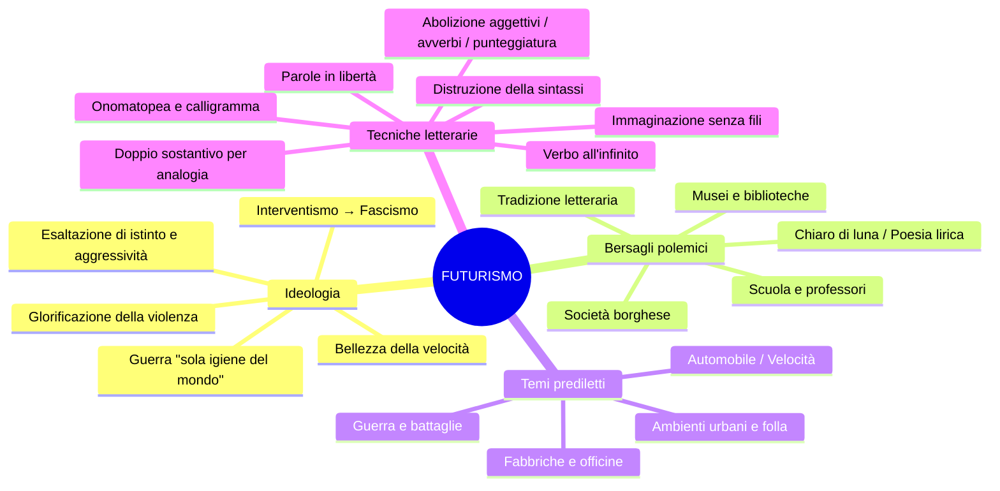

# Il Futurismo — Riassunto

> **Fonti**: Lezioni del 17/03/26, 31/03/26 e 09/04/26
> **Scopo**: preparazione esame di Italiano

> [!NOTE] Aggiornamento 09/04/26
> Il testo *Contro i professori* di Marinetti è stato **letto e analizzato in classe** il 09/04/26. Vedi sezione 11 di questo riassunto.

---

## 1. Inquadramento generale

Il **Futurismo** è il **primo movimento d'avanguardia** italiano, attivo ca. **1909–1920**.

| Aspetto | Dettaglio |
|---|---|
| **Fondatore** | Filippo Tommaso **Marinetti** |
| **Data fondativa** | **20 febbraio 1909** (*Manifesto del Futurismo*) |
| **Rivista** | ***Lacerba*** (Firenze, 1913) |
| **Esponenti** | Marinetti, Boccioni, Carrà, Russolo, Balla, Govoni |

**Avanguardia**: dal lessico militare, indica chi va in avanscoperta. Il termine non è casuale: il Futurismo ha un'anima bellicosa e aggressiva.

**Obiettivo**: innovare radicalmente in rapporto polemico con il passato. Non solo letteratura, ma arte, teatro, musica, perfino cucina.

---

## 2. Contesto storico-culturale

### Contestazione della società borghese

La borghesia è accusata di essere **indifferente** all'arte e **repressiva** verso la cultura. Tema già presente nei *poètes maudits*: Baudelaire con *La perdita d'aureola* e *L'albatros* esprimeva la stessa emarginazione del poeta.

### La modernità

I futuristi sono attratti da **progresso tecnologico**, **urbanizzazione**, **industrializzazione**. L'Italia è ancora prevalentemente agricola, ma nel **1899** viene fondata la **FIAT**.

### Il mito dell'automobile

L'automobile è il simbolo della modernità futurista — bene di lusso, guardato con ammirazione. La parola fu coniata da **D'Annunzio**, che la volle di genere **femminile**.

### L'"eroismo della vita moderna" (Baudelaire)

La letteratura abbandona l'idillio e il mito agreste. Irrompono la vita cittadina, il traffico, le fabbriche, l'elettricità.

---

## 3. Mappa concettuale

---

## 4. Ideologia futurista

### La glorificazione della guerra

> La guerra è la **«sola igiene del mondo»**.

| Valore esaltato | Contrario rifiutato |
|---|---|
| Dinamismo, velocità | Immobilismo, contemplazione |
| Aggressività, coraggio | Debolezza, umiltà |
| Istinto, impulsività | Ragione, cultura |
| Guerra, lotta | Pace, moralismo |
| Modernità, macchina | Tradizione, natura |

Le **serate futuriste** finivano «a bottigliate, a cazzotti» — un'iconoclastia programmatica.

### Posizione politica

I futuristi si schierano come **interventisti** e saranno poi **vicini al fascismo**. Eco della poetica dannunziana: disprezzo per la debolezza, esaltazione della forza.

---

## 5. Rapporto con il passato

- **«Bruciamo i musei»**: il passato non ha più niente da dire; museificare le opere significa ucciderle.
- **«Uccidiamo il chiaro di luna»**: rifiuto di tutta la poesia lirica da Petrarca a Leopardi.
- **Arte riproducibile**: l'opera non è più irripetibile, ma riproducibile tramite tipografia, stampa, fotografia. «Ciò che non diventa merce merita di andare distrutto.»
- **Artista nella società capitalistica**: «**Disgustato, declassato, disoccupato.**» L'artista accetta le regole del mercato.
- **Contro la scuola**: Marinetti vuole una scuola che «tempri lo spirito e il corpo», non un luogo di sapere obsoleto.

> [!NOTE] Analizzato in classe il 09/04/26
> ***Contro i professori*** è stato letto e commentato in classe. Vedi sezione 11.

---

## 6. I Manifesti

### 6.1 *Manifesto del Futurismo* (20 febbraio 1909)

Pubblicato su ***Le Figaro*** (rivista francese), in francese. Contiene i principi **generali** del movimento.

**Punti chiave:**

1. **Amore del pericolo**: «cantare l'amor del pericolo, l'abitudine all'energia e alla temerità»
2. **Coraggio e ribellione**: frattura totale dalla poesia intimista alla poesia dell'azione
3. **Movimento aggressivo**: «il passo di corsa, il salto mortale, lo schiaffo e il pugno» — climax ascendente con ritmo quasi marziale, uso dell'asindeto
4. **Bellezza della velocità**: la velocità come valore estetico supremo
5. **L'uomo al volante**: l'automobile descritta con solennità epica
7. **L'opera aggressiva**: «**Nessuna opera che non abbia un carattere aggressivo può essere un capolavoro**» → tutti i capolavori precedenti sono scartati
8. **Privilegio del presente**: sostituito al Dio tradizionale un nuovo Dio: la modernità
9. **Guerra**: «glorificare la guerra — sola igiene del mondo — il militarismo, il patriottismo»
10. **Distruzione**: musei, biblioteche, accademie, moralismo, femminismo
11. **Locomotive e aeroplani**: la locomotiva è personificata («dall'ampio petto»); il manifesto è lanciato dall'Italia con «violenza travolgente e incendiaria»

### 6.2 *Manifesto tecnico della letteratura futurista* (1912)

Principi specifici per la letteratura. Insieme al primo manifesto, è la produzione di **maggior pregio letterario** del movimento.

**Principi:**

1. **Distruzione della sintassi / Parole in libertà (paroliberismo)**: *sintassi* dal greco σύν-τάσσειν = "ordinare insieme". I sostantivi disposti a caso.
2. **Verbo all'infinito**: senza persona → elimina la soggettività; esprime continuità e dinamismo; modo indefinito, non sottoposto alla «prigione dell'io».
3. **Abolizione dell'aggettivo**: rallenta la comunicazione, suppone una sosta incompatibile con il dinamismo.
4. **Abolizione dell'avverbio**: «vecchia fibbia» che tiene immobili le parole.
5. **Doppio sostantivo per analogia**: uomo-torpediniera, donna-golfo, folla-risacca, piazza-imbuto. Analogie molto fantasiose, difficili da cogliere. Versione radicale: eliminare il primo e lasciare solo il secondo.
6. **Abolizione della punteggiatura**: le virgole e i punti creano «soste assurde».
7. **Maximum di disordine**: l'ordine è una gabbia.
8. **Distruggere l'io**: la cultura guasta l'uomo allontanandolo dall'istinto.
9. **Immaginazione senza fili**: immaginazione libera da ogni vincolo logico, procede per analogie e associazioni spontanee.

### Tabella: cosa abolire e perché

| Elemento abolito | Motivazione |
|---|---|
| **Sintassi** | Ordina e ingabbia le parole |
| **Aggettivo** | Rallenta, suppone una sosta |
| **Avverbio** | "Vecchia fibbia" che blocca |
| **Punteggiatura** | "Soste assurde" nel flusso del testo |
| **Verbi coniugati** | Imprigionano nell'io e nel tempo |
| **L'io** | L'uomo è "avariato" dalla cultura |
| **Ordine** | Prodotto dell'intelligenza cauta |

---

## 7. Produzione letteraria

### 7.1 Marinetti — *Zang Tumb Tumb* (1914)

Descrizione **fonosimbolica** di un episodio della **guerra d'Africa**. Il titolo è un'**onomatopea**.

**"Marcia futurista"** — espedienti retorici:
- **Onomatopea propria**: riproduce i suoni di una marcia militare
- **Ripetizione**: crea il ritmo della marcia
- **Variazione tipografica**: grassetto = ampliamento della voce; spazi bianchi = silenzio; distanza tra lettere = ritmo che si intensifica o si affievolisce
- **Lettere ripetute** (es. «vibraaaare»): fonosimbolismo del suono prolungato
- **Segni algebrici** (+, −, ÷) e **disegni** nel testo

**Calligramma**: le parole riproducono il disegno dell'oggetto a cui si riferiscono (es. «il pallone frenato turco»). Riferimento: *Il pleut* di Apollinaire.

### 7.2 Govoni — *Rarefazioni e parole in libertà* (1915)

Poesia visiva. Esempio: «bucato + bagno + ballo = primo amore». Le "m" riproducono l'andamento ondulatorio del mare. Uso di segni algebrici per creare relazioni tra parole.

***Il palombaro***: riproduce il fermento della vita sottomarina tramite disegni, caratteri tipografici, analogie.

| Immagine | Analogia |
|---|---|
| Medusa | *«medusa ombrello dimenticante»* — la forma ricorda un ombrello |
| Attinia | *«ceppo insanguinato dove lasciarono i capelli serpentine le sirene decapitate»* — le alghe rosse e le foglie che si muovono ricordano i capelli delle sirene |

---

## 8. Pittura e scultura futurista

- **Manifesto dei pittori futuristi** (1911): Boccioni, Carrà, Russolo.
- ***Dinamismo di un cane al guinzaglio*** (Balla): il movimento riprodotto dalle zampe in rapida sequenza.
- ***Forme uniche della continuità nello spazio*** (Boccioni): scultura in bronzo che riproduce dinamismo attraverso linee fluide. Si trova sui venti centesimi di euro.

---

## 9. Figure retoriche e tecniche futuriste

| Tecnica | Definizione |
|---|---|
| **Paroliberismo** | Parole in libertà, svincolate dalla sintassi |
| **Immaginazione senza fili** | Immaginazione libera da vincoli logici |
| **Analogia** | Accostamento di due sostantivi senza congiunzione |
| **Onomatopea** | Parola che riproduce il suono a cui si riferisce |
| **Calligramma** | Parole disposte a formare un'immagine visiva |
| **Asindeto** | Eliminazione delle congiunzioni |
| **Climax ascendente** | Elencazione con intensificazione progressiva |
| **Personificazione** | Qualità umane attribuite a oggetti |
| **Fonosimbolismo** | Le parole riproducono i suoni della realtà |

---

## 10. Concetti chiave da ricordare all'esame

- [ ] Futurismo = **primo movimento d'avanguardia** italiano
- [ ] Manifesto: **20 febbraio 1909**, su ***Le Figaro***
- [ ] La guerra come **«sola igiene del mondo»**
- [ ] **«Nessuna opera senza carattere aggressivo può essere un capolavoro»**
- [ ] **Paroliberismo** = parole in libertà
- [ ] **Immaginazione senza fili**
- [ ] Verbo all'infinito: elimina soggettività + esprime dinamismo
- [ ] Doppio sostantivo per analogia
- [ ] Artista: **disgustato, declassato, disoccupato**
- [ ] «**Bruciamo i musei**», «**Uccidiamo il chiaro di luna**»
- [ ] Rivista ***Lacerba*** (Firenze, 1913)
- [ ] *Zang Tumb Tumb* (Marinetti, 1914)
- [ ] *Il palombaro* (Govoni, 1915)
- [ ] Interventismo → Fascismo
- [ ] Leggere ***Contro i professori*** su **Classroom**

---

## 11. *Contro i professori* di Marinetti — Riassunto

> **Fonte**: Lezione del 09/04/26 — testo letto e commentato in classe.

### Rifiuto di Nietzsche

I futuristi rifiutano di essere associati a Nietzsche perché il suo Superuomo è fondato sulla cultura greca classica — **Apollo, Marte e Bacco** — che i futuristi chiamano «cadaveri putrefatti». Nietzsche è per loro un **passatista** «coi piedi impacciati da lunghi testi greci».

### L'uomo moltiplicato

Al Superuomo nietzschiano i futuristi contrappongono **l'uomo moltiplicato**: «nemico del libro, amico dell'esperienza personale, allievo della macchina, munito di fiuto felino, fulminei calcoli, istinto selvaggio, astuzia e temerità».

### I tre nemici dell'arte

> **Imitazione + prudenza + denaro = viltà**

### I professori come passatisti

La scuola «castra gli spiriti» della gioventù italiana. I professori tramandano un sapere obsoleto che soffoca l'energia creativa. La scuola futurista ideale prevede un **«corso regolare di rischi e pericoli fisici»** (incendi, annegamenti, crolli di soffitti) per temprare corpo e spirito.

### Note retoriche

Prosa ritmica e agguerrita, accumulo di sostantivi, climax, iperboli aggressive («fogne dell'intellettualità», «carbone eroico delle officine»). In linea con i principi del Manifesto tecnico.

---

## 12. Lacune — da integrare

| Lacuna | Fonte |
|---|---|
| Parte generale del Futurismo | **Libro di testo** |
| Testi futuristi da analizzare | Libro di testo |
| Biografia di Marinetti | Libro di testo |
| Manifesto dei pittori futuristi | Libro / Appunti di Arte |
| Rapporto Futurismo–Fascismo | Libro / Appunti di Storia |
